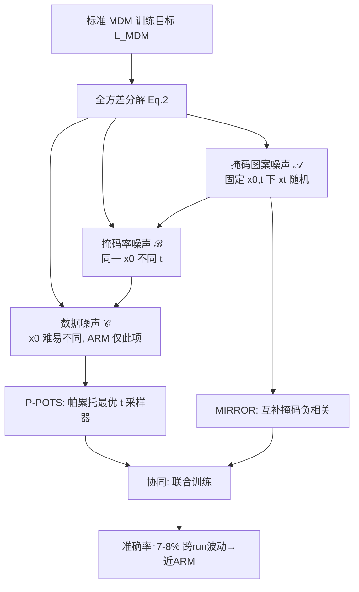

# Bringing Stability to Diffusion: Decomposing and Reducing Variance of Training Masked Diffusion Models

**会议**: ICLR 2026  
**OpenReview**: [https://openreview.net/forum?id=IobTEbQ3vt](https://openreview.net/forum?id=IobTEbQ3vt)  
**代码**: [https://github.com/Qwen-Applications/StableDLLM](https://github.com/Qwen-Applications/StableDLLM)  
**领域**: 掩码扩散模型 / 扩散语言模型 / 训练稳定性  
**关键词**: 掩码扩散模型, 方差分解, 重要性采样, 反相采样, 训练稳定性, dLLM  

## 一句话总结
本文首次把掩码扩散模型（MDM）的训练方差**系统分解**为「掩码图案噪声 + 掩码率噪声 + 数据噪声」三项，并据此设计了以 P-POTS（帕累托最优 $t$ 采样器）和 MIRROR（互补掩码反相采样）为核心的六种方差缩减方法，把 MDM 的复杂推理准确率提升 7–8%、把多次运行间的波动压到接近自回归模型（ARM）的水平。

## 研究背景与动机
- **领域现状**：掩码扩散模型（如 LLaDA-8B、Dream-7B、MMaDA-8B）被视为自回归模型（ARM）之外的有力替代架构，靠「随机掩码率 $t$ + 重建被掩码 token」训练，天然支持并行解码、规避曝光偏差与「逆转诅咒」。
- **现有痛点**：MDM 训练极不稳定。即使预训练后的 MDM 与 ARM 在起点能力相当，在同一任务上微调后 MDM 往往**大幅落后**，且**跨次运行（不同随机种子）结果差异巨大**——损失波动直接转化为梯度更新的剧烈抖动。
- **核心矛盾**：此前缓解方法（Zhu 2025 的对称采样、Arriola 2025 的裁剪噪声调度等）都是**孤立、启发式**的补丁，缺乏统一理论解释「MDM 方差为何比 ARM 高」，也无法说明各方法之间能否互补。
- **本文目标**：从训练目标的定义出发，给出方差的**第一性分解**，再据此构造「无偏但低方差」的替代估计器，从根上稳定 MDM 训练。
- **核心 idea**：**【方差分解】** MDM 在标准训练目标 $L_{\mathrm{MDM}}=\mathbb{E}_{x_0,t,x_t}[l_\theta]$ 下，把总方差精确拆成三源，其中 ARM 只承受其中一源，多出的两源正是 MDM 不稳定的根因——于是「缩减 MDM 方差」被转化为「逐项压制这两个额外噪声源」的清晰工程问题。

## 方法详解

### 整体框架
论文先做理论分解：把 $\mathrm{Var}(l_\theta)$ 按全方差公式展开为三项——掩码图案噪声 $\mathcal{A}$、掩码率噪声 $\mathcal{B}$、数据噪声 $\mathcal{C}$，而 ARM 只有 $\mathcal{C}$。随后针对每一项设计方差缩减手段，其中两个核心方法 P-POTS（重新设计 $t$ 的采样分布，同时压 $\mathcal{A}+\mathcal{B}+\mathcal{C}$）与 MIRROR（用互补掩码的负相关压 $\mathcal{A}$）可叠加协同，另外四种（ISAD、SyRM、StraTS、EMA）作为针对单一噪声源的补充。

### 关键设计

**1. 方差三源分解：把不稳定性翻译成可压制的数学项。** 论文对训练目标按全方差公式逐层展开，得到 $\mathrm{Var}_{x_0,t,x_t}(l_\theta)=\underbrace{\mathbb{E}_{x_0,t}[\mathrm{Var}_{x_t}(l_\theta\mid x_0,t)]}_{\mathcal{A}}+\underbrace{\mathbb{E}_{x_0}[\mathrm{Var}_t(g_\theta\mid x_0)]}_{\mathcal{B}}+\underbrace{\mathrm{Var}_{x_0}(\mathbb{E}_t[g_\theta])}_{\mathcal{C}}$，其中 $g_\theta(x_0,t)=\mathbb{E}_{x_t}[l_\theta\mid x_0,t]$。$\mathcal{A}$ 是固定干净数据 $x_0$ 与掩码率 $t$ 后、仅由具体掩码位置带来的波动；$\mathcal{B}$ 是同一 $x_0$ 在不同 $t$ 下期望损失的变化；$\mathcal{C}$ 是样本本身难易差异。这个分解不依赖任何强假设、自然涌现，因此既能反向解释此前每个方法到底压的是哪一源，也为后续设计提供「逐项瞄准」的靶子。

**2. P-POTS——帕累托最优的 $t$ 采样器，把训练算力投向难区却不让其主导优化。** 标准训练用 $t\sim U[0,1]$，无偏但方差高；P-POTS 改用数据拟合的非均匀分布 $p(t)$ 并以重要性权重 $\tfrac{1}{p(t)}l_\theta$ 保持无偏（$\int_0^1 p(t)\tfrac{1}{p(t)}g(t)\mathrm{d}t=\int_0^1 g(t)\mathrm{d}t$）。把 $\mathcal{A}+\mathcal{B}+\mathcal{C}$ 写成关于 $p(t)$ 的积分 $\int_0^1\tfrac{g(t)^2+v(t)}{p(t)}\mathrm{d}t-(\int_0^1 g(t)\mathrm{d}t)^2$ 后，用拉格朗日乘子求得唯一最优解 $p^*(t)\propto\sqrt{g(t)^2+v(t)}$，它在同时最小化三源上是帕累托最优（无法再有任何采样器同时改进三者）。由于 $g(t),v(t)$ 未知，P-POTS 在训练前用少量蒙特卡洛样本估计散点 $\hat p_j$，再用仅七参数的 **EPR（指数-多项式根）模型** $p_{\mathrm{EPR}}(t)=\sqrt{a t^r+b(1-t)^q+A^2\exp(2\kappa t^m)}$ 拟合——指数项刻画推理链被切断后误差乘性累积导致的高 $t$ 损失爆炸，多项式项刻画关键 token 被掩/幸存这类稀有事件造成的方差双拐点。直觉上 $p^*(t)$ 把更多样本投向「难训」的高 $t$ 区域提供额外训练，而 $1/p^*(t)$ 又压住它们的更新权重，使噪声信号不会主导全局优化；它只需训练前拟合一次、几乎零开销、且无需调参。

**3. MIRROR——互补掩码产生负相关，至少把 $\mathcal{A}$ 砍一半。** 对同一 $(x_0,t)$，MIRROR 生成两个**互补**的噪声样本：$x_t^1$ 在 $U_i<t$ 时掩码、$x_t^2$ 在 $U_i>1-t$ 时掩码，再用平均损失 $\bar l=\tfrac12(l_1+l_2)$ 回传。因 $l_1,l_2$ 同分布，$\mathrm{Var}(\bar l)=\tfrac{\sigma^2}{2}(1+\rho)$，其中 $\rho=\mathrm{Corr}(l_1,l_2)\le 0$，故 MIRROR 永不劣于标准训练；互补设计使 $\rho$ 倾向为负（$t<0.5$ 时两掩码无重叠、负相关更强），从而**至少把 $\mathcal{A}$ 减半**。其直觉是对冲：无论 $x_t^1$ 恰好掩了简单还是困难 token，$x_t^2$ 都提供互补的另一面，平均后仍是可靠估计。相较独立采两次的 MultiSample-2（协方差为 0、双视野覆盖率仅 $2t-t^2$），MIRROR 既有负协方差又把联合覆盖率提到 $\min(1,2t)$。

**4. P-POTS 与 MIRROR 的协同（$1+1>2$）。** 两者基于互不干扰的假设（精确建模 $p(t)$ vs. $(x_t^1,x_t^2)$ 负相关），但叠加收益超过简单相加。代入最优 $p(t)$ 后方差变为 $(\int_0^1\sqrt{g^2+v}\,\mathrm{d}t)^2-(\int_0^1 g\,\mathrm{d}t)^2$，它不再依赖 $p(t)$，只能靠改变 $v(t)$ 进一步降低——要让两积分更接近，应把 $v(t)$ 集中在 $g(t)$ 大的地方。MIRROR 恰好在中等 $t$ 区最强地压低 $v(t)$，相对保留了高 $g(t)$ 区的 $v(t)$，等于把 $v(t)$ 推向 P-POTS 偏好的方向：MIRROR 清扫中段、P-POTS 强调两端，彼此强化。

**5. 四种补充技法，各自瞄准单一噪声源。** ISAD 把掩码概率偏向答案分隔符 token、用 $1/q_j(t)$ 重加权保持无偏以压 $\mathcal{A}$；SyRM 针对 HTML 表格/代码等结构化数据，把语法 token 也纳入可掩集合、以可控小偏差换取 $\mathcal{A}$ 下降；StraTS 用分层采样（推荐 $k=\lceil\sqrt n\rceil$ 而非 $k=n$）通过层间方差压 $\mathcal{B}$；EMA 在 $t$ 的分箱内维护损失的指数移动平均作为控制变量压 $\mathcal{B}$，并给出选箱数的经验规则。它们多作为实验中的 baseline 方法对照核心方法。

## 实验关键数据

### 主实验（每种子准确率，LLaDA-8B-Instruct）

| 方法 (Seed) | OpenScience Avg | GSM8K Avg | HiTab Avg |
|---|---|---|---|
| **P-POTS+MIRROR** | **52.53** | **60.53** | **67.10** |
| P-POTS | 46.80 | 58.58 | 61.37 |
| MIRROR | 46.38 | 53.70 | 64.48 |
| 标准训练 (区间) | — | 50.6–53.7 | 52.9–62.6 |

### 关键发现
- **跨任务一致提升**：在复杂推理任务上准确率提升约 **7–8%**（GSM8K 从 50.6–53.7% 升至 58.6–62.0%；HiTab 从 52.9–62.6% 升至 66.0–68.6%）。
- **方差大幅收窄**：多次运行波动被压到**接近 ARM 水平**；在多数设置下，「最优 baseline 的最好一次运行」都低于「本文方法的最差一次运行」。
- **多模态同样有效**：在 text-to-image-2M 上，MMaDA-8B 的 CLIP 分区间从 28.61–34.28 收窄并整体抬升到 34.10–35.27；同种子下 P-POTS+MIRROR 生成图像质量明显优于标准训练。
- **成本-收益取舍**：P-POTS 几乎零开销、单独使用即有显著增益（推荐做性价比方案）；MIRROR 因多一次前向而约翻倍训练成本，但在长响应数据上尤其有效，二者叠加给出最强结果。

## 亮点与洞察
- **从「打补丁」到「立框架」**：第一份 MDM 训练方差的系统分解，把零散的启发式方法统一进一张「各自压哪一源」的表，是本文最大的概念贡献。
- **理论与可落地兼得**：每个方法都有证明或分析支撑，却又简单到几乎不调参（P-POTS 训练前拟合一次、MIRROR 只是改采样），工程门槛极低。
- **协同的非平凡性**：P-POTS×MIRROR 的「$1+1>2$」不是口号，而是从最优 $p(t)$ 代入后对 $v(t)$ 形状的精确论证，体现了分解框架的指导力。

## 局限与展望
- **P-POTS 的漂移问题**：$p^*(t)$ 只在训练前拟合一次，模型演化后采样器可能过时；论文观察到漂移通常缓慢但在高损失场景（如 MMaDA 训文生图）可能加剧，自适应周期性重拟合留作未来工作。
- **验证范围偏窄**：受资源限制主要在**监督微调**上验证、文本侧仅一个 MDM（LLaDA-8B），预训练场景与更多 MDM 架构的普适性尚待确认。
- **MIRROR 成本翻倍**：额外前向使训练成本约 2×，对超长序列或算力紧张场景不友好。
- **EPR 模型设定**：七参数指数-多项式形式虽拟合好，但其结构来自经验直觉，是否对所有数据/模态都最优仍是开放问题。

## 相关工作与启发
- **连续扩散方差缩减**：Meng 2021（对称噪声）、Xu 2023（自归一化重要性采样）、Jeha 2024（泰勒控制变量）多面向连续扩散、且各有偏差/退化问题，难直接迁移到离散掩码扩散——本文指出正是缺乏统一分解才使它们孤立。
- **MDM 专属方法**：Zhu 2025（偏好优化中的对称采样压 $\mathcal{A}$）、Kim 2024（在线梯度方差自适应采样压 $\mathcal{B}$ 但有偏）、Arriola 2025（裁剪噪声调度压三源但靠粗候选区间启发式）——本文用分解框架解释了它们的增益来源，并指出极端 $t$ 值其实值得强调而非裁掉。
- **启发**：方差分解+逐项瞄准的范式可推广到其他带随机性的训练目标（如连续扩散、RL 估计器）；「重要性采样投难区但压更新权重」是处理高方差区域的通用思路。

## 评分
- **新颖性**: ⭐⭐⭐⭐⭐ 首个 MDM 训练方差系统分解，把杂乱补丁统一进第一性框架，并据此推导帕累托最优采样器，概念贡献突出。
- **实验充分度**: ⭐⭐⭐⭐ 覆盖三文本数据集+一多模态、多种子重复验证波动、与强 baseline 对比；但仅监督微调、文本侧单一 MDM，预训练与更广架构未充分验证。
- **写作质量**: ⭐⭐⭐⭐ 理论推导清晰、图示直观，六方法与三噪声源对应明确；公式较密集对读者有一定门槛。
- **价值**: ⭐⭐⭐⭐⭐ 直击 dLLM 落地的核心痛点（训练不稳定），方法近乎零调参、即插即用且开源，对扩散语言模型社区有很强实用价值。

<!-- RELATED:START -->

## 相关论文

- [\[ICLR 2026\] What Exactly Does Guidance Do in Masked Discrete Diffusion Models](what_exactly_does_guidance_do_in_masked_discrete_diffusion_models.md)
- [\[ICLR 2026\] Any-Order Flexible Length Masked Diffusion](any-order_flexible_length_masked_diffusion.md)
- [\[ICLR 2026\] Quantization-Aware Diffusion Models for Maximum Likelihood Training](quantization-aware_diffusion_models_for_maximum_likelihood_training.md)
- [\[ICCV 2025\] SliderSpace: Decomposing the Visual Capabilities of Diffusion Models](../../ICCV2025/image_generation/sliderspace_decomposing_the_visual_capabilities_of_diffusion_models.md)
- [\[ICLR 2026\] Improving Diffusion Models for Class-imbalanced Training Data via Capacity Manipulation](improving_diffusion_models_for_class-imbalanced_training_data_via_capacity_manip.md)

<!-- RELATED:END -->
