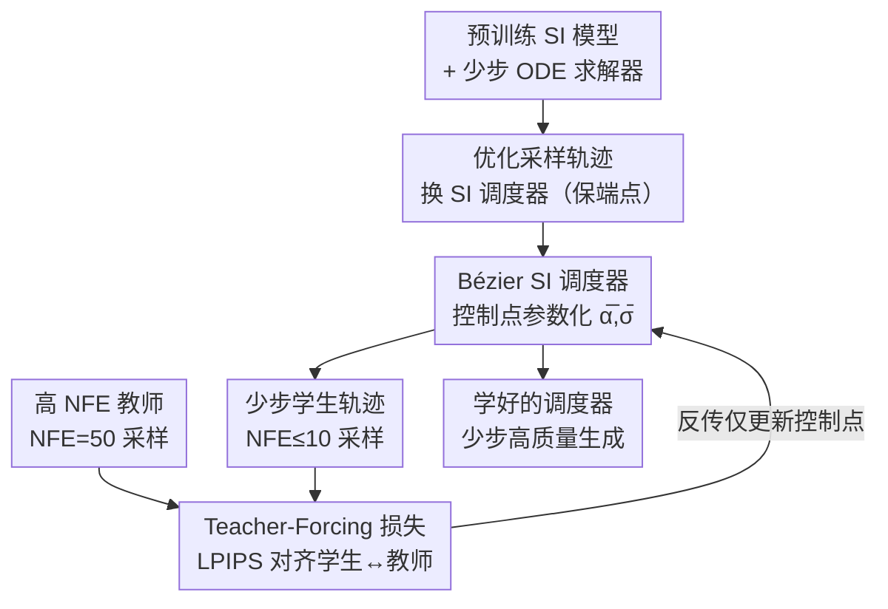

# BézierFlow: Learning Bézier Stochastic Interpolant Schedulers for Few-Step Generation

**会议**: ICLR2026  
**OpenReview**: [https://openreview.net/forum?id=PCuDI32xhQ](https://openreview.net/forum?id=PCuDI32xhQ)  
**项目页**: https://bezierflow.github.io  
**代码**: 待确认  
**领域**: 扩散模型 / 少步生成  
**关键词**: 少步采样, 随机插值, 贝塞尔曲线, 调度器学习, 轻量训练

## 一句话总结
BézierFlow 把"少步生成要优化什么"从离散的 ODE 时间步换成连续的随机插值（SI）调度器，并用贝塞尔曲线的控制点来参数化这个调度器，只花 15 分钟轻量训练就让预训练扩散/流模型在 ≤10 步采样下 FID 提升 2–3 倍。

## 研究背景与动机
**领域现状**：扩散模型和流模型质量很高，但生成要迭代几十上百步，开销大。加速路线主要有三条：① 设计专用 ODE 求解器（DPM-Solver、UniPC、iPNDM 等），免训练但很难压到个位数步；② 蒸馏（一致性模型、ReFlow 等），能压到 1–2 步却要几百上千 GPU 小时微调；③ **轻量训练**——只在预训练模型外面学几个参数，几十分钟训练就能显著改善小 NFE（函数评估次数）下的质量。

**现有痛点**：现有轻量训练方法几乎都在做同一件事——**学最优的 ODE 时间步序列**。GITS 按轨迹曲率分配步数，DMN 最小化数值积分的局部误差，最具代表性的 LD3 用高 NFE 求解器当"教师"、低 NFE 当"学生"做 teacher-forcing 蒸馏时间步。但无论怎么学，它们的搜索空间都被锁死在"在固定采样轨迹上挑哪几个离散时刻落点"。

**核心矛盾**：采样轨迹本身的几何形状（而不只是落点）直接决定了少步离散化误差的大小，但"只学时间步"压根没碰轨迹形状这个更大的自由度。唯一尝试学轨迹的 Bespoke Solver 用的是**离散参数化**，导致函数值和它的导数要分开建模、彼此对不齐，难以表达一个真正可微的轨迹。

**本文目标**：把轻量训练的优化对象从"离散时间步"升级到"连续采样轨迹"，同时保证这个轨迹是一个合法的 SI 调度器。

**切入角度**：随机插值（Stochastic Interpolant, SI）框架给了一个统一视角——扩散、流、score-based 模型都可以写成源样本和目标样本之间的线性插值 $x(t)=\alpha(t)x_1+\sigma(t)x_0$，插值系数对 $(\alpha,\sigma)$ 就叫"调度器"，它完全决定了采样轨迹的几何。关键事实是：**在推理时换一个调度器并不改变端点的边缘分布**，所以可以放心地把调度器当成可学变量去优化轨迹形状，而不需要重新训练模型。

**核心 idea**：学一个用贝塞尔曲线参数化的 SI 调度器——既把搜索空间从"离散时间步"扩到"连续轨迹变换"，又靠贝塞尔控制点天然满足调度器必须的边界条件、单调性和可微性三大约束。

## 方法详解

### 整体框架
BézierFlow 是套在预训练模型外的轻量优化器。输入是一个预训练 SI 模型 $S_\phi$（扩散或流）和一个指定的少步 ODE 求解器；输出是一组学好的贝塞尔控制点，它们定义出一条新的目标采样轨迹，推理时沿这条轨迹只走 ≤10 步就能逼近教师几十步的质量。

整体逻辑分三层：**优化什么**——不动模型权重，只换采样轨迹，而轨迹由 SI 调度器 $(\bar\alpha_s,\bar\sigma_s)$ 决定（§4.2 把"换调度器"形式化成保端点的路径重参数化）；**怎么参数化**——把 $\bar\alpha,\bar\sigma$ 各表示成一条 1D 贝塞尔曲线，只学中间的控制点（§4.3）；**怎么训**——用 teacher-forcing：高 NFE 求解器沿源轨迹生成"教师输出"，低 NFE 求解器沿目标贝塞尔轨迹生成"学生输出"，最小化两者的 LPIPS 距离（§4.1）。整条管线只在反向传播里更新 $2(n-1)$ 个控制点参数，所以 15 分钟就能收敛。

### 关键设计

**1. 优化采样轨迹而非 ODE 时间步：把调度器当成保端点的路径变换**

这一步针对"只学离散时间步、搜索空间太窄"的痛点。作者不再在固定轨迹上挑落点，而是直接优化轨迹本身。形式化上，源轨迹用源调度器 $(\alpha_t,\sigma_t)$ 决定（即模型训练时用的轨迹），目标轨迹用待优化的目标调度器 $(\bar\alpha_s,\bar\sigma_s)$ 决定，两条轨迹共享同样的端点 $x_0,x_1$。作者借用 Karras 等人的缩放重参数化技巧把目标态从源态导出 $\bar{x}_s=c_s x_{t_s}$，其中 $c_s=\bar\sigma(s)/\sigma(t_s)=\bar\alpha(s)/\alpha(t_s)$，时间映射 $t_s=\rho^{-1}(\bar\rho(s))$、$\rho(t)=\alpha(t)/\sigma(t)$（即信噪比 SNR）。由于 SNR 随时间单调递增，$\rho,\bar\rho$ 都可逆，于是目标轨迹上的速度场可由链式法则闭式得到：

$$\bar{u}_s(\bar{x}_s)=\Big(\partial_s\log c_s\Big)\bar{x}_s+c_s\frac{dt_s}{ds}\,u_{t_s}\!\Big(\frac{\bar{x}_s}{c_s}\Big).$$

之所以这样换是合法的：SI 模型的训练目标只要 SNR 的两端点（最小/最大值）不变就与具体调度形状无关，且换调度器不改变端点边缘分布。所以学 $(\bar\alpha_s,\bar\sigma_s)$ 只动了轨迹几何、从而改变少步离散化行为，却不动目标分布、也不用换预训练模型——这正是它比"只挑时间步"自由度大得多的根源。

**2. Bézier SI 调度器：用控制点天然满足边界/单调/可微三约束**

一旦决定优化的是 1D 连续函数 $\bar\alpha(s),\bar\sigma(s)$，难点立刻变成"怎么参数化才能保证它是合法调度器"。SI 调度器必须满足三件事：(i) 边界条件（系数端点固定）、(ii) 单调性（保证 SNR 沿采样路径严格非降）、(iii) 可微性（这样设计 1 里的速度才算得出来）。任意 1D 函数空间太大没法学，普通多项式又不容易同时压住这三条。作者的答案是 $n$ 阶**贝塞尔曲线**：

$$B(\lambda)=\sum_{i=0}^{n}b_{i,n}(\lambda)\,C_i,\quad b_{i,n}(\lambda)=\binom{n}{i}(1-\lambda)^{n-i}\lambda^{i}.$$

贝塞尔曲线的好处是它**按顺序穿过控制点**，于是三大约束都化简成对控制点的简单操作：把首尾控制点钉死成时间区间端点（$C_0^{(\alpha)}=C_0^{(\sigma)}=0,\ C_n^{(\alpha)}=C_n^{(\sigma)}=1$）就满足边界；它本身 $C^\infty$ 光滑、还有闭式导数 $\dot{B}(\lambda)=n\sum b_{i,n-1}(\lambda)(C_{i+1}-C_i)$ 满足可微；只要让控制点非降就满足单调。实现上只把 $n-1$ 个内部控制点设为可学参数 $\theta\in\mathbb{R}^{n-1}$，并用累积 softmax $\psi(\theta)_i=\sum_{j\le i}\mathrm{softmax}(\theta)_j$ 把它们映成单调序列，从而保证 $\bar\rho(s)=\bar\alpha(s)/\bar\sigma(s)$ 在 $[0,1)$ 上严格非降、$\bar\rho^{-1}$ 存在。这一招还有个巧妙之处：学一组有序控制点和此前 LD3 学一串非降时间步在"参数类型"上完全一样，只是把"ODE 时间步"重新解释成"贝塞尔控制点"，从而免费把搜索空间从离散撑到连续。相比 Bespoke Solver 的离散参数化（值和导数要分开学、容易零阶/一阶不一致导致优化不稳），贝塞尔参数化让导数直接从值闭式算出，优化更稳。

**3. Teacher-Forcing 轨迹级训练目标：用 LPIPS 对齐教师与学生**

有了可学的调度器，怎么知道学得好不好？作者沿用 LD3 的 teacher-forcing 思路：把目标写成最小化教师分布 $q(x_1)$ 与学生分布 $\bar p_\theta(x_1)$ 的 KL 散度 $\min_\theta D_{\mathrm{KL}}(q\,\|\,\bar p_\theta)$，实际优化其可处理的代理目标——让同一初始噪声 $x_0$ 下，多步教师求解器 $\xi(x_0,\{t_i\}_{i=1}^N)$ 和少步学生求解器 $\bar\xi_\theta(x_0,\{s_i\}_{i=1}^M)$（$M\ll N$）的输出对齐：

$$\min_\theta\ \mathbb{E}_{x_0\sim p_0}\Big[d\big(\xi(x_0,\{t_i\};S_\phi),\ \bar\xi_\theta(x_0,\{s_i\};S_\phi)\big)\Big],$$

其中距离 $d(\cdot,\cdot)$ 取 LPIPS。和 Bespoke Solver 的逐步误差最小化不同，这里是**全局轨迹级**的输出对齐——只优化目标调度器系数、复用预训练模型，所以训练极轻量。直观上（论文 Fig.1）：学生在 NFE=3 时的初始轨迹会偏离目标分布，但用 BézierFlow 训完后，这条只走 3 步的轨迹会紧贴教师 50 步的轨迹。

### 损失函数 / 训练策略
目标即上式的 LPIPS teacher-forcing 损失。默认用 32 个控制点（$n=32$）做贝塞尔参数化；目标调度器初始化为线性 SI 调度器（$\bar\alpha(s)=s,\bar\sigma(s)=1-s$）；扩散模型按 SNR $\rho(s)$ 均匀设时间步、流模型按时间 $s$ 均匀设。训练样本极少（CIFAR-10 各 200，FFHQ/AFHQv2/ImageNet 各 50，SD 各 25 张），CIFAR-10/FFHQ/AFHQv2 训 8 个 epoch、其余 5 个，单卡约 15 分钟。

## 实验关键数据

### 主实验
在扩散模型（EDM）和流模型（ReFlow/FlowDCN/SD v3.5）上、用 FID（5 万生成样本）评测少步生成。下表摘扩散模型上最能说明问题的小 NFE 段（FID 越低越好）：

| 数据集 / 求解器 | NFE | 基础求解器 | LD3（次优） | BézierFlow |
|--------|------|------|----------|------|
| CIFAR-10 / UniPC | 4 | 50.30 | 12.04 | **9.55** |
| CIFAR-10 / iPNDM | 4 | 29.53 | 9.97 | **6.93** |
| FFHQ / UniPC | 4 | 47.62 | 22.48 | **17.05** |
| CIFAR-10 / UniPC | 10 | 6.16 | 2.62 | **2.09**（教师 2.08）|

流模型上提升更猛：CIFAR-10 + RK1 在 NFE=4 时 BézierFlow 20.64，比次优 LD3（38.95）领先 18.31；ImageNet + FlowDCN 在 NFE=6/8/10 全面最优（如 NFE=6：6.85 vs LD3 11.94）。

### 消融实验

| 配置 / 分析 | 关键指标 | 说明 |
|------|---------|------|
| 贝塞尔阶数 $n$:4→32 | FID 单调下降 | $n=16$→$32$ 收益变小，故取 32；训练时间几乎不增 |
| 泛化到未见 NFE（训 10 用于 6/8） | RK2 NFE=6: 9.57 | 优于直接在 NFE=6 训练的 LD3(13.82)/Bespoke(64.87) |
| vs 蒸馏 CD（CIFAR-10）| 2.09/NFE=10，15 分钟 | CD 2.93/NFE=2 但要 8 天，BF 训练成本约其 0.13% |
| 与 LD3 联合优化 | 无明显增益 | 说明 LD3 的优势已被学好的调度器涵盖 |

### 关键发现
- **连续参数化带来"跨 NFE 泛化"**：因为学的是连续函数而非逐步离散变量，BézierFlow 训一次（NFE=10）就能直接用到 NFE=6/8，且打过专门在那些 NFE 上训练的基线——这是离散方法做不到的。
- **小 NFE 段优势最大**：NFE=4 这类极少步场景下相对次优方法的领先幅度最显著，正好对应"轨迹几何在大离散化误差下更重要"的假设。
- **轨迹形状确实比落点更值得学**：把 LD3 的时间步和本文调度器联合优化并不带来额外提升，反向印证"学连续轨迹"已经吃掉了"学离散时间步"的全部好处。

## 亮点与洞察
- **把问题做了一次漂亮的"换变量"**：学的参数类型（一串有序点）和 LD3 完全一样，只是把它从"ODE 时间步"重新诠释为"贝塞尔控制点"，就免费把搜索空间从离散撑到连续——几乎零额外成本拿到更大自由度。
- **用贝塞尔曲线一次性满足三个硬约束**：边界条件靠钉首尾点、可微靠多项式闭式导数、单调靠累积 softmax，三个调度器必备性质全落在控制点的简单操作上，避免了"为可微性额外建模导数"的麻烦（Bespoke Solver 的坑）。
- **极致性价比**：15 分钟、几十张训练图、不动模型权重，就拿到逼近 8 天蒸馏的质量——这套"轻量训练只学调度器"的范式可迁移到任何能写进 SI 框架的生成模型。

## 局限与展望
- **作者提出的方向**：探索贝塞尔以外的基函数，或许能用更少控制点换更强表达力。
- **依赖教师可得**：teacher-forcing 需要一个高 NFE 教师求解器先跑出参考输出，本质是把教师的多步质量"蒸"进调度器，无法超越教师上限。
- **个别设置非全胜**：在 ImageNet NFE=4 等少数配置上并非最优（如 RK1 NFE=4 时 15.60 略逊基线 12.03），说明轨迹学习在极少步+大分辨率下仍有边界。
- **只在图像生成验证**：实验集中在图像 FID，跨模态（视频/音频/3D）和文本-图像对齐等更复杂目标下的表现还需进一步验证。

## 相关工作与启发
- **vs LD3（Tong et al., 2025）**: 两者参数类型相同（学非降序列），但 LD3 把参数解释为离散 ODE 时间步、搜索空间是本文的子集；BézierFlow 解释为连续贝塞尔控制点，搜索空间更大，且能泛化到未见 NFE，性能全面更优。
- **vs Bespoke Solver（Shaul et al., 2024）**: 同样想学最优采样轨迹，但它用离散参数化、值和导数要分开建模、易出现零阶/一阶不一致导致优化不稳；本文贝塞尔参数化保证 $C^2$ 光滑、导数闭式可算、优化更稳，且用全局轨迹级 LPIPS 损失而非逐步误差。
- **vs 专用 ODE 求解器（DPM-Solver / UniPC / iPNDM）**: 那些免训练但压不到个位数步；本文是套在其上的轻量学习层，进一步把少步质量拉高。
- **vs 蒸馏（一致性模型 / ReFlow）**: 蒸馏能压到 1–2 步但要几百上千 GPU 小时；本文用 0.13% 的训练成本换到 ≤10 步下可比甚至更好的 FID。

## 评分
- 新颖性: ⭐⭐⭐⭐⭐ 把优化对象从离散时间步升级到贝塞尔参数化的连续 SI 调度器，视角干净且自由度更大
- 实验充分度: ⭐⭐⭐⭐ 覆盖扩散/流、多数据集、多求解器、多 NFE，并有阶数/泛化/效率/联合优化消融；个别极端设置非最优
- 写作质量: ⭐⭐⭐⭐⭐ SI 框架铺垫到贝塞尔参数化的推导清晰、动机层层递进
- 价值: ⭐⭐⭐⭐⭐ 15 分钟轻量训练换 2–3× 少步质量提升，即插即用，实用性强

<!-- RELATED:START -->

## 相关论文

- [\[ICLR 2026\] DistillKac: Few-Step Image Generation via Damped Wave Equations](distillkac_few-step_image_generation_via_damped_wave_equations.md)
- [\[ICLR 2026\] PairFlow: Closed-Form Source-Target Coupling for Few-Step Generation in Discrete Flow Models](pairflow_closed-form_source-target_coupling_for_few-step_generation_in_discrete_.md)
- [\[CVPR 2026\] Refining Few-Step Text-to-Multiview Diffusion via Reinforcement Learning](../../CVPR2026/image_generation/refining_few-step_text-to-multiview_diffusion_via_reinforcement_learning.md)
- [\[CVPR 2026\] LogCD: Local-to-global Consistency Distillation for Few-step Image Generation](../../CVPR2026/image_generation/logcd_local-to-global_consistency_distillation_for_few-step_image_generation.md)
- [\[NeurIPS 2025\] BoltzNCE: Learning Likelihoods for Boltzmann Generation with Stochastic Interpolants](../../NeurIPS2025/image_generation/boltznce_learning_likelihoods_for_boltzmann_generation_with_stochastic_interpola.md)

<!-- RELATED:END -->
