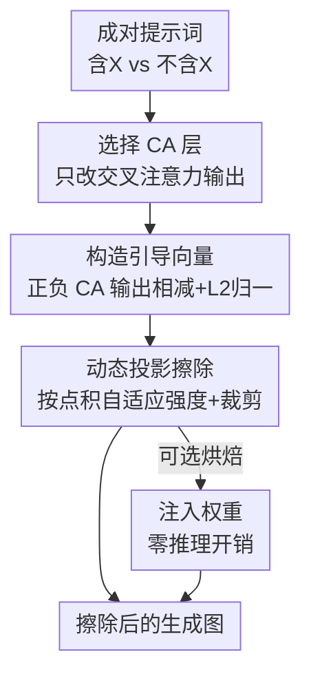

# CASteer: Cross-Attention Steering for Controllable Concept Erasure

**会议**: ICLR2026  
**OpenReview**: [https://openreview.net/forum?id=6D5Odqol1B](https://openreview.net/forum?id=6D5Odqol1B)  
**代码**: https://github.com/Atmyre/CASteer  
**领域**: 扩散模型 / AI 安全  
**关键词**: 概念擦除, 扩散模型, 引导向量, 交叉注意力, 免训练

## 一句话总结
CASteer 是一个**免训练**的扩散模型概念擦除框架：先用成对正/负提示词预计算每个概念在交叉注意力层的「引导向量」，推理时按当前激活与该向量的投影大小动态地把这个方向减掉，从而只在概念真正出现的图块上精准抹除它（裸露、暴力、特定角色/画风都行），同时几乎不动其他内容，在多个基准上超过所有需要训练的 SOTA。

## 研究背景与动机

**领域现状**：扩散模型让文生图质量突飞猛进，但也带来滥用风险（deepfake、裸露、暴力、版权角色/画风），于是出现了大量「概念擦除」方法，想让模型从源头上不再生成某些内容。主流路线有三类：基于 LoRA 微调去抹掉特定对象/画风、改模型权重（UCE、RECE、MACE）、以及在文本侧做负提示或编辑 token embedding。

**现有痛点**：这些方法几乎都要**针对每个概念训练或改权重**，代价高、扩展性差——擦多个概念往往要多个 adapter 或反复重训。更关键的是它们各有偏科：LoRA/权重编辑类对「具体概念」（如 Snoopy）有效，但对「抽象概念」（裸露、暴力这种没有固定视觉锚点的）力不从心；文本侧方法灵活但精度差，在离散 token 空间里 erasure 与保留其他特征的 trade-off 很死，而且文本「看起来安全」时模型照样能画出不该画的东西。

**核心矛盾**：擦除强度与无关内容保留之间存在根本性 trade-off。一刀切地压制概念（固定强度）会误伤；而要做到「只在该概念真正出现的地方、按它出现的强度去压」，就需要一种能**逐图块、逐去噪步动态判断概念存在量**的机制——这恰恰是现有方法缺失的。

**切入角度**：作者建立在「深度网络把特征编码进近似线性子空间」这一发现上。既然扩散主干的中间表示里存在能调节某个特征强弱的线性方向，那么概念擦除就可以转化为：找到代表该概念的方向，然后把表示沿这个方向投影的分量减掉——完全不用训练。

**核心 idea**：用一对「含/不含某概念」的提示词之差，在**交叉注意力输出**空间里算出该概念的引导向量，推理时按激活在该向量上的投影量动态减去它，实现免训练、上下文感知的精准概念擦除。

## 方法详解

### 整体框架

CASteer 的运作原则一句话：在推理时修改扩散主干**某些中间层的输出**，让生成图像的语义里不出现目标概念。整条管线分两段——**离线**为每个概念预计算一组引导向量，**在线**在每个去噪步把这些向量按需减掉。

离线阶段：给定要操控的概念 $X$（如「巴洛克画风」），构造只在是否含 $X$ 上有差异的成对提示词 $p_{pos}$ / $p_{neg}$，分别跑一遍生成，保存所有 $N$ 个交叉注意力（CA）层、所有 $T$ 个去噪步的 CA 输出，在图块维度上平均后正负相减并 L2 归一化，得到逐层逐步的引导向量 $ca^X_{it}$。

在线阶段：正常去噪，但在每一步、每个 CA 层，用当前 CA 输出与 $ca^X_{it}$ 的**点积**估计「这个图块里含有多少 $X$」，再减去与该点积成正比的引导向量分量——概念存在量大的图块减得多，无关图块几乎不动。最后还可把这套操作直接**烘焙进模型权重**，做到零推理开销。

### 关键设计

**1. 选择交叉注意力层做引导：把语义控制点对准文本进图的唯一入口**

现代扩散主干（U-Net 或 DiT）每个 Transformer block 都有交叉注意力（CA）、自注意力（SA）、MLP 三类层。作者指出：**CA 层是整个模型里文本提示信息进入图像的唯一通道**——对每个图块和提示 embedding，CA 层生成一个与图块 embedding 同尺寸的向量，求和后把文本信息注入对应图像区域。既然图像语义主要由文本决定，那么改 CA 输出就能在「有效」与「精准」之间取得最好的平衡：改得到位，又不会像改 SA/MLP 那样波及大量与文本无关的结构。因此 CASteer 只为每个 CA 层的输出构造引导向量（附录里也试了 SA、MLP，效果不如 CA）。

**2. 引导向量构造：用正负提示之差在激活空间里"指出"概念方向**

针对概念 $X$，造一对只差 $X$ 的提示（如 $p_{pos}$=「一个人，巴洛克画风」、$p_{neg}$=「一个人」）。两条提示各生成一遍，保存全部 $N$ 层 $\times$ $T$ 步的 CA 输出对 $\langle ca^{pos}_{it}, ca^{neg}_{it}\rangle$。每个输出尺寸是 `patch_num × emb_size`，先在图块维度上平均：

$$ca^{pos\_avg}_{it} = \frac{1}{\text{patch\_num}_i}\sum_k ca^{pos}_{itk}, \quad ca^{neg\_avg}_{it} = \frac{1}{\text{patch\_num}_i}\sum_k ca^{neg}_{itk}$$

再相减并 L2 归一化，得到承载概念 $X$ 的引导向量：

$$ca^X_{it} = f_{norm}(ca^{pos\_avg}_{it} - ca^{neg\_avg}_{it})$$

直觉上它是激活空间里从「不含 $X$ 的区域」指向「含 $X$ 的区域」的方向。和 SDID 那类「为每个概念学一个向量」的做法相比，这里完全不训练、只靠前向激活做差，且对每层每步都单独算，方向更细。

**3. 动态投影擦除 + 中间裁剪：按图块的概念存在量自适应地"减"，并用 β=2 的镜面反射保住其余信息**

固定强度地减引导向量（$ca^{new}_{itk} = ca_{itk} - \alpha\, ca^X_{it}$）有个问题：同一概念在不同提示、不同图块里的强度不同（「生气的人」vs「暴怒的人」），用同一个 $\alpha$ 要么压不干净要么误伤。作者的关键观察是：因为 $ca^X_{it}$ 已归一化，**当前 CA 输出与它的点积 $\langle ca^X_{it}, ca_{itk}\rangle$ 就是该输出在概念方向上的投影长度，等于这个图块里含有多少 $X$**。于是让减去的量正比于这个点积：

$$ca^{new}_{itk} = ca_{itk} - \beta\langle ca^X_{it}, ca_{itk}\rangle\, ca^X_{it}$$

矩阵形式即一个朝 $s = ca^X_{it}$ 正交子空间的投影算子 $s^{new} = (I - \beta s s^T)c$。再加一步**中间裁剪**：只对点积为正（确实含 $X$）的图块动手，$\alpha = \max(\beta\langle ca^X_{it}, ca_{itk}\rangle, 0)$，避免给本来就不含该概念的区域反向「注入」。$\beta$ 控制擦除强度，作者全程取 $\beta=2$——此时 $(I - 2ss^T)$ 恰好是 Householder 反射（镜面对称），它**保持向量 $c$ 的 L2 范数**，也就是把与 $s$ 正交的所有信息原封不动保留下来，只翻转概念方向上的分量，这正是「擦概念却不掉画质」的数学根据（实验显示 FID 反而优于多数对手）。

**4. 工程化：跨蒸馏模型迁移 + 烘焙进权重，做到多概念、零开销**

几条让方法真正好用的实操：① **多提示更稳**——用 $P$ 对提示求平均再做差，方向更准；② **多概念擦除**——把多个概念的引导向量两两正交化后顺次施加，或直接平均成一个向量同时压多个概念（实验里抹「不当内容」就是七类向量平均）；③ **从蒸馏模型迁移引导向量**——SDXL-Turbo / Sana-Sprint 这类一步蒸馏模型只需 1 步去噪（$T=1$，没有 $t$ 维），算出的单个引导向量可直接拿去引导对应的非蒸馏大模型每一步，省掉在大模型上逐步采样的开销；④ **注入权重零开销**——SDXL/SANA 的 CA block 末层是无 bias 无激活的纯线性层 $h_{out} = W_{proj\_out}h_{in}$，把 Eq.5 的 $(I - ss^T)$ 直接左乘进这个权重矩阵 $W^s_{proj\_out} = (I - ss^T)W_{proj\_out}$，擦除操作就固化进权重，推理时相比原模型**零额外开销**（类似 LoRA 融合）。

### 损失函数 / 训练策略
无。CASteer **完全免训练**：离线只是前向跑提示采集激活、做差归一化得到引导向量；在线只是逐步逐图块做投影减法。没有任何参数更新、梯度或微调。

## 实验关键数据

主干用 SD-v1.4 做主对比（无 Turbo 版，故用其自身逐步引导向量），$\beta=2$，对所有 CA 层施加引导；具体概念用 50 对提示、抽象概念用 196 对提示构造向量。更大的 SDXL / SANA 用各自蒸馏版（Turbo / Sprint）的引导向量。

### 主实验

**裸露擦除**（I2P 数据集，NudeNet 阈值 0.6，检出总数越低越好）：

| 方法 | 裸露检出总数 ↓ |
|------|----------------|
| SD v1.4（原始） | 646 |
| RECE | 66 |
| CPE (four word) | 40 |
| AdvUnlearn（需对抗训练） | 23 |
| SAeUron | 18 |
| **CASteer (w/o clip)** | 12 |
| **CASteer (clip)** | **7** |

带裁剪版只剩 7 张检出，比第二名（SAeUron 18）**少一半多**，且 CASteer 不需任何训练。

**不当内容整体擦除**（I2P，Q16 分类器，不当内容占比 %）：CASteer (clip) 总体 **25.58%**，超过第二名 Receler（27.0%）约 1.42 个百分点，在 sexual、illegal activity 等类别上领先尤其明显。

**画风擦除**（去 Van Gogh / Kelly McKernan，LPIPSe↑ 擦得彻底、Acce↓ 识别不出目标画风、Accu↑ 保留其他画风）：

| 方法 | 去 Van Gogh: Acce ↓ | 去 McKernan: Acce ↓ |
|------|---------------------|---------------------|
| UCE | 0.95 | 0.80 |
| SAFREE | 0.35 | 0.40 |
| **Ours (clip)** | **0.25** | **0.05** |

CASteer 在抹掉目标画风的同时把无关画风保留得最好。

### 消融实验

| 配置 | 现象 | 说明 |
|------|------|------|
| 动态 α（投影）vs 固定 α | 固定强度要么压不净要么误伤 | 按点积自适应是精准擦除的关键 |
| w/ 中间裁剪 (Eq.6) | 裸露检出 12→7、不当内容更低 | 只压含概念的图块，进一步减少误伤 |
| $\beta=2$（Householder 反射） | 保 L2 范数，FID 优于多数对手 | 正交信息原样保留，故画质不掉 |
| $\beta<2$ | 擦除变弱但画质仍高 | 可平滑控制擦除程度 |
| SDXL/SANA 下 $\beta>2$ | 擦除更强且画质仍高 | 大模型可调更激进 |

**通用画质**（COCO-30k）：CASteer (clip) FID **13.02**、CLIP 31.09，FID 优于所有对手，说明擦除没伤到正常生成。

### 关键发现
- **动态投影 + 裁剪是涨点核心**：把固定 $\alpha$ 换成正比于点积的自适应量、再只对正点积图块动手，是裸露检出从两位数压到个位数的关键。
- **能擦"隐式定义"的概念**：提示「a mouse from Disneyland」没点名 Mickey，CASteer 仍能擦掉 Mickey，而 SPM、DoCo 这类方法在隐式提示下失效——因为 CASteer 在图像-文本联合潜空间动手，不依赖文本里是否显式出现概念词。
- **抽象 + 具体通吃且可扩展**：裸露/暴力（抽象）与 Snoopy/画风（具体）都能擦，还能多概念同时擦，这是需训练的 LoRA/权重编辑类难以兼顾的。
- **$\beta=2$ 的 Householder 反射**给了「擦概念不掉画质」一个干净的数学解释：只翻转概念方向、保留正交分量的全部信息。

## 亮点与洞察
- **把概念擦除变成线性投影**：核心洞见是「CA 输出在引导向量上的投影长度 = 该图块含多少目标概念」，于是擦除 = 减掉这个投影分量。一个点积同时承担了「检测概念是否存在」和「决定减多少」两件事，优雅且免训练。
- **$\beta=2$ 选成 Householder 反射**特别巧：不是随手调的超参，而是让变换保 L2 范数、从而保住所有正交信息——把「不掉画质」从经验现象变成可证的性质。
- **蒸馏模型迁移引导向量**这个 trick 可迁移性强：用 1 步蒸馏模型采一个向量去控制多步大模型，本质是「在便宜模型上找方向、在贵模型上用方向」，对任何需要逐步采样的可控生成都有借鉴价值。
- **烘焙进权重做到零开销**：利用 CA block 末层是纯线性这一结构，把投影算子融进权重，部署时与原模型同速——比 LoRA 还轻。

## 局限与展望
- **依赖提示词配对质量**：引导向量完全由成对提示之差决定，抽象概念要 196 对提示才稳，提示设计不当可能让方向不准；论文也承认需要精心准备提示。
- **概念方向的线性假设**：方法建立在「概念可由激活空间一个线性方向表示」上，对高度纠缠或上下文强依赖的概念，单一线性方向能否充分刻画存疑（⚠️ 论文未深入讨论失效边界）。
- **多概念叠加的干扰**：平均/正交化多个引导向量同时擦时，概念之间可能相互影响，论文主要给出有限组合的结果，大规模并发擦除的稳健性还需更多验证。
- **评测依赖检测器**：裸露/不当内容靠 NudeNet、Q16 等检测器打分，这些检测器本身有误检，指标高低部分受检测器影响。

## 相关工作与启发
- **vs ESD / Receler（微调/权重编辑擦除）**：它们靠训练把概率分布推向 null token，能擦但常误伤相关概念（擦 Snoopy 时 Mickey、Spongebob 的 CLIP 分也明显下降）；CASteer 免训练且按图块自适应，保无关概念更好。
- **vs UCE / RECE / MACE（直接改权重）**：对具体概念有效，但对裸露这类抽象概念吃力且需改参数；CASteer 抽象具体通吃且不动权重（除非选择烘焙）。
- **vs SPM / DoCo**：在隐式定义概念上失效（「a mouse from Disneyland」擦不掉 Mickey），CASteer 因在联合潜空间动手能擦隐式概念。
- **vs SDID（加向量诱导概念）**：SDID 学一个向量加到 bottleneck 激活上来「诱发」概念，架构特定且控制粗；CASteer 反向用免训练向量做精准「擦除」，且对多种主干通用。
- **vs SAeUron（稀疏自编码器找方向）**：SAE 不稳、要大量训练、不能预先指定可擦属性集；CASteer 免训练且对要操控的属性有直接控制。

## 评分
- 新颖性: ⭐⭐⭐⭐⭐ 把概念擦除化为 CA 输出上的动态线性投影，免训练却超过需训练的 SOTA，视角干净
- 实验充分度: ⭐⭐⭐⭐⭐ 裸露/不当内容/具体概念/画风四类任务 + 多主干 + 隐式概念 + 画质评测，对比方法十余个
- 写作质量: ⭐⭐⭐⭐ 方法推导清晰、$\beta=2$ 的动机讲得透；部分实验细节挪到附录
- 价值: ⭐⭐⭐⭐⭐ 免训练、零开销、可烘焙进权重，对扩散模型安全部署非常实用，代码开源

<!-- RELATED:START -->

## 相关论文

- [\[AAAI 2026\] Mass Concept Erasure in Diffusion Models with Concept Hierarchy](../../AAAI2026/image_generation/mass_concept_erasure_in_diffusion_models_with_concept_hierarchy.md)
- [\[CVPR 2026\] GrOCE: Graph-Guided Online Concept Erasure for Text-to-Image Diffusion Models](../../CVPR2026/image_generation/groce_graph-guided_online_concept_erasure_for_text-to-image_diffusion_models.md)
- [\[CVPR 2026\] Closed-Form Concept Erasure via Double Projections](../../CVPR2026/image_generation/closed-form_concept_erasure_via_double_projections.md)
- [\[ICLR 2026\] AEGIS: Adversarial Target-Guided Retention-Data-Free Robust Concept Erasure from Diffusion Models](aegis_adversarial_target-guided_retention-data-free_robust_concept_erasure_from_.md)
- [\[ICML 2026\] Orthogonal Concept Erasure for Diffusion Models](../../ICML2026/image_generation/orthogonal_concept_erasure_for_diffusion_models.md)

<!-- RELATED:END -->
