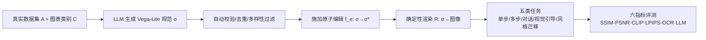

# Charts Are Not Images: On the Challenges of Scientific Chart Editing

**会议**: ICLR 2026  
**OpenReview**: [https://openreview.net/forum?id=259xBeNyDV](https://openreview.net/forum?id=259xBeNyDV)  
**代码**: [https://github.com/adobe-research/figure-editing](https://github.com/adobe-research/figure-editing)  
**领域**: 图像生成 / 科学图表编辑 / 多模态评测基准  
**关键词**: 图表编辑, 结构化变换, 图形语法, 基准测试, 语义评测, 指令编辑  

## 一句话总结
本文指出"图表不是图像"——图表是受图形语法约束的结构化数据渲染，编辑图表本质是结构化变换而非像素操作；据此提出 30K+ 规模、覆盖 10 种图表类型与五类渐进任务的 FigEdit 基准，并揭示主流图像编辑模型在像素指标上分数虚高、实际语义编辑却频繁失败。

## 研究背景与动机
**领域现状**：扩散模型与自回归 VLM 在自然图像的指令式编辑上表现亮眼（InstructPix2Pix、Emu Edit、ControlNet 等），人们自然想把这些工具迁移到科学图表的修改上——更新数据、调整布局、统一风格、转换编码方式都是科研写作的日常需求。

**现有痛点**：把图表当图像处理建立在一个错误前提上。一张图表不是像素的堆叠，而是结构化数据 $D$ 经图形语法（graphical grammar）渲染出的产物。诸如"为类别 X 添加一个值为 42 的柱子"这样的指令，要求模型协调更新数据 schema 与视觉映射，但当前模型往往把它当作视觉重排，产出"看似合理却违反语义"的结果。与此同时，已有图表基准多聚焦 captioning、QA、表格抽取或 chart-to-code，缺乏真实底层数据、编辑类别覆盖窄、几乎不含视觉引导/风格迁移等交互场景，且仍依赖 SSIM/PSNR 这类像素相似度指标。

**核心矛盾**：指令编辑器为"开放目标下的感知对齐"而优化，而图表编辑被"数据保真 + 可视化规则"严格约束——这是一种持续存在的 **问题–方法错配**（problem–method mismatch）。在自然图像上训练的模型缺乏保持"取值–编码一致性、坐标轴连贯性、图例完整性"的归纳偏置。

**本文目标**：建立一个任务结构化、语义感知、可规模化的图表编辑专用基准，并系统揭示现有模型的失败模式。

**核心 idea**：**[问题重定义] 图表编辑 = 结构化变换**——把编辑形式化为作用在标记/标度/编码/图例上的变换函数 $f_e:\Sigma\to\Sigma$，明确数据–编码对齐、轴连贯、图例完整等不变量；**[基准] FigEdit** 用确定性编辑函数对 Vega/Vega-Lite 规范施加变换再渲染，提供像素一致的监督；**[评测] 语义感知指标**揭示像素相似度与语义正确性之间的鸿沟。

## 方法详解

### 整体框架
FigEdit 是一条"规范驱动 + 确定性渲染"的数据生成与评测流水线：先用 LLM 在真实数据集与图表类别的约束下生成 Vega-Lite 基础规范并自动校验，再对规范施加来自一套原子操作集 $O$ 的确定性编辑函数得到编辑后规范，最后由渲染器 $R$ 统一渲染成"编辑前/后"图像对。在此基础上派生出单步、多步、对话、视觉引导、风格迁移五类任务，并在图像空间用六个互补指标（含 LLM 评分）评测模型。

### 关键设计

**1. 把图表形式化为"内容+风格"的结构化规范，让编辑成为可定义的变换。** 自然图像被看作坐标到颜色的映射 $I:\mathbb{R}^2\to\mathbb{R}^3$，而图表被定义为渲染器对规范的确定性输出 $I=R(\sigma)$。规范进一步分解为 $\sigma=(C,S)$：内容 $C$ 包含数据集 $D$、图表类型 $\tau$ 以及把变量映射到几何标记的编码函数；风格 $S$ 涵盖调色板、字体、描边/填充、网格线、图例布局、间距与边距。一个原子编辑 $e$ 被定义为带前/后置条件的全函数 $f_e:\Sigma\to\Sigma$。这一形式化是全篇的基石——它把"编辑对不对"从模糊的视觉判断，转化为"规范层面的变换是否满足不变量"，从而能用确定性编辑函数生成像素一致的标准答案（GT），避免了 chart-to-code 那种"只验代码可执行性、忽视感知质量"的局限。

**2. 五类渐进任务覆盖真实编辑场景。** 任务按难度递进设计：单步编辑给定一个原子编辑 $\sigma^\star=f_e(\sigma)$；多步编辑要求联合施加 $k\ge2$ 个编辑，对不可交换的操作采用固定规范顺序 $\sigma^\star=(f_{e_k}\circ\cdots\circ f_{e_1})(\sigma)$；对话编辑把两步编辑拆解为多轮，每轮输入 $(I_{t-1},H_{t-1},u_t)$ 含历史与中间状态，考察模型跨轮维持状态的能力；风格迁移给定源图风格与目标内容，要求 $C(\sigma^\star)=(D_t,\tau_t)$ 同时 $S(\sigma^\star)\approx S(\sigma_s)$，即保内容换风格；视觉引导编辑额外给定一个标注区域 $G$（用 GPT-Image 在目标元素上画细红圈），要求 $\sigma^\star=f_{e,u,G}(\sigma)$ 在引导区内施改、其余保持。这套任务把"原子编辑、复合编辑、多模态引导、跨图风格适配"系统铺开，正对应现有基准缺失的交互场景。

**3. 自动化标注流水线保证可复现的确定性监督。** 对每张图表自动产出三件套：带机器可读 OP 标签的自然语言指令、含内联数据值的编辑后规范、对应渲染图像。编辑前会按图表语义过滤非法操作（如间距调整只对 band/point 标度有效），并校验 schema 正确性、变化可见、增删行时数据账目一致，确保监督确定且可复现。在原子编辑之上再派生：把两步编辑拆成对话样本、用 VLM 给目标区域画红圈生成视觉引导资产、把目标编辑与"风格已匹配的参考图"配对生成风格迁移标注。最终得到 30,836 个编辑图，覆盖经济、气候、医疗、体育、社科等真实领域。

**4. 语义感知评测：揭穿像素指标的"虚高"。** 评测全在图像空间进行，计算六个互补指标——SSIM、PSNR、LPIPS、CLIP 相似度、OCR 相似度，以及一个基于 LLM 的指令评分（细分为指令遵循、内容保持、视觉质量三项 1–5 分）。前五个是经典像素/感知指标，最后一个直接判断"编辑是否真的按指令完成"。论文用一组案例（图 2）说明：模型可以拿到很高的 SSIM/PSNR，但编辑其实是错的——保持了整体外观却忽略指令、扭曲了图形或改错了关键内容。这种设计把评测的重心从"像素像不像"显式转向"语义对不对"。

## 实验关键数据

### 主实验表格
评测 4 个代表性指令编辑模型（GPT-Image、Imagen 4、OmniGen 2、InstructPix2Pix），MLLM 评分为 1–5 分：

| 任务 | 模型 | SSIM↑ | PSNR↑ | OCR↑ | Instr.↑ | Preserv.↑ | Qual.↑ |
|------|------|-------|-------|------|---------|-----------|--------|
| Single | Imagen 4 | **0.773** | **13.04** | 0.072 | 1.58 | 1.51 | 2.05 |
| Single | GPT-Image | 0.730 | 10.32 | 0.205 | **3.47** | 1.71 | 2.45 |
| Single | OmniGen2 | 0.735 | 11.30 | **0.262** | 3.35 | **2.55** | **2.85** |
| Multi | Imagen 4 | 0.696 | **11.02** | 0.107 | 1.26 | 1.32 | 2.15 |
| Multi | OmniGen2 | **0.710** | 10.15 | **0.265** | **2.65** | **2.10** | **2.70** |
| Conv. | GPT-Image | 0.673 | 10.66 | 0.172 | **4.59** | **2.51** | **2.91** |
| Conv. | Imagen 4 | **0.718** | **11.58** | 0.070 | 1.35 | 1.23 | 2.11 |
| Visual | Imagen 4 | **0.842** | **13.10** | 0.120 | 1.40 | 1.35 | 2.20 |
| Visual | GPT-Image | 0.836 | 12.85 | **0.467** | 2.39 | **3.16** | **3.95** |
| Transfer | Imagen 4 | **0.850** | **14.00** | 0.130 | 1.30 | 1.25 | 2.15 |
| Transfer | GPT-Image | 0.844 | 13.81 | **0.509** | **3.06** | **3.57** | **4.16** |

**关键对照**：Imagen 4 几乎包揽所有任务的 SSIM/PSNR 最高分，却在指令遵循与内容保持上垫底（多处 Instr.≈1.3）；这正是"像素分高、语义分崩"的铁证。

### 消融实验/分模型分析

| 模型 | 强项 | 弱项 |
|------|------|------|
| Imagen 4 | 像素保真（SSIM/PSNR 最高） | 指令遵循、语义保持最差，编辑"看着平滑却没改对" |
| GPT-Image | 指令遵循最强（尤其对话/迁移），OCR 高 | PSNR 偏低，对文本密集/布局敏感编辑鲁棒性弱 |
| OmniGen2 | 各任务最均衡，OCR 稳定 | 视觉引导与风格迁移偏弱，跨实例推理受限 |
| InstructPix2Pix | 部分语义指标尚可 | 复杂编辑普遍逊于 OmniGen2 |

### 关键发现
- **像素相似 ≠ 语义正确**：SSIM/PSNR 会系统性夸大 Imagen 4 这类像素导向模型的表现，而 LLM 评分与 OCR 才暴露出大量语义错误，差距在多步与对话编辑中尤为剧烈。
- **没有模型全面领先**：性能高度碎片化，各模型都过拟合到特定任务结构或指标类型；在经典像素指标上强，并不保证在更难场景里真的把编辑做对。
- **失败模式一致**：删数据点、改背景色、加新元素等指令下，模型常产出"视觉相似但变换没发生"的结果。

## 亮点与洞察
- **一句口号点透问题本质**："Charts are not images"——把图表编辑从图像编辑里剥离出来，重新定义为受图形语法约束的结构化变换问题，这个 reframing 本身就极具说服力。
- **确定性 GT 是巧思**：用编辑函数作用在 Vega-Lite 规范上再渲染，既得到像素一致的标准答案，又避免了 chart-to-code 基准"只验代码可执行性"的退化，兼顾了结构正确与感知质量。
- **直接质疑评测范式**：不只是又一个数据集，而是用实验证明 SSIM/PSNR 在图表编辑上会误导结论，推动评测向数据/编码层的语义正确性迁移——这对整个图表智能方向有方法论价值。
- **规模与覆盖扎实**：30K+ 样本、10 种图表类型、五类任务、真实领域数据，且首个同时支持视觉引导与风格迁移的图表编辑基准。

## 局限与展望
- **只提基准、未提模型**：论文诊断了"结构感知模型缺位"，但本身只给评测协议，没有给出能通过测试的结构感知编辑方法，留给后续工作。
- **LLM 评分作为裁判**：语义正确性高度依赖 LLM 打分，其自身可靠性、偏差与可复现性需进一步标定。
- **图像空间评测的折中**：虽然 GT 来自规范，但模型输出在图像空间评测，对"输出规范"的模型并未充分利用其可执行性做更细粒度的结构校验。
- **展望**：构建真正以规范/可执行目标为输出、显式保持数据–编码不变量的结构感知编辑模型，是这条线最自然的下一步。

## 相关工作与启发
- **图像编辑**：InstructPix2Pix、LEDITS++、Emu Edit、SmartEdit、AnyEdit 等指令编辑方法为自然图像优化，缺乏图表所需的结构约束。
- **科学图表生成/编辑**：ScImage 探讨 MLLM 图表生成的局限，AutomaTikZ 做受程序约束的文本到矢量图，ChartEdit 把图表编辑形式化为多模态评测但仅部分覆盖指令类型且缺配对输出——FigEdit 在真实数据、配对输出、交互场景与语义评测上系统补齐。
- **启发**：当一个任务的"正确性"由结构/语法定义（如图表、代码、UI 布局）时，沿用感知相似度做评测会系统性误导；应当把评测下沉到结构/语义层，并为模型注入相应的归纳偏置。

## 评分
- **新颖性**: ⭐⭐⭐⭐ — "图表不是图像"的问题重定义清晰有力，确定性规范驱动的基准构造与语义感知评测都有原创性，但属于"诊断 + 基准"而非新方法。
- **实验充分度**: ⭐⭐⭐⭐ — 4 个代表性模型 × 五类任务 × 六指标，定量与定性证据互证，把像素–语义鸿沟讲透；可惜未含可通过测试的结构感知 baseline。
- **写作质量**: ⭐⭐⭐⭐⭐ — 论点鲜明、形式化干净、表格与雷达图组织清晰，口号与论证高度一致。
- **价值**: ⭐⭐⭐⭐ — 为图表/科学图编辑提供了任务结构化、语义感知的公共基准与评测范式，对方向有较强推动力，主要价值在"立标准"而非"给方案"。

<!-- RELATED:START -->

## 相关论文

- [\[CVPR 2026\] Group Editing: Edit Multiple Images in One Go](../../CVPR2026/image_generation/group_editing_edit_multiple_images_in_one_go.md)
- [\[CVPR 2026\] Improved Mean Flows: On the Challenges of Fastforward Generative Models](../../CVPR2026/image_generation/improved_mean_flows_on_the_challenges_of_fastforward_generative_models.md)
- [\[CVPR 2026\] ChArtist: Generating Pictorial Charts with Unified Spatial and Subject Control](../../CVPR2026/image_generation/chartist_generating_pictorial_charts_with_unified_spatial_and_subject_control.md)
- [\[CVPR 2025\] Science-T2I: Addressing Scientific Illusions in Image Synthesis](../../CVPR2025/image_generation/science-t2i_addressing_scientific_illusions_in_image_synthesis.md)
- [\[CVPR 2026\] OrionEdit: Bridging Reference and Source Images for Generalized Cross-Image Editing](../../CVPR2026/image_generation/orionedit_bridging_reference_and_source_images_for_generalized_cross-image_editi.md)

<!-- RELATED:END -->
