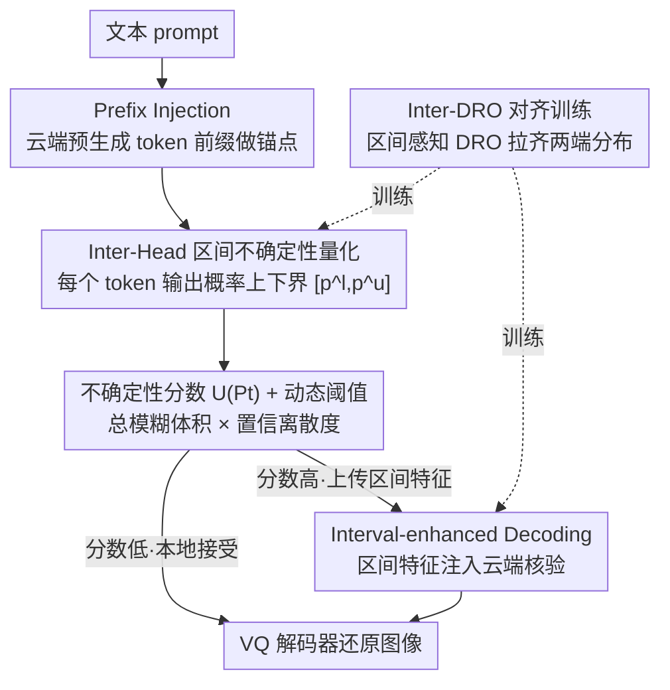

# CIAR: Interval-based Collaborative Decoding for Image Generation Acceleration

**会议**: ICLR2026  
**OpenReview**: [https://openreview.net/forum?id=YzZ4pSAwZy](https://openreview.net/forum?id=YzZ4pSAwZy)  
**代码**: 待确认  
**领域**: 图像生成 / 自回归图像 / 端云协同推理加速  
**关键词**: 自回归图像生成, 推测解码, 端云协同, 不确定性量化, 概率区间

## 一句话总结
CIAR 把自回归图像生成的推测解码搬到端云协同框架里，用一个设备端的「区间头」(Inter-Head) 输出每个视觉 token 的连续概率区间来量化不确定性，让低不确定区域在设备本地直接生成、只把高不确定的边界细节 token 连同区间特征上传云端核验，配合 Inter-DRO 对齐训练，实现 2.18× 加速并把云端请求量砍掉 70%，同时几乎不掉画质。

## 研究背景与动机
**领域现状**：自回归 (AR) 图像生成模型（LlamaGen、Anole 等）把图像切成离散 token，用「下一个 token 预测」的方式逐个生成，画质已经能和扩散模型掰手腕。但它们靠越来越大的视觉码本 (codebook) 来保真，参数量和逐 token 串行的特性让它们在手机这类端侧设备上跑起来又慢又重。一个自然的思路是端云协同：设备上放一个轻量 AR 模型快速产 token，云端放一个大模型并行核验，本质就是把文本里的推测解码 (speculative decoding) 搬到视觉上。

**现有痛点**：把推测解码直接套到图像上有两个致命问题。第一是核验开销爆炸——图像 token 数随分辨率二次增长，逐 token 全量上传云端核验会让网络通信成为瓶颈，反而抵消了云端的算力优势，还烧通信和云端成本。第二是统一核验策略太蠢——传统做法对图像每个区域一视同仁地核验，但图像的不确定性在空间上极不均匀：背景、平滑表面这类低熵区域高度可预测、几乎都会被云端原样接受（作者实测约 70% 的 token 设备端贪心选的就是云端要的），而物体边界、复杂纹理这类区域才是错误高发地。统一核验把算力浪费在「本来就对」的 token 上，又没把火力集中到真正不确定的地方。

**核心矛盾**：要省云端请求就得让设备多本地决策，但设备自己怎么知道哪些 token 可以放心本地生成、哪些必须求助云端？现成的熵 (entropy) 度量在这里失灵：视觉码本巨大导致概率分布很平、熵区分度差，且熵是个标量、忽略空间上下文，掩盖了真正的歧义。另一边，设备一旦本地确定了一段前缀，它的条件分布会逐渐偏离云端模型的期望 (distribution drift)，越往后生成越跑偏。

**本文目标**：(1) 给设备一个对大视觉码本有效、又便宜的不确定性度量来做自验证；(2) 在设备大量本地生成时，把设备和云端的分布拉回一致，防止漂移损坏画质。

**切入角度**：作者观察到视觉 token 的不确定性是「连续」的——与其在离散解集上枚举可行解（代价随码本指数级膨胀），不如直接为每个 token 输出一个连续的概率上下界区间，用区间的「宽度」来刻画不确定性。

**核心 idea**：用一个轻量的区间头 (Inter-Head) 给每个 token 输出连续概率区间 $[p^l_t, p^u_t]$，靠区间宽度算出不确定性分数来决定「本地接受 or 上传云端」，并把区间特征注入云端核验、用 Inter-DRO 损失对齐两端分布。

## 方法详解

### 整体框架
CIAR 是一个端云协同的自回归视觉解码框架，目标是在设备本地尽可能多地生成 token、只把少数高不确定 token 交给云端。整条流水线是：云端 AR 大模型先根据文本 prompt 生成一小段图像 token 前缀 (Prefix Injection) 注入设备做锚点；设备上的轻量 AR 模型带一个 **Inter-Head**，逐 token 产出连续概率区间，并据此算出一个不确定性分数 $U(P_t)$；分数低于动态阈值的 token 被设备「自验证」通过、本地直接采纳，分数高的 token 则连同它的区间特征一起上传云端；云端在核验/重采样时把这个区间特征注入自己的解码器 (Interval-enhanced Decoding)，校正后回传，从而抑制分布漂移、守住边界细节画质。整套机制由 **Inter-DRO 对齐训练**支撑，让结构不同的 Inter-Head 输出能和云端分布对齐。最终落到 VQ 解码器还原图像。

### 关键设计

**1. Inter-Head：用连续概率区间替代离散解集来量化不确定性**

针对「大视觉码本上熵度量失灵、且离散枚举代价随码本指数膨胀」这个痛点，Inter-Head 把标准 LM Head 的输出维度从 $|V|$ 扩成 $2\times|V|$，对每个 token 的隐藏态 $h_t$ 同时预测一个中心 logit 和一个半径：$c_t = \text{Linear}_{center}(h_t)$，$r_t = \text{Softplus}(\text{Linear}_{radius}(h_t))$。Softplus 保证半径 $r_t$ 严格非负，于是得到一个 logit 区间 $[c_t - r_t,\, c_t + r_t]$。再经过一个 InterFuse 算子映射成合法的概率区间 $P_t = [p^l_t, p^u_t]$，并保证它满足有效解集性质 $\sum_i p^l_i \le 1 \le \sum_i p^u_i$（即下界之和不超过 1、上界之和不小于 1）。这样做的妙处在于：它保留了视觉 token 分布的连续性、给出比标量熵更细的不确定性刻画，同时把原本需要在离散解集上枚举可行解的指数级开销，降成一次前向就能得到的区间估计——这正是后文实验里相对离散方法大幅降延迟的来源。

**2. 不确定性分数 $U(P_t)$：总模糊体积 × 置信离散度，再配动态阈值做自验证**

光有区间还不够，得把区间压成一个标量来决策。作者发现：token 的不确定性既随区间「总宽度」上升，也随各维区间宽度的「离散程度」上升——简单取平均会丢掉后者。于是设 $\delta_t = p^u_t - p^l_t \in \mathbb{R}^{|V|}_{\ge 0}$ 为各维区间宽度向量，定义不确定性分数为「总模糊体积」(Total Ambiguity Volume) 和「置信离散度」(Confidence Disparity) 的乘积：

$$U(P_t) = \underbrace{\lVert \delta_t \rVert_1}_{\Omega_t:\,总模糊体积} \cdot \underbrace{\sqrt{\frac{1}{|V|}\sum_{i=1}^{|V|}\left(\delta_{t,i} - \bar{\delta}_t\right)^2}}_{\Sigma_t:\,置信离散度}$$

其中 $\bar{\delta}_t$ 是宽度均值，前一项是宽度的 L1 范数、后一项是宽度的标准差。用乘积而非加和，意味着只有当「总模糊量大」且「各维宽度差异也大」时分数才高，对真正歧义的 token 更敏感、对均匀平铺的低熵区域不敏感。这个分数再喂给一个**动态阈值**策略做最终的接受判定：分数低于阈值的 token 设备本地自验证通过（实验里阈值 0.30 是速度/画质的最优点），高于阈值的才上传云端。这一设计把「该不该信任本地预测」从拍脑袋变成了可量化、可调的旋钮。

**3. Cloud-Enhanced Decoding：前缀注入打底 + 区间特征注入云端核验**

这个模块专治分布漂移，由两部分组成。**前缀注入 (Prefix Injection)**：生成早期设备上下文太少容易偏离目标分布，于是云端先预生成长度 $m = \lfloor \rho \cdot T \rfloor$ 的短前缀（$\rho$ 为前缀率）注入设备做高质量锚点，约束本地生成。$\rho$ 是个 trade-off——大了对齐更好但云端延迟高，小了更快但引导弱，实验里 $\rho \approx 0.06$ 最平衡。**区间特征注入 (Interval Feature Injection)**：对每个本地接受的 token $x_{t+i}$，把它的隐藏态 $f_{t+i}$ 和区间 $P_{t+i}$ 拼起来过一个轻量投影网络 $\phi$，得到紧凑的区间特征 $f^I_{t+i} = \phi(\text{Concat}(f_{t+i}, P_{t+i})) \in \mathbb{R}^d$。云端核验/重采样时把这个特征加进解码器输入：$h^C_{t+i+1} = \text{Decoder}^C\big(E(x_{t+i}) + f^I_{t+i}\big)$。也就是说，云端不只看 token embedding，还看到了设备对这个 token 「有多大把握」的结构化信息，从而把设备的置信度作为「可执行情报」来主动引导云端生成、防止误差累积、维持视觉连续性。

**4. Inter-DRO Loss：区间感知的分布鲁棒优化对齐两端分布**

Inter-Head 的结构和云端输出层不同、没法直接共享参数，所以需要一个训练策略同时保证「区间估计准确」和「与云端分布对齐」。作者注意到：同时优化一个乐观上界和一个悲观下界，本质上很像「在最坏情况下也要表现好」的分布鲁棒优化 (DRO) 哲学，于是把下界 $q^L$ 当作最坏情况来处理。损失由三部分拼成。先是把上/下界 logits 都往云端输出 $p_{cloud}$ 拉的锚定损失 $\mathcal{L}_{anchor} = \lambda_v \lVert p - p_{cloud}\rVert_1 + \lambda_p \text{CE}(p_{cloud}, p)$。对代表最坏情况的下界，再叠一个 DRO 的对抗重加权：batch 里越难预测（损失越大）的样本权重越大，$\mathcal{L}^{DRO}_{lo} = \max_{w}\sum_n w_n \text{CE}(p^{(n)}_{cloud}, p^{(n)}_{lo})$，权重 $w_n \propto \exp(\alpha\,\text{CE})$ 由每样本风险算出。对中心预测 $p_{mid}$ 则额外加一个 KL 散度项强约束分布对齐：$\mathcal{L}_{align} = \lambda_\beta D_{KL}(p_{cloud}\Vert p_{mid})$。完整损失为 $\mathcal{L}_{\text{Inter-DRO}} = \big[\mathcal{L}_{anchor}(p_{mid}) + \mathcal{L}_{align}\big] + \mathcal{L}_{anchor}(p_{up}) + \big[\mathcal{L}_{anchor}(p_{lo}) + \mathcal{L}^{DRO}_{lo}\big]$，分别对应中心、上界、下界 DRO 三块。整个训练还兼容 Classifier-Free Guidance (CFG) 来提升多样性。

### 损失函数 / 训练策略
核心训练目标即上面的 Inter-DRO 损失，三段式地约束区间中心（KL + 锚定）、上界（锚定）、下界（锚定 + 对抗重加权 DRO）。设备端模型用与云端相同的架构但只保留单个自回归层以省算力；训练兼容 CFG。

## 实验关键数据

### 主实验
在 LlamaGen-XL (Stage I / II) 和 Anole 三个云端模型上、用 MS-COCO 验证集 caption 生成图像评测，设备端为单层 AR。对比 EAGLE-2、Lantern、Entropy-Lens、CoDe 等推测解码/协同加速基线。

| 云端模型 | 方法 | CLIP↑ | FID↓ | F1↑ | HPSv2↑ | Latency↓ | Cloud Call↓ |
|------|------|------|------|------|------|------|------|
| LlamaGen(I) | Base | 0.3161 | 23.69 | 0.6097 | 22.74 | ×1.00 | 100% |
| LlamaGen(I) | Lantern | 0.3159 | 25.55 | 0.5834 | 21.29 | ×1.66 | 50.11% |
| LlamaGen(I) | CoDe(N=0.3) | 0.2827 | 35.67 | 0.4625 | 18.08 | ×2.04 | 30.00% |
| LlamaGen(I) | **CIAR** | 0.3159 | **24.25** | 0.5997 | 22.48 | **×2.53** | **30.44%** |
| LlamaGen(II) | Base | 0.2822 | 40.07 | 0.5350 | 23.84 | ×1.00 | 100% |
| LlamaGen(II) | **CIAR** | **0.2927** | **39.31** | **0.5458** | 23.26 | **×2.13** | 34.46% |
| Anole | Base | 0.3215 | 19.95 | 0.6544 | 23.52 | ×1.00 | 100% |
| Anole | **CIAR** | 0.3171 | 23.86 | 0.5970 | 23.14 | **×1.87** | **29.88%** |

注：摘要给出的 2.18× 加速 / 砍 70% 云端请求是相对 SOTA 推测解码方法的综合结论；表中 Latency 列在不同骨干上加速比有差异（LlamaGen Stage I 上达 ×2.53）。CIAR 在大幅降延迟、把云端请求压到 ~30% 的同时，CLIP/FID/F1 仍与 Base 持平甚至更优，而 CoDe 这类纯靠小模型续写的方法画质明显塌（FID 升到 35+、CLIP 掉到 0.28）。

### 消融实验
不确定性度量方式对比（LlamaGen Stage I）：

| 方法 | CLIP↑ | FID↓ | F1↑ | HPSv2↑ | Speedup | Cloud Call |
|------|------|------|------|------|------|------|
| Random | 0.3142 | 30.19 | 0.5369 | 18.16 | ×2.28 | 36.46% |
| Entropy-Lens | 0.3132 | 24.58 | 0.5796 | 22.03 | ×1.70 | 52.34% |
| SoftmaxCorr | 0.3149 | 31.10 | 0.5130 | 19.11 | ×2.27 | 36.49% |
| **Inter-Head(Ours)** | **0.3159** | **24.25** | **0.5997** | **22.48** | **×2.53** | **30.44%** |

连续 vs 离散不确定性估计（LlamaGen Stage I）：

| 方法 | 设置 | CLIP↑ | FID↓ |
|------|------|------|------|
| Discrete | k=100 | 0.3081 | 26.04 |
| Discrete | k=300 | 0.3123 | 24.82 |
| **Continuous(Ours)** | — | **0.3176** | **24.25** |

### 关键发现
- **Inter-Head 是核心增益来源**：换成 Random / Entropy-Lens / SoftmaxCorr，要么 FID 大幅恶化（Random/SoftmaxCorr 把质量打到 30+ FID、HPSv2 掉到 18-19），要么云端请求降不下来（Entropy-Lens 还要 52% 云端调用）。标量熵或单 token 最大概率都不足以刻画视觉 token 的空间异质不确定性，而 Inter-Head 从整个分布评估，质量/效率双赢。
- **连续区间显著优于离散枚举**：离散方法随码本 $k$ 增大延迟指数级膨胀（图 5），质量却只有边际提升；连续区间在 $k=100$ 处就比离散大幅降延迟，且 CLIP/FID 更好。
- **前缀率非单调**：前缀率越高画质越好、云端核验越少，但云端预生成本身的开销会抵消收益，加速比呈非单调，$\rho=0.06$ 最优；不确定性阈值 0.30 是速度/画质最优工作点。
- **文本推测解码搬到图像几乎无效**：图像 token 分布一致性强、信息多样性远低于文本，直接套 EAGLE-2 几乎不加速还掉画质。

## 亮点与洞察
- **「连续概率区间」替代「离散解集枚举」**：这是最巧的一刀——把不确定性量化从「在大码本上枚举可行解（指数级）」变成「一次前向出上下界区间」，既保留视觉分布的连续性，又把开销压到可端侧部署，是全文加速的根。
- **不确定性分数用乘积而非加和**：总模糊体积 × 置信离散度，强制「量大且分散」才算高不确定，巧妙避开了熵在平坦大码本上区分度差的老问题，这个 metric 设计可迁移到任何「大词表 + 空间冗余」的离散生成任务（如视频 token、点云 token）。
- **把设备置信度做成「可注入的特征」**：区间特征注入让云端不只看 token、还看到设备「有多大把握」，相当于给云端核验加了一路旁路情报，这种「轻端把结构化不确定性回传重端」的协同范式很有迁移价值。
- **用 DRO 视角统一上下界训练**：把「同时优化乐观上界 + 悲观下界」类比成 DRO 的最坏情况鲁棒优化，给了一个干净的训练目标，下界对抗重加权让难样本得到更多关注。

## 局限与展望
- **强依赖端云连接**：框架本质是云端兜底高不确定 token，离线或弱网场景下无法享受云端核验，可能退化为纯设备贪心（论文里已显示纯本地贪心细节会糊）。
- **超参敏感**：前缀率 $\rho$、不确定性阈值都需调到甜点（0.06 / 0.30），且加速比对 $\rho$ 非单调，换骨干/分辨率可能要重调。
- **评测局限**：实验集中在 MS-COCO caption + LlamaGen/Anole，分辨率和码本规模有限；更高分辨率下「token 二次增长」带来的通信瓶颈是否仍被有效缓解，缺更大规模验证。
- **InterFuse 与有效性证明依赖附录**：InterFuse 算子的具体形式、概率区间合法性证明放在附录，正文对「区间如何精确映射成合法概率」交代偏简（⚠️ 细节以原文附录 A.4 为准）。
- **可改进方向**：把动态阈值/前缀率做成随生成进度或区域语义自适应的策略，可能进一步逼近 speed–quality 前沿。

## 相关工作与启发
- **vs Lantern（视觉推测解码）**：Lantern 强制云端全量核验，通信和云端开销高（云端调用仍 50%）；CIAR 用设备端 Inter-DRO 自验证只上传高不确定 token，把云端调用压到 ~30%，在更低延迟下 CLIP/FID 反而更好。
- **vs CoDe（VAR 协同加速）**：CoDe 把后续序列完全交给小模型续写，迁到「下一个 token 预测」范式下分布漂移严重、画质塌（FID 35+、CLIP 0.28）；CIAR 靠前缀注入 + 区间特征注入 + KL 对齐主动抑制漂移，守住画质。
- **vs Entropy-Lens / SoftmaxCorr（熵 / 最大概率不确定性）**：它们用标量熵或单 token 最大 softmax 概率，忽略大码本下分布平坦与空间异质性；CIAR 的区间宽度从整个分布评估不确定性，对视觉 token 更敏感。
- **vs EAGLE-2（文本推测解码 SOTA）**：直接搬到图像几乎不加速且掉画质，印证了「视觉 token 分布一致性强、需要专门的视觉不确定性度量」这一动机。

## 评分
- 新颖性: ⭐⭐⭐⭐ 「连续概率区间量化视觉 token 不确定性 + 端云协同自验证」是个干净且少见的组合，区间分数与 Inter-DRO 都有巧思。
- 实验充分度: ⭐⭐⭐⭐ 三骨干 + 多基线 + 度量/连续离散/前缀率/阈值多组消融较扎实，但仅限 MS-COCO、未上更高分辨率/更大码本。
- 写作质量: ⭐⭐⭐⭐ 动机链条清晰、图 2 总览到位；个别记号（InterFuse、$\mathcal{L}_c$ 与各损失下标）需对照附录才完全自洽。
- 价值: ⭐⭐⭐⭐ 端侧自回归图像生成加速是真实需求，2.18× 加速 + 砍 70% 云端请求且不掉画质，落地价值明确。

<!-- RELATED:START -->

## 相关论文

- [\[ICLR 2026\] Autoregressive Image Generation with Randomized Parallel Decoding](autoregressive_image_generation_with_randomized_parallel_decoding.md)
- [\[ICML 2026\] Speculative Coupled Decoding for Training-Free Lossless Acceleration of Autoregressive Visual Generation](../../ICML2026/image_generation/speculative_coupled_decoding_for_training-free_lossless_acceleration_of_autoregr.md)
- [\[AAAI 2026\] Annealed Relaxation of Speculative Decoding for Faster Autoregressive Image Generation](../../AAAI2026/image_generation/annealed_relaxation_of_speculative_decoding_for_faster_autor.md)
- [\[ICCV 2025\] Grouped Speculative Decoding for Autoregressive Image Generation](../../ICCV2025/image_generation/grouped_speculative_decoding_for_autoregressive_image_generation.md)
- [\[CVPR 2026\] Parallel Jacobi Decoding for Fast Autoregressive Image Generation](../../CVPR2026/image_generation/parallel_jacobi_decoding_for_fast_autoregressive_image_generation.md)

<!-- RELATED:END -->
