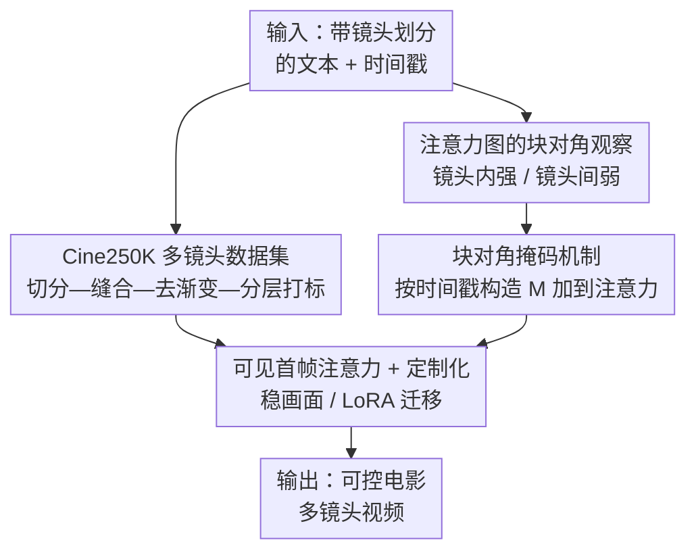

# CineTrans: Learning to Generate Videos with Cinematic Transitions via Masked Diffusion Models

**会议**: ICLR2026  
**OpenReview**: [https://openreview.net/forum?id=955hVLJdfP](https://openreview.net/forum?id=955hVLJdfP)  
**代码**: [项目主页 uknowsth.github.io/CineTrans](https://uknowsth.github.io/CineTrans/)  
**领域**: 视频生成 / 扩散模型  
**关键词**: 多镜头视频生成, 电影转场, 注意力掩码, 视频扩散模型, 数据集构建

## 一句话总结
CineTrans 发现视频扩散模型的注意力图天然呈"镜头内强相关、镜头间弱相关"的块对角结构，于是用一个由镜头时间戳直接构造的块对角掩码去操控注意力，再配合自建的 Cine250K 多镜头数据集微调，让模型能在任意指定位置生成符合电影剪辑风格的多镜头转场，且换上掩码后免训练也能用。

## 研究背景与动机
**领域现状**：文本到视频（T2V）扩散模型在画质和单镜头连贯性上已经很强，但绝大多数模型几乎只会生成"一镜到底"的单镜头视频。真实电影靠镜头切换（cut）讲故事，而"从一句话生成带电影剪辑风格、movie-like 转场的多镜头视频"仍是一个几乎没被正面解决的难题。

**现有痛点**：现有做长/多镜头视频的两条路都不好走。第一条是把模型和数据继续做大（HunyuanVideo、Wan、CogVideoX 等），它们偶尔能在 prompt 里写明"几个镜头"后凑出多镜头，但因为训练数据里几乎没有镜头切换，转场既不保证出现、也无法精确落在指定位置，而且训练成本极高。第二条是"分镜头各自生成再拼接"（Animate-a-Story、VGoT、MovieDreamer 等），它需要大量人工干预，且没用上真实电影的多镜头先验，拼出来的切口常常不符合真实剪辑习惯；另有一些工作只盯着人脸一致性或某个特定动画系列，泛化性差。

**核心矛盾**：问题的根本在于——**模型内部到底怎么表示"镜头切换"这件事，一直是个黑箱**。既不知道扩散模型有没有内在的转场机制，也就无从在不堆数据、不重训的前提下去精确控制它。同时还存在一个一致性悖论：镜头间一致性太高反而是坏事（说明只是像素级复制粘贴，不是真正的换镜头），但又不能太低（人物/场景会断裂）。

**本文目标**：(1) 弄清扩散模型内部如何编码镜头边界；(2) 在此基础上设计一个能在任意位置精确控制转场、且尽量不依赖大规模重训的机制；(3) 提供真正带电影剪辑先验的多镜头数据；(4) 设计能区分"真转场"与"假复制"的评测指标。

**切入角度**：作者去观察扩散模型去噪过程中的**时序注意力图**——既然帧之间的相关性都体现在注意力里，那转场点（需要剧烈变化）和非转场点（需要连续）在注意力上理应有明显差异。

**核心 idea**：用"由镜头时间戳直接构造的块对角注意力掩码"去对齐并放大模型本就具备的镜头切换倾向，再用自建电影数据集微调，把可控的电影转场注入视频扩散模型。

## 方法详解

### 整体框架
CineTrans 的输入是一句带镜头划分的文本（如"两镜头：…；Shot 1: [0s,4s]; Shot 2: [4s,8s]"），输出是一段在指定时间点切镜、符合电影剪辑风格的多镜头视频。整条工作流可以拆成"先造数据 → 再看懂模型 → 再构造掩码去控制 → 最后微调/免训练落地"四步：

1. **造数据**：从 633K 部 Vimeo 精剪视频出发，经过切分—缝合—筛选—去渐变—分层打标，构建出 25 万对带帧级镜头标签和分层字幕的 Cine250K。
2. **看懂模型**：可视化视频扩散模型的帧间注意力图，发现多镜头场景下注意力呈**块对角结构**——镜头内相关性强、镜头间相关性弱，且这个块结构和真实镜头边界高度对应。
3. **构造掩码控制**：根据用户指定的镜头时间戳，构造一个块对角掩码 $M$，把它加到部分注意力层的注意力分数上，强行"镜头内连通、镜头间隔断"，从而让转场精确落在指定位置。这一步即使不微调（training-free）也能用。
4. **落地**：在 Cine250K 上结合掩码机制微调，让模型学会真正的电影剪辑风格；同时引入"可见首帧注意力"稳定画面，并可通过 LoRA 把这套机制迁移到定制化（角色一致）模型上。

### 关键设计

**1. Cine250K 多镜头数据集：给扩散模型补上"电影剪辑先验"**

针对"现有 T2V 数据几乎没有镜头切换、模型学不到真实剪辑风格"这个痛点，作者设计了一条多阶段数据处理流水线。先用 PySceneDetect 把原始视频切成碎片段，再用 ImageBind 特征衡量相邻片段的语义相似度，按预定规则把语义相关的片段**重新缝合**成带转场的片段（split-stitch），得到约 16M 候选；然后按美学分（top 40%）、时长（8–15s）、镜头数（2–4）筛选。关键的一步是用 TransNetV2 检测并**删除所有"渐变转场"帧**——这些模糊帧不明确属于任何单镜头，去掉后才能得到边界清晰、带精确起止帧索引的镜头标签。最后用 LLaVA-Video 生成时序密集的整体字幕、用 LLaVA-NeXT 生成逐镜头字幕，形成分层标注。这样产出的 Cine250K 同时具备高美学、帧级镜头标签和分层字幕，是后续微调的先验来源。

**2. 注意力图的块对角观察：把"模型如何切镜"这个黑箱打开**

这是全文的洞察支点。作者假设：转场点处相邻帧的相关性，应当和非转场点显著不同（前者要剧烈变化，后者要连续）。于是可视化去噪过程中的逐帧注意力图，发现多镜头视频里注意力概率矩阵呈**块对角结构**——每个块对应一个镜头，镜头内（intra-shot）相关性强、镜头间（inter-shot）相关性弱。为量化这一现象，作者计算了镜头内/镜头间平均注意力概率的比值约为 $26.68$，并用 Pearson 相关验证这个块结构与真实镜头边界的对应关系，得到 $r=0.71\ (p<0.01)$。这说明注意力图本身就编码了镜头边界，可以被拿来当作控制转场的抓手。

**3. 块对角掩码机制：用一张掩码把"内部该具备的切镜能力"放大并定位**

基于上面的观察，作者构造一个作用在视觉 token 注意力上的掩码 $M$。给定预设的镜头划分，定义

$$M_{ij} = \begin{cases} 0 & \text{若 } i,j \text{ 属于同一镜头} \\ -\infty & \text{若 } i,j \text{ 不属于同一镜头} \end{cases}$$

把它加进注意力计算：

$$\text{Attention}(Q,K,V) = \text{softmax}\!\left(\frac{QK^{T}}{\sqrt{d_k}} + M\right)V$$

由于 $-\infty$ 项经 softmax 后归零，跨镜头的注意力被彻底抹掉，最终注意力概率形成块对角矩阵，转场就精确发生在预设位置。它只施加在**部分层**（CineTrans-Unet 用最后 6 层，CineTrans-DiT 用 transformer 第 7–28 层）：被掩的层强化镜头内相关、保证帧级转场；未被掩的层仍允许全帧 token 互相注意，从而维持镜头间的高层语义一致。妙处在于这个机制只是"对齐并放大模型本就具备的块对角倾向"，所以**即使不微调（training-free）也能直接生效**，可任意指定转场位置。

**4. 可见首帧注意力与定制化迁移：补稳定性，并把能力搬到单镜头模型上**

作者额外观察到：某些注意力层里所有视觉 token 都和**第一个时序 latent** 强相关，说明模型对初始帧信息有明显依赖。据此提出 **Visible-First-Frame Attention**，在掩码设计上额外让 token 都能看到首帧，从而稳定多镜头生成的画面（消融图显示能明显减少抖动/形变）。另一方面，借助掩码机制，作者把原本只为单镜头设计的模型也"骗"去执行用户指定的转场：通过加载 LoRA 权重（即便这些权重本来是在单镜头视频上训练的），就能零样本地生成带特定风格或固定角色身份的多镜头视频，实现定制化迁移。

### 损失函数 / 训练策略
CineTrans-Unet 基于 LaVie，掩码施于最后 6 层，在 Cine250K 上以 batch size 128、学习率 $1\times10^{-4}$ 微调 20,000 步。CineTrans-DiT 基于 Wan2.1-T2V-1.3B，掩码施于 transformer 第 7–28 层，发布两个变体：免训练变体在块对角掩码上叠加 Visible-First-Frame Attention；第二个变体再用 LoRA（rank=64）以 batch size 256 微调 2,800 步。全部实验在 NVIDIA A100 上完成。绝大多数电影转场是硬切（hard cut，占 99.58%），故主方法用硬掩码；作者也初步试了软掩码做渐入渐出等平滑转场，但会削弱转场控制力。

## 实验关键数据

### 主实验
评测设计了 100 条用 GPT-4o 生成的分层 prompt（每条带镜头数并扩成逐镜头字幕），从转场控制、时序一致性、整体质量三个维度评估。

| 方法 | 转场控制分↑ | 镜头间语义一致↑ | 镜头间语义 Gap↓ | 美学质量↑ |
|------|------------|----------------|----------------|-----------|
| CogVideoX | 0.0324 | 0.5150 | 0.5915 | 0.5509 |
| HunyuanVideo | 0.2111 | 0.5723 | 0.4075 | 0.6042 |
| Wanx2.1-T2V-turbo | 0.2355 | 0.6431 | 0.3002 | 0.6324 |
| HunyuanVideo + Cinematron | 0.3787 | 0.5631 | 0.3764 | 0.5978 |
| StoryDiffusion + CogVideoXI2V | - | 0.4966 | 0.5660 | 0.6296 |
| **CineTrans-Unet (Ours)** | **0.8598** | **0.8095** | 0.2444 | 0.5747 |
| **CineTrans-DiT (Ours)** | 0.7003 | 0.7858 | **0.1552** | **0.6508** |

CineTrans-Unet 的转场控制分 0.8598，接近"完美按指定镜头数切镜"，远超所有基线（最好的基线 Cinematron 仅 0.3787）；CineTrans-DiT 在美学质量和镜头间 Gap（与真实电影剪辑分布的距离）上最佳。大模型基线普遍要么不切镜（CogVideoX 0.0324），要么完全误解"电影转场"概念。

### 消融实验（CineTrans-Unet）

| 配置 | 转场控制分↑ | 镜头间语义 Gap↓ | 说明 |
|------|------------|----------------|------|
| w/o Mask, w/o Tuning | 0 | - | 原始模型完全不切镜 |
| w/o Mask, w/ Tuning | 0.2398 | 0.3279 | 只微调，转场控制仍很弱 |
| w/ Mask, w/o Tuning | 0.6168 | 0.4336 | 仅靠掩码（免训练）就能拿到 0.62 |
| **CineTrans-Unet (Full)** | **0.8598** | **0.2444** | 掩码+微调，控制与风格对齐都最好 |

### 关键发现
- **掩码是转场控制的主力**：只加掩码、不微调就把转场控制分从 0 拉到 0.6168，验证了"块对角掩码放大模型固有切镜倾向"这一核心论点；这也是免训练变体能成立的原因。
- **微调主要补"电影风格对齐"**：微调后镜头间视觉一致性分数反而略降，但 Consistency Gap（与真实电影分布的 JS 距离）下降——这正是想要的：训练让镜头间产生更大、更像真实剪辑的构图变化，而不是像素级复制。
- **一致性不是越高越好**：作者专门提出 Consistency Gap（生成视频与 1,000 条真实电影剪辑参考集分布间的 Jensen-Shannon 距离）作为辅助指标，避免"高一致性其实是假转场"的误判。
- **美学质量受基座限制**：CineTrans-Unet 美学略低源于 LaVie 基座；换更强的 Wan2.1 基座（DiT 变体）后美学最高，说明该机制可随基座升级而受益。

## 亮点与洞察
- **先理解再控制**：核心不是又造一个大模型，而是先把"扩散模型如何编码镜头边界"这个黑箱打开（块对角注意力 + $r=0.71$ 的定量验证），再顺势设计掩码。这种"机制发现驱动方法设计"的路线很扎实，掩码本质只是对齐模型已有倾向，所以能免训练生效。
- **一个 $-\infty$ 掩码解决精确定位**：转场位置控制这种听起来要复杂条件机制的事，被一张按时间戳构造的块对角掩码优雅解决，几乎零额外参数，且可任意指定切镜点。
- **指出"一致性悖论"并给出度量**：镜头间一致性太高=假切换，作者用与真实电影分布的 JSD（Consistency Gap）来刻画"是否像真剪辑"，这个评测视角可迁移到其他多镜头/可控生成任务。
- **可迁移性强**：掩码机制能套到 UNet（LaVie）和 DiT（Wan）两种架构，还能借 LoRA 把单镜头定制模型变成多镜头定制模型。

## 局限与展望
- **硬切为主，软转场未成熟**：方法以硬掩码处理硬切（占 99.58%），软掩码做渐入渐出等平滑转场会显著削弱转场控制力，目前只是初步结果。
- **转场位置需用户预先指定**：掩码依赖预设的镜头时间戳，模型本身并不"自主决定"何处该切镜，更偏向可控生成而非自动叙事编排。
- **美学受基座制约**：美学质量很大程度由基础模型决定，本方法无法独立提升画质；Cine250K 与基座原训练集的美学域差异还会带来微调后美学的轻微下降。
- **改进方向**：把软/硬掩码统一、让模型学会自动规划镜头划分、以及在更长（>4 镜头）叙事视频上验证，都是自然的下一步。

## 相关工作与启发
- **vs 大规模 T2V（HunyuanVideo / Wan / CogVideoX）**：它们靠堆数据和算力，偶尔能凑多镜头但转场不可控、成本高；CineTrans 单次前向即可帧级控制转场，且免训练变体也能用。
- **vs 分镜拼接式（Animate-a-Story / VGoT / MovieDreamer）**：它们各镜头独立生成再拼、需大量人工且不用真实电影先验；CineTrans 用 Cine250K 的剪辑先验一次生成，切口更符合真实剪辑。
- **vs 直接改架构的多镜头方法（Mask2DiT / ShotAdapter / LCT）**：Mask2DiT 假设固定镜头时长、偏文本注入；ShotAdapter 引入转场 token 但一致性低；LCT 需大规模训练。CineTrans 提供灵活的帧级控制，且训练开销小、跨场景泛化更好。
- **vs 时序可控生成（VSTAR）**：VSTAR 也利用注意力中的带状/块结构做时序正则，但控制的是帧级语义演化；CineTrans 把控制粒度上移到"镜头级语义切换"，更贴近真实视频剪辑。

## 评分
- 新颖性: ⭐⭐⭐⭐⭐ 从注意力图的块对角观察出发设计掩码，机制发现与方法设计耦合得很漂亮
- 实验充分度: ⭐⭐⭐⭐ 双架构验证 + 自建指标 + 完整消融，唯软转场仅初步
- 写作质量: ⭐⭐⭐⭐⭐ 观察→机制→方法→指标的逻辑链清晰，图示到位
- 价值: ⭐⭐⭐⭐⭐ 多镜头/电影转场是视频生成关键缺口，且 Cine250K 与 Consistency Gap 指标可复用

<!-- RELATED:START -->

## 相关论文

- [\[CVPR 2026\] DynaVid: Learning to Generate Highly Dynamic Videos using Synthetic Motion Data](../../CVPR2026/image_generation/dynavid_learning_to_generate_highly_dynamic_videos_using_synthetic_motion_data.md)
- [\[ICLR 2026\] CreatiDesign: A Unified Multi-Conditional Diffusion Transformer for Creative Graphic Design](creatidesign_a_unified_multi-conditional_diffusion_transformer_for_creative_grap.md)
- [\[ICLR 2026\] Consolidating Reinforcement Learning for Multimodal Discrete Diffusion Models](consolidating_reinforcement_learning_for_multimodal_discrete_diffusion_models.md)
- [\[ICLR 2026\] Learning to Generate Stylized Handwritten Text via a Unified Representation of Style, Content, and Noise](learning_to_generate_stylized_handwritten_text_via_a_unified_representation_of_s.md)
- [\[CVPR 2026\] Learning to Generate via Understanding: Understanding-Driven Intrinsic Rewarding for Unified Multimodal Models](../../CVPR2026/image_generation/learning_to_generate_via_understanding_understanding-driven_intrinsic_rewarding_.md)

<!-- RELATED:END -->
