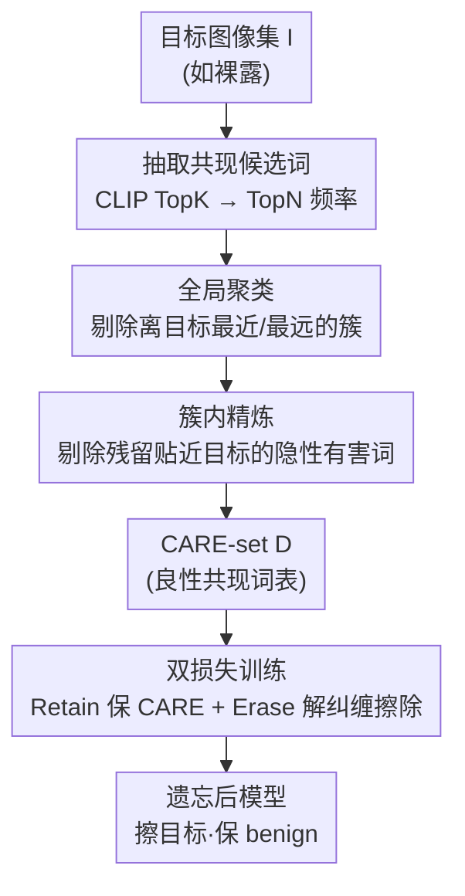

# Co-occurring Associated REtained concepts in Diffusion Unlearning

**会议**: ICLR 2026  
**OpenReview**: [https://openreview.net/forum?id=Ryc7jKP6H9](https://openreview.net/forum?id=Ryc7jKP6H9)  
**代码**: https://github.com/damilab/CARE  
**领域**: 扩散模型 / 概念遗忘 / AI 安全  
**关键词**: 扩散遗忘, 概念擦除, 共现概念保留, CARE score, 解纠缠

## 一句话总结
扩散模型在擦除有害概念（如裸露）时，往往把和它共现的良性概念（如"人"）一起抹掉；本文定义了这类必须保留的共现概念 CARE 并提出 CARE score 量化指标，再用 ReCARE 框架从目标图像自动构建一份"良性共现词表"（CARE-set）来同时引导保留与擦除，在裸露 / 梵高风格 / 丁鱥三个任务上同时拿到鲁棒性、可用性和 CARE 保留的整体最优。

## 研究背景与动机

**领域现状**：扩散模型的概念遗忘（unlearning）目前主流是 *post-hoc 擦除*——冻结一个教师模型 $\theta^*$，把目标概念 $c$ 的语义方向定义为条件预测与无条件预测之差 $\epsilon_{\theta^*}(z_t\mid c)-\epsilon_{\theta^*}(z_t\mid\varnothing)$，再训练学生模型沿这个方向的反向更新，从而"忘掉"目标。为了不把别的东西也忘了，近期方法（AdvUnlearn、AGE）引入 anchor（来自 ImageNet 标签、LLM 生成提示词或外部词典的非目标概念）做保留约束。

**现有痛点**：作者发现 anchor 类方法存在一个被忽视的致命弱点——**和擦除目标天然共现的良性概念会被一起压制**。擦"裸露"时，"人"这个概念也跟着被抹掉，于是给 "A nude person" 甚至单独 "A person" 提示词，模型都生不出人来（Fig.1）。同理擦"梵高"会抹掉"星空"，擦"丁鱥"会抹掉"淡水"。根因在于 CLIP 把共现概念编码到重叠的嵌入区域，纠缠很强；而外部 anchor 词表要么只覆盖泛泛的通用概念、要么词表质量有限，根本接不住这些细粒度的共现词。

**核心矛盾**：擦除的语义方向不可避免地会"溢出"到与目标强纠缠的良性共现词上，而常用的可用性指标（FID、CLIP score）只衡量全局保真度和提示词语义相似度，**完全测不出某个具体良性概念是否还在**——所以一个 FID/CLIP 很高的模型，仍可能已经丢掉了"人"。

**本文目标**：(1) 把这类"必须小心保留的共现概念"形式化为 CARE（Co-occurring Associated REtained concepts）；(2) 造一个能在规模上自动测 CARE 是否保留的指标；(3) 设计一个在擦除目标的同时显式守护 CARE 的训练框架。

**切入角度**：既然这些良性共现词本来就出现在目标图像里，那就直接从**目标图像本身**抽取共现词、过滤掉其中真正有害或无关的，剩下的就是该保留的 CARE 词表——不依赖外部 anchor，词表天然贴合真实共现分布。

**核心 idea**：从目标图像自动构建一份精炼后的良性共现词表 CARE-set，让它同时作为"保留信号"和"擦除时的对齐参照"注入训练目标，从而把"擦目标"和"保 benign"解纠缠。

**CARE score 怎么定义**：用 CLIP R-Precision@1 来测某个 CARE 概念是否还能被生成。对每个目标选一个 CARE 概念 $w^\star$（如裸露对应 "person"），和 80 个来自 COCO 物体标签的无关 token $O$ 放一起，用含 $w^\star$ 的提示词生成图像 $x_s=G(c_{w^\star})$，看 $w^\star$ 是否在所有候选里 CLIP 相似度排第一：

$$\text{CARE}_{\text{score}}=\frac{1}{S}\sum_{s=1}^{S}\mathbb{1}\!\left(\text{CLIP}(x_s,w^\star)=\max_{w\in(\{w^\star\}\cup O)}\text{CLIP}(x_s,w)\right)$$

它和人工标注的"图里有没有这个概念"强相关（Pearson $r=0.905$），且对编码器不敏感（把 CLIP 换成 SigLIP 排序基本不变），是独立于鲁棒性、可用性之外的第三根评测轴。

## 方法详解

### 整体框架
ReCARE（Robust erasure for CARE）的核心是"先造词表、再用词表训练"两段式。给定一个目标概念（如裸露）和它的一批目标图像，ReCARE 先用 CLIP 从图像里抽出一堆共现候选词，这堆词里混着三类东西：目标本身、应该一起擦的**有害共现词**（如 naked、topless）、应该保留的**良性共现词**（如 person、woman）；接着通过两道过滤——全局聚类剔掉"离目标最近"和"离目标最远"两端的簇，簇内精炼再剔掉簇内残留的、仍隐性贴近目标的词——得到精炼后的 **CARE-set $D$**。最后把 $D$ 注入训练：一边用 Retain Loss 锁住 CARE-set 上的知识不被擦掉，一边用 Erase Loss 把有害 token 从 CARE 表示里推开、对齐到"CARE 减去擦除方向"的参照上，实现"只擦目标、保住良性共现"。

### 关键设计

**1. 全局聚类：用正交残差剔除"太像目标"和"完全无关"的两端簇**

候选词 $T$ 是从目标图像里抽的——对每张图算 CLIP 相似度取 Top-K token，跨图聚合后取频率 Top-N（式 5）。这堆词必然混入两种该剔除的：和目标过于相似的有害词（擦裸露时的 naked），以及语义无关的噪声词（scarlett 这种和 CARE 无关的人名）。本设计要解决的就是"怎么自动把这两端切掉"。做法是先把候选词嵌入用 t-SNE 投到 2D、k-means 聚成 $n$ 个簇，再用一个**正交残差**度量每个词离目标的远近：设目标文本嵌入为 $e_c$，token 嵌入为 $e_t$，定义 $r(e_t)=\lVert e_t(I-e_c e_c^\top)\rVert_2$。直觉上 $r$ 小说明这个词的方向几乎和目标重合（太像，多半有害），$r$ 大说明它和目标几乎正交（太远，多半无关），中间区间才是潜在 CARE。于是对每个簇算平均残差 $\bar r_k$，把残差最小的簇 $k^-=\arg\min_k\bar r_k$ 和残差最大的簇 $k^+=\arg\max_k\bar r_k$ 整簇丢掉，剩下的作为候选 $C_{\text{cand}}=\{C_k\mid k\notin\{k^-,k^+\}\}$。相比直接拿外部 anchor 词表，这一步让保留信号来自真实共现分布，且用一个简单的几何量就把两端噪声一刀切。

**2. 簇内精炼：剔除残留下来、仍隐性贴近目标的词**

全局聚类是"整簇"粒度的，但保留下来的簇里仍可能混着一些"没那么露骨却依旧偏向目标"的词——比如 stripped、body，它们没 naked 那么直白，全局步骤滤不掉，可放进 CARE-set 又会拖累擦除。本设计在簇内做更细的逐词过滤：对簇 $C_k$ 里每个 token $t_i^{(k)}$，先算"把它去掉之后"该簇的留一质心 $e_{-i}^{(k)}=\frac{1}{|C_k|-1}\sum_{j\ne i}e_{t_j^{(k)}}$，再用一个二值指示器决定是否保留：

$$\delta_i^{(k)}=\begin{cases}1,& r(e_{-i}^{(k)})^2<(1+\alpha)\cdot\frac{1}{|C_k|-1}\sum_{j\ne i}r(e_{-j}^{(k)})^2\\[2pt]0,&\text{否则}\end{cases}$$

其中 $\alpha>0$ 控制剪枝严格程度（⚠️ 该不等式以原文式 9 为准）。直觉是：仍然过度对齐目标的 token，对所在簇的"概念正交分量"贡献很小，因而会被剪掉；剩下的词才是真正良性的共现概念，汇总成最终 CARE-set $D=\bigcup_k\{t_i^{(k)}\mid\delta_i^{(k)}=1\}$。这一步把保留信号从"簇级别"细化到"词级别"，是后面擦除还能保住 CARE 的关键。

**3. 双损失训练：让 CARE-set 同时驱动"保留"与"擦除"**

有了 $D$，总目标是 $L_{\text{ReCARE}}=\lambda L_{\text{Retain}}+L_{\text{Erase}}$，$\lambda$ 调节鲁棒擦除与 CARE 保留的权衡。**Retain Loss** 直接锁住 CARE：用通用模板（"A photo of …"）把 $D$ 里的 token 拼成保留提示词 $E$，约束遗忘后模型 $\theta_i$ 在这些非目标概念上和原模型 $\theta^*$ 的噪声预测一致，

$$L_{\text{Retain}}=\mathbb{E}\big[\lVert\epsilon_{\theta^*}(z_t,t,E)-\epsilon_{\theta_i}(z_t,t,E)\rVert_2^2\big]$$

**Erase Loss** 则用 $D$ 把有害 token 从 CARE 表示里解纠缠出来。它先借 STEREO 的文本反演（STE）反复求出能在部分擦除后仍重建目标的最优嵌入序列 $v_1^*,v_2^*$，与显式目标词（如 "nudity"）一起求平均得到擦除方向 $\epsilon_{\text{erase}}$；再用"原模型在 $D$ 上的 CARE 表示减去擦除方向"作为对齐参照，训练 $\theta_i$ 让有害 token 集合 $H=\{v_1^*,v_2^*,\text{"nudity"}\}$ 的预测去匹配这个参照：

$$L_{\text{Erase}}=\mathbb{E}\big[\lVert(\epsilon_{\theta^*}(z_t,t,D)-\epsilon_{\text{erase}})-\epsilon_{\theta_i}(z_t,t,H)\rVert_2^2\big]$$

这样设计的巧处在于：擦除方向不是孤立地把目标推向无条件输出，而是**以 CARE 表示为锚**——把有害方向从 CARE 里"减"出去，强迫模型在抹掉目标的同时把表示拉回到良性共现概念上，从而避免了 anchor 类方法那种"擦目标顺手抹掉 benign"的溢出。

### 损失函数 / 训练策略
总损失 $L_{\text{ReCARE}}=\lambda L_{\text{Retain}}+L_{\text{Erase}}$。CARE-set 构建端到端仅约 1.78 分钟（CLIP 相似度 → 聚类 → 精炼）；训练含文本反演 23.23 分钟 + ReCARE 优化 5.10 分钟，合计约 28.33 分钟，峰值显存 24GB（H100）。全局聚类默认簇数 $n=6$。

## 实验关键数据

评测三根轴：鲁棒性用攻击成功率 ASR（越低越好，雷达图里报 Defense $=100\%-\text{ASR}$）；可用性用 COCO-30K 上的 FID（低好）与 CLIP Score（高好）；CARE 保留用 CARE score。综合指标 RATIO = 三轴张成的雷达图归一化面积，越大越好。攻击含 UnlearnDiff(UD)、Ring-A-Bell、CCE 三种，对比 11 个遗忘基线。

### 主实验

裸露 / 梵高 / 丁鱥三任务下 ReCARE 的 RATIO 均为最高（裸露 0.76、梵高 0.81、丁鱥 0.85）。下表摘取裸露任务的代表性对比（CCE 是最强攻击）：

| 方法 | CCE-ASR ↓ | CLIP ↑ | FID ↓ | CAREscore ↑ | RATIO ↑ |
|------|-----------|--------|-------|-------------|---------|
| SD v1.4（原模型，未擦） | 56.82 | 0.3136 | 14.12 | 0.97 | 0.56 |
| ESD | 53.41 | 0.3045 | 13.75 | 0.89 | 0.49 |
| AGE | 27.27 | 0.3006 | — | 0.56 | — |
| AdvUnlearn | 65.45 | 0.2925 | — | 0.36 | — |
| STEREO | 19.55 | 0.2907 | 17.83 | 0.11 | 0.21 |
| **ReCARE (Ours)** | **11.14** | 0.3053 | 13.85 | **0.94** | **0.76** |

关键对照：STEREO 靠文本反演拿到不错的鲁棒性（CCE 19.55），但 CARE score 只有 0.11、FID 也崩到 17.83——擦得动却把良性概念和画质一起牺牲了；AdvUnlearn 可用性尚可却既不鲁棒（CCE 65.45）也保不住 CARE（0.36）。ReCARE 是唯一同时把 CCE 压到最低（11.14）、CARE 拉到接近原模型（0.94 vs 原模型 0.97）的方法。

### 消融实验

CARE-set 两道精炼各自的贡献（裸露任务）：

| 配置 | CCE-ASR ↓ | CLIP ↑ | CAREscore ↑ | 说明 |
|------|-----------|--------|-------------|------|
| ReCARE (Full) | 11.14 | 0.3053 | 0.94 | 完整两道精炼 |
| w/o Intra | 16.36 | 0.3082 | 0.93 | 去簇内精炼，残留隐性有害词 → ASR 升 |
| w/o Global | 25.00 | 0.3039 | 0.90 | 去全局聚类，混入无关词 → CARE 降、ASR 升 |
| w/o refinement | 27.05 | 0.3056 | 0.88 | 完全不精炼，CARE 最低、ASR 最高 |

效率对比（裸露）：ReCARE 仅 0.50h，CCE 11.14、CARE 0.94；而 AdvUnlearn 要 21.80h，效果还更差（CCE 65.45、CARE 0.36）。

### 关键发现
- **全局聚类比簇内精炼更关键**：去掉全局聚类 CCE 从 11.14 升到 25.00、CARE 从 0.94 降到 0.90；去掉簇内精炼影响相对小（CCE 16.36、CARE 0.93）。两道一起用才达到鲁棒-保留的最佳平衡。
- **CARE score 对编码器不敏感**：把评测用的 CLIP 换成 SigLIP，各方法绝对值变了但相对排序基本不变（强保留的 SD v1.4 / ReCARE 依旧靠前，弱的 AdvUnlearn 依旧垫底），说明指标不绑定 CLIP 表示空间。
- **簇数 $n$ 不敏感**：$n=4,5,6$ 下擦除能力和 CARE 保留都稳定，$n=6$ 综合最佳，设为默认。
- **STEREO 在 person 上的低分有额外含义**：它生成的人形虽存在却严重退化、几乎认不出，CARE score 因此偏低——说明该指标不只测"有没有"，还反映了画质退化，是更严格的度量。

## 亮点与洞察
- **把"共现概念被误擦"这个被忽视的失败模式形式化**：CARE 这个定义本身就是贡献——以前大家只盯着"擦得干不干净"和"FID 好不好"，没人测"擦裸露后还生不生得出人"。指出问题往往比解决问题更难，这篇先把问题说清楚了。
- **CARE score 用 R-Precision@1 巧妙绕开"全局指标测不出局部概念"的盲区**：把目标 CARE 词和 80 个无关 COCO token 放一起做 top-1 检索，直接验证"这个具体概念在不在"，且和人工标注 $r=0.905$，是个又简单又可信的新评测轴。
- **从目标图像自取词表，而非依赖外部 anchor**：保留信号天然贴合真实共现分布，避开了 ImageNet/LLM anchor"只覆盖通用概念、词表质量有限"的老问题，这个思路可迁移到任何"擦 A 时怕误伤与 A 强纠缠的 B"的编辑任务。
- **Erase Loss 以 CARE 表示为锚做解纠缠**：把擦除从"推向无条件输出"改成"从 CARE 表示里减掉有害方向"，让擦除和保留在同一个目标里耦合优化，这是它能同时拿下鲁棒性和 CARE 的根本原因。

## 局限与展望
- **依赖目标图像与文本反演**：CARE-set 来自目标图像，且 Erase Loss 复用 STEREO 的文本反演求擦除方向，目标图像质量/数量和反演稳定性会影响词表与擦除方向；训练中文本反演占了大头时间（23.23 min / 28.33 min）。
- **CARE 概念的选取仍带人工**：CARE score 评测时每个目标"选一个" CARE 概念（裸露选 person），如何系统化地为复杂目标确定该保留哪些 benign 概念、是否会漏掉次要共现概念，文中未充分展开。
- **正交残差 + t-SNE/k-means 的几何假设较强**：用 $r(e_t)=\lVert e_t(I-e_ce_c^\top)\rVert$ 把"远近"压成一个标量、再剔两端簇，对那些"既不极近也不极远却仍该剔"的边界词，主要靠簇内精炼的阈值 $\alpha$ 兜底；t-SNE 投影的随机性对结果的影响也未深入分析。
- **任务范围**：实验集中在裸露 / 梵高风格 / 丁鱥三类代表性目标与 SD v1.4，尚未验证更大规模、多目标同时擦除或更新架构上的表现。

## 相关工作与启发
- **vs AGE / AdvUnlearn（anchor 类保留）**：它们从 ImageNet 标签、LLM 生成提示词或外部词典取 anchor 做保留，覆盖的是泛泛的非目标概念，接不住和目标强纠缠的细粒度共现词；ReCARE 直接从目标图像自建并精炼词表，针对性地守护 CARE，因此在保 benign 上明显更强（裸露 CARE 0.94 vs AGE 0.56 / AdvUnlearn 0.36）。
- **vs STEREO（文本反演求擦除方向）**：ReCARE 复用了它的文本反演来求擦除方向，但 STEREO 只顾把目标擦干净，导致可用性和 CARE 双双崩塌（CARE 仅 0.11）；ReCARE 把擦除方向锚到 CARE 表示上做解纠缠，在保住鲁棒性的同时把 CARE 拉回接近原模型水平。
- **vs ESD（post-hoc 擦除基线）**：ESD 把目标预测推向无条件输出，没有任何对良性共现概念的显式保护；ReCARE 在同一 post-hoc 框架内补上了 CARE-set 驱动的双损失，是对这条主线的"保留侧"补全。

## 评分
- 新颖性: ⭐⭐⭐⭐⭐ 首次形式化"共现良性概念被误擦"问题，并配套了指标(CARE score)+方法(ReCARE)两件套，问题定义本身就有价值
- 实验充分度: ⭐⭐⭐⭐ 三任务、11 基线、三种攻击、含编码器无关性与簇数敏感性消融，较完整；但目标种类和架构覆盖仍有限
- 写作质量: ⭐⭐⭐⭐ 动机用 Fig.1 一图点醒，方法两段式清晰；部分公式（簇内剪枝不等式）需对照原文确认
- 价值: ⭐⭐⭐⭐⭐ 给扩散遗忘补上了"保住良性共现概念"这一被忽视却实际关键的维度，指标与方法都易复用

<!-- RELATED:START -->

## 相关论文

- [\[ICCV 2025\] Meta-Unlearning on Diffusion Models: Preventing Relearning Unlearned Concepts](../../ICCV2025/image_generation/meta-unlearning_on_diffusion_models_preventing_relearning_unlearned_concepts.md)
- [\[ICLR 2026\] Continual Unlearning for Text-to-Image Diffusion Models: A Regularization Perspective](continual_unlearning_for_text-to-image_diffusion_models_a_regularization_perspec.md)
- [\[ICLR 2026\] Forget Many, Forget Right: Scalable and Precise Concept Unlearning in Diffusion Models](forget_many_forget_right_scalable_and_precise_concept_unlearning_in_diffusion_mo.md)
- [\[ICML 2026\] A Unified Framework for Diffusion Model Unlearning with f-Divergence](../../ICML2026/image_generation/a_unified_framework_for_diffusion_model_unlearning_with_f-divergence.md)
- [\[ICML 2026\] Finding DoRI: Discovery of Retained Images in Diffusion Models](../../ICML2026/image_generation/finding_dori_discovery_of_retained_images_in_diffusion_models.md)

<!-- RELATED:END -->
