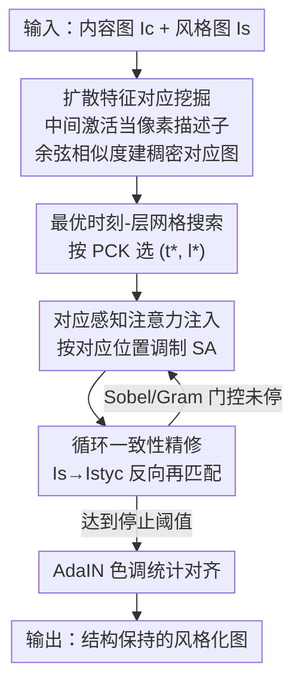

# CoCoDiff: Correspondence-Consistent Diffusion Model for Fine-grained Style Transfer

**会议**: ICLR2026  
**OpenReview**: [https://openreview.net/forum?id=eRSuwB78LH](https://openreview.net/forum?id=eRSuwB78LH)  
**代码**: https://github.com/Wenbo-Nie/CoCoDiff  
**领域**: 扩散模型 / 风格迁移  
**关键词**: 风格迁移, 语义对应, 扩散特征, 注意力注入, 循环一致性

## 一句话总结
CoCoDiff 是一个**免训练**的风格迁移框架，它直接从预训练 Stable Diffusion 的中间特征里挖出内容图与风格图之间的**像素级语义对应**，再用一个**循环一致性**的注意力注入机制把风格"贴"到结构对齐的区域上，在 FID/LPIPS/ArtFID/CFSD 四项指标上全面超过需要额外训练或标注的方法。

## 研究背景与动机
**领域现状**：神经风格迁移要把一张内容图渲染成另一张风格图的视觉外观。从 Gatys 用 CNN 分层分离内容/纹理，到 AdaIN、WCT、StyTR²（Transformer）、再到扩散时代的 StyleID、InstantStyle-Plus 等，工具越来越强。其中**免训练**的扩散方法（直接操纵预训练模型的自注意力来换风格）因为不用重新训练而格外受青睐。

**现有痛点**：现有方法基本都在**全局层面**做风格迁移，忽视了**区域级、甚至像素级的语义对应**。后果有两类：一类（如 StyleID）把风格全局地铺上去，导致结构错位、内容细节丢失；另一类（如 SMS）为了找对应，去从头训练一套复杂的外部模块，既低效又"舍近求远"。论文用 Fig.1 直观展示了这些失败：训练-free 扩散方法出现结构退化和对应错误，神经网络方法又抓不住目标风格。

**核心矛盾**：几乎所有方法都把预训练扩散模型当成一个**黑盒生成器**，而**没有意识到扩散骨干网络内部本就编码了强大的语义对应信息**。于是出现一个关键缺口——没人去直接挖掘并利用模型自身的语义理解能力来做高保真风格迁移。

**本文目标**：把风格迁移拆成两个相互纠缠的子问题——（1）在颜色/纹理/几何差异巨大的内容图与风格图之间，找到**稠密且语义有意义的对应**；（2）即便有了完美的对应图，如何把局部风格特征注入到内容结构上而**不破坏整体全局风格的和谐**。

**切入角度**：作者观察到 DIFT 等工作早已证明预训练扩散 U-Net 的中间激活能跨域对齐物体特征。既然语义对应"已经在那里了"，那就不该从头训练，而应该**在合适的去噪时刻和网络层上把它读出来**。

**核心 idea**：用预训练扩散特征**挖出**内容-风格的像素级对应图，再用一个**循环优化**的注意力注入机制把风格按对应关系注入——全程免训练、免标注、免微调。

## 方法详解

### 整体框架
CoCoDiff 的输入是一张内容图 $I_c$ 和一张风格图 $I_s$，输出是结构保持、语义一致的风格化结果。整个流程基于 Stable Diffusion 的 DDIM 反演轨迹，分成串行的两大阶段：

第一阶段 **细粒度特征匹配（Fine-grained Feature Matching, FFM）**：把内容图和风格图分别送入扩散 U-Net，把中间激活当作逐像素描述子，对每个内容位置在风格图里找余弦相似度最高的对应位置，构建一张稠密语义对应图；并通过二维网格搜索挑出"最会编码语义"的去噪时刻 $t^*$ 和网络层 $l^*$。

第二阶段 **拟合循环与迭代控制（Fitting Cycle and Iterative Control, FIC）**：拿着对应图去**调制自注意力**完成风格注入，但注入不是一锤子买卖——作者引入一个闭环：先把风格图反向"学"成内容图的风格得到中间图 $I_{styc}$，再在 $I_c$ 与 $I_{styc}$ 之间重新匹配，从而拿到比直接匹配更准的对应坐标，再注入。每一轮迭代用内容感知损失（Sobel 边缘）和风格感知损失（Gram 矩阵）做自适应门控决定何时停止；最后用 AdaIN 做色调统计对齐收尾。

### 关键设计

**1. 扩散特征对应挖掘：把语义对应从骨干网络里"读"出来而非从头学**

这一设计直击"现有方法把扩散模型当黑盒"的痛点。预训练扩散 U-Net 的中间激活天然编码了跨时刻 $t$、跨层 $l$ 的语义线索，CoCoDiff 把这些激活当作逐像素描述子。对内容图每个空间位置 $p_c$，在风格图里找余弦相似度最高的位置 $p_s$：

$$\cos(p_c, p_s) = \frac{I_c(p_c) \cdot I_s(p_s)}{\|I_c(p_c)\|\,\|I_s(p_s)\|}$$

由此得到一张稠密语义对应图，最终对应位置取 $p_s^* = \arg\max_{p_s \in I_s} \cos(p_c, p_s)$。这样做的好处是：对应信息免费来自骨干网络，既不用像 SMS 那样训外部模块，又比全局风格迁移多了区域/物体级的结构感知，让"同一个物体保持风格一致"成为可能。

**2. 最优时刻-层网格搜索：用 PCK 找到最会编码语义的特征**

扩散特征并非每个 $(t,l)$ 都同样可靠——浅层/晚时刻偏低层细节，深层/早时刻偏高层语义。作者做一个二维网格搜索，在候选集 $\mathcal{T}$、$\mathcal{L}$ 上最大化一个对应质量指标 $M(t,l)$：

$$(t^*, l^*) = \arg\max_{t \in \mathcal{T},\, l \in \mathcal{L}} M(t, l)$$

$M(t,l)$ 的定义是关键：作者在 SPair-71k 这类标准语义对应基准上，对每个内容关键点找风格图里余弦相似度最高的位置，用 **PCK（Percentage of Correct Keypoints，预测对应落在真值关键点可接受距离内的比例）** 作为评判，$M(t,l)$ 即所有样本上的平均 PCK。PCK 越高说明该 $(t,l)$ 的特征空间提供的语义对齐越可靠。选定 $(t^*, l^*)$ 后固定下来，供后续注入使用。这一步把"用哪层特征匹配"从拍脑袋变成了可量化的选择。

**3. 对应感知注意力注入：按对应位置精准调制自注意力，而非全局换 KV**

预备知识里风格注入的基础做法是在自注意力块里用风格图的键值 $K_s^t, V_s^t$ 替换内容的，计算 $\phi_c^{out} = \text{Attn}(Q_c^t, K_s^t, V_s^t)$。但这是全局的。CoCoDiff 改成**按对应位置加权调制**：

$$\text{feat}[k] = w \cdot \text{attn}[k][p_s^*] + \text{feat}[k][p_c]$$

其中 $k$ 是特征通道，$p_c$ 是内容图位置，$p_s^*$ 是对应的风格位置，$w$ 是控制注意力特征贡献的权重因子。这意味着风格特征只被注入到**语义对齐的区域**，最大程度保留内容图的结构信息。消融显示 $w=0.6$ 最优：太小（0.3）风格化不足，太大（3.0）会引入结构扭曲。

**4. 循环一致性精修：用"间接对应"解决跨分布直接匹配的脆弱性**

这是 CoCoDiff 最巧的设计，针对"内容图与风格图统计差异大时直接匹配会失败"的痛点。如果直接在 $I_c$ 和 $I_s$ 之间匹配特征，由于两者颜色/纹理分布迥异，匹配精度低、对应失败（Fig.4B.a/c 验证）。作者的做法是**闭环**：先用注意力注入让风格图去"学"内容图的风格，得到带内容特征的中间图 $I_{styc} = \text{Attn}(Q_s, K_c, V_c)$；然后在 $I_c$ 与 $I_{styc}$（已经被拉近到同一分布）之间建立对应，得到坐标对 $(p_c, p_{styc}^*)$；再对 $I_c$ 和 $I_s$ 做注入：

$$\text{feat}[k] = w \cdot \text{attn}[k][p_{styc}^*] + \text{feat}[k][p_c]$$

这种"间接对应"把匹配放到分布更接近的图对之间做，精度显著提升（Fig.4B.b/d：差异热图集中在波浪纹理上，说明轮廓被保住、风格被精准迁移）。每个拟合循环执行一次，迭代地把对应做准、把结构保住、把视觉保真度提上去。

### 损失函数 / 训练策略
CoCoDiff 免训练，所谓"损失"是用来做**自适应迭代门控**而非反传更新网络。第 $z$ 轮生成图记为 $I_{gen}^{(z)}$：

内容感知损失用 Sobel 边缘图度量结构一致性：

$$L_{content} = \|\text{Sobel}(I_{gen}^{(z)}) - \text{Sobel}(I_c)\|$$

风格感知损失用 Gram 矩阵跨层度量纹理风格：

$$L_{style} = \sum_{l \in layers} \|G(I_{gen}^{(z),l}) - G(I_s)\|_F^2$$

当**同时**满足 $L_{content} > \tau_c$ 且 $L_{style} < \tau_s$ 时迭代终止，从而防止过度风格化或结构扭曲。最后用 AdaIN 做色调统计对齐：$y_{cs} = \sigma(y_s)\frac{y_c - \mu(y_c)}{\sigma(y_c)} + \mu(y_s)$，用风格图的通道均值/方差把色调统计搬过来，同时保留内容结构。实验在单张 RTX 4090、SD v1.4、DDIM 50 步、注意力温度 $\gamma=0.7$ 下完成。

## 实验关键数据

### 主实验
内容数据集用 MS-COCO，风格数据集用 WikiArt，各随机抽 30 张组成评测集，跨 13 种艺术风格（油画、儿童插画、水彩、吉卜力、风景木刻版画等）。对比 9 个方法，四项指标全部越低越好：

| 指标 | CoCoDiff | StyleID | AesPA | StyTR² | AdaIN | SCSA | SMS |
|------|---------|---------|-------|--------|-------|------|-----|
| FID ↓ | **18.432** | 21.010 | 19.645 | 18.886 | 18.672 | 20.835 | 31.266 |
| LPIPS ↓ | **0.549** | 0.565 | 0.556 | 0.587 | 0.612 | 0.562 | 0.821 |
| ArtFID ↓ | **30.100** | 34.446 | 32.124 | 31.559 | 31.711 | 34.106 | 58.756 |
| CFSD ↓ | 0.609 | 0.619 | 0.632 | 0.687 | 0.642 | **0.612** | 0.704 |

CoCoDiff 在 FID/LPIPS/ArtFID 三项均第一，CFSD（内容结构保持）略逊于 SCSA（0.609 vs 0.612），整体在"风格表现力"与"内容保持"之间取得最稳的平衡。

跨扩散模型规模实验（model-agnostic 验证）：

| 指标 | SD v1.4 | SD v1.5 | SD v2.1 | SDXL |
|------|---------|---------|---------|------|
| FID ↓ | 18.432 | **17.995** | 18.252 | 21.412 |
| ArtFID ↓ | 30.1 | **28.94** | 31.18 | 36.69 |
| CFSD ↓ | 0.609 | **0.589** | 0.766 | 0.714 |

CoCoDiff 在不同骨干上都稳定可用；SDXL 风格质量强但细粒度语义对齐稳定性下降，需重调 $\gamma$ 等超参。

### 消融实验
Sobel（结构）与 Gram（风格）门控损失的组合（Table 3）：

| Sobel | Gram | FID ↓ | LPIPS ↓ | CFSD ↓ | 说明 |
|-------|------|-------|---------|--------|------|
| ✗ | ✗ | 26.513 | 0.697 | 0.804 | 两者都去，全面最差 |
| ✓ | ✗ | 29.845 | 0.506 | 0.631 | 只 Sobel：结构对齐好、FID 反而差 |
| ✗ | ✓ | 23.471 | 0.753 | 0.761 | 只 Gram：全局风格好、局部细节失真 |
| ✓ | ✓ | **18.432** | 0.549 | **0.609** | 互补，整体最优 |

注入权重 $w$ 与 AdaIN（Table 4）：

| 配置 | FID ↓ | LPIPS ↓ | CFSD ↓ | 说明 |
|------|-------|---------|--------|------|
| $w=0.3$ | 23.717 | 0.681 | 0.642 | 风格化不足 |
| $w=0.6$ | **18.432** | **0.549** | **0.609** | 最优平衡 |
| $w=3.0$ | 35.937 | 0.667 | 0.791 | 结构扭曲 |
| w/o AdaIN | 20.515 | 0.762 | 0.646 | 去掉色调对齐明显掉点 |

### 关键发现
- **Sobel 与 Gram 互补性最强**：单用任一都会偏科（Sobel 偏结构、Gram 偏全局风格），合起来才同时拿到最低 FID 和最佳内容-风格平衡。
- **注入权重 $w$ 敏感且呈"碗形"**：0.6 是甜点，偏离两侧都急剧变差，$w=3.0$ 的 FID 几乎翻倍。
- **自适应迭代门控胜过固定迭代**：Fig.5 显示在 LPIPS/FID/CFSD 上自适应早停都优于 1–5 的固定轮数，避免了"统一迭代次数"的次优。
- **间接对应优于直接对应**：差异热图证明间接策略能把差异精确局限在该变的纹理上、保住物体轮廓。

## 亮点与洞察
- **"对应信息本就在骨干里"这个判断很关键**：CoCoDiff 不训练外部对应模块，而是把 DIFT 式的扩散特征语义对齐能力直接用到风格迁移，省成本又抓住了结构。这是它能免训练却打过监督方法的根因。
- **循环间接匹配是点睛之笔**：先把风格图拉到内容分布再匹配，绕开了跨分布直接匹配的脆弱性——这个"先对齐分布再找对应"的思路可迁移到任何跨域稠密匹配任务（如跨模态检索、跨域分割的伪标签对齐）。
- **用 PCK 在标准基准上量化选层**：把"用哪个 $(t,l)$ 特征"从经验变成可度量的网格搜索，这种"借语义对应基准来标定生成模型内部特征"的做法值得借鉴。
- **门控损失只用于停不用于训**：Sobel+Gram 当作自适应早停的裁判而非梯度来源，是免训练框架里很轻量的质量控制方式。

## 局限与展望
- **网格搜索 $(t^*, l^*)$ 与超参调优有成本**：跨模型（尤其 SDXL）需要重调 $\gamma$、温度等，"免训练但需调参"，自动化程度有限。
- **CFSD 并非全场第一**：内容结构保持上略输 SCSA，说明在极端结构敏感场景仍有提升空间。
- **依赖 SD 自注意力机制**：方法绑定在 U-Net 自注意力的 KV 替换范式上，迁移到 DiT 等新架构是否同样有效未验证。
- **评测规模偏小**：每数据集仅抽 30 张、迭代实验用 10×10 图对，统计稳健性可进一步扩大验证。
- **改进思路**：把 $(t^*,l^*)$ 的网格搜索替换成一个轻量的可学习选择器或按图自适应选层；把门控阈值 $\tau_c,\tau_s$ 做成自适应而非预设。

## 相关工作与启发
- **vs StyleID**（免训练扩散）：StyleID 全局换风格导致结构不一致、细节丢失；CoCoDiff 用像素级对应做空间感知注入，FID 18.4 vs 21.0、ArtFID 30.1 vs 34.4 全面更优。
- **vs SMS**（从头学对应）：SMS 训练复杂外部模块、低效，且 FID 高达 31.3；CoCoDiff 直接挖骨干特征，免训练却大幅领先。
- **vs StyTR²**（Transformer）：StyTR² 用 Transformer 保结构，CoCoDiff 在 LPIPS（0.549 vs 0.587）和 CFSD（0.609 vs 0.687）上更好地兼顾感知相似与结构保持。
- **vs DIFT**：DIFT 证明扩散特征能做跨域对应，CoCoDiff 把这一能力**落地到风格迁移**并加上循环精修与注意力注入，是从"发现对应"到"用对应做生成"的延伸。

## 评分
- 新颖性: ⭐⭐⭐⭐ 把扩散特征对应 + 循环间接匹配用于免训练风格迁移，组合新颖且动机清晰。
- 实验充分度: ⭐⭐⭐⭐ 9 方法对比 + 跨骨干 + 多组消融 + 用户研究齐全，但评测样本量偏小。
- 写作质量: ⭐⭐⭐⭐ 结构清晰、公式与算法完整，部分图注与排版略显仓促。
- 价值: ⭐⭐⭐⭐ 免训练、低成本、即插即用，对实际风格迁移落地有较强实用价值。

<!-- RELATED:START -->

## 相关论文

- [\[CVPR 2026\] RegionRoute: Regional Style Transfer with Diffusion Model](../../CVPR2026/image_generation/regionroute_regional_style_transfer_with_diffusion_model.md)
- [\[ICCV 2025\] CharaConsist: Fine-Grained Consistent Character Generation](../../ICCV2025/image_generation/characonsist_fine-grained_consistent_character_generation.md)
- [\[CVPR 2025\] SaMam: Style-aware State Space Model for Arbitrary Image Style Transfer](../../CVPR2025/image_generation/samam_style-aware_state_space_model_for_arbitrary_image_style_transfer.md)
- [\[CVPR 2025\] HSI: A Holistic Style Injector for Arbitrary Style Transfer](../../CVPR2025/image_generation/hsi_a_holistic_style_injector_for_arbitrary_style_transfer.md)
- [\[CVPR 2026\] Style-GRPO: Semantic-Aware Preference Optimization for Image Style Transfer Guided by Reward Modeling](../../CVPR2026/image_generation/style-grpo_semantic-aware_preference_optimization_for_image_style_transfer_guide.md)

<!-- RELATED:END -->
