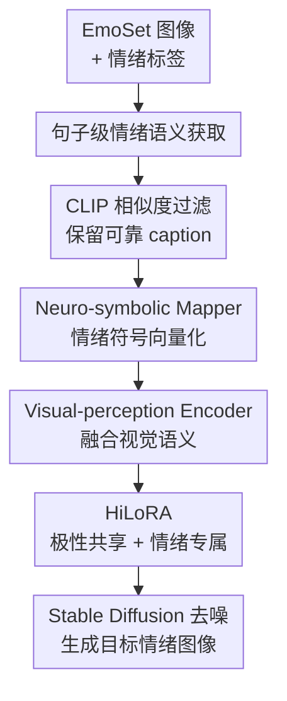

# CoEmoGen: Towards Semantically-Coherent and Scalable Emotional Image Content Generation

**会议**: ICLR2026  
**OpenReview**: [https://openreview.net/forum?id=PTzByqd0aJ](https://openreview.net/forum?id=PTzByqd0aJ)  
**代码**: https://github.com/yuankaishen2001/CoEmoGen  
**领域**: 图像生成 / 情感图像内容生成  
**关键词**: 情感图像生成, 扩散模型, 语义一致性, MLLM标注, HiLoRA  

## 一句话总结
CoEmoGen 把情绪从一个抽象类别转成句子级、上下文连贯的视觉语义描述，再用分层 LoRA 在 Stable Diffusion 中同时建模情绪极性共享的低层视觉风格和具体情绪独有的高层语义，从而比 EmoGen 等方法生成更符合目标情绪、语义更自然且更容易扩展到新数据源的图像。

## 研究背景与动机
**领域现状**：情感视觉分析过去主要在做“识别”：给定一张图，模型判断它会唤起 amusement、awe、contentment、excitement、anger、disgust、fear、sadness 等情绪。随着 text-to-image diffusion model 变强，一个自然的反向问题出现了：能不能只给一个目标情绪，生成一张语义清楚、真正能唤起这种情绪的图像？这就是 Emotional Image Content Generation（EICG）。

**现有痛点**：通用文生图模型擅长“狗、车、桌子”这类具体概念，却很难直接理解“敬畏、满足、厌恶”这类抽象情绪。早期情绪迁移方法多从颜色、纹理、风格入手，但图像内容固定，只改低层视觉属性往往不足以让人产生目标情绪。更接近本文的 EmoGen 已经尝试用 EmoSet 里的物体、场景等词级属性标签做语义引导，可这些标签经常是孤立词：例如“railroad track, tree, jeans”能列出元素，却说不清人物为什么悲伤；有些 fear 图只标出“fashion accessory”，真正触发恐惧的 clown 和遮脸动作反而没被覆盖；还有一些样本属性标签缺失，导致训练语料规模和多样性受限。

**核心矛盾**：情绪图像生成需要的是“能触发情绪的视觉叙事”，而不是若干离散物体词的拼接。词级标签便宜、结构简单，却缺少上下文关系；句子级 caption 更接近人类描述情绪的方式，但由 MLLM 自动生成又会带来幻觉和噪声。另一方面，同一极性的情绪确实共享亮度、色彩等低层规律，但 fine-grained 情绪又依赖不同高层语义，如果只用一个 LoRA 统一适配，容易把“同为正向/负向”的情绪混在一起。

**本文目标**：作者希望同时解决两个子问题：第一，把 EICG 的语义监督从词级属性扩展为句子级、情绪相关、上下文连贯的 caption，并保证这些 caption 足够可靠；第二，在扩散模型适配时区分“极性共享”的低层视觉特征和“情绪专属”的高层语义，使模型既能保留同极性情绪的共同气质，又不会把具体情绪生成成一团模糊的平均状态。

**切入角度**：论文的关键观察来自心理学和数据构造两侧。心理学上，正向情绪往往共享明亮、丰富色彩等低层线索，负向情绪也有阴暗、压迫等共同视觉倾向；但 amusement、awe、contentment 这类情绪又需要不同事件、场景和叙事。数据侧，MLLM 已经足够强，可以根据图像和情绪先验生成一条聚焦情绪触发元素的 caption，再用 CLIP 图文相似度过滤掉最可疑的样本。

**核心 idea**：用“MLLM 生成并经 CLIP 过滤的句子级情绪 caption”替代词级属性标签做语义监督，再用 Hierarchical LoRA（HiLoRA）把极性共享低层特征和情绪专属高层语义分开学习。

## 方法详解
### 整体框架
CoEmoGen 的输入不是一段自由文本 prompt，而是目标情绪类别及其对应训练样本：每个样本包含图像 $I_i$、情绪标签 $y_i$ 和由 MLLM 生成的 caption $c_i$。方法先把 EmoSet 中每张图转成一句聚焦情绪触发内容的 caption，并用 CLIP 相似度过滤低质量图文对；训练时再把 one-hot 情绪标签映射为 emotion descriptor，与 CLIP 图像特征交互，送入 CLIP text encoder 得到 emotion condition，最后用带 HiLoRA 的 U-Net 完成去噪生成。

推理阶段沿用训练出的情绪条件和 HiLoRA 适配能力。为了保持多样性，作者不是固定使用某一张图像的视觉 embedding，而是从对应情绪预先构建的 Gaussian emotion cluster 中随机采样视觉 embedding，用它参与 emotion condition 的形成，使同一个情绪类别可以生成多种语义内容。

### 关键设计
**1. 句子级情绪语义获取：把孤立属性词改成有上下文的情绪触发描述**

EmoGen 依赖 EmoSet 的 scene、object 等词级属性，最大问题不是“没有语义”，而是语义关系断了：几个词并不能说明人物姿态、场景氛围、物体关系如何共同触发情绪。CoEmoGen 改用 MLLM 为每张 EmoSet 图像生成一句 caption，prompt 明确告诉模型“这张图唤起 `<emotion>`”，并要求它关注 brightness、colorfulness、scene type、object classes、facial expressions、human actions 等会表达情绪的视觉因素。这样生成的 caption 不只是列词，而会描述“一个穿 hoodie 的人低头站在铁轨上，看起来悲伤”这类情绪叙事。

MLLM caption 的风险是幻觉，所以作者没有直接全量使用，而是在 CLIP 空间计算 image-caption pair 的相似度，并在每个情绪类别内丢弃排名最低的 20% 样本。这个过滤步骤很关键：它让 caption 既能摆脱人工属性标签缺失的限制，又不至于把明显不贴图的 MLLM 描述喂给生成模型。最终训练语料仍来自 EmoSet，但监督从离散属性词变成了可靠的句子级语义引导。

**2. Neuro-symbolic Mapper 与视觉感知编码：让情绪类别先变成可交互的条件表示**

只把 “anger” 或 “awe” 的文本 embedding 塞进扩散模型，会让情绪类别被 CLIP 既有语义空间过度约束；直接学一个 class vector 又容易容量不足、缺少可解释的类别结构。CoEmoGen 选择先把 one-hot 情绪标签 $y_i^o$ 输入由全连接层和非线性激活组成的 Neuro-symbolic Mapper，得到 emotion descriptor $e_i$。这个设计保留了情绪类别的符号边界，又允许连续空间里展开更丰富的变化。

为了让情绪条件对齐具体图像内容，作者再用 CLIP image encoder 提取训练图像的视觉 embedding $v_i$，并通过以 cross-attention 为核心的 Visual-perception Encoder 让 $e_i$ 与 $v_i$ 交互：$e_i$ 作为 query，$v_i$ 作为 key/value，得到视觉增强后的情绪描述 $e_i^v$。论文公式写作 $e_i^v = \text{Softmax}(e_i W_q (v_i W_k)^T / \sqrt{d_0}) v_i W_v$。随后 $e_i^v$ 被送入 CLIP text encoder，形成最终 emotion condition $e_i^c$，用于指导 U-Net 去噪。

**3. HiLoRA：把极性共享低层特征和情绪专属高层语义拆开适配**

普通 LoRA 只在预训练权重 $W$ 上加一个低秩更新 $\Delta W = A \cdot B$，对具体概念微调很有效；但情绪不是单一物体，内部有层级结构。CoEmoGen 根据 Mikels 八类情绪的正/负极性划分，为 U-Net 设计了两层 LoRA：八个 emotion-specific LoRA 分别对应 amusement、awe、contentment、excitement、anger、disgust、fear、sadness，两个 polarity-shared LoRA 分别对应 positive 和 negative。

训练一个样本时，只激活它所属情绪的 emotion-specific LoRA，以及该情绪所属极性的 polarity-shared LoRA。以 positive polarity 下的 amusement 为例，权重更新从 $W' = W + A \cdot B$ 变成 $W' = W + A_1^p B_1^p + A_2^e B_2^e$。其中 polarity-shared LoRA 主要学习正向情绪共同的亮度、色彩丰富度等低层规律，emotion-specific LoRA 则学习 amusement 独有的事件和语义组合。这样模型不会把所有正向情绪都压成“明亮快乐”的平均图，也不会让每个情绪完全独立学习而浪费共享规律。

**4. 语义损失：防止扩散训练只记住像素重建而丢掉 caption 语义**

CoEmoGen 训练时冻结 latent encoder、CLIP image encoder、CLIP text encoder 和 U-Net 主体，只优化 Neuro-symbolic Mapper、Visual-perception Encoder 与 HiLoRA。基础目标仍是 latent diffusion loss $L_{LDM}$，让模型预测噪声 $\epsilon$ 并学习像素层面的生成能力。但作者指出，单靠 $L_{LDM}$ 容易让模型过度关注像素共性，甚至塌缩到某些固定语义模式，生成出来看似像训练分布，却不一定保留 sentence-level caption 里的情绪触发关系。

因此论文加入 semantic loss $L_{SEM}$，显式拉近 emotion condition $e_i^c$ 与 caption 经过 CLIP text encoder 得到的表示 $T(c_i)$。默认形式是余弦距离：$L_{SEM}=1-\frac{e_i^c \cdot T(c_i)}{\|e_i^c\|\|T(c_i)\|}$。这个损失不是直接让图像像某一句话，而是让情绪条件本身保持与句子级情绪语义一致，从源头减少“只学颜色、不学语义关系”的问题。

### 一个完整示例
假设训练样本的情绪标签是 sadness，原始词级属性可能只有 “railroad track, tree, jeans, trousers”。如果按 EmoGen 的方式，这些词可能被模型当作若干孤立元素使用，生成时容易出现“铁轨 + 树 + 人”的硬拼接，但未必体现悲伤。CoEmoGen 会先让 MLLM 看到图像和 sadness 先验，生成类似“一名穿 hoodie 和 jeans 的男子低头站在铁轨上，显得悲伤”的一句话；CLIP 过滤确认这句 caption 与图像匹配后，才把它作为训练语义。

进入模型训练时，sadness 的 one-hot 标签先通过 Neuro-symbolic Mapper 得到 $e_i$，再与该样本的 CLIP 视觉 embedding 交互，形成 $e_i^v$ 和 emotion condition $e_i^c$。U-Net 更新时只打开 negative polarity LoRA 和 sadness-specific LoRA：前者学习低亮度、压抑色调等负向情绪共性，后者学习低头、孤立场景、空旷铁轨等更接近 sadness 的高层语义。最终，$L_{LDM}$ 负责让图像生成质量过关，$L_{SEM}$ 约束条件表示贴近这句 caption 的语义。

### 损失函数 / 训练策略
训练目标由两个部分组成。第一部分是 latent diffusion loss：

$$
L_{LDM}=\mathbb{E}_{E(\cdot), I_i, e_i^c, \epsilon, t}\left[\left\|\epsilon-\epsilon_\theta(z_t,t,E(I_i),e_i^c)\right\|_2^2\right]
$$

它约束 U-Net 在给定图像 latent、时间步和 emotion condition 时预测噪声。第二部分是 semantic loss：

$$
L_{SEM}=1-\frac{e_i^c \cdot T(c_i)}{\|e_i^c\|\|T(c_i)\|}
$$

其中 $T(\cdot)$ 是 CLIP text encoder，$c_i$ 是 MLLM 生成并过滤后的 caption。论文在设置实验里比较了 MAE、MSE、K-L divergence 和 Cosine Similarity，最终选择余弦相似度，因为它在高维语义空间中更适合度量方向一致性。

实现上，模型以 Stable Diffusion v1.5 初始化 latent encoder 和 U-Net，以 CLIP ViT-L/14 初始化图像/文本编码器；Neuro-symbolic Mapper 隐层维度为 512，Visual-perception Encoder 中 $d_0=768$，HiLoRA rank $r=4$。训练使用 batch size 1、AdamW、学习率 $1e^{-3}$、weight decay $1e^{-2}$，总共训练 130,000 iterations，并沿用 random oversampling 缓解类别不均衡。所有实验在两张 NVIDIA RTX 4090 上完成。

## 实验关键数据

### 主实验
论文在 EICG 任务上与 Stable Diffusion、Textual Inversion、DreamBooth 和 EmoGen 比较。评估时每个情绪类别生成 1,000 张图，指标覆盖图像分布质量、视觉多样性、情绪准确性、语义清晰度和语义多样性。FID 越低越好，LPIPS、Emo-A、Sem-C、Sem-D 越高越好。

| 方法 | FID↓ | LPIPS↑ | Emo-A↑ | Sem-C↑ | Sem-D↑ |
|------|------|--------|--------|--------|--------|
| Stable Diffusion | 44.05 | 0.687 | 70.77% | 0.608 | 0.0199 |
| Textual Inversion | 50.51 | 0.702 | 74.87% | 0.605 | 0.0282 |
| DreamBooth | 46.89 | 0.661 | 70.50% | 0.614 | 0.0178 |
| EmoGen | 41.60 | 0.717 | 76.25% | 0.633 | 0.0335 |
| CoEmoGen | 40.66 | 0.732 | 80.15% | 0.641 | 0.0349 |

相对 EmoGen，CoEmoGen 的 FID 从 41.60 降到 40.66，Emo-A 从 76.25% 提升到 80.15%，Sem-C 和 Sem-D 也分别提升到 0.641 与 0.0349。这个结果说明它的收益不是单一维度：句子级 caption 提升语义清晰度和多样性，HiLoRA 则帮助情绪准确性与视觉质量同时改善。

### 消融实验
组件消融显示，语义损失是最关键的一项：去掉 $L_{SEM}$ 后 Emo-A 从 80.15% 掉到 65.90%，Sem-C 从 0.641 掉到 0.562，FID 也恶化到 50.32。去掉 emotion-specific LoRA 主要伤害具体情绪区分能力，去掉 polarity-shared LoRA 的量化下降较小，但作者在可视化中观察到亮度和色彩更单调或不自然。

| 配置 | FID↓ | LPIPS↑ | Emo-A↑ | Sem-C↑ | Sem-D↑ | 说明 |
|------|------|--------|--------|--------|--------|------|
| Full CoEmoGen | 40.66 | 0.732 | 80.15% | 0.641 | 0.0349 | 完整方法 |
| w/o $L_{SEM}$ | 50.32 | 0.698 | 65.90% | 0.562 | 0.0255 | 语义约束缺失，易塌缩到像素共性 |
| w/o emotion-specific LoRAs | 45.30 | 0.713 | 75.37% | 0.625 | 0.0308 | 同极性情绪之间更容易语义混淆 |
| w/o polarity-shared LoRAs | 41.47 | 0.724 | 78.83% | 0.638 | 0.0336 | 低层色彩/亮度建模变弱 |

论文还做了重要设置消融。caption prompt 中加入 emotional prior 且限制为 one-sentence 的版本效果最好；如果允许生成更长、更细的描述，反而会因为无关细节和 MLLM 幻觉增加而下降。输入表示方面，one-hot + Neuro-symbolic Mapper 明显优于 learnable class vector 和 emotion text embedding。语义损失形式方面，Cosine Similarity 优于 MAE、MSE 和 K-L divergence。

| 设置 | 最优选择 | 代表结果 | 结论 |
|------|----------|----------|------|
| caption 类型 | 有 emotional prior、无冗长 details | FID 40.66 / Emo-A 80.15% / Sem-C 0.641 | 情绪先验有效，过长 caption 带来噪声 |
| 情绪输入 | one-hot + Neuro-symbolic Mapper | FID 40.66 / LPIPS 0.732 / Sem-D 0.0349 | 比 learnable vector 和文本 embedding 更能保持多样性 |
| $L_{SEM}$ 形式 | Cosine Similarity | FID 40.66 / Emo-A 80.15% | 高维语义方向约束最稳定 |

### 关键发现
- 句子级 caption 的价值不只是“文字更长”，而是把对象、场景、动作、表情和情绪之间的关系连起来；这直接缓解 EmoGen 中 “fire + tiger + open mouth” 式的非自然拼贴。
- $L_{SEM}$ 是性能护栏。没有它时，模型即便有 caption 数据，也可能在 diffusion reconstruction 目标下退回像素级相似，而不是学习情绪触发语义。
- HiLoRA 的两个层级分工清晰：emotion-specific LoRA 更影响情绪准确性，polarity-shared LoRA 更影响同极性的低层视觉氛围。
- 用户研究中，17 名参与者在图像真实感、情绪忠实度、语义多样性、语义一致性四个维度比较 CoEmoGen 和其他方法；CoEmoGen 在语义一致性上的平均选择率达到 88.42%，与 EmoGen 直接比较时平均偏好率为 78.67%。这说明量化指标相近时，人类仍能明显感到句子级语义引导带来的自然性提升。
- 扩展性实验构建了 EmoArt：作者从 WikiArt 收集约 100,000 张艺术图像，覆盖 129 位艺术家、11 个 genre 和 27 种 style，用 EmoSet 预训练分类器筛选 emotion confidence 超过 0.75 的样本，最终得到 13,633 张强情绪艺术图像。由于 excitement 和 disgust 在艺术表达中低频，EmoArt 聚焦其余六类情绪。沿同样 caption 构造流程训练后，模型能生成风格多样的情绪艺术图像。

## 亮点与洞察
- 这篇论文真正抓住了 EICG 的核心：情绪不是一个孤立 token，而是由视觉元素之间的关系触发的。把监督从属性词升级到 sentence-level caption，比单纯换一个更强的 diffusion backbone 更对症。
- CLIP 过滤底部 20% 样本是一个朴素但有效的工程设计。它承认 MLLM caption 会有幻觉，同时用一个跨模态相似度门槛把最不可靠的数据去掉，为“可扩展”提供了最低限度的质量控制。
- HiLoRA 的层级结构很贴合情绪分类本身。正/负极性对应低层视觉气质，具体八类情绪对应高层语义，这种结构比“每类情绪一个 LoRA”更能利用情绪之间的共享规律。
- 论文把 scalability 做成了可验证的实验，而不是口头宣称。EmoArt 说明只要有图像集合、情绪分类器和 MLLM caption 流程，就能把 CoEmoGen 迁移到艺术图像等新分布。
- 应用部分的 emotion transfer 和 emotion fusion 提示了一个更大的方向：情绪条件可以像一种可组合语义表示，而不仅是单标签生成开关。未来它可能用于可控视觉叙事、广告创意、艺术草图和心理健康场景中的情绪化内容生成。

## 局限与展望
- CoEmoGen 的语义监督依赖 MLLM caption，虽然 CLIP 过滤能去掉一部分明显不匹配样本，但 CLIP 相似度未必能识别“情绪解释是否正确”。有些 caption 可能与图像匹配，却把情绪归因说得牵强。
- 情绪评估仍高度依赖预训练 emotion classifier。Emo-A 能衡量生成图是否被分类器判为目标情绪，但分类器本身可能继承 EmoSet 的偏差，例如把某些物体或色彩模式过度绑定到某种情绪。
- 训练成本和数据构造成本并不低。为 EmoSet 全量生成 caption，再训练 130,000 iterations，并在新数据域如 WikiArt 上重复该流程，对小团队或实时定制场景仍有门槛。
- HiLoRA 的极性划分来自正/负二分，这适合 Mikels 八类情绪，但对更复杂的混合情绪、文化差异情绪或连续情感维度可能不够细。论文虽然展示了 emotion fusion，但还没有系统评估多情绪生成的可控性。
- 作者在未来工作中计划深入分析 denoising process，显式观察不同去噪阶段模型对情绪相关属性的注意力如何变化。这个方向很重要，因为它可能解释低层色彩、构图和高层语义分别在扩散过程的哪些阶段被注入。

## 相关工作与启发
- **vs EmoGen**: EmoGen 首次把 EICG 明确定义为按情绪类别生成语义清楚、情绪忠实的图像，并使用 EmoSet 的词级属性标签做语义引导。CoEmoGen 的区别是把监督升级为句子级 caption，并用 HiLoRA 替代更粗粒度的适配方式，因此更少出现孤立元素拼贴，扩展到新图像集合也更自然。
- **vs Stable Diffusion / Textual Inversion / DreamBooth**: 这些方法主要服务通用文生图或具体概念个性化，能学会某个物体或风格，却不擅长把抽象情绪落到可解释的视觉叙事上。CoEmoGen 的优势在于围绕情绪类别重新组织数据、条件表示和 LoRA 结构，而不是只靠 prompt 或少量概念微调。
- **vs 图像情绪迁移方法**: 早期 emotion transfer 多通过颜色、纹理、风格改变图像情绪，适合保留原内容的编辑任务，但情绪表达上限受固定内容限制。CoEmoGen 直接生成情绪内容，也能在应用里与 neutral elements 融合，说明生成式情绪控制可以同时改变内容、布局和视觉氛围。
- **对其他任务的启发**: 对于任何“抽象概念生成”任务，例如安全感、怀旧感、紧张感、治愈感，可能都可以借鉴本文范式：先用 MLLM 把抽象标签转成场景化 caption，再用结构化 adapter 区分共享视觉风格和类别专属语义。

## 评分
- 新颖性: ⭐⭐⭐⭐☆ 从词级属性到句子级情绪 caption 的转变很自然但有效，HiLoRA 的情绪极性分层也有清晰心理学动机。
- 实验充分度: ⭐⭐⭐⭐☆ 主实验、组件消融、prompt/input/loss 设置消融、用户研究和 EmoArt 扩展实验都覆盖到了，但多情绪融合和跨文化情绪泛化仍缺系统评估。
- 写作质量: ⭐⭐⭐⭐☆ 论文问题定义清楚，图 1 对属性标签缺陷的解释很直观，方法部分也较完整；不足是部分应用分析更偏展示，定量支撑较少。
- 价值: ⭐⭐⭐⭐⭐ 对情绪可控图像生成、艺术创作和抽象概念生成都有启发，尤其是“可扩展 caption 构造 + 分层适配”的组合很容易迁移。

<!-- RELATED:START -->

## 相关论文

- [\[CVPR 2026\] Anchoring and Rescaling Attention for Semantically Coherent Inbetweening](../../CVPR2026/image_generation/anchoring_and_rescaling_attention_for_semantically_coherent_inbetweening.md)
- [\[CVPR 2026\] LumiX: Structured and Coherent Text-to-Intrinsic Generation](../../CVPR2026/image_generation/lumix_structured_and_coherent_text-to-intrinsic_generation.md)
- [\[ICCV 2025\] EmotiCrafter: Text-to-Emotional-Image Generation based on Valence-Arousal Model](../../ICCV2025/image_generation/emoticrafter_text-to-emotional-image_generation_based_on_valence-arousal_model.md)
- [\[CVPR 2026\] Guiding Diffusion Models with Semantically Degraded Conditions](../../CVPR2026/image_generation/guiding_diffusion_models_with_semantically_degraded_conditions.md)
- [\[ICLR 2026\] Soft-Di\[M\]O: Improving One-Step Discrete Image Generation with Soft Embeddings](soft-dimo_improving_one-step_discrete_image_generation_with_soft_embeddings.md)

<!-- RELATED:END -->
