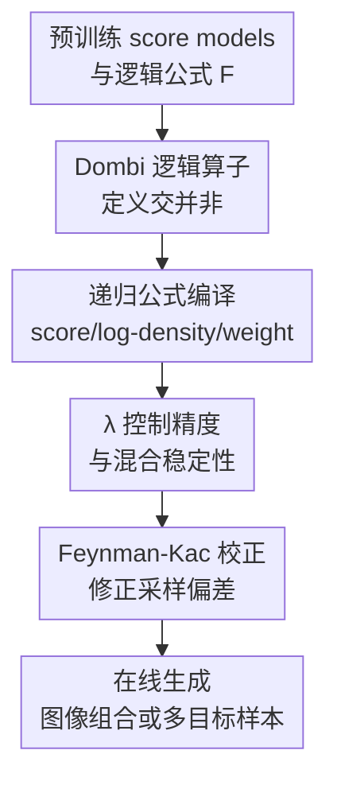

# Composition of Pretrained Diffusion Models: A Logic-Based Calculus

**会议**: ICLR2026  
**OpenReview**: [https://openreview.net/forum?id=ADLiUSC7Qm](https://openreview.net/forum?id=ADLiUSC7Qm)  
**代码**: https://github.com/Aalto-QuML/logic-diffusion-composition  
**领域**: 扩散模型 / 图像生成  
**关键词**: 扩散模型组合, 逻辑演算, Dombi 算子, Feynman-Kac 校正, 概念规避  

## 一句话总结
这篇论文把预训练扩散模型的交、并、非组合从经验性的 PoE/MoE 拼接提升为一套基于模糊逻辑的 Dombi score calculus，并在 Stable Diffusion 多提示词组合、复杂 SAT 式组合和多目标分子生成中展示了更稳定的模式覆盖与采样校正。

## 研究背景与动机
**领域现状**：扩散模型已经可以通过条件提示、classifier-free guidance、能量模型组合或多个 score model 的加权来完成更复杂的生成任务。例如，把“山景”和“狗的剪影”两个提示词合成一张图，可以把两个条件分布的 score 相加或平均；想规避某个概念时，也常用正提示减去负提示的 CFG 式操作。

**现有痛点**：这些组合方法往往借用了集合论的语言，却没有真正满足集合运算的基本性质。PoE 常被解释为交集，但它会偏向两个分布同时高密度的小区域，容易丢模式；MoE 常被解释为并集，但和交集、非运算混用时并不稳定；负提示或逆概率式“非”操作还可能让密度不可归一化，采样轨迹在尾部发散。换句话说，经验上能用的 score 拼接，一旦被写成 `A AND (NOT B)`、`A XOR B`、`majority of k concepts` 这类公式，就会暴露出代数不一致、模式覆盖差和采样偏差。

**核心矛盾**：扩散模型组合需要同时满足两个目标：一方面，组合结果应该像逻辑公式一样可推理，至少近似满足交换、结合、De Morgan 对偶、幂等和分配律；另一方面，组合后的对象又必须能在扩散反向过程里稳定采样，而不是只在干净数据分布上有一个漂亮的密度定义。传统 PoE/MoE 只解决了其中一小块，缺少统一的“密度算子 → score 算子 → 采样校正”闭环。

**本文目标**：作者希望给预训练扩散模型组合建立一套在线 calculus：输入若干已经训练好的 score model 和一个逻辑公式，输出一个可采样的复合 score，同时知道这个复合 score 对应什么密度、何时稳定、何时会产生采样偏差，以及怎样用 Feynman-Kac 权重校正偏差。

**切入角度**：论文从 fuzzy logic 的 t-norm/t-conorm 出发，而不是直接把概率乘积当作交集。模糊逻辑本来就研究“软集合”的交、并、非；扩散模型里的密度也可以看作某种软隶属度。作者用一个参考分布把密度映射到 $[0,1]$ 隶属度空间，再把 Dombi t-norm 提升回密度与 score 域，从而得到一族带温度参数 $\lambda$ 的交、并、非算子。

**核心 idea**：用 De Morgan dual 的 Dombi 算子替代手工 PoE/MoE/负提示拼接，使任意逻辑公式都能递归编译成复合 score、复合 log-likelihood 和 Feynman-Kac 校正权重。

## 方法详解

### 整体框架
这篇论文的方法不是重新训练一个扩散模型，而是在采样时在线组合多个预训练模型。给定若干 score model $\{s_i\}_{i=1}^k$、它们的在线 log-density 估计 $\{\log q_i\}$、已有 Feynman-Kac 权重 $\{g_i\}$，以及一个由原子模型、非、交、并构成的逻辑公式 $F$，算法递归地把 $F$ 编译成三元组：复合 score $\bar{s}$、复合 log-density $\log \bar{q}$ 和复合权重 $\bar{g}$。采样时仍沿用扩散反向 SDE，只是把普通 score 换成这个复合 score，并用 SMC 等方法根据 $\bar{g}$ 重新加权粒子。

### 关键设计
**1. Dombi 逻辑算子：把交、并、非放进同一套 De Morgan calculus**

论文先用参考函数 $c(x)>0$ 把密度 $p(x)$ 映射为模糊隶属度 $\phi_c(p;x)=p(x)/(p(x)+c(x))$。这个参考项只影响“非”的定义，可以理解为负提示或概念规避时的背景分布；交和并本身不依赖它。随后作者采用 Dombi t-norm 的生成函数，并把它提升到密度域，得到一组互为 De Morgan 对偶的算子：

$$
\neg_c p(x)=\frac{c(x)^2}{p(x)}, \quad
p_1(x)\wedge_\lambda p_2(x)=\frac{p_1(x)p_2(x)}{(p_1(x)^\lambda+p_2(x)^\lambda)^{1/\lambda}},
$$

$$
p_1(x)\vee_\lambda p_2(x)=(p_1(x)^\lambda+p_2(x)^\lambda)^{1/\lambda}.
$$

这组定义的关键不是公式更复杂，而是它把常见组合方法统一到一个可调族里：$\lambda=1$ 时能联系到线性 mixture 与 harmonic mean，$\lambda\to 0$ 的 score calculus 对应 geometric mean，$\lambda\to\infty$ 则逼近真正的 min/max lattice。与简单 PoE 相比，Dombi 交由负指数 power norm 控制，不会因为两个密度的乘积过尖而过度偏向少数模式；与普通 MoE 相比，它和“非”来自同一个 De Morgan 体系，复杂公式不再只是若干经验算子的临时堆叠。

在 score 域里，这些算子也保持可计算。并运算对应 softmax 权重的 score 平均，$s_1\vee_\lambda s_2=\alpha_1^\lambda s_1+\alpha_2^\lambda s_2$，其中 $\alpha_i^\lambda\propto\exp(\lambda\log p_i)$；交运算只需把 $\lambda$ 换成 $-\lambda$；参考非给出 $\neg_c s=2s_c-s$。因此，算法可以只在采样时估计各模型的 log-density 和 score，不需要重新训练组合模型。

**2. 递归公式编译：把任意逻辑表达式变成可采样的复合 score**

仅有二元交、并、非还不够，因为实际需求往往是嵌套公式，例如 XOR、majority、one-hot 或“生成 A 但避开 B”。作者把公式写成文法 $F ::= i \mid \neg_j i \mid F_1 \circ F_2$，其中原子 $i$ 表示第 $i$ 个预训练模型，$\neg_j i$ 表示相对参考模型 $j$ 去否定模型 $i$，$\circ$ 可以是 $\wedge_\lambda$ 或 $\vee_\lambda$。递归算法先求子公式的三元组，再用 Dombi 权重合并两个子结果。

这一点解决了旧方法最尴尬的地方：PoE/MoE 可以写一两个简单约束，但很难可靠表达“恰好一个模型满足”或“满足多数模型且排除某个交集”。Dombi calculus 让这些组合先在公式层面保持逻辑含义，再在 score 层面给出同序的计算规则。比如 XOR 可以写为 $(p_1\vee p_2)\wedge(\neg p_1\vee\neg p_2)$，采样器不用知道 XOR 是什么特殊任务，只要递归执行交、并、非即可。

为了让递归组合在扩散过程中可用，算法还同时传播 log-likelihood。论文采用 Itô density estimator 在线估计 $\log p_t(x_t)$，从而在每个时间步计算 softmax 权重 $\alpha_i$。这使得权重不再是固定 prompt 权重，而是随样本位置和时间变化的“责任分配”：当前粒子更像哪个子模型，哪个子 score 就在并或交里获得相应权重。

**3. $\lambda$ 稳定性分析：把组合精度和采样振荡的取舍说清楚**

Dombi 参数 $\lambda$ 可以看作 score 混合里的逆温度。$\lambda$ 越大，交/并越接近硬 min/max，逻辑上更接近理想集合运算；但权重 $\alpha$ 也会对两个模型的 log-density 差异更敏感，采样过程中更容易在不同 score 之间突然切换。论文用两个结果刻画这个取舍：有限 $\lambda$ 下幂等性和分配律只会引入 $2^{\pm 2/\lambda}$ 量级的密度偏差；而混合系数的变化率与 $\lambda$、噪声强度 $\sigma_t$ 和 score 差异 $\|s_1-s_2\|$ 有关。

直观地说，$\lambda$ 不是一个随便调的超参。小 $\lambda$ 更平滑，适合避免早期采样轨迹震荡；大 $\lambda$ 更像布尔逻辑，适合要求组合边界更清晰的任务。这个分析也解释了 Stable Diffusion 实验里为什么 SuperDiff 类方法在初始迭代会出现更强的混合系数波动，而 Dombi 的方差随 $\lambda$ 呈可控变化。

**4. Feynman-Kac 校正：修复“组合 noisy score 不等于 noisy 组合分布”的偏差**

扩散采样里的一个深层问题是：在干净数据分布上定义的非线性组合，通常不和前向加噪算子交换。也就是说，把每个 noisy score 先组合起来，并不等价于先组合干净分布再加噪。论文沿用并扩展 Feynman-Kac Corrector 的形式，把这种缺失项收集进权重场 $g_t(x)$，使采样过程变成带权 SDE。

对于参考非，校正项包含两个 score 的差异范数，例如 $\sigma_t^2\|\nabla\log q_1-\nabla\log q_2\|^2$ 以及子模型已有权重的线性组合。对于 Dombi 交/并，校正项由 softmax 权重下的“平均 score 的范数”和“score 范数的加权平均”之间的差组成，并继续传播子公式的 $g_i$。这看起来像技术细节，但它补上了从逻辑密度定义到实际扩散采样之间最容易被忽略的一环：没有 FKC 时，score 方向可能看起来合理，粒子的边际分布却仍偏离目标组合；有了 FKC，SMC 可以按 $\exp(g_t(x)dt)$ 重采样，减少这种偏差。

### 一个完整示例
以“生成属于模型 $p_1$ 或 $p_2$，但不属于二者交集”的 XOR 为例，公式可写为 $F=(p_1\vee_\lambda p_2)\wedge_\lambda(\neg p_1\vee_\lambda\neg p_2)$。采样开始时，每个粒子携带来自 $p_1$、$p_2$ 和参考分布的 score 与 log-density。递归编译器先计算 $p_1\vee p_2$ 的 softmax 权重，让粒子朝更符合其中一个概念的方向移动；再计算两个相对非项，压低同时落在两个概念交集里的区域；最后用 Dombi 交把“在并集里”和“避开交集”合起来。

在彩色 MNIST 实验中，作者把三个模型分别设为不同数字-颜色集合：例如一个模型覆盖青色的 0-3，另一个覆盖小于 2 的数字和两种颜色，第三个覆盖偶数和两种颜色。用上述公式可以得到 $p_{xor}\wedge p_3=\{2,0\}$，也可以得到 $p_{xor}\wedge\neg p_3=\{3,1\}$。这类集合不是单个 prompt 直接能表达的，也不是简单 PoE/MoE 稳定覆盖的；Dombi calculus 的价值就在于把这类组合当成公式来执行。

### 损失函数 / 训练策略
本文没有提出新的训练损失，核心方法是 training-free online composition。实现上需要三个运行时量：每个预训练扩散模型的 score $s_i$，通过 Itô 估计得到的 $\log q_i$，以及随公式递归传播的 Feynman-Kac 权重 $g_i$。推理阶段使用复合 score 更新反向 SDE，并可用 systematic resampling 按瞬时权重 $\exp(g_t(x)dt)$ 做 SMC 校正。Stable Diffusion 实验把复合 score 放进常规 CFG pipeline；分子实验则在 annealed base distribution 上继续传播 FKC 项。

## 实验关键数据

### 主实验
论文的实验分三组：彩色 MNIST/SAT 式组合验证复杂逻辑公式是否能覆盖正确模式，Stable Diffusion 验证多提示词图像组合和概念规避，分子生成验证 FKC 对多目标优化的采样校正。下面先列最能说明逻辑组合能力的 SAT 式实验。

| 组合任务 | 指标 | Dombi | PoE/MoE | 结论 |
|--------|------|------|---------|------|
| Maj2 | Sat / Unif | 1.00 / 1.00 | 1.00 / 0.80 | 两者都能满足简单多数，但 PoE/MoE 已有模式偏置 |
| XOR2 | Sat / Unif | 0.97 / 1.00 | 0.00 / 0.00 | Dombi 能处理含非运算的异或，PoE/MoE 直接失败 |
| OneHot2 | Sat / Unif | 0.97 / 1.00 | 0.00 / 0.00 | Dombi 能覆盖“恰好一个满足”的组合 |
| Maj10 | Sat / Unif | 1.00 / 0.98 | 0.00 / 0.00 | 模型数增多后 Dombi 仍稳定 |
| XOR10 | Sat / Unif | 0.89 / 0.98 | 0.00 / 0.00 | 超过 1000 个 score term 的公式仍保持较高满足率 |
| OneHot10 | Sat / Unif | 0.07 / 1.00 | 0.00 / 0.00 | 极多否定项场景仍困难，但 Dombi 至少不模式坍缩 |

Stable Diffusion v1-4 上，作者比较二提示词交集生成和 contrastive prompt 概念规避。Dombi 在二提示词交集里取得更高的 CLIP 与 ImageReward；在概念规避里，$\gamma=3$ 的设置 CLIP 差值略高于 ICN，$\gamma=10$ 的 ImageReward 差值最高。

| 任务 | 方法 | 参数 | CLIP / 差值 | ImageReward / 差值 | 说明 |
|------|------|------|-------------|--------------------|------|
| 二提示词交集 | SuperDiff and | - | 24.87±2.92 | -1.33±0.83 | 主要 baseline |
| 二提示词交集 | PoE | - | 24.41±2.71 | -1.55±0.75 | 简单 score 平均/乘积思路较弱 |
| 二提示词交集 | Dombi | $\lambda=0.1$ | 25.25±2.79 | -1.18±0.84 | 已超过 baseline |
| 二提示词交集 | Dombi | $\lambda=1.0$ | 25.32±2.55 | -1.16±0.85 | ImageReward 最好 |
| 二提示词交集 | Dombi | $\lambda=10.0$ | 25.50±2.54 | -1.18±0.85 | CLIP 最高 |
| 概念规避 | ICN | - | 7.29±2.76 | 1.14±0.72 | contrastive baseline |
| 概念规避 | Dombi | $\gamma=3$ | 7.40±2.62 | 1.11±0.72 | CLIP 差值略优 |
| 概念规避 | Dombi | $\gamma=10$ | 7.02±2.54 | 1.21±0.66 | ImageReward 差值最好 |

### 消融实验
分子生成实验直接检验 FKC 是否有用。任务是对 14 个蛋白 target pairs 生成 ligand，每个 pair 采样 5 种长度、每种 32 个分子，比较 TargetDiff、无 FKC 的 Dombi 和带 FKC 的 Dombi。这里虽然是分子场景，但它服务的是采样校正验证，而不是把论文限定为计算生物学。

| 配置 | Temp. $\gamma$ | FKC? | $(P1 * P2)$ ↑ | max(P1,P2) ↓ | Better than ref. ↑ | Div. ↑ | Val. & Uniq. ↑ | QED ↑ | SA ↓ |
|------|---------------|------|---------------|--------------|--------------------|--------|-----------------|-------|------|
| TargetDiff | - | - | 62.19±27.08 | -7.24±2.35 | 0.32±0.37 | 0.89±0.01 | 0.95±0.07 | 0.57±0.14 | 0.59±0.09 |
| Dombi | 1 | 否 | 68.60±28.09 | -7.42±2.57 | 0.28±0.34 | 0.88±0.02 | 0.96±0.09 | 0.58±0.13 | 0.59±0.10 |
| Dombi | 1 | 是 | 72.83±22.42 | -7.71±1.65 | 0.27±0.35 | 0.86±0.03 | 0.95±0.08 | 0.57±0.13 | 0.59±0.11 |
| Dombi | 2 | 否 | 71.36±29.44 | -7.59±2.48 | 0.30±0.34 | 0.88±0.01 | 0.93±0.16 | 0.59±0.12 | 0.62±0.09 |
| Dombi | 2 | 是 | 81.63±25.91 | -8.25±1.56 | 0.38±0.40 | 0.85±0.11 | 0.93±0.17 | 0.59±0.12 | 0.62±0.10 |

### 关键发现
- Dombi 在简单交并上不是只追求更高单点分数，而是显著改善了组合公式的 satisfiability 和 satisfying modes 上的均匀性；XOR10 仍有 0.89 Sat / 0.98 Unif，说明它确实能处理深层嵌套逻辑。
- $\lambda$ 控制的是逻辑硬度和稳定性的取舍：Stable Diffusion 中 $\lambda=10$ 的 CLIP 更高，$\lambda=1$ 的 ImageReward 略好；论文还展示混合系数方差随 $\lambda$ 可解释地变化。
- FKC 在多目标分子生成里带来明确收益，尤其 $\gamma=2$ 时 $(P1*P2)$ 从 71.36 提升到 81.63，Better than ref. 从 0.30 提升到 0.38，说明采样校正不是纯理论装饰。
- 极端 OneHot10 仍很难，Dombi 的 Sat 只有 0.07；这说明大量否定项和指数级公式复杂度仍会挑战在线 score composition。

## 亮点与洞察
- 最巧妙的地方是把“扩散模型组合”重新表述为逻辑 calculus，而不是发明又一个经验加权公式。这样一来，交、并、非、XOR、majority、one-hot 都是同一种递归语言里的对象，方法解释力明显强于单个 operator trick。
- Dombi 参数 $\lambda$ 的角色很清楚：它既是 power norm 的指数，也是 score softmax 的逆温度。这个双重解释让实验调参有了理论直觉，而不是只看生成图挑参数。
- 参考非的设计很实用。直接取 $1/p$ 式负概念很容易发散；把否定相对于参考分布 $c$ 定义为 $c^2/p$，再用 Dombi 交做 guardrail，可以把 CFG 式概念规避纳入更稳定的体系。
- FKC 让论文从“定义一个目标密度”走到了“扩散采样真的靠近这个目标”。很多组合论文只写 score 怎么加，忽略 noisy score composition 的偏差；本文把这部分显式写成权重传播，是它理论完整性的关键。
- 这个思路可以迁移到多条件生成、模型集成、约束生成和安全过滤。只要有若干可估计 score/log-density 的组件，就可以把任务需求写成公式，再由 calculus 统一执行。

## 局限与展望
- 方法依赖在线 log-density 估计和多个 score model 的重复调用，推理成本会高于单模型采样；在 Stable Diffusion 这类大模型上，复杂公式的实际延迟和显存开销仍需要更系统评估。
- $\lambda$ 目前主要靠任务经验选择。论文给出了稳定性分析，但没有自动调度策略；未来可以根据时间步、score 差异或混合系数方差动态调整 $\lambda$。
- Dombi calculus 近似满足 lattice 性质，并非有限 $\lambda$ 下完全等价于布尔集合运算。对需要严格约束满足的安全生成或科学生成任务，仍需要额外的验证或 rejection 机制。
- OneHot10 的 Sat 很低，说明大量否定项、长公式和指数级 score term 仍会造成困难。如何做公式化简、缓存子公式、或把逻辑结构编译得更高效，是重要工程问题。
- 实验虽跨图像和分子，但图像部分主要是 prompt-level 组合，缺少更复杂视觉属性、空间关系或真实用户约束的评估；分子部分也只是验证 FKC 的一个应用场景。

## 相关工作与启发
- **vs Product of Experts / score 相加**: PoE 把交集理解为密度乘积，score 上就是相加，优点是简单，但会过分偏向共同高密度区域并丢失模式。本文的 Dombi 交用 power norm 和 softmax 权重替代硬乘积，更适合保持模式覆盖，并且能和并、非组成统一演算。
- **vs Mixture of Experts**: MoE 天然适合表达并集，却不能单独解决交、非和嵌套逻辑。Dombi 并包含 mixture 风格的加权平均，但它的优势在于和交、非满足 De Morgan 对偶，因此可以组合成复杂公式。
- **vs SuperDiff / Skreta et al. 的组合方法**: SuperDiff 关注稳定的多模型组合和采样校正，但本文进一步从 fuzzy logic 推导出 Dombi operator family，并分析 $\lambda$ 对分配律偏差和混合稳定性的影响。二者在 FKC 思路上有继承关系，本文把校正项推广到 Dombi 交并非。
- **vs CFG / contrastive prompting**: CFG 可以看作一种相对负概念的 score 操作，但普通负提示没有完整的代数语义，也可能遇到归一化问题。本文的 referenced negation 把它放进逻辑 calculus，并解释了如何与交并组合。
- **启发**: 对大模型组合来说，重要的可能不是继续训练一个“全能模型”，而是让已有模型成为可组合的 primitive。若未来的视觉、语言、分子模型都能暴露可估计的 score 或 energy，逻辑公式式的模型编排会是很自然的接口。

## 评分
- 新颖性: ⭐⭐⭐⭐⭐ 把扩散模型在线组合系统化为 Dombi fuzzy-logic calculus，兼顾代数性质、score 形式和采样校正，思路很完整。
- 实验充分度: ⭐⭐⭐⭐☆ 覆盖 toy 逻辑、Stable Diffusion 和分子生成，能支撑主要论点；但复杂真实约束和大规模公式效率还可以补强。
- 写作质量: ⭐⭐⭐⭐☆ 理论链条清晰，图示和算法帮助理解；部分公式密集章节对普通扩散模型读者门槛较高。
- 价值: ⭐⭐⭐⭐⭐ 对训练免费模型组合、多提示词生成、概念规避和约束生成都有通用启发，是一篇很适合作为后续 diffusion ensemble 基础工具引用的论文。

<!-- RELATED:START -->

## 相关论文

- [\[ICLR 2026\] Bridging the Distribution Gap to Harness Pretrained Diffusion Priors for Super-Resolution](bridging_the_distribution_gap_to_harness_pretrained_diffusion_priors_for_super-r.md)
- [\[ICLR 2026\] Steer Away From Mode Collisions: Improving Composition In Diffusion Models](steer_away_from_mode_collisions_improving_composition_in_diffusion_models.md)
- [\[ICLR 2026\] LogiStory: A Logic-Aware Framework for Multi-Image Story Visualization](logistory_a_logic-aware_framework_for_multi-image_story_visualization.md)
- [\[CVPR 2025\] MixerMDM: Learnable Composition of Human Motion Diffusion Models](../../CVPR2025/image_generation/mixermdm_learnable_composition_of_human_motion_diffusion_models.md)
- [\[ICLR 2026\] Does FLUX Already Know How to Perform Physically Plausible Image Composition?](does_flux_already_know_how_to_perform_physically_plausible_image_composition.md)

<!-- RELATED:END -->
