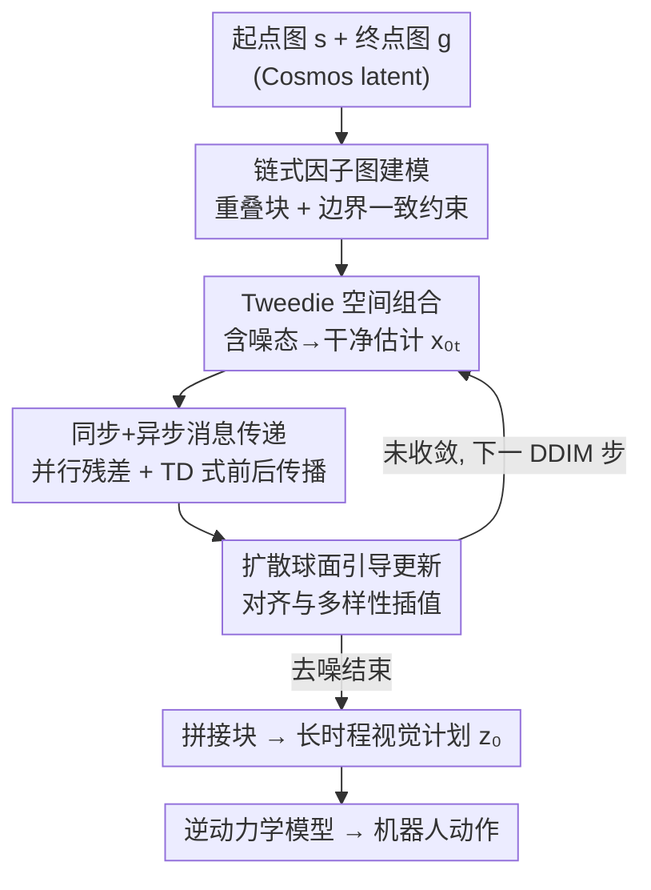

# Compositional Visual Planning via Inference-Time Diffusion Scaling

**会议**: ICLR2026  
**OpenReview**: [https://openreview.net/forum?id=EEONns7ae4](https://openreview.net/forum?id=EEONns7ae4)  
**项目页**: https://comp-visual-planning.github.io/  
**代码**: 承诺开源（论文 Reproducibility 声明，含算法与 benchmark）  
**领域**: 机器人 / 扩散规划 / 推理时缩放  
**关键词**: 视觉规划, 组合式扩散, 因子图, 消息传递, 推理时引导

## 一句话总结
只训练一个短时程视频扩散模型并冻结，在**推理时**把长时程规划重写成一条由重叠视频片段构成的链式因子图，通过在 **Tweedie 干净估计**（而非含噪中间态）上做同步+异步消息传递来强制片段间边界一致，从而无需任何额外训练就把短片段拼成全局连贯的长时程机器人操作计划，并能泛化到训练中没出现过的起点-终点组合。

## 研究背景与动机
**领域现状**：扩散模型在机器人规划上很强，能把"为每个起点-终点对重新搜索一条轨迹"的逐实例优化，换成"从学到的生成器里直接采样可行解"。但主流视频扩散 backbone 都是在**短片段**上训练的，序列一长，显存和算力就爆，而且接触关系、物体持久性、起点-终点满足这类长程约束必须贯穿整条 rollout。

**现有痛点**：要把短时程模型用到长时程，自然的做法是**组合式生成**——把长轨迹切成多个重叠的短片段，每段各自去噪，重叠区域取平均（DiffCollage、GSC 这类 score averaging）。但这套做法不稳定：前向扩散会把相邻片段的含噪变量"纠缠"在一起，使得"片段之间可因子分解"这个假设在含噪空间里**根本不成立**，于是拼出来的全局计划会漂移、边界对不上、长程约束传不过去。论文用一个三瓣花的玩具实验（三个 120° 圆弧生成器拼成一朵花）直观展示：DiffCollage 拼出来边界留缝、闭不上环。

**核心矛盾**：组合启发式（score 平均 / Bethe 近似）只在**干净数据**（扩散 $t=0$）上成立；可你偏偏要在**含噪的中间步** $t>0$ 上反复施加它，二者之间存在一个系统性的 gap。换句话说，你在错误的域上做了组合。

**本文目标**：在不重训 backbone、不加 task-specific adapter 的前提下，把短时程视频扩散模型组合成长时程、全局一致、可执行的视觉计划，并且要能泛化到未见过的起点-终点组合。

**切入角度**：既然组合在含噪态上不可靠，那就**到扩散模型估计最可靠的地方去组合**——也就是它每一步预测出来的 Tweedie（去噪后的干净数据估计）$x_{0|t}$。在这个稳定的域上，强而显式的组合约束（边界相等）才有意义。

**核心 idea**：把长时程规划写成"重叠视频块上的链式因子图推理"，局部先验来自冻结的短时程扩散 backbone，全局一致性则通过在 **Tweedie 估计上的边界一致约束**来强制，整个过程纯发生在推理时。

## 方法详解

### 整体框架
方法要解决的是：手里只有一个在短片段上训练好、之后**永久冻结**的视频扩散模型 $x_\theta$，给定一张起点图和一张终点图，要生成一段贯穿二者的长视频计划，再由逆动力学模型翻译成机器人动作。整条链路在推理时完成、零额外训练。

具体地，把一个计划表示成线性链 $z=[u_1,\dots,u_m]$，在上面放 $n$ 个重叠因子 $x_i=[u_{2i-1},u_{2i},u_{2i+1}]$，每个因子收三帧连续画面，相邻因子共享一个**过渡边界变量**；两端 $u_1=s$、$u_m=g$ 是起点/终点边界变量。所有因子/变量都先用 Cosmos tokenizer 编码到紧凑的 latent 空间，规划全程在 latent 里做以省算力。采样时把初始高斯噪声切成 $n$ 个重叠块，每个 DDIM 步里：用模型预测各块的 Tweedie 估计 → 走一步 DDIM → 用同步+异步消息传递损失算出一个"边界不一致"残差 → 用 Diffusion-Sphere Guidance 把更新方向往"满足一致性"偏，但不牺牲多样性。所有步走完，把去噪后的块拼起来得到最终计划 $z_0$，再过逆动力学模型出动作。

### 关键设计

**1. 链式因子图 + 显式边界一致：把"长时程规划"降维成"局部生成 + 边界相等"**

针对"序列一长就爆显存、长程约束传不过去"的痛点，论文不去直接生成整条长轨迹，而是把它表示成一条重叠因子的线性链，再用一组**边界等式**把可行性写死。设 $A_i$、$B_i$ 分别是抽取因子 $x_i$ 首帧、末帧的线性选择算子，可行计划必须满足：起点/终点锚定 $A_1x_1=s$、$B_nx_n=g$，以及过渡边界 $B_ix_i=A_{i+1}x_{i+1}$（相邻因子在共享帧上要对齐）。这样全局规划就被分解成"每个短块各自用同一个 $x_\theta$ 生成 + 边界处对齐"，时间一长只是因子变多、模型权重照旧复用，天然可扩展；而且因为约束是显式的等式而非隐式平均，长程的起点-终点信息能沿链传播。

**2. Tweedie 空间组合：在干净估计上施加约束，绕开 Noisy-Bethe Gap**

这是全文的理论支点。DiffCollage/GSC 沿用 Bethe 近似——把联合分布写成"因子乘积除以变量"（式 1），并据此得到 score 是各因子 score 加权和。问题是这个近似只在干净数据上精确。论文的 **Noisy-Bethe Gap 定理**给出：对最简单的三变量链，真实含噪分布与 Bethe 估计之间的差等于一个协方差项 $\Delta = Z\,\mathrm{Cov}_{u_2\sim q}\!\left[\tfrac{a}{c},\tfrac{b}{c}\right]$，其中 $a,b$ 是左右因子经各自前向噪声通道后投给边界 $u_2$ 的"票"，$c$ 是边界自身的一元证据。直觉是：前向扩散会在边界上注入共享的、异方差的扰动，使左右两个相对增益 $a/c$、$b/c$ 同涨同落，协方差不为零，于是 Bethe 近似产生系统性偏差。既然含噪态上组合不可靠，论文就改成在拼接后的 **Tweedie 估计** $x^{1:n}_{0|t}=x_\theta(x^{1:n}_t)$ 上施加约束，近似分布写成 $p(z_t)=\prod_i p(x_i_t)\cdot\exp(-\mathcal{L}(x^{1:n}_{0|t}))$，用势函数惩罚干净变量间的不一致。

**3. 同步 + 异步联合消息传递：兼顾并行无偏与快速稳定**

只有一条边界一致损失还不够好优化，论文设计了两套互补的消息传递。**同步**方案把整条链当成一个高斯线性系统，把所有边界势 $\psi_{i-1,i}=\exp(-\frac{1}{c_{i-1}}\|B_{i-1}x^{i-1}_{0|t}-A_ix^i_{0|t}\|^2)$ 汇成精度矩阵 $\Sigma^{-1}$ 与向量 $\eta$，损失就是把单一残差 $\|\Sigma^{-1}x^{1:n}_{0|t}-\eta\|$ 压到零（实践中取 $c_i=1$）；它是 lockstep 并行更新、无次序偏差，但约束太硬、数值上"刚性"、收敛慢。**异步**方案借鉴 TD 学习，用带停止梯度 $\mathrm{sg}(\cdot)$ 的 bootstrapped 目标做前向+后向传播：$\mathcal{L}_{async}$ 里既有起点/终点锚定项 $\|s-A_1x^1_{0|t}\|$、$\|B_nx^n_{0|t}-g\|$，又有前向消息项 $\|\mathrm{sg}(B_i\hat{x}^i_{0|t})-A_{i+1}x^{i+1}_{0|t}\|$ 和镜像的后向项，折扣 $\gamma$ 随离起点/终点越远把消息权重压低；目标 $\hat{x}$ 由最新参数模型给、$x_{0|t}$ 由 EMA 模型给。异步更快更稳但带轻微偏差。最终 $\mathcal{L}=\mathcal{L}_{sync}+\mathcal{L}_{async}$ 联合使用，互补出更好的"约束强度 vs 灵活性"平衡。

**4. 扩散球面引导：把消息传递残差变成训练自由的采样更新，且不塌缩多样性**

有了可微的一致性损失，还要把它变成实际的去噪更新。论文采用 DSG（Diffusion-Sphere Guidance）的训练自由引导：直接拿损失的最速下降方向 $d^*=-\sqrt{s}\sigma_t\cdot\frac{\nabla_{x_t}\mathcal{L}}{\|\nabla_{x_t}\mathcal{L}\|}$ 当"对齐"方向，与无条件退火采样方向 $d_{sample}=\sigma_t\epsilon_t$ 用引导权重 $g$ 插值 $d_m=d_{sample}+g(d^*-d_{sample})$，再归一化到球面高斯约束半径上 $x^{1:n}_{t-1}=\mu^{1:n}_{t-1}+r\frac{d_m}{\|d_m\|}$。这样既把样本往边界一致拉，又因为约束在球面上、保留了局部采样质量、并行性和多样性——强引导不会像普通梯度引导那样把样本逼得过于单一。

### 损失函数 / 训练策略
训练阶段只做一件事：在从长时程示范里**随机截取**的短片段上训练短时程视频扩散模型 $x_\theta$（采用 $x_0$ 预测 / 直接估计 Tweedie 的目标 $\mathbb{E}\|x_0-x_\theta(x_t,t)\|^2$），并配一个 MLP 逆动力学模型从相邻帧预测末端执行器位姿。推理阶段完全训练自由：按 Algorithm 1，采噪声→切 $n$ 个重叠块→逐 DDIM 步做 $\mathcal{L}_{sync}+\mathcal{L}_{async}$ 联合消息传递 + DSG 引导→拼块得 $z_0$。整个组合过程即插即用，可挂在任何无条件短时程扩散 backbone 上。

## 实验关键数据

### 主实验
在基于 ManiSkill 的组合规划 benchmark 上评测：每个场景有 $N$ 个起点、$N$ 个终点，共 $N\cdot N$ 个起点-终点对，但训练只覆盖 $N$ 个对；测试同时考察 $N$ 个见过的对（IND）与剩下 $N\cdot N-N$ 个未见过的对（OOD）。共 4 个场景、100 个任务（18 IND + 82 OOD），每任务 30 episode，5 个随机种子。

成功率（%，节选 Overall 与代表场景，± 为标准差）：

| 场景/分布 | GCDP（强策略基线） | DiffCollage | CompDiffuser | 本文 |
|-----------|------|------|------|------|
| Tool-Use OOD | 42±13 | 0±0 | 51±3 | **96±2** |
| Cube OOD | 24±13 | 0±0 | 34±6 | **65±9** |
| Puzzle OOD | 12±11 | 0±0 | 9±3 | **50±13** |
| Overall IND | 56±16 | 0±1 | 17±2 | **59±17** |
| Overall OOD | 15±13 | 0±0 | 16±2 | **54±14** |

DiffCollage 几乎全军覆没（score 平均拼出的图模糊甚至不真实，进一步把逆动力学模型带偏）；强策略基线（GCDP 等）在 IND 上不错，但一到 OOD 就**断崖式下跌**；本文靠链式因子图 + 消息传递，IND/OOD 几乎持平（59 vs 54），泛化稳定。

视频质量（VBench++，节选）：

| 分布 | 指标 | DiffCollage | 本文 |
|------|------|------|------|
| OOD | Motion Smoothness ↑ | 0.87±0.06 | **0.97±0.05** |
| OOD | Background Consistency ↑ | 0.80±0.07 | **0.90±0.05** |
| OOD | Imaging ↑ | 0.55±0.05 | **0.69±0.05** |

时间相关指标（运动平滑、背景一致）大幅领先，直接对应"轨迹动态可执行、时空连贯"；Imaging 也明显更好（更少模糊帧），Aesthetic 持平。

### 消融实验

| 配置（Cube 场景，IND/OOD 成功率%） | 结果 | 说明 |
|------|------|------|
| Sync Only | 10 / 8 | 约束太硬、难优化，成功率最低 |
| Async Only | 45 / 41 | TD 式更新更稳更快，明显更好 |
| Sync & Async（完整） | **64 / 65** | 两者互补，约束强度与灵活性平衡最佳 |

采样步数缩放（Drawer 场景，IND/OOD）：50 步 35/20 → 100 步 40/25 → 200 步 45/45 → 300 步 **53/52**，说明方法能随推理时算力增加而稳定变好（更多步 = 更深的跨因子消息传递）。

真实机器人（Franka Panda，每任务 10 次）：本文 IND 9/10、7/10，OOD 10/10、8/10；DiffCollage 仅 1/1/0/0。

### 关键发现
- **联合消息传递贡献最大**：单用同步损失几乎失效（10/8），异步是稳定性主力，二者合用才把成功率推到 64/65——异步缓解了同步的"刚性"。
- **OOD 泛化是真正分水岭**：策略学习基线 IND 可打到 56，但 OOD 掉到 15；本文 IND/OOD 几乎一致，验证"组合泛化"来自因子图分解 + 边界传播，而非记忆训练对。
- **推理时算力可换性能**：成功率随采样步数单调上升，符合"推理时缩放"主张。
- **DiffCollage 在含噪态组合的失败是系统性的**：图像模糊/失真不仅降视觉分，还会污染逆动力学模型导致执行失败，印证 Noisy-Bethe Gap 的危害。

## 亮点与洞察
- **"换一个域去组合"的洞察很漂亮**：组合启发式失效不是因为启发式本身不好，而是被施加在了错误的（含噪）域上；搬到 Tweedie 干净估计上，老约束立刻复活。这个视角可迁移到任何"短拼长"的扩散任务（全景图、长视频）。
- **Noisy-Bethe Gap 定理把直觉变成了可证的协方差项**，明确指出 gap 来自前向噪声在边界上引入的共享异方差扰动——这是对一类组合扩散方法失败原因的干净刻画。
- **把引导重新解读为 token 间消息传递**：传统推理时引导只调一个定长输出，这里让信息沿序列前后传播，于是"短行为片段"能被缝成"长时程一致计划"，是一个很有启发的重构。
- **同步=并行无偏但刚性、异步=TD 式快但有偏**，二者联合的设计模式（硬约束 + bootstrapped 软目标）值得借鉴到其他需要全局一致的迭代生成里。
- 训练自由、即插即用、可挂任意短时程 backbone，落地成本低，且 IND≈OOD 的泛化曲线在机器人领域很难得。

## 局限与展望
- **依赖逆动力学模型把视频翻译成动作**：视觉计划再好，最终成功率仍受 IDM 质量制约；论文也观察到模糊帧会"confuse"IDM，说明这条链路是误差放大点。
- **链式（线性）因子图结构相对受限**：当前面向起点-终点的链式拼接，对分叉/树状/带环的更复杂任务结构（如多物体并行操作）是否同样适用，论文未充分展开。
- **同步损失单独几乎不可用**，意味着方法对消息传递调度（同步/异步配比、折扣 $\gamma$、引导权重 $g$）较敏感，超参选择需要经验。
- **评测仍以 ManiSkill 仿真 + 少量真机任务为主**，场景数（4 个）和真机任务（4 个）规模偏小；更长时程（更多因子）下 latent 漂移是否累积，值得进一步验证。
- 作者展望把框架推广到全景图生成、长视频合成等更广领域，这些方向尚待落地。

## 相关工作与启发
- **vs DiffCollage / GSC（Zhang et al., 2023; Mishra et al., 2023）**：它们用 Bethe 近似 + score 平均在**含噪态**上组合，前向扩散破坏因子分解假设，导致漂移、边界留缝；本文在 **Tweedie 干净估计**上用显式边界等式 + 原理化消息传递组合，稳定性和计划质量大幅领先（Overall OOD 54 vs ~0）。
- **vs CompDiffuser**：同为组合式扩散规划基线，但在视觉规划 + OOD 上本文显著更强（Tool-Use OOD 96 vs 51），核心差异在 Tweedie 空间约束 + 同步/异步联合传递。
- **vs 策略学习基线（LCBC/LCDP/GCBC/GCDP）**：强策略在 IND 可比甚至接近，但 OOD 崩塌；本文靠组合泛化在 OOD 上保持稳定，定位互补。
- **vs 一般推理时扩散引导（DSG、DPS 等）**：传统方法只对定长输出做引导；本文把引导重写成跨 token 的消息传递，从而能"缝接"变长序列，扩展了推理时引导的适用边界。

## 评分
- 新颖性: ⭐⭐⭐⭐⭐ Noisy-Bethe Gap 定理 + "到 Tweedie 域组合 + 引导即消息传递"的重构，角度新且自洽
- 实验充分度: ⭐⭐⭐⭐ 4 仿真场景 + 真机 + VBench 质量 + 消融/缩放齐全，但场景与真机规模偏小
- 写作质量: ⭐⭐⭐⭐ 理论与方法层层递进、动机清晰；公式排版有零星瑕疵
- 价值: ⭐⭐⭐⭐⭐ 训练自由、即插即用、IND≈OOD 泛化，对长时程机器人规划很实用

<!-- RELATED:START -->

## 相关论文

- [\[ICLR 2026\] Inference-Time Scaling of Diffusion Models Through Classical Search](inference-time_scaling_of_diffusion_models_through_classical_search.md)
- [\[CVPR 2026\] Rethinking Prompt Design for Inference-time Scaling in Text-to-Visual Generation](../../CVPR2026/image_generation/rethinking_prompt_design_for_inference-time_scaling_in_text-to-visual_generation.md)
- [\[ICLR 2026\] Self-Improving Loops for Visual Robotic Planning](self-improving_loops_for_visual_robotic_planning.md)
- [\[ICLR 2026\] Compositional amortized inference for large-scale hierarchical Bayesian models](compositional_amortized_inference_for_large-scale_hierarchical_bayesian_models.md)
- [\[ICLR 2026\] Scaling Group Inference for Diverse and High-Quality Generation](scaling_group_inference_for_diverse_and_high-quality_generation.md)

<!-- RELATED:END -->
