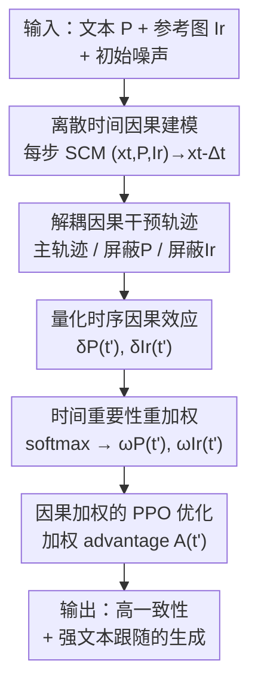

# Consis-GCPO: Consistency-Preserving Group Causal Preference Optimization for Vision Customization

**会议**: ICLR2026  
**OpenReview**: [https://openreview.net/forum?id=OswqOlTYR2](https://openreview.net/forum?id=OswqOlTYR2)  
**代码**: 待确认  
**领域**: 图像生成 / 扩散模型 / 强化学习对齐  
**关键词**: 主体定制生成, GRPO, 因果干预, 时间步重加权, 文本-参考解耦

## 一句话总结
Consis-GCPO 把主体定制生成（reference-to-image/video）里的 GRPO 强化学习重写成一个"离散时间因果优化"问题：在去噪的每一步分别"屏蔽文本"和"屏蔽参考图"做反事实干预，量化每个时间步上文本/视觉条件各自的因果贡献，再把它转成时间步加权的 advantage 去针对性地优化，从而在多主体复杂场景下同时拿到更高的主体一致性和更强的文本跟随。

## 研究背景与动机
**领域现状**：主体驱动生成（subject-driven generation）希望给定几张参考图（reference），生成既保留主体身份、又遵循文本指令的图像或视频。图像侧从 DreamBooth、IP-Adapter 到近期基于 DiT 的 UNO、XVerse、DreamO、MOSAIC 已经能做多参考多主体合成；视频侧 VACE、Phantom、MAGREF 把这种定制能力扩展到时序。近期又流行用 GRPO 类强化学习（Flow-GRPO、DanceGRPO）把生成模型对齐到人类偏好。

**现有痛点**：现有方法在"主体保真"和"语义对齐"之间总是顾此失彼——要么生成的图很像参考主体但不听文本（语义漂移），要么文本跟得很好但主体身份糊掉（保真退化），在多主体、主体间有交互的复杂构图里尤其明显。

**核心矛盾**：作者把矛头指向 GRPO 类方法的两个结构性缺陷。其一是**时间盲视（temporal blindness）**：它们对所有去噪时间步施加**统一**的优化权重，完全忽略了"文本和视觉条件在去噪不同阶段的重要性是变化的"这一事实。其二是**反馈纠缠（entangled feedback）**：只在生成末端给一个总 reward，无法拆出文本条件和参考条件各自贡献了多少，导致没法做定向改进。

**切入角度**：作者的关键观察是，去噪过程存在一个"由粗到细（coarse-to-fine）"的规律——**高噪声早期阶段文本主导全局结构布局，低噪声后期阶段参考图接管细粒度身份纹理**。既然不同条件在不同时刻"该负责什么"是不同的，那就不该一视同仁地优化每一步。

**核心 idea**：把多条件引导生成建模成一个**离散时间结构因果模型（SCM）**，在每个时间步上分别"切掉文本/切掉参考"做反事实干预，测出该步上每个模态的瞬时因果效应，再把效应归一化成时间步重要性权重去加权 advantage——用"因果可度量的时序权重"替换 GRPO 的"统一时间步权重"。

## 方法详解

### 整体框架
Consis-GCPO 建立在 Flow-GRPO 之上。Flow-GRPO 把流匹配（flow matching）生成模型的 SDE 去噪过程当成一个序列决策问题，策略是每步的转移分布 $\pi(t)\triangleq p_\theta(x_{t-\Delta t}\mid x_t)$，并用 PPO 式的裁剪目标加 KL 正则来做策略优化。Consis-GCPO 的改动集中在 **advantage 怎么算**：它不再给所有时间步一个统一的优势，而是先用因果干预测出"这一步上文本/参考分别有多重要"，再据此加权。

整条流程是：给定一份初始噪声，先正常跑一条**主轨迹**得到生成结果；再对每个时间步 $t'$ 分别跑一条**屏蔽文本的干预轨迹**和一条**屏蔽参考的干预轨迹**；用 reward 函数对比主轨迹和干预轨迹的质量下降，得到该步上文本/参考各自的瞬时因果效应 $\delta_P(t')$、$\delta_{I_r}(t')$；把这些效应经 softmax 归一化成时间重要性权重 $\omega_P(t')$、$\omega_{I_r}(t')$；最后把权重乘进各自的 advantage，再融合成总 advantage 喂给 PPO 目标做更新。下面用框架图把这条"主轨迹 + 双路干预 → 因果效应 → 时序权重 → 加权 PPO"串起来。

### 关键设计

**1. 离散时间结构因果模型：给"多条件去噪"一个可干预的因果骨架**

现有方法把文本和参考一股脑塞进去噪网络，无法回答"某一步到底是文本还是参考在起作用"。Consis-GCPO 把反向扩散的每一步去噪显式建成一个结构因果模型：在时间步 $t$，去噪后的状态 $x_{t-\Delta t}$ 由四个父变量因果决定——当前噪声潜变量 $x_t$、文本提示 $P$、参考图 $I_r$、独立噪声 $\epsilon_t$，即 $(x_t, P, I_r)\rightarrow x_{t-\Delta t}$。在此之上定义**逐步因果干预（step-wise causal intervention）**：只在某个目标步 $t'$ 把某个条件 $C\in\{P, I_r\}$ 切掉、其余步保持正常，

$$do(C=\varnothing, t'):\quad x_{t-\Delta t}=\begin{cases} f_\theta(x_t,\cdot,\cdot,\epsilon_t)\setminus C, & t=t'\\ f_\theta(x_t,P,I_r,\epsilon_t), & t\neq t'\end{cases}$$

这一步是整套方法的地基：它把"条件的重要性"从一个抽象概念变成了可以**用反事实操作精确度量**的量——和全局消融（整条轨迹都切掉某条件）不同，它把因果效应隔离到了单个时间步。

**2. 解耦因果干预轨迹：用三条轨迹把文本贡献和参考贡献分开**

为了在每个初始噪声 $x_1^{(g)}$ 上做完整的因果分析，作者并行生成三类轨迹：**主轨迹** $x_{t-\Delta t}^{(g)}=f_\theta(x_t^{(g)},P,I_r,\epsilon_t)$ 是正常去噪；**文本干预轨迹**只在步 $t'$ 把 $P$ 置空、其余步正常；**参考干预轨迹**只在步 $t'$ 把 $I_r$ 置空、其余步正常。这样设计的好处是文本和参考的因果贡献被**结构性地拆开**——在 advantage 估计层面（而非 loss 层面）就实现了解耦：屏蔽文本只影响文本相关的反事实，屏蔽参考只影响参考相关的反事实，两者的梯度在数学上是隔离的。这正是对"反馈纠缠"痛点的直接回应。

**3. 时序因果效应量化：用专用 reward 测每步切条件后掉了多少分**

有了三条轨迹，就用两个针对性的 reward 来衡量生成质量：$R_P^{(g)}=\psi_P(x_0^{(g)},P)$ 测文本-图像对齐，$R_{I_r}^{(g)}=\psi_{I_r}(x_0^{(g)},I_r)$ 测视觉一致性。某步 $t'$ 上某模态的**瞬时因果贡献**就定义为"切掉它之后的性能下降"：

$$\delta_P^{(g)}(t')=R_P^{(g)}-\psi_P(x_0^{(P,t',g)},P),\quad \delta_{I_r}^{(g)}(t')=R_{I_r}^{(g)}-\psi_{I_r}(x_0^{(I_r,t',g)},I_r)$$

$\delta$ 越大，说明这一步对该条件的因果依赖越强。实现上 $\psi_P$ 在图像侧用 ImageReward、视频侧用 VideoAlign；$\psi_{I_r}$ 用 DINOv3 算参考图与生成结果的视觉相似度（视频取首/中/尾帧以提效）。

**4. 时间重要性重加权 + 因果加权 PPO：把因果效应变成针对性的优化信号**

最后一步把瞬时效应转成可用于优化的权重。先用带温度 $\tau$ 的 softmax 把每个时间步的效应归一化成时间重要性权重：

$$\omega_P^{(g)}(t')=\frac{\exp(\delta_P^{(g)}(t')/\tau)}{\sum_t \exp(\delta_P^{(g)}(t)/\tau)},\quad \omega_{I_r}^{(g)}(t')=\frac{\exp(\delta_{I_r}^{(g)}(t')/\tau)}{\sum_t \exp(\delta_{I_r}^{(g)}(t)/\tau)}$$

权重显式刻画了"文本/参考在哪些步最该被信赖"，正是前述 coarse-to-fine 规律的数值体现。再把权重乘进各自的组归一化 advantage（$\mu,\sigma$ 是组内统计量）：$A_P^{(g)}(t')=\omega_P^{(g)}(t')\cdot\frac{R_P^{(g)}-\mu_P}{\sigma_P}$，参考侧同理；总 advantage 用平衡系数融合 $A^{(g)}(t')=\lambda_P A_P^{(g)}(t')+\lambda_{I_r}A_{I_r}^{(g)}(t')$。该 advantage 代入 PPO 裁剪目标：

$$\mathcal{L}_{\text{Consis-GCPO}}(\theta)=-\frac{1}{G}\sum_{g=1}^{G}\sum_{t'}\big(\min(r_{t}^{g}(\theta)A^g(t'),\ \mathrm{clip}(r_{t}^{g}(\theta),1-\sigma,1+\sigma)A^g(t'))-\beta D_{KL}(\pi_\theta\|\pi_{\text{ref}})\big)$$

虽然目标在形式上把两模态的 advantage 相加（$L\propto A_P+A_{I_r}$），但因为 $A_P$ 和 $A_{I_r}$ 各自来自独立的反事实，它们的梯度是数学隔离的——于是在"文本因果影响大的步"放大文本梯度、在"参考因果影响大的步"放大参考梯度，实现了**定向的信用分配（targeted credit assignment）**。

### 损失函数 / 训练策略
训练数据由 Subject200K 与 FFHQ 组合，用 GPT 生成 5,000 对多样化文本-图像对。优化策略上，作者特意比较了三种方案并选择**联合优化（Joint）**：交替优化（文本/图像 reward 每 2 步轮换）会因梯度震荡导致收敛次优；顺序优化（先优化 50% 步的文本、再优化视觉一致性）会出现灾难性遗忘、第二阶段文本对齐骤降；联合优化通过共享一次反向传播，既更稳又比交替方案快 1.8×。

## 实验关键数据

### 主实验
图像侧在 DreamBench 上以 UNO 为骨架，视频侧在自建的 Dream-VBench 上以 Vace-1.3B 为骨架。

| 任务 | 指标 | Consis-GCPO | 最强 baseline | 说明 |
|------|------|-------------|---------------|------|
| 多主体 R2I | CLIP-T ↑ | **0.331** | 0.325 (UNO+Flow-GRPO) | 文本对齐 |
| 多主体 R2I | CLIP-I ↑ | **0.772** | 0.750 (UNO+Dance-GRPO) | 跨模态一致性 |
| 多主体 R2I | DINO ↑ | **0.572** | 0.561 (UNO+Dance-GRPO) | 细粒度身份保真 |
| 单主体 R2V | CLIP-T ↑ | **0.305** | 0.287 (VACE+DanceGRPO) | 较最强 baseline +6.3% |
| 单主体 R2V | DINO-I ↑ | **0.746** | 0.732 | 参考保真 |
| 单主体 R2V | Consistency ↑ | **0.984** | 0.981 | 帧间时序一致性 |

图像和视频两个任务、单主体和多主体四个设置上，Consis-GCPO 在所有指标上都拿到最佳，且对最强 baseline 的提升带统计显著性（$p<0.05$，5 次运行的标准差很小）。多主体复杂场景下提升尤其明显。

### 消融实验
逐步反事实干预的消融（多主体 R2I / R2V）：

| 配置 | R2I CLIP-T | R2I DINO-I | R2V CLIP-T | R2V DINO-I | 说明 |
|------|-----------|-----------|-----------|-----------|------|
| 无干预 (Flow-GRPO) | 0.325 | 0.551 | 0.265 | 0.587 | 统一时间步优化，基线 |
| 仅文本干预 | 0.338 | 0.544 | 0.310 | 0.556 | 文本对齐升、身份保真无改善甚至略降 |
| 仅参考干预 | 0.322 | 0.570 | 0.255 | 0.615 | 视觉一致性升、文本对齐降 |
| 完整 (Ours) | 0.331 | 0.572 | 0.300 | 0.608 | 两者兼得、整体最佳 |

优化策略消融（单主体 R2I）显示：联合优化（CLIP-T 0.325 / DINO-I 0.781 / 1.0× 效率）全面优于交替（0.317 / 0.762 / 1.8× 慢）和顺序（0.308 / 0.770 / 1.5× 慢）。

### 关键发现
- **文本/参考的时序分工被实证证实**：因果诊断显示文本权重 $\omega_P$ 在早期高噪声步主导，参考权重 $\omega_{I_r}$ 在后期低噪声步接管；可视化干预也印证——早期切文本会让结构坍塌，后期切参考会丢身份细节。
- **单模态干预的"偏科"暴露了为什么要解耦**：仅文本干预提升 CLIP-T 但对 DINO-I 几乎无帮助（甚至降），仅参考干预提升 CLIP-I/DINO-I 但拉低 CLIP-T——只有对两模态都做独立的时序信用分配，才能同时拿到一致性和文本跟随。
- **联合优化是 Pareto 最优**：交替会梯度震荡，顺序会灾难性遗忘，联合优化靠共享反向传播兼顾稳定与成本。

## 亮点与洞察
- **把"哪个条件该负责什么"从经验变成可度量**：以前调权重靠启发式，这里用每步反事实干预直接测出文本/参考的瞬时因果效应，再 softmax 成权重——动机不是凭空设的，而是因果诊断"测"出来的，这个思路可迁移到任何多条件引导的扩散/流模型对齐。
- **解耦发生在 advantage 估计层而非 loss 层**：即便最终目标把两模态 advantage 简单相加，只要它们来自独立反事实，梯度就天然隔离，绕开了多目标 loss 互相打架的老问题，是个干净的工程洞察。
- **coarse-to-fine 规律本身就是一条有用的先验**：文本管早期全局布局、参考管后期细节纹理，这个观察即使脱离本文方法，也能指导别的"何时注入哪种条件"的设计。

## 局限与展望
- **作者承认的局限**：当前工作聚焦算法创新（因果干预 + 时序加权），没有强化 reward model 本身；未来想引入更强基础模型的多模态 reward 构建更全面的奖励框架。
- **计算成本未充分讨论**：每个时间步都要额外跑屏蔽文本/屏蔽参考的干预轨迹（且每类还要 $\times K$ 采样），相比朴素 GRPO 的采样开销明显更大，正文主要强调联合优化省下的反向传播，但对干预轨迹本身的前向成本着墨不多。
- **依赖外部 reward 的质量**：$\psi_P$/$\psi_{I_r}$ 用的是 ImageReward、VideoAlign、DINOv3 等现成评测器，因果效应的可靠性受这些 reward 的偏差直接影响；reward 不准时，测出的"因果权重"也会被带偏。

## 相关工作与启发
- **vs Flow-GRPO**: Flow-GRPO 首次把在线 RL 引入流匹配模型（ODE→SDE），但对所有时间步统一优化、只给末端总 reward；本文在其 PPO 框架内把 advantage 改成因果时序加权，并把文本/参考贡献解耦，针对的正是 Flow-GRPO 的"时间盲视 + 反馈纠缠"。
- **vs DanceGRPO**: DanceGRPO 为视觉生成适配 GRPO、强调跨扩散/整流流的稳定策略优化和大 prompt 集扩展，但同样是统一时间步、纠缠 reward；本文在多主体场景下以更细粒度的时序信用分配胜出（如 R2V CLIP-T 0.305 vs 0.287）。
- **vs UNO / XVerse / DreamO（主体定制骨架）**: 这些是架构层面的多参考主体保持方法，本文不替换它们而是作为其上的 RL 对齐层——以 UNO/Vace 为骨架，用因果偏好优化进一步把一致性和文本跟随同时往上推。

## 评分
- 新颖性: ⭐⭐⭐⭐⭐ 把扩散去噪的时间步重要性用逐步反事实因果干预显式量化并解耦文本/参考贡献，角度新且自洽
- 实验充分度: ⭐⭐⭐⭐ 图像+视频、单/多主体四设置 + 干预消融 + 优化策略消融 + 因果诊断可视化，较完整；但缺少对干预轨迹采样开销的系统评估
- 写作质量: ⭐⭐⭐⭐ 因果建模—干预—加权—优化的逻辑链清晰，图 3/图 4 把抽象机制讲得直观
- 价值: ⭐⭐⭐⭐ 给多条件扩散对齐提供了一个可度量、可解耦的时序信用分配范式，思路可迁移性强

<!-- RELATED:START -->

## 相关论文

- [\[ICLR 2026\] Reinforcing Diffusion Models by Direct Group Preference Optimization](reinforcing_diffusion_models_by_direct_group_preference_optimization.md)
- [\[ICLR 2026\] Group Critical-token Policy Optimization for Autoregressive Image Generation](group_critical-token_policy_optimization_for_autoregressive_image_generation.md)
- [\[ICLR 2026\] Diffusion Negative Preference Optimization Made Simple](diffusion_negative_preference_optimization_made_simple.md)
- [\[ICLR 2026\] ViPO: Visual Preference Optimization at Scale](vipo_visual_preference_optimization_at_scale.md)
- [\[ICLR 2026\] PCPO: Proportionate Credit Policy Optimization for Preference Alignment of Image Generation Models](pcpo_proportionate_credit_policy_optimization_for_preference_alignment_of_image_.md)

<!-- RELATED:END -->
