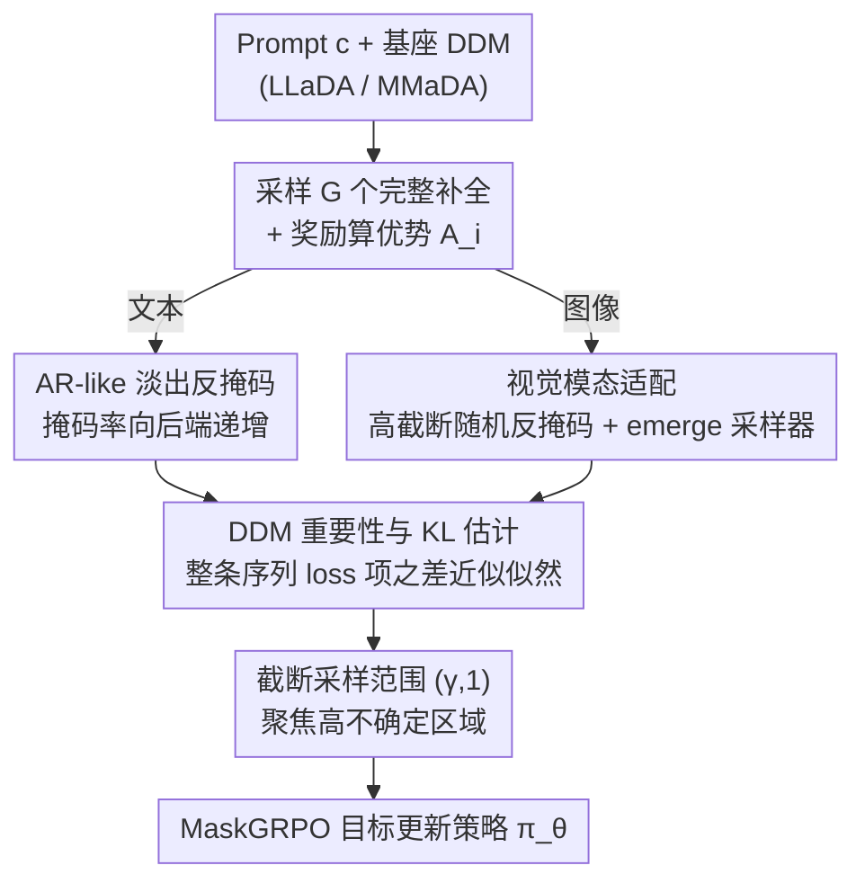

# Consolidating Reinforcement Learning for Multimodal Discrete Diffusion Models

**会议**: ICLR2026  
**OpenReview**: [https://openreview.net/forum?id=9nxCJP4q0i](https://openreview.net/forum?id=9nxCJP4q0i)  
**代码**: https://github.com/martian422/MaskGRPO  
**领域**: 扩散模型 / 多模态生成  
**关键词**: 离散扩散、GRPO、强化学习、重要性采样、文图对齐

## 一句话总结
本文提出 MaskGRPO，第一个能稳定扩展到多模态离散扩散模型（DDM）的 GRPO 强化学习框架：先为 DDM 的不可解似然给出一套可计算的重要性估计与 KL 近似，再按"语言/视觉"两类模态分别定制反掩码（re-mask）与采样策略——文本用淡出式 AR 反掩码、图像用高截断随机反掩码加 emerge 采样器，在数学推理、代码、文图生成上把 RL 收益几乎翻倍，同时训练提速最多 30%。

## 研究背景与动机
**领域现状**：以 GRPO（Group Relative Policy Optimization）为代表的"组内相对优势 + 重要性采样"强化学习范式，已经成为提升自回归（AR）大模型推理能力、对齐生成模型偏好的主力工具。它的核心是对一组 rollout 计算归一化优势 $A_i$，再用新旧策略的 token 级重要性比 $\rho^k_i = \pi_\theta(o^k_i\mid c,o^{<k}_i) / \pi_{\theta_{old}}(o^k_i\mid c,o^{<k}_i)$ 做带 clip 的策略更新。

**现有痛点**：把 GRPO 搬到离散扩散模型（DDM）上却几乎不可行。DDM 不是顺序解码，而是在任意位置并行地从掩码 token 中重建，这同时打坏了 GRPO 的两个支柱：一是 **rollout 生成**——并行解码很难产出既有随机性又连贯的样本供探索；二是 **重要性估计**——AR 模型那种 $\pi(o^k\mid o^{<k})$ 的条件似然在 DDM 里根本写不出来（似然不可解、importance sampling 不可解）。

**核心矛盾**：已有补丁都只解决一半。文本侧的半自回归采样器缓解了推理问题，图像侧的低置信度 re-mask 缺乏稳健组内比较所需的随机灵活性；早期做重要性估计的方法（diffu-GRPO 给 prompt 加掩码、UniGRPO 迭代掩码不同比例）要么破坏了条件依赖、要么是高成本的 Monte Carlo 估计。根子在于：**语言和视觉的结构性质完全不同，用一套"无差别随机掩码"去估计似然，既不准也不稳**。

**本文目标**：给出一个对 DDM 真正可计算、低方差的似然/重要性估计，并让 rollout 与估计都"认得出模态"。

**切入角度**：作者观察到两个模态各有可利用的偏置——语言即便是原生扩散训练，预测时仍残留"ARness"（离观测上下文越近的 token 越确定，随长度延展分歧才出现）；图像 token 之间是强全局相关、缺乏顺序结构，对小掩码比例几乎不敏感。

**核心 idea**：用"模态感知"取代"无差别随机"——文本让掩码概率向后端淡出（fading-out）以聚焦高不确定区域，图像则用高截断的随机反掩码加 emerge 采样器，从而第一次把 GRPO 系统地、稳定地装进多模态离散扩散。

## 方法详解

### 整体框架
MaskGRPO 要解决的是"如何在不可解似然的 DDM 上跑 GRPO"。整体仍沿用 GRPO 的外循环：对每个 prompt $c$ 采一组完整补全 $\{o_1,\dots,o_G\}$、用奖励 $r_i$ 算归一化优势 $A_i$，再做策略更新。关键差别在内循环：DDM 算不出 token 级条件似然，于是本文把"时间步反演"当作桥梁——对每个补全 $o$，用反掩码函数 $\hat o^t\sim\mathrm{Rev}(o,t)$ 把它退回带掩码的中间态，再用**整条序列的 loss 项之差**来近似新掩码 token 的似然涨落，得到可计算的重要性 $\hat\rho^t$ 与 KL 散度 $\hat D^t_{KL}$，最后据此做梯度上升。

这条管线里有两处"分叉"：反掩码方式（$\mathrm{Rev}$）和 rollout 采样器都按模态切换——文本走淡出式 AR 反掩码 + 半自回归采样，图像走高截断随机反掩码 + emerge 采样器。整体流程如下：

### 关键设计

**1. DDM 重要性与 KL 估计：用整条序列的损失之差近似不可解似然**

DDM 的 token 级条件似然写不出来，是把 GRPO 搬过来的第一道墙。本文从 DDM 的 ELBO 出发，把每个补全的损失记为 $\ell_{\pi_\theta}(x_t,x_0)$（对掩码位置的重建对数似然按 $1/t$ 加权求和，见原文 Eq. 2）。核心近似是：对一个小区间 $\delta t$，记 $\dot o^t=o^t-o^{t+\delta t}$ 为从 $t+\delta t$ 到 $t$ 新解出来的 token，那么这些新 token 的对数似然差可以用**整条序列在时刻 $t$ 的预测差**来近似：

$$\log\pi_1(\dot o^t\mid c,o^{t+\delta t})-\log\pi_2(\dot o^t\mid c,o^{t+\delta t})\approx \ell_{\pi_1}(o^t,o\mid c)-\ell_{\pi_2}(o^t,o\mid c)$$

由此得到可计算的重要性比 $\hat\rho^t_i=\exp\big(\ell_{\pi_\theta}(o^t_i,o_i\mid c)-\ell_{\pi_{\theta_{old}}}(o^t_i,o_i\mid c)\big)$ 与对应的 $\hat D^{i,t}_{KL}$（原文 Eq. 9–10）。把它代回 GRPO，目标变成沿一串时间步 $t_j=j/\mu$ 累加 $\sum_j(\hat\rho^{t_j}_i-\beta\hat D^{i,t_j}_{KL})$ 再按优势 $A_i$ 加权。和 diffu-GRPO（只在全掩码 $o^{t=1}$ 上取似然、破坏条件依赖）、UniGRPO（迭代掩码、Monte Carlo 成本高）相比，这套估计既不破坏条件结构、也不需要昂贵采样，是后续两个模态适配能成立的理论地基。作者特别提醒这个近似在以往工作里被忽略却对推导和代码实现都关键（⚠️ 推导细节以原文 Appendix C 为准）。

**2. 截断采样范围：把时间步预算砸在真正有涨落的高不确定区域**

直接在 $(0,1)$ 整个掩码比例区间上估计，会让大量预算浪费在低掩码、模型已经高度确定的预测上——这些位置似然几乎不动，提供不了有用梯度。本文把采样范围从 $(0,1)$ 收紧到 $(\gamma,1)$，$\gamma$ 作为掩码比例的下截断（cut-off）。直觉是：只有掩码率足够高、序列里还残留足够多不确定 token 时，重建似然的涨落才"信息量大"。这个截断在两个模态都用，但取值不同——文本默认 $\gamma=0.6$，图像则因 token 全局相关、对小掩码极不敏感而必须更激进，取 $\gamma=0.8$ 才能得到有意义的估计。消融显示截断既不能没有（不截断训练不稳）、也不能过猛（过度截断会过早收敛），它充当跨模态的"通用稳定器"。

**3. 文本侧淡出式 AR 反掩码：顺着语言的 ARness 把注意力压到后段 token**

语言即便用原生扩散训练，预测上仍有"ARness"——离上下文近的 token 更确定、分歧随长度延展才显现；配合半自回归采样器，rollout 在 block 越往后越发散（开头是简单铺垫，真正的推理分歧在后面才出现）。无差别的随机反掩码忽略了这一点，把估计平摊到前段已经很确定的 token 上。本文的 AR-like 反掩码（Alg. 1）对非 prompt 部分构造一条线性递减权重 $d=\mathrm{linspace}(1,0,L_o)$，归一化成掩码概率 $p_n=d\cdot\frac{(1-r)L_o}{\sum d}$，于是越靠后的 token 被掩的概率越高、估计被集中到高不确定的后段。它在保持可控随机性的同时不增加任何额外计算，是即插即用模块——只把原始反掩码换成这个 AR 版本就能显著涨点。消融里"换成 AR-like 反掩码"是数学推理上单步提升最大的一项（GSM8K-256：$80.4\to83.5$）。

**4. 视觉侧高截断随机反掩码 + emerge 采样器：让视觉 token 从掩码里自然"浮现"**

图像没有顺序结构、token 间强全局相关，所以视觉侧反着来：反掩码保持随机（Alg. 2，对所有非 prompt token 等概率掩码），但反演强度必须很高（$\gamma=0.8$），否则小掩码下预测几乎不变、方差还会爆。更关键的是 rollout 采样器——基于置信度的 MaskGIT 采样器是为 1024 词表设计的，在 8192 这种大词表高保真 tokenizer 上会失灵（采样不准，且单纯提精度救不了）。本文借鉴连续扩散的采样直觉提出 emerge 采样器（Alg. 4）：它不强制每步解出固定数量的 token，而是按概率（$q_s=\frac{\alpha_s-\alpha_t}{1-\alpha_t}\pi+\delta_m\frac{1-\alpha_s}{1-\alpha_t}$，并配 CFG 引导 $\mathrm{logits}=\mathrm{logits}_c+w(\mathrm{logits}_c-\mathrm{logits}_u)$）让视觉 token 自然"浮现"，忠于 DDM 原理（Eq. 3）却表现力强得多。有意思的是 emerge 采样器在 RL 之前 GenEval 反而更低（0.51 vs 0.56，因为物体边界偶尔不稳），但它扩大了探索空间，RL 后不稳消失、收敛到 MaskGIT 够不到的更优局部解（0.81 vs 0.77）。

### 损失函数 / 训练策略
最终目标是 GRPO 的"奖励-惩罚"权衡在 DDM 上的版本：对每个 prompt 采 $G$ 个补全算优势，内循环跑 $\mu$ 次梯度更新，每次取时间步 $t_j=\gamma+(1-\gamma)\frac{j}{\mu}$、用受控随机种子构造掩码补全 $\hat o_{i,t_j}\sim\mathrm{Rev}(o_i,t_j,S_j)$，再按 Eq. 9–10 估计 $\hat\rho$、$\hat D_{KL}$，最大化 $\frac{1}{G}\sum_i\frac{A_i}{|o_i|}\sum_j(\hat\rho^{t_j}_i-\beta\hat D^{i,t_j}_{KL})$。奖励上，语言任务用"格式 + 正确性"的简单组合奖励；图像任务组合 UnifiedReward（文图对齐）、HPSv3（美学 + 对齐）和 CLIP Score。基座为 LLaDA-8B-Instruct（文本）与 MMaDA-8B-Base（多模态）。

## 实验关键数据

### 主实验
数学推理与代码（Pass@1，基座 LLaDA-8B-Instruct）：

| 方法 | GSM8K-256 | GSM8K-512 | MATH500-256 | MBPP-256 |
|------|-----------|-----------|-------------|----------|
| LLaDA-8B-Instruct | 76.7 | 78.2 | 32.4 | 39.0 |
| diffu-GRPO | 79.8 (+3.1) | 81.9 (+3.7) | 34.4 (+2.0) | 42.1 (+3.1) |
| UniGRPO† | 81.1 (+4.4) | 82.0 (+3.8) | 35.0 (+2.6) | 43.1 (+4.1) |
| TraceRL† | 82.1 (+5.4) | 83.3 (+5.1) | 35.9 (+3.5) | 43.9 (+4.9) |
| **MaskGRPO** | **84.7 (+8.0)** | **85.6 (+7.4)** | **37.6 (+5.2)** | **45.4 (+6.4)** |

MaskGRPO 在三个 benchmark 上都拿到 5%+ 绝对提升，RL 收益几乎是此前方法的两倍，且步数更少（6000 vs 7000+）；在 GSM8K 上只用一半补全长度（256 vs 512）就超过前人。

文图对齐与人类偏好（GenEval / 偏好分，基座 MMaDA）：

| 模型 | GenEval | DPG-Bench | DeQA | ImageReward | HPSv3 |
|------|---------|-----------|------|-------------|-------|
| MMaDA | 0.56 | 0.71 | 3.99 | 0.93 | 8.81 |
| w/ UniGRPO | 0.63 | – | – | – | – |
| **w/ MaskGRPO** | **0.81** | 0.75 | 4.10 | 1.18 | 9.40 |
| **w/ SFT+MaskGRPO** | **0.90** | **0.82** | **4.18** | **1.30** | **9.63** |

MaskGRPO 是首个在离散扩散上对"美学质量 + 文图对齐"同时做出有效 GRPO 优化的方法；加上 BLIP3-o 数据的 SFT 后，GenEval Overall 达 0.90，逼近 FLUX.1-dev（0.82）等领先连续生成系统。

### 消融实验

| 配置（数学/视觉） | 指标 | 说明 |
|------|------|------|
| Baseline diffu-GRPO | GSM8K 79.8 | 起点 |
| + Managed Randomness | 80.4 | 受控随机种子 |
| + AR-like Rev. | 83.5 | 淡出式反掩码（单步最大提升） |
| + Truncation 等 | 84.7 | 截断稳定器 |
| Baseline UniGRPO | GenEval 0.63 | 起点 |
| + Truncation 等 | 0.75 | 通用稳定器 |
| + Emerge Sampler | 0.81 | 视觉采样器（贡献 20+ 点） |

### 关键发现
- **文本最大贡献是 AR-like 反掩码**：从随机改成淡出式反掩码带来单步最大跳升（$80.4\to83.5$），印证"利用语言 ARness 做重要性估计"是关键，和 KL 散度分析一致。
- **视觉最大贡献是 emerge 采样器**：在图像域它把增益放大到 20+ 点（$0.63\to0.81$），而截断作为跨模态"通用稳定器"两边都稳。
- **截断比例 $\gamma$ 要折中**：$\gamma\in\{0.2,0.4,0.6,0.8\}$ 的消融显示，不截断和过度截断都损害稳定性，文本默认 $\gamma=0.6$，图像需更高 $\gamma=0.8$。
- **KL 行为更健康**：UniGRPO 一开始就高散度且持续剧烈波动（不稳）；diffu-GRPO 确定性掩码抹掉了波动但也抑制探索；MaskGRPO 在二者间取得平衡——稳定的同时保留有效探索所需的散度。

## 亮点与洞察
- **"似然差≈序列损失差"这个近似是整篇的支点**：它把 DDM 不可解的条件似然变成可计算的整序列 loss 之差，绕开了 Monte Carlo 的高成本，又不像 diffu-GRPO 那样破坏条件依赖——这是后面所有模态适配能成立的前提。
- **"模态感知"被贯彻到最底层的反掩码与采样**：不是在 loss 上加项，而是直接改"怎么把样本退回掩码态、怎么解码"，文本淡出、图像高截断 + emerge，思路很统一也很可迁移。
- **emerge 采样器揭示一个反直觉规律**：它在 RL 前反而更差（边界不稳拉低检测式指标），却因为探索空间更大，RL 后收敛到 MaskGIT 够不到的更优解——"前期更差但探索更强 → 最终更好"这个观察对设计 RL 采样器很有启发。
- **即插即用**：AR-like 反掩码不增加任何额外计算，只替换原始反掩码即可涨点，工程上几乎零成本接入。

## 局限与展望
- **近似的严格性留疑**：核心的"似然差≈序列损失差"依赖完美重建假设（沿用 MDLM 推导），其偏差在长序列、复杂条件下有多大，正文未充分量化，细节推到 Appendix C（⚠️ 以原文为准）。
- **超参对模态敏感**：$\gamma$ 文本 0.6、图像 0.8，这种依赖经验的取值意味着换 tokenizer 或新模态可能要重新调，缺乏自适应机制。
- **视觉评测的指标错位**：emerge 采样器 RL 前 GenEval 反降，源于检测式指标对边界不稳的惩罚，说明现有自动指标和真实视觉质量存在偏差，结论需结合定性样本看。
- **奖励工程仍重**：图像侧靠 UnifiedReward + HPSv3 + CLIP 的组合奖励，奖励黑客与奖励权重的影响未深入讨论；可探索更稳健或可学习的奖励。

## 相关工作与启发
- **vs diffu-GRPO**：它对 prompt 加掩码、在全掩码补全 $o^{t=1}$ 上取似然，破坏了条件依赖；本文用整序列损失差估计似然，保留条件结构且方差更低。
- **vs UniGRPO**：它迭代掩码不同比例做 Monte Carlo 式估计，预算高且 KL 从一开始就高度不稳；MaskGRPO 估计更便宜、训练动态更平稳，且首次报告了视觉 RL 的完整配置与对比。
- **vs TraceRL**：它严格沿记录的生成轨迹反演，依赖预定义路径、只在 block-attention 架构验证过，确定性反演限制了探索；本文的随机 AR-like 反掩码在全注意力 LLaDA 上一致优于 TraceRL，归因于路径无关的构造保留了更大探索空间。
- **vs MaskGIT 采样器**：MaskGIT 为小词表设计、在大词表高保真 tokenizer 上失灵；emerge 采样器按概率让 token 浮现、忠于 DDM 原理，视觉表现力显著更好。

## 评分
- 新颖性: ⭐⭐⭐⭐⭐ 首个可扩展的多模态离散扩散 GRPO，似然近似 + 模态感知反掩码/采样都是实打实的新东西
- 实验充分度: ⭐⭐⭐⭐ 覆盖数学/代码/文图三类任务、含截断与反掩码消融，但视觉侧 baseline 与指标口径略有错位
- 写作质量: ⭐⭐⭐⭐ 理论铺垫到模态适配逻辑清晰，关键近似的推导被压进附录稍显仓促
- 价值: ⭐⭐⭐⭐⭐ 把 GRPO 真正打通到离散扩散，为多模态偏好优化建立了可复用的地基，代码开源

<!-- RELATED:START -->

## 相关论文

- [\[NeurIPS 2025\] Co-Reinforcement Learning for Unified Multimodal Understanding and Generation](../../NeurIPS2025/image_generation/coreinforcement_learning_for_unified_multimodal_understandin.md)
- [\[ICLR 2026\] RePrompt: Reasoning-Augmented Reprompting for Text-to-Image Generation via Reinforcement Learning](reprompt_reasoning-augmented_reprompting_for_text-to-image_generation_via_reinfo.md)
- [\[ICML 2026\] ViewMask-1-to-3: Multi-View Consistent Image Generation via Multimodal Discrete Diffusion Models](../../ICML2026/image_generation/viewmask-1-to-3_multi-view_consistent_image_generation_via_multimodal_discrete_d.md)
- [\[CVPR 2026\] Leveraging Verifier-Based Reinforcement Learning in Image Editing](../../CVPR2026/image_generation/leveraging_verifier-based_reinforcement_learning_in_image_editing.md)
- [\[CVPR 2026\] Goal-Driven Reward by Video Diffusion Models for Reinforcement Learning](../../CVPR2026/image_generation/goal-driven_reward_by_video_diffusion_models_for_reinforcement_learning.md)

<!-- RELATED:END -->
