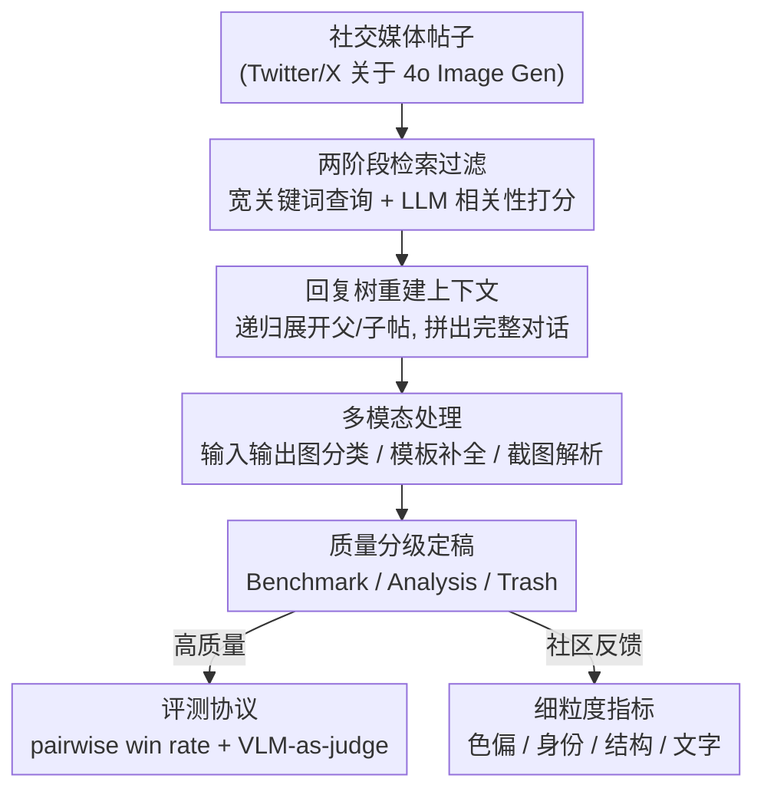

# Constantly Improving Image Models Need Constantly Improving Benchmarks

**会议**: ICLR2026  
**OpenReview**: [https://openreview.net/forum?id=nOcy5NvNI1](https://openreview.net/forum?id=nOcy5NvNI1)  
**代码**: [echo-bench.github.io](https://echo-bench.github.io)  
**领域**: 图像生成评测 / Benchmark 构建  
**关键词**: 图像生成评测, benchmark 构建, 社交媒体众包, VLM-as-judge, GPT-4o Image Gen

## 一句话总结
本文提出 ECHO 框架，把社交媒体上用户对新图像模型的真实讨论（创意 prompt + 口碑反馈）自动蒸馏成结构化 benchmark，在 GPT-4o Image Gen 上抓出 31,000+ 条 in-the-wild prompt，既挖出现有 benchmark 没覆盖的新任务，又把 SOTA 与其它模型的差距拉大到 3.2 倍，还能把社区抱怨直接转成可量化的细粒度指标。

## 研究背景与动机
**领域现状**：图像生成模型迭代极快，每代（尤其 GPT-4o Image Gen 这类闭源系统）都会冒出一批用户没料到的新能力，比如把照片转成某动画工作室风格的「吉卜力化（Ghiblification）」。这些新玩法第一时间在 Twitter/X 等社交平台被分享、讨论、当成口碑标尺，而正式 benchmark 往往要滞后一个周期才反应过来。

**现有痛点**：现在主流的文生图众包 benchmark（如 Pick-a-Pic、PartiPrompts 一类）大多还是围绕 Stable Diffusion 时代的画风关键词堆砌（"colorful stars, galaxies, space, artstation"），既不像自然语言，也不代表当下可行的用法；图像编辑 benchmark（GEdit、MagicBrush 等）的指令又过于简单（"加点涂鸦"、"把背景换成城市街道"），新老模型都能做，区分度趋零。结果就是：人工评测显示 4o Image Gen 明显强于最好的开源统一模型，但放到旧编辑 benchmark 上，这个差距却被压平。

**核心矛盾**：benchmark 是静态、滞后的，而模型能力和用户期望在持续漂移——「什么算一个好图像模型」的定义一直在变，benchmark 却没有随社区反馈进化的机制。靠人工设计 prompt 还会引入两个偏差：prompt 意图被模型自身能力上限框死，prompt 风格也会迎合特定模型（如为绕过 CLIP 文本编码器的 bag-of-words 特性而堆关键词）。

**本文目标**：造一个**可复跑、随模型与用户行为一起进化**的 benchmark 构建框架，把「观察到新能力 → 做出 benchmark」这条慢循环短路掉，直接从真实世界证据（社交媒体帖子）生成评测。

**切入角度**：社交媒体上的 prompt 是写给人看的、为了博取互动而刻意求新求奇，分布上天然比「交互界面采集」的 prompt 更多样、更贴近自然语言，也更能暴露模型短板——这是一座现成但脏乱的金矿。

**核心 idea**：用一条自动化流水线把社交媒体讨论（文本 prompt + 图像 + 社区口碑）转成标准化样本 `<输入文本, 输入图像*, 输出图像, 社区反馈*>`（`*` 为可选），再据此做评测，并把社区反馈里的高频抱怨反向工程成可量化指标。

## 方法详解

### 整体框架
ECHO（Extracting Community Hatched Observations）的目标，是把围绕某个新生成模型的「集体讨论」蒸馏成结构化数据集。它面对的不是干净的数据，而是社交媒体三大顽疾：相关性与数量的取舍、上下文被拆散在多条帖子里、prompt 和图像以各种非标准格式（截图、模板、拼图）混杂。整条流水线分四步：先**大量收集相关帖子**，再把帖子**重建成自包含样本**，接着用**多模态处理**扩展覆盖那些藏在图里的数据，最后**分级定稿**——把最高质量样本留作 benchmark，其余留作大规模分析。把这条流水线跑在 4o Image Gen 的 Twitter/X 讨论上，最终得到 30k 可分析样本，并裁出 image-to-image（777 条 prompt-图像对）与 text-to-image（1000 条 prompt）两个评测子集。

### 关键设计

**1. 两阶段「广查询 → LLM 相关性过滤」：在数量与相关性之间找平衡**

社交媒体检索有个绕不开的矛盾：关键词越宽，召回越多但平均相关性越低；关键词越窄，相关性高但帖子池很快被掏空。ECHO 先用宽关键词把池子做大，再用一个 LLM 在 5 级量表上对帖子文本打相关性分，只保留「很可能相关 / 确定相关」两档。作者还发现一个**时间漂移**现象：4o Image Gen 发布头两周里，"openai" 这类泛词还能捞到相关帖，之后相关性骤降——所以他们对「发布两周内 / 两周外」用两套不同关键词。初始收 68k 帖，47% 通过相关性过滤（约 32k），说明查询设计的产出率（yield）相当高。LLM 过滤本身贵，所以不能无脑扩池——这套两阶段设计正是对「过滤成本 vs 召回」的工程化折中。

**2. 回复树重建跨帖上下文：把被拆散的 prompt 拼回来**

帖子是有上下文依赖的：用户常在主帖写「prompt 在下面」，真正的 prompt 文本却在某条回复里。ECHO 要的是**自包含样本**——一条完整的 prompt、它收到的社区反馈、产出的图像、以及一个质量标签，因此必须尽量把回复树收全。对关键词命中的每个帖子，它抓取完整回复树（祖先链 $P^{\uparrow}=\langle P_0,\dots,P_n\rangle$ 与直接回复 $C^{\downarrow}=\{C_0,\dots,C_m\}$），再递归地对新发现的帖子继续展开回复链，光这一步就从回复里挖出 19k 条关键词查询本来够不到的新帖。构树时以「主帖」$P_{\text{main}}$ 为中心，把祖先链接成 $P_0\to\dots\to P_n\to P_{\text{main}}$ 的路径、每条直接回复挂为主帖的子节点；同一帖会出现在多棵树里，于是按 URL 去重并递归合并子节点。这一步本质是把「关键词召回」补成「图遍历召回」，覆盖面显著扩大。

**3. 多模态处理三类非标准格式：捞出藏在图里的数据**

很多有用信息不在文本里，而埋在图像中，ECHO 针对三种常见情形做多模态处理。其一，**输入图 vs 输出图分类**：社交媒体没有统一格式标记谁是输入谁是输出（输出可能在序列首、可能在尾，还可能混进无关图），ECHO 让 VLM 像人一样从语境推断这一区分。其二，**填空模板补全**：用户常发「fill-in-the-blank」模板让评论区接龙，模板本身不完整、还把评论里最有意思的补全给省了，ECHO 用 VLM 在模板与评论提供的图像条件下，反向工程出这些补全。其三，**对话截图解析**：用户分享与 4o Image Gen 交互的截图（prompt、参考图、输出图全挤在一帧里），这是质量最高的数据源，因为输入输出被原样记录、无需转述。解析它需要把图定位到 bounding box、区分子图是输入还是输出、判断哪段是 prompt、哪段是无关对话——与其拼接一堆专用模型，作者统一用一个为框检测专门训练过的 VLM（Qwen2.5-VL）路由处理，它不仅能解析 4o Image Gen 界面，也能搞定并排拼图等非标准排版。

**4. 三级质量标签 + in-the-wild win-rate 评测协议：用相对指标对付开放任务**

定稿时用 LLM 把样本分三级：**Benchmark**（连贯、用户意图清晰的高质 prompt）、**Analysis**（部分 prompt 或评论这类中质数据，单独留作分析）、**Trash**（跑题或畸形内容，丢弃）。在 4o Image Gen 上跑下来，20% 标为高质（可做 benchmark）、66% 标为中质（可做分析）。由于 in-the-wild prompt 高度开放，几乎无法定义「准确率」，ECHO 改用**两两对决胜率（head-to-head win rate）**这个相对指标：在全部 $\binom{n}{2}$ 对模型比较里，赢得 1 分、输得 0 分、平局各得 0.5 分，模型最终胜率即它对所有其它模型的平均胜率。打分用 **VLM-as-a-judge**：照 MT-Bench 的「single answer grading」给每个输出直接打分，再转成「伪两两比较」（分高者判赢），可扩展性好；为消除评委偏向同厂模型的偏差，作者集成 GPT-4o、Gemini 2.0、Qwen2.5-VL-32B 三个评委取多数票，并按 MT-Bench 要求评委先产出 chain-of-thought、综合考虑 prompt 遵从度、对参考图的忠实度、真实感与美学再打分。

**5. 把社区反馈反向工程成细粒度指标：让评测「闭环」**

ECHO 不止给出总分，更把社区高频抱怨直接转成可量化、可解释的细粒度指标——这是它区别于普通 benchmark 的点睛之笔。基于从反馈里聚出的失败类别，作者设计了四个自动指标，并先用 LLM 判定每个样本适用哪个指标再计算：**色偏幅度（Color Shift Magnitude）**用输入输出图颜色直方图的平均差刻画用户常吐槽的「发黄」；**人脸身份相似度**用 AuraFace 提取人脸 embedding，取输入输出间余弦相似度最高的脸对；**结构距离**按 Tumanyan 等的设定，用 DINO key 特征的 Gram 矩阵的 Frobenius 范数衡量物体位置 / 人体姿态的漂移；**文字渲染准确率**用 VLM-as-judge 给出兼顾可读性、拼写、标点、语法的整体分（比纯 OCR 字符串匹配更全面）。这一设计把「用户在抱怨什么」系统性地翻译成了「模型在哪一维上输」，能直接为后续模型改进甚至 loss 设计提供信号。

### 一个完整示例
拿一条「对话截图」帖走一遍：某用户发了一张与 4o Image Gen 的聊天截图，里面有 prompt「make this 3d」、一张输入参考图、一张模型输出图，配文「ChatGPT gives you a polished commercial visual—ready to publish」。① 检索阶段，这条帖因含目标模型关键词被宽查询召回，并通过 LLM 相关性过滤；② 回复树阶段，它的几条回复（如别人评论「amazing result」）被拼进同一棵树作为社区反馈；③ 多模态阶段，VLM 解析这张截图，把参考图框为 input、生成图框为 output，并从对话区抽出 "make this 3d" 作为 prompt、丢掉无关闲聊；④ 定稿阶段，因 prompt 连贯、意图清晰，被打上 **Benchmark** 标签，最终形成样本 `{prompt: "make this 3d", inputs: [B.jpg], outputs: [A.jpg], feedback: ["amazing result"]}`。整个 51k 帖经此流程收敛到 30k 样本、再裁成千量级的 benchmark/analysis 子集。

## 实验关键数据

### 主实验：ECHO 把模型差距拉得更开
在 in-the-wild 子集上用三评委集成胜率对比八个模型，image-to-image 与 text-to-image 两个子集都呈现清晰的分层，且相对 GEdit 这类旧编辑 benchmark，ECHO 的 image-to-image 子集把 SOTA 与次优的相对差距放大到 **3.2 倍**。

| 模型 | I2I 胜率 | T2I 胜率 |
|------|---------|---------|
| 4o Image Gen | **0.81** | **0.76** |
| Nano Banana (Gemini 2.5 Flash) | 0.66 | 0.74 |
| Gemini 2.0 Flash | 0.53 | 0.55 |
| Bagel-Think | 0.49 | 0.46 |
| Bagel | 0.48 | 0.41 |
| Flux Kontext | 0.45 | 0.40 |
| LLM+Diffusion (GPT-4o + DALL·E 3) | 0.18 | 0.60 |
| Anole | 0.07 | 0.10 |

I2I 上模型分成五个清晰梯队：4o 一骑绝尘 → Nano Banana → 中间一团（Gemini 2.0 Flash / Bagel-Think / Bagel / Flux Kontext）→ LLM+Diffusion → Anole 垫底。T2I 趋势相近但差距更平缓，且 LLM+Diffusion 排名大幅跃升（说明纯文生图场景下「LLM 改写 + 扩散」这种 shallow fusion 反而不吃亏）。

### 细粒度指标：社区抱怨被坐实

| 指标（方向） | 4o Image Gen 表现 | 解读 |
|------|------|------|
| 色偏幅度 ↓ | 27.75（最大） | 坐实「发黄」吐槽；同厂的 LLM+Diffusion(DALL·E 3) 也异常偏色（12.45） |
| 人脸身份相似度（AuraFace）↑ | 0.277（偏低） | 验证 4o 难保人脸一致，疑似有损视觉编码器 / 身份训练数据不足 |
| 结构距离（DINO）↓ | 0.091（中等漂移） | 倾向「重新近似」而非忠实复制结构；未训 I2I 的 LLM+Diffusion(0.221)/Anole 最差 |
| 文字渲染准确率 ↑ | 0.957（近满分） | 与其「做信息图利器」的口碑一致 |

### 关键发现
- **数据更自然、更多样**：ECHO 的指令比旧 benchmark 多 2.3 倍的唯一首 bigram（多样性），且在 Pythia 12B 下困惑度低 1.2 倍（更接近自然语言）——印证用户已转向用流畅完整句子而非堆关键词与模型交互。
- **挖出旧 benchmark 没有的新任务**：跨语言重渲染产品标签、生成指定总额的收据、novel view synthesis、需要认知推理的编辑、虚拟试穿、模板化产品图、多图主体生成、代码式风格迁移等。
- **自动评委与人工只是弱相关**：5 位专家对 200 样本排序，VLM-as-judge 与人工排名仅弱但显著相关（Kendall $\tau_b$：GPT 0.117 $p{=}0.0036$、Gemini 0.083 $p{=}0.0199$、Qwen 0.045 不显著；人-人一致性 $W{=}0.49$）——作者坦承评委模型仍需进一步研究。

## 亮点与洞察
- **把「评测」从静态产物变成可复跑的活流程**：ECHO 最妙的不是某条 benchmark，而是「社区讨论 → 结构化样本」这条可重跑管线——模型和用户行为一变，重跑一遍就得到新 benchmark，天然抗「per-model 偏差」与滞后。
- **社交媒体 ≠ 交互界面采集**：作者点破社交媒体 prompt 因「求互动」而更求新求奇，分布上比 Chatbot Arena 这类界面采集更能逼出模型短板——这个数据源选择本身就是洞见。
- **闭环思想可迁移**：把「用户在评论里抱怨什么」用 LLM 聚类 → 反向工程成色偏 / 身份 / 结构 / 文字四个可量化指标，这套「定性反馈 → 定量指标」的闭环范式，能直接搬到视频生成、TTS、代码生成等任何有活跃社区口碑的生成任务。
- **统一用一个框检测 VLM 替代多专用模型**：截图解析这种「定位 + 分类 + 文本判别」多任务，作者不拼专用模型而押注 Qwen2.5-VL 的泛化，工程上更省、对非标准排版更鲁棒。

## 局限与展望
- **强依赖闭源大模型当评委/标注器**：相关性过滤、样本抽取、质量分级、win rate 打分、指标适用性判定全靠 LLM/VLM，评委与人工仅弱相关，且三评委集成只是缓解而非根除同厂偏差——评测可靠性被评委能力上限锁死。
- **绑定单一平台与单一模型**：案例只跑了 Twitter/X 上的 4o Image Gen，结论的普适性、以及平台政策 / API 变动对可复跑性的影响都未充分检验；社交媒体本身有人群与话题偏差。
- **benchmark 规模受成本压制**：为控下游评测开销，每个子集被限到约千条，且需人工抽检纠偏——「自动化」并未完全去人工。
- **改进方向**：训练或挑选更贴合人工的图像生成评委；把框架推广到多平台、多模态生成任务；让细粒度指标真正进入模型 loss / RLHF 形成「评测—训练」闭环。

## 相关工作与启发
- **vs 界面采集众包 benchmark（Pick-a-Pic / DiffusionDB 等）**：它们从模型交互界面采 prompt，意图被模型能力上限框死、风格迎合模型；ECHO 取材社交媒体「写给人看」的 prompt，更多样自然且可随模型进化重跑。
- **vs GEdit / IntelligentBench / KontextBench**：GEdit 爬真实编辑 prompt 但受作者想象力限制，只 11 类单图编辑任务；后两者由模型自家作者设计、数据来源与构造法不透明且未公开。ECHO 来源透明、可复跑、覆盖远更广的新任务。
- **vs Chatbot Arena**：同样收 in-the-wild 真实 prompt，但 Arena 靠免费平台激励用户、采到的多是「模型已能胜任」的任务；ECHO 转向社交媒体这一更偏「炫技求新」的分布，更能区分前沿模型。
- **vs MT-Bench**：ECHO 直接复用其 single-answer grading 与伪两两比较设定，把 LLM 文本评测的方法论迁移到图像生成评测上。

## 评分
- 新颖性: ⭐⭐⭐⭐⭐ 「社交媒体讨论 → 可复跑 benchmark」是图像生成评测里少见的全新数据源与范式，且把社区反馈闭环成量化指标。
- 实验充分度: ⭐⭐⭐⭐ 八模型双子集对比 + 四细粒度指标 + 人工相关性验证较完整，但只押单平台单模型、benchmark 规模受成本限制。
- 写作质量: ⭐⭐⭐⭐⭐ 动机（benchmark 滞后）讲得透，Ghiblification、收据生成等例子很有画面感，图表清晰。
- 价值: ⭐⭐⭐⭐⭐ 直击「评测跟不上模型迭代」的真痛点，框架与闭环指标思想可迁移到一切有社区口碑的生成任务。

<!-- RELATED:START -->

## 相关论文

- [\[ICLR 2026\] AlphaFlow: Understanding and Improving MeanFlow Models](alphaflow_understanding_and_improving_meanflow_models.md)
- [\[ICLR 2026\] AlignFlow: Improving Flow-based Generative Models with Semi-Discrete Optimal Transport](alignflow_improving_flow-based_generative_models_with_semi-discrete_optimal_tran.md)
- [\[ICLR 2026\] Steer Away From Mode Collisions: Improving Composition In Diffusion Models](steer_away_from_mode_collisions_improving_composition_in_diffusion_models.md)
- [\[ICLR 2026\] Self-Improving Loops for Visual Robotic Planning](self-improving_loops_for_visual_robotic_planning.md)
- [\[ICLR 2026\] Improving Diffusion Models for Class-imbalanced Training Data via Capacity Manipulation](improving_diffusion_models_for_class-imbalanced_training_data_via_capacity_manip.md)

<!-- RELATED:END -->
