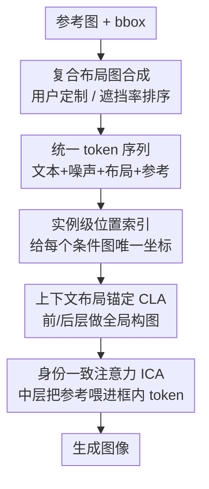

# ContextGen: Contextual Layout Anchoring for Identity-Consistent Multi-Instance Generation

**会议**: ICLR2026  
**OpenReview**: [https://openreview.net/forum?id=wEuWyQnLY5](https://openreview.net/forum?id=wEuWyQnLY5)  
**代码**: https://github.com/nenhang/ContextGen  
**领域**: 扩散模型 / 图像生成  
**关键词**: 多实例生成、布局控制、身份一致性、Diffusion Transformer、注意力掩码

## 一句话总结
ContextGen 在 FLUX.1-Kontext 这套 Diffusion Transformer 上，用「把复合布局图和参考图一起塞进同一条上下文 token 序列」的思路，配合分层注意力掩码（前后层做全局布局锚定 CLA、中间层做实例级身份注入 ICA）和一套不重叠的位置索引，在多个主体的可控生成上同时把布局准确率和身份保真度做到了 SOTA，甚至在身份保持上反超 GPT-4o。

## 研究背景与动机
**领域现状**：现在的可定制图像生成基本分两条线。一条是 layout-to-image（L2I），给定 bounding box 和文字短语，让模型把对应物体画到指定位置（GLIGEN、InstanceDiffusion、MIGC、EliGen 等）；另一条是 subject-driven，给一张或几张参考图，让模型保住主体的身份细节（OmniGen2、DreamO、UNO 等）。近期主流架构已经从 UNet 转向 DiT，FLUX 这类模型把图像 token 和文本 token 拼成一条序列做统一的多模态自注意力。

**现有痛点**：作者把现状归纳成三个具体短板。其一是**位置控制不够准**，已有的布局引导很难精确落到用户指定的框里；其二是**身份保不住**，subject-driven 方法在主体数变多时身份细节会明显退化，多个实例互相干扰；其三是**没有合适的训练数据**——已有大规模数据集（COCO、ImageNet）画质和标注粒度跟不上现代扩散模型，而高质量的 subject-driven 数据集每张图里实例又太少，缺少「参考图 ↔ 精确布局」成对对齐的多实例数据。

**核心矛盾**：布局控制和身份保真这两件事被现有方法割裂着做。只给一张复合布局图时，重叠区域在拼合过程中会丢信息、细节退化；只用参考图又缺乏可靠的空间锚定。二者各自的强项恰好是对方的弱项，但没有一个框架能在同一套机制里同时拿到「精确空间结构」和「实例级身份一致」。

**本文目标**：在一个统一的 DiT 框架里，同时解决（1）多实例的精确空间布局，（2）多主体的身份保持，（3）支撑这两件事的高质量训练数据。

**切入角度**：作者借鉴 I2I 里「diptych（并排参考图对）能引导扩散模型」的经验，把布局信息也做成一张**复合布局图**放进生成上下文，再把高保真的原始参考图作为补充一起送进去——让模型在同一条 token 序列里同时看到「东西该在哪」和「东西长什么样」。再观察到 DiT 不同层有功能分工（前后层管全局结构、中间层管实例属性），于是把两种约束分别绑到不同层。

**核心 idea**：把布局图和参考图统一进同一条上下文 token 序列，用**分层注意力掩码**让前后层做全局布局锚定（CLA）、中间层做实例身份注入（ICA），从而把布局控制和身份保持解耦到不同深度又互补地完成。

## 方法详解

### 整体框架
ContextGen 不引入新参数，直接在 FLUX.1-Kontext 上用 LoRA 微调。它要解决的事就一句话：给定若干参考图和它们应该出现的位置，生成一张「位置对、身份还都保住」的多实例图像。整条流程是这样转的：先在 **Setup 阶段**把所有实例按 bounding box 拼成一张**复合布局图**（既可以用户手工摆，也可以用基于遮挡率的自动排序算法堆叠）；然后把文本嵌入、噪声图像 token、布局图 token、N 张参考图 token 拼成一条**统一 token 序列** $T = [t_{\text{text}}, t_{\text{image}}, t_{\text{layout}}, t_{\text{ref}_1}, \cdots, t_{\text{ref}_N}]$；这条序列经过 FLUX 的 57 个 DiT block，但**不同深度用不同的注意力掩码**——前 19 层和后 19 层用 CLA 掩码做全局布局锚定，中间 19 层用 ICA 掩码把每个框内的 token 强行连到它对应的参考图 token 上做身份注入；同时给序列里每个条件图配一套不重叠的**实例级位置索引**，让模型分得清谁是谁。最后解码出目标图像。

### 关键设计

**1. 上下文布局锚定 CLA：把布局图当上下文，让物体被"锚"在指定位置**

针对「位置控制不准」这个痛点，CLA 的做法是不再把布局当成额外的条件分支，而是把复合布局图直接拼进上下文 token 序列，让它和文本、噪声图像一起参与自注意力。作者观察到 DiT 的前后层主要负责全局上下文和结构构图，于是把 CLA 放在前 19 层（FR-19）和后 19 层（BK-19）。它用一个专门的注意力掩码 $M_{\text{CLA}}$ 来约束谁能看谁：记文本集 $T$、噪声图像集 $I$、布局集 $L$、第 $n$ 个参考图集 $R_n$，掩码定义为

$$M_{\text{CLA}}(q,k)=\mathbb{1}\!\left[(q,k)\in(T\cup I\cup L)^2 \cup \bigcup_{n=1}^{N}\big(R_n\times(T\cup R_n)\big)\right].$$

直白说就是：文本、噪声图、布局图三者之间**完全互通**，保证布局结构能广播到全图；而每张参考图此时只和文本与自己通信、彼此隔离。这样前后层就靠这张布局图把每个实例稳稳压在该在的格子里，拿到鲁棒的空间锚定，而不会让参考图的细节在这个阶段提前互相串味。

**2. 身份一致注意力 ICA：中间层把参考细节精准灌进对应的框**

只靠复合布局图有个硬伤——重叠实例在拼合时会丢细节。ICA 就是来补这个洞的。它放在中间 19 层（MID-19，先前工作已表明这些层对实例级属性影响最大），对落在某个 bounding box $B_n$ 内的 query token 施加一个特制掩码：

$$M_{\text{ICA}}(q,k)=\mathbb{1}\!\left[(q,k)\in\bigcup_{n=1}^{N}\big(B_n\times(T\cup B_n\cup R_n)\big)\;\cup\;\{(q,k)\in M_{\text{CLA}}\mid q\notin\textstyle\bigcup_n B_n\}\right].$$

关键是中间那段 $B_n\times(T\cup B_n\cup R_n)$：框 $n$ 内的 token 被**强制连到它对应的参考图 $R_n$**，从而把这张参考的精细身份信息可靠地搬进对应位置；而框外（背景）token 则继续沿用 CLA 的掩码。这一设计让框架从「全局布局控制」平滑过渡到「实例级身份保持」，并且和 CLA 形成互补——CLA 给鲁棒的空间结构，ICA 给精确的细节保真，重叠区域不再丢身份。

**3. 实例级位置索引：给每张条件图发不重叠的坐标，让模型分得清谁是谁**

FLUX 的三元位置编码给每个 token 一个 $p_i=(m,i,j)$，文本固定 $(0,0,0)$、图像 token 用其 2D 隐空间坐标。但当布局图、多张参考图都拼进同一条序列后，它们的坐标会和噪声图重叠，模型就分不清这是目标图的哪块还是哪张参考。作者扩展了索引策略：**Basic Part** 保留主噪声图原本的 $(0,i,j)$，保证目标图内部空间一致；**Auxiliary Part**（布局图 + 各参考图）则统一用 $m=1$，并按累积偏移编码为 $(1, W_n+i, H_n+j)$，其中 $W_n=\sum_{k=1}^{n-1}w_k$、$H_n=\sum_{k=1}^{n-1}h_k$ 是前面所有条件图尺寸的累加。这样即使多张条件图拼在一起，每张也有唯一且不重叠的位置标识，注意力机制既能区分「噪声图 vs 辅助输入」，也能区分各条件图彼此。消融显示这套索引对最终效果有实质贡献。

**4. IMIG-100K：为图像引导多实例生成专门构建的分层数据集**

这是对「缺数据」痛点的正面回应。已有数据集要么实例多但画质/标注差，要么画质高但每图实例太少。IMIG-100K 用 FLUX 框架构建，分三个子集系统训练不同能力：**Basic Instance Composition（50K）**用 FLUX.1-Dev 生成真值图、再用检测分割模型抠出参考图，只做轻量后处理，练基础构图；**Complex Instance Interaction（50K）**每图最多 8 个实例，参考图经语义编辑模拟遮挡、视角旋转、姿态变化等真实交互；**Flexible Composition with References（10K）**先单独生成参考实例、再用 subject-driven 模型合成场景，允许实例相对原参考有较大变换，并经严格过滤保证身份一致，专门练模型对低一致性输入的鲁棒性。所有文字 prompt 由大模型生成以保证多样和质量。

### 损失函数 / 训练策略
模型用 FLUX.1-Kontext 初始化、不加新参数，以 LoRA（Rank 512）微调，4×A100、总 batch 16、在三个分层子集上训 5K 步，用 Prodigy 优化器（默认学习率）。此外用 **DPO（Direct Preference Optimization）** 做偏好微调，把目标图当作偏好样本、布局图当作非偏好样本，缓解模型「死板照抄布局图、不做实例自适应（姿态/光照）」的倾向，在保真与灵活之间取舍。先在 LoRA Rank 256 上扫 $\beta$ 系数定出最优 $\beta=1000$，再用到 Rank 512 的最终模型。

## 实验关键数据

### 主实验
在 LAMICBench++（身份保持基准）上，ContextGen 的总均分超过所有开源模型，并在身份相关指标上反超闭源商业模型：

| 基准 / 指标 | 本文 | 对比对象 | 提升 |
|--------|------|----------|------|
| LAMICBench++ AVG | 64.66 | OmniGen2 61.08 / FLUX.1-Kontext 63.33（开源最佳） | +1.3% |
| LAMICBench++ AVG | 64.66 | GPT-4o 63.71 / Nano Banana 64.11（闭源） | 反超 |
| More Subjects IDS（人脸身份） | 30.42 | GPT-4o 17.12 | +13.3% |
| COCO-MIG I-SR（实例成功率） | 69.72 | MIGC 66.44（前最佳） | +3.3% |
| COCO-MIG mIoU（空间精度） | 65.12 | EliGen 59.23（前最佳） | +5.9% |
| LayoutSAM-Eval Color / Texture / Shape | 87.44 / 89.26 / 88.36 | EliGen 83.84 / 87.31 / 87.01 | 全面领先 |

对闭源模型作者明说是「策略性取舍」：在 ITC（图文一致）和 AES（美学）上略逊 GPT-4o/Nano Banana，但在 IPS（物体保留）和 IDS（身份保持）上显著领先，综合分反而最高，说明它在同时保住物体和身份上更强。

### 消融实验
ICA 放在哪些 DiT block（F=前19、M=中19、B=后19）以及 DPO 的 $\beta$ 都做了消融：

| 配置 | AVG | IDS | 说明 |
|------|-----|-----|------|
| ICA 仅 MID-19（完整） | 64.66 | 32.72 | 最佳，验证中层最适合做身份注入 |
| ICA 全部 F/M/B 且去掉 CLA | 58.03 | 22.70 | 去 CLA 后全指标大幅下滑 |
| DPO $\beta=1000$ | 62.67* | — | 扫描得到的最优，> w/o DPO 62.55 |
| w/o DPO | 62.55* | 32.37 | 身份高但构图/美学弱 |

（*DPO 一栏为 LoRA Rank 256 上的扫参结果，与主表 Rank 512 不可直接比大小。）

### 关键发现
- **CLA 不可或缺**：去掉 CLA 的基线（ICA 铺满全层）AVG 直接从 64+ 掉到 58.03，所有指标全面下滑，说明全局布局锚定是多实例生成的地基。
- **ICA 放对层很关键**：把 ICA 只放中间 19 层效果最好（AVG 64.66、IDS 32.72），印证「中层管实例属性」的先验；而且 ICA 的价值在重叠场景的细粒度身份保持上最明显，宏观指标未必完全反映。
- **DPO 是保真-灵活的权衡器**：随 $\beta$ 增大，ITC/AES（构图、美学）单调改善，但 IDS/IPS（身份）会受控地小幅下降；$\beta=1000$ 在两者间取得最佳平衡。

## 亮点与洞察
- **把"布局"也做成上下文里的一张图**：不另开控制分支，而是让复合布局图和参考图一起进同一条 token 序列做自注意力，复用了 DiT 原生的 in-context 能力——这种「一切皆 token」的统一条件化思路很优雅，也方便迁移到别的可控生成任务。
- **按 DiT 层的功能分工分配约束**：前后层做全局构图、中间层做实例身份，这种「分层注意力掩码」把两类原本打架的目标解耦到不同深度，是全文最巧的一手。掩码本身只是布尔约束、零额外参数，纯靠 LoRA 微调就跑通。
- **位置索引的累积偏移技巧**：用 $(1, W_n+i, H_n+j)$ 给每张条件图发不重叠坐标，这个 trick 对任何「把多张参考/条件图拼进一条序列」的 DiT 方法都通用，可直接借用。
- **数据集的分层设计有方法论意义**：Basic→Complex→Flexible 三档对应「基础构图→真实交互→低一致鲁棒」，把训练目标拆成递进的能力曲线，而不是一锅炖。

## 局限与展望
- **依赖复合布局图的质量**：自动排序基于遮挡率堆叠，复杂遮挡或非矩形交叠时拼合仍可能丢信息，重叠场景靠 ICA 兜底但治标。
- **对闭源模型在 ITC/AES 上仍有差距**：图文一致和美学略逊 GPT-4o/Nano Banana，作者把它说成「策略取舍」，但说明全局语义对齐和画面美感还有提升空间。
- **DPO 调参依赖人工**：$\beta$ 需要单独扫描，且保真-灵活的权衡是手调出来的最优点，换数据/任务可能要重扫。
- **数据全靠生成模型自举**：IMIG-100K 的真值图和参考图都由 FLUX 系列生成，可能继承基模型的分布偏置，真实照片域的泛化未充分验证。

## 相关工作与启发
- **vs OmniGen2 / DreamO（subject-driven SOTA）**：它们把多主体条件拼成 token 序列处理，但主体一多身份就退化；ContextGen 用 ICA 的强制连接 + 分层掩码专门保身份，More Subjects 场景优势被放大。
- **vs MS-Diffusion / LAMIC（reference + layout 结合）**：同样想兼顾参考驱动和布局控制，但布局精度和身份一致仍有缺口；ContextGen 靠 CLA/ICA 解耦 + IMIG-100K 数据把两端都顶上去。
- **vs EliGen / MIGC / 3DIS（DiT/UNet 布局控制）**：纯布局控制在 mIoU/成功率上强但不管参考身份；ContextGen 是图像引导，提供更细的属性绑定，COCO-MIG 上 I-SR 和 mIoU 双双领先。
- **vs FLUX.1-Kontext（基模型）**：本文直接在它上面 LoRA 微调，把单图编辑的位置编码扩展成多条件序列的实例级索引，是对基模型「在序列里塞更多条件图」能力的一次定向增强。

## 评分
- 新颖性: ⭐⭐⭐⭐ 「布局图入上下文 + 分层注意力掩码解耦布局/身份」组合清晰且实用，单点都有出处但拼法新。
- 实验充分度: ⭐⭐⭐⭐⭐ 三个基准 + 对比开源/闭源十余个模型 + CLA/ICA/位置索引/DPO 全套消融。
- 写作质量: ⭐⭐⭐⭐ 动机、掩码公式、层分工讲得明白，图文对照清楚；个别细节（57 层划分、DPO 在不同 Rank 上比较）需读者自己留心。
- 价值: ⭐⭐⭐⭐ 既给出 SOTA 方法又开源 IMIG-100K 数据集，对身份一致多实例生成是实打实的推进。

<!-- RELATED:START -->

## 相关论文

- [\[ICLR 2026\] I-DRUID: Layout to Image Generation via Instance-Disentangled Representation and Unpaired Data](i-druid_layout_to_image_generation_via_instance-disentangled_representation_and_.md)
- [\[ICLR 2026\] SIGMA-GEN: Structure and Identity Guided Multi-Subject Assembly for Image Generation](sigma-gen_structure_and_identity_guided_multi-subject_assembly_for_image_generat.md)
- [\[AAAI 2026\] EchoGen: Cycle-Consistent Learning for Unified Layout-Image Generation and Understanding](../../AAAI2026/image_generation/echogen_cycle-consistent_learning_for_unified_layout-image_generation_and_unders.md)
- [\[ICLR 2026\] CreatiDesign: A Unified Multi-Conditional Diffusion Transformer for Creative Graphic Design](creatidesign_a_unified_multi-conditional_diffusion_transformer_for_creative_grap.md)
- [\[NeurIPS 2025\] InstanceAssemble: Layout-Aware Image Generation via Instance Assembling Attention](../../NeurIPS2025/image_generation/instanceassemble_layoutaware_image_generation_via_instance_a.md)

<!-- RELATED:END -->
