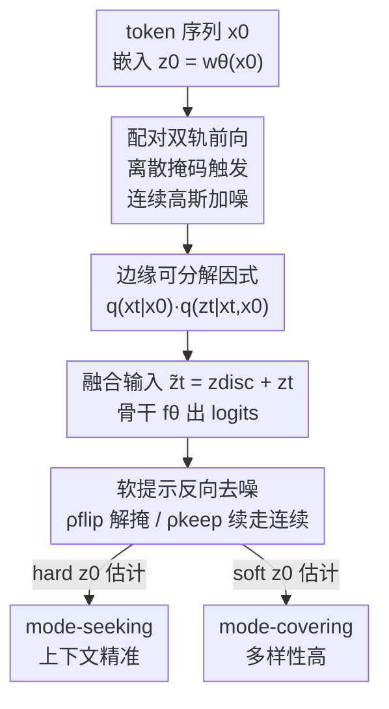

# Continuously Augmented Discrete Diffusion model for Categorical Generative Modeling

**会议**: ICLR2026  
**OpenReview**: [https://openreview.net/forum?id=JNAZ3e7Bwt](https://openreview.net/forum?id=JNAZ3e7Bwt)  
**代码**: https://github.com/apple/ml-CADD  
**领域**: 扩散模型 / 离散生成  
**关键词**: 离散扩散, 掩码扩散, 连续隐变量, 类别生成, 模式覆盖-模式寻优  

## 一句话总结
CADD 给离散掩码扩散的每个 `[MASK]` 位置额外配一条"连续隐变量"轨道——被掩的 token 不再坍缩成毫无信息的吸收态，而是带着一个逐步加噪但仍保留语义的连续向量，去噪时把它当作"软提示"来引导离散预测，从而在文本、图像、代码三类生成上一致超过纯掩码扩散基线。

## 研究背景与动机

**领域现状**：在离散数据（文本、代码、像素索引）上做生成，目前两条主流扩散路线。一条是**掩码扩散模型（MDM）**：随时间逐步把 token 替换成吸收态 `[MASK]`，反向去噪时学着把 mask 还原成 token，训练信号是清晰的 token 级交叉熵，近期已经被 scale 到 7B 规模、逼近自回归模型。另一条是**连续扩散模型（CDM）**：先把 token 嵌入到连续空间，在嵌入上做高斯扩散，最后再 round 回离散符号，好处是能保留平滑的语义信号、复用成熟的 score-based 方法。

**现有痛点**：两条路各有硬伤。MDM 的问题是**信息真空（information void）**——所有"未观测"的可能性都被压成同一个 `[MASK]` 符号，抹掉了"这个被破坏的位置离原 token 有多近"的全部信息。论文举的例子很直白：如果一个被掩的位置原本可能是"Language"也可能是"Diffusion"，`[MASK]` 本身给不出任何倾向性线索，模型只能在没有渐进引导的情况下硬做二选一。CDM 的问题相反，叫**过度平滑（over-smoothing）**：去噪全程在连续嵌入空间进行、只在最后一步才离散化，连续目标会把 token 身份抹糊，缺乏局部上下文时很难做精确预测。

**核心矛盾**：MDM 训练信号干净、生成保真度高（mode-seeking），但状态表示太"硬"、丢语义梯度；CDM 表示连续、能表达语义邻近（mode-covering），但在离散空间里 fidelity 落后。二者的优点恰好互补，却一直被当成两条独立的技术路线。

**本文目标**：在保留 MDM 干净掩码轨迹和交叉熵训练的同时，把 CDM 的"渐进语义信号"嫁接进来，既不牺牲离散预测的精度，又能在采样时可控地调节多样性。

**切入角度**：作者的观察是——掩码这个动作本身就是个"触发器"。token 一旦被掩，与其让它的语义瞬间坍缩，不如让它的嵌入开始走一条平滑的高斯加噪轨迹，像 CDM 那样缓慢退化而非一步归零。

**核心 idea**：给离散掩码轨迹**配对**一条连续高斯扩散轨迹——离散状态 $x_t$ 旁边永远跟着一个连续隐变量 $z_t$，被掩位置由"带噪但有信息的隐向量"承载语义，反向每一步用 $z_t$ 作软提示引导离散去噪。

## 方法详解

### 整体框架

CADD（Continuously Augmented Discrete Diffusion）把单条离散扩散链扩成"离散 + 连续"的双轨联合扩散。输入是一段离散 token 序列 $x_0=(x_0^1,\dots,x_0^n)$；每个 token 经可学习嵌入表 $w_\theta$ 映射成连续向量 $z_0=w_\theta(x_0)$。前向过程**联合**地演化离散序列和它的隐变量：离散侧照常按掩码调度 $\alpha_t$ 把 token 抽成 `[MASK]`；连续侧则被离散侧"触发"——只要某个 token 还没被掩，它的隐向量就**冻结**在原始值；一旦被掩，就启动高斯扩散、嵌入沿平滑路径越来越噪。这样在任意时刻 $t$，被掩位置都不是空洞的 `[MASK]`，而是一个仍保留原 token 语义邻近性的带噪隐向量。

反向过程里，网络 $f_\theta$ 同时吃离散状态 $x_t$ 和连续隐 $z_t$，预测被掩位置的 token 分布。关键是连续隐当作**软语义提示**：它在候选 token（如"Language"与"Diffusion"）之间提供一条渐进的路径，而离散邻域把搜索空间限制在合理的小三角区域内，于是模型既能平滑过渡又不会像纯 CDM 那样在巨大高斯空间里漂出流形产生乱码。整条 pipeline 的好处是**零架构改动**：复用任意 MDM 的骨干，只是多喂一路 $z_t$ 输入，因此能把现成 MDM 高效微调成 CADD。

### 关键设计

**1. 配对双轨前向：掩码触发的连续高斯轨迹**

针对的是 MDM 的"信息真空"。CADD 定义了离散与连续的**联合转移** $q(x_t,z_t\mid x_{t-1},z_{t-1},x_0)=q(x_t\mid x_{t-1})\cdot q(z_t\mid z_{t-1},x_{t-1},x_t,x_0)$，离散部分照旧用吸收态转移矩阵 $Q_t=(1-\beta_t)I+\beta_t\,\mathbf{1}m^\top$。精妙在连续部分的三段式定义：token **未被掩**时隐向量用 Dirac 函数冻结 $\delta(z_t^i-z_{t-1}^i)$，保持原值不变（信息没改就别动它）；token **刚被掩**那一刻，触发高斯扩散 $\mathcal{N}(z_t^i;\sqrt{\bar\gamma_t}z_{t-1}^i,(1-\bar\gamma_t)I)$；**持续被掩**则沿着这条高斯路径继续变噪 $\mathcal{N}(z_t^i;\sqrt{\gamma_t}z_{t-1}^i,(1-\gamma_t)I)$。

这样设计的回报是论文 Proposition 1 给出的**边缘可因式分解**：$q(x_t,z_t\mid x_0)=q(x_t\mid x_0)\cdot q(z_t\mid x_t,x_0)$，且两项都有闭式——离散项是 Categorical，连续项在 $x_t^i=x_0^i$ 时为 $\delta(z_t^i-z_0^i)$、在 $x_t^i=m$ 时为 $\mathcal{N}(z_t^i;\sqrt{\bar\gamma_t}z_0^i,(1-\bar\gamma_t)I)$。可闭式采样意味着训练时不用一步步模拟整条链，直接按调度算出任意 $t$ 的状态，这是它"训练保持简单"的根基。

**2. 软提示反向去噪：用连续隐做语义引导**

这是把"带语义的 mask"真正用起来的一步。反向后验同样可因式分解为离散后验 $q(x_{t-1}\mid x_t,x_0)$ 与连续后验 $q(z_{t-1}\mid x_t,z_t,x_{t-1},x_0)$（Proposition 2）。网络只在被掩位置预测 token logits $f_\theta(x_t,z_t)$，未被掩位置直接保留。连续后验在"持续被掩"分支是高斯 $\mathcal{N}(z_{t-1};\tilde\mu_t,\tilde\beta_t I)$，其均值
$$\tilde\mu_t=\frac{\sqrt{\bar\gamma_{t-1}}(1-\gamma_t)}{1-\bar\gamma_t}z_0+\frac{\sqrt{\gamma_t}(1-\bar\gamma_{t-1})}{1-\bar\gamma_t}z_t$$
把"对干净嵌入的估计 $z_0$"和"当前带噪隐 $z_t$"线性混合，本质就是连续扩散里标准的后验均值形式。更进一步，CADD 用一组隐向量 $\{z_t^{(k)}\}_{k=1}^K$ 做蒙特卡洛平均来逼近真实 token 分布 $p_\theta(x_{t-1}\mid x_t)=\mathbb{E}_{z_t}[p_\theta(x_{t-1}\mid x_t,z_t)]\approx\frac{1}{K}\sum_k p_\theta(x_{t-1}\mid x_t,z_t^{(k)})$。在巨大候选空间里，对多个合理连续态求期望，让预测分布比单点的 `[MASK]` 更接近真实可能 token 的分布。

**3. KL 分解与简化交叉熵训练：让目标退化成一行 loss**

为了让训练"简单到能复用 MDM 代码"，论文证明了变分目标的 KL 在被掩位置**恰好分裂**成离散项和连续项（Lemma 1）：
$$D_{KL}=\rho_t^{\text{flip}}\big(-\log p_\theta(x_0\mid x_t,z_t)\big)+\rho_t^{\text{keep}}D_{KL}^{\text{cont}}$$
其中 $\rho_t^{\text{keep}}=\frac{1-\alpha_{t-1}}{1-\alpha_t}$、$\rho_t^{\text{flip}}=\frac{\alpha_{t-1}-\alpha_t}{1-\alpha_t}$ 是"这一步该解掩还是继续在连续空间漂移"的权重，连续 KL 是个 SNR 重加权的 MSE $D_{KL}^{\text{cont}}=\frac{a_t^2}{2\tilde\beta_t}\|z_0-\hat z_{0,\theta}\|^2$。关键观察是：只要用 $\hat z_{0,\theta}:=\sum_v p_\theta(\hat x_0=v\mid x_t,z_t)w_{\theta,v}$ 这种"预测对了 token 就等于预测对了嵌入"的估计，连续 MSE 项就能被离散交叉熵自动满足。于是 CADD 最终只用一个交叉熵 loss
$$\mathcal{L}_{\text{CADD}}=\mathbb{E}_t\,\mathbb{E}_{q(x_t,z_t\mid x_0)}\Big[-\sum_{i:x_t^i=m}\log p_\theta(x_0^i\mid x_t^i,z_t^i)\Big]$$
就能训练（MSE 项可选加上以更精确逼近 ELBO，但实测简化版更省算力且够好）。架构上唯一改动是把离散嵌入 $z_{\text{disc}}=w_\theta(x_t)$ 与带噪连续嵌入 $z_t$ **逐元素相加**成 $\tilde z_t=z_{\text{disc}}+z_t$ 喂进骨干——加法融合既不引入新参数也不破坏原有掩码扩散流程。

**4. 软/硬 $\hat z_0$ 估计：一个旋钮调多样性与精确度**

这是 CADD 在采样侧最实用的设计。回收嵌入做下一步迭代时，$\hat z_{0,\theta}$ 有两种取法：**hard** 取 argmax token 再查嵌入 $\hat z_0=w_\theta(\arg\max_v\pi_{\theta,i}(v))$；**soft** 取整个分布的期望嵌入 $\hat z_{0,\theta}=\sum_v p_\theta(\hat x_0=v\mid x_t,z_t)w_{\theta,v}$。二者对应两种生成行为：hard 把上下文快速锁定，偏 **mode-seeking**（上下文精准）；soft 保留更多概率质量在合理候选上，偏 **mode-covering**（多样性高）。这等于把"多样性 vs 精确度"这个老 trade-off 暴露成一个采样时就能拨的旋钮，无需重训。重要的是，因为离散头始终锚定在词表上，多样性来自语义变化而非不受控的噪声，不会像纯 CDM 那样漂出流形产生乱码。

## 实验关键数据

### 主实验

文本（OpenWebText，168M Discrete DiT，与 MDLM 同配置）随采样步数 $T$ 一致优于纯掩码基线，且在 $T=4096$ 时还在涨而 MDLM 停滞甚至变差：

| 任务 / 数据集 | 指标 | CADD | 最强离散基线 | 说明 |
|--------------|------|------|------------|------|
| 文本 OWT (T=4096) | MAUVE ↑ | 0.270 | 0.240 (Duo w cd) | 步数越大优势越明显 |
| 文本 OWT (T=4096) | Gen PPL ↓ | 102.5 | 104.7 (MDLM) | MDLM 随 T 反而变差 |
| 图像 CIFAR-10 (NFE=512) | FID ↓ | **2.88** | 3.26 (MDM-Prime) | 超所有离散/连续基线 |
| 图像 CIFAR-10 | IS ↑ | 10.04 | 9.67 (MDM-Prime) | 最佳 |
| 图像 ImageNet-32 (NFE=1024) | FID ↓ | **3.74** | 6.98 (MDM-Prime) | 大幅领先 |
| 代码 (7/8B) | EvalPlus Avg | **63.3** | 60.7 (DiffuCoder) | HumanEval 67.1→72.0 |
| 代码 BigCodeBench-Hard | pass@1 | 17.6 | 12.8 (DiffuCoder) | 超 Qwen2.5-Coder |

代码生成上 CADD 是最强的扩散 LLM，且在总均分上反超自回归的 OpenCoder（55.7 vs 55.0）。它还能当**微调目标**：从 DiffuCoder checkpoint 初始化、继续用 CADD loss 训，同样 65B token 预算即可受益。

### 消融实验

| 配置 | 关键指标 | 说明 |
|------|---------|------|
| 融合方式 Add | MAUVE 0.24 / Entropy 5.31 | 默认，加法 |
| 融合方式 Concat | MAUVE 0.21 / Entropy 5.37 | 需多一层投影，无明显增益 |
| 融合方式 Reweight | MAUVE 0.24 / Entropy 5.30 | 与加法相当 |
| hard $\hat z_0$ | MAUVE 0.24 | mode-seeking，上下文锁定快 |
| soft $\hat z_0$ | MAUVE 0.18→Entropy 更高 | mode-covering，多样性强 |
| 仅 CE | MAUVE 0.24 / 47,152 TPS·GPU | 简化 loss，更省算力 |
| CE + MSE | MAUVE 0.24 / 32,117 TPS·GPU | 更贴 ELBO，但更慢 |

### 关键发现
- **三种融合方式几乎不影响性能**（MAUVE 仅差 0.03、Entropy 仅差 0.07），因此选最简单、无额外参数的逐元素加法；concat 还要多一层投影对齐维度。
- **hard / soft $\hat z_0$ 验证了 trade-off 旋钮**：hard 比 soft 高 0.06 MAUVE、略低 0.11 Entropy（更 mode-seeking），soft 熵更高（更 mode-covering），两者都"合法"、按需求选。
- **简化交叉熵 loss 不输 CE+MSE**：MAUVE 同为 0.24，但仅 CE 的吞吐（47,152 vs 32,117 TPS/GPU）显著更高，所以主实验都用简化版。
- 步数扩展能力是 CADD 区别于纯掩码扩散的核心优势：MDM 随 $T$ 增大停滞/退化，CADD 仍持续改进，印证"连续增强空间"提供了额外的可利用信息。

## 亮点与洞察
- **"被掩=触发器"的视角很巧**：不把 mask 当终点而当连续轨迹的起点，让信息平滑退化而非瞬间坍缩，这一念之转就把 CDM 的语义梯度无损嫁接进 MDM。
- **边缘可因式分解 + 闭式采样**是工程上的关键收益：联合扩散看似复杂，但 Proposition 1 保证训练时能直接闭式抽任意 $t$ 状态，不用模拟整条链。
- **KL 恰好分裂成 CE + 重加权 MSE，且 MSE 能被 CE 吸收**，于是一个新框架退化成"多喂一路输入 + 原样交叉熵"，几乎零迁移成本——这点对想在现成 MDM 上加 buff 的人极友好。
- **采样侧一个 hard/soft 旋钮控制多样性-精确度**，无需重训就能切换 mode-seeking / mode-covering，可直接迁移到任何需要控制生成多样性的离散扩散任务。

## 局限与展望
- 作者把多样性与精确度的切换交给采样时的 $\hat z_0$ 估计，但何时该用哪种、如何自动选，论文只给了经验观察，缺乏理论指导。
- 主实验为公平比较大多固定 $K=1$（单隐向量），多隐向量蒙特卡洛平均的真实增益只在附录探讨，连续轨道的潜力可能被低估。
- 连续轨道引入了额外的噪声调度 $\{\gamma_t\}$ 和隐维度，虽然架构零改动，但调度/维度的敏感性与最优设置论文着墨不多。
- 评测集中在 168M 文本、32×32 图像和 7/8B 代码，更大分辨率图像或更长上下文文本上的扩展性仍待验证。

## 相关工作与启发
- **vs 纯掩码扩散（MDLM / SEDD / MDM-Prime）**：它们把未观测位置坍缩成单一 `[MASK]`，丢掉了"离原 token 多近"的语义梯度，随采样步数增大停滞甚至退化；CADD 给每个掩码位配连续隐轨道保留语义邻近性，步数越大优势越大。
- **vs 连续扩散 / 连续松弛（CDCD / Plaid / 单纯形 flow）**：它们全程在连续空间去噪、最后才离散化，易过度平滑、在巨大高斯空间里产生乱码；CADD 用离散邻域把连续搜索框在合理小区域内，兼顾平滑过渡和 token 保真度。
- **vs 重掩码 / 编辑类增强（remasking、bits/simplex 表示）**：那些方法在离散侧丰富掩码的"二元选择"或允许编辑回改；CADD 走的是正交方向——不改离散机制，而在连续侧补一条语义提示轨道，可与这些技术叠加。
- **思想来源**：把"模式平衡（mode seeking vs covering）"的视角引入离散扩散——离散路天然 mode-seeking、连续通道铺开概率质量做 mode-covering，与 guidance / score-distillation 的多样性-精确度调控一脉相承。

## 评分
- 新颖性: ⭐⭐⭐⭐⭐ "被掩=连续轨迹触发器"的双轨配对扩散是对 MDM/CDM 二分的优雅统一，视角新且推导自洽
- 实验充分度: ⭐⭐⭐⭐ 文本/图像/代码三模态 + 多组消融覆盖到位，但多隐向量 $K$ 与更大规模验证留在附录
- 写作质量: ⭐⭐⭐⭐ 公式推导清晰、图示直观，记号偶有密集但逻辑链完整
- 价值: ⭐⭐⭐⭐⭐ 零架构改动即可给任意 MDM 加 buff、还能当微调目标，落地成本极低且增益一致

<!-- RELATED:START -->

## 相关论文

- [\[ICLR 2026\] Beyond Text-to-Image: Liberating Generation with a Unified Discrete Diffusion Model](beyond_text-to-image_liberating_generation_with_a_unified_discrete_diffusion_mod.md)
- [\[ICLR 2026\] Variational Autoencoding Discrete Diffusion with Enhanced Dimensional Correlations Modeling](variational_autoencoding_discrete_diffusion_with_enhanced_dimensional_correlatio.md)
- [\[ICLR 2026\] Partition Generative Modeling: Masked Modeling Without Masks](partition_generative_modeling_masked_modeling_without_masks.md)
- [\[CVPR 2026\] Advancing Image Classification with Discrete Diffusion Classification Modeling](../../CVPR2026/image_generation/advancing_image_classification_with_discrete_diffusion_classification_modeling.md)
- [\[ICLR 2026\] Consolidating Reinforcement Learning for Multimodal Discrete Diffusion Models](consolidating_reinforcement_learning_for_multimodal_discrete_diffusion_models.md)

<!-- RELATED:END -->
