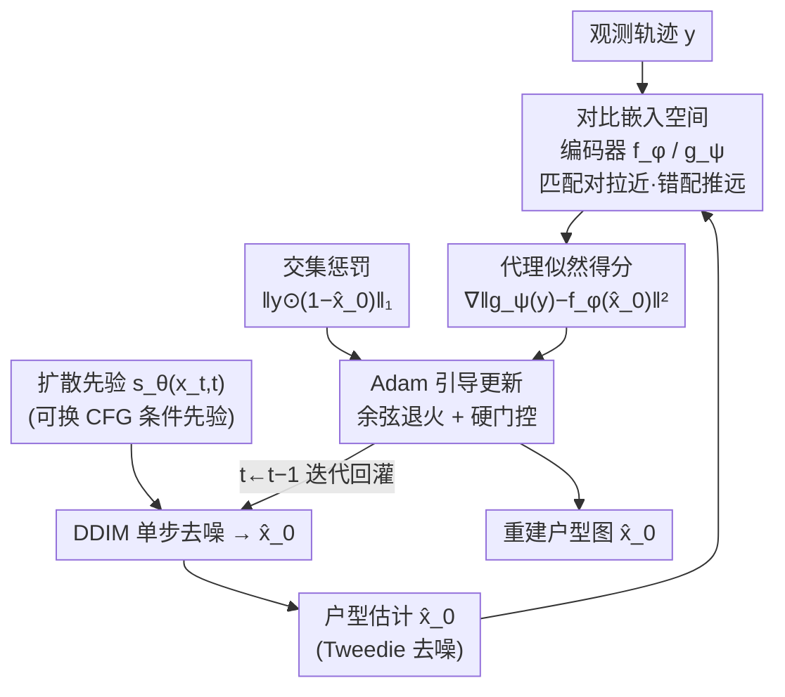

# Contrastive Diffusion Guidance for Spatial Inverse Problems

**会议**: ICLR2026  
**OpenReview**: [https://openreview.net/forum?id=B4BSxOdKYU](https://openreview.net/forum?id=B4BSxOdKYU)  
**代码**: 待确认  
**领域**: 扩散模型 / 逆问题求解  
**关键词**: 逆问题, 扩散后验采样, 对比学习, 似然代理, 室内布局重建

## 一句话总结
针对前向算子不可微、不光滑、只部分已知的"空间逆问题"（典型场景：从人走过的轨迹反推房屋户型图），CoGuide 把基于似然的扩散引导从原始像素空间搬到一个用对比学习训出来的光滑嵌入空间里，用嵌入向量的内积充当似然代理来引导去噪，从而稳定地把噪声 steer 向与观测轨迹一致的户型图，在稀疏/中等轨迹下超过 6 个基线。

## 研究背景与动机
**领域现状**：逆问题（inverse problem）要从间接、部分、带噪的测量 $y$ 反推未知信号 $x$，二者由前向过程 $y=A(x,n)$ 联系。近年扩散模型成为强力武器——它从大数据里学到先验 $\nabla_x\log p(x)$，再把后验得分拆成"先验得分 + 似然得分"做后验采样（如 DPS）：$\nabla_{x_t}\log p_t(x_t\mid y)=\nabla_{x_t}\log p_t(x_t)+\nabla_{x_t}\log p_t(y\mid x_t)$。社区一路把可处理的前向算子从线性、非线性，推进到不可微、部分可观测乃至盲（blind）算子。

**现有痛点**：作者抛出一个相当"硬"的前向算子——路径规划器。设想用户在家里走几分钟，手机记录下一串位置点 $y$；这串轨迹其实是户型图 $x$ 的函数（大脑里的路径规划策略 $A(\cdot)$ 在按户型规划 A→B→C 的路线）。这个 $A(\cdot)$ 同时是**非线性、不可微、只部分已知**的：路径规划里每一步都有 $\arg\min$ 选下一个像素，天生不可微；即便换成可微近似（Neural A*、TransPath、DiPPeR），它的雅可比 $J_A$ 范数极大、对输入极其敏感——墙上开个小门，规划出的整条路径可能天翻地覆。

**核心矛盾**：DPS 的似然引导依赖 $\nabla_x\|y-A(\hat x_0)\|_2^2=-2 J_A(x)^\top(y-A(\hat x_0))$，里头的 $\|J_A\|$ 一旦巨大且跳变，得分就充满噪声和不连续，拿它去 steer 扩散先验 $s_\theta(x_t,t)$ 会让优化极不稳定、根本收敛不到合理户型。也就是说，**前向算子的不光滑性直接污染了似然得分**，这是基于似然的引导在这类问题上失效的根因。

**本文目标**：在不去硬啃这个糟糕前向算子的前提下，找到一个仍然"有效"（是真似然得分的合法近似）但又光滑的似然代理，让扩散后验采样重新稳定。

**切入角度**：既然 $A(\cdot)$ 在像素空间不光滑，那就别在像素空间算似然——把户型图 $x$ 和轨迹 $y$ 都投影到一个共同的嵌入空间 $E$ 里，让"匹配的户型-轨迹对"靠近、"不匹配的对"远离。这个空间隐式地把 $A(\cdot)$ 学了进去，而且可以训得光滑（Lipschitz、无跳变）。

**核心 idea**：用对比学习训出的嵌入空间里的"代理似然" $\nabla_x\|[\hat x_0]_E-[y]_E\|_2^2$ 取代原始的、被坏算子污染的似然得分；并借 InfoNCE 与"似然-证据比"的理论联系，证明这个代理确实是真似然得分的合法近似。

## 方法详解

### 整体框架
CoGuide 的输入是一条（稀疏/中等/稠密）人行轨迹 $y\in\mathbb{R}^{m\times n}$，输出是反推出来的户型图 $\hat x_0$。骨架仍是 DPS 式的扩散后验采样——一个在公开户型数据集上训好的扩散先验 $s_\theta(x_t,t)$ 负责"长得像合理户型"，每步去噪再叠一个似然引导项把样本拉向与观测轨迹一致。CoGuide 的全部改造都集中在"似然引导项怎么算"：它不再把 $\hat x_0$ 喂进路径规划器算 $\|y-A(\hat x_0)\|^2$，而是先离线用对比学习训好一对编码器 $f_\phi$（编码户型）和 $g_\psi$（编码轨迹），把两者映到同一个单位超球面上的嵌入空间 $E$；推理时每个 DDIM 步先用 Tweedie 公式得到干净估计 $\hat x_0$，再算嵌入空间里的代理似然梯度 $-\frac{1}{2\tau}\nabla_{x_t}\|g_\psi(y)-f_\phi(\hat x_0)\|_2^2$，外加一个惩罚"轨迹穿墙"的交集项，一起用 Adam（而非朴素 SGD）做引导更新。

整个流程是"离线训对比空间 + 在线扩散引导"两段式，在线部分是单条逆扩散链上的多模块协同，适合用框架图鸟瞰：

### 关键设计

**1. 嵌入空间似然代理：把不光滑的似然搬到光滑空间里算**

这一步直接对准"前向算子不可微导致似然得分爆炸"的痛点。作者用两个编码器 $f_\phi:\mathcal{X}\to E$、$g_\psi:\mathcal{Y}\to E$ 把户型和轨迹都映到单位超球面（$\|f_\phi(x)\|_2=\|g_\psi(y)\|_2=1$），并把"一对 $(x,y)$ 有多匹配"建模成未归一化分布 $\pi(y,x)\propto\exp(\langle f_\phi(x),g_\psi(y)\rangle/\tau)$，温度 $\tau$ 控制分布在球面上的集中程度——内积越大代表越兼容、似然越高。然后用 InfoNCE 式对比目标去训这两个编码器，让它从"匹配的户型-轨迹对"里隐式学会 $A(\cdot)$（轨迹是用近似 $A^\star$ 从户型合成出来的）。

为什么这是"合法"的而不是拍脑袋？关键在 InfoNCE 与密度估计的理论联系：当对比损失取到最优时，最优分类器恢复出"似然-证据比"，即 $\frac{1}{\tau}\langle f_\phi(x),g_\psi(y)\rangle=\log p(y\mid x)-\log p(y)+C$，其中 $C$ 与 $x$ 无关。对 $x$ 求梯度，右边的 $-\log p(y)+C$ 直接消掉，于是 $\frac{1}{\tau}\nabla_x\langle f_\phi(x),g_\psi(y)\rangle=\nabla_x\log p(y\mid x)$——内积梯度**精确等于**真似然得分。再借单位范数嵌入的恒等式 $\langle u,v\rangle=1-\tfrac12\|u-v\|_2^2$，代理似然可写成等价的平方距离形式，最终引导项为：

$$\nabla_{x_t}\log p_t(x_t\mid y)\approx s_\theta(x_t,t)-\frac{1}{2\tau}\nabla_{x_t}\big\|f_\phi(\hat x_0(x_t))-g_\psi(y)\big\|_2^2.$$

由于 $f_\phi,g_\psi$ 本身是光滑（Lipschitz）函数，这个梯度稳定、连续，能平稳地把逆扩散导向"嵌入与观测轨迹兼容"的户型，彻底绕开了 $J_A$ 爆炸的问题。

**2. 对称多正例对比损失 + 对齐损失：把嵌入空间训得既分得开又贴得紧**

光有"代理似然"的框架还不够，嵌入空间本身得组织得好。作者用**对称**的有监督对比目标：一支以户型 $x$ 为锚把匹配轨迹拉近、推远非匹配轨迹（$\mathcal{L}_{f\to t}$），另一支以轨迹 $y$ 为锚把匹配户型拉近、推远非匹配户型（$\mathcal{L}_{t\to f}$），双向约束保证空间一致。又因为同一个户型能合成出多条兼容轨迹，作者把 InfoNCE 从单正例扩展到 Khosla et al. 的**多正例**有监督对比，这一改在推理时仍保持似然代理的合法性（附录 A）。

仅靠对比损失只能把正例和批内负例分开，却不保证每个真匹配对"贴得够紧"，于是再加一个对齐损失 $\mathcal{L}_{\text{align}}=\mathbb{E}_{(x,y)\sim p_+}\|g_\psi(y)-f_\phi(x)\|_2^2$ 直接收缩正例对的 L2 内距。最终损失为 $\mathcal{L}_{\text{contra}}=\lambda\mathcal{L}_{f\to t}+(1-\lambda)\mathcal{L}_{t\to f}+\lambda_{\text{align}}\mathcal{L}_{\text{align}}$。一个实践细节是对齐权重要**延迟上调**：前几个 epoch 只用两支对比损失，之后再慢慢加大 $\lambda_{\text{align}}$，否则早期硬拉对齐会干扰学习。t-SNE 显示这样训出的空间很有结构——户型的微扰变体 $x+\delta_1,x+\delta_2$ 彼此靠近、与其它户型远离；轨迹嵌在其匹配户型附近，且越稀疏的轨迹越往中心靠（因为稀疏轨迹更病态、能解释它的户型更多），正好为光滑似然得分服务。

**3. 交集惩罚：用"轨迹不该穿墙"这条硬先验补强后验**

作者发现单靠代理似然还不足以杜绝"墙压在走过的路上"这类违和结果，于是在推理时给所有方法（基线和 CoGuide）都加一个交集惩罚 $\mathcal{L}_{\text{intersect}}=\|y\odot(1-\hat x_0)\|_1$，它（在常数尺度内）数的是"轨迹像素落在墙像素上"的总数。把它在逆扩散里最小化，等于把更新推向"墙-轨迹兼容"的户型，让重建尊重观测轨迹。这是个具体到本问题的物理约束：人不可能穿墙走，所以观测轨迹覆盖的地方必然是自由空间。不过惩罚权重 $\lambda_{\text{int}}$ 不能太大——消融显示 $\lambda_{\text{int}}=1.5\times10^{-4}$ 附近最好，加到 $1.5\times10^{-3}$ 反而掉点。

**4. DDIM 内嵌 Adam + 退火硬门控（及 CFG+CoGuide 变体）：在短采样链上把引导积分够**

最后是让引导真正"走得稳"的工程核心。代理似然和交集惩罚插进去后，CoGuide 本质是在非凸后验上做基于梯度的优化。问题是 DDIM 比 DDPM 步数少得多，朴素 GD/SGD 在这么少的步里**积分不足**、收敛差。作者的办法是把每个 DDIM 步内部的 GD/SGD 换成 **Adam**——它用逐坐标的二阶信息补上了"多步积分"的效果，在 DDPM/DDIM 上都稳定优于 SGD（消融 Table 3：DDIM 下 IoU 从 0.76 提到 0.85）。为控制短链上的引导强度，再加一段**余弦退火**学习率：$t\le t_s$ 前固定 $\eta_0$，$t_s<t<t_e$ 按 $\eta_t=\eta_{\min}+\tfrac12(\eta_0-\eta_{\min})[1+\cos(\pi\tfrac{t-t_s}{t_e-t_s})]$ 衰减，$t\ge t_e$ 钳到 $\rho\eta_0$；最后用**硬门控**在 $t\ge t_{\text{stop}}$ 把 $\eta_t$ 直接置零，让扩散先验在后期不受引导干扰地精修样本，避开晚期不稳定。此外，把 CoGuide 原来的无条件先验换成 CFG 训的条件先验 $s_\theta(x_t,t,c)$（轨迹作条件 $c$），就得到 **CFG+CoGuide** 变体，让条件先验和对比引导互补；当 $c=\varnothing$ 时退化回原始 CoGuide。

### 损失函数 / 训练策略
- **对比模型**：对称多正例有监督对比损失 $\lambda\mathcal{L}_{f\to t}+(1-\lambda)\mathcal{L}_{t\to f}+\lambda_{\text{align}}\mathcal{L}_{\text{align}}$，对齐权重延迟上调；改编自 Khosla et al. 的 SupCon。
- **扩散先验**：沿用 DPS 的实现，在 HouseExpo 户型上训无条件扩散；CFG 变体用单个 UNet 同时支持条件/无条件模式。
- **推理**：DDIM/DDPM 采样，每步内 Adam 引导更新 + 余弦退火 + 硬门控（Algorithm 1），引导项 = 代理似然得分 + $\lambda_{\text{int}}$ × 交集惩罚。

## 实验关键数据

### 主实验
数据集为 HouseExpo（约 35,126 张 2D 户型，下采样到 $64\times64$ 二值图），用 A* 在自由空间随机采起终点生成轨迹，并按稀疏/中等/稠密三档（平均覆盖 40%/25%/10% 自由空间）模拟用户走多走少。指标为 IoU 与 F1（均针对自由空间像素）。对比 6 个基线：DPS+{Neural A*, TransPath, DiPPeR}、DiffPIR、DMPlug、CFG。

| 方法 | 稀疏 F1 | 稀疏 IoU | 中等 F1 | 中等 IoU | 稠密 F1 | 稠密 IoU |
|------|---------|----------|---------|----------|---------|----------|
| DPS+Neural A* | 0.79 | 0.67 | 0.79 | 0.66 | 0.79 | 0.66 |
| DPS+TransPath | 0.76 | 0.64 | 0.74 | 0.60 | 0.72 | 0.59 |
| DPS+DiPPeR | 0.77 | 0.64 | 0.77 | 0.64 | 0.76 | 0.63 |
| DMPlug | 0.31 | 0.19 | 0.28 | 0.17 | 0.28 | 0.16 |
| DiffPIR | 0.63 | 0.47 | 0.64 | 0.48 | 0.65 | 0.49 |
| CFG | 0.86 | 0.76 | 0.93 | 0.88 | **0.97** | **0.95** |
| CoGuide | 0.91 | 0.84 | 0.94 | 0.89 | 0.95 | 0.90 |
| **CFG+CoGuide** | **0.93** | **0.87** | **0.97** | **0.93** | **0.99** | **0.97** |

稀疏/中等档 CoGuide 单独就超过所有基线（含 CFG）；稠密档 CFG 最强、CoGuide 相当；而 CFG+CoGuide 在三档上一致碾压所有对手。值得注意的是 CFG 虽在稠密档指标好看，但定性图里仍有伪结构，CoGuide 的重建视觉上更干净、更尊重轨迹。

### 消融实验

| 配置 | 关键指标 | 说明 |
|------|---------|------|
| $\lambda_{\text{int}}=0$ | 稀疏 IoU 0.78 | 不加交集惩罚 |
| $\lambda_{\text{int}}=3\times10^{-4}$ | 稀疏 IoU 0.83 | 加惩罚显著提升 |
| $\lambda_{\text{int}}=1.5\times10^{-3}$ | 稀疏 IoU 0.84（中/稠密反降） | 惩罚过大开始掉点 |
| DDIM + GD | F1 0.86 / IoU 0.76 | 朴素梯度、积分不足 |
| DDIM + Adam | F1 0.92 / IoU 0.85 | Adam 补足多步积分 |

### 关键发现
- **代理似然是性能基石**：嵌入空间引导让 CoGuide 在最病态的稀疏轨迹下相对 DPS+planner 系列大幅领先（IoU 0.84 vs ~0.64），印证"绕开不光滑前向算子"确实是主因。
- **Adam-in-DDIM 贡献明显**：在步数少的 DDIM 上，Adam 把 IoU 从 0.76 提到 0.85，说明短采样链下逐坐标二阶积分很关键。
- **交集惩罚有"甜区"**：适量提升、过量反伤，需要调权重。
- **抗噪优雅退化 + 真实泛化**：注入高斯定位噪声后性能平滑下降、稠密轨迹更抗噪；在 UWB 实测的真实公寓轨迹（更稀疏、分布不同）上，CoGuide 比 CFG 恢复出更多墙段和房间结构——因为 CFG 过拟合到合成 A* 轨迹分布，真实数据下泛化更差。

## 亮点与洞察
- **"换空间算似然"是个可迁移的范式**：当前向算子在原空间不可微/不光滑时，与其硬造可微近似，不如学一个光滑嵌入空间、在里头算代理似然——这套思路对一大类不可微/盲逆问题都成立，作者已在盲音频修复（附录 D，前向退化完全未知）上验证了泛化。
- **理论站得住**：用 InfoNCE↔似然-证据比的等式说明内积梯度精确等于真似然得分，让"对比相似度当似然"不是 heuristic 而是有依据的代理，这是全文最"啊哈"的一笔。
- **单位范数恒等式的妙用**：$\langle u,v\rangle=1-\tfrac12\|u-v\|^2$ 把内积引导无缝转成平方距离引导，形式上与经典 DPS 的 $\|y-A(\hat x_0)\|^2$ 对齐，可即插即用。
- **隐私视角的额外价值**：用轨迹（IMU 即可采）反推户型，比基于 RGB 图像的方案更保护隐私、不依赖光照与视线，是个被低估的实用卖点。

## 局限与展望
- **依赖合成轨迹训练**：对比空间和扩散先验都用 A* 合成轨迹训，真实人类导航与 A* 最短路有差距——真实 UWB 数据上虽优于 CFG 但两者都有错，泛化仍是瓶颈。
- **分辨率受限**：户型被下采样到 $64\times64$（因路径规划器在高分辨率下太慢），实际户型的精细结构会丢。
- **"哪类算子能受益"尚不清楚**：作者自己也把"刻画哪一族非可微 $A$ 算子能从对比引导获益、如何拓宽这族算子"列为后续工作；目前只在户型 + 盲音频两个点上验证。
- **超参敏感**：交集惩罚权重、对齐权重调度、退火/门控时刻都需调，缺乏自适应方案。
- **可改进方向**：把合成-真实分布差距用域适应或少量真实轨迹微调补上；把代理似然推广到 3D 布局或多楼层；探索自适应交集惩罚权重。

## 相关工作与启发
- **vs DPS + 可微路径规划器（Neural A* / TransPath / DiPPeR）**: 它们把可微规划器直接当前向算子塞进 DPS，但雅可比敏感、似然得分不光滑，优化不稳；CoGuide 不碰前向算子，改在对比嵌入空间算光滑代理似然，稀疏档大幅领先。
- **vs DiffPIR / DMPlug（通用扩散逆求解器）**: 它们为图像复原（去模糊/修复）这类相对良性的算子设计，面对路径规划这种不可微/部分已知算子直接失效（DMPlug F1 仅 0.31，DiffPIR 0.63）；CoGuide 专门针对坏算子。
- **vs CFG（分类器无关引导）**: CFG 直接拟合"给定轨迹的户型条件后验"，稠密档指标最强但本质是过拟合合成轨迹分布，真实数据泛化差且有伪结构；CoGuide 是引导式、更鲁棒，二者互补成 CFG+CoGuide 后全面最优。
- **vs Walk2map 等户型估计工作**: 多数视觉/传感器方法依赖 RGB、专用硬件或只能单房间且无生成能力；CoGuide 用扩散先验 + 轨迹，能生成完整多房间户型且保护隐私。

## 评分
- 新颖性: ⭐⭐⭐⭐⭐ 把"对比嵌入空间代理似然"引入扩散逆问题、并给出 InfoNCE↔似然得分的理论支撑，开了不可微/盲逆问题的一条新路。
- 实验充分度: ⭐⭐⭐⭐ 6 基线 × 3 密度 + 噪声/优化器/惩罚消融 + 真实 UWB + 盲音频泛化，较完整；但仅 HouseExpo 单数据集、$64\times64$ 低分辨率。
- 写作质量: ⭐⭐⭐⭐ 动机—算子分析—理论—算法层层递进，Algorithm 1 清晰；个别公式排版密集。
- 价值: ⭐⭐⭐⭐ 提供了处理坏前向算子的通用范式 + 隐私友好的户型重建应用，迁移潜力大。

<!-- RELATED:START -->

## 相关论文

- [\[ICML 2026\] Saving Foundation Flow-Matching Priors for Inverse Problems](../../ICML2026/image_generation/saving_foundation_flow-matching_priors_for_inverse_problems.md)
- [\[ICCV 2025\] Unsupervised Imaging Inverse Problems with Diffusion Distribution Matching](../../ICCV2025/image_generation/unsupervised_imaging_inverse_problems_with_diffusion_distribution_matching.md)
- [\[ICCV 2025\] FlowDPS: Flow-Driven Posterior Sampling for Inverse Problems](../../ICCV2025/image_generation/flowdps_flow-driven_posterior_sampling_for_inverse_problems.md)
- [\[ICML 2026\] Zeroth-Order Non-Log-Concave Sampling with Variance Reduction and Applications to Inverse Problems](../../ICML2026/image_generation/zeroth-order_non-log-concave_sampling_with_variance_reduction_and_applications_t.md)
- [\[AAAI 2026\] Constrained Particle Seeking: Solving Diffusion Inverse Problems with Just Forward Passes](../../AAAI2026/image_generation/constrained_particle_seeking_solving_diffusion_inverse_problems_with_just_forwar.md)

<!-- RELATED:END -->
