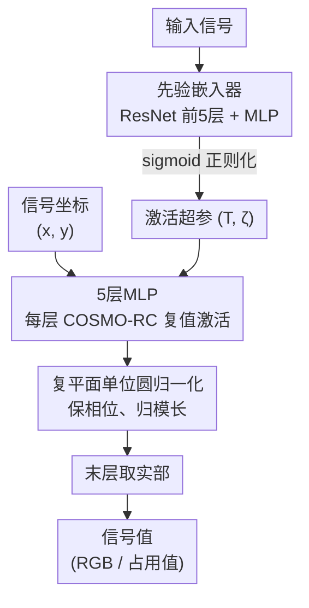

# COSMO-INR: Complex Sinusoidal Modulation for Implicit Neural Representations

**会议**: ICLR2026  
**arXiv**: [2505.11640](https://arxiv.org/abs/2505.11640)  
**代码**: 待确认  
**领域**: 图像生成  
**关键词**: 隐式神经表示, 激活函数设计, 频谱偏差, Chebyshev多项式, 复正弦调制  

## 一句话总结

通过谐波失真分析与 Chebyshev 多项式逼近，严格证明了奇/偶对称激活函数在后激活频谱中存在系统性衰减，提出用复正弦项 $e^{j\zeta x}$ 调制激活函数来保留完整频谱支持，并设计 COSMO-RC 激活函数与正则化先验嵌入器架构，在 Kodak 图像重建上 PSNR 平均领先最强基线 +5.67 dB，NeRF 上领先 +3.45 dB。

## 研究背景与动机

**领域现状**：隐式神经表示（INR）用 MLP 将连续坐标映射到信号值（如图像像素、3D 占用值等），其核心设计自由度在于激活函数的选择。SIREN 使用正弦函数、WIRE 使用小波、Gaussian 使用高斯函数，此外还有 FINER（可变频率正弦）、INCODE（先验嵌入器）等一系列方案。这些方法在不同任务上各有优劣，但为什么某些激活函数更好、它们的有效性边界在哪里，缺乏统一理论解释。

**现有痛点**：INR 面临三个核心难题——(1) 频谱偏差（spectral bias），网络对高频信号成分天然不敏感，导致重建图像模糊；(2) 噪声鲁棒性差，去噪时容易过拟合噪声；(3) 难以同时捕获局部细节和全局结构。现有激活函数的设计大多基于经验和实验对比，缺少从频谱域出发的系统性分析框架。

**核心矛盾**：激活函数通过非线性变换将输入频谱展宽（blueshift 效应），从而让网络能表示高频成分。但如果激活函数本身具有奇对称或偶对称性（几乎所有常用激活都满足），它的 Chebyshev 多项式展开中会有一半的系数为零，导致后激活频谱被系统性衰减——网络的表达能力被无谓地砍掉一半。

**本文目标** (1) 揭示现有 INR 激活函数频谱衰减的理论根源；(2) 提出通用的修复方案——复正弦调制；(3) 设计具体的最优激活函数 COSMO-RC 并验证其优越性。

**切入角度**：作者从谐波失真分析出发，将激活函数用 Chebyshev 多项式展开，发现系数的奇偶交替为零现象是对称性的必然结果，而这正是频谱衰减的数学根源。这个分析角度此前未被关注。

**核心 idea**：用复指数 $e^{j\zeta x}$ 调制激活函数打破奇偶对称性，使 Chebyshev 系数的实部和虚部不会同时为零，从而在后激活频谱中保留完整频率支持。

## 方法详解

### 整体框架

输入是信号坐标（如 2D 像素坐标 $(x,y)$），经过一个 5 层、每层 256 神经元的 MLP，每层使用 COSMO-RC 复值激活函数。各层输出归一化到复平面单位圆上保持训练稳定，最终层提取实部得到信号值（如 RGB 像素值）。额外使用一个基于 ResNet-34 前五层的先验嵌入器，从输入信号中提取特征并映射为激活函数的超参数 $(T, \zeta)$，通过 sigmoid 正则化约束参数范围。整个系统端到端训练，损失函数为标准的 MSE。理论分析（Chebyshev 频谱衰减）不是流程里的一步，而是支撑 COSMO-RC 激活为什么这么设计的依据，因此框架图里只画数据流、不为它单列节点。

### 关键设计

**1. 频谱衰减的理论发现与 Chebyshev 分析：揭示现有激活函数表达能力被砍掉一半的数学根源**

INR 表现好不好，归根到底取决于激活函数能不能把输入频谱展宽到足够高的频率。要判断一个激活 $\phi(x)$ 的展宽能力，作者把它用 Chebyshev 多项式展开 $\phi(x) = \sum_{n=0}^{\infty} a_n T_n(x)$（$T_n$ 是第一类 Chebyshev 多项式）。结合非线性层对频谱的作用 $z' = \sum_{i=0}^{K} \alpha_i \bigotimes_{l=0}^{i} z$，每个系数 $\alpha_i$ 的大小直接决定对应阶次的频谱展宽效果——系数越大，那一阶的高频贡献越强。

关键的发现来自对称性：作者严格证明，对偶对称函数 $f(x) = f(-x)$，所有奇次系数 $a_n = 0$（$n$ 为奇数）；对奇对称函数 $f(x) = -f(-x)$，所有偶次系数 $a_n = 0$（$n$ 为偶数）。也就是说，升余弦（偶对称）、正弦（奇对称）这些常用激活，它们的 Chebyshev 展开里有整整一半的系数被对称性强制归零，对应一半的频谱贡献被系统性衰减掉。此前关于 blueshift 效应的分析只盯着系数绝对值衰减得快不快，从没注意到对称性会让系数成片归零——这恰恰解释了为什么所有对称激活函数都撞在同一道表达能力的天花板上。

**2. 复正弦调制方案 COSMO：用一个相位旋转项打破奇偶对称，把丢掉的那一半频谱补回来**

既然问题出在对称性，修复的办法就是破坏它。作者把激活函数调制为 $g(x) = \phi(x) \cdot e^{j\zeta x}$，展开复指数得到 $g(x) = \phi(x)(\cos\zeta x + j\sin\zeta x)$。它的实部 $g_r(x) = \phi(x)\cos\zeta x$ 和虚部 $g_i(x) = \phi(x)\sin\zeta x$ 的 Chebyshev 系数分别落在不同的奇偶阶次上非零。由此得到关键定理：当实部系数 $a_n = 0$ 时虚部系数 $b_n \neq 0$，反之亦然，于是复系数 $a_n + jb_n$ 永远不会整体归零——每个频率阶次都能重新对后激活频谱做出贡献。复指数本身既非奇函数也非偶函数，乘上去就立刻抹掉了原始激活的对称性。这是一种最小侵入性的修复：不动激活函数的基本形状，只额外叠一个随 $\zeta$ 调节的相位旋转，就能即插即用地补全任意 INR 激活的频谱支持。

**3. COSMO-RC 激活函数：把理论上 blueshift 最强的升余弦基底和复调制拼成最优实现**

有了通用修复方案，还要挑一个最好的底座 $\phi$。在所有候选激活里，升余弦函数（raised cosine）的 Chebyshev 系数衰减最慢，意味着它能产生最强的 blueshift 效应。它来自通信领域的脉冲整形滤波器，天生具有紧支撑特性和缓慢的旁瓣衰落，因此在 Chebyshev 基下能保留更多高阶分量。把升余弦和复正弦调制拼起来就是 COSMO-RC：

$$\phi(x) = \frac{1}{T}\text{sinc}\left(\frac{x}{T}\right) \frac{\cos(\pi\beta x/T)}{1-(2\beta x/T)^2} \cdot e^{2\pi\zeta x j}$$

其中滚降率 $\beta=0.05$ 固定，带宽参数 $T$ 和频移参数 $\zeta$ 可学习。各层输出都是复数值，归一化到复平面单位圆上（保留相位、归一化模长）以保持训练稳定，最终层取实部输出信号值。理论上系数衰减最慢、实验上 PSNR 最高，两边都指向同一个最优解。

### 损失函数 / 训练策略

训练使用标准 MSE 损失 $L = \mathbb{E}_{x \in X} \|f_\theta(x) - \hat{S}_x\|^2$，Adam 优化器，学习率 0.01，衰减率 0.01。先验嵌入器对 2D 图像任务使用 ResNet-34 前五层，3D 占用任务使用 ResNet3D-18 前五层，输出经 MLP 映射为 $(2,4)$ 的潜变量，再通过 sigmoid 正则化 $\theta = a + (b-a) \cdot \sigma(\hat{\theta})$ 投影到预设范围 $T \in [0,10]$、$\zeta \in [0,3]$。该机制每次迭代自适应调整激活参数，消除了手动网格搜索的需求。作者指出，不使用先验嵌入器时也能达到相同性能，但需要更严格的参数网格搜索。

## 实验关键数据

### 主实验

| 任务 | 数据集 | COSMO-RC | 最强基线 | 提升 |
|------|--------|----------|---------|------|
| 图像重建 | Kodak (24张) | **41.24 dB** | INCODE 35.57 dB | **+5.67 dB** |
| 图像去噪 | DIV2K (Poisson噪声) | 最优 | INCODE | **+0.46 dB** |
| 超分辨率 2× | DIV2K | **34.03 dB** / 0.96 SSIM | FINER 32.94 / 0.91 | +1.09 dB |
| 超分辨率 4× | DIV2K | **30.42 dB** / 0.95 SSIM | INCODE 29.96 / 0.85 | +0.46 dB |
| 超分辨率 6× | DIV2K | **27.66 dB** / 0.93 SSIM | FINER 27.02 / 0.80 | +0.64 dB |
| NeRF 新视角合成 | Lego (200张测试) | **29.50 dB** | INCODE 26.05 dB | **+3.45 dB** |
| 图像修复 | Celtic spiral (20%采样) | 略优于 SOTA | — | 微幅领先 |
| 3D 占用体 | Lucy (Stanford) | IOU 最高 | — | 微幅领先 |

### 消融实验

| 配置 (Kodak 22, 1000 epochs) | PSNR (dB) | 说明 |
|------|---------|------|
| 256宽 × 3层 (完整模型) | 39.57 | 论文默认配置，效率与精度平衡 |
| 512宽 × 4层 | **52.00** | 最强配置，验证可扩展性 |
| 64宽 × 2层 | 28.52 | 最小配置，性能显著下降 |
| 升余弦 w/o 复调制 | ~35 dB (Fig.2b) | 去掉复调制后大幅退化，验证核心贡献 |
| COSMO-RC w/o 先验嵌入器 | 同等 (需网格搜索) | 嵌入器不影响上限但大幅简化调参 |

### 计算效率对比

| 方法 | 参数量 (K) | 前向 GFLOPs | 训练时间 (s/it) | PSNR (dB) |
|------|-----------|-------------|----------------|-----------|
| SIREN | 199 | 25.9 | 0.222 | 32.9 |
| FINER | 199 | 25.9 | 0.270 | 36.4 |
| INCODE | 437 | 38.7 | 0.435 | 36.2 |
| WIRE | 100 | 13.0 | 0.645 | 32.5 |
| **COSMO-RC** | 437 | 38.7 | **3.500** | **45.1** |

### 关键发现

- **复正弦调制是核心贡献**：去掉复调制后升余弦激活 PSNR 大幅下降（约 -6 dB），证明频谱完整性的理论分析不是空谈而是真正起作用的关键
- **升余弦函数是最优基底**：在所有候选激活中 Chebyshev 系数衰减最慢，提供最强 blueshift，这从理论与实验两个角度得到验证
- **网络可扩展性极强**：512 宽 × 4 层配置可达 52 dB 重建精度，说明 COSMO-RC 的表达能力上限远未触顶
- **计算代价是主要 trade-off**：COSMO-RC 的训练速度比 INCODE 慢约 8 倍（3.5s vs 0.435s/it），根源在于复数运算和先验嵌入器的额外开销。但考虑到 +8.9 dB 的性能提升，这个 trade-off 在离线场景下完全可接受
- **在结构简单任务上优势缩小**：图像修复和 3D 占用任务上仅微幅领先，说明频谱衰减问题在低频主导的信号上影响较小

## 亮点与洞察

- **理论驱动的激活函数设计范式**：从 Chebyshev 分析 → 发现对称性导致的频谱衰减 → 用复调制修复，形成了一条完整的理论-设计-验证链条。这种范式可以推广到其他需要频谱建模的网络设计中（如 PDE 求解器、音频合成）
- **复指数调制是最小侵入性修复**：不改变激活函数的基本形状，只添加一个相位旋转项就打破对称性。这意味着它可以即插即用地应用到任何现有 INR 激活函数上
- **先验嵌入器的正则化策略**：用 sigmoid 将参数投影到有界区间的做法，比 INCODE 的无约束优化更稳定，同时保持了端到端可训练性

## 局限与展望

- **计算效率是最大短板**：COSMO-RC 训练吞吐量仅为 SIREN 的 1/10（33 vs 350 GFLOPs/s），复数运算和先验嵌入器都贡献了额外开销。可以考虑蒸馏到实值网络或设计近似的实值调制方案
- **最终层取实部可能丢信息**：整个网络在复数域运算，但最终输出只取实部。虚部编码了有意义的相位信息（如图像边缘），直接丢弃似乎浪费。可否设计一种同时利用实部和虚部的输出策略？
- **$\beta = 0.05$ 固定不够灵活**：升余弦的滚降率被固定，但不同频率复杂度的信号可能需要不同的滚降特性。可以考虑让 $\beta$ 也变为可学习参数
- **图像修复 / 3D 占用体上优势微弱**：在低频主导的任务上频谱衰减问题本身不严重，因此复调制带来的增益有限。论文没有充分讨论何时不需要复调制
- **先验嵌入器引入了 task-specific 依赖**：图像用 ResNet-34、3D 用 ResNet3D-18，每换一个新模态就需要重新选择先验网络。通用性因此受限

## 相关工作与启发

- **vs SIREN**：正弦激活是奇对称函数，偶次 Chebyshev 系数全部为零，导致后激活频谱每隔一阶就衰减一次。COSMO-RC 通过复调制彻底解决了这个问题，Kodak 上领先 +8.3 dB
- **vs WIRE**：小波激活解决了 SIREN 的全局伪影问题，但 Chebyshev 系数衰减很快（局部支撑导致高阶系数小），blueshift 能力弱。COSMO-RC 的升余弦基底在系数衰减上显著优于小波
- **vs INCODE**：先验嵌入器的思路来源于 INCODE，COSMO-RC 在其基础上加入了 sigmoid 正则化约束参数范围，并替换了激活函数。相同架构规模下 PSNR 提升约 +5.6 dB，说明激活函数本身的改进比架构改进更关键
- **vs FINER**：FINER 用可学习频率参数增加正弦激活的灵活性，但没有解决奇对称性导致的频谱衰减问题。在超分辨率上 COSMO-RC 全面领先 FINER

## 评分

- 新颖性: ⭐⭐⭐⭐ 频谱衰减的对称性根源是全新理论发现，复调制方案有严格数学证明
- 实验充分度: ⭐⭐⭐⭐ 覆盖图像重建/去噪/超分/修复/3D/NeRF 六类任务，且有计算效率和网络规模消融
- 写作质量: ⭐⭐⭐⭐ 理论推导严谨，从分析到设计到验证逻辑链完整
- 价值: ⭐⭐⭐⭐ 为 INR 激活函数设计提供了可推广的频谱分析框架，复调制方案可即插即用

<!-- RELATED:START -->

## 相关论文

- [\[CVPR 2025\] Bias for Action: Video Implicit Neural Representations with Bias Modulation](../../CVPR2025/image_generation/bias_for_action_video_implicit_neural_representations_with_bias_modulation.md)
- [\[ICLR 2026\] Adapting Self-Supervised Representations as a Latent Space for Efficient Generation](adapting_self-supervised_representations_as_a_latent_space_for_efficient_generat.md)
- [\[ICLR 2026\] Arbitrary-Shaped Image Generation via Spherical Neural Field Diffusion](arbitrary-shaped_image_generation_via_spherical_neural_field_diffusion.md)
- [\[ICLR 2026\] PixNerd: Pixel Neural Field Diffusion](pixnerd_pixel_neural_field_diffusion.md)
- [\[ICLR 2026\] Implicit Inversion turns CLIP into a Decoder](implicit_inversion_turns_clip_into_a_decoder.md)

<!-- RELATED:END -->
