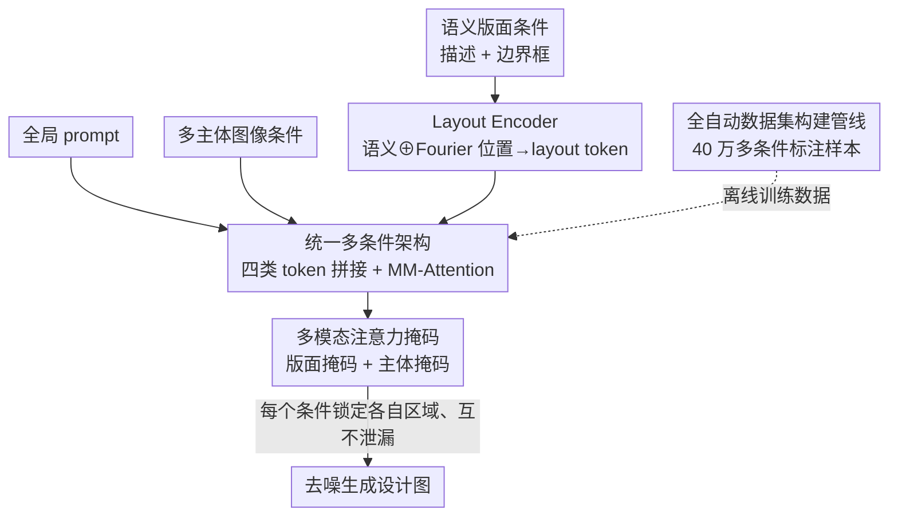

# CreatiDesign: A Unified Multi-Conditional Diffusion Transformer for Creative Graphic Design

**会议**: ICLR2026  
**OpenReview**: [https://openreview.net/forum?id=Wtda8HpVp2](https://openreview.net/forum?id=Wtda8HpVp2)  
**代码**: 待确认  
**领域**: 扩散模型 / 图像生成  
**关键词**: 多条件可控生成、扩散 Transformer、图形设计、注意力掩码、数据集构建  

## 一句话总结
CreatiDesign 在 FLUX.1-dev 基础上仅加 4.1% 参数，把「主体图像 + 语义版面（描述+框）+ 全局 prompt」三类异质条件统一编码进同一 token 序列、用多模态注意力联合交互，再用一套注意力掩码让每个条件只精确控制自己那块画布区域且互不串味，配合一条全自动管线造出 40 万样本数据集，从而在主体保真、版面对齐、整体协调三方面同时超越单条件专家模型和已有多条件模型。

## 研究背景与动机
**领域现状**：用扩散模型自动做图形设计（海报、广告、社媒图）正受到越来越多关注。一张设计稿通常由三类异质元素拼成：① 主元素（产品主体，以图像给出，是视觉焦点）；② 次元素（装饰物体，以「语义描述 + 边界框」的版面形式给出）；③ 文本元素（标语、品名，同样以版面形式给出位置与内容）。这要求模型同时满足语义保真和空间保真。

**现有痛点**：主流方法分两类，都顾此失彼。单条件专家模型里，图像驱动模型（如 FLUX-Fill、UNO）只擅长对齐主体却跟不住版面，版面驱动模型（如 BizGen、CreatiLayout）只会按描述和框排布次元素/文本却保不住主体身份；而已有的多条件模型（如 OmniGen、Gemini2.0）虽然什么条件都收，却对每个子条件缺乏细粒度控制，常出现主体错位、文字渲染错误、元素互相干扰、整体不协调。

**核心矛盾**：根因在于「子条件没有被精确绑定到它对应的图像区域」，加上「子条件之间存在语义泄漏（semantic leakage）」——一个版面 token 会去影响不属于它的画布区域，主体特征也会被无关的 prompt/版面 token 污染，于是控制力被稀释。同时，带细粒度多条件标注的图形设计数据集本就稀缺，模型连学的机会都没有。

**本文目标**：拆成三个子问题——(1) 如何用统一方式整合多种异质条件；(2) 如何在保证每个条件细粒度可控的同时维持整体协调；(3) 如何自动化地大规模构建多元素图形设计数据集。

**切入角度**：作者不另起炉灶，而是尽量保留 MM-DiT 文生图模型的强生成力，只做「最小架构改动」把多条件能力接进去；可控性问题则不靠新增网络，而是直接在已有的多模态注意力上加掩码来约束交互范围。

**核心 idea**：把所有条件编码进同一 token 空间走原生多模态注意力实现统一控制，再用「版面掩码 + 主体掩码」把每个条件的注意力交互锁死在它该管的区域里，从而做到既统一又精确还协调。

## 方法详解

### 整体框架
CreatiDesign 的任务形式化为 $I_g = f(P, I_s, L)$：输入全局 prompt $P$、多主体图像条件 $I_s$、语义版面条件 $L=\{l_i=(d_i,b_i)\}_{i=0}^{n}$（每个版面元素由语义描述 $d_i$ 和边界框 $b_i$ 组成，类别可为次视觉元素或文本元素），输出设计图 $I_g$。整条 pipeline 分两侧：**模型侧**把四类信息（prompt、噪声图、主体图像、语义版面）各自编码成 token，拼接后送进 N 个 CreatiDesign MM-DiT Block 联合去噪，块内用多模态注意力交互、并以注意力掩码约束交互范围；**数据侧**则用一条全自动管线造出训练数据。下图按模型侧的数据流给出鸟瞰（数据集管线作为离线供给单列）。

### 关键设计

**1. 统一多条件驱动架构：把异质条件塞进同一 token 空间，对底模零伤害**

针对「如何统一整合异质条件」这个痛点，作者沿用 MM-DiT（以 FLUX.1 为底）原本「文本 token $h_p$ + 图像 token $h_z$ 走 MM-Attention」的范式，只把条件 token 加进去而几乎不动结构。多主体图像条件先用背景色（如灰）padding，再用原生 VAE 编码、切 patch 得到主体 token $h_s$；噪声图照常得到 $h_z$；prompt 照常用 T5 得到 $h_p$。把 $h_p, h_z, h_s, h_l$ 沿 token 维拼接后送入 N 个 MM-DiT Block，每块做线性投影得 $Q_*,K_*,V_*=\text{Linear}(h_*)$，再做联合注意力

$$h_l', h_p', h_z', h_s' = \text{Attention}([Q_l,Q_p,Q_z,Q_s],[K_l,K_p,K_z,K_s],[V_l,V_p,V_z,V_s]).$$

关键的工程点有两处：其一，对版面 token $h_l$ 和主体 token $h_s$ 在线性层与 AdaLN 上挂 LoRA，只微调这部分以高效对齐新模态；其二，为避免噪声图与图像条件、prompt 与版面条件之间的位置编码冲突，对图像条件和版面 token 施加位置编码偏移（positional encoding shift）让它们在 token 空间里彼此分开。这样做的好处是底模的生成力被完整保留，整套多条件能力只是「外挂」上去——全程仅引入 491.5M 参数（FLUX 12B 的 4.1%）。

**2. Layout Encoder：把「描述 + 框」融成一个既懂语义又懂位置的 layout token**

次视觉元素和文本元素都以 $(d_i, b_i)$ 形式给出，但描述是语义、框是坐标，两者模态不同不能直接喂。作者用原生 T5 从描述 $d_i$ 抽语义特征 $h_i^d$，对边界框 $b_i$ 用 Fourier 位置编码得到空间特征 $h_i^b$，再沿特征维拼接后过一个 MLP（即 Layout Encoder）融成最终版面 token：

$$h_i^l = \text{MLP}(\text{Concat}(h_i^d, h_i^b)).$$

这样每个 layout token 同时携带「画什么」和「画在哪」。消融显示去掉 LE（w/o LE）时文本句准确率 Sen. Acc 从 78.30 暴跌到 12.13——说明把位置信息显式注入 token 是文本元素能被准确渲染到正确位置的前提，缺了它模型几乎无法把文字放对。

**3. 多模态注意力掩码：让每个条件只管自己那块画布、互不串味**

这是解决「细粒度可控 + 整体协调」的核心。作者把可控性退化归因为「子条件没绑定到对应区域 + 子条件间语义泄漏」，于是在 MM-Attention 里加两张掩码。**版面注意力掩码（LAM）**：每个版面 token $h_i^l$ 只允许与其边界框 $b_i$ 内的图像 token $h_i^z$ 互相注意，从而把空间控制力锁定到目标区域；同时屏蔽版面 token 之间、版面 token 与主体 token、版面 token 与 prompt token 的交互，防止语义泄漏、让每个版面元素保持自己的特征。**主体注意力掩码（SAM）**：从用户给的多主体图像里提取每个主体的空间位置形成掩码，主体 token $h_i^s$ 只与其掩码区域内的图像 token $h_i^z$ 双向交互实现精确注入；并屏蔽它与版面、prompt、以及区域外图像 token 的交互，保住主体的完整身份。消融印证了二者各司其职：去掉 LAM 时文本句准确率从 56.90 跌到 20.16、空间对齐从 78.94 跌到 66.94（元素放错位、版面区域互相混淆）；去掉 SAM 则主体一致性退化（钟面数字错、爆米花颜色变），出现主体细节漂移。

**4. 全自动数据集构建管线：四步造出 40 万张带多条件标注的设计图**

带细粒度多条件标注的图形设计数据太稀缺，作者干脆自己造。管线四步：① **设计主题生成**——基于一个覆盖家具/食品/服饰等常见品类的设计关键词库，让 LLM（如 GPT-4）扮演专业设计师，产出含主元素/次元素/文本元素描述的设计主题；② **文本图层渲染**——按 Hierarchical Layout Generation（HLG）范式生成文本元素的版面协议和背景描述，再用渲染引擎把协议转成带精确定位前景文字的 RGBA 图；③ **基于前景的图像生成**——借鉴 LayerDiffuse，在 FLUX.1-dev 上加 foreground-LoRA 与 background-LoRA 并用 attention sharing，把 RGBA 文本图层当前景、按描述生成背景，无缝合成；④ **实体标注与过滤**——用 GroundingSAM2 拿到所有实体的框和分割掩码，再用 VLM 为每个实体生成细粒度描述，把实体分为主/次视觉元素：主元素聚合成多主体图像条件，次元素 + 文本元素构成语义版面条件。最终得到 40 万训练样本，并另建 1000 条精挑样本的 benchmark 用于评测。

### 损失函数 / 训练策略
在 FLUX.1-dev 上用 LoRA（rank 256）微调，新增 491.5M 参数（占 FLUX 12B 的 4.1%）。AdamW 优化器、固定学习率 1e-4，batch size 8，在 8 张 H20-96G 上训练 100k 步约 4 天。采用分辨率分桶支持可变尺寸；图像条件设为目标图一半大小，每条版面描述上限 30 token、每图最多 10 个版面。

## 实验关键数据

### 主实验
benchmark 含 1000 样本，从三方面评估：**多主体保真**（CLIP-I、DINO-I，以及把各主体 DINO 连乘得到的 M-DINO——比取平均更敏感于任一主体的失败，是更严格的保真度量）、**语义版面对齐**（次元素的空间/颜色/文本/形状属性由 VLM 以 VQA 方式打分；文本元素用 PaddleOCR 算句准确率 Sen. Acc、归一化编辑距离 NED、IoU 空间分）、**图像质量**（IR Score、PickScore）。

| 方法（类型） | M-DINO（主体）↑ | Sen. Acc（文本）↑ | 版面空间↑ | Avg.↑ |
|--------|------|------|------|------|
| MS-Diffusion（图像驱动） | 44.34 | 0.00 | 49.54 | 36.23 |
| FLUX.1-Fill（图像驱动） | 69.05 | 12.07 | 67.55 | 52.24 |
| BizGen（版面驱动） | 22.93 | 75.89 | 79.84 | 58.53 |
| Gemini2.0（多条件） | 29.68 | 71.38 | 59.41 | 50.78 |
| FLUX.1-dev（底模） | 17.76 | 57.95 | 60.02 | 47.50 |
| **CreatiDesign** | **65.75** | **78.30** | **78.94** | **69.28** |

可以看到专家模型只在自己擅长的维度高、其余塌方（如 FLUX.1-Fill 主体好但文本差，BizGen 文本好但主体差），而 CreatiDesign 在主体、文本、空间三处同时进第一梯队，平均分 69.28 远超次优的 BizGen（58.53）。相对底模 FLUX.1-dev，M-DINO +47.99、Sen. Acc +20.35、平均 +21.78，且这是只加 4.1% 参数换来的。

### 消融实验

| 配置 | M-DINO | 版面空间 | Sen. Acc | 说明 |
|------|--------|----------|----------|------|
| CreatiDesign（Full） | 65.75 | 78.94 | 78.30 | 完整模型 |
| w/o LE | 62.96 | 80.99 | 12.13 | 去 Layout Encoder，文本几乎渲染失败 |
| w/o LAM | 64.28 | 66.94 | 20.16 | 去版面掩码，元素错位、区域混淆 |
| w/o SAM | 64.14 | 75.99 | 76.84 | 去主体掩码，主体一致性退化 |

### 关键发现
- **Layout Encoder 对文本是命门**：去掉后 Sen. Acc 从 78.30 跌到 12.13，说明把 Fourier 位置特征显式融进 layout token 是文字「放对位置、写对内容」的关键。
- **版面掩码主要管空间对齐**：去掉 LAM 后空间分 78.94→66.94、文本 78.30→20.16，验证「锁定区域 + 阻断版面间泄漏」对细粒度排布的作用。
- **主体掩码主要管身份一致**：去掉 SAM 的数值跌幅最小，但定性上主体细节漂移明显（钟面数字、爆米花颜色），是数值不敏感、视觉敏感的一类退化。
- **额外彩蛋**：CreatiDesign 无需重训即可扩展到循环编辑——把上一张生成图当新图像条件、配合掩码即可逐步插主体/改文字（如海报副标题 "AGE OF ULTRON"→插蜘蛛侠→"INFINITY WAR"），在非编辑区保持一致，而 Gemini2.0 在序列编辑中常误改未编辑区域。

## 亮点与洞察
- **「不改网络、只加掩码」实现细粒度可控**：把可控性问题归结为「注意力交互范围」而非「再加一个控制网络」，用两张掩码精确约束每个条件的作用域，思路干净且几乎零额外参数，可迁移到任何 MM-DiT 架构的多条件控制场景。
- **统一 token 空间 + 位置编码偏移**：异质条件不分模态地拼进同一序列走原生 MM-Attention，靠位置编码偏移避免冲突，让底模生成力被最大限度保留，这是「4.1% 参数博取大幅提升」的根本。
- **M-DINO 这个度量本身值得借鉴**：用连乘而非平均聚合多主体相似度，对「任一主体失败」更敏感，更贴近图形设计「一个主体崩了整张就废」的真实需求。
- **数据闭环可复用**：LLM 出主题 → HLG 排版面 → LayerDiffuse 前景/背景双 LoRA 合成 → GroundingSAM2+VLM 反标注，这套「先渲染再反标」的自动管线给「缺标注的可控生成任务」提供了造数据的通用范式。

## 局限与展望
- **作者承认的局限**：面部细节保真和密集文本生成仍吃力，因为当前数据集没针对这两类场景定制；改进方向是增强数据集或模型级改进。
- **自己发现的局限**：① 评测的 benchmark 与训练数据来自同一条合成管线（都基于 FLUX/LayerDiffuse 渲染），存在分布同源风险，对真实人工设计稿的泛化未充分验证；② 每图版面上限 10、描述上限 30 token，面对超复杂排版（大量小文字、密集图标）可能受限；③ 掩码依赖准确的主体位置/边界框先验，框标得不准时控制力会打折。
- **改进思路**：补充真实设计稿与含人脸/密集文本的样本；探索无需精确框的弱定位掩码；把循环编辑能力做成显式可控的交互式编辑接口。

## 相关工作与启发
- **vs 单条件专家模型（FLUX-Fill / UNO 图像驱动、BizGen / CreatiLayout 版面驱动）**：它们只在自己擅长的条件上强、换条件就塌（FLUX-Fill 主体 69.05 但文本 12.07，BizGen 文本 75.89 但主体 22.93）；CreatiDesign 用统一架构同时收下两类条件，三维度均衡领先。
- **vs 已有多条件模型（OmniGen / Gemini2.0 / 各类 unified 方法）**：它们什么条件都收但对子条件缺乏细粒度控制、易串味；CreatiDesign 的关键差别是用注意力掩码把每个条件的作用域锁死，从而把「统一」和「精确」同时拿到。
- **vs 底模 FLUX.1-dev**：仅加 4.1% LoRA 参数就把平均分从 47.50 提到 69.28，证明「保留底模 + 外挂条件 + 掩码约束」是高性价比的可控生成改造路径。

## 评分
- 新颖性: ⭐⭐⭐⭐ 架构改动小但「掩码约束注意力作用域」的可控思路清晰有效，数据管线也成体系；单点创新不算颠覆但组合扎实。
- 实验充分度: ⭐⭐⭐⭐ 对比 10+ 基线、三维度指标 + 消融 + 用户研究 + 编辑扩展，较完整；同源 benchmark 是小瑕疵。
- 写作质量: ⭐⭐⭐⭐ 动机用对比图讲得很清楚，方法与消融一一对应，结构工整。
- 价值: ⭐⭐⭐⭐ 直接面向图形设计落地，40 万数据集 + benchmark + 4.1% 参数低成本方案对社区实用价值高。

<!-- RELATED:START -->

## 相关论文

- [\[ICCV 2025\] UniCombine: Unified Multi-Conditional Combination with Diffusion Transformer](../../ICCV2025/image_generation/unicombine_unified_multi-conditional_combination_with_diffusion_transformer.md)
- [\[CVPR 2026\] PSDesigner: Automated Graphic Design with a Human-Like Creative Workflow](../../CVPR2026/image_generation/psdesigner_automated_graphic_design_with_a_human-like_creative_workflow.md)
- [\[ICLR 2026\] ContextGen: Contextual Layout Anchoring for Identity-Consistent Multi-Instance Generation](contextgen_contextual_layout_anchoring_for_identity-consistent_multi-instance_ge.md)
- [\[CVPR 2025\] From Elements to Design: A Layered Approach for Automatic Graphic Design Composition](../../CVPR2025/image_generation/from_elements_to_design_a_layered_approach_for_automatic_graphic_design_composit.md)
- [\[ICLR 2026\] CineTrans: Learning to Generate Videos with Cinematic Transitions via Masked Diffusion Models](cinetrans_learning_to_generate_videos_with_cinematic_transitions_via_masked_diff.md)

<!-- RELATED:END -->
