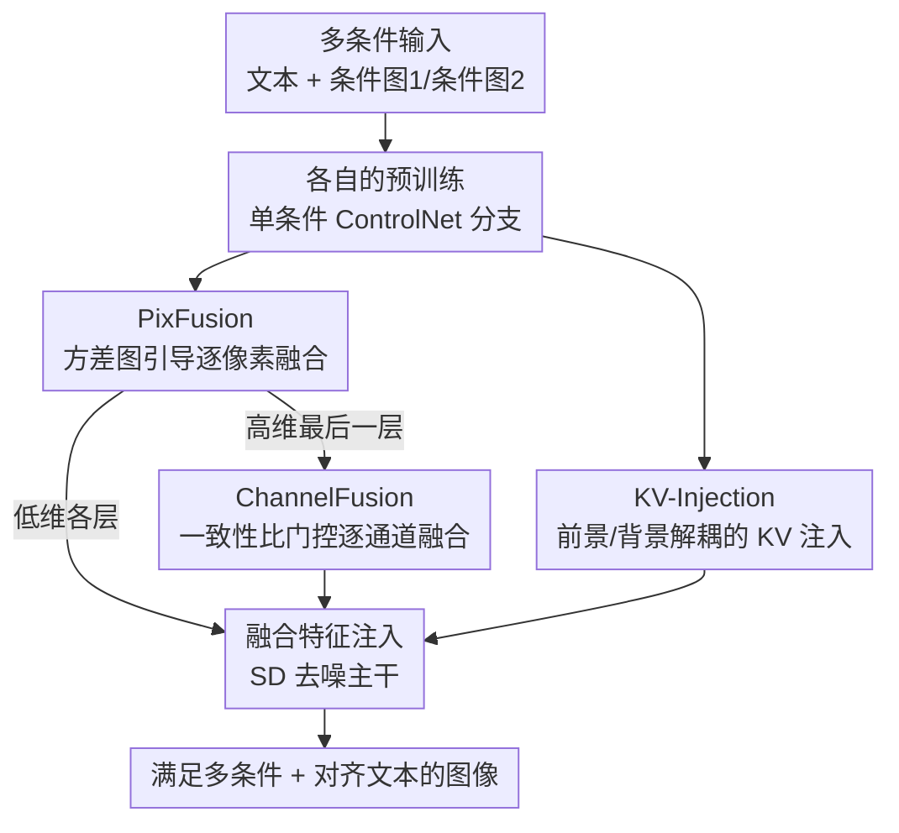

# Cross-ControlNet: Training-Free Fusion of Multiple Conditions for Text-to-Image Generation

**会议**: ICLR 2026  
**OpenReview**: [https://openreview.net/forum?id=89j1hUxOiF](https://openreview.net/forum?id=89j1hUxOiF)  
**代码**: 无  
**领域**: 扩散模型 / 可控图像生成  
**关键词**: 多条件可控生成, ControlNet, 免训练融合, 特征方差, KV 注入

## 一句话总结
本文提出 Cross-ControlNet，一个**完全免训练**的多条件文生图框架：利用不同 ControlNet 分支中间特征「空间天然对齐 + 条件强度可由方差度量」两个观察，用 PixFusion（像素级方差引导融合）、ChannelFusion（通道级一致性比门控融合）和 KV-Injection（前景/背景解耦的 key-value 注入）三个模块在推理时融合多路控制信号，在冲突条件下 mIoU 比最强免训练基线提升约 5.4%，并可零成本迁移到 DiT 架构的 FLUX。

## 研究背景与动机
**领域现状**：文生图扩散模型（SD、SDXL 等）已能根据文本生成高质量图像，但文本难以精确控制空间布局。ControlNet、T2I-Adapter 通过复制 UNet 编码器、把边缘/分割/姿态等空间条件注入预训练 T2I 模型，解决了**单一模态**下的可控生成。

**现有痛点**：一旦要同时满足**多个**空间条件，不同模态之间天然不平衡，传统做法要么在大规模配对数据上重训一个统一多模态模型（成本高、加新模态几乎都要重训、还容易忽略弱控制信号），要么像 MaxFusion 那样免训练地融合多个现成 ControlNet 分支。但 MaxFusion 的融合策略容易被去噪过程（尤其早期采样步）的固有噪声扰乱，又因为没有显式建模空间条件之间的关系，在控制信号复杂或部分冲突时常常生成不和谐的图像。

**核心矛盾**：希望「免训练复用现成 ControlNet」与「在多条件、尤其是相互冲突的条件下仍能稳定、忠实地遵从每一路控制」之间存在矛盾——简单平均会稀释关键信息，固定阈值的逐像素融合在高维特征里会失效，而冲突条件会让前景/背景的角色相互污染。

**本文目标**：在不做任何训练/权重调参的前提下，把多个预训练单条件 ControlNet 的中间特征自适应融合，既处理**互补条件**（不同控制强化同一场景结构），也处理**冲突条件**（控制信号给出矛盾的空间线索）。

**切入角度**：作者给出两个关键观察——（1）不同 ControlNet 分支在 SD 相同空间位置产生的特征**天然空间对齐**（因为都以逐元素相加方式注入同一参考系，无需额外配准）；（2）每路条件的**相对强度可由方差量化**：空间级方差图标出条件影响更强的区域，通道级方差向量标出响应更强的通道。

**核心 idea**：用「方差度量条件强度 + 高斯平滑抗噪」在**空间维**和**通道维**两个层面自适应选择/融合特征，再用「文本注意力派生的前景/背景掩码 + 跨分支 KV 注入」解耦冲突线索，从而把多路控制忠实地落到图上——全程不训练。

## 方法详解

### 整体框架
Cross-ControlNet 的输入是一段文本提示和多张空间条件图（如分割图 + 姿态图、HED + 深度等），每张条件图各喂给一个对应的预训练单条件 ControlNet 分支，输出是同时满足这些条件、且与文本对齐的图像。整体只在**推理阶段**对 ControlNet 分支的中间特征做手术，不引入任何可训练参数。

每个去噪步里，两条（或多条）ControlNet 分支在每一中间层产生特征 $f_1, f_2$，先经过一个**鲁棒特征融合**模块得到融合特征 $\hat f$ 再注入 SD 主干：在大部分层用 PixFusion（逐像素、方差图引导），仅在最后一层用 ChannelFusion（逐通道、一致性比门控），这样既保住低维层的空间判别力，又规避高维层的阈值退化。与此并行，从第 5 个去噪步起，KV-Injection 在 ControlNet 的自注意力层里，借文本交叉注意力派生的前景掩码 $M^f$，把前景分支的 key/value 注入背景分支，强行把前景与背景的角色分开，化解冲突。三者协同：PixFusion/ChannelFusion 负责「在哪、用谁的特征」，KV-Injection 负责「前景背景别打架」。

### 关键设计

**1. PixFusion：用高斯平滑的空间方差图，逐像素挑出更该信任的那一路条件**

直接对两路特征取平均，会在「左半边由条件 A 主导、右半边由条件 B 主导」时把关键信息互相稀释，所以需要按局部条件强度给不同空间位置分配不同优先级。作者用空间级方差图 $\sigma_i^2 \in \mathbb{R}^{H\times W}$ 度量强度，并归一化成相对标准差 $\hat\sigma_i^{(j,k)} = \sigma_i^{(j,k)} / \sum_{(p,q)\in\Omega}\sigma_i^{(p,q)}$ 使不同模态可比。但早期采样步隐空间含强高频噪声，直接比方差图会被噪声污染，因此先用固定高斯核 $G_{\kappa_1}$ 平滑再取最大：$\hat f^{(j,k)} = f_{i^\star}^{(j,k)},\ i^\star = \arg\max_i [G_{\kappa_1} * \hat\sigma_i]^{(j,k)}$，即用邻域平均而非单像素来决策。当两路模态描述同一物体（强相关）时，硬选一路并不理想，于是再加一条：若位置相关性 $\rho^{(j,k)} > \delta_1$ 就改用均值融合 $\hat f^{(j,k)} = (f_1^{(j,k)} + f_2^{(j,k)})/2$；相关性同样用高斯平滑后的中心化特征余弦计算以抗噪。这样 PixFusion 在冲突时自动取强者、在重叠时取共识，并靠高斯平滑显著提升早期去噪的鲁棒性——这正是 MaxFusion 缺失的抗噪能力。

**2. ChannelFusion：用通道级一致性比做硬选/软融的门控，绕开高维阈值退化**

PixFusion 抗噪强，却依赖固定阈值，而固定阈值在高维特征上会发生作者称之为「阈值退化」的现象：对 i.i.d. 高斯分量的高维随机向量 $X,Y\in\mathbb{R}^d$，余弦相似度满足 $\mathbb{E}[\rho]=0,\ \mathrm{Var}(\rho)=1/d$，维度越高相似度越向 0 集中，固定阈值很快失去判别力（图 3a 实测达到阈值的特征比例随深度单调下降）。ChannelFusion 改在**通道维**操作：对第 $c$ 个通道，由两路标准差定义一致性比 $R_c = 1 - \frac{|\hat\sigma_{1,c} - \hat\sigma_{2,c}|}{\max\{\hat\sigma_{1,c},\hat\sigma_{2,c}\}} \in [0,1]$。当 $R_c < \delta_2$（两路强度差异大）时**硬选**强度更大的那一路 $\hat f_c = f_{i^\star,c},\ i^\star=\arg\max_i \hat\sigma_{i,c}$；当 $R_c \ge \delta_2$ 时**软融**，按精度加权 $\hat f_c = (\Lambda_{1,c}+\Lambda_{2,c})^{-1}(\Lambda_{1,c}\hat f_{1,c} + \Lambda_{2,c}\hat f_{2,c})$，各向同性下取 $\lambda_{i,c} = \hat\sigma_{i,c}/\max(\hat\sigma_{1,c},\hat\sigma_{2,c})$，即按特征强度比例加权。因为换到通道维、不再依赖会随维度坍缩的逐像素相似度，ChannelFusion 在高维层最大化信息保留，正好补 PixFusion 的短板；实践中只在最后一个（高维）ControlNet 层用它，其余层仍用 PixFusion。

**3. KV-Injection：借文本注意力掩码，前景/背景解耦地注入 key-value，化解冲突条件**

即便有了两级融合，冲突的多模态信号仍会让前景与背景的角色互相干扰，使空间条件含糊。作者观察到生成图像大多天然有「前景物体 + 背景场景」的结构分解，于是把前景、背景当作两个独立目标处理。利用文本交叉注意力图主要捕获形状/结构线索这一性质（沿用 P2P 实践），在去噪步聚合分辨率 $256\times 77$ 的交叉注意力得到 77 个 $16\times16$ 掩码，挑出与前景物体语义最相关 token 的注意力图，后处理得到前景掩码 $M^f$ 与互补背景掩码 $M^b$。随后在 ControlNet 自注意力层里做区域隔离注入：把背景分支的 KV 与前景分支的 KV 拼接 $K^+=[K_2\oplus K_1],\ V^+=[V_2\oplus V_1]$，并分别在前景区 $\mathrm{Attn}^f=\mathrm{softmax}(\frac{Q_2 K_1^\top}{\sqrt d}+\log M^f)V_1$、背景区 $\mathrm{Attn}^b=\mathrm{softmax}(\frac{Q_2 K^{+\top}}{\sqrt d}+\log M^+)V^+$ 各取所需，最终 $\widehat{\mathrm{Attn}} = M^f\cdot\mathrm{Attn}^f + (1-M^f)\cdot\mathrm{Attn}^b$，确保每个区域只从自己指定的特征域取信息。注入从第 5 个去噪步起、对所有自注意力层生效——让早期先建立粗结构、再用注入引导更细的前景/背景对齐，从而忠实落实每一路条件、提升画质与一致性。

### 损失函数 / 训练策略
本方法**完全免训练**，无任何损失函数或微调。关键超参：相关性阈值 $\delta_1$ 与一致性比阈值 $\delta_2$ 统一取 $\delta=0.7$；$G_{\kappa_1},G_{\kappa_2}$ 为归一化的 $3\times3$ 高斯核；ChannelFusion 仅用于最后一层 ControlNet，其余层用 PixFusion；KV-Injection 从去噪步 5、ControlNet 第 0 层起注入。骨干为 Stable Diffusion v1.5，UniPC 采样 50 步，CFG=7.5，单张 RTX 3090 即可运行。

## 实验关键数据

### 主实验
冲突条件（CLIP↑ 文本对齐，MSE↓、mIoU↑ 条件保真），在 Pose+Seg / Pose+Depth 两组：

| 方法 | 免训练 | CLIP↑(Pose,Seg) | MSE-S↓ | mIoU-P↑ | CLIP↑(Pose,Depth) | MSE-D↓ | mIoU-P↑ |
|------|:--:|------|------|------|------|------|------|
| Multi-ControlNet | ✓ | 0.2999 | 0.2282 | 0.3145 | 0.2978 | 0.0625 | 0.3150 |
| AnyControl | ✗ | 0.2853 | 0.2522 | 0.2042 | 0.2638 | 0.0338 | 0.1519 |
| MaxFusion | ✓ | 0.2945 | 0.2016 | 0.3528 | 0.2870 | 0.0498 | 0.3555 |
| **Cross-ControlNet** | ✓ | 0.2978 | **0.1983** | **0.3719** | 0.2893 | **0.0456** | **0.3671** |

在条件保真（MSE/mIoU）上全面领先所有多模态方法，同时文本对齐（CLIP）保持竞争力。mIoU 相对最强免训练基线 MaxFusion 由 0.3528 → 0.3719，约 +5.4%。

互补条件（HED+Seg，SSIM↑/NIQE↓/CLIP↑/MSE↓）：

| 方法 | SSIM↑ | NIQE↓ | CLIP↑ | MSE-H↓ | MSE-S↓ |
|------|------|------|------|------|------|
| MaxFusion | 0.2382 | 3.2499 | 0.2992 | 0.0766 | 0.1135 |
| AnyControl | 0.2251 | 4.8219 | 0.2989 | 0.0554 | 0.1046 |
| **Ours** | **0.2404** | **3.2434** | **0.3005** | 0.0736 | **0.1008** |

虽主打冲突场景，但互补条件下在条件一致性与文本对齐上也整体最优。

### 消融实验
三模块在冲突条件下逐步叠加（取 Pose,Seg / Pose,Depth）：

| 配置 | MSE-S↓ | mIoU-P↑(Seg) | MSE-D↓ | mIoU-P↑(Depth) | 说明 |
|------|------|------|------|------|------|
| MaxFusion（基线） | 0.2016 | 0.3528 | 0.0498 | 0.3555 | 最强免训练基线 |
| PixFusion | 0.2004 | 0.3610 | 0.0495 | 0.3583 | 仅像素级融合已超基线 |
| +ChannelFusion | 0.2009 | 0.3648 | 0.0476 | 0.3618 | 补高维通道融合 |
| +KV-Injection（Full） | 0.1983 | 0.3719 | 0.0456 | 0.3671 | 完整模型，保真最高 |

### 关键发现
- **每个模块都在正贡献**：单独 PixFusion 就已超过 MaxFusion；ChannelFusion 主要拉高 mIoU（通道融合保住高维信息）；KV-Injection 进一步降 MSE、升 mIoU，对冲突条件的最终保真贡献明显。
- **阈值 $\delta$ 敏感性**：$\delta=0$ 退化为朴素平均、条件被稀释；约 $\delta=0.6$ 起开始忠实于条件但仍有伪影；$\delta=0.8$ 达到保真与画质最佳权衡；$\delta=1.0$ 时人物与背景边界变模糊。综合取 $\delta=0.7$。
- **KV-Injection 插入策略**：起始时间步=5、起始层=0 最优——步 0 注入会扰动早期去噪、损害感知分数，注入过晚则削弱可控性，起始层太深会削弱前景/背景传播。
- **泛化性**：无需额外训练即可迁移到 DiT 架构的 FLUX，说明方法不绑定 UNet 骨干。

## 亮点与洞察
- **「方差=条件强度」这把尺子**：把多模态融合的核心难题（该信谁）转化为可直接计算的空间/通道方差，简单、可解释、零训练，是全方法的地基。
- **空间维 + 通道维分而治之**：用阈值退化理论（$\mathrm{Var}(\rho)=1/d$）说清为什么逐像素固定阈值在高维必然失效，再用通道级一致性比门控对症下药——把「为什么换维度」讲成了有理论依据的设计，而非拍脑袋。
- **高斯平滑抗早期噪声**：针对扩散早期高频噪声这一 MaxFusion 软肋，用固定高斯核平滑方差图/相关图，思路朴素但切中要害。
- **前景/背景解耦的 KV 注入**：把图像编辑里「跨图 KV 注入保持一致性」的技巧迁移到「跨 ControlNet 分支解冲突」，并用文本交叉注意力自动产掩码，可迁移到任何需要区域隔离控制的生成任务。

## 局限与展望
- **依赖现成单条件 ControlNet**：没有对应预训练 ControlNet 的新模态无法直接支持。
- **多分支带来开销**：组合多个 ControlNet 增加显存与推理延迟，在超高分辨率或实时场景受限。
- **极端冲突仍有瑕疵**：相互完全不兼容的约束下仍可能出现前景边界伪影或颜色渗漏。
- 作者展望把机制扩展到时空域（视频合成、3D 场景生成）。

## 相关工作与启发
- **vs MaxFusion（免训练融合）**：同为免训练融合多 ControlNet，但 MaxFusion 不抗去噪早期噪声、也不显式建模条件间关系；本文用高斯平滑抗噪、用方差度量强度、并用 KV-Injection 显式解耦前景背景，故在冲突条件下保真更高。
- **vs AnyControl / Uni-ControlNet（训练统一多模态）**：它们需在大规模配对数据上训练、加新模态要重训；本文零训练复用现成分支，灵活性更强，且在多数指标上反超。
- **vs Prompt-to-Prompt / MasaCtrl（免训练编辑里的 KV/注意力操控）**：这些方法靠操控 Q/K 保持编辑一致性；本文把跨图 KV 注入的思想迁移到跨 ControlNet 分支，目标从「编辑一致」变为「多条件解冲突」。

## 评分
- 新颖性: ⭐⭐⭐⭐ 把方差度量、抗噪平滑、通道级门控、跨分支 KV 注入组合成一个完全免训练的多条件框架，观察扎实、设计对症。
- 实验充分度: ⭐⭐⭐⭐ 自建 2000 张冲突/互补基准，冲突+互补双场景、逐模块消融、阈值与注入策略分析齐全；但缺公开标准基准、且无开源代码。
- 写作质量: ⭐⭐⭐⭐ 观察→动机→三模块逻辑清晰，公式与阈值退化分析到位。
- 价值: ⭐⭐⭐⭐ 免训练即插即用、可迁移到 FLUX，对多条件可控生成实用性高。

<!-- RELATED:START -->

## 相关论文

- [\[ICLR 2026\] OmniText: A Training-Free Generalist for Controllable Text-Image Manipulation](omnitext_a_training-free_generalist_for_controllable_text-image_manipulation.md)
- [\[AAAI 2026\] Infinite-Story: A Training-Free Consistent Text-to-Image Generation](../../AAAI2026/image_generation/infinite-story_a_training-free_consistent_text-to-image_gene.md)
- [\[CVPR 2026\] DynFusion: Rethinking Condition Fusion for Adaptive Multi-Conditional Text-to-Image Generation](../../CVPR2026/image_generation/dynfusion_rethinking_condition_fusion_for_adaptive_multi-conditional_text-to-ima.md)
- [\[ICLR 2026\] Training-Free Reward-Guided Image Editing via Trajectory Optimal Control](training-free_reward-guided_image_editing_via_trajectory_optimal_control.md)
- [\[CVPR 2026\] CRAFT-LoRA: Content-Style Personalization via Rank-Constrained Adaptation and Training-Free Fusion](../../CVPR2026/image_generation/craft-lora_content-style_personalization_via_rank-constrained_adaptation_and_tra.md)

<!-- RELATED:END -->
