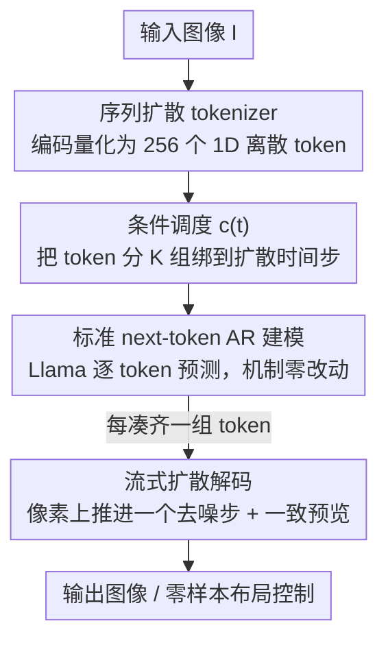

# D-AR: Diffusion via Autoregressive Models

**会议**: ICLR 2026  
**OpenReview**: [https://openreview.net/forum?id=IhuvSLIsUN](https://openreview.net/forum?id=IhuvSLIsUN)  
**代码**: https://github.com/showlab/D-AR  
**领域**: 图像生成 / 扩散模型 / 自回归生成  
**关键词**: 自回归视觉生成, 扩散模型, 序列扩散 tokenizer, next-token prediction, ImageNet 类条件生成

## 一句话总结
D-AR 设计了一个「序列扩散 tokenizer」，把图像扩散过程重新编码成一串从粗到细的离散 token，让一个原封不动的 Llama 解码器用最标准的 next-token prediction 就能逐 token 生成图像、并在生成过程中实时解码出对应的扩散去噪步骤，在 ImageNet 256×256 上用 775M / 1.4B 参数拿到 2.09 / 2.00 FID。

## 研究背景与动机

**领域现状**：视觉生成目前有两大主流范式。一是扩散模型（DiT、SiT、Stable Diffusion），从噪声出发反复去噪，擅长建模连续像素信号、出图质量高；二是自回归（AR）模型，沿用 LLM 的 next-token prediction，可扩展性强、训练/推理基础设施成熟（KV cache、vLLM 等）。

**现有痛点**：两条路各有硬伤。扩散模型采样需要大量密集的串行去噪步，架构上也很难和 LLM 无缝拼到一起，限制了统一多模态系统的潜力。AR 模型则卡在「图像不是天然的一维线性序列」上——为了给图像定义一个 token 顺序，已有工作（VAR 的尺度顺序、RandAR 的随机顺序、RAR 等）几乎都要**魔改 AR 的核心机制**（改 causal mask、改训练/推理逻辑），偏离了纯粹的 next-token prediction，也就丢掉了和 LLM 生态对齐的最大好处。

**核心矛盾**：想要「扩散的画质」又想要「AR 的简洁与可扩展」，但二者的数据形态天然冲突——扩散在连续像素上迭代，AR 要求离散、线性、有序的 token。已有的「AR+扩散」融合工作（MAR、CausalFusion、DART）大多在 AR 框架里塞进连续值输入输出，仍然改动了底层机制。

**本文目标**：在**完全不改动**标准 AR 机制（离散输入输出、causal mask、训练/推理逻辑全部照搬 Llama）的前提下，让 AR 的序列生成过程「等价于」在像素上跑一遍扩散去噪。

**切入角度**：作者的关键观察是——扩散过程本身就自带一个**从粗到细（coarse-to-fine）的时间顺序**：早期时间步从纯噪声出发，只需要低频的空间布局信息；后期时间步在较干净的图上补局部细节。如果能把「不同扩散步所需的条件」编码成 token 序列里**不同位置**的 token，那么这个序列就天然被扩散过程线性化了，正好喂给 AR。

**核心 idea**：用一个 tokenizer 把「扩散过程」编码成一串 coarse-to-fine 的离散 token（早 token 管粗布局、晚 token 管细节），再用一个纯粹的 Llama 做 next-token prediction——AR 每吐出一批 token，就能立刻解码成像素上对应的一个扩散去噪步。

## 方法详解

### 整体框架

D-AR（Diffusion via Autoregressive）整条管线只有两个部件：一个**序列扩散 tokenizer** 和一个**原版 Llama decoder-only AR 模型**。训练时分两步——先训 tokenizer，把图像编码成 256 个离散 token，并学会用这些 token 当条件、在像素上跑 8 步扩散重建出原图；再冻结 tokenizer，用它产出的 token 序列训 AR 模型做 next-token prediction。推理时反过来：Llama 根据类别标签一个个生成 token，每凑齐一组（32 个）token，tokenizer 的扩散解码器就立刻在像素上推进一个去噪步，token 全部生成完图像也就解码完了。

整个设计的精妙之处在于「token 序列 = 扩散过程的代理」：token 的**位置顺序**直接对应扩散的**时间步顺序**，所以 AR 的自左向右生成天生就是「从粗到细」的去噪，不需要给 AR 加任何视觉专属的归纳偏置。

### 关键设计

**1. 序列扩散 tokenizer：把扩散过程「翻译」成 coarse-to-fine 的 token 序列**

这是全文的地基，针对的就是「图像没有天然线性顺序」这个老大难。它像普通视觉 tokenizer 一样先用 transformer 编码器把图像和一组可学习 query token 一起处理，量化成 $z = [z_1, \dots, z_N]$（默认 $N=256$，码本大小 16384），但**编码阶段不强加任何顺序**。顺序是在解码端通过扩散「赋予」的：解码器是一个直接作用在原始像素 patch 上的扩散 transformer（DiT 风格，185M 参数，不需要额外 VAE），用 flow matching 的速度预测损失训练：

$$\ell_{fm} = \mathbb{E}_{t,x_0,x_1}\big[\|v_t - D_{FM}(x_t, t, c(t))\|_2^2\big], \quad x_t = t x_1 + (1-t)x_0,\; v_t = x_1 - x_0$$

其中 $x_0$ 是纯噪声、$x_1=I$ 是真实图像。关键在 $c(t)$：在时间步 $t$，解码器只能看到 token 序列里**特定位置**的那一组 token 当条件。由于扩散早期（$t\to 0$）只需要低频布局、后期（$t\to 1$）才补细节，被绑到早期时间步的 token 自然承载粗信息、晚期 token 承载细信息——于是序列就被扩散过程**线性化成了 coarse-to-fine 的顺序**，正好是 AR 喜欢的形态。这也是它和 DDT-Llama、Selftok 等「也用扩散 decoder 排序 token」工作的本质区别：那些方法用的是反向或递归顺序，无法把扩散步表达成顺序 AR 生成，也就不能用「部分生成的 token」解码出中间图。

**2. 条件调度 $c(t)$ 与分组：让 token 位置精确对齐扩散时间步**

光说「早 token 对应早扩散步」还不够，得有个具体机制把 token 序列和连续时间轴 $t\in[0,1]$ 绑死，这就是条件调度 $c(t)$。作者发现「一个时间步只配一个 token」效果差，于是把 $N$ 个 token 先切成 $K$ 组、每组 $N/K$ 个，再让组随时间推进：

$$c(t) = g_{\lceil t' \cdot K\rceil}, \quad t' = \frac{t}{t + (1/\beta)(1-t)}$$

$t'$ 是经过 $\beta$ 平移的时间步。$\beta=1$ 时各组均匀瓜分时间轴；$\beta>1$ 时早期扩散步分到更密的 token，实测对重建质量更好（默认采样 $K=8$、$\beta=2$，每组 32 个 token、8 步采样）。这个调度是「token 序列 ↔ 扩散过程」之间的桥：训练时随机采 $t$、按 $c(t)$ 取对应组算 loss；推理时按反向时间表 $t_i = \frac{i/K}{i/K + \beta(1-i/K)}$ 把每组恰好用一次，使采样步数直接等于条件组数 $K$。正是这个「位置→时间步」的确定性映射，让后面 AR 能边生成边解码。

**3. 原版 Llama 做 next-token prediction：AR 机制零改动**

拿到 coarse-to-fine 的离散 token 序列后，这一步刻意做到「无聊」——直接套标准自回归分解 $p_\theta(z) = \prod_{i=1}^N p_\theta(z_i \mid z_{<i})$，用普通交叉熵优化，模型就是原封不动的 Llama decoder-only（RMSNorm + SwiGLU），类别标签当一个前缀 token 注入，logits 上用 classifier-free guidance。唯一一处「视觉适配」也只是把 2D RoPE 换成 1D RoPE——因为 tokenizer 产出的 token 本就是一维的。离散输入输出、causal mask、KV cache、训练/推理逻辑全部和文本 LLM 一致。这正是 D-AR 的卖点：复杂度全被推进 tokenizer，AR 端干干净净，从而能直接复用 LLM 的成熟生态、也为未来「视觉生成原生融进多模态 LLM」铺路。

**4. 流式扩散解码：一致预览与零样本布局控制白送**

因为 token 位置严格对齐扩散时间步、且扩散解码器直接作用在像素上，D-AR 不破坏扩散的马尔可夫性，于是免费获得几个能力。其一是**流式像素解码**：AR 每生成够一组 token，就能立刻在像素上推进一个去噪步，无需等全部 token 生成完。其二是**一致预览**：利用扩散的 jump-estimate 性质 $\hat{x}_1 = (1-t)v_t + x_t$，在只生成了部分 token（如 12.5%、25%）时就能预测出最终图的粗样貌，且和最终结果一致——几乎零额外开销。其三是**零样本布局控制**：由于序列是被扩散线性化的、前缀 token 承载粗布局，固定若干前缀 token、换不同类别标签，就能在不微调的情况下生成「布局一致、内容不同」的图，前缀 token 给得越多布局控制越强。

### 损失函数 / 训练策略

tokenizer 在 raw pixel 上用少步扩散很难训，作者额外叠加感知与表征对齐损失加速收敛：

$$\ell_{tokenizer} = \ell_{fm} + \ell_{VQ} + \lambda_1 \ell_{LPIPS} + \lambda_2 \ell_{repa}, \quad \lambda_1=\lambda_2=0.5$$

刻意**不用对抗损失**（观察到不稳定和过饱和）。tokenizer 在 16×A100 上训约 5 天（210K 迭代、batch 1024）。AR 模型按 RandAR 配方训 300 epoch（AdamW，lr $4\times10^{-4}$，最后 50 epoch 线性退火到 $1\times10^{-5}$）。三个规模 D-AR-{L, XL, XXL} 分别 343M / 775M / 1.4B 参数。

## 实验关键数据

### 主实验

ImageNet 256×256 类条件生成，与各类范式对比（#params 仅算 AR 模型，tokenizer 额外 300M）：

| 类型 | 方法 | #params | FID↓ | IS↑ |
|------|------|---------|------|-----|
| diffusion | DiT-XL | 675M | 2.27 | 278.2 |
| diffusion | SiT-XL | 675M | 2.06 | 270.3 |
| tailored AR | VAR-d30 | 2.0B | 1.92 | 323.1 |
| vanilla AR | LlamaGen-XXL | 1.4B | 2.34 | 253.9 |
| vanilla AR | IBQ-XXL | 2.1B | 2.05 | 286.7 |
| vanilla AR | **D-AR-XL (ours)** | 775M | **2.09** | 298.4 |
| vanilla AR | **D-AR-XXL (ours)** | 1.4B | **2.00** | 300.6 |

在**严格 next-token-prediction 的 vanilla AR**赛道里，D-AR-XL 用 775M 就压过 LlamaGen-XXL（1.4B）、追平 IBQ-XXL（2.1B）；D-AR-XXL 拿到该赛道 SOTA 的 2.00 FID。相比 MAR / CausalFusion / DART 这些把连续值塞进 AR 的方案，D-AR 在保持纯 AR 机制的同时取得了有竞争力的结果。

### 消融实验

| 配置 | 关键指标 | 说明 |
|------|---------|------|
| tokenizer: ours (16384 码本) | rFID 1.58 | 优于 LlamaGen 同预算的 2.19 |
| tokenizer: ours (4096 码本) | rFID 1.84 | 小码本下仍优于 LlamaGen 3.02 |
| 采样 8 步 + Adams 2nd | rFID 1.52 | 默认配置，最佳 |
| 采样 4 步 / 16 步 | rFID 2.35 / 1.93 | 步数过少或过多都掉点 |
| coarse-to-fine 顺序 (D-AR-L) | gFID 2.44 | 默认顺序 |
| 反转为 fine-to-coarse | gFID 4.17 | 顺序反转后大幅恶化 |

### 关键发现
- **扩散诱导的 coarse-to-fine 顺序是 AR 建图的命门**：把 token 序列反转成 fine-to-coarse 后，即便搜遍 CFG 调度，最好也只有 4.17 FID，远逊于正序的 2.44——证明「好的顺序」比「好的架构」对视觉 AR 更关键。
- **tokenizer 是质量上限**：序列扩散 tokenizer 把 rFID 从 LlamaGen 的 2.19 压到 1.58，且对小码本（4096）更鲁棒，代价是参数更多（300M vs 72M，主要花在像素扩散解码器上）。
- **采样步数有甜区**：8 步 + Adams-Bashforth 二阶 solver 在不增加函数评估次数（NFE）的前提下出图更清晰，是质量/效率的最佳平衡。

## 亮点与洞察
- **把「顺序问题」外包给扩散**：视觉 AR 一直纠结怎么给图像定义 token 顺序，D-AR 的巧思是「不自己定，让扩散过程帮你线性化」——扩散天然的 coarse-to-fine 时间轴直接变成 token 顺序，既无需空间归纳偏置也无需魔改 AR。这个「用一个生成范式给另一个范式排序」的视角很可迁移。
- **复杂度搬家**：所有视觉特异性的设计都被关进 tokenizer，AR 端保持和文本 LLM 字节级一致。这意味着任何为 LLM 做的训练/推理优化（KV cache、投机解码、vLLM）都能直接拿来用，对「统一多模态生成」是很务实的路线。
- **免费的中间态可视化**：靠扩散的 jump-estimate，生成到一半就能给出和最终图一致的预览，且几乎零开销——这在交互式生成、早停、布局控制等场景都直接可用。

## 局限与展望
- **tokenizer 偏重**：300M 的 tokenizer（含像素扩散解码器）比 LlamaGen 的 72M 重不少，重建质量的提升是拿参数和算力换的，端到端的总开销并不低。
- **量化方式保守**：作者用的是最朴素的 VQ，明说更先进的量化（FSQ、LFQ 等）可能更好但留作未来工作，当前 rFID 未必触顶。
- **仅验证类条件生成**：实验只在 ImageNet 类条件上，文本到图像、更高分辨率、真正接进 LLM 做统一多模态生成都还停留在「展望」，零样本布局控制也只是定性展示。
- **采样仍需多步**：虽然只 8 步扩散解码，但相比一步生成仍有差距，且 tokenizer 的 8 步和 AR 的 256 token 是串行耦合的。

## 相关工作与启发
- **vs VAR / RandAR / RAR（tailored AR）**: 它们通过尺度顺序、随机顺序等给图像定义 token 序列，但都要改 AR 的 mask 或训练逻辑；D-AR 用扩散诱导顺序，AR 机制零改动，代价是引入一个重 tokenizer。
- **vs MAR / CausalFusion / DART（AR+扩散融合）**: 它们在 AR 框架里直接处理连续值输入输出，偏离了离散 next-token prediction；D-AR 坚持离散 token，把扩散完全收进 tokenizer 解码端，从而保住和 LLM 生态的对齐。
- **vs DDT-Llama / Selftok**: 同样用扩散解码器把 token 序列化，但用的是反向或递归顺序，无法把扩散步表达成顺序 AR 生成、也无法用部分 token 解码中间图；D-AR 的正向 coarse-to-fine 调度正是「流式解码 + 一致预览」的前提。

## 评分
- 新颖性: ⭐⭐⭐⭐⭐ 「让扩散过程给 AR token 排序」的视角新颖且自洽，把视觉 AR 的顺序难题转化成扩散的时间轴
- 实验充分度: ⭐⭐⭐⭐ ImageNet 上对比与消融扎实（尤其顺序反转消融很有说服力），但缺文本到图像、更高分辨率、真·多模态验证
- 写作质量: ⭐⭐⭐⭐⭐ 动机—方法—性质三段递进清晰，图 1/3 把抽象机制讲得直观
- 价值: ⭐⭐⭐⭐⭐ 为「视觉生成原生融入 LLM」提供了一条保持纯 AR 机制的务实路线，工程友好、可扩展性强

<!-- RELATED:START -->

## 相关论文

- [\[ICLR 2026\] Condition Errors Refinement in Autoregressive Image Generation with Diffusion Loss](condition_errors_refinement_in_autoregressive_image_generation_with_diffusion_lo.md)
- [\[ACL 2026\] From AR to Diffusion: Efficiently Adapting Large Language Models with Strictly Causal and Elastic Horizons](../../ACL2026/image_generation/from_ar_to_diffusion_efficiently_adapting_large_language_models_with_strictly_ca.md)
- [\[ICCV 2025\] DC-AR: Efficient Masked Autoregressive Image Generation with Deep Compression Hybrid Tokenizer](../../ICCV2025/image_generation/dc-ar_efficient_masked_autoregressive_image_generation_with_deep_compression_hyb.md)
- [\[ICLR 2026\] MADFormer: Mixed Autoregressive and Diffusion Transformers for Continuous Image Generation](textitmadformer_mixed_autoregressive_and_diffusion_transformers_for_continuous_i.md)
- [\[ICLR 2026\] Generation then Reconstruction: Accelerating Masked Autoregressive Models via Two-Stage Sampling](generation_then_reconstruction_accelerating_masked_autoregressive_models_via_two.md)

<!-- RELATED:END -->
