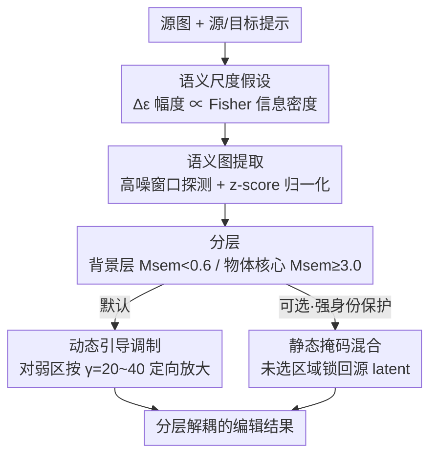

# Deconstructing Guidance: A Semantic Hierarchy for Precise Diffusion Model Editing

**会议**: ICLR2026  
**OpenReview**: [https://openreview.net/forum?id=nLikuHmC98](https://openreview.net/forum?id=nLikuHmC98)  
**代码**: 待开源（补充材料含源码，论文发表后公开）  
**领域**: 扩散模型 / 图像编辑  
**关键词**: 文本引导图像编辑, Classifier-Free Guidance, 语义尺度, Fisher 信息, 免训练

## 一句话总结
本文发现扩散模型 CFG 里的"引导差向量" $\Delta\epsilon$ 的**幅度**编码了编辑的语义尺度（物体=大幅度、背景=小幅度），并用 Tweedie 公式把它证明成 Fisher 信息密度的必然结果；据此提出免训练、即插即用的 Prism-Edit，把引导信号按语义分层后**定向放大**被压制的背景信号，从而第一次让"背景修改"这一老大难任务变得稳定可控。

## 研究背景与动机

**领域现状**：文本引导的扩散图像编辑（SDEdit、Prompt-to-Prompt、DiffEdit、LEDITS++ 等）几乎都建立在 Classifier-Free Guidance（CFG）之上，主流思路是回答"**在哪里**编辑（WHERE）"——通过操纵 cross-attention 图，或用引导差向量生成一张空间 mask 把图像切成"编辑区"和"保留区"。

**现有痛点**：这些方法有一个顽固的失败模式——**物体编辑很可靠，背景编辑却经常失败**。比如把"一只在野外的猫头鹰"改成"在学校里"，场景往往纹丝不动，或者反而把主体破坏掉。以往把这归因为方法工程上的瑕疵，靠更精细的 mask 去补救。

**核心矛盾**：作者认为真正的瓶颈不在"在哪里编辑"，而在**引导信号本身的结构**。CFG 的引导差向量 $\Delta\epsilon=\epsilon_\theta(x_t,c_\text{target})-\epsilon_\theta(x_t,c_\text{source})$ 不是均匀的——它在信息密集的物体上天然很强、在信息稀疏的背景上天然很弱。背景编辑失败因此不是偶然 bug，而是一种"信息论上的必然"。

**本文目标**：(1) 给"背景为什么难编辑"一个第一性原理的解释；(2) 在不重训模型的前提下，把被压制的背景引导信号"扶正"，让物体和背景能被独立、可控地编辑。

**切入角度**：把 $\Delta\epsilon$ 从"空间指示器"重新理解为"语义信号"——它的**幅度**而非位置，编码了一条语义层级（物体结构 vs 风格/背景）。

**核心 idea**：用一条"语义尺度假设"（Semantic Scale Hypothesis）把引导幅度 $\|\Delta\epsilon\|$ 和局部 Fisher 信息密度挂钩，再把编辑从"做 mask"改造成"对引导信号做分层、归一化与定向放大"的信号处理问题。

## 方法详解

### 整体框架

Prism-Edit 是一个挂在任意扩散编辑器外面的免训练模块，整体是**两阶段**：先从模型自身的去噪动态里**提取一张多层语义图** $M_\text{sem}$，再用这张图**分层施加编辑**（默认走动态引导调制，可选叠加静态掩码混合）。

它要解决的核心问题是：$\|\Delta\epsilon\|$ 在不同时间步、不同样本、不同任务之间幅度差异巨大（背景天生弱、物体天生强），所以**绝对幅度不可比**，不能直接拿一个固定阈值去切。Prism-Edit 的关键就是先把这种"信息失衡"用 z-score 归一化抹平，得到一个尺度无关的语义图，再在上面用固定的相对阈值（以 $\sigma$ 为单位）划出"背景/风格层"和"物体核心层"，最后对弱的背景层做大倍率放大、对强的物体层保持不动。

### 关键设计

**1. 语义尺度假设：把引导幅度解释成 Fisher 信息密度**

这是全文的理论地基，也是后面所有操作的依据。作者从 score 函数出发：$\epsilon$-参数化下，预测噪声正比于 $\nabla_{x_t}\log p(x_t\mid c)$。两个条件预测之差因此正比于两个 score 之差，由对数性质合并为一个标量场的梯度——目标与源条件的**对数似然比**：

$$\Delta\epsilon(x_t;c_1,c_2)\ \propto\ \nabla_{x_t}\log\frac{p(x_t\mid c_2)}{p(x_t\mid c_1)}.$$

也就是说 $\Delta\epsilon$ 是一个"指向目标条件更可能的方向"的向量场，$\|\Delta\epsilon\|$ 反映这片似然比地形的陡峭程度。地形陡不陡由模型对干净图像 $x_0$ 的"确定性"决定，而这由 Tweedie 公式联系到后验方差：物体这类**高信息密度**区域后验尖锐、方差小（模型很笃定），条件一变后验均值就剧烈移动；背景这类**低信息密度**区域后验平坦、方差大（模型很犹豫），同样的条件变化只引起很小的位移。于是有

$$\|\Delta\epsilon(x_t;c_1,c_2)\|\ \propto\ \frac{\|\Delta\mu_t\|}{\sigma_t},\qquad \Delta\mu_t:=\mathbb{E}[x_0\mid x_t,c_2]-\mathbb{E}[x_0\mid x_t,c_1].$$

作者进一步在局部高斯后验近似下，给出 $\|\Delta\epsilon\|^2$ 用高斯 KL 散度表达的上下界（Theorem 1），把"均值移动"和"协方差失配"两项干净地分开，并把期望幅度连到 Fisher 散度，最终得到一句话结论：$\|\Delta\epsilon\|^2\propto$ 局部 Fisher 信息密度。这把"背景难编辑"从工程缺陷升级成 score matching + Fisher 信息理论的必然推论。（⚠️ 定理细节与证明草图见原文附录 A，此处只取直觉。）

**2. 语义图提取：用 z-score 归一化抹平信息失衡**

既然背景幅度天生就小，直接用绝对阈值切图必然把背景判成"无需编辑"。这一步就是把幅度变成"可比的"。具体做法是只在一个**狭窄的高噪窗口**（如 1000 步调度下 $t\in[900,800]$）探测——作者称这个区间能最大化语义覆盖、同时保留结构可塑性，比晚期时间步更合适（晚期太"僵"）。在窗口内对若干步的 $\Delta\epsilon$ 取平均，再做逐元素 z-score 归一化：

$$\overline{\Delta\epsilon}=\frac{1}{N_\text{probe}}\sum_{i=1}^{N_\text{probe}}\Delta\epsilon_{t_i},\qquad M_\text{sem}=\frac{|\overline{\Delta\epsilon}|-\mu_{|\overline{\Delta\epsilon}|}}{\sigma_{|\overline{\Delta\epsilon}|}}.$$

归一化之后弱的背景信号被"扶"回和物体可比的尺度，强的物体信号也不会淹没整张图，于是可以用**固定的相对阈值**（以 $\sigma$ 为单位）跨提示、跨种子、跨编辑泛化。作者观察到这张语义图的**两条极端尾部**对应最干净的语义信号，中间值往往是物体与背景的混合、不适合解耦，因此定义两层：**背景/风格层** $M_\text{sem}<0.6$、**物体核心层** $M_\text{sem}\ge 3.0$。

**3. 动态引导调制（默认）：对低信息区域定向放大**

拿到语义图后，默认走这条更灵活的路：在每一步去噪时，根据瞬时 $\|\Delta\epsilon_t\|$ 的 z-score 把权重 $W_{\text{sem},t}$ **二值化**（背景编辑用 $<0.6\sigma$、物体编辑用 $\ge3.0\sigma$，二值化是为了稳定、避免边界伪影），再逐元素地调制引导：

$$\tilde{\epsilon}_\theta(x_t,c)=\epsilon_\theta(x_t,c_\text{src})+\gamma\cdot\big(\Delta\epsilon_t\odot W_{\text{sem},t}\big).$$

这样就能做**区域自适应的引导缩放**：背景这类低信息、高方差区域可以用很大的 $\gamma$（如 20–40）猛推，而物体区域被掩码隔离在外、不会被带偏。它正是第 1 点信息场视角的直接落地——把弱、不确定的区域局部放大，把强、确定的区域保持原样，从而把扩散引导里固有的 Fisher 信息失衡重新拉平。由于二值掩码严格隔离目标区域，即便用很大的局部倍率，背景编辑也不会"渗"进物体核心。

**4. 静态掩码混合（可选）：需要强身份保留时再上的硬约束**

这是一条可选的、更保守的施加方式，把语义图阈值化成一张粗 mask 当作"宽松的空间约束"。它故意做得宽松：物体编辑选 $M_\text{sem}\ge0.6$ 的高幅区、背景编辑选 $M_\text{sem}<0.6$ 的低幅区，只防止编辑漂到完全无关的区域，而不卡死语义边界；只有在需要**严格保留身份**时，才进一步把高幅物体核心 $M_\text{sem}\ge3.0$ 显式排除。每一步把预测 latent 和源 latent 按 mask 混合，保证未选区域原样不动：

$$x_{t-1}\leftarrow x^\text{pred}_{t-1}\odot M_\text{final}+x^\text{src}_{t-1}\odot(1-M_\text{final}),$$

其中 $M_\text{final}$ 由 $M_\text{sem}$ 阈值化后再用形态学闭运算细化得到。作者强调动态调制单独就足以应付大多数编辑、是默认；静态掩码只是一道可选的"二次安全阀"。

### 损失函数 / 训练策略
Prism-Edit **完全免训练、模型无关**：不引入任何可学参数，所有控制信号都从模型自身的去噪动态里直接导出。超参数（如各阈值、$\gamma$）会因不同基座模型的噪声调度而异，但一旦为某个基座设定好，就**跨数据集、跨提示不变**，无需逐图调参。

## 实验关键数据

作者在 Stable Diffusion v1.5 / v3 与 FLUX.1 上验证 Prism-Edit 的模型无关性，基准用 Wild-TI2I 与 ImageNet-R-TI2I，并把 Wild-TI2I 拆成 object-centric / background-centric 两个子集专门考察解耦。指标为 DINOv2（语义对齐）、SSIM（结构保留）、CLIP（文本对齐）。

### 主实验

由于背景编辑要"改背景、保物体"，作者引入一个组合指标来直接衡量解耦成功度：

$$\text{DINO/SSIM}=\frac{\text{DINOv2 (物体相似度)}}{\text{SSIM (背景保留)}}.$$

下表为图 5(a)"野外→丛林的羊"案例随引导倍率变化的代表性数值（⚠️ 取自原文图注，非完整 benchmark 表）：

| 配置 | DINOv2 | SSIM | DINOv2/SSIM |
|------|--------|------|-------------|
| DDIM Inv. (scale 2) | 0.866 | 0.868 | 0.997 |
| DDIM Inv. (scale 10) | 0.762 | 0.619 | 1.232 |
| **w/ Ours (scale 20)** | 0.863 | 0.691 | **1.249** |

可以看到加 Prism-Edit 后既把 DINOv2 拉回高位（不破坏物体），又拿到最高的 DINOv2/SSIM 比值（背景被有效改动），在背景敏感指标上稳定领先。

### 消融实验 / 关键发现

| 配置 | 现象 | 说明 |
|------|------|------|
| 完整 Prism-Edit | 物体/背景干净解耦 | 默认动态调制 |
| 只改高幅（物体）信号 | 只换物体身份、背景不变 | 因果验证（图 8 Local level）|
| 只改低幅（背景）信号 | 只换背景/风格、物体保留 | 因果验证（图 8 Global level）|
| 大 $\gamma$ 放大背景 | 不产生伪影、不破坏物体 | 二值掩码隔离起效 |

### 关键发现
- **因果可分离**：分别只编辑高幅 / 低幅信号，能干净地只改物体或只改背景，直接证明"引导幅度因果对应语义尺度"，而非相关性巧合。
- **CLIP 会"骗人"**：CLIP 偏好全局改动，整张图都改的 baseline 反而 CLIP 更高；Prism-Edit 严格保留未编辑区，CLIP 可能略降但 DINO/SSIM 显著更高——所以作者特意引入 DINO/SSIM 比值。
- **即插即用**：作为外挂模块接到 DDIM/DDPM Inversion、PnP、LEDITS++、RF-Inversion、Stable-flow 上，都能纠正"语义泄漏"和"编辑不彻底"这两类常见失败模式。

## 亮点与洞察
- **把老问题升级成理论必然**：以前大家把"背景难编辑"当成调参没调好，本文用 Tweedie 公式 + Fisher 信息把它证明成统计上的必然，解释力一下子从工程经验变成第一性原理——这是最"啊哈"的地方。
- **视角切换很巧**：从"WHERE（在哪编辑、做 mask）"切到"HOW（信号该怎么施加、按幅度分层）"，等于把图像编辑重新表述成一个"对引导向量场做信号处理"的问题，可迁移性强。
- **z-score 归一化是点睛之笔**：用一个极简的统计归一化解决了"绝对幅度不可比"这个真正卡住固定阈值方法的痛点，使得固定相对阈值能跨提示/种子泛化。
- **可迁移 trick**："探测高噪窗口取平均 $\Delta\epsilon$ → 归一化 → 分层 → 区域定向缩放"这套流程，原则上能搬到任何依赖 CFG 的可控生成任务（如布局控制、风格强度调节）。

## 局限与展望
- **高斯后验假设**：理论推导假设后验为高斯，简化了证明但并不完全吻合真实扩散过程，定理只是界而非精确刻画。
- **需要人工指定编辑意图 + 固定阈值**：要靠用户说明改物体还是改背景，且依赖固定 z-score 阈值（0.6 / 3.0）分层，既有人工介入又有启发式设计成分。
- **效果受基座模型影响**：作为外挂模块，增益随底层架构变化，换基座可能需要重设阈值。
- **改进方向**：作者展望自动检测用户意图、更自适应的层选择，朝零样本编辑管线推进；笔者补充——固定双阈值可考虑改成数据驱动或随时间步自适应的软分层，减少启发式。

## 相关工作与启发
- **vs DiffEdit**：DiffEdit 也用 $\Delta\epsilon$，但把它当空间信号、生成二值 mask 切"编辑区/保留区"；本文把同一个信号当**语义信号**，按幅度分层并对弱层做**梯度调制**而非硬切，从而能做更细的解耦控制（差别详见原文附录 C.7）。
- **vs 注意力操纵类（Prompt-to-Prompt / MasaCtrl）**：它们改 cross-attention 图来定位编辑、回答 WHERE；本文不碰注意力，直接从去噪动态里导出控制信号、回答 HOW，互补而非替代。
- **vs 各类反演编辑器（PnP / LEDITS++ / RF-Inversion / Stable-flow）**：本文不是要替代它们，而是作为即插即用增强层挂上去，纠正它们在背景编辑上的语义泄漏与编辑不彻底。

## 评分
- 新颖性: ⭐⭐⭐⭐⭐ 把 CFG 引导幅度与 Fisher 信息密度挂钩、给出背景编辑失败的理论必然性，视角新且有深度
- 实验充分度: ⭐⭐⭐⭐ 跨三种基座 + 多 baseline 即插即用 + 因果解耦验证较扎实，但定量主表多以图呈现、数值表偏少
- 写作质量: ⭐⭐⭐⭐⭐ 从假设到理论到方法到验证一条线讲得清楚，命名（Semantic Scale / Prism-Edit）也贴切
- 价值: ⭐⭐⭐⭐ 免训练、模型无关、可外挂，解决了背景编辑这个真实痛点，实用性强

<!-- RELATED:START -->

## 相关论文

- [\[ICLR 2026\] A Noise is Worth Diffusion Guidance](a_noise_is_worth_diffusion_guidance.md)
- [\[CVPR 2026\] MapRoute: Semantic Routing for Precise Concept Erasure with Mapper](../../CVPR2026/image_generation/maproute_semantic_routing_concept_erasure.md)
- [\[CVPR 2026\] SketchAssist: A Practical Assistant for Semantic Edits and Precise Local Redrawing](../../CVPR2026/image_generation/sketchassist_a_practical_assistant_for_semantic_edits_and_precise_local_redrawin.md)
- [\[NeurIPS 2025\] Tortoise and Hare Guidance: Accelerating Diffusion Model Inference with Multirate Integration](../../NeurIPS2025/image_generation/tortoise_and_hare_guidance_accelerating_diffusion_model_inference_with_multirate.md)
- [\[AAAI 2026\] Mass Concept Erasure in Diffusion Models with Concept Hierarchy](../../AAAI2026/image_generation/mass_concept_erasure_in_diffusion_models_with_concept_hierarchy.md)

<!-- RELATED:END -->
