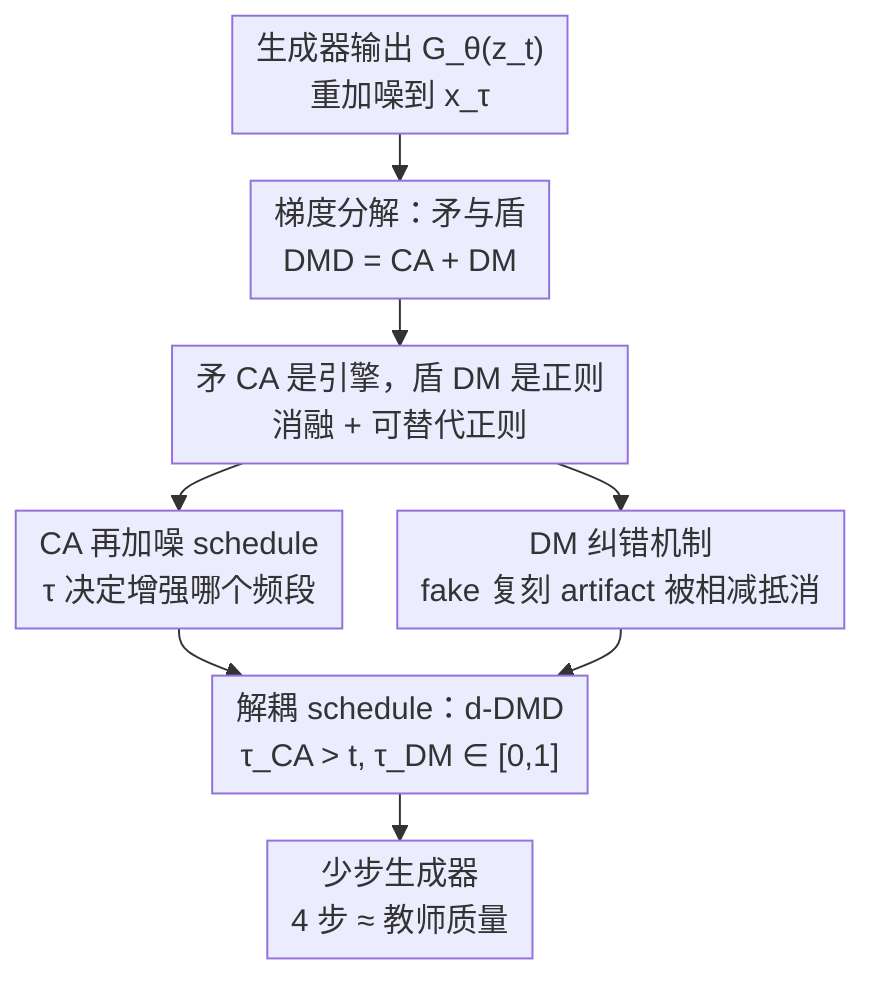

# Decoupled DMD: CFG Augmentation as the Spear, Distribution Matching as the Shield

**会议**: ICLR2026  
**OpenReview**: [https://openreview.net/forum?id=jBztvOiCKE](https://openreview.net/forum?id=jBztvOiCKE)  
**代码**: https://github.com/Tongyi-MAI/Z-Image  
**领域**: 扩散模型 / 图像生成  
**关键词**: 扩散蒸馏, DMD, CFG, 少步生成, 分布匹配

## 一句话总结
作者把广泛使用的 DMD 蒸馏目标做了一次严格的梯度分解，发现真正把多步扩散模型压成少步生成器的「引擎」其实不是分布匹配，而是一个长期被忽视的 CFG Augmentation 项；分布匹配只是个稳定训练的「正则」——基于这个「矛/盾」分工，他们提出对两项使用解耦的再加噪 schedule（d-DMD），在 SDXL / Lumina / 6B 大模型上都拿到一致涨点。

## 研究背景与动机
**领域现状**：扩散模型质量很高但采样慢，需要几十到上百次网络评估。把它蒸馏成少步（few-step）甚至单步生成器是当前主流加速路线，其中基于 score 的蒸馏（Diff-Instruct、DMD 及其变体）因为既有 SOTA 效果又有优雅的理论框架而格外受欢迎：它被解释为最小化学生分布 $p_\text{fake}$ 与教师分布 $p_\text{real}$ 之间的 Integral KL 散度 $L_\text{IKL}=\int_0^1 \mathrm{KL}(p_{\text{real},\tau}\,\|\,p_{\text{fake},\tau})\,d\tau$。

**现有痛点**：这套优雅理论头顶一直悬着一朵乌云——CFG（Classifier-Free Guidance）。按理论推导，估计真实 score 的理想方式应该就是教师模型自己的预测，根本不该出现 CFG。但实践经验压倒性地表明：在文生图这种复杂任务上，DMD 类方法只有在**很大的 CFG scale** 下才有好结果。更别扭的是，CFG 只加在 real model 上、不加在 fake model 上，这种「非对称」用法让理论与实践之间产生了刺眼的裂缝，破坏了「匹配两个分布」这一原始推导的完整性。

**核心矛盾**：既然 CFG 是出好结果的必要条件、却又游离在理论之外，那说明大家对「DMD 为什么成功」的理解很可能是不完整甚至错误的——成功也许根本不来自分布匹配本身。

**本文目标**：重新定义 DMD 这类算法的工作原理：搞清楚到底是哪一项在驱动「多步→少步」的转换，以及 CFG 在其中扮演什么角色。

**切入角度**：不另起炉灶，而是直接把**实践中真正在用**（带 real score CFG）的 DMD 梯度做一次严格的代数分解，看它到底由哪几个机制组成。

**核心 idea**：把 DMD 梯度拆成两项——一项是被忽视的 **CFG Augmentation（CA，矛）**，它才是把模型转成少步生成器的核心引擎；另一项是严格符合理论的 **Distribution Matching（DM，盾）**，它在复杂任务里主要充当稳定训练的正则。认清这种「分工」后，就能对两项分别做更有原则的改进。

## 方法详解

### 整体框架
这篇论文不是提出一个全新网络，而是先「解剖」再「重组」DMD。整体逻辑是：① 把实践版 DMD 梯度按 CFG 定义代入、做代数重排，得到 CA + DM 两项；② 通过消融把 CA 钉成「引擎」、DM 钉成「正则」，并用更简单的统计正则 / GAN 验证 DM 可被替代；③ 机理分析两项各自吃哪个再加噪时刻 $\tau$、各自负责修哪种频率的内容；④ 基于机理把原本耦合在一起的单一 $\tau$ 拆成两套独立 schedule，得到改进算法 d-DMD（Decoupled-Hybrid）。

记号上采用 flow matching 约定：$t=0$ 是纯噪声、$t=1$ 是干净数据。生成器 $G_\theta$ 吃输入 $z_t$ 产出图像预测 $G_\theta(z_t)$，再以采样到的噪声水平 $\tau$ 重新加噪成 $x_\tau$，喂给两个 score 模型：教师给出的 real score $s^\text{real}$ 和同步训练、追踪学生输出分布的 fake model 给出的 $s^\text{fake}_\text{cond}$。

### 关键设计

**1. 梯度分解：把 DMD 拆成「矛」CA 与「盾」DM**

痛点是大家把「带 CFG 的 DMD 成功」笼统归功于分布匹配，却说不清 CFG 这个「实现细节」到底干了什么。作者直接把 CFG 定义代入实践版 DMD 梯度。实践版梯度只比理论版多了一处：真实 score $s^\text{real}_\text{cond}$ 被换成了 CFG 版 $s^\text{real}_\text{cfg}(x_\tau)=s^\text{real}_\text{uncond}+\alpha\,(s^\text{real}_\text{cond}-s^\text{real}_\text{uncond})$，其中 $\alpha>1$ 是 guidance scale。把它代入后做简单重排，DMD 梯度就分裂成两个含义截然不同的项：

$$\nabla_\theta L_\text{DMD}=\mathbb{E}\Big[-\big(\underbrace{s^\text{real}_\text{cond}-s^\text{fake}_\text{cond}}_{\Delta_\text{real-fake}\ (\text{DM})}+\underbrace{(\alpha-1)(s^\text{real}_\text{cond}-s^\text{real}_\text{uncond})}_{\Delta^\text{real}_\text{cfg}\ (\text{CA})}\big)\tfrac{\partial G_\theta(z_t)}{\partial\theta}\Big]$$

第一项 $\Delta_\text{real-fake}$ 严格对应理论上的分布匹配（real 与 fake 的 score 差）；第二项 $\Delta^\text{real}_\text{cfg}$ 则是把一个放大的 CFG 信号直接当梯度作用到学生输出上——它和 fake model 毫无关系，正是过去被当成「无关紧要」而忽视的那一项。这一步拆解之所以关键，是因为它把「CFG 是松弛 trick」的旧叙事，改写成「CFG 信号本身是一个独立的、与分布匹配并列的机制」。

**2. 矛是真引擎、盾是稳定器：CA 单独能转换，DM 负责不崩**

拆出两项后自然要问：谁在真正干活？作者做三组消融——完整 DMD（CA+DM）、只用 CA、只用 DM。结论很干净：只用 CA 就能高效地把多步模型转成少步生成器，生成内容与完整 DMD 高度相似；而只用 DM 在复杂任务上明显落后（4 步还能勉强出图，但 Image Reward / HPS v2.1 与 CA 差距显著）。但 CA 单独训不可持续——图像会逐渐过饱和、长高频噪声，最终训练崩溃；一旦把 DM 加回来，这些问题消失，训练长期稳定、最终质量更高。

于是得到核心论断：**少步转换几乎全靠 CA 这个「引擎」**，本质是把 CFG 模式「烤」进学生预测；**DM 则是防止训练发散、压住 artifact 的「正则」**。为进一步坐实「DM 只是正则」，作者验证它并非不可替代：用最简单的非参数均值-方差 KL 约束 $L_\text{KL}=\frac1B\sum_i\frac12\big(\frac{\sigma_i^2+(\mu_i-\mu_\text{target})^2}{\sigma_\text{target}^2}-1-\log\frac{\sigma_i^2}{\sigma_\text{target}^2}\big)$ 就能稳住训练（但最终质量不如 DM），用 GAN 判别器也能当正则（但需要真实图像数据、且 4k 步后仍会崩）。三者一比，DM 处在「比统计约束更强、比 GAN 更稳」的甜点位置。

**3. 解剖引擎：CA 的再加噪时刻 $\tau$ 决定它增强哪个频段**

要改进 CA 先得理解它怎么工作。作者用「只训 CA 的单步生成器」做探针，系统地改变重加噪时刻 $\tau$ 的采样范围。规律非常一致：当 $\tau$ 限制在**噪声端**（如 $[0,0.05]$），CA 主要增强低频信息（大色块、整体构图）；随着 $\tau$ 范围扩到更干净的时刻，图像逐渐获得高频细节（锐利边缘、纹理）。即 **CA 在某个噪声水平 $\tau$ 上施加，就主要增强该水平对应的图像内容**；佐证是把 $\tau$ 限死在干净端 $[0.7,1.0]$ 时训练直接崩——低频结构还没定，高频细节无从谈起。

这对多步生成有直接含义：在第 $t$ 步、输入 $z_t$ 已经解析好了低于 $t$ 的信息，此时再用包含 $\tau<t$ 的 CA 就是冗余甚至有害的（会过度增强已成型特征、引入 artifact）。所以作者假设：**最优的 CA schedule 应当是个聚焦的引擎，把火力集中在尚未确定的部分，约束其 $\tau>t$。**

**4. 解读盾的纠错机制，并据此解耦 schedule 得到 d-DMD**

DM 是怎么纠错的？作者设计了一个诊断实验：继续只用 CA 训练（已知不稳、会出 artifact），但旁挂一个「只观察、不参与更新」的 fake model。观察发现：当带 checkerboard artifact 的图被重加噪喂给两个 score 模型时，冻结的 real model 预测里几乎没有该 artifact，而追踪学生分布的 fake model 预测里却保留了它——因为 fake model 学到了生成器的特征性失败模式。于是在 DM 梯度 $s^\text{real}_\text{cond}-s^\text{fake}_\text{cond}$ 里，fake 那项的 artifact 变成一个负向项，作用回生成器恰好抵消这些 artifact。这就是 DM 纠错的具体机理。同时 $\tau$ 控制纠错的「范围」：大 $\tau$（较干净）让两 score 主要在高频细节上分歧、小 $\tau$（较噪）迫使它们在构图、配色等低频元素上分歧，给了 DM 修全局问题的机会。

由此推出：DM 需要「全局视角」来修那些低频的全局 artifact（如过饱和），所以它的最优 schedule 应**始终覆盖全噪声范围** $\tau_\text{DM}\in[0,1]$，与当前步 $t$ 无关——这和 CA「约束 $\tau>t$」的诉求恰恰相反。把这两套独立 schedule 写进梯度，就得到解耦版 d-DMD：

$$\nabla_\theta L_\text{d-DMD}=\mathbb{E}\Big[-\big((s^\text{real}_\text{cond}(x_{\tau_\text{DM}})-s^\text{fake}_\text{cond}(x_{\tau_\text{DM}}))+(\alpha-1)(s^\text{real}_\text{cond}(x_{\tau_\text{CA}})-s^\text{real}_\text{uncond}(x_{\tau_\text{CA}}))\big)\tfrac{\partial G_\theta(z_t)}{\partial\theta}\Big]$$

其中 CA 用 $\tau_\text{CA}$、DM 用 $\tau_\text{DM}$。作者最终主推 **Decoupled-Hybrid（配置 ④）：$\tau_\text{CA}>t,\ \tau_\text{DM}\in[0,1]$**——引擎聚焦、正则全局，二者各司其职。

### 损失函数 / 训练策略
训练沿用 DMD 框架：生成器 $G_\theta$ 与 fake model 交替训练，fake model 持续在生成器输出上学习。核心改动只是把原来 CA、DM 共享的单一再加噪 schedule 换成解耦的 $\tau_\text{CA}>t$ 与 $\tau_\text{DM}\in[0,1]$。SDXL 实验为与 DMD2 严格对比，连 GAN loss 都照搬，仅替换 schedule。

## 实验关键数据

### 主实验
4 步 SDXL 蒸馏，在 10k COCO2014-val prompts 上评测：

| 方法 | FID↓ | CLIP-S↑ | ImageReward↑ | HPS V2.1↑ | HPS V3↑ |
|------|------|---------|--------------|-----------|---------|
| LCM | 22.27 | 31.71 | 39.56 | 28.00 | 6.45 |
| SDXL-Turbo | 27.27 | 32.16 | 46.09 | 29.83 | 9.09 |
| Lightning | 24.49 | 32.31 | 57.48 | 30.30 | 9.48 |
| PCM | 24.13 | 32.52 | 64.73 | 30.76 | 9.46 |
| DMD2 | 18.95 | 33.14 | 71.01 | 30.64 | 9.64 |
| **Decoupled（本文）** | **17.80** | **33.62** | **78.61** | 30.34 | **9.79** |

在 Lumina-Image-2.0 上做 schedule 消融（DPG Bench Overall / HPS）：

| 配置 | DPG Global | DPG Overall | HPS v2.1 | HPS V3 |
|------|-----------|-------------|----------|--------|
| Original（50 步教师） | 84.50 | 87.20 | 30.20 | 9.62 |
| ① τCA=τDM∈[0,1]（DMD） | 80.22 | 83.90 | 30.61 | 10.34 |
| ② τCA,τDM∈[0,1] | 91.88 | 83.77 | 30.69 | 10.32 |
| ③ τCA>t, τDM>t | 93.47 | 85.64 | 31.71 | 11.08 |
| **④ τCA>t, τDM∈[0,1]（本文）** | 91.40 | **85.85** | **32.29** | **11.59** |

### 消融实验

| 配置 | 关键现象 | 说明 |
|------|---------|------|
| 只用 CA | 高效转少步，但逐渐过饱和/高频噪声直至崩溃 | CA 是引擎但不可持续 |
| 只用 DM | 复杂任务明显落后，4 步勉强出图 | DM 单独不足以驱动转换 |
| CA + 均值方差 KL | 训练稳但质量不及 DM | 证明 DM 是正则、且可被替代 |
| CA + GAN | 能控方差但 4k 步后仍崩、需真实图 | GAN 当正则更复杂更不稳 |
| ② 仅解耦不约束 | 与基线 ① 几乎无差异 | 收益来自 schedule 的范围而非「解耦」本身 |

### 关键发现
- 涨点的根源是 schedule 的**范围**（约束 $\tau>t$），而不是「把两套 schedule 独立开」这个动作本身——配置 ② 证明了这点。
- Decoupled-Hybrid（④）在用户研究中拿到 100% 的 model-level 偏好率，三图排序里 59.8% 被排第一（次优 ③ 为 33.8%），标注者反馈是细节更丰富、更真实、更少「油腻感」和结构畸形。
- 在内部 6B 大模型上，4 步生成器质量基本追平 80-NFE 教师，NFE 削减 95%。

## 亮点与洞察
- 最「啊哈」的一点是：大家信了好几年的「DMD 靠分布匹配成功」其实是误读——真正的引擎是那个被当成实现细节的 CFG Augmentation 项。一个纯代数重排就改写了整套叙事。
- 「引擎 vs 正则」的分工不是嘴上说说，而是用三组消融 + 三种可替代正则（均值方差 KL / GAN）实打实地钉死，论证链条很扎实。
- 频率视角很有迁移价值：CA 在不同 $\tau$ 增强不同频段、DM 需要全局 $\tau$ 才能修低频 artifact——这种「让引擎聚焦、让正则全局」的思路，可推广到其他需要分项调度噪声的蒸馏/正则场景。
- 改进几乎零成本：不改网络、不加数据，只把一个共享 schedule 拆成两套，就能在多个模型上稳定涨点，工程上极友好。

## 局限与展望
- 作者自己承认最根本的问题没答：**为什么 CA 有如此强的「把扩散模型转成少步生成器」的能力**？这和 CFG 本身机理至今成谜有关，文中只给了高层的初步解释（Sec. B），离严格解释仍有差距。
- 结论建立在文生图这类「需要大 CFG」的复杂任务上；在简单任务（如低分辨率 CIFAR）上 DM 本就能独立蒸馏，所以「CA 是引擎」的结论是否在所有设定下成立需要 caveat。
- 不同模型 / benchmark 间的绝对指标不可直接横比（如 Lumina 表里教师与蒸馏模型 HPS 互有高低），schedule 收益更应看同设定下的相对趋势。

## 相关工作与启发
- **vs DMD / DMD2**：本文不是替代 DMD，而是重新解释它并在其框架内做改进；DMD2 把 CFG 当实现细节、用单一共享 schedule，本文揭示 CFG 项才是引擎、并用解耦 schedule（SDXL 上严格沿用 DMD2 配置仅换 schedule 即超过它）。
- **vs Diff-Instruct**：Diff-Instruct 开创 score-based 蒸馏并论证 score-matching 比 GAN 更稳；本文的「DM 比 GAN 更稳、比统计约束更强」呼应了这一论断，并进一步把它定位成「正则」而非「引擎」。
- **vs GAN-based 蒸馏（Turbo/Lightning 等）**：GAN 路线用对抗目标匹配分布；本文把 GAN 仅当作 DM 的一种可替代正则，指出它需真实图、稳定性更差，但复杂度换来的潜在上限更高。

## 评分
- 新颖性: ⭐⭐⭐⭐⭐ 用一次梯度分解颠覆了对 DMD 成功根因的主流理解，视角极其新颖
- 实验充分度: ⭐⭐⭐⭐ 消融、机理诊断、多模型对比、用户研究都齐全，唯 CA 为何有效仍未解释
- 写作质量: ⭐⭐⭐⭐⭐ 「矛/盾」叙事清晰，从分解到机理到改进逻辑一气呵成
- 价值: ⭐⭐⭐⭐⭐ 既给出可迁移的理论洞察，又带来零成本、可复现的实际涨点

<!-- RELATED:START -->

## 相关论文

- [\[ICCV 2025\] Learning Few-Step Diffusion Models by Trajectory Distribution Matching](../../ICCV2025/image_generation/learning_few-step_diffusion_models_by_trajectory_distribution_matching.md)
- [\[ICLR 2026\] SenseFlow: Scaling Distribution Matching for Flow-based Text-to-Image Distillation](senseflow_scaling_distribution_matching_for_flow-based_text-to-image_distillatio.md)
- [\[ICLR 2026\] Bridging the Distribution Gap to Harness Pretrained Diffusion Priors for Super-Resolution](bridging_the_distribution_gap_to_harness_pretrained_diffusion_priors_for_super-r.md)
- [\[ICCV 2025\] Unsupervised Imaging Inverse Problems with Diffusion Distribution Matching](../../ICCV2025/image_generation/unsupervised_imaging_inverse_problems_with_diffusion_distribution_matching.md)
- [\[ICLR 2026\] Decoupled MeanFlow: Turning Flow Models into Flow Maps for Accelerated Sampling](decoupled_meanflow_turning_flow_models_into_flow_maps_for_accelerated_sampling.md)

<!-- RELATED:END -->
