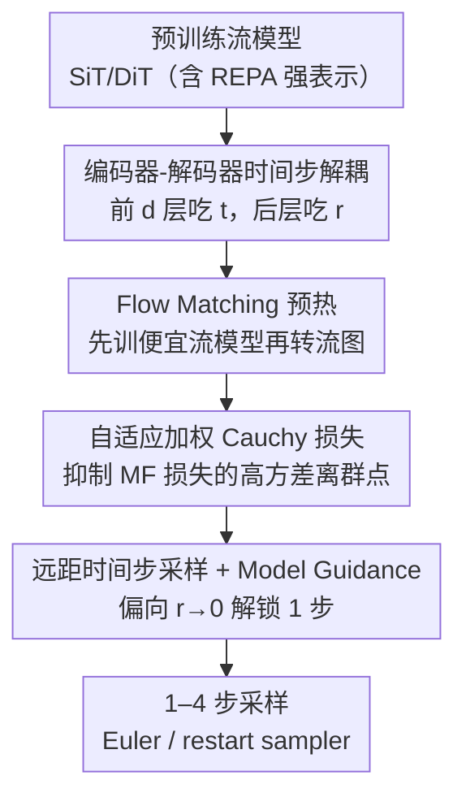

# Decoupled MeanFlow: Turning Flow Models into Flow Maps for Accelerated Sampling

**会议**: ICLR2026  
**OpenReview**: [https://openreview.net/forum?id=P4VsQexEPe](https://openreview.net/forum?id=P4VsQexEPe)  
**代码**: https://github.com/kyungmnlee/dmf  
**领域**: 扩散模型 / 流模型加速采样  
**关键词**: 流图、MeanFlow、少步采样、扩散 Transformer、编码器-解码器解耦

## 一句话总结
把一个**已经训好**的流模型（SiT/DiT）当成编码器-解码器：编码器只看当前时间步 $t$、解码器只看下一时间步 $r$，不改动任何架构就把它变成预测平均速度的「流图」，再微调几十个 epoch，就能在 1–4 步内生成出 ImageNet 256×256 上 FID=2.16（1 步）/ 1.51（4 步）的高质量图像，推理比原流模型快 100 倍以上。

## 研究背景与动机
**领域现状**：扩散模型和流模型是当今视觉生成的主力，但它们靠数值求解 ODE（如 Euler 法）一步步去噪，要生成高质量样本往往需要几十到上百步。为了加速，社区探索了两条路：一是一致性模型（consistency models），强制相邻时间步的去噪输出一致，能做到 1–2 步生成，但很难有效扩展到 2 步以上；二是**流图（flow map）**，直接建模两个时间步之间的**平均速度** $u_\theta(x_t, t, r)$，其中 MeanFlow（Geng et al., 2025a）给出了一个对 flow matching 的优雅推广，证明流图能逼近标准流模型的质量。

**现有痛点**：流图虽然好，但它的**架构设计还很粗糙**。MeanFlow 这类方法把「下一时间步 $r$」的信息**贯穿注入整个** Diffusion Transformer——隐含假设编码器和解码器都需要 $r$。于是想用流图，往往要给 $r$ 加额外的 timestep embedding、改条件注入方式，这就**破坏了与预训练流模型的兼容性**：你没法直接拿一个现成的 SiT/DiT 权重来用，得从头训练流图。而从头训流图既贵又难收敛。

**核心矛盾**：把 $r$ 注入编码器其实是**冗余**的。编码器的职责是从带噪输入 $x_t$ 里抽语义表示 $h_t$，这一步「未来要去哪个时间步」并不重要；真正需要 $r$ 的是解码器——它要决定如何朝 $r$ 预测平均速度。现有方法没区分这两者，既浪费了流模型已经学好的强表示，又强行要求改架构。

**本文目标**：能不能**不改架构**，把任意预训练流模型直接「重新解释」成流图？进而把训练拆成「先训便宜的流模型、再廉价地转成流图微调」这种更高效的范式。

**切入角度**：作者借鉴了「扩散/流模型隐式在做表示学习」这一系列观察（REPA 表示对齐、正则化、masked modeling），把流模型 $v_\theta(x_t,t)$ 看成编码器 $f_\theta$ 和解码器 $g_\theta$ 的复合 $v_\theta = g_\theta \circ f_\theta$。既然编码器的表示对生成质量至关重要，那它对流图也应该一样重要——关键是别让 $r$ 去污染编码阶段。

**核心 idea**：**解耦时间步条件**——编码器只吃 $t$、解码器只吃 $r$，即 $u_\theta(x_t,t,r)=g_\theta(f_\theta(x_t,t),r)$。这样既不引入新参数（复用同一个 timestep embedding 层），又能把预训练流模型「无缝」转成流图，作者称之为 **Decoupled MeanFlow (DMF)**。

## 方法详解

### 整体框架
DMF 的整体故事是：**拿一个训好的流模型，按层切成编码器+解码器，把下一时间步 $r$ 只喂给解码器，立刻得到一个流图；再加几个稳定训练技巧微调几十个 epoch，就能做 1–4 步生成。**

具体地，把 Diffusion Transformer 的 $\ell$ 个 block 按深度 $d$ 切开：前 $d$ 层是编码器 $f_\theta$（只条件于当前时间步 $t$），后 $\ell-d$ 层是解码器 $g_\theta$（只条件于下一时间步 $r$）。整条流图的前向就是 $u_\theta(x_t,t,r)=g_\theta(f_\theta(x_t,t),\,r)$。最神奇的是：**即使完全不微调**，这样切出来的 DMF 在合适的 $d$ 下，FID 还能反超原始 SiT 流模型（图 3a/3b）。在此基础上，训练时把 flow matching（FM）损失和 MeanFlow（MF）损失加在一起优化，并用一套「FM 预热 → 转 DMF → 加 MF 损失微调」的两阶段策略，配合自适应加权 Cauchy 损失和定制的时间步采样，把少步生成质量推到 SOTA。

### 关键设计

**1. 编码器-解码器时间步解耦：让 $r$ 只在该出现的地方出现**

这是全文的灵魂。痛点在于 MeanFlow 把 $r$ 注入整个 transformer，既冗余又破坏与预训练流模型的兼容。作者把流模型读作 $v_\theta=g_\theta\circ f_\theta$，其中 $h_t=f_\theta(x_t,t)$ 是编码表示、$v_\theta(x_t,t)=g_\theta(h_t,t)$。基于「编码阶段不需要知道未来 $r$、解码阶段不再需要原始 $t$」的假设，他们直接**从编码器丢掉 $r$、从解码器丢掉 $t$**，得到 $u_\theta(x_t,t,r)=g_\theta(f_\theta(x_t,t),r)$。实现上沿用 REPA 的切法把前 $d$ 层当编码器、其余当解码器，并**复用同一个 timestep embedding 层**同时编码 $t$ 和 $r$，所以**不增加任何参数、不改架构**。这样做有效的根本原因是：流模型已经在编码器里学到了很强的语义表示，DMF 把这份表示原封不动地迁移给流图，而流图只需在解码侧学会「朝 $r$ 预测平均速度」。实验里固定 $d=22$（24 层总深），DMF 在 16→128 各种去噪步数下都稳定优于原 SiT——这验证了「**你的流模型其实偷偷就是个流图**」。

**2. Flow Matching 预热 + 两阶段训练：把昂贵的流图训练拆成便宜的两段**

直接从头训流图很贵：MF 损失要算 Jacobian-vector product（JVP），还要算 model guidance 的目标，前向次数翻倍、显存吃紧。作者的对策是**先用 FM 损失训一个普通流模型，再转成 DMF、加上 MF 损失微调**。训练时对每个样本 $x_0$ 采两套**独立**的噪声和时间步——$(\epsilon_{\text{FM}},t_{\text{FM}})$ 给 FM 损失、$(\epsilon_{\text{MF}},t_{\text{MF}},r_{\text{MF}})$ 给 MF 损失，总损失是两者之和（作者强调复用同一套 $(\epsilon,t)$ 会让训练不稳）。关键发现是：**预训练流模型能极快地适应流图**，表示越强（训得久、或用了 REPA 表示对齐）适应越快。图 4 显示，从 SiT-L/2 训 800K 步的模型微调出来的 DMF，用**更少的总训练 FLOPs** 反而拿到比从头训更好的 1 步 FID——所以把算力多花在「训流模型」上、再廉价转流图，是更划算的资源分配。

**3. 自适应加权 Cauchy 损失：驯服 MF 损失的高方差**

MF 损失方差很大，会拖垮稳定训练。作者用 Cauchy（Lorentzian）损失 $L_{\text{Cauchy}}(\theta)=\log\!\big(L_{\text{MF}}(\theta)+c\big)$（$c>0$）替代裸 MSE——它在零点附近近似线性、对大离群值则强烈压制，作用类似 Huber/$\ell_1$ 鲁棒损失。进一步地，他们对每个 $(t,r)$ 把 MSE 的残差分布建模为 Cauchy，引入自适应加权函数 $\phi(t,r)$，得到

$$L_{\text{DMF}}(\theta)=\mathbb{E}_{x_t,r}\Big[\log\big(e^{-\phi(t,r)}\|u_\theta-v_{\text{tgt}}-(r-t)\tfrac{du_\theta}{dt}\|^2+1\big)+\tfrac{\phi(t,r)}{2}\Big].$$

同一形式也用于 FM 损失。这样不同 $(t,r)$ 难度被自动归一化，难训的时间步对不会被一个大残差带偏，训练更稳。

**4. 远距时间步采样 + Model Guidance：专门解锁 1 步生成**

流图训练需要 $t>r$ 的时间步对。基础做法（follow Geng et al.）是抽两个 logit-normal 样本取 max/min 得到 $(t,r)$。但作者观察到：转出来的 DMF 在 $r$ 接近 $t$ 时本就预测得准，真正难、也真正决定 1 步质量的是 $t$ 和 $r$ **离得远**（尤其 $r\to 0$）的情形。于是他们**改写提议分布**，刻意多采 $r$ 靠近 0 的远距对，专门加速 1 步生成。配合 **Model Guidance (MG)**——把目标速度改成 $v_{\text{tgt}}=v+\omega(v_\theta(x_t,t,y)-v_\theta(x_t,t))$（$\omega\in(0,1)$）并对其 stop-gradient——它在训流图时格外有效，不像 CFG 那样推理要翻倍算力就能实现高质量 1-NFE 生成。采样阶段除标准 Euler 外，还支持 restart sampler（先预测 $\hat x_0=x_t-tu_\theta(x_t,t,0)$ 再扩散回 $x_r$），两者性能相当但在不同指标下各有取舍。

### 损失函数 / 训练策略
总损失 = FM 损失 + MF 损失（各自用自适应加权 Cauchy 形式），两路用独立采样的噪声/时间步。流程上先 FM 预热（如 160 epoch），再加 MF 损失微调（40–80 epoch）。MF 损失的目标用 $u_{\text{tgt}}=v+(r-t)\frac{du_\theta}{dt}$ 配 stop-gradient，避免 JVP 的二次反传。用 BF16 混合精度防溢出、定制 Flash-Attention kernel 支持 JVP 以省显存。

## 实验关键数据

### 主实验
ImageNet 256×256 与 512×512 上的少步生成基准：

| 数据集 | 方法 | NFE | FID ↓ | 备注 |
|--------|------|-----|-------|------|
| 256×256 | MF-XL/2+ (MeanFlow) | 2 | 2.20 | 之前流图 SOTA |
| 256×256 | **DMF-XL/2+ (本文)** | 1 | **2.16** | 1 步即超越多数对手 |
| 256×256 | **DMF-XL/2+ (本文)** | 2 | **1.64** | |
| 256×256 | **DMF-XL/2+ (本文)** | 4 | **1.51** | 逼近需 100× 算力的 SiT+REPA |
| 256×256 | SiT-XL/2+REPA† | 434 | 1.37 | 全流模型上界（推理慢百倍） |
| 512×512 | sCD / EDM2 等 | 多步 | 1.25–1.81 | 此前少步/全步对手 |
| 512×512 | **DMF-XL/2+ (本文)** | 1 | **2.12** | |
| 512×512 | **DMF-XL/2+ (本文)** | 2 | **1.75** | 超越同档少步方法 |

### 消融实验
ImageNet 256×256、SiT-L/2 训 400K 后转 DMF 微调（总 24 层）：

| 配置 | Depth | MG | REPA | 1-step FID ↓ | 2-step FID ↓ |
|------|-------|----|----|-------------|-------------|
| MF-L/2（基线） | - | ✗ | ✗ | 20.6 | 18.1 |
| DMF-L/2 | 18 | ✗ | ✗ | 19.3 | 17.3 |
| MF-L/2 | - | ✔ | ✗ | 5.27 | 4.09 |
| DMF-L/2 | 18 | ✔ | ✗ | 4.53 | 3.58 |
| MF-L/2 | - | ✔ | ✔ | 3.65 | 2.63 |
| **DMF-L/2** | **18** | ✔ | ✔ | **3.10** | **2.51** |

### 关键发现
- **解耦本身就有增益**：同等设置下 DMF 在各档 depth 都优于 MF；$d=18$（解码器 6 层）最佳，$d=16/20$ 接近，说明编码器要留得够大、解码器精简反而更好。
- **表示质量是流图的命门**：加 REPA 让编码器表示更强后，MF 和 DMF 都涨，但 DMF 因其解耦设计涨得更多（3.65→3.10）——印证「编码器表示对流图至关重要」。
- **MG 几乎是 1 步生成的开关**：不用 MG 时 1-step FID 都在 19–21；加 MG 后骤降到 3–5。
- **预热越久越省**：从 SiT-L/2 800K 微调，用更少总 FLOPs 拿到比从头训和 400K 预热更好的 1 步 FID——把算力压在流模型预训练上更高效。
- 冻结编码器只微调解码器时，8 步能到 FID=1.76（超过带 CFG 的 SiT baseline），但 1 步仍受限，说明 1 步生成需要编码器一起联合优化。

## 亮点与洞察
- **「免训练即转换」太反直觉**：把训好的流模型按层一切、$r$ 只给解码器，**不微调**就能反超原模型的 FID。这说明流模型内部本就隐含了流图能力，DMF 只是把它「读」出来——是个能复用全社区现成权重的即插即用视角。
- **解耦的本质是「别污染表示」**：核心 trick 不是加东西而是**减东西**（从编码器拿掉 $r$、从解码器拿掉 $t$），用「编码不需要未来、解码才需要未来」的物理直觉换来零新增参数 + 架构兼容。
- **可迁移思路**：这种「把已训好的大模型按职责切成编码/解码、只在该注入条件的地方注入」的范式，可推广到任何「想给预训练生成模型加新条件却不想改架构」的场景（如视频流图、条件可控生成）。
- **资源分配洞察**：「训便宜模型 + 廉价转贵能力」比「直接训贵能力」更省，对实际工程的训练预算规划有指导意义。

## 局限与展望
- **冻结编码器无法解锁 1 步**：只微调解码器时 1 步性能明显受限，必须联合微调编码器，意味着「纯免训练」路线在极限少步场景下还不够。
- **依赖强表示的预训练流模型**：增益高度依赖编码器表示质量（REPA、训练时长），对表示弱或小模型，转换收益可能打折。
- **仍局限于 ImageNet 类条件生成**：实验集中在 ImageNet 256/512 的类条件生成，文本到图像、视频等更复杂条件下的有效性有待验证。
- **JVP/MG 训练开销**：虽然比从头训流图省，但 MF 损失的 JVP + model guidance 目标仍需定制 kernel，工程门槛不低。
- **改进方向**：自动选取最优切分深度 $d$、把解耦思想扩展到文本/视频条件、探索编码器轻量联合微调以兼顾省算力与 1 步质量。

## 相关工作与启发
- **vs MeanFlow (Geng et al., 2025a)**：MeanFlow 把 $r$ 贯穿注入整个 transformer、通常从头训流图；DMF 只把 $r$ 给解码器、复用预训练流模型权重。结果是 DMF 在同等 epoch 下 FID 更低（XL/2 1 步 2.83 vs 3.43）、训练 FLOPs 更少——是对 MeanFlow 架构层面的直接改进。
- **vs 一致性模型 (Consistency Models)**：一致性模型靠相邻步输出一致做 1–2 步，但难扩展到 2 步以上；DMF 走平均速度流图路线，能平滑地从 1 步扩到 4 步并逼近全流模型质量。
- **vs SiT-XL/2+REPA (Yu et al., 2025)**：REPA 用表示对齐提升流模型质量、推理仍要几百步；DMF 直接复用 REPA 训好的强编码器，把它转成流图，1–4 步就接近其质量、推理快 100× 以上。
- **vs CFG**：经典 CFG 推理要算两次（翻倍算力）；DMF 用 Model Guidance 把引导吸收进训练目标，推理无需翻倍即可高质量 1 步生成。

## 评分
- 新颖性: ⭐⭐⭐⭐⭐ 「免改架构、免训练即可把流模型转成流图」是个简洁而反直觉的视角，解耦 idea 干净有力。
- 实验充分度: ⭐⭐⭐⭐⭐ ImageNet 256/512 全面对比 + 深度/MG/REPA/预热多维消融，结论自洽。
- 写作质量: ⭐⭐⭐⭐ 动机层层递进、图表清晰，部分公式推导放附录略简。
- 价值: ⭐⭐⭐⭐⭐ 刷新少步生成 SOTA 且能复用全社区现成流模型权重，工程落地价值高。

<!-- RELATED:START -->

## 相关论文

- [\[ICLR 2026\] Joint Distillation for Fast Likelihood Evaluation and Sampling in Flow-based Models](joint_distillation_for_fast_likelihood_evaluation_and_sampling_in_flow-based_mod.md)
- [\[ICLR 2026\] AlphaFlow: Understanding and Improving MeanFlow Models](alphaflow_understanding_and_improving_meanflow_models.md)
- [\[ICLR 2026\] Generalised Flow Maps for Few-Step Generative Modelling on Riemannian Manifolds](generalised_flow_maps_for_few-step_generative_modelling_on_riemannian_manifolds.md)
- [\[ICLR 2026\] Intention-Conditioned Flow Occupancy Models](intention-conditioned_flow_occupancy_models.md)
- [\[ICLR 2026\] UniEdit-Flow: Unleashing Inversion and Editing in the Era of Flow Models](uniedit-flow_unleashing_inversion_and_editing_in_the_era_of_flow_models.md)

<!-- RELATED:END -->
