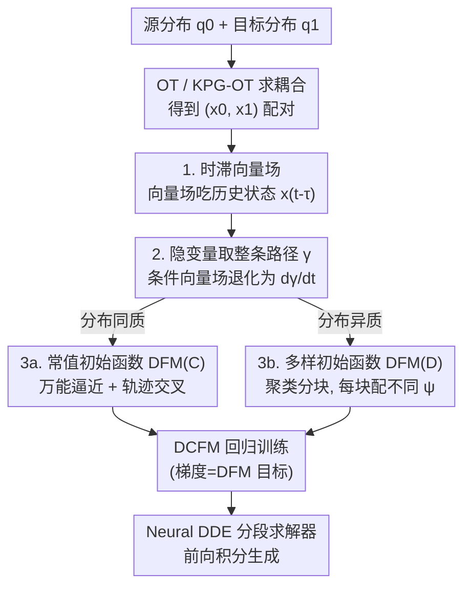

# Delay Flow Matching

**会议**: ICLR 2026  
**OpenReview**: [https://openreview.net/forum?id=6lH1XblLpo](https://openreview.net/forum?id=6lH1XblLpo)  
**代码**: 待确认  
**领域**: 生成模型 / 流匹配 / 分布迁移  
**关键词**: Flow Matching, 时滞微分方程 (DDE), 轨迹交叉, 异质分布, 单细胞轨迹推断

## 一句话总结
把流匹配（Flow Matching）背后的常微分方程（ODE）换成**时滞微分方程（DDE）**，让向量场依赖历史状态，从而天然支持轨迹交叉、异质分布间的精确迁移以及对时滞动力系统的建模，在合成数据、单细胞轨迹推断和图像生成上都优于 ODE 版 FM。

## 研究背景与动机

**领域现状**：流匹配（FM）是当下训练连续归一化流（CNF）的主流方法。它把"从源分布到目标分布的迁移"建模成一个 Neural ODE 的流映射，通过对一个显式构造的条件向量场做回归来高效训练（免仿真），rectified flow、stochastic interpolant 都是同一思路的变体。配合最优传输（OT）或带关键点引导的最优传输（KPG-OT）来选源-目标耦合，FM 已经在图像生成、分子设计、单细胞轨迹推断等任务上很成功。

**现有痛点**：FM 的骨架是 ODE，而 ODE 的解轨迹有一条铁律——**在增广相空间 $(t,x)$ 里轨迹不能相交**（否则同一点会有两个不同的速度方向，违反解的唯一性）。这带来三个具体毛病：① 当任务要求的耦合策略本身会产生轨迹交叉时（比如要把高斯分布按 $x\to -x$ 翻转），ODE-FM 会在交叉点把目标"重新接线"（学成 rectified flow），无法保持指定的迁移策略；② 当源分布有 $M$ 个连通分量、目标有 $N>M$ 个时，连续可微的 ODE 流没法把一团质量精确劈成多团，必然有质量落到本不该有的区域；③ 当快照数据其实来自一个带时滞的真实系统时，ODE-FM 根本恢复不出那个时滞项，插值/外推都不准。

**核心矛盾**：ODE 的向量场只看"此刻的状态 $x(t)$"，所以表达能力被 Lipschitz 连续性死死框住——它没有任何机制去"区分两条在某点撞在一起、但来路不同的轨迹"。而现实里大量系统（神经动力学、基因自调控、种群动力学）恰恰是**靠延迟反馈**运作的，本质上是 DDE 而非 ODE。

**本文目标**：造一个生成框架，能同时解决轨迹交叉、异质分布迁移、时滞动力学三件事，而且不靠往向量场里硬塞额外的辅助隐变量或精心设计的"绕开交叉"的传输路径。

**切入角度**：既然 ODE 不行是因为"只看当下"，那就让向量场**也看过去** $x(t-\tau)$。时滞动力学里，两条轨迹即便在 $x$ 上撞到一起，它们的历史 $x(t-\tau)$ 不同，速度方向就能不同——交叉点的"二义性"被历史信息解开了。

**核心 idea**：用 **时滞微分方程（DDE）的概率流**替代 ODE 的概率流来做分布迁移，即 Delay Flow Matching（DFM）。

## 方法详解

### 整体框架

DFM 把 FM 的载体从 Neural ODE 升级成 **Neural DDE**。一个带单一时滞项的 DDE 形如

$$\frac{dx(t)}{dt} = u[t, x(t), x(t-\tau)],\quad t\in[0,T],\qquad x(h)=\psi(h),\ h\in[-\tau,0],$$

它和 ODE 的关键区别有两点：向量场 $u$ 多吃一个**历史状态** $x(t-\tau)$；初始条件不再是一个点 $x_0$，而是一整段 $[-\tau,0]$ 上的**初始函数** $\psi(h)$。这两个"多出来的自由度"正好对应论文要解决的两类问题——历史项负责让轨迹能交叉、能恢复时滞动力学，初始函数负责处理异质分布。

训练上 DFM 沿用 FM 的回归框架，但要回归的是带时滞项的向量场。直接回归边际向量场 $u(t,x,x_\tau)$ 不可解（它是个对联合概率流的积分），于是仿照 Conditional FM（CFM）引入隐变量 $z$，把目标向量场写成条件向量场 $u(t,x,x_\tau\mid z)$ 的混合，得到可训练的 **Delay Conditional FM（DCFM）目标**：

$$L_{\text{DCFM}}(\theta)=\mathbb{E}_{t,q(z),q^\circ(\psi),\,p(x,t;x_\tau,t-\tau\mid z,\psi)}\big\|v(t,x,x_\tau;\theta)-u(t,x,x_\tau\mid z)\big\|^2.$$

论文证明（Prop. 4.2）这个可计算的 DCFM 目标和真正想优化的 DFM 目标**梯度一致**，所以训练 DCFM 就等于训练 DFM——这点延续了 CFM 的核心保证，是整套框架能落地的前提。训练完后，用 Neural DDE 的分段 ODE 求解器从 $q_0$ 采样、配上从 $q^\circ(\psi)$ 采样的初始函数，前向积分即可生成目标数据。

整个方法围绕三个"要做的选择"展开：**怎么选隐变量 $z$**（决定条件向量场怎么算）、**怎么选初始函数 $\psi$**（决定能不能处理异质性）、以及由此衍生的两个版本 **DFM(C)/DFM(D)**。

### 关键设计

**1. 时滞向量场：用历史状态解开轨迹交叉的二义性**

这是 DFM 区别于一切 ODE-FM 变体的根。ODE-FM 的失败本质是 Prop. 3.1：只要向量场对 $x$ 是 Lipschitz 连续的，相空间里轨迹就不能交叉，所以任何会诱发交叉的耦合（如 $x\to-x$）都无法被精确保持。DFM 让向量场变成 $u(t,x(t),x(t-\tau))$，速度方向不再只由当前位置决定，还由**它从哪来**决定。于是两条在某点相撞的轨迹，因为历史 $x(t-\tau)$ 不同，可以朝不同方向离开——交叉被允许了。论文给的玩具例最能说明：把高斯分布按 $x\to-x$ 翻转，存在精确的 DDE 解 $\dot{x}=-2x(t-1)=-2x_0$，DFM(C) 学到的正是这种"利用历史状态在交叉点选方向"的行为。更进一步，当快照数据本就来自时滞系统（如生物自调控 motif、spiral DDE），只有带时滞项的向量场才可能把真实动力学恢复出来，ODE-FM 在交叉区直接崩。

**2. 隐变量取"整条路径"而非两端点：把条件向量场降到可解形式**

ODE-CFM 里隐变量取两端点 $z:=(x_0,x_1)$ 就够了，因为 ODE 的条件路径只需要端点。但 DFM 要构造 $x(t)$ 和 $x(t-\tau)$ 的**联合**条件概率路径，光有端点不够，必须知道整条轨迹长什么样。所以 DFM 把隐变量定义成一整条连接 $x_0,x_1$ 的路径 $\gamma(t;x_0,x_1)$，其分布写成 $q[\gamma]:=\pi(x_0,x_1)\,P(\gamma;x_0,x_1)$——$\pi$ 是 OT/KPG-OT 给的端点耦合，$P$ 是钉在端点上的路径测度。实践中把 $P$ 取成在某条具体路径 $\gamma^*$ 上的狄拉克分布（$\gamma^*$ 可用线性插值 $\gamma^*_t=(1-t)x_0+tx_1$，也可用数据流形上的测地线插值）。这样一来条件联合密度退化为 $p(x,t;x_\tau,t-\tau\mid\gamma)=\delta[x-\gamma(t)]\,\delta[x_\tau-\gamma(t-\tau)]$，对应的条件向量场就是简单的 $u[t,x,x_\tau\mid\gamma]=\partial\gamma/\partial t$——直接对路径求导即可，回归目标完全可算。对于"随时间有多个目标分布 $\{q_{t_j}\}$"的任务（如单细胞多个采样时刻），隐变量推广为穿过各 $x_{t_j}$ 的轨迹，相邻时刻用 OT/KPG-OT 耦合、用三次样条（CSpline）插值串起来。

**3a. 常值初始函数 DFM(C)：最简设定下就拿到"万能逼近"**

最简单的选择是把初始函数取成常值 $\psi^*(t;x_0)\equiv x_0$（$t\in[-\tau,0]$），称 DFM(C)。它看似平凡，却已经足够强：论文证明了 Prop. 4.3——对任意连续的传输映射 $F$（满足 $F_\#q_0=q_1$）和任意精度 $\epsilon$，只要有神经网络能逼近 $F(x)-x$，就能构造一个带单一时滞项的向量场，其在常值初始函数下的流映射 $G$ 满足 $\|G(x;\theta)-F(x)\|<\epsilon$。换句话说，**DDE 的流映射能万能逼近任意连续传输策略**，而 ODE-FM 连"翻转"这种简单映射都表示不了。这条定理是 DFM 表达能力优势的理论支柱，也解释了为什么仅靠历史项、不靠额外隐变量，DFM 就能覆盖比 ODE-FM 宽得多的传输过程。

**3b. 多样初始函数 DFM(D)：用"不同初始斜率"处理异质分布**

常值初始函数解决了交叉，但 Prop. 3.3 指出的异质性（源 $M$ 块、目标 $N>M$ 块）还需要初始函数这一层自由度。DFM(D) 先用聚类（GMM、DBSCAN）把源数据集分成 $M$ 个互斥子集、目标分成 $N$ 个，并按规模赋归一化质量 $\rho^{(m)}_0=|X^{(m)}_0|/|X_0|$。然后对落在"源块 $m\to$ 目标块 $n$"的轨迹，分配一个**带不同恒定时间导数 $C_{mn}$** 的初始函数 $\psi^*_{mn}$：$\,d\psi^*_{mn}/dt=C_{mn},\ \psi^*_{mn}(0;x_0)=x_0$。直观上，不同的初始斜率相当于给向量场不同的"起跑姿态"，把来自不同源块的质量导向各自对应的目标块，从而在分叉点不再把质量糊在一起。论文 1 维例子很直观：把 $U(-1,1)$ 劈成 $\tfrac12U(-3,-2)+\tfrac12U(2,3)$，用 $\dot{x}=x(t)-x(t-1)$ 配两套初始函数（$x(t)=x_0-t$ 和 $x(t)=x_0+t$）就能精确分流。单细胞分化（一种细胞分裂成多种命运）正是这种异质迁移，DFM(D) 给 Neu/Mo 或中胚层/内胚层各配一套初始函数，预测轨迹能贴着数据流形走，而 ODE 方法会漂到两种命运之间的空隙里。

### 损失函数 / 训练策略
核心训练目标就是上面的 DCFM 回归损失 $L_{\text{DCFM}}$，对参数化时滞向量场 $v(t,x,x_\tau;\theta)$ 做回归。端点耦合 $\pi$ 用 minibatch-OT 或 KPG-OT（带少量已知关键点时）；路径插值在两分布任务里用线性/测地线插值，多时刻任务里用三次样条。生成阶段用 Neural DDE 的分段 ODE 求解器前向积分。

## 实验关键数据

DFM 在三类任务上验证：恢复时滞动力系统、单细胞 scRNA-seq 轨迹推断、图像生成。

### 主实验

单细胞轨迹推断（10 次平均，$W_2$ 和高斯核 MMD 越低越好；L=留一中间时刻无监督验证，F=终点有监督验证）：

| 数据集 | 指标 | OT-CFM | OT-DFM(C) | OT-DFM(D) |
|--------|------|--------|-----------|-----------|
| 小鼠造血 | $W_2$(L) | 0.378 | 0.379 | **0.372** |
| 小鼠造血 | MMD(F) | 0.047 | 0.021 | **0.010** |
| qPCR iPSC | $W_2$(L) | 0.579 | 0.553 | **0.532** |
| qPCR iPSC | MMD(L) | 0.492 | 0.447 | **0.399** |

DFM(D) 在异质性最强的指标（终点 MMD、分叉点 L 验证）上提升最明显——小鼠造血的 MMD(F) 从 0.047 砍到 0.010。对比的 ODE 基线 TIGON、MIOFlow 整体落后一档。

CIFAR-10 图像生成（FID 越低越好，源是双分量高斯混合）：

| NFE | I-CFM | OT-CFM | I-DFM(D) | OT-DFM(D) |
|-----|-------|--------|----------|-----------|
| 10 | 108.29 | 78.17 | **54.06** | 54.22 |
| 20 | 94.63 | 27.51 | **18.25** | 18.60 |
| Adap. | 88.31 | 6.16 | **4.98** | 5.19 |

NFE 很小（函数评估次数少）时优势尤其大：NFE=10 时 I-DFM(D) 的 FID 比 I-CFM 几乎砍半。独立耦合 I-CFM 处理不了模式异质性，而 I-DFM(D) 靠多样初始函数能从不同混合分量生成到指定类别。

### 消融实验

MNIST 半配对图像翻译（源图→其负片，10% 配对作关键点，KPG-OT 耦合；所有传输路径会在 0.5 灰度处交叉），考察时滞 $\tau$ 的影响：

| $\tau$ | 0 (CFM) | 0.125 | 0.250 | 0.500 | 1.000 |
|--------|---------|-------|-------|-------|-------|
| FID | 45.02 | 28.50 | **11.75** | 12.65 | 12.03 |

### 关键发现
- **$\tau$ 不是越大越好**：MNIST 上 $\tau=0$（退化成 CFM）FID=45，加一点时滞（0.125）就掉到 28.5，$\tau=0.25$ 达到最优 11.75，再大基本平台。说明时滞项是质变开关（从 0 到非 0），但具体取值有个合适区间。
- **DFM(D) 主要在异质场景发力**：同质任务上 DFM(C) 和 OT-CFM 接近（小鼠造血 $W_2$(L) 几乎打平），但一旦有分叉/异质，DFM(D) 凭多样初始函数显著拉开。
- **小 NFE 优势**：图像生成里 NFE 越小 DFM 相对 CFM 的领先越大，说明时滞框架学到的轨迹更"直"、更易于少步积分。

## 亮点与洞察
- **换载体而非打补丁**：现有解决轨迹交叉/异质性的工作（Constant Acceleration Flow、Hierarchical Rectified Flow、Switched FM 等）几乎都在 ODE 框架内"打补丁"——往向量场塞额外隐变量、或重新设计绕开交叉的路径，而且大多只能解决两个问题之一。DFM 直接把底层 ODE 换成 DDE，在**原始相空间**里用一套机制同时拿下交叉、异质、时滞动力学三件事，思路更根本。
- **"历史状态解二义性"是可迁移的洞察**：凡是"同一状态因来路不同需要不同行为"的建模（部分可观测控制、含记忆的物理系统），都可以借这个角度，用时滞/历史项替代往状态里硬塞辅助变量。
- **理论很扎实**：用 Prop. 3.1/3.3 把 ODE-FM 的两类失败精确刻画出来，再用 Prop. 4.3 证 DDE 流映射的万能逼近，"先说清旧方法为什么不行、再证新方法行"的论证闭环干净。

## 局限与展望
- **时滞 $\tau$ 是需要调的超参**：MNIST 消融显示 $\tau$ 取值影响 FID（11.75 vs 28.50），论文没给自适应选 $\tau$ 的方法，实践中需扫一遍。
- **DFM(D) 依赖聚类质量**：异质处理建立在用 GMM/DBSCAN 把源/目标分块上，分块数 $M,N$ 和聚类好坏直接决定初始函数怎么分配；在高维、簇结构不清晰的真实数据上，这一步可能不稳。
- **求解开销**：Neural DDE 要用分段求解器、且向量场要存历史状态，单步成本高于 ODE；论文用"小 NFE 下更优"来侧面回应，但绝对计算量对比交代不多。
- **图像生成规模有限**：只到 MNIST/CIFAR-10，尚未在 ImageNet 级或高分辨率上验证 DDE 框架的可扩展性。

## 相关工作与启发
- **vs 经典 FM / CFM (Lipman, Liu, Tong 等)**：它们用 ODE 流映射匹配分布，受 Lipschitz 连续约束无法表达轨迹交叉、也处理不了异质分布；DFM 换成 DDE，向量场吃历史状态，把这两类受限情形都纳入，并能恢复时滞动力学。
- **vs 让轨迹可交叉的 ODE 扩展（Constant Acceleration Flow / Hierarchical Rectified Flow / Augmented Bridge Matching）**：它们靠建模加速度、层级耦合多个 ODE、或把初始点信息塞进向量场来"间接"允许交叉，仍困在 ODE 范式；DFM 用时滞项在原相空间直接允许交叉，无需额外条件变量。
- **vs 处理异质性的工作（Switched Flow Matching / Variational Rectified Flow Matching）**：它们引入额外隐变量表示多模态传输路径以缓解异质退化，但通常解决不了交叉、也无法建模内在时滞；DFM 用一套 DDE 机制同时覆盖交叉 + 异质 + 时滞动力学。

## 评分
- 新颖性: ⭐⭐⭐⭐⭐ 把 FM 的载体从 ODE 换成 DDE，是流匹配方向少见的"换骨架"级创新，而非局部改进。
- 实验充分度: ⭐⭐⭐⭐ 覆盖合成时滞系统、真实单细胞、图像生成三类，但图像只到 CIFAR-10，计算开销对比偏少。
- 写作质量: ⭐⭐⭐⭐⭐ 先用命题精确刻画 ODE-FM 的失败、再证 DDE 的万能逼近，论证闭环清晰。
- 价值: ⭐⭐⭐⭐ 为生成建模与轨迹推断提供了能同时处理交叉/异质/时滞的新框架，理论与可迁移洞察都强。

<!-- RELATED:START -->

## 相关论文

- [\[ICLR 2026\] Flow Matching with Semidiscrete Couplings](flow_matching_with_semidiscrete_couplings.md)
- [\[ICLR 2026\] Carré du champ Flow Matching: 用几何感知噪声改善生成模型的质量-泛化权衡](carré_du_champ_flow_matching_better_quality-generalisation_tradeoff_in_generativ.md)
- [\[ICLR 2026\] Edit-Based Flow Matching for Temporal Point Processes](edit-based_flow_matching_for_temporal_point_processes.md)
- [\[ICLR 2026\] LapFlow: Laplacian Multi-scale Flow Matching for Generative Modeling](lapflow_laplacian_multi-scale_flow_matching_for_generative_modeling.md)
- [\[ICLR 2026\] MeanCache: From Instantaneous to Average Velocity for Accelerating Flow Matching Inference](meancache_from_instantaneous_to_average_velocity_for_accelerating_flow_matching_.md)

<!-- RELATED:END -->
