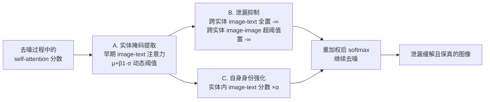

# DeLeaker: Dynamic Inference-Time Reweighting For Semantic Leakage Mitigation in Text-to-Image Models

**会议**: ICLR 2026  
**OpenReview**: [https://openreview.net/forum?id=SXirwhrQyc](https://openreview.net/forum?id=SXirwhrQyc)  
**代码**: [https://venturamor.github.io/DeLeaker](https://venturamor.github.io/DeLeaker)  
**领域**: 图像生成 / 文生图 / 注意力控制  
**关键词**: 语义泄漏, 文生图, Diffusion Transformer, 注意力重加权, 无训练推理干预  

## 一句话总结
DeLeaker 在 DiT 文生图模型的去噪过程中直接对注意力图做动态重加权——抑制实体间的跨实体注意力、强化每个实体的自身身份对齐——从而无需训练、无需外部输入地缓解"语义泄漏"，并配套提出首个专用数据集 SLIM 与一套 VLM 自动评测框架。

## 研究背景与动机
- **领域现状**：扩散式文生图（尤其是 FLUX、SANA 这类 Diffusion Transformer）质量越来越高，但仍受困于"语义泄漏"（semantic leakage）——本应彼此独立的实体之间，语义相关的特征被错误地相互转移。例如"牛和马"的提示里，牛的纹理会渗进马的耳朵和嘴巴。
- **现有痛点**：以往的缓解手段几乎都走"布局控制"路线（给每个实体分配固定 bounding box，切断框之间的注意力）。这类方法在简单场景有效，但一旦实体之间需要互动（拥抱、叠在一起）就失效，而且依赖外部 LLM 生成布局、依赖额外条件输入，还普遍要做昂贵的推理时优化。
- **核心矛盾**：跨实体的注意力既是泄漏的来源，又是产生有意义互动（共享动作、姿态）的必要条件——粗暴地把实体硬性隔离，既不自然又丢弃了模型自身已经学到的语义先验。
- **本文目标**：提出一个轻量、无优化、无外部输入的推理时方法，**只压制"造成泄漏"的那部分跨实体连接，保留有益的互动**，同时不破坏画面结构与模型先验；并解决"没有专用基准、VLM 难以可靠评测泄漏"这一评估空白。
- **核心 idea**：**直接干预注意力**——把泄漏理解成跨模态注意力上的"高频噪声"，用基于统计阈值的动态重加权，在去噪过程中同时做"跨实体抑制"和"自身身份强化"。

## 方法详解

### 整体框架
DeLeaker 完全工作在 DiT 的自注意力机制上，由三步串联组成：先从早期 image-text 注意力里**自动抽出每个实体的掩码**（定位实体该出现的图像 token 区域）；再用这些掩码**抑制跨实体的连接**（同时作用于 image-text 与 image-image 注意力）；最后**强化每个实体文本 token 与自身图像 token 的连接**以巩固身份。三步在去噪的每一步动态施加，无需任何训练或优化。

### 关键设计
**1. 基于注意力的实体掩码提取：用早期注意力定位每个实体在哪里。** 要干预泄漏，先得知道每个文本实体 $e_i$ 在图像里"管辖"哪些 token。DeLeaker 取 softmax 之前的注意力分数 $\text{Attn}$，以图像 token $I$ 为 query、以实体 $i$ 的文本 token 为 key，跨注意力头求平均，再用基于该实体注意力分布均值 $\mu_i$ 与标准差 $\sigma_i$ 的动态阈值挑出归属于它的图像 token：$E^{img}_i = \{q \in I \mid \text{Attn}_{qk} > \mu_i + \beta_1 \cdot \sigma_i,\ k \in (E^{txt}_i \cap I)\}$。作者沿用 UNet 扩散上的观察——即便去噪早期步骤的注意力也足以给出准确掩码——所以只聚合早期若干步形成掩码，再叠加时间平滑（对累积历史图取平均）与空间平滑（滤波），让掩码更稳定连贯。

**2. 跨实体泄漏抑制：只砍掉"高得反常"的跨实体连接。** 跨实体注意力衡量一个实体的图像 token 有多关注另一个实体的文本/图像 token，它既是泄漏主因，也是互动的必要来源，所以目标是"选择性抑制"而非一刀切。作者的假设是：image-image 关系里**异常高的注意力值对应不该有的语义转移（类比高频噪声），而较低的值才是有意义互动的真实信号**。据此用统一的"置零"机制（让对应分数变为 $-\infty$）：跨实体的 image-text 注意力**全部**压掉；跨实体的 image-image 注意力只压掉超过其均值一个标准差（再乘系数 $\beta_2$）的那部分，即 $H^{img\text{-}img}_{ij} = \{(q,k) \mid \text{Attn}_{qk} > \mu_{ij} + \beta_2 \cdot \sigma_{ij},\ q,k \in I\}$。这一步只在实体掩码形成之后才启用。

**3. 自身身份对齐强化：把每个实体"拉回"它自己。** 仅做抑制还不够，DeLeaker 第三步反向加强每个实体文本 token 与其自身图像 token 之间的连接，办法是把相关注意力分数乘上一个 $\alpha > 1$ 的系数。三种干预最终统一写成一条重加权规则：跨实体 image-image 中属于 $H^{img\text{-}img}_{ij}$ 的、以及所有跨实体 image-text 的分数置 $-\infty$；实体内 image-text 分数乘 $\alpha$；其余保持不变：

$$\text{Attn}'_{qk} = \begin{cases} -\infty & q \in E^{img}_i,\, k \in E^{img}_j,\, (q,k) \in H^{img\text{-}img}_{ij} \\ -\infty & q \in E^{img}_i,\, k \in E^{txt}_j \\ \alpha \cdot \text{Attn}_{qk} & q \in E^{img}_i,\, k \in E^{txt}_i \\ \text{Attn}_{qk} & \text{else} \end{cases}$$

消融显示这一"自身身份强化"是贡献最大的干预——它正是让实体在抑制之后不至于丢失辨识度的关键，也使得方法在本来就没有泄漏时几乎不改动图像、保持非侵入性。

## 实验关键数据
主实验在 FLUX.1-DEV 上、SLIM 的 pair 子集（840 样本）评测，并用 60 个样本做了 980 份人评。

### 主实验表格（语义泄漏自动评测 + 保真度，越宽越好/箭头为期望方向）

| 方法 | 类型 | Mitigation Major↑ | Degradation Major↓ | VQAScore↑ | LPIPS↓ | KID(·10⁻²)↓ |
|------|------|------|------|------|------|------|
| RAG-Diffusion | 布局 | 17.55% | 64.91% | 0.72 | 0.09 | — |
| RPF | 布局 | 20.74% | 38.38% | 0.64 | 0.53 | — |
| 3DIS | 布局 | 29.08% | 45.05% | 0.76 | 0.96 | — |
| QwenFLUX | 图像条件 | 17.28% | 46.60% | 0.61 | 0.46 | — |
| Instruction Prompt | 提示 | 23.92% | 19.88% | 0.64 | 0.33 | 0.00 |
| Entity Description Prompt | 提示 | 35.60% | 18.45% | 0.62 | 0.41 | 0.00 |
| **DeLeaker** | **无训练注意力** | **46.07%** | **12.98%** | **0.68** | **0.22** | **0.00** |
| DeLeaker + Description | 注意力+提示 | 53.57% | 15.36% | 0.65 | 0.43 | 0.01 |

DeLeaker 取得最高缓解率与最低退化率，人评中 67.8% 的样本被判为有改善；同时 LPIPS 最低（0.22，最贴近原图）、VQAScore 最高（0.68）、KID 为 0.00（不牺牲画质）。

### 消融实验表格（相对完整 DeLeaker 的比值，越接近 1 越相似）

| 配置 | Major Improvement↑ |
|------|------|
| DeLeaker（完整） | 1.00 |
| W/O Image-Text (+)（去掉自身强化） | 0.54 |
| W/O Image-Text (-)（去掉跨实体抑制） | 0.93 |
| Only Image-Text (+)（只留自身强化） | 0.90 |
| Only Image-Text (-)（只留跨实体抑制） | 0.54 |
| Only Image-Image (-)（只留 image-image 抑制） | 0.26 |

### 关键发现
- **自身身份强化（image-text +）是最关键的一步**：单独使用就能达到 0.90 的 major 改善比；去掉它则掉到 0.54（下降 46%）。
- **跨实体 image-text 抑制是第二关键**：去掉造成约 29% 的改善损失，单独用也贡献 0.54 且几乎无退化。
- **同模态干预作用有限**：压制 text-text 反而掉 9%–20%，弱化 image-image 影响小且不稳定——说明 DiT 里的语义泄漏主要源于**跨模态对齐失败**，而非某个模态内部。
- **泛化性**：换到 SANA 上同样有效；用在本就无泄漏的图像上改动可忽略，保持非侵入。

## 亮点与洞察
- **把泄漏诊断到"跨模态对齐失败"**：通过细致消融指出根因不在任何单一模态内部，而在 image 与 text 之间的对齐，给后续工作指了明确方向。
- **"抑制 + 强化"双向协同**：只压不强会丢身份，只强不压会保留泄漏，两者配合才能在缓解泄漏的同时维持辨识度与保真度。
- **真正无外部依赖**：相比依赖 bounding box、外部 LLM、深度图的布局类方法，DeLeaker 只用模型自身的注意力统计量，反而把它们都打败了。
- **配套数据集 + 评测框架填补空白**：SLIM 是首个专门面向视觉语义泄漏的数据集（1,130 个人工核验样本，5 个子集），并用"差异提取→典型性评估→对比排序"的分步 VLM 流水线，把 VLM 不擅长的细粒度视觉对比转化为更可靠的文本推理，并用 980 份人评验证（Spearman ρ=0.432）。

## 局限与展望
- 评测高度依赖外部 VLM（Gemini 1.5），人机一致性在"改善方向"上吻合但在"幅度（minor vs major）"上有分歧，自动分数仍是代理而非真值。
- 多实体（triplet）场景会同时引入"实体计数错误"等其它问题，泄漏评估被混淆，因此主评测聚焦在 pair 子集。
- 数据集主要围绕动物、果蔬等细粒度类别构造，对更开放、更复杂场景的覆盖有限。
- 阈值/系数（$\beta_1, \beta_2, \alpha$）依据少量外部样本经验设定，缺乏自适应机制。

## 相关工作与启发
- **布局控制类**（RPF、RAG-Diffusion、3DIS、Dahary 等）：用 bounding box 隔离实体，启发了"分而治之"思路，但暴露了刚性隔离破坏互动、依赖外部输入的弱点，正是 DeLeaker 想绕开的。
- **注意力操控类**（Prompt-to-Prompt、Attend-and-Excite 等）：证明扩散注意力图可被编辑用于可控生成；DeLeaker 把这一思路从 UNet 迁移到 DiT，并专门服务于泄漏抑制。
- **VLM 评测**：借鉴"把复杂视觉判断拆成离散逻辑步、靠文本模态推理"的做法来对抗 VLM 视觉模态的不稳定性。
- **启发**：对生成可控性问题，先把现象精确定位到某种内部表示（这里是跨模态注意力），再设计最小、可逆、统计驱动的推理时干预，往往比堆外部条件或做昂贵优化更有效。

## 评分
- **新颖性**: ⭐⭐⭐⭐ 把语义泄漏首次系统迁移到 DiT 场景，提出无训练的双向注意力重加权，并配套首个专用数据集与评测框架，组合很完整。
- **实验充分度**: ⭐⭐⭐⭐ 覆盖多类布局/提示基线、双模型（FLUX+SANA）、980 份人评与细致消融，根因分析有说服力；多实体场景评测受限略减分。
- **写作质量**: ⭐⭐⭐⭐ 动机—方法—评测三段逻辑清晰，公式与图示到位，消融结论直接落到"跨模态对齐"这一洞见。
- **价值**: ⭐⭐⭐⭐ 即插即用、无需训练、无外部依赖即可缓解一个被长期忽视的问题，对实用文生图系统的语义精确性有直接帮助。

<!-- RELATED:START -->

## 相关论文

- [\[ICLR 2026\] Inference-Time Scaling of Diffusion Models Through Classical Search](inference-time_scaling_of_diffusion_models_through_classical_search.md)
- [\[ICLR 2026\] Diffusion Blend: Inference-Time Multi-Preference Alignment for Diffusion Models](diffusion_blend_inference-time_multi-preference_alignment_for_diffusion_models.md)
- [\[ICLR 2026\] RNE: plug-and-play diffusion inference-time control and energy-based training](rne_plug-and-play_diffusion_inference-time_control_and_energy-based_training.md)
- [\[ICLR 2026\] Mitigating Semantic Collapse in Generative Personalization with Test-Time Embedding Adjustment](mitigating_semantic_collapse_in_generative_personalization_with_test-time_embedd.md)
- [\[ICLR 2026\] Compositional Visual Planning via Inference-Time Diffusion Scaling](compositional_visual_planning_via_inference-time_diffusion_scaling.md)

<!-- RELATED:END -->
