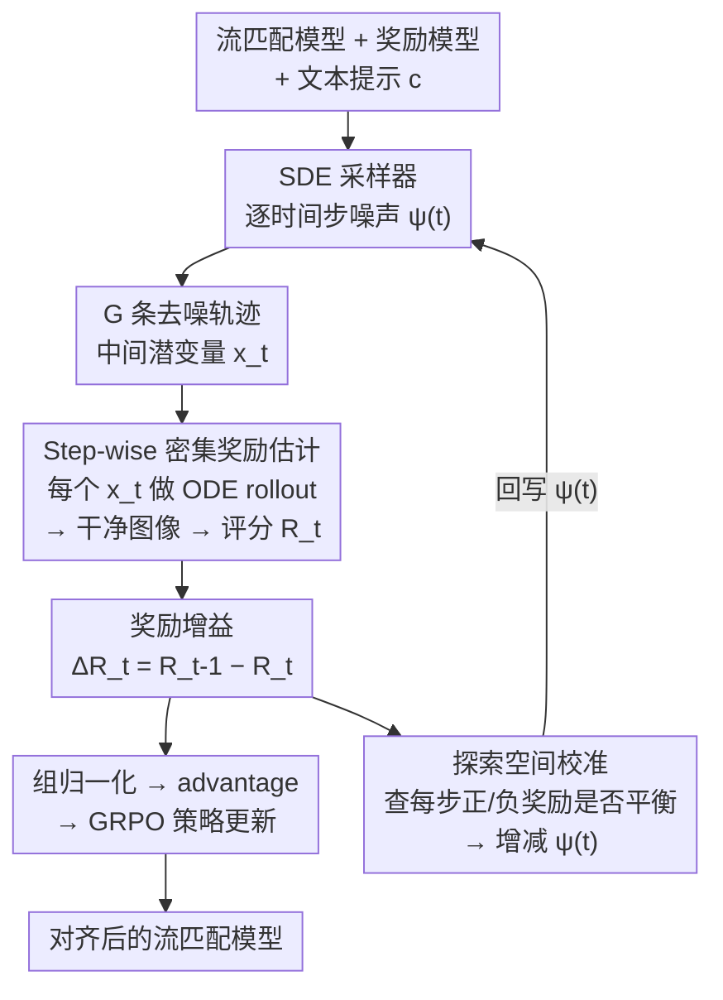

# DenseGRPO: From Sparse to Dense Reward for Flow Matching Model Alignment

**会议**: ICLR 2026  
**arXiv**: [2601.20218](https://arxiv.org/abs/2601.20218)  
**代码**: 无  
**领域**: 扩散模型 / RLHF 对齐  
**关键词**: GRPO, dense reward, flow matching, human preference alignment, exploration calibration  

## 一句话总结
解决 Flow Matching + GRPO 对齐中的稀疏奖励问题：通过 ODE 去噪预测中间潜变量的 step-wise 奖励增益作为密集奖励，并根据密集奖励自适应调整 SDE 采样器的逐时间步噪声注入来校准探索空间，在人类偏好对齐/组合生成/文字渲染三个任务上超越 Flow-GRPO。

## 研究背景与动机

**领域现状**：GRPO 已成为 flow matching 模型人类偏好对齐的主流方法（Flow-GRPO、DanceGRPO），通过将确定性 ODE 采样器转为 SDE 采样器实现随机探索，然后用组归一化的奖励信号优化策略。

**现有痛点**：现有 GRPO 方法只在轨迹末端（最终生成图像）计算一个稀疏奖励 $R^i$，然后将此奖励直接用于优化所有中间去噪步。但 $R^i$ 是全部 $T$ 步去噪的累积贡献，将其分配给单个步时存在"反馈-贡献不匹配"。

**核心矛盾**：全局轨迹级奖励 vs 局部步级贡献的 mismatch。此外，SDE 采样器的统一噪声级别设置无法适应去噪过程的时变特性——某些时间步可能探索空间过大（所有样本奖励为负），某些时间步探索不足。

**本文目标** (a) 估计每个去噪步的密集奖励（step-wise contribution） (b) 根据密集奖励校准每个时间步的探索空间

**切入角度**：利用 ODE 的确定性——给定中间潜变量 $x_t$，ODE 去噪轨迹唯一确定，所以可以对中间潜变量做 ODE rollout 得到干净图像并用奖励模型评分，从而得到每步的奖励增益。

**核心 idea**：每步的贡献 = 该步之后的预期奖励 - 该步之前的预期奖励（奖励增益），通过 ODE rollout 估计。

## 方法详解

### 整体框架

DenseGRPO 想解决的是：Flow-GRPO 这类方法只在轨迹末端拿到一个稀疏奖励，却要拿它去优化全部 $T$ 步去噪，导致"反馈-贡献不匹配"。它的做法是在同一套 Flow-GRPO 框架里插两件事——先把单个末端奖励拆成每一步的密集奖励，再用这些密集奖励反过来调每一步的探索强度。

整体流程是：给定流匹配模型、奖励模型和文本提示，先用带时间步自适应噪声级别 $\psi(t)$ 的 SDE 采样器采出 $G$ 条轨迹；对每条轨迹的每个中间潜变量 $x_t^i$ 做 ODE rollout 得到干净图像并由奖励模型评分 $R_t^i$，相邻两步的奖励之差 $\Delta R_t^i = R_{t-1}^i - R_t^i$ 就是该步的密集奖励；最后用 $\Delta R_t^i$ 替代稀疏奖励 $R^i$ 做组归一化与策略优化。两个改进互相支撑：密集奖励既是更细的训练信号，也是探索校准赖以判断每步正负样本是否平衡的依据。

### 关键设计

**1. Step-wise 密集奖励估计：把末端的单个奖励拆成每一步的贡献**

稀疏奖励 $R^i$ 是 $T$ 步去噪的累积结果，硬塞给某一步并不公平。DenseGRPO 借 ODE 的确定性来给每一步单独打分：给定中间潜变量 $x_t^i$，ODE 去噪轨迹是唯一确定的，于是对它做 $n$ 步 ODE 去噪 $\hat{x}_{t,0}^i = \text{ODE}_n(x_t^i, c)$ 拿到一张干净潜变量，解码成图像后直接用现有奖励模型评分 $R_t^i = \mathcal{R}(\hat{x}_{t,0}^i, c)$。把相邻两步的分数相减，$\Delta R_t^i = R_{t-1}^i - R_t^i$，就得到这一步"往好里推了多少"的密集奖励。

这样做的好处是不必训练额外的 critic 来估计中间状态价值——ODE 的"潜变量→干净图像"一一映射已经把每个中间状态映回了奖励模型熟悉的干净图像域，而现有奖励模型本来就是为干净图像设计的，可以零适配地直接用。代价是 rollout 的步数要够：实验里多步 ODE（取 $n=t$）明显比单步准确，单步去噪偏离干净图像域太远，奖励模型评分不可信。

**2. 探索空间校准：让每个时间步的探索强度随密集奖励自适应**

SDE 采样器原本对所有时间步用同一个噪声级别 $a$，但去噪过程是时变的：在接近终端的时间步（如 timestep=2），$a=0.7$ 会让探索空间过大，采出的样本全是坏样本、奖励清一色为负，组内拿不到任何正信号就学不到有效策略。DenseGRPO 把统一的 $a$ 换成时间步特定的 $\psi(t)$，并用一条简单规则来调：以"该时间步正奖励数 ≈ 负奖励数"为目标，若正负已大致平衡就增大 $\psi(t)$ 继续扩大探索，否则减小 $\psi(t)$ 收缩探索。靠每步的密集奖励才能算出这里的正负样本比例，所以这个校准正是建立在上一个设计之上，确保每个时间步都有合理的正负信号供 GRPO 学习。

### 损失函数 / 训练策略

- 标准 GRPO 损失（Eq. 4），但 advantage 用密集奖励增益计算（Eq. 10）
- $T=10$ 采样步，$G=24$ 组大小，512 分辨率
- KL 系数 $\beta$：组合生成和文字渲染 0.04，人类偏好 0.01
- ODE rollout 步数 $n=t$（每步做完整 rollout）

## 实验关键数据

### 主实验（基于 SD3.5-M）

| 任务 | 指标 | Flow-GRPO | Flow-GRPO+CoCA | **DenseGRPO** |
|------|------|-----------|---------------|-------------|
| 组合生成 | GenEval ↑ | 0.95 | 0.96 | **0.97** |
| 文字渲染 | OCR Acc. ↑ | 0.92 | 0.93 | **0.95** |
| 人类偏好 | PickScore ↑ | 23.31 | 23.63 | **24.64** |
| 人类偏好 | Aesthetic ↑ | 5.92 | 6.22 | **6.35** |
| 人类偏好 | ImageReward ↑ | 1.28 | 1.32 | **1.41** |

### 消融实验

| 配置 | PickScore | 说明 |
|------|-----------|------|
| DenseGRPO (完整, n=t) | **最优** | 多步 ODE rollout |
| n=2 步 ODE | 次优 | 2 步近似 |
| n=1 步 ODE | 劣于 Flow-GRPO | 单步估计不准 |
| 无探索校准 | 次优 | 统一噪声 |
| Flow-GRPO (baseline) | baseline | 稀疏奖励 |

### 关键发现
- **人类偏好对齐任务提升最显著**：PickScore 从 23.31→24.64（+1.33），说明密集奖励在需要精细化调整的任务上益处最大
- ODE rollout 步数至关重要：单步 ODE（$n=1$）反而比 Flow-GRPO 差，因为单步去噪偏离干净图像域，奖励模型评估不准
- 探索空间校准可进一步提升性能，尤其在接近终端的时间步
- 在 FLUX.1-dev 和 1024 分辨率上也有效，证明可扩展性
- 存在 reward hacking 风险：密集奖励更精确地优化奖励，但也更容易过拟合奖励模型

## 亮点与洞察
- **ODE 确定性的巧妙利用**：不需要训练 critic 网络，直接用 ODE rollout + 现有奖励模型就能估计中间步奖励。这个思路简洁且实用——任何能评价干净图像的奖励模型都可以无缝嵌入。
- **密集奖励揭示了探索空间问题**：没有密集奖励就无法发现统一噪声设置不合理，密集奖励不只是更好的信号，还是诊断工具。
- **奖励增益作为步级 credit assignment**的思路可以迁移到视频生成等更长轨迹的场景中。

## 局限与展望
- ODE rollout 增加了显著计算开销（每步做 $t$ 步 ODE 去噪 + VAE 解码 + 奖励模型前向），实际训练成本可能是 Flow-GRPO 的数倍
- 密集奖励更容易导致 reward hacking（作者在补充材料中承认）
- 探索校准的增减规则过于简单（ε 级调整），可能在不同任务/模型上不够稳健
- 仅在 flow matching 模型上验证，能否迁移到 DDPM 等传统扩散模型未探索

## 相关工作与启发
- **vs Flow-GRPO**: 直接改进，同一框架下用密集奖励替代稀疏奖励。人类偏好任务 PickScore 提升 1.33。
- **vs CoCA**: CoCA 也尝试分配步级信号，但仍使用轨迹级奖励按潜变量相似度分配，优化 mismatch 未根本解决。DenseGRPO 的奖励增益方案更直接。
- **vs TempFlow-GRPO**: 通过轨迹分支提供步级奖励，但仍用轨迹级信号优化步级。DenseGRPO 的 ODE rollout 方案更精确。

## 评分
- 新颖性: ⭐⭐⭐⭐ ODE rollout 估计密集奖励思路新颖实用，探索校准方案有洞察力
- 实验充分度: ⭐⭐⭐⭐ 三个任务、消融研究、FLUX.1-dev 验证、高分辨率扩展全面
- 写作质量: ⭐⭐⭐⭐ 问题动机清晰，Fig 3 的可视化直观展示了探索空间问题
- 价值: ⭐⭐⭐⭐⭐ 对 GRPO 对齐范式的重要改进，密集奖励是正确方向

<!-- RELATED:START -->

## 相关论文

- [\[ICLR 2026\] Delay Flow Matching](delay_flow_matching.md)
- [\[ICLR 2026\] Flow Matching with Semidiscrete Couplings](flow_matching_with_semidiscrete_couplings.md)
- [\[ICLR 2026\] Value Matching: Scalable and Gradient-Free Reward-Guided Flow Adaptation](value_matching_scalable_and_gradient-free_reward-guided_flow_adaptation.md)
- [\[ICLR 2026\] GLASS Flows: Efficient Inference for Reward Alignment of Flow and Diffusion Models](glass_flows_reward_alignment_diffusion.md)
- [\[ICLR 2026\] Carré du champ Flow Matching: 用几何感知噪声改善生成模型的质量-泛化权衡](carré_du_champ_flow_matching_better_quality-generalisation_tradeoff_in_generativ.md)

<!-- RELATED:END -->
