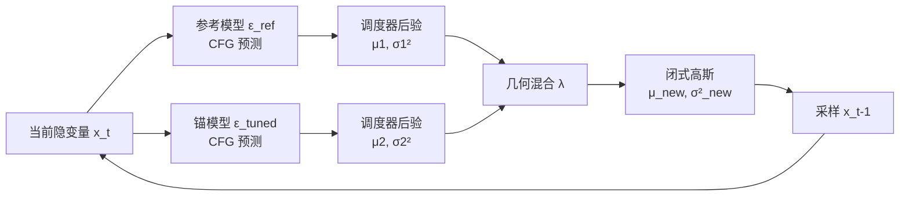

# DeRaDiff: Denoising Time Realignment of Diffusion Models

**会议**: ICLR 2026  
**OpenReview**: [https://openreview.net/forum?id=TL4cvNviw6](https://openreview.net/forum?id=TL4cvNviw6)  
**代码**: [github.com/itsShahain/DeRaDiff](https://github.com/itsShahain/DeRaDiff)  
**领域**: 图像生成 / 扩散模型对齐  
**关键词**: 扩散模型, RLHF, KL 正则, 推理时对齐, decoding-time realignment, 奖励黑客  

## 一句话总结
DeRaDiff 把语言模型里的"解码时再对齐"搬到扩散模型上：只对齐一次，就能在采样时用一个标量 $\lambda$ 在线模拟出任意 KL 正则强度训练出的对齐模型，从而免去昂贵的正则强度扫参。

## 研究背景与动机
- **领域现状**：把扩散模型与人类偏好对齐（提升美感、减少伪影偏见）已成主流，通常表述为"最大化奖励 + KL 正则约束不偏离预训练先验"，正则强度 $\beta$ 控制这个权衡。
- **现有痛点**：$\beta$ 选不好——太大则对齐不足、模型欠适配；太小则发生 "reward hacking"（奖励刷高但图像质量崩坏）。找到合适的 $\beta$ 需要在多个强度下分别从头对齐，再挑最好的，对大扩散模型而言代价高得离谱（论文测得 SDXL 单个 $\beta$ 约 336 GPU 小时）。
- **核心矛盾**：正确的正则强度高度依赖任务且无法先验确定，但扫参的搜索成本与对齐训练成本成倍叠加。
- **本文目标**：只对齐一次，就能在**推理时**廉价地探索整条正则强度谱，定位最优 $\beta$，避免重复从头训练。
- **核心 idea**：**【推理时几何混合】** 借鉴语言模型的 decoding-time realignment（把参考分布与对齐分布按互补幂次几何混合），把它推广到扩散模型的连续隐变量迭代去噪过程，推导出每一步可解析、闭式的高斯更新，由单一可调参数 $\lambda$ 在线控制有效正则强度。

## 方法详解

### 整体框架
DeRaDiff 同时持有一个参考模型 $p_\text{ref}$（预训练）和一个在某个 $\beta$ 下对齐好的"锚模型" $p_\theta[\beta]$。采样时，每一步去噪都把这两个模型的后验做几何混合，混合权重由 $\lambda$ 决定：$\lambda=0$ 回到参考模型、$\lambda=1$ 回到锚模型、$0<\lambda<1$ 是稳定的凸插值（等效正则强度为 $\beta/\lambda$）、$\lambda>1$ 则外推到更弱正则。混合后的后验在常见调度器下仍是高斯，因此存在闭式均值/方差更新，整个流程零额外训练。

### 关键设计

**1. 从全样本几何混合到逐步近似：让插值变得可计算。** 理想的再对齐模型是参考与对齐两个全样本分布的归一化几何混合 $p^*_\theta[\beta/\lambda](x_0|c)\propto p_\text{ref}(x_0|c)^{1-\lambda}\,p^*_\theta[\beta](x_0|c)^{\lambda}$，但直接算它需要对所有中间隐变量做边缘化，对扩散模型不可解。作者的关键一步是把同样的几何混合**搬到每一个去噪步**上，对逐步后验做近似：$\hat p_\theta[\beta/\lambda](x_{t-1}|x_t,c)\propto p_\text{ref}(x_{t-1}|x_t,c)^{1-\lambda}\,p^*_\theta[\beta](x_{t-1}|x_t,c)^{\lambda}$。这把一个全局不可解的积分换成了一串局部可算的步级混合，物理含义清晰——每一步都在"贴近先验"和"追随奖励"之间按 $\lambda$ 调权重。

**2. 闭式高斯后验（Theorem 1）：两个高斯的几何混合还是高斯。** 这是全文的理论支点。设参考后验 $p_\text{ref}=\mathcal N(\mu_1,\sigma_1^2 I)$、对齐后验 $p^*_\theta[\beta]=\mathcal N(\mu_2,\sigma_2^2 I)$，把两者按 $1-\lambda$ 与 $\lambda$ 幂次相乘，指数项恰好凑成一个新的二次型，于是混合结果仍是高斯，且参数闭式可写：

$$\Sigma_\text{new}=\left(\frac{1-\lambda}{\sigma_1^2}+\frac{\lambda}{\sigma_2^2}\right)^{-1}I,\quad \mu_\text{new}=\Sigma_\text{new}\left(\frac{1-\lambda}{\sigma_1^2}\mu_1+\frac{\lambda}{\sigma_2^2}\mu_2\right)$$

即逆方差（精度）做线性插值、均值做精度加权平均。当 $\lambda\in[0,1]$ 时 $\Sigma_\text{new}$ 严格正定（Corollary 1），保证后验合法；并且 DDIM/DDPM 等确定性调度器的后验变换不破坏高斯性，所以这套更新能逐步迭代套用到整条采样轨迹上。

**3. 单标量在线调控与外推的边界。** 整个再对齐只暴露一个旋钮 $\lambda$，等效正则强度为 $\beta/\lambda$，可在采样途中任意切换而无需重训。$\lambda=0$ 恢复先验、$\lambda=1$ 恢复锚模型、$0<\lambda<1$ 是凸组合（log 密度的凸组合，最稳、效果最好）。$\lambda>1$ 时 $1-\lambda<0$ 使组合不再是凸组合，新协方差可能失去正定性、变得病态，进而画质退化并诱发类似 reward-hacking 的伪影——这与"正则太弱"的直觉完全吻合。因此 Theorem 1 的假设明确限定 $\lambda\in[0,1]$，但实验显示中等幅度的 $\lambda>1$ 在失稳前仍能近似更弱正则的模型。

**4. 采样算法与多奖励扩展。** Algorithm 1 给出完整流程：每步对参考与锚模型各做一次 CFG 预测 $\epsilon_\text{ref}$、$\epsilon_\text{tuned}$，经调度器后验得到 $(\mu_1,\sigma_1^2)$、$(\mu_2,\sigma_2^2)$，再用 Corollary 1 的标量闭式算 $\sigma_\text{new}^2,\mu_\text{new}$，最后 $x_{t-1}=\mu_\text{new}+z\sqrt{\sigma_\text{new}^2}$。推导不要求 $\sigma_1^2=\sigma_2^2$，因此天然支持参考/对齐方差不等的更一般情形；作者进一步证明该几何混合可扩展到多奖励建模（附录 A.4）。

## 实验关键数据

实验以 SDXL 1.0（及附录的 SD1.5）为底座，用 DiffusionDPO 在 $\beta\in\{500,1000,2000,5000,8000,10000\}$ 上各从头对齐一个模型；取其中一个作锚模型，用 DeRaDiff 调 $\lambda$ 去近似其它强度，并与"从头对齐"的真值比较。评测用 500 条来自 Pick-a-Pic v1 + HPS 的 prompt，指标为 PickScore、HPS v2、CLIP。

### 主实验表格（$\lambda\in[0,1]$ 训练-免费近似误差）

| 模型 | CLIP MAE | CLIP MAE(% of μ) | HPS MAE | HPS MAE(% of μ) | PickScore MAE | PickScore MAE(% of μ) |
|---|---|---|---|---|---|---|
| SDXL | 0.001604 | 0.430% | 0.000770 | 0.265% | 0.000355 | 0.154% |
| SD1.5 | 0.001557 | 0.448% | 0.001175 | 0.425% | 0.000718 | 0.332% |

所有指标的平均绝对误差均 < 0.02 绝对值、且相对均值 < 0.5%，说明 $\lambda\in[0,1]$ 时 DeRaDiff 几乎完美复现从头对齐模型的平均行为。

### 消融实验表格（锚 $\beta=2000$ 近似各目标 $\beta$ 的绝对误差%）

| 指标 | β=500 | β=1000 | β=2000 | β=5000 | β=8000 | β=10000 |
|---|---|---|---|---|---|---|
| PickScore | 1.3451 | 0.7831 | 0.0000 | 0.0611 | 0.1399 | 0.0987 |
| HPS | 0.5890 | 0.0299 | 0.0000 | 0.1701 | 0.2688 | 0.2061 |
| CLIP | 0.4022 | 0.5077 | 0.0000 | 0.3041 | 0.0310 | — |

近似在**目标 $\beta$ 高于锚 $\beta$**（即 $\lambda\in[0,1]$ 凸插值方向）时最准；目标 $\beta$ 低于锚（$\lambda>1$ 外推）时误差略升，与理论一致。

### 关键发现
- **撤销 reward hacking**：用一个被奖励黑客的小 $\beta$ 模型当锚、取较小 $\lambda$，可把图像拉回更强正则（如 $\beta=2000$）的样子，恢复细节与风格（Fig. 7）。
- **误差极小**：PickScore 近似中位误差 $2.83\times10^{-4}$（约为其标准差的 20%），约 87% 的近似误差 $\le5\times10^{-4}$；CLIP 的 Bland–Altman 无系统性偏差，平均差仅 $-0.273\%\,\mu$。
- **算力节省**：SDXL 单个 $\beta$ 从头对齐 ≈336 GPU 小时（≈188.7 EFLOPs）；DeRaDiff 只对齐一次即可在线遍历整条正则谱，把多次扫参的训练成本几乎全部省去。

## 亮点与洞察
- **把离散 logit 混合升级成连续轨迹混合**：语言模型的 realignment 只需混合一步 token 分布；扩散模型是连续隐变量的多步去噪，作者用"步级几何混合 + 高斯闭式"巧妙绕开了全样本边缘化的不可解性。
- **一个标量、零重训、可在线切换**：$\lambda$ 像一个"对齐强度旋钮"，把昂贵的离线超参扫描变成几乎免费的推理时探索，且能在生成途中动态调节。
- **理论边界与经验现象自洽**：$\lambda>1$ 失去正定性 ↔ reward-hacking 伪影，这种"数学不稳定对应视觉退化"的对应关系让方法的可用区间非常清楚（首选 $\lambda\in[0,1]$）。
- **首次在 DDPM 范式下给出步级再对齐的闭式后验**：区别于此前 SDE/score-based 路线（Diffusion Blend），补上了 DDPM 范式的理论缺口。

## 局限与展望
- **外推区不可靠**：$\lambda>1$ 时协方差可能非正定，近似精度下降并可能产生伪影，方法主要保证在 $\lambda\in[0,1]$ 内有效，向"更弱正则"方向探索受限。
- **依赖高斯/各向同性假设**：闭式后验建立在"逐步后验近似为（标量/对角）高斯"之上，非高斯调度器或强相关协方差下结论未必成立。
- **需要双模型推理**：每步要同时跑参考与锚两套 CFG 预测，单次采样的推理算力翻倍（但相对一次次从头训练仍远更省）。
- **逐步近似的累积误差**：步级混合是对全样本混合的近似，存在 RLHF 分数匹配很好但视觉不完全一致的边缘情形。
- **展望**：扩展到非高斯/流匹配范式、更稳健的 $\lambda>1$ 外推、以及多奖励在线调权的系统评测都是自然方向。

## 相关工作与启发
- **扩散对齐**：DDPO、DRaFT、DPOK、AlignProp、Diffusion DPO 研究如何高效对齐，但都把 $\beta$ 当作需要扫参确定的固定超参；DeRaDiff 正是为这类方法提供"免重训扫参"的配套工具。
- **解码时控制**：基于预训练扩散 + 外部网络、或用 SMC 从奖励分布采样的推理时方法，多数不利用"已对齐的条件模型"这一信息；DeRaDiff 恰恰把对齐模型当锚来复用。
- **语言模型 realignment**（Liu et al. 2024）是直接思想来源；Diffusion Blend 在 score-based SDE 下做过类似事，本文补上 DDPM 范式的闭式步级后验，理论上更完整。
- **启发**：把"训练时超参"转化为"推理时旋钮"是降本的一类通用范式——只要能找到训练目标在参数上的闭式插值结构，就可能把昂贵的离线扫参搬到几乎免费的在线推理。

## 评分
- **新颖性**: ⭐⭐⭐⭐ 把 decoding-time realignment 从离散 token 严谨推广到连续扩散轨迹，并首次在 DDPM 范式给出步级闭式高斯后验，理论贡献扎实。
- **实验充分度**: ⭐⭐⭐⭐ 覆盖 SDXL/SD1.5、6 档 $\beta$、3 个偏好/语义指标，并用 ECDF/散点/Bland–Altman 做统计faithfulness 检验，且量化了算力节省；略欠的是大规模人评与外推区的系统分析。
- **写作质量**: ⭐⭐⭐⭐ 动机—理论—算法—实验链条清晰，定理与推论对 $\lambda$ 行为的解释到位；部分实验细节散落附录、图较多。
- **价值**: ⭐⭐⭐⭐ 直击"扩散对齐扫参贵"这一真实痛点，给出近乎免费的推理时探索工具，并能撤销 reward hacking，实用性强。

<!-- RELATED:START -->

## 相关论文

- [\[ICLR 2026\] Inference-Time Scaling of Diffusion Models Through Classical Search](inference-time_scaling_of_diffusion_models_through_classical_search.md)
- [\[ICLR 2026\] Asynchronous Denoising Diffusion Models for Aligning Text-to-Image Generation](asynchronous_denoising_diffusion_models_for_aligning_text-to-image_generation.md)
- [\[ICLR 2026\] Latent Denoising Makes Good Tokenizers](latent_denoising_makes_good_tokenizers.md)
- [\[ICLR 2026\] Mitigating Noise Shift in Denoising Generative Models with Noise Awareness Guidance](mitigating_noise_shift_in_denoising_generative_models_with_noise_awareness_guida.md)
- [\[ICLR 2026\] Diffusion Blend: Inference-Time Multi-Preference Alignment for Diffusion Models](diffusion_blend_inference-time_multi-preference_alignment_for_diffusion_models.md)

<!-- RELATED:END -->
