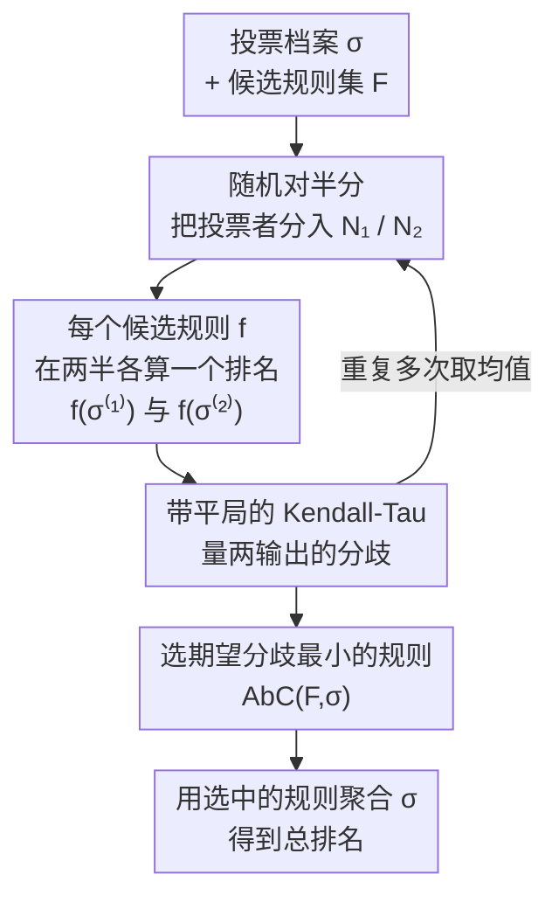

# Designing Rules to Pick a Rule: Aggregation by Consistency

**会议**: ICLR2026  
**OpenReview**: [https://openreview.net/forum?id=xxsacQ3tdb](https://openreview.net/forum?id=xxsacQ3tdb)  
**代码**: 待确认  
**领域**: 学习理论 / 社会选择 / 排名聚合  
**关键词**: 排名聚合, 社会选择, 规则选择, 一致性, 公理化分析

## 一句话总结
面对一大堆各有优劣的排名聚合规则（Borda、plurality、veto……）却不知道该用哪个的难题，本文提出"挑规则的规则"（RPR）这一全新框架，并给出一个具体方案 AbC——把投票者随机对半分两组，谁在两组上算出的排名最一致就选谁，从而无需事先承诺任何公理或生成模型，就能为每份数据自动挑出最合适的聚合规则。

## 研究背景与动机
**领域现状**：把多个评估者（人类标注者、benchmark、评审）给出的排名/打分聚合成一个总排名，是 AI 里反复出现的基础问题——RLHF 把人类偏好聚合成 reward model，constitutional AI 把多条原则的排名聚合，评估 AI agent 时把多个 benchmark 当作"评估者"聚合，同行评审把多位 reviewer 的排序聚合成录用决定。社会选择和统计学已经造出了海量聚合方法，每个都有自己漂亮的性质，但也都有自己的软肋。

**现有痛点**：不同方法在同一份数据上可能给出**天差地别**的总排名，直接影响最终结果——RLHF 和 agent 评估中都观察到过"选错方法导致结果与评估者意见相悖"的现象。可问题是，到底怎么判断一个聚合方法"好不好"、该用哪个？现有两条路都有硬伤。

**核心矛盾**：第一条是**公理化路线**——先选定若干希望满足的公理，再设计满足它们的规则；但 Arrow、Gibbard-Satterthwaite 等著名不可能定理证明了一些基本公理本就互相矛盾，"理想规则"根本不存在，而即便公理可同时满足，也常有多个规则都满足、选哪个又变得任意。第二条是**统计路线**——把排名看成对某个客观真值的含噪估计（Plackett-Luce、Mallows 等噪声模型），选最大化数据似然的排名；但它假设存在唯一 ground truth，这在 AI 对齐这类"合理的意见分歧"场景里根本站不住，而且很多有良好性质的投票规则压根不是任何噪声模型的 MLE，直接被这条路线排除在外。

**本文目标**：换一个问法——既然规则多、又没有先验的优选依据，那么在给定场景下，**如何挑出该用哪个规则**？也就是：什么才是一个好的"规则选择规则"（Rule Picking Rule, RPR）？

**切入角度**：作者注意到，"挑规则"而非"挑排名"本身就有三重好处：① 可解释性更强——能形式化地说明为什么没采用其他规则；② 不同（都合理的）规则适配不同场景，RPR 提供了有原则的取舍方式；③ 框架可以从**任意**规则集合里挑，新规则随时能并入。而判断规则好坏的抓手，作者锁定在**一致性**——如果把数据收集过程重做一遍，好规则应该给出相近的结果。

**核心 idea**：把投票者随机分成两半当作"过程重做了一次"，挑出在两半上输出最一致（分歧最小）的那个规则——用一致性作为质量的代理，绕开"承诺公理"和"假设真值"两道坎。

## 方法详解

### 整体框架
本文要解决的不是"输出哪个排名"，而是上一层的"该用哪个聚合规则"。作者先把这个元问题形式化为 RPR：给定一组候选规则 $F$（每个规则是一个把投票档案映射成排名的社会福利函数 SWF）和一份投票档案 $\sigma$，RPR 是一个函数 $Z(F,\sigma)\subseteq F$，从候选里挑出（可能不止一个）适合当前数据的规则。候选规则集合就相当于机器学习里的假设类，框架对它不加任何限制。

在这个框架下，作者实例化出 AbC（Aggregation by Consistency）。它的运转极其朴素：把全体投票者均匀随机地分到两组 $N_1,N_2$，分别得到两个子档案 $\sigma^{(1)},\sigma^{(2)}$，把每个候选规则在两个子档案上各跑一遍，量出两个输出排名之间的分歧（用带平局的 Kendall-Tau 距离），最后选**期望分歧最小**的那个规则：

$$\text{AbC}(F,\sigma)=\arg\min_{f\in F}\ \mathbb{E}\big[\,\text{KT}\big(f(\sigma^{(1)}),\,f(\sigma^{(2)})\big)\,\big],$$

期望取在随机对半分上。关键之处在于，这个算法对规则的输入/输出类型完全不可知——它只需要一个能比较两个输出的"分歧度量"，所以排名、打分、approval set 都能用，输出可以是总排名、单一胜者、reward 函数。本文聚焦"输出总排名"这一具体情形做分析与实验。框架图给出 AbC 的核心算法流程：

### 关键设计

**1. RPR 框架：把问题从"挑排名"抬高到"挑规则"**

以往文献几乎都在"挑一个聚合排名"，本文的第一层创新是把决策对象上移一层，明确地"挑一个规则"。形式上，SWF 是把档案 $\sigma\in L(A)^n$ 映成一个弱排名（允许平局，这样能在不破坏中立性/匿名性的前提下返回单一排名）；RPR 则是 $Z(F,\sigma)\subseteq F$，从候选规则里选子集，平局时再用一个 tie-breaking 顺序定下唯一规则。这个抬升带来的好处不是修辞——它让"为什么不用别的规则"变成可形式化论证的对象，让"不同场景配不同规则"有了统一接口，也让候选集合可以像假设类一样随时扩充。框架对候选集不设限：你可以只放某噪声模型的 MLE，也可以只放满足某些公理的投票规则，于是后面公理化路线和统计路线的好处都能被"借"回来。

**2. 一致性即质量：AbC 用随机对半分逼近"过程重做一遍"**

挑规则需要一个质量信号，AbC 选的是一致性——若数据收集重来一次，好规则应给出相近结果。难点在于现实中往往只有一份数据、没法真的重做。AbC 的巧思是把现有投票者**均匀随机对半分**，两半各自当作过程的一份独立拷贝，谁在两半上输出最一致就选谁。这个直觉有坚实的统计支撑：作者借 MVUE（最小方差无偏估计）论证——一个随机变量的方差等于它两份 i.i.d. 拷贝之差平方的期望的一半，所以"两份数据上差异期望最小的估计量"恰好就是方差最小的那个。把无偏性诠释成"任何可接受规则都该满足的基本约束"（通过把候选限制在中立且匿名的规则来实现），最一致的规则就对应到 MVUE。这一原理还和同行评审（两个评审 panel 的分歧被视为质量缺陷）、聚类的稳定性选模型、RLHF 对鲁棒性的诉求一脉相承。一个附带好处是：如果某个生成模型确实近似了数据，它的 MLE 在随机分裂下分歧最低，AbC 就会自动选中它，于是统计路线的好处被无痛纳入。

**3. 带平局的 Kendall-Tau 距离与部分排名加权**

要量"两个输出排名有多不一致"，本文用带平局的 Kendall-Tau。对任意一对候选 $a,b$，$D^{a,b}_{r_1,r_2}$ 指示两排名是否对 $a,b$ 的相对次序产生**严格分歧**，$T^{a,b}_{r_1,r_2}$ 指示是否至少有一方把 $a,b$ 判为平局，则

$$\text{KT}(r_1,r_2)=\sum_{\{a,b\}:a\neq b}\Big(D^{a,b}_{r_1,r_2}+\tfrac{1}{2}T^{a,b}_{r_1,r_2}\Big).$$

平局项是作者特意加的：标准 KT 只算严格分歧，那样一个"永远把所有候选判平局"的规则会拿到满分一致性，纯属耍赖；引入按 $\tfrac12$ 加权的平局项（灵感来自 Kendall's Tau-b）正是为了惩罚这种"装糊涂"的不决断。对**部分排名**（每个投票者只排一个子集 $A_i$，这在同行评审、RLHF 里很常见），不同候选在分裂两侧被评估的次数会不均；作者改用加权 KT，按某个候选在分裂中被多均匀地代表来设它的权重——某候选若几乎所有评估都落在同一侧，对它的分歧就该少惩罚，因为另一侧本就缺乏判断它的信息。

**4. 公理化分析：AbC 满足什么、不满足什么，以及不可能性**

作者为 RPR 定义了一组自然公理并证明 AbC 的行为。**反转对称性**：把每个投票者的排名整体翻转，RPR 选出的规则也该对应翻转（plurality 的反转是 veto，Borda 自反），AbC 满足。**plurality-shuffling 一致性（PSC）**：若把每个排名中第 2 到第 $m$ 位均匀打乱（信号全集中在最顶端），合理的 RPR 应只选对这些位置一视同仁的 plurality；作者证明一大类"福利最大化型"RPR（$Z(F,\sigma)=\arg\max_f u(\sigma,f(\sigma))$）统统**违反** PSC，而 AbC 满足它（Theorem 1）。代价是 AbC 不满足**并集一致性（UC）**和**单调性保持**，但作者给出不可能性结果证明这两者各自与 AbC 满足的某条公理**互不相容**（任何匿名 RPR 都无法同时满足反转对称、PSC、UC；也无法同时满足反转对称与保持单调性），说明 AbC 的"失"是理论上无法避免的取舍。另一方面，Theorem 2 表明只要把候选规则都限制为满足某性质的 SWF，AbC 就**保持**匿名性、中立性，以及 Smith 准则、Condorcet 一致、多数胜者、unanimity 等社会选择经典公理——这正是 RPR 框架"借回公理化路线好处"的体现。

**5. 计算复杂度与可行实现：硬，但能采样近似**

当候选集是全体位置打分规则 $F_S$ 时，作者定义 PERFPOS 问题：给定一个对半分，是否存在某个打分向量 $s$ 使两半输出完全一致（$\text{KT}=0$）？Theorem 3 用 3SAT 归约证明 **PERFPOS 是 NP-完全**的——从 3CNF 公式构造两个半档案，让变量对应的候选对强制相邻打分差"够小或够大"（对应 True/False），子句对应的候选对保证"当且仅当该赋值满足公式时才能达到完全一致"。这还意味着最小分歧**任意乘性因子都难近似**（能近似就能判 0）。但实践中 AbC 完全可高效跑：用蒙特卡洛采样估期望分歧（多次随机分裂取均值），即便候选无穷（全体打分规则）也能用优化/学习去找最小化 $\text{KT}$ 的打分向量——作者比较了 SGD 和模拟退火，发现模拟退火既能找到分歧更低的向量、又比 SGD 省算力，故实验主用模拟退火。

## 实验关键数据

### 主实验：一致性确实是质量的好代理
在 Mallows 与 Plackett-Luce 两个噪声模型抽取的部分排名上，作者画出"各 SWF 到 ground truth 的 KT 距离（误差）"对"各 SWF 在分裂两半间的 KT 距离（不一致）"的 log-log 图，二者呈清晰正相关；且两种分布下，模型的 MLE（分别是 Kemeny 与 PL MLE）在**两个轴上都最优**——既最贴近真值、分裂间又最一致。由于 AbC 选分裂分歧最小者，它在面对来自该模型的数据时就会选中其 MLE，从而获得统计路线的好处。

| 评估场景 | AbC 的结论 | 与既有实践对比 |
|----------|-----------|----------------|
| 合成数据（Mallows / Plackett-Luce） | 选中模型的 MLE（Kemeny / PL MLE） | 印证"一致性≈质量"的 MVUE 直觉 |
| 政治选举（25 场，IRV 实选） | 21/25 存在某规则可达零分歧，但**每场的最优规则不同**；IRV 偶尔最差 | 证实"不同场景配不同规则"，AbC 可逐场可靠选出一致规则 |
| F1 赛车（每场比赛当一个投票者） | 历史上两次打分规则改动**都提升了一致性** | AbC 可用来评估规则改动的影响 |
| ALMA 望远镜项目评审 | 给 Borda 加 outlier rejection（Trimmed Borda）反而**增大分歧** | 推翻 ALMA 曾考虑的修改方案 |

### 打分数据上的发现：均值比最大值更一致
在 Kerzendorf et al. (2020) 的天文学同行评审打分数据上，作者对各"打分→排名"聚合函数跑 1000 次随机分裂，量平均 KT 距离：

| 聚合函数 | 算术均值 | Min | Max | 中位数 | 几何均值 |
|----------|---------|-----|-----|--------|----------|
| KT 距离（1000 次分裂） | **0.364 ± 0.001** | 0.444 ± 0.001 | 0.409 ± 0.001 | 0.371 ± 0.001 | 0.369 ± 0.001 |

尽管同行评审实践中常优先看"最高分"的项目（Nierstrasz, 2000），AbC 显示**均值类函数**给出的结果更一致（算术均值 0.364 明显低于 Max 的 0.409），对评审实践是一个反直觉但有数据支撑的提示。

### 关键发现
- **一致性与误差正相关**是全文的实验基石：在有 ground truth 的合成数据上验证后，才有底气把"分裂一致性"当作无真值场景下的质量代理。
- **"没有放之四海皆准的规则"**被实测坐实：25 场选举里最优规则各不相同，正是 RPR/AbC"逐场挑规则"价值所在；用单一固定规则（如 IRV）有时恰是最差选择。
- **AbC 可当"规则改动的体检工具"**：F1 的规则改动被判为改善、ALMA 的 Trimmed Borda 被判为恶化、同行评审"重最大值"被判不如"重均值"——都是直接可落地的治理建议。
- 该方法的一个实现还拿下了 IJCAI 2024 第二届计算社会选择竞赛四个获胜方案之一（该赛用隐藏福利函数打分），佐证 AbC 在一般场景下也表现良好。

## 亮点与洞察
- **把"挑排名"抬到"挑规则"这一层视角转换**本身就很漂亮：它让"为什么不用别的规则"变成可形式化论证的对象，并把公理化与统计两条对立路线的好处都收编进同一个框架（限制候选集即可继承公理、最一致即自动选中 MLE）。
- **用随机对半分模拟"过程重做一遍"**是极其朴素却普适的工程化手段——无需任何生成模型、无需真值，靠重采样就把"一致性"这个抽象质量信号算了出来，且对输入/输出类型完全不可知，排名/打分/单胜者/reward 函数通用。
- **MVUE 视角给一致性原理提供了统计学正名**：方差=两份 i.i.d. 拷贝之差的期望的一半，于是"分裂间最一致"严格对应"最小方差"，这条桥把一个看似启发式的做法接到了经典估计理论上。
- **平局项的设计很见功力**：若不惩罚平局，"全判平局"会骗到满分一致性——一个细节就堵住了度量被钻空子的漏洞，这种思路可迁移到任何"用一致性/稳定性当质量代理"的场景。
- 用 NP-完全性诚实地标出"精确求解很难"，再用蒙特卡洛+模拟退火给出实用近似，理论与可落地性兼顾。

## 局限与展望
- 作者把投票者的排名当作**固定**输入处理，没有考虑投票者的**策略性行为**；一旦投票者会操纵，"在历史数据上跑 AbC 评估规则改动"的有效性就会打折，这是明确指出的未来方向。
- AbC **不满足** UC 与单调性保持——虽然作者用不可能性结果说明这是理论上无法回避的取舍，但在某些应用里这两条性质可能恰恰是用户最在意的，届时 AbC 未必是合适选择。
- 全文公理分析与主要实验都聚焦"输出总排名 + Kendall-Tau 距离"这一具体情形；换成 NDCG（重视榜首）、Jaccard（输出固定大小子集）等其他距离/输出格式时，AbC 的公理性质如何尚属开放问题（附录有初步定性实验，但理论分析待补）。
- PERFPOS 的 NP-完全性意味着在大规模、候选为全体打分规则时，近似解的质量依赖优化器（模拟退火）的好坏，缺乏最优性保证。

## 相关工作与启发
- **vs 公理化路线（Arrow/Gibbard-Satterthwaite 等）**：传统做法先承诺公理再造规则，受制于不可能定理且常有多解难以取舍；本文不预先承诺任何公理，而是把"满足某公理的规则"放进候选集，让 AbC 在数据驱动下挑，既规避了不可能定理的死结，又能通过 Theorem 2 保持所选公理。
- **vs 统计/MLE 路线（Plackett-Luce、Mallows）**：统计路线假设存在唯一 ground truth、且把非 MLE 的优良规则排除在外；AbC 不假设真值，但若数据确实近似某模型，会自动选中其 MLE，等于"用得上统计路线时就用，用不上时也不崩"。
- **vs 福利最大化型 RPR**：这类把"最优规则"诠释为"最大化某效用"的方法被证明**统统违反 PSC**（无法识别信号集中在榜首的场景该选 plurality），而 AbC 满足，体现了一致性原理相对效用最大化的优势。
- **vs 聚类稳定性选模型 / MVUE**：本文明确把"挑规则"类比为无监督学习中的模型选择，借用聚类里"选最稳定模型精度更高"和统计里"最小方差无偏估计"的成熟直觉，为一致性原理提供跨领域佐证，这条类比思路也提示：任何"用重采样稳定性当质量代理"的问题都可能套用 AbC 式框架。

## 评分
- 新颖性: ⭐⭐⭐⭐⭐ 把决策对象从"排名"抬到"规则"、提出 RPR 框架并用随机分裂一致性实例化，是一个干净而原创的视角。
- 实验充分度: ⭐⭐⭐⭐ 合成模型验证 + 选举/F1/同行评审/望远镜评审多域真实数据，覆盖广且能落地，唯多为定性结论、缺与更多 baseline 的定量对照。
- 写作质量: ⭐⭐⭐⭐⭐ 动机层层递进、公理与不可能性结果叙述清晰、用 Example 和算法框把直觉讲透。
- 价值: ⭐⭐⭐⭐⭐ 直击 RLHF/评审/agent 评估等场景"该用哪个聚合规则"的真实痛点，并能当作评估规则改动的实用工具。

<!-- RELATED:START -->

## 相关论文

- [\[CVPR 2025\] AutoPresent: Designing Structured Visuals from Scratch](../../CVPR2025/image_generation/autopresent_designing_structured_visuals_from_scratch.md)
- [\[ICLR 2026\] FACM: Flow-Anchored Consistency Models](facm_flow-anchored_consistency_models.md)
- [\[ICLR 2026\] The Intricate Dance of Prompt Complexity, Quality, Diversity, and Consistency in T2I Models](the_intricate_dance_of_prompt_complexity_quality_diversity_and_consistency_in_t2.md)
- [\[ICLR 2026\] Consis-GCPO: Consistency-Preserving Group Causal Preference Optimization for Vision Customization](consis-gcpo_consistency-preserving_group_causal_preference_optimization_for_visi.md)
- [\[CVPR 2026\] Designing Instance-Level Sampling Schedules via REINFORCE with James-Stein Shrinkage](../../CVPR2026/image_generation/designing_instance-level_sampling_schedules_via_reinforce_with_james-stein_shrin.md)

<!-- RELATED:END -->
