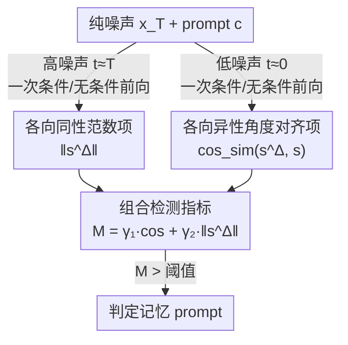

# Detecting and Mitigating Memorization in Diffusion Models through Anisotropy of the Log-Probability

**会议**: ICLR 2026  
**arXiv**: [2601.20642](https://arxiv.org/abs/2601.20642)  
**代码**: [GitHub](https://github.com/rohanasthana/memorization-anisotropy)  
**领域**: 扩散模型 / 隐私  
**关键词**: 记忆检测, 各向异性, score函数, 余弦相似度, 无去噪检测  

## 一句话总结

本文证明基于范数的记忆检测指标仅在各向同性（isotropic）对数概率分布下有效，在低噪声各向异性（anisotropic）区域失效；提出结合高噪声范数和低噪声角度对齐（cosine similarity）的无去噪检测指标，在 SD v1.4/v2.0 上超越现有无去噪方法且快 5× 以上。

## 研究背景与动机

**领域现状**：扩散模型会无意中记忆训练样本的精确副本，这引发数据隐私、版权和评估偏差等问题。记忆检测已成为重要研究方向。

**现有痛点**：主流方法（Wen et al., Jeon et al.）基于 score 差异的范数 $\|s_\theta^\Delta(\mathbf{x}_t, t, c)\|$ 来检测记忆，这本质上衡量的是对数概率的整体曲率（Hessian trace）。

**核心矛盾**：范数指标暗含假设——对数概率分布是各向同性的（即 Hessian $\propto \mathbf{I}$，所有方向曲率相同）。但实验表明低噪声区域对数概率实际上是各向异性的（Hessian 特征值方差剧增），此时范数无法区分记忆与非记忆样本（KL 散度从各向同性的 0.166 降至各向异性的 0.022）。

**本文目标** 在各向异性区域也能准确检测记忆，且无需昂贵的去噪步骤。

**切入角度**：分析低噪声各向异性区域中条件与无条件 score 的方向关系，发现记忆样本的 guidance 向量与无条件 score 高度对齐。

**核心 idea**：记忆在各向异性区域的签名是角度对齐而非范数尖峰，用 "各向同性范数 + 各向异性余弦相似度" 的加权组合即可高效无去噪检测记忆。

## 方法详解

### 整体框架

这篇论文要解决的是：现有基于范数的扩散模型记忆检测指标，在低噪声各向异性区域会失效，能否找到一个既准又快、还不用跑去噪轨迹的替代判据。整体思路是把记忆的"签名"按噪声区间拆成两路互补信号——高噪声区用范数、低噪声区用角度——再加权合成一个统一判据。具体地，对纯噪声输入 $\mathbf{x}_T \sim \mathcal{N}(\mathbf{0}, \mathbf{I})$ 和 prompt $c$，只在 $t \approx T$ 和 $t \approx 0$ 两个人工设定的时间步各做一次条件/无条件前向，分别得到**各向同性范数项**和**各向异性角度对齐项**，二者加权成**组合检测指标** $\mathcal{M}(\mathbf{x}_T, c)$，高于阈值即判为记忆 prompt。全程不运行去噪轨迹，这是它比依赖 Hessian 的方法快 5× 以上的来源。

### 关键设计

**1. 各向同性范数项：在高噪声区接住已被验证有效的旧信号**

在 $t \approx T$ 处计算 score 差异的范数 $\|s_\theta^\Delta(\mathbf{x}_T, t \approx T, c)\|$，这正是 Wen et al. 用的指标。之所以保留它，是因为高噪声处对数概率近似各向同性——Hessian 特征值方差趋近于零、各方向曲率一致，此时范数能可靠反映记忆样本对数概率的整体尖峰。本文没有否定这个信号，而是把它限定在它真正成立的噪声区间使用。

**2. 各向异性角度对齐项：在低噪声区改用方向而非范数来识别记忆**

低噪声区域对数概率是各向异性的，范数失效（KL 散度从 0.166 跌到 0.022），但记忆在这里留下了另一种签名：方向对齐。本文在 $t \approx 0$ 处计算 guidance 向量与无条件 score 的余弦相似度 $\text{cos\_sim}(s_\theta^\Delta, s_\theta)$。直觉是，记忆样本里无条件模式和条件模式几乎重合（模式位移 $\delta \to 0$），于是 $\nabla \log p_t(c|\mathbf{x}_t)$ 与 $\nabla \log p_t(\mathbf{x}_t)$ 方向高度一致。Theorem 1 把这个直觉变成了可证的下界：

$$\cos \geq \frac{1-r}{1+r}, \quad r = \varepsilon + \tau$$

其中 $\varepsilon$ 控制协方差近似误差、$\tau$ 控制模式位移；记忆越强（$\delta$ 越小）$r$ 越小、余弦下界越接近 1。这条项和范数项天然互补：一个管各向同性的高噪声区，一个管各向异性的低噪声区。

**3. 组合检测指标：把两个互补信号加权成一个无去噪判据**

最终判据是两项的加权和：

$$\mathcal{M}(\mathbf{x}_T, c) = \gamma_1 \cdot \text{cos\_sim}(s_\theta^\Delta, s_\theta)|_{t \approx 0} + \gamma_2 \cdot \|s_\theta^\Delta\||_{t \approx T}$$

权重 $\gamma_1, \gamma_2$ 用一次小规模 Logistic 回归确定，只需 20 个记忆 prompt 拟合一遍（实践中 $\gamma_1=\gamma_2=1$ 也已不错）。整个判据只在 $t=0$ 和 $t=T$ 两个时间步各做一次条件/无条件前向，$\mathcal{M}$ 高于阈值即判为记忆 prompt，全程不跑去噪轨迹，这是它比依赖 Hessian 的方法快 5× 以上的根本原因。

### 损失函数 / 缓解策略

推理时缓解：将检测指标作为损失，通过梯度下降优化 prompt embedding：

$$\mathcal{L}(\mathbf{x}_T, c) = \mathcal{M}(\mathbf{x}_T, c)$$

优化后得到修正 embedding $c^\star$，用于生成非记忆内容。

## 实验关键数据

### 检测性能（SD v1.4 / SD v2.0）

| 方法 | AUC↑ (n=1) | TPR@1%FPR↑ (n=1) | 耗时(s)↓ (10 prompts) |
|------|-----------|------------------|---------------------|
| Ren et al. | 0.846 / 0.848 | 0.116 / 0.000 | 0.05 / 0.07 |
| Wen et al. | 0.976 / 0.948 | 0.896 / 0.739 | 0.40 / 0.80 |
| Jeon et al. | 0.987 / 0.959 | 0.908 / 0.740 | 5.40 / 14.60 |
| **本文** | **0.994 / 0.953** | **0.935 / 0.791** | **1.10 / 2.20** |

n=4 时本文 AUC 达 0.999（SD v1.4），TPR@1%FPR 达 0.984。

### 消融实验（各组分贡献，SD v1.4 n=1）

| 组分 | AUC↑ | TPR@1%FPR↑ |
|------|------|------------|
| 仅范数（各向同性） | 0.976 | 0.896 |
| 仅余弦（各向异性） | 0.923 | 0.424 |
| **组合（本文）** | **0.992** | **0.934** |

### 关键发现

- 各向同性范数单独表现较好但在严格 FPR 约束下不够精确（TPR 0.896）；加入各向异性余弦后提升到 0.934
- 纯余弦相似度在 SD v2.0 上表现较差（AUC 0.779），因 v2.0 的记忆 prompt 多为局部记忆（$\delta$ 较大），但组合后仍能提升
- 速度优势：比 Jeon et al. 快 5~7×，因为避免了昂贵的 Hessian 计算
- Realistic Vision v5.1 上也可泛化（AUC 0.967）
- 缓解实验中，本文方法在 SSCD 相似度最低（非记忆）的同时保持 CLIP/Aesthetic score 与基线持平

## 亮点与洞察

- **理论贡献突出**：严格证明范数指标在各向异性下的失效机制，并给出角度对齐的理论下界（Theorem 1）
- **"时间步错配"仍然有效的洞察**：在 $t=0$ 处查询但输入是纯噪声 $\mathbf{x}_T$，看似矛盾，但因记忆信息编码在学到的对数概率中且独立于输入样本，这个 trick 使得完全无需去噪
- **两个互补预测器**：各向同性范数 + 各向异性角度覆盖了不同噪声区域的记忆迹象，提高边缘案例鲁棒性

## 局限与展望

- $\gamma_1, \gamma_2$ 需要少量标注记忆 prompt 拟合，不同模型间不完全通用（虽然 $\gamma_1=\gamma_2=1$ 效果也不错）
- 对局部记忆（部分区域记忆）检测能力较弱，余弦项在此场景下可靠性降低
- 仅评估了 SD v1.4/v2.0/Realistic Vision，未覆盖 SD3/Flux 等新架构
- 时间步错配现象缺乏严格数学证明（仅给出直觉解释）

## 相关工作与启发

- **vs Wen et al.**：使用相同的范数指标但本文证明其仅在各向同性下有效，并通过增加各向异性项提升 TPR@1%FPR 最高 5.2%
- **vs Jeon et al.**：使用 Hessian 近似的 sharpness 指标，更准但需 5~14× 更长时间；本文仅用一阶 score 信息
- **vs Ross et al.**：从 Local Intrinsic Dimensionality 几何视角分析记忆，但需要去噪轨迹；本文完全无去噪
- 启发：各向异性分析可迁移到其他生成模型（如 flow matching）的记忆检测

## 评分

- 新颖性: ⭐⭐⭐⭐⭐ 首次在记忆检测中引入各向异性分析，理论驱动的方法设计
- 实验充分度: ⭐⭐⭐⭐ 检测+缓解+消融全面，但模型覆盖面可更广
- 写作质量: ⭐⭐⭐⭐⭐ 理论推导严谨，实验设置清晰，图表直观
- 价值: ⭐⭐⭐⭐ 为记忆检测提供新理论视角和实用高效方法

<!-- RELATED:START -->

## 相关论文

- [\[ICML 2025\] Understanding and Mitigating Memorization in Generative Models via Sharpness of Probability Landscapes](../../ICML2025/image_generation/understanding_and_mitigating_memorization_in_generative_models_via_sharpness_of_.md)
- [\[ICLR 2026\] Inference-Time Scaling of Diffusion Models Through Classical Search](inference-time_scaling_of_diffusion_models_through_classical_search.md)
- [\[ICLR 2026\] Generalization of Diffusion Models Arises with a Balanced Representation Space](generalization_of_diffusion_models_arises_with_a_balanced_representation_space.md)
- [\[ICML 2025\] Localizing and Mitigating Memorization in Image Autoregressive Models](../../ICML2025/image_generation/localizing_and_mitigating_memorization_in_image_autoregressive_models.md)
- [\[ICLR 2026\] Mitigating Noise Shift in Denoising Generative Models with Noise Awareness Guidance](mitigating_noise_shift_in_denoising_generative_models_with_noise_awareness_guida.md)

<!-- RELATED:END -->
