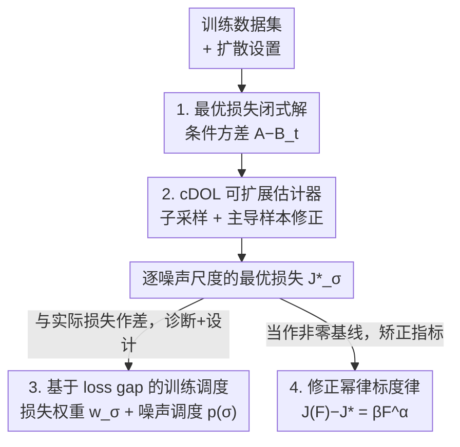

# Diagnosing and Improving Diffusion Models by Estimating the Optimal Loss Value

**会议**: ICLR 2026  
**OpenReview**: [https://openreview.net/forum?id=X7JfjLKKLQ](https://openreview.net/forum?id=X7JfjLKKLQ)  
**代码**: 论文承诺接收后开源（暂未公开）  
**领域**: 扩散模型  
**关键词**: 扩散模型, 最优损失, 训练调度, 标度律, 去噪条件方差

## 一句话总结
本文指出扩散模型的损失最优值并非 0 而是一个未知的正数，导致「损失大」无法区分是「数据本身难拟合」还是「模型容量不足」；作者推导出该最优损失的闭式解、设计出可扩展到大数据集的估计器（cDOL），并用它来诊断扩散训练、设计出更优的训练调度（CIFAR-10/ImageNet 上 FID 改善 2%–25%），以及让扩散模型的标度律更符合幂律。

## 研究背景与动机

**领域现状**：扩散模型已是高维生成建模的主流，研究者在预测目标（score/ε/x₀/v 预测）、扩散过程设计（VP/VE/FM）、训练调度（噪声分布 + 损失权重）等多个维度持续改进。相比 GAN，它最大的优势是训练过程稳定，损失曲线平滑可监控。

**现有痛点**：扩散损失只反映「相对」的数据拟合质量——同一设置下比较两个模型、或监控某次训练的收敛趋势是有效的，但它无法衡量模型对训练数据的「绝对」拟合程度。问题出在：扩散损失的最优值（任何模型能达到的最低损失）**不是 0，而是一个事先未知的正数**。于是训练收敛后，你根本不知道剩下的 loss 是「已经逼近 oracle、无法再降」，还是「模型还欠拟合、调一调还能降」。实践中只能靠采样生成样本来评估，既费算力，又被采样器配置干扰。

**核心矛盾**：实际损失值 = 最优损失（与数据/扩散设置有关的基线）+ 优化间隙（与模型容量有关）。两项被混在一起：在分析不同扩散步（不同噪声尺度）的学习质量、设计训练调度时，看不清哪一步还有改进空间；研究标度律时，直接拿实际 loss 当指标也会被这个未知基线污染，得到有偏的标度结论。

**本文目标**：(1) 把最优损失从实际损失里「减出来」——先求闭式解，再做出能跑在大数据集上的估计器；(2) 用它诊断主流扩散模型在各噪声尺度的拟合好坏；(3) 据此设计原理性的训练调度；(4) 修正扩散标度律的形式。

**切入角度**：从损失函数的真实学习目标入手。扩散模型名义上预测 x₀/ε，但信息论上无法从带噪样本精确还原干净数据，模型真正学到的是**条件期望** $\mathbb{E}_{p(x_0\mid x_t)}[x_0]$。既然学的是条件期望，那么即便在最优解处，损失也会残留一个**条件方差**——这正是最优损失的来源，且只依赖数据集和扩散设置、与模型架构无关。

**核心 idea**：把扩散最优损失显式估计出来，用「实际损失与最优损失的差（loss gap）」代替「实际损失本身」作为数据拟合质量的真正指标，再围绕这个指标重做诊断、调度设计与标度律研究。

## 方法详解

### 整体框架

整篇工作可以看成「一个工具 + 三个应用」。工具是**扩散最优损失的估计**：先在统一公式下推出最优损失的闭式表达（一个均值平方项减去条件期望的平方期望），再设计可扩展到大数据集的随机估计器 cDOL。拿到这个工具后，作者把所有主流扩散模型（不同扩散过程 × 不同预测目标）统一换算到「VE 过程下的 x₀ 预测」这个共同坐标系，逐噪声尺度地比较它们的实际损失与最优损失之差，得到新的观察，并据此设计训练调度、修正标度律。

### 关键设计

**1. 最优损失的闭式解：把残留损失锁定为「去噪条件方差」**

痛点是大家只知道扩散损失最优值非零、却不知道它到底是多少。作者从损失的真实学习目标——条件期望——出发，推出 x₀ 预测目标下的最优损失闭式解（Theorem 1）：

$$J^{(x_0)\star}_t = \underbrace{\mathbb{E}_{p_0(x_0)}\|x_0\|^2}_{A} - \underbrace{\mathbb{E}_{p(x_t)}\big\|\mathbb{E}_{p(x_0\mid x_t)}[x_0]\big\|^2}_{B_t}, \qquad J^\star = \mathbb{E}_{p(t)} w^{(x_0)}_t J^{(x_0)\star}_t.$$

它等价于 $J^{(x_0)\star}_t = \mathbb{E}_{p_t(x_t)}\,\mathrm{tr}\,\mathrm{Cov}_{p(x_0\mid x_t)}[x_0]$，即给定带噪样本后干净数据的**平均条件方差**，因此恒为正（除非 $t=0$ 或数据退化成单点）。这个量有清晰的物理含义：噪声尺度 $\sigma$ 很小时，带噪样本几乎唯一对应它的源样本，条件方差→0，最优损失→0；$\sigma$ 增大后带噪样本被噪声主导、与 $x_0$ 相关性消失，$p(x_0\mid x_t)\approx p_{\text{data}}$，最优损失收敛到**数据方差**。关键是它**只依赖数据集和扩散设置，与模型架构、参数化无关**，所以可以一次性离线估好，当作所有模型共享的基线。其它预测目标（ε/score/v）的最优损失按 Eqs.(3,4,5) 的固定比例换算即可。

**2. cDOL 估计器：用子采样把二次复杂度降下来、又修掉随之而来的偏差**

闭式解里 $A$ 一遍扫数据就能估，难点在 $B_t$——它含两层嵌套期望，内层是无法直接采样的后验 $p(x_0\mid x_t)$。用贝叶斯把后验展开成可计算形式后，标准经验估计器 $\hat B_t$（Eq.9）需要对每个 $x_t$ 在全数据集上做加权核 $K_t(x_t,x_0)=\exp(-\|x_t-\alpha_t x_0\|^2/2\sigma_t^2)$ 的归一化，复杂度是数据规模 $N$ 的**二次方**，大数据集上根本跑不动。

直接做法是用大小为 $L\ll N$ 的随机子集做**自归一化重要性采样（SNIS）**。但这里有个扩散特有的麻烦：当 $\sigma_t$ 小时，权重 $K_t$ 几乎被离 $x_t/\alpha_t$ 最近的那个 $x_0$ 独占，而这个主导样本很可能没被随机子集抽中，导致方差爆炸。作者的巧招是：既然每个 $x_t$ 本来就是由某个 $x_0^{(n_m)}$ 加噪造出来的，小 $\sigma$ 下 $\alpha_t\approx 1$，那个源样本几乎就是主导样本——于是**强制把构造 $x_t$ 用到的源样本放进子集**（DOL 估计器，Eq.10）。但这又人为制造了 $x_t$ 与 $x_0$ 的相关性，使 $B_t$ 被高估、最优损失被低估。最后用一个系数 $C$ 给这类「自配对」降权，得到**corrected DOL（cDOL）**（Eq.11）。理论上（Theorem 2）当 $M\to\infty, C\to\infty$ 时 cDOL（子集 $L$）与 SNIS（子集 $L-1$）同期望，是一致估计；实践中 $C$ 取约 $4N/L$，在偏差（$C=1$ 的 DOL）与方差（$C=\infty$ 的 SNIS）两个极端之间取得最低估计误差，且对 $C$ 不敏感。

**3. 基于 loss gap 的原理性训练调度：把权重和噪声分布都对齐到「还没学好」的地方**

有了逐尺度的最优损失，作者先把所有主流模型换算到 VE 过程下的 x₀ 预测同一坐标系（Eq.12 的预条件系数，Table 1），逐尺度比较「实际损失 − 最优损失」这个 loss gap。两个新观察驱动了调度设计：① ε 预测在大 $\sigma$ 处误差很大、直接拖累生成质量（如 NCSN vs EDM）；② 在临界点 $\sigma^\star$（最优损失开始变正的最大 $\sigma$）附近，loss gap 反而与 FID **负相关**——存在跨尺度的 trade-off：牺牲 $\sigma^\star$ 附近的拟合、换取 $\sigma^\star$ 更左侧区间的拟合，反而生成更好。

据此设计训练调度（噪声分布 $p(\sigma)$ + 损失权重 $w_\sigma$ 合称调度）。损失权重取最优损失的倒数来把各尺度的损失拉到同一量纲，并在小噪声处加截断 $w^\star$ 防发散，再叠一个高斯权重 $f(\sigma)$ 把火力压到 $\sigma^\star$ 左侧的正相关区间：

$$w_\sigma = a\,\min\!\big(1/J^\star_\sigma,\; w^\star\big) + f(\sigma)\,\mathbb{I}_{\sigma<\sigma^\star},\qquad f(\sigma)=\mathcal N(\log\sigma;\mu,\varsigma^2).$$

噪声分布则按「优化还没做好的程度」自适应分配：$p(\sigma)\propto w_\sigma\big(J_\sigma(\theta)-J^\star_\sigma\big)$，把更多训练步投到那些 gap 与性能正相关的尺度上。整套调度只需在数据集上估出 $J^\star_\sigma$，**无需预先训练任何模型**。

**4. 修正幂律：把非零最优损失当作标度律的偏置项减掉**

研究扩散标度律时，传统幂律 $J(F)=\beta F^\alpha$ 假设损失随算力 $F$ 增大趋于 0，但扩散损失有非零下界 $J^\star$，根本降不到 0，硬套会让曲线偏离直线。作者把最优损失当偏置项减掉，改用 $J(F)-J^\star=\beta F^\alpha$，即 $\log(J(F)-J^\star)$ 对 $\log F$ 线性。用 120M–1.5B 的 EDM2 在 ImageNet-64/512 上验证：大噪声尺度下修正后的相关系数 $\rho$ 从 0.82 升到 0.94；总损失上 $\rho$ 达 0.9917，拟合出 $J(F)=0.3675\,F^{-0.014}+0.015$。这说明用 loss gap 而非裸 loss 才能得到更「干净」的标度律。

## 实验关键数据

### 主实验

训练调度在 CIFAR-10 与 ImageNet-64 上对两类先进模型（EDM、Flow Matching）的生成 FID 改善（越低越好）：

| 数据集 / 设置 | 指标 | 原始调度 | 本文调度 | 改善 |
|---------------|------|----------|----------|------|
| CIFAR-10 · EDM（条件） | FID↓ | 1.79 | 1.75 | ↓2% |
| CIFAR-10 · FM（条件，+EDM 采样器） | FID↓ | 2.07 | 1.77 | ↓14% |
| ImageNet-64 · EDM（条件） | FID↓ | 2.44 | 2.25 | ↓8% |
| ImageNet-64 · FM（条件，+EDM 采样器） | FID↓ | 3.06 | 2.29 | ↓25% |

在 ImageNet-256（VA-VAE tokenizer + 改进版 LightningDiT）上：

| 方法 | FID↓ (无 CFG) | IS↑ (无 CFG) | FID↓ (有 CFG) | IS↑ (有 CFG) |
|------|----------|----------|----------|----------|
| LightningDiT（复现） | 2.29 | 206.2 | 1.42 | 292.9 |
| + 本文调度 | **2.08** | **220.8** | **1.30** | **301.3** |

### 消融与分析

| 配置 / 分析 | 关键结果 | 说明 |
|------|---------|------|
| 估计器 $C=1$（DOL） | 偏差大、低估最优损失 | 自配对相关性未修正，中间尺度尤甚 |
| 估计器 $C=\infty$（SNIS） | 方差大、误差大 | 主导样本难被抽到 |
| 估计器 $C\approx 4N/L$（cDOL） | 估计误差一致最低、对 $C$ 不敏感 | 偏差/方差折中 |
| 标度律 $J(F)=\beta F^\alpha$（原始） | $\rho=0.82$ | 大噪声尺度，未减最优损失 |
| 标度律 $J(F)-J^\star=\beta F^\alpha$（修正） | $\rho=0.94$ | 同上，减去最优损失后更线性 |

### 关键发现
- **最优损失随噪声尺度单调上升**：在临界点 $\sigma^\star$ 之前几乎为 0（带噪样本仍保留干净信息、可近乎完美去噪），越过 $\sigma^\star$ 后快速抬升，最终收敛到数据方差。$\sigma^\star$ 依赖数据集——CIFAR-10 分辨率最低（32×32）样本最易在加噪后重叠故 $\sigma^\star$ 最小；ImageNet-64 样本更多、更易重叠，$\sigma^\star$ 比同分辨率的 FFHQ-64 更小，且因类别更丰富收敛到更高的数据方差。
- **临界点附近的反直觉 trade-off**：$\sigma^\star$ 附近 loss gap 与 FID 负相关，只有更左侧区间才正相关；因此「主动放弃 $\sigma^\star$ 附近、强化左侧」反而提升生成质量——这是本文训练调度设计的直接依据。
- **ε 预测在大噪声尺度吃亏**：ε 预测目标在大 $\sigma$ 处误差显著，直接造成生成质量下降，提示该尺度区域是 ε 类模型的难点。

## 亮点与洞察
- **「损失大 ≠ 没学好」的解耦**：把扩散损失拆成「数据决定的最优损失基线 + 模型决定的优化间隙」，是这篇论文最让人「啊哈」的地方——它让一个一直被当作相对指标的量第一次有了绝对意义，且基线与模型无关、可离线估一次复用。
- **训练-free 的估计器**：cDOL 只需数据集本身就能估出每个尺度的最优损失，不用先训模型，这让它能在训练**之前**就指导调度设计，成本极低。
- **把主导样本「塞进」子集的技巧可迁移**：在核权重被极少数近邻主导的重要性采样问题里（如基于核的密度/期望估计），「强制纳入已知主导样本 + 系数修正自配对偏差」是一个通用且优雅的方差-偏差平衡套路。
- **标度律的「减基线」校正**：对任何有非零损失下界的任务（不止扩散），研究幂律时减去理论下界再拟合，能得到更干净的标度关系——这个视角值得迁移到其它生成/回归任务。

## 局限与展望
- **估计器复杂度仍偏高**：标准经验估计器是 $O(N^2)$，cDOL 虽降到子集规模，但 $M$ 常需达到 $N$ 的 2–3 倍才收敛，超大数据集上的实际开销与精度权衡仍需更多验证；作者也提到与既有「最优解」估计器（如 KNN 加速）在大数据集上估「最优损失」的可行性尚未充分对比。
- **最优损失不等于生成质量**：作者明确强调估计最优损失不是为了去「达到」它（那会过拟合），而是提供一个数据拟合的绝对指标；它与推理（生成）性能并非直接等价，临界点附近的负相关现象就说明 loss gap 与 FID 之间关系复杂，仅靠它无法完全预测生成效果。
- **调度设计含经验成分**：损失权重里的截断 $w^\star$、高斯权重 $f(\sigma)$ 的 $\mu,\varsigma$ 等仍需人工选择，论文给出原则但未给完全自动的确定方法。
- **可改进方向**：把最优损失这一绝对指标用于泛化分析（训练 vs 测试集的 loss gap 差异）、或扩展到文本/视频等更高维、条件更复杂的扩散模型上，是自然的下一步。

## 相关工作与启发
- **vs Bao et al. (Analytic-DPM)**：他们在离散高斯反向过程下推导最优 ELBO，用来定最优反向（协）方差、优化离散扩散步；本文考虑更一般的连续/各预测目标情形，给出**training-free** 的最优损失值估计器，并强调它在诊断训练、设计调度、研究标度律上的实际作用，落点不同。
- **vs Karras et al. (EDM / EDM2)**：EDM 系列把扩散设计空间拆解清楚、并精调损失权重与噪声分布，但调度仍基于「损失尺度」的经验分析；本文主张以「损失与最优损失之差」为更原理性的依据，并在 EDM/EDM2 之上进一步改善 FID 与标度律拟合。
- **vs 现有扩散标度律工作（DiT scaling、Liang et al. 等）**：这些工作多直接用训练 loss 当指标，未减去最优损失，故反映的不是真正的优化间隙、标度分析有偏；本文用 loss gap 修正幂律形式，使曲线更符合线性。

## 评分
- 新颖性: ⭐⭐⭐⭐⭐ 首次系统地提出并估计扩散「最优损失」，把相对损失变成绝对指标，视角新且基础。
- 实验充分度: ⭐⭐⭐⭐ 覆盖 CIFAR-10/ImageNet-64/256/512 与 120M–1.5B 多尺度，估计器消融充分；超大数据集开销与生成端验证可再加强。
- 写作质量: ⭐⭐⭐⭐ 从动机到闭式解到估计器到应用层层递进，逻辑清晰；公式偏多，对非扩散背景读者门槛略高。
- 价值: ⭐⭐⭐⭐⭐ 提供可离线复用的诊断工具 + 即插即用的训练调度 + 更干净的标度律框架，对扩散训练研究有普适价值。

<!-- RELATED:START -->

## 相关论文

- [\[ICLR 2026\] Shortcut Diffusion Training with Cumulative Consistency Loss: An Optimal Control View](shortcut_diffusion_training_with_cumulative_consistency_loss_an_optimal_control_.md)
- [\[ICLR 2026\] AlignFlow: Improving Flow-based Generative Models with Semi-Discrete Optimal Transport](alignflow_improving_flow-based_generative_models_with_semi-discrete_optimal_tran.md)
- [\[ICLR 2026\] Condition Errors Refinement in Autoregressive Image Generation with Diffusion Loss](condition_errors_refinement_in_autoregressive_image_generation_with_diffusion_lo.md)
- [\[ICLR 2026\] Improving Diffusion Models for Class-imbalanced Training Data via Capacity Manipulation](improving_diffusion_models_for_class-imbalanced_training_data_via_capacity_manip.md)
- [\[ICLR 2026\] Foresight Diffusion: Improving Sampling Consistency in Predictive Diffusion Models](foresight_diffusion_improving_sampling_consistency_in_predictive_diffusion_model.md)

<!-- RELATED:END -->
