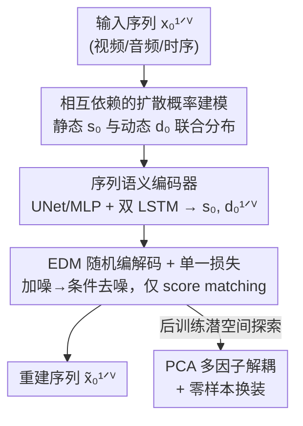

# DiffSDA: Unsupervised Diffusion Sequential Disentanglement Across Modalities

**会议**: ICLR2026  
**OpenReview**: [https://openreview.net/forum?id=tooDJHBSvO](https://openreview.net/forum?id=tooDJHBSvO)  
**代码**: https://github.com/azencot-group/DiffSDA  
**领域**: 扩散模型 / 无监督表示学习 / 序列解耦  
**关键词**: 序列解耦, 扩散模型, 静态/动态因子, 模态无关, 无监督表示学习

## 一句话总结
DiffSDA 用一套基于扩散模型的概率框架，把视频/音频/时序数据无监督地拆成「静态因子」和「动态因子」，只靠**单一的 score matching 损失**（而非以往 VAE/GAN 那一堆正则项）就实现解耦，并在真实高分辨率视频上首次做到高质量的换装（swap）、零样本迁移和多因子探索。

## 研究背景与动机
**领域现状**：序列解耦（sequential disentanglement）想把一段序列拆成「不随时间变的静态因子」和「随时间变的动态因子」——例如说话视频里，静态是人脸长相，动态是嘴型/头部运动；语音里静态是说话人身份，动态是说话内容。这是无监督表示学习里很有价值的一支，能提升可解释性、缓解偏差、改善泛化。

**现有痛点**：主流方法（C-DSVAE、SPYL、DBSE 等）几乎都建立在 VAE/GAN 之上，依赖**多个损失项**（互信息正则、先验约束等）来强行逼出解耦。比如 C-DSVAE 光是平衡各个损失项就要调 5 个超参数；SPYL 也有 5 个损失项。这让优化变得脆弱、难调，而且这些方法基本只在 toy 数据集（MNIST 动画之类）上验证，搬到真实高分辨率视频上几乎产不出像样的样本。

**核心矛盾**：扩散模型已经是当下生成质量的 SOTA，但**没有人给出「扩散模型做序列解耦」的概率建模理论**——现有扩散自编码器（DiffAE、InfoDiffusion）要么不针对序列、要么本身并不产生解耦表示。于是「想用扩散的高质量 + 想要解耦」这两件事被卡在了缺一套数学框架上。

**本文目标**：(1) 给序列解耦补上一套基于扩散过程的概率建模；(2) 让它真正在真实世界多模态数据上 work，且只用一个损失项；(3) 顺带建立一套不依赖标签的视频解耦评测协议。

**切入角度**：作者假设——只要把静态/动态因子作为条件喂给一个标准扩散去噪过程，**解耦可以从结构里"自然涌现"**，而不必靠额外正则去逼。原因有二：静态因子在整段序列里共享，天然装不下动态信息；动态因子维度被刻意压低，天然装不下静态细节。

**核心 idea**：用「一对相互依赖的扩散过程 + 一个共享低维结构的语义编码器」替代「VAE/GAN + 一堆正则」，让单一的标准扩散损失就能驱动模态无关的序列解耦。

## 方法详解

### 整体框架
DiffSDA 是一个扩散自编码器，输入一段序列 $x_0^{1:V}$（$V$ 是序列长度，上标表序列时间、下标表扩散时间），输出是被解耦后可重建/可换装的序列。整条管线分三块：**序列语义编码器**先把输入压成一个全序列共享的静态因子 $s_0$ 和逐帧的动态因子 $d_0^{1:V}$；**随机编码器**按 EDM 方式给每帧加噪得到 $x_t^{1:V}$；**随机解码器** $D_\theta$ 在静态+动态因子的条件下，把噪声潜变量去噪回干净序列 $\tilde{x}_0^{1:V}$。整套东西只用一个 score matching 损失训练。换装、零样本迁移、多因子 PCA 探索都是在这个训练好的潜空间上做的下游操作。

### 关键设计

**1. 相互依赖的扩散概率建模：给"扩散做序列解耦"补上数学地基**

以往方法（C-DSVAE、SPYL）默认静态因子和动态因子**相互独立**，DiffSDA 反其道而行，把二者建模成**相互依赖**。具体地，它用两个扩散过程刻画联合分布：一个描述静态/动态因子自身的先验分布，另一个描述观测序列对这些因子的依赖。联合分布写成

$$p(x_0^{1:V}, x_T^{1:V}, s_0, s_T, d_0^{1:V}, d_T^{1:V}) = p_{T0}(s_0, d_0^{1:V}\mid s_T, d_T^{1:V})\prod_{\tau=1}^{V} p_{T0}(x_0^\tau\mid x_T^\tau, s_0, d_0^\tau)$$

后验则显式假设动态因子的时间依赖：$p(x_t^{1:V}, s_0, d_0^{1:V}\mid x_0^{1:V}) = p_{0t}(x_t^{1:V}\mid x_0^{1:V})\,p(s_0\mid x_0^{1:V})\prod_\tau p(d_0^\tau\mid d_0^{<\tau}, x_0^{\le\tau})$，即静态因子看全序列、动态因子只看当前及之前。作者给"为什么要依赖"三条理由：**表达力**——依赖让边缘分布 $p_{t0}$ 能学到更丰富的状态轨迹；**效率**——采样器非自回归，可并行快速采样；**因果性**——需要时模型能学到静态/动态之间的复杂关系。实测把独立换成依赖，生成质量提升约 **13%**。这套建模是全文最核心的理论贡献，它第一次把序列解耦塞进了扩散的概率框架里。

**2. 序列语义编码器：用共享静态 + 低维动态的结构天然挤出解耦**

编码器要从序列里抽出 $s_0$ 和 $d_0^{1:V}$。它先用一个 backbone（视频用 U-Net、其它模态用 MLP）加线性层独立处理每个序列元素，再用一个 LSTM 把整段序列汇总成隐状态 $h^{1:V}$；最后的隐状态 $h^V$ 过线性层得到**全序列共享的静态因子** $s_0$，而 $h^{1:V}$ 再经另一个 LSTM 和线性层得到**逐帧动态因子** $d_0^{1:V}$。这里的结构设计本身就是解耦的来源：$s_0$ 在所有 $\tau$ 上共享，所以装不下随帧变化的动态信息；$d_0^\tau\in\mathbb{R}^k$ 的维度 $k$ 被刻意取得很小，所以装不下静态外观细节。换模态时只需把 U-Net 换成 MLP 这种小改动，这正是它「模态无关」的工程基础——不依赖视频特有的时空一致性、也不依赖音频特有的频谱线索。

**3. 基于 EDM 的随机解码 + 单一损失：扔掉所有正则项，只留一个 score matching**

解码器 $D_\theta$ 采用 EDM 的预条件参数化：

$$\tilde{x}_0^\tau = D_\theta(x_t^\tau, t, z_0^\tau) = c^{\text{skip}}_t x_t^\tau + c^{\text{out}}_t F_\theta(c^{\text{in}}_t x_t^\tau, z_0^\tau, c^{\text{noise}}_t)$$

其中 $z_0^\tau := (s_0, d_0^\tau)$ 是该帧的解耦因子，通过 AdaGN 注入网络 $F_\theta$；$c^{\text{skip}}, c^{\text{in}}, c^{\text{out}}, c^{\text{noise}}$ 是 EDM 的标准缩放/调制项。训练目标就是一个去噪 score matching 损失

$$\mathbb{E}_{t,x_t^\tau,z_0^\tau,x_0^\tau}\Big[\lambda_t (c^{\text{out}}_t)^2\big\|F_\theta - \tfrac{1}{c^{\text{out}}_t}(x_0^\tau - c^{\text{skip}}_t x_t^\tau)\big\|_2^2\Big]$$

**没有任何互信息项、KL 项、对抗项或额外正则**——这是相对 SPYL（5 项）、DBSE（2 项）最直观的简化。EDM 框架还让推理只需 **63 次神经网络前向（NFE）**，比一般扩散快得多。为了撑起真实高分辨率视频，解码器外面套了一层潜扩散（LDM）：先用预训练 VQ-VAE 把高维帧压到潜空间再做扩散，作者直接复用记号 $x_0^{1:V}$ 表示 VQ-VAE 潜特征。

**4. PCA 后训练多因子解耦 + 零样本迁移：把静态/动态进一步拆细，并迁到没见过的数据**

训练完之后，作者发现学到的潜空间还能被**无监督地进一步拆分**。受 DiffAE 启发，对采样得到的一大批静态向量 $\{\hat s_j\}_{j=1}^{b}$（$b=2^{15}$）做 PCA 得到主成分 $\{v_i\}$，然后沿某个主成分方向平移真实样本的静态码：

$$\bar s = \Big(\tfrac{s-\mu_{\hat s}}{\sigma_{\hat s}} + \alpha v_i\cdot\sqrt{h}\Big)\cdot\sigma_{\hat s} + \mu_{\hat s}$$

$\alpha=0$ 还原原序列，正负 $\alpha$ 则连续改变某个可解释属性（在 VoxCeleb 上正方向更男性化、负方向更女性化，还能找到控制肤色、模糊度的成分），且其它静态特征和动态全程保持。另一条线是**零样本解耦**：在 VoxCeleb 上训练，直接拿 MUG/CelebV-HQ 的样本做换装——冻结目标数据的静态、换上训练域的动态，模型不仅改了表情还补出了相应身姿，证明这套因子分解能跨数据集泛化（论文称这是该任务首次做零样本）。

### 损失函数 / 训练策略
全程只优化上面那一个去噪 score matching 损失（式 5），权重 $\lambda_t$ 按 EDM 设定，$t\sim U[0,T]$ 均匀采样。先验扩散 $p_{T0}(s_0,d_0^{1:V})$ 不进入该损失，可单独优化。高分辨率视频走 LDM（预训练 VQ-VAE 潜空间），其它模态直接在原空间训练，换模态仅替换 backbone（U-Net↔MLP）。

## 实验关键数据

### 主实验
在视频、音频、时序三类真实数据上，全面对比模态无关 SOTA（SPYL、DBSE）。视频用换装任务下的 AED（衡量静态/物体保持）和 AKD（衡量动态/运动保持）。

| 数据集 | AED↓(静态冻结) Ours | AED 最优基线 | AKD↓(动态冻结) Ours | AKD 最优基线 |
|--------|------|----------|------|------|
| MUG (64²) | **0.751** | 0.766 (SPYL) | **0.802** | 1.118 (DBSE) |
| VoxCeleb (256²) | **0.846** | 1.026 (DBSE) | **2.793** | 4.705 (SPYL) |
| CelebV-HQ (256²) | **0.540** | 0.631 (SPYL) | **6.932** | 28.69 (DBSE) |
| TaiChi-HD (64²) | 0.326 | **0.325** (DBSE) | **2.143** | 6.312 (DBSE) |

AKD 上领先尤其悬殊（CelebV-HQ 上 6.9 vs 28.7）。重建误差（AED/AKD/MSE）更是"数量级领先"，例如 MUG 上 MSE 为 $3\times10^{-7}$ 对 SPYL/DBSE 的 $10^{-3}$。

音频说话人识别（TIMIT/LibriSpeech），用 EER：好的解耦应让 Static EER 低（静态抓住身份）、Dynamic EER 高（动态不含身份），二者差距 Dis. Gap 越大越好。

| 数据集 | 方法 | Static EER↓ | Dynamic EER↑ | Dis. Gap↑ |
|--------|------|------|------|------|
| TIMIT | DBSE | 3.50% | 34.62% | 31.11% |
| TIMIT | **Ours** | 4.43% | **46.72%** | **42.29%** |
| LibriSpeech | SPYL | 24.87% | 49.76% | 24.89% |
| LibriSpeech | **Ours** | **11.02%** | 45.94% | **34.93%** |

TIMIT 上 Dis. Gap 比 DBSE 高 11 个点以上。时序任务（PhysioNet/ETTh1/Air Quality 的预测与分类）也全面超过 GLR/SPYL/DBSE 乃至有监督基线，如 PhysioNet AUROC 0.87、ETTh1 MAE 9.89（基线最好 10.19/11.2）。

### 消融实验

| 配置 | 关键发现 | 说明 |
|------|---------|------|
| 依赖建模 vs 独立建模 | 生成质量 +13% | 静态/动态相互依赖比独立更有表达力（App. G.1） |
| 单一损失 vs 多损失 | 仍能解耦 | 解耦来自结构（静态共享 + 动态低维），非来自正则（App. G.2） |
| EDM 采样 | 63 NFE | 推理远快于一般扩散 |

### 关键发现
- **解耦不是被正则逼出来的，而是被结构挤出来的**：静态因子全序列共享、动态因子维度 $k$ 很小，这两条结构约束就足以让信息自然分流，去掉所有辅助损失也成立。
- **依赖建模是质量来源之一**：把静态/动态从独立改成依赖，生成质量直接 +13%，说明"二者无关"是以往方法的一个隐性次优假设。
- **真实高分辨率视频是分水岭**：SPYL/DBSE 在 256² 的 CelebV-HQ/VoxCeleb 上重建都崩，DiffSDA 靠 LDM + EDM 才把序列解耦真正推到真实世界分辨率。

## 亮点与洞察
- **"单损失即可解耦"的结构论证**很漂亮：把解耦的来源归结到「共享静态 + 低维动态」两条可验证的结构性质，而不是靠堆正则，既简化了训练又给出了可解释的机制。
- **模态无关做到了工程上的极简**：跨视频/音频/时序只需换 backbone（U-Net↔MLP），这套"少改即迁"的设计思路可迁移到任何想要一份框架吃多模态的解耦/表示学习任务。
- **零样本换装 + PCA 多因子探索**把训练好的潜空间当成可线性遍历的语义空间用，是把"扩散自编码器的潜空间可解释性"从单图（DiffAE）推广到序列的有趣一步。
- 新提出的 **AED/AKD 无监督评测**绕开了"需要标签 + 依赖判别器质量"的传统 swap benchmark，对推动真实视频序列解耦的标准化评测有价值。

## 局限与展望
- **逐帧生成限制时空连贯性**：当前视频是 frame-by-frame 解码，作者承认这可能伤害时空一致性，未来想接 LVDM 这类潜视频扩散来加强生成保真度。
- **计算效率仍待优化**：虽然 EDM 把 NFE 压到 63，但 LDM + 双 LSTM + 逐帧解码整体仍偏重，作者把效率优化列为后续方向。
- **多因子解耦还停留在探索阶段**：PCA 方向遍历能发现"性别/肤色/模糊度"等成分，但要系统地拆出多个相互作用的因子仍是开放难题。
- **模态扩展未覆盖传感器等异构时序**：作者点名 sensor data 这类时间特性差异大的模态可能需要改架构和训练策略，尚未验证。

## 相关工作与启发
- **vs SPYL / DBSE（VAE 系模态无关序列解耦）**：它们靠 5/2 个损失项、独立先验，且基本只在 toy 数据集 work；DiffSDA 用单一扩散损失 + 依赖建模 + LDM，第一次把模态无关序列解耦推到真实高分辨率，并在 AED/AKD/EER 全面反超。
- **vs DiffAE / InfoDiffusion（扩散自编码器/非序列解耦）**：它们针对单图、不产生序列的静态-动态分解（InfoDiff 还要额外正则）；DiffSDA 把扩散自编码器的潜空间可解释性扩展到序列，并显式建模时间依赖。
- **vs FOM / AA / MA（动画系方法）**：这些方法在真实视频上效果好，但是模态相关（依赖视频先验、不做潜因子分解）；DiffSDA 以模态无关换取跨视频/音频/时序的统一框架。

## 评分
- 新颖性: ⭐⭐⭐⭐⭐ 首次给"扩散做序列解耦"建立概率框架，并用依赖建模 + 单损失颠覆 VAE/GAN 范式
- 实验充分度: ⭐⭐⭐⭐⭐ 视频/音频/时序三模态 + 换装/零样本/多因子/下游预测全覆盖，并自建评测协议
- 写作质量: ⭐⭐⭐⭐ 理论与实现衔接清晰，但符号密集、部分推导需查附录
- 价值: ⭐⭐⭐⭐⭐ 单损失 + 模态无关 + 真实高分辨率落地，对无监督序列表示学习是实用且可复现的一步

<!-- RELATED:START -->

## 相关论文

- [\[ICLR 2026\] From Parameters to Behaviors: Unsupervised Compression of the Policy Space](from_parameters_to_behaviors_unsupervised_compression_of_the_policy_space.md)
- [\[CVPR 2026\] Towards Robust Sequential Decomposition for Complex Image Editing](../../CVPR2026/image_generation/towards_robust_sequential_decomposition_for_complex_image_editing.md)
- [\[ICML 2026\] SURF: Separation via Unsupervised Remixing Flow](../../ICML2026/image_generation/surf_separation_via_unsupervised_remixing_flow.md)
- [\[ICCV 2025\] FlowTok: Flowing Seamlessly Across Text and Image Tokens](../../ICCV2025/image_generation/flowtok_flowing_seamlessly_across_text_and_image_tokens.md)
- [\[ICML 2026\] Transferable Multi-Bit Watermarking Across Frozen Diffusion Models via Latent Consistency Bridges](../../ICML2026/image_generation/transferable_multi-bit_watermarking_across_frozen_diffusion_models_via_latent_co.md)

<!-- RELATED:END -->
