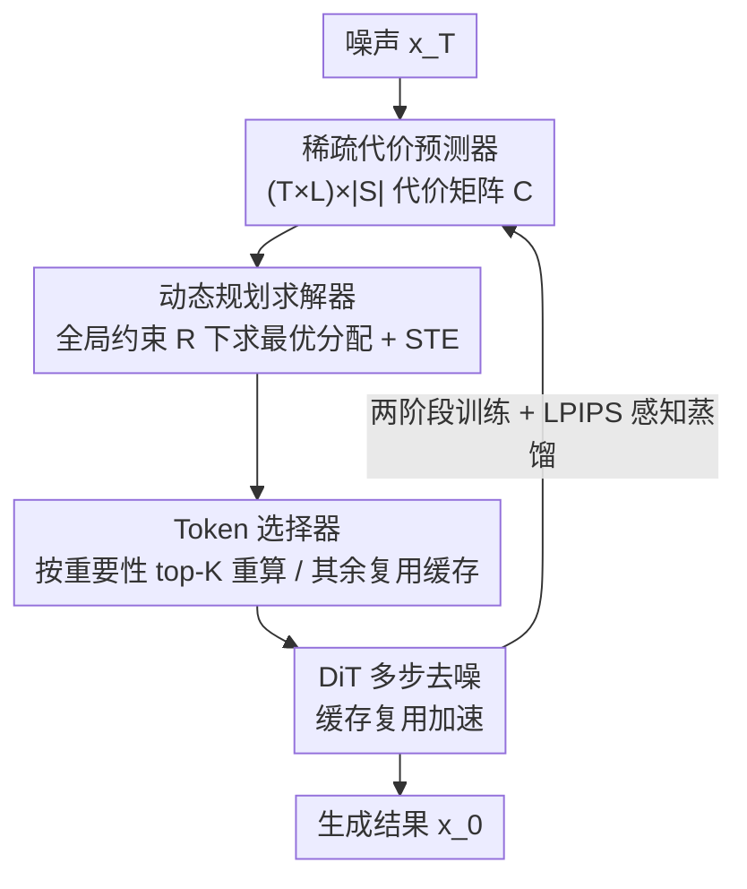

# DiffSparse: Accelerating Diffusion Transformers with Learned Token Sparsity

**会议**: ICLR2026  
**OpenReview**: [https://openreview.net/forum?id=V3eUas3VCL](https://openreview.net/forum?id=V3eUas3VCL)  
**代码**: 待确认  
**领域**: 扩散模型 / 生成模型加速  
**关键词**: 扩散 Transformer, Token 缓存, 层级稀疏, 动态规划, 感知蒸馏

## 一句话总结
DiffSparse 把扩散 Transformer 的 token 缓存加速重新表述成"在固定压缩率下，逐层逐时间步分配稀疏率"的可微优化问题：用一个可学习的稀疏代价预测器吐出代价矩阵、再用动态规划求全局最优分配，并配合两阶段训练去掉传统方法必须保留的"满步计算"，在 PixArt-α 上省 54% 算力的同时 FID 反超原模型。

## 研究背景与动机
**领域现状**：扩散模型生成质量很高，但多步去噪让推理成本极大。免训练的"特征缓存"是当下最流行的加速路线——相邻去噪步之间特征高度相似，于是把上一步算好的中间特征缓存起来、这一步直接复用，不必重算。早期方法缓存的是层级（layer-level）的粗粒度特征，后来的 token 缓存方法（ToCa、DuCa 等）把粒度细化到单个 token，按 token 重要性排序，复用一部分、重算一部分，加速更明显。

**现有痛点**：现有 token 缓存方法有两个硬伤。其一，每一层、每个时间步的复用稀疏率都要**手工设定**，参数空间巨大且极难调，限制了可扩展性。其二，为了维持画质，它们必须保留若干个**完整前向（满步）计算**的去噪步——这几步不做任何缓存，相当于在最该省的地方放弃了加速，把 token 缓存的潜力浪费掉了。

**核心矛盾**：稀疏分配的「质量—速度」权衡本质是个**组合优化问题**——在总压缩率 $R$ 的约束下，把有限的"算力预算"分给 $L$ 层 × $T$ 步里最该精算的位置。手工启发式既给不出全局最优，也绕不开"几步满步"的保底设计。

**本文目标**：(1) 让逐层稀疏率从手工调参变成端到端可学习；(2) 彻底去掉对预设满步的依赖，把算力自适应地搬到最需要的地方。

**核心 idea**：把"在固定压缩率下加速"显式建模成**跨时间步的逐层稀疏分配问题**——用一个小小的可学习网络预测每个 (层, 步, 稀疏档) 的"代价"，再用动态规划在全局约束下求最优分配，最后用直通估计（STE）让离散掩码也能反传梯度，整条链路端到端可训。

## 方法详解

### 整体框架
DiffSparse 接在已有的 token 缓存机制之上：输入是噪声 $x_T$，输出是去噪结果 $x_0$，中间每一步都要决定"哪些 token 重算、哪些复用缓存"。它由三个部件串成一条决策链——**稀疏代价预测器**先为所有 (时间步 $t$, 层 $l$, 候选稀疏档 $s$) 预测一个归一化代价矩阵 $C \in \mathbb{R}^{(T\times L)\times |S|}$；**动态规划求解器**在"总稀疏率 = $R$"的全局约束下，从这个代价矩阵里挑出累计代价最小的稀疏分配方案，并生成每层的二值掩码；**Token 选择器**则按掩码和 token 重要性，决定每层 top-$K$ 的 token 走重算、其余复用缓存。训练时，原始未剪枝模型当老师、剪枝模型当学生，用 LPIPS 感知蒸馏损失对齐两者的多步采样输出；DP 产生的离散掩码不可导，用 STE 近似梯度，从而把代价预测器端到端训起来。整套两阶段训练逐步把"满步"替换成缓存步。注意 DP 只在训练阶段跑（约 30 秒），推理时模型直接用预先算好的掩码，零额外开销。

### 关键设计

**1. 可学习的稀疏代价预测器：把"该给哪层多少稀疏"从手调变成可学**

针对"每层每步稀疏率全靠手工设、参数空间爆炸"的痛点，DiffSparse 用一组 $(T\times L)\times |S|$ 的可学习参数来直接参数化代价。给定 $L$ 层、$T$ 个去噪步，目标是为每个 (层 $l$, 步 $t$) 生成一个二值掩码 $M\in\{0,1\}^N$，选出 $K_{l,t}$ 个 token 走完整计算、其余 $N-K_{l,t}$ 个复用缓存。候选稀疏档来自一个离散集合 $S$，例如序列长 $N=256$、步长 32 时 $S=\{0,0.25,0.5,0.75,1.0\}$（对应保留 $\{0,64,128,192,256\}$ 个 token）。预测器输出归一化代价矩阵 $C$，每个元素 $C_{(t,l),s}$ 量化"在第 $t$ 步第 $l$ 层施加稀疏档 $s$"的代价。关键巧思在于：**预测器的体量只取决于 $T,L,|S|$，与 token 序列长度 $N$ 无关**——这让它天然能跨分辨率迁移，在 256×256 上学到的分配直接拿到 512×512 仍然有效（表 4），高分辨率因显存爆炸难以直接训练的问题被绕开了。消融也显示一味增大 $|S|$ 收益递减甚至变负（表 7，$|S|=5$ 即 0.25 间隔最优）。

**2. 动态规划稀疏分配求解器：在全局压缩率约束下求逐层最优**

有了代价矩阵，怎么在"总稀疏率必须等于 $R$"的硬约束下挑出代价最小的方案？这是个带约束的组合优化，DiffSparse 用动态规划精确求解。定义状态 $F(\hat l, r)$ 为"给前 $\hat l$ 层分配稀疏、且累计稀疏量为 $r$ 时的最小代价"，转移方程为

$$F(\hat l, r) = \min_{s\in S,\, s\le r}\big( F(\hat l-1,\, r-s) + C_{\hat l, s} \big),$$

对 $\hat l = 1,\dots,L\cdot T$、$r=0,\dots,\hat R$（$\hat R = R\cdot L\cdot T$）迭代求解，再回溯重建最优分配。时间复杂度 $O((L\cdot T)^2\cdot |S|)$，配合预剪枝去掉冗余状态后在实际配置下约 30 秒可解。由于"代价矩阵 → 离散掩码"这一步不可微，DiffSparse 用直通估计器（Straight-Through Estimator, STE）近似离散掩码对代价预测的梯度，使整个代价预测器可以端到端优化。和随机搜索、遗传算法这类传统搜索相比，DP + 可学习代价在巨大稀疏空间里找到的分配更好（FID 26.91 vs 28.34 / 27.94），训练时间也从约 16 小时降到约 4 小时。

**3. Token 选择器：按重要性决定每层哪些 token 重算**

DP 给出每层该保留多少 token（即稀疏档），具体保留哪几个则交给 Token 选择器。它给每个 token $\hat x_i$ 打一个复合重要性分

$$S(\hat x_i) = B\Big(\sum_{q=1}^{Q}\lambda_q\, s_q(\hat x_i)\Big),$$

其中每个 $s_q$ 是一种刻画 token 重要性的信号（如自注意力影响、交叉注意力聚焦度、缓存复用频率等），$\lambda_q$ 是加权超参；$B(\cdot)$ 是可选的"空间奖励"算子，鼓励被选 token 在空间上分布均匀（如对 $k\times k$ 邻域内的局部极大值加分）。按分数降序排，取 top-$K$（$K$ 由 DP 选出的稀疏率决定）走重算、其余复用缓存。作者强调这个打分模块和具体排序启发式是**正交**的：换成余弦相似度或 $\ell_2$ 范数排序也能从 DiffSparse 的分配里受益（表 5），其中注意力分数效果最好（FID 改善 −1.44），范数最差（引入噪声）。

**4. 两阶段训练策略：渐进去掉"满步"依赖**

传统方法死板地保留若干满步来纠正噪声误差，DiffSparse 想把这部分算力也释放出来，但直接全缓存又会掉质量，于是设计两阶段训练。第一阶段：按已有做法预设 $T_f$ 个满步位置，**独立**优化两个代价矩阵——编码时间维稀疏决策的步代价 $C_f\in\mathbb{R}^{T\times 2}$ 和管控每层 token 保留的层稀疏代价 $C_l\in\mathbb{R}^{(L\times T)\times|S|}$；先用 DP 在 $C_f$ 上选出累计代价最小的 $|T_f|$ 个满步位置，并对这些位置"暖启动"——把满档（$s=N$）的预测代价减去常数 $\delta$：

$$C_l^{(t,l,s)} \leftarrow C_l^{(t,l,s)} - \delta,\quad \forall t\in T_f,\, l\in\{1,\dots,L\},\, s=N.$$

这样既保留层间代价排序，又借满步的纠错能力做引导。第二阶段：把步代价并入层稀疏（同式暖启动），对统一后的代价矩阵微调，系统性地把 FLOPs 在采样步之间重新分配，让满步的影响逐步淡出、换成自适应的缓存步。消融显示两阶段比单阶段更好（FID 26.91 vs 27.40）；暖启动强度 $\delta=10$ 最优（表 8）。

### 损失函数 / 训练策略
训练用 **LPIPS 感知蒸馏损失**：把剪枝前的原模型当老师、剪枝后的当学生，两者各跑完整多步采样得到输出 $x_0$（老师）与 $x_0'$（学生），损失为

$$\mathcal{L}_{\text{LPIPS}} = \text{LPIPS}(x_0, x_0'),$$

只对学生反传、老师参数 detach。相比 L2（过度平滑、丢细节）和 SSIM（对空间偏移过度惩罚），LPIPS 在学习到的感知特征空间度量距离，最能保画质（表 6）。训练分两阶段、用 AdamW；PixArt-α 等模型只用 caption / 类别条件、不用真实图像数据，在 8 张 AMD MI250 上约 4–10 小时。推理时只用预算好的掩码，DP 不参与。

## 实验关键数据

### 主实验

文生图（PixArt-α，20 DPM++ 步，MS-COCO2017）：

| 方法 | MACs(T)↓ | 加速↑ | FID-30k↓ | CLIP↑ |
|------|----------|-------|----------|-------|
| PixArt-α（原模型） | 2.86 | 1.00× | 28.20 | 0.163 |
| ToCa | 1.64 | 1.75× | 28.35 | 0.164 |
| TaylorSeer | 1.57 | 1.83× | 29.08 | 0.163 |
| DuCa | 1.63 | 1.78× | 27.98 | 0.164 |
| **DiffSparse (R=43%)** | 1.64 | 1.74× | **26.91** | 0.164 |
| **DiffSparse (R=54%)** | 1.30 | **1.91×** | 27.79 | 0.164 |

R=43% 时 FID 26.91 比 ToCa 28.35 相对改善 +5.1%；R=54% 进一步加速到 1.91× 时 FID 27.79 甚至**反超原模型**——学到的稀疏调度加快了生成分布收敛、提升视觉保真度。类条件生成（DiT-XL/2，50 DDIM 步，ImageNet）同压缩比下 FID 从 ToCa 的 3.05 降到 2.81（2.07× 加速，优于 ToCa 8%）。文生视频（Wan2.1-1.3B，VBench）DiffSparse 拿到最高 VBench 43.83、2.05× 加速。

### 消融实验

| 配置 | FID↓ | 说明 |
|------|------|------|
| 完整模型（注意力分 + LPIPS + 0.25 间隔 + 两阶段 + δ=10） | 26.91 | 最优 |
| 单阶段训练 | 27.40 | 去掉两阶段，掉 0.49 |
| 范数 token 排序 | 28.89 | 换最差排序，掉 ~2 |
| L2 损失 / SSIM 损失 | 27.68 / 27.46 | 换损失，均不如 LPIPS |
| $|S|$ 间隔 1.0（$|S|=2$） | 28.22 | 候选档太粗 |
| $\delta=0$（无暖启动） | 27.40 | 去掉 Stage-1 先验 |

### 关键发现
- **代价预测器与 token 长度解耦**是跨分辨率迁移的关键：256×256 上训的分配直接用到 512×512 仍优于 ToCa（表 4），避免高分辨率直接训练的显存爆炸。
- **可微 DP 学习显著优于传统搜索**：随机搜索 / 遗传算法 1000 次迭代后 FID 仅 28.34 / 27.94、耗时约 16 小时，DiffSparse 26.91、约 4 小时。
- **token 重要性估计很关键**：注意力分数最好（−1.44）、范数最差，但分配方案对各种排序都能带来一致增益。
- 稀疏档间隔 0.25（$|S|=5$）是甜点：更细（0.125）层内变化太小难收敛，更粗（0.5/1.0）选择空间又太窄。

## 亮点与洞察
- **把"加速"重写成可微的组合优化**：用"可学习代价矩阵 + 动态规划 + STE"取代手工稀疏调参，这套"小网络预测代价、经典算法求全局最优、STE 打通梯度"的组合范式，可迁移到任何"在硬约束下分配离散资源"的问题（如逐层量化位宽、逐层剪枝率分配）。
- **代价预测器体量与序列长度无关**是真正聪明的一笔——既让参数极小，又天然支持跨分辨率零成本迁移，直接回避了高分辨率训练的显存墙。
- **彻底干掉"满步"保底**：两阶段 + 暖启动让满步的纠错能力被"学进"代价矩阵后再淡出，释放出此前被浪费的加速潜力，这是它在高压缩率下还能反超原模型的根因。
- token 打分模块与方法正交，意味着 DiffSparse 是个可叠加在现有 token 缓存方法之上的"分配层"，落地友好。

## 局限与展望
- **DP 复杂度 $O((L\cdot T)^2\cdot |S|)$** 随层数 × 步数平方增长，虽然只在训练期跑且约 30 秒，但对超深 / 超多步模型仍需预剪枝才能压住开销。
- 重要性打分里的 $\lambda_q$ 等权重仍是超参，"端到端"主要端到端在稀疏分配上，token 排序信号本身的组合权重并未一起学。
- 评测多在 256×256，更高分辨率主要靠"迁移"验证而非直接训练，极高分辨率 / 长视频下的稳健性还需更多证据。
- 改进方向：把 token 打分权重也纳入可微优化、或用更省的近似求解器替代 DP 以支持更大规模配置。

## 相关工作与启发
- **vs ToCa / DuCa（token 缓存）**：它们做细粒度 token 级缓存但稀疏率手调、且保留若干满步；DiffSparse 把稀疏分配变成端到端可学的 DP 优化、并去掉满步，同压缩比下 FID 持续更优。
- **vs TaylorSeer（cache-then-forecast）**：TaylorSeer 预测并更新缓存特征，优势主要在长程缓存；DiffSparse 不预测特征而是优化"哪层省多少"，在少步 DiT 上加速—质量平衡更好。
- **vs 采样器优化 / 蒸馏 / 剪枝**：这些改的是采样步数或模型参数；DiffSparse 属特征缓存路线、免改采样器与权重，且与它们正交、可叠加。

## 评分
- 新颖性: ⭐⭐⭐⭐⭐ 把 token 缓存加速重述为可微 DP 稀疏分配、代价预测器与序列长度解耦，思路干净且有普适性
- 实验充分度: ⭐⭐⭐⭐⭐ 覆盖 DiT-XL/2、PixArt-α、FLUX、Wan2.1 四类模型，主实验 + 6 组消融齐全
- 写作质量: ⭐⭐⭐⭐ 方法清晰、公式完整，部分打分信号 $s_q$ 细节放在附录略显含糊
- 价值: ⭐⭐⭐⭐⭐ 即插即用的分配层，PixArt-α 省 54% 算力仍反超原模型，工业部署吸引力强

<!-- RELATED:START -->

## 相关论文

- [\[CVPR 2025\] TinyFusion: Diffusion Transformers Learned Shallow](../../CVPR2025/image_generation/tinyfusion_diffusion_transformers_learned_shallow.md)
- [\[ICLR 2026\] Diffusion Transformers with Representation Autoencoders](diffusion_transformers_with_representation_autoencoders.md)
- [\[ICLR 2026\] Scaling Laws for Diffusion Transformers](scaling_laws_for_diffusion_transformers.md)
- [\[ICLR 2026\] Rethinking Global Text Conditioning in Diffusion Transformers](rethinking_global_text_conditioning_in_diffusion_transformers.md)
- [\[ICLR 2026\] A Hidden Semantic Bottleneck in Conditional Embeddings of Diffusion Transformers](a_hidden_semantic_bottleneck_in_conditional_embeddings_of_diffusion_transformers.md)

<!-- RELATED:END -->
