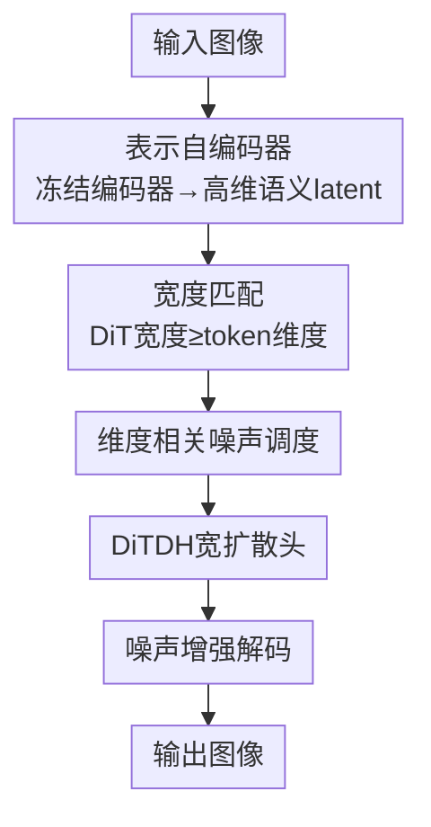

# Diffusion Transformers with Representation Autoencoders

**会议**: ICLR2026  
**OpenReview**: [https://openreview.net/forum?id=0u1LigJaab](https://openreview.net/forum?id=0u1LigJaab)  
**代码**: 待确认  
**领域**: 扩散模型 / 图像生成  
**关键词**: 表示自编码器, 扩散 Transformer, 潜空间扩散, DINOv2, 高维 latent

## 一句话总结
把潜空间扩散里沿用多年的 VAE 换成"冻结的预训练表示编码器（DINOv2 / SigLIP2 / MAE）+ 训练好的轻量 ViT 解码器"，再用三处针对高维 latent 的改造把扩散 Transformer 重新调通，最终在 ImageNet 256×256 上做到无引导 FID 1.51、带引导 1.13，收敛速度比 SiT 快 47×、比 REPA 快 16×。

## 研究背景与动机
**领域现状**：从 LDM 到 DiT，主流图像生成都走"先用预训练自编码器把像素压进 latent，再在 latent 上跑扩散"这条路。但这些年扩散骨干换了一代又一代，定义 latent 的那个自编码器却几乎原地踏步——绝大多数 DiT 仍在用 Stable Diffusion 时代的 SD-VAE。

**现有痛点**：SD-VAE 有三个老毛病。一是骨干老旧，是带激进下/上采样的卷积网络，编码器要 135 GFLOPs、解码器 310 GFLOPs，比同等 ViT 贵 3–6×；二是 latent 维度极低（把 $256^2$ 图压成 $32^2\times4$），信息容量被卡死；三是纯重建目标训出来的 latent 只抓局部外观、缺全局语义结构，线性探测在 ImageNet 上只有约 8% 准确率，几乎没有可用语义。

**核心矛盾**：与此同时表示学习突飞猛进，DINO / MAE / SigLIP 这些自监督、多模态编码器学到了语义结构极好的特征。但潜空间扩散一直和这股进展隔绝，因为业界有两条根深蒂固的"常识"：(1) 语义编码器"只关注高层信息、重建不出细节"，不适合做重建；(2) 扩散模型在高维 latent 空间里训不稳、效果差，所以大家偏爱低维 VAE latent。REPA 一类工作只能绕着走——用外部编码器的对齐损失去"间接"改善 latent，代价是多一个训练阶段、多一堆辅助损失和调参。

**本文目标**：直接证明这两条常识都是错的，把语义编码器本身变成扩散的自编码器，并把扩散 Transformer 在高维语义 latent 上重新训通。

**切入角度**：作者发现——只要配一个训练好的解码器，冻结的语义编码器完全能重建出像素级细节；而扩散在高维 latent 训不动，根因不是"高维"本身，而是若干为低维 VAE 量身定做的设计（模型宽度、噪声调度、解码器鲁棒性）没跟上。把这几处改对，高维反而是优势：语义更丰、收敛更快、生成更好，且因为 token 数固定、通道在第一层就投影到 DiT 隐维，几乎不增加算力。

**核心 idea**：用"冻结表示编码器 + 训练解码器"组成**表示自编码器（Representation Autoencoder, RAE）**替换 VAE，再用三个针对高维 latent 的改造让 DiT 重新跑通，让语义建模和生成建模共享同一个 latent。

## 方法详解

### 整体框架
RAE 的目标只有一句：把潜空间扩散赖以生存的那个自编码器，从"压缩器"升级成"表示基础"。整条管线是——输入图像先经**冻结的预训练表示编码器**得到一组高维语义 token（不做压缩，token 数和原来 SD-VAE 的 256 个对齐），扩散 Transformer 在这个高维 latent 上学习去噪/速度场，采样出的 latent 再经一个**训练好的 ViT 解码器**还原成图像。难点全在中间那段：标准 DiT 是为低维 VAE token 设计的，直接搬到高维 RAE latent 上会彻底失败（DiT-S 的 gFID 高达 215）。作者诊断出三个症结并各给一个改造——宽度要匹配 token 维度、噪声调度要按"有效数据维度"重定、解码器要能容忍扩散输出的噪声——最后再加一个宽 DDT 头（DiTDH），让模型在不付出二次方算力的前提下把宽度撑起来。

### 关键设计

**1. 表示自编码器（RAE）：冻结语义编码器 + 训练解码器，不做压缩**

针对"VAE latent 低容量、弱语义"的痛点，RAE 直接把编码器换成冻结的预训练表示模型 $E$（DINOv2-B、SigLIP2-B 或 MAE-B，patch size $p_e$、隐维 $d$），输入 $x\in\mathbb{R}^{3\times H\times W}$ 编码成 $N=HW/p_e^2$ 个 $d$ 维 token，**全程不压缩通道**；再训练一个 ViT 解码器 $D$ 把 token 还原成像素，损失沿用 VAE 的常规组合 $L_{\text{rec}}(x)=\omega_L\,\text{LPIPS}(\hat{x},x)+L_1(\hat{x},x)+\omega_G\lambda\,\text{GAN}(\hat{x},x)$，其中 $z=E(x),\ \hat{x}=D(z)$。结果直接推翻"语义编码器重建不了细节"的成见：RAE 的重建 rFID（MAE-B 达 0.16、DINOv2-B 0.49）全面优于 SD-VAE 的 0.62，而解码器即使只用 ViT-B 也比 SD-VAE 省 14× 算力。更关键的是语义——因为编码器冻结，RAE 直接继承底座的表示能力，线性探测准确率 84.5%（DINOv2-B）对 SD-VAE 的 8%。一个有意思的细节：重建质量在 DINOv2-S/B/L 之间几乎不变，说明小编码器也保留了足够的低层细节供解码。

**2. 宽度匹配：DiT 宽度必须不小于 token 维度**

标准 DiT 在 RAE latent 上失败的第一个根因是模型太"窄"。作者用单图过拟合实验把问题逼出来：固定深度只改宽度，当 DiT 隐维 $d<$ token 维度 $n=768$ 时，模型连一张图都拟合不了、损失卡住；一旦 $d\ge n$，损失骤降、几乎完美复现输入。加深网络（深度 12→24）则几乎没用。作者给出理论解释（定理 1）：对宽度 $d<n$ 的 DiT 函数族 $G_d=\{g(x_t,t)=Bf(Ax_t,t)\}$，其速度场损失存在下界

$$L(g,\theta)\ge\sum_{i=d+1}^{n}\lambda_i$$

其中 $\lambda_i$ 是 $W=\varepsilon-x$ 协方差矩阵的特征值；只有 $d\ge n$ 时 $G_d$ 才包含唯一最优解。直觉是：扩散训练全程往数据注入高斯噪声，等于把原本低内在维的数据流形"撑"成满秩，于是模型容量必须随完整数据维度走。所以对 DINOv2-B（768 维）就得配 DiT-XL 这种宽骨干。（⚠️ 定理表述以原文为准。）

**3. 维度相关的噪声调度 shift：把"分辨率相关"推广到"有效数据维度"**

第二个根因在噪声调度。以往工作发现高分辨率输入在同一噪声水平下被破坏得更少、会损害训练，于是提出分辨率相关的 schedule shift——但这些都是基于通道数很少（$C\le16$）的像素/VAE 输入推出来的。RAE 通道数高得多，高斯噪声同时加在空间和通道上，通道一多每个 token 的"有效分辨率"也涨，信息被破坏得更少。作者据此主张：调度该按**有效数据维度**（token 数 × token 维度）而非分辨率来调。具体采用 Esser 等人的 shift 公式 $t_m=\frac{\alpha t_n}{1+(\alpha-1)t_n}$，缩放因子 $\alpha=\sqrt{m/n}$ 依赖维度，基准维 $n=4096$，$m$ 取 RAE 的有效数据维度。仅此一项就把 gFID 从 23.08 降到 4.81，是高维 latent 训练能否成立的关键。

**4. DiTDH：用浅而宽的 DDT 头把宽度撑起来，避免二次方算力**

设计 2 要求宽度匹配 token 维度，但把整个 DiT 骨干都加宽，算力随宽度二次方暴涨。受 DDT 启发，作者给标准 DiT 外挂一个**浅而宽的 Transformer 去噪头** $H$：基座 DiT $M$ 先产出特征 $z_t=M(x_t\mid t,y)$，宽头再据此预测速度 $v_t=H(x_t\mid z_t,t)$，这个增强结构记为 DiTDH。所有实验用 2 层、2048 维的 DDT 头。它在满足宽度需求的同时保持特征紧凑，还能滤掉高维 latent 里更多的噪声信息。效果显著：DiTDH-B 只用 DiT-XL 约 40% 的训练算力就大幅反超它；DiTDH-XL 在同等预算下把 FID 做到 2.16，几乎是 DiT-XL（约 4.28）的一半；且编码器越大优势越明显（DINOv2-L 上把 FID 从 6.09 压到 2.73）。

**5. 噪声增强解码：让解码器容忍扩散采样出的"脏" latent**

第三个根因是训练/推理分布不匹配。VAE 解码器面对的是连续高斯 latent，本就容忍小噪声；而 RAE 解码器只在离散支撑的干净 latent $p(z)=\sum_i\delta(x-z_i)$ 上训练，扩散在推理时采样出的 latent 略有噪声、会偏离训练分布，造成 OOD 退化。借鉴归一化流的思路，作者在解码器训练时给 latent 加性噪声 $n\sim\mathcal{N}(0,\sigma^2 I)$，即改在平滑分布 $p_n(z)=\int p(z-n)\,\mathcal{N}(0,\sigma^2 I)(n)\,\mathrm{d}n$ 上训练；并让 $\sigma$ 从 $|\mathcal{N}(0,\tau^2)|$ 采样以正则化。这是一个明确的取舍——它把 gFID 从 4.81 改善到 4.28，但因为平滑掉了细节、rFID 从 0.49 略升到 0.57，整体偏向更稳的生成。

### 损失函数 / 训练策略
扩散侧用 flow matching 目标，线性插值 $x_t=(1-t)x+t\varepsilon$（$\varepsilon\sim\mathcal{N}(0,I)$），模型预测速度 $v(x_t,t)$；骨干用 LightningDiT，patch size 取 1，256×256 图对应 256 个 token，与 VAE-DiT 对齐，故几乎不增计算开销。采样用 50 步 Euler，gFID 在 5 万样本上计算。解码器侧用 $L_1$+LPIPS+GAN 的组合损失训练。值得一提的是，整套方法**不需要任何 REPA 式的表示对齐辅助损失**就能更快收敛。

## 实验关键数据

### 主实验
ImageNet 256×256 类条件生成（DiTDH-XL + RAE/DINOv2-B），全面刷新 SOTA：

| 设置 | 指标 | 本文 | 之前 SOTA | 说明 |
|------|------|------|----------|------|
| 256×256 无引导 | gFID | **1.51** | REPA-E 1.70 / VA-VAE 2.17 | 大幅领先 |
| 256×256 带引导 | gFID | **1.13** | REPA-E 1.15 | AutoGuidance |
| 512×512 带引导 | gFID | **1.13** | EDM-2 1.25 | 400 epoch |
| 重建 rFID | rFID | 0.49（DINOv2-B）/ 0.16（MAE-B） | SD-VAE 0.62 | RAE 全面更优 |
| 收敛速度 | 训练加速 | 47×（vs SiT-XL）/ 16×（vs REPA-XL） | — | 同模型规模 |

### 消融实验
逐项验证三处改造各自的贡献：

| 配置 | 关键指标(gFID) | 说明 |
|------|---------|------|
| 标准 DiT-XL on RAE | 23.08 | 不改造，远差于 VAE 版 7.13 |
| + 维度相关噪声调度 | 4.81 | 单项从 23.08→4.81，最关键 |
| + 噪声增强解码 | 4.28 | rFID 略升(0.49→0.57)换 gFID 改善 |
| + DiTDH 宽头 | 2.16 | 同预算把 FID 砍半 |
| 宽度 $d<n$（单图过拟合） | 损失不收敛 | DiT-S 配 DINOv2-B 直接失败 |

### 关键发现
- **维度相关噪声调度是高维 latent 能否训通的命门**：单这一项就把 gFID 从 23 降到 4.8，是改造里收益最大的一步。
- **宽度而非深度决定成败**：单图实验里加宽度损失骤降、加深度几乎无效，印证"宽度须 ≥ token 维度"的理论。
- **重建好 ≠ 生成好**：MAE 的 rFID 最低（0.16），但生成最强的是 DINOv2，作者据此默认 DINOv2 编码器。
- **解码器可解耦做高分辨率**：让解码器 patch size $p_d=2p_e$，可直接把 256 训练的扩散模型复用到 512 输出，只用 256 个 token，比直接训 1024 token 省 4×，gFID 1.61 仍有竞争力。

## 亮点与洞察
- **一次推翻两条"常识"**：既证明语义编码器配好解码器能做像素级重建，又证明扩散在高维 latent 不仅能训、还更好——把"该不该用语义 latent"从信仰问题变成工程问题，这是最让人"啊哈"的地方。
- **零额外开销的高维**：因为 token 数由 patch size 固定、通道在 DiT 第一层就投影到隐维，换上 768 维语义 latent 相比 4 维 VAE latent 几乎不增加计算/显存，打破了"高维必然更贵"的直觉。
- **诊断—理论—改造闭环漂亮**：作者没有把"DiT 在 RAE 上失败"当黑箱调参，而是用单图过拟合实验定位到宽度，再给出特征值下界的理论解释，方法论值得迁移到其他"训不动"的排查。
- **DiTDH 的解耦思路可复用**：把"宽度需求"从整条骨干剥离到一个浅而宽的头上，是在任何需要大宽度但怕二次方算力的场景都能借鉴的 trick。

## 局限与展望
- **作者承认**：噪声增强解码是一个明确取舍，平滑 latent 会牺牲重建细节（rFID 0.49→0.57）；高分辨率合成虽可用解码器上采样省 token，但直接训 1024 token 的 gFID（1.13）仍优于上采样（1.61）。
- **依赖冻结底座**：RAE 的语义能力完全继承自预训练编码器，编码器的偏置/盲区会原样传递；论文只在 ImageNet 类条件生成上验证，文本到图像、视频等更复杂条件下是否同样成立尚未展示。
- **评测口径需注意**：作者发现类别均衡采样比均匀随机采样系统性低约 0.1 FID，并据此重跑了若干 baseline——横向比较时要确认口径一致，否则数字不可直接比大小。
- **可改进方向**：把 RAE 推广到更多模态/更高分辨率、探索可训练而非冻结的编码器是否进一步提升、以及把"宽度匹配"理论用于指导其他高维生成任务的架构选择。

## 相关工作与启发
- **vs SD-VAE / LDM**：传统潜空间扩散用纯重建训练、激进压缩的卷积 VAE，latent 低维、弱语义、算力高；RAE 用冻结语义编码器 + 轻量 ViT 解码器，重建更好、语义更强、还更省算力，主张 RAE 应成为扩散 Transformer 的新默认。
- **vs REPA / REPA-E**：REPA 一类用表示对齐损失"间接"把语义注入 VAE latent，需要额外训练阶段和辅助损失；RAE 直接让扩散在语义 latent 上跑，无需任何对齐损失，收敛还快 16×。
- **vs DDT**：DiTDH 的宽头受 DDT 启发，但出发点不同——DDT 关注解码/编码分工，本文是为了在高维 latent 下满足"宽度 ≥ token 维度"的硬约束又不付二次方算力。

## 评分
- 新颖性: ⭐⭐⭐⭐⭐ 同时推翻"语义编码器不能重建"和"扩散不适合高维"两条共识，重定义了自编码器在扩散里的角色
- 实验充分度: ⭐⭐⭐⭐⭐ 单图诊断 + 理论 + 逐项消融 + 256/512 SOTA + 评测口径校正，链条完整
- 写作质量: ⭐⭐⭐⭐⭐ 诊断—理论—改造的叙事清晰，每步改造都有对照数字
- 价值: ⭐⭐⭐⭐⭐ 可能改变潜空间扩散的默认自编码器选择，工程影响面大

<!-- RELATED:START -->

## 相关论文

- [\[CVPR 2026\] MeanFlow Transformers with Representation Autoencoders](../../CVPR2026/image_generation/meanflow_transformers_with_representation_autoencoders.md)
- [\[ICLR 2026\] DiffSparse: Accelerating Diffusion Transformers with Learned Token Sparsity](diffsparse_accelerating_diffusion_transformers_with_learned_token_sparsity.md)
- [\[ICLR 2026\] Aligning Visual Foundation Encoders to Tokenizers for Diffusion Models](aligning_visual_foundation_encoders_to_tokenizers_for_diffusion_models.md)
- [\[ICLR 2026\] Scaling Laws for Diffusion Transformers](scaling_laws_for_diffusion_transformers.md)
- [\[ICLR 2026\] Rethinking Global Text Conditioning in Diffusion Transformers](rethinking_global_text_conditioning_in_diffusion_transformers.md)

<!-- RELATED:END -->
