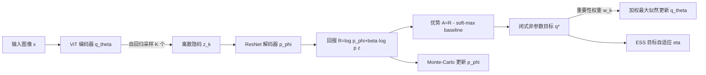

# Discrete Variational Autoencoding via Policy Search

**会议**: ICLR 2026  
**OpenReview**: [https://openreview.net/forum?id=wJhhCmbFzY](https://openreview.net/forum?id=wJhhCmbFzY)  
**代码**: [drolet.io/daps](https://drolet.io/daps)  
**领域**: 图像生成 / 离散表示学习 / 自编码器  
**关键词**: 离散 VAE、策略搜索、ELBO、自回归编码器、信任域、有效样本量、ImageNet 重建  

## 一句话总结
把离散 VAE 编码器的训练重新表述成一个 KL 正则化的策略搜索问题——用非参数目标分布的自然梯度去更新参数化编码器（加权最大似然），从而完全绕开 Gumbel-Softmax、直通估计和反向传播采样路径，让自回归离散编码器在 ImageNet 这种高维数据上也能稳定训练并超过量化类方法。

## 研究背景与动机
**领域现状**：离散隐变量瓶颈在 VAE 里很有吸引力——比特效率高、能配自回归 transformer 做多模态搜索、还能接组合优化工具。但离散随机变量没有精确的可微参数化，主流做法只能退而求其次。

**现有痛点**：三类方法各有死结。(1) **近似重参数化**（Gumbel-Softmax + 直通估计）对温度 $\tau$ 极度敏感——温度低则梯度方差爆炸、温度高则近似误差大；瓶颈一大，反向传播软分配的显存开销和梯度消失/爆炸问题随自回归采样累积。GR-MCK 用 Rao-Blackwell 降方差也没根治。(2) **向量量化**（VQ-VAE、FSQ）靠直通估计回避离散重参数化，但隐分布不可解析，**算不出 ELBO**，从而无法在目标里最大化隐空间熵，得靠特制损失和编码本利用率技巧。(3) **梯度无关方法**（REINFORCE 及其控制变元变体 REBAR/MuProp）能给出 ELBO 的无偏梯度，但方差太大，在图像重建这种高维任务上一直没成功过。

**核心矛盾**：表达力强的自回归离散编码器值得拥有，但它既不能精确重参数化、又无法承受 BPTT 的梯度敏感性，而无偏的打分函数估计器方差又大到没法用。

**本文目标**：训练一个能在 ImageNet 上工作的自回归离散编码器，直接优化真正的 ELBO（含熵/比特率控制），还要训练稳定、超过量化方法。

**核心 idea**：<u>强化学习里的策略搜索早就解决过"在不可微采样分布上做带信任域的梯度优化"这个问题，而离散 VAE 社区把这些进展（KL 信任域、零阶自然梯度、REPS）忽略了。</u>把编码器当策略、重建对数似然当回报，借用 REPS/V-MPO 那套"先解一个闭式非参数目标分布，再用加权最大似然把参数策略拉过去"的框架，就能完全避开采样路径的反向传播。

## 方法详解

### 整体框架
DAPS（Discrete Autoencoding via Policy Search）把 ELBO 看成熵正则化的回报最大化问题，对编码器和解码器用坐标下降交替更新。编码器更新分两步：先在给定样本上求出一个**闭式非参数目标分布** $q^*$，再用**自重归一化重要性采样 + 加权最大似然**把参数化编码器 $q_\theta$ 拉向 $q^*$，全程不需要对自回归采样反向传播。一个标量信任域参数 $\eta$ 用有效样本量（ESS）目标自动调节，给出跨任务、跨损失尺度都稳定的步长。

### 关键设计

**1. ELBO 即熵正则回报：把编码器变成策略。** DAPS 引入回报 $R(z,x)=\log p_\phi(x\mid z)+\beta\log p(z)$，于是 $\beta$-ELBO 就等价于 $J(q)=\mathbb{E}_x\sum_z q_\theta(z\mid x)R(z,x)+\beta H(q(z\mid x))$，这正是最大熵强化学习的目标，只不过没有序贯决策，所以对应的是 episode-based policy search。编码器 $q_\theta(z\mid x)$ 扮演策略、重建对数似然扮演回报，这个映射让整套策略搜索工具箱可以直接搬过来用，而且把熵项显式留在目标里——这正是 VQ 类方法做不到的（它们隐分布不可解析）。为降低 Monte-Carlo 估计方差又不引入偏差，DAPS 用 $K$ 个样本的 **soft-max 回报作乐观基线**，得到优势 $A(z,x)=R(z,x)-\log\sum_{k=1}^K\exp R(z_k,x)$，这是 soft-Value 的乐观估计，在"样本来自最优编码器"假设下准确，比直接估期望回报更抗离群点。

**2. 闭式非参数目标 $q^*$：带 KL 信任域的一步最优。** 借鉴 REPS，DAPS 解一个约束优化——在"相对上一版参数策略 $q_\theta$ 的 KL 散度不超过 $\epsilon_\eta$"的信任域内最大化期望优势加熵：$\max_q \int_x p(x)\sum_z q\,A + \beta H(q)$ s.t. $D_{KL}(q\|q_\theta)\le\epsilon_\eta$。用拉格朗日乘子求解得到闭式解 $q^*(z\mid x)\propto\exp\!\big(\frac{A(z,x)+\eta\log q_\theta(z\mid x)}{\eta+\beta}\big)$，其中 $\eta$ 控制信任域大小（往最优策略迈多大步）、$\beta$ 控制策略熵。关键洞察是：$q^*$ 的归一化常数在高维隐空间下不可解（要对所有动作求和），**但我们根本不需要它**——只要能在采样到的粒子上逐点计算 $q^*$ 与 $q_\theta$ 的比值，就足以构造重要性权重去更新参数策略。

**3. 加权最大似然 + 自重归一化重要性采样：彻底甩掉采样路径反传。** 有了 $q^*$ 后，把 $q_\theta$ 朝它做最大似然即可，等价于最小化 $\int_x p(x)D_{KL}(q^*\|q_\theta)$。由于无法直接从 $q^*$ 采样，用当前 $q_\theta$ 作提议分布做重要性采样，目标变成 $L(\theta)\approx-\frac1N\sum_i\sum_k w_{ik}\log q_\theta(z_k\mid x_i)$，权重 $w_i=q^*(z\mid x_i)/q_\theta(z\mid x_i)$。因为 $q^*$ 归一化常数未知，只能算到一个常数倍，于是改用**自重归一化权重** $\tilde w_i=w_i/\sum_j w_j$——方差更低，代价是引入随样本量渐近消失的偏差。这一步是 DAPS 的命门：梯度只经过 $\log q_\theta(z_k\mid x)$（一个对已采样离散序列的对数似然），**完全不穿过自回归采样过程**，所以既没有 Gumbel 温度调参、也没有直通估计、更没有 BPTT 的梯度消失。解码器 $p_\phi$ 则用坐标下降独立更新，目标 $L(\phi)=-\sum_i\mathbb{E}_{z\sim q_\theta}[\log p_\phi(x_i\mid z)]$，因为不重参数化，解码器更新不依赖 $\theta$，KL 先验项可直接丢掉。

**4. ESS 自适应信任域：一个标量管全部步长。** 信任域乘子 $\eta$ 不是手调的——DAPS 把它当可训练参数，用有效样本量（ESS）作为二阶 Rényi 散度的可解代理来自动调节：$\widehat{\mathrm{ESS}}_\eta=\frac1N\sum_i\frac{(\sum_k w_{ik})^2}{\sum_k w_{ik}^2}$，然后用 SGD 最小化 $(\widehat{\mathrm{ESS}}_\eta-\mathrm{ESS}_{\text{target}})^2$ 把它逼到目标水平。目标取 $\mathrm{ESS}_{\text{target}}\in[K/4,3K/4]$ 时收敛稳定；训练中 $\eta$ 会随时间平滑衰减，自动给出递减的步长，并且自适应地吸收不同任务、不同重建损失尺度的差异——这正是 DAPS 跨 MNIST/CIFAR/ImageNet/机器人运动都不用重调超参的原因。

## 实验关键数据

### 主实验（表 1：跨 4 数据集验证指标，多 seed 均值）

| Method | MNIST β-ELBO/PSNR | CIFAR β-ELBO/PSNR/FID | ImageNet β-ELBO/PSNR/FID | LAFAN β-ELBO/PSNR |
|---|---|---|---|---|
| FSQ | – / 18.42 | – / 24.19 / 163.00 | – / 24.24 / 54.54 | – / 36.19 |
| VQ-VAE | – / 18.45 | – / 24.19 / 164.30 | – / 23.83 / 65.01 | – / 31.04 |
| GR-MCK | -62.25 / 16.78 | 217.45 / 22.69 / 179.88 | 60.7k / 23.01 / 73.21 | -1008.12 / 34.11 |
| Gumbel | -68.07 / 16.30 | 704.92 / 23.74 / 169.87 | – / – / – | -998.49 / 34.51 |
| Gumbel-NA | -47.09 / 18.21 | 785.35 / 24.27 / 162.04 | 85.2k / 24.49 / 51.66 | -1400.05 / 27.89 |
| **DAPS** | -46.54 / 18.23 | 1185.51 / **25.21** / 157.27 | 87.0k / **24.66** / **48.65** | -949.78 / **36.81** |
| **DAPS-NA** | -46.96 / **18.36** | 977.39 / 25.02 / **156.33** | 78.8k / 24.40 / 57.43 | -1050.25 / 32.90 |

- **CIFAR/ImageNet 重建质量最优**：DAPS 在 CIFAR PSNR 25.21（vs FSQ 24.19）、ImageNet PSNR 24.66 与 FID 48.65（vs FSQ 54.54、VQ-VAE 65.01）均领先，证明在高维、紧凑瓶颈下重建优于量化和近似重参数化方法。
- **LAFAN 机器人运动**：DAPS PSNR 36.81 居首，说明方法不止于像素域，学到的离散隐空间能驱动 Unitree H1 的全身表达性动作生成。

### 消融实验（CIFAR-10，β 与 ESS target 网格）

| 超参 | 取值范围 | 观察 |
|---|---|---|
| $\beta$ | {0.1, 1.0, 5.0, 10.0} + 退火 | **退火 $\beta$ 最强**：早期高熵促探索、后期低熵抓重建质量；是最关键超参 |
| ESS target | {K/4, K/2, 3K/4} | 几乎不敏感，仅影响 $\eta$ 的自适应轨迹，凸显方法鲁棒性 |
| 编码本利用率 | 图 2 | DAPS 编码本利用率显著高于 FSQ 与 VQ-VAE |

### 关键发现
- **自回归梯度估计是难点而非自回归本身**：Gumbel-NA（非自回归）在多数数据集反而胜过自回归 Gumbel，说明软分配穿过自回归采样的梯度估计极不稳定——而 DAPS 因为不穿采样路径，自回归版（DAPS）通常优于 DAPS-NA。
- **稳定性差距明显**：自回归 Gumbel 在基准学习率下不稳定、需逐数据集调参，被排除出 ImageNet 实验；DAPS 全程用统一学习率 $3\times10^{-4}$ 不重调。
- **熵/比特率可控 + 编码本利用充分**：显式 $\beta$ 熵正则让 DAPS 拿到最高编码本利用率，避免了 VQ 类方法编码本坍缩需要特制技巧的问题。

## 亮点与洞察
- **跨领域知识迁移的范式样本**：把离散 VAE 训练这个长期被"近似重参数化 vs 量化"二选一框住的问题，重新放进策略搜索语境，直接继承了 RL 十几年在信任域、自然梯度、ESS 自适应上的成熟成果——这种"换语境解死结"的思路本身极具启发性。
- **"不需要归一化常数"是工程上的胜负手**：$q^*$ 的闭式解虽然带不可解的归一化项，但重要性权重的自重归一化恰好把它消掉，使得高维离散瓶颈下的更新变得可计算。
- **一个标量 $\eta$ 替代了一堆调参**：ESS 自适应把"步长/信任域/损失尺度"三件事统一成单参数自动调节，是 DAPS 免调参跨数据集的根本原因。
- **真正的 ELBO 而非代理损失**：相比 VQ-VAE/FSQ 用代理损失，DAPS 直接优化含熵项的 ELBO，带来显式的比特率控制和随机离散隐变量（可供下游搜索）。

## 局限与展望
- **样本数 $K$ 的开销**：每个数据点要采 $K$ 个隐序列算优势与权重，K 偏小时 soft-max 基线和自重归一化的偏差会上升，大 K 又增成本，文中未充分刻画 K 的精度-成本前沿。
- **自重归一化偏差**：自重归一化重要性权重引入有限样本偏差，虽渐近消失，但在小批量/小 K 下对优化的实际影响缺少定量分析。
- **β 退火需要 schedule**：最强结果依赖 $\beta$ 退火曲线，虽然比 Gumbel 温度好调，但仍是一个需要设计的调度而非完全免调。
- **生成能力未展开**：论文聚焦重建（PSNR/FID/ELBO），但离散隐空间配自回归先验做无条件生成的质量、以及下游"组合搜索"承诺只点到为止，未系统评测。
- **更大规模与其他模态**：ImageNet-256 已是上限，文本/音频等其他离散模态、以及与现代扩散/AR 生成栈的结合留待后续。

## 相关工作与启发
- **离散重参数化**：Gumbel-Softmax（Jang 2016）、GR-MCK（Paulus 2020）——DAPS 的直接对照与被替代对象。
- **向量量化**：VQ-VAE（van den Oord 2017）、FSQ（Mentzer 2023）——DAPS 在重建质量与编码本利用率上的主要竞品，区别在于 DAPS 可解析 ELBO 并显式正则熵。
- **打分函数估计**：REINFORCE（Williams 1992）、REBAR（Tucker 2017）、MuProp（Gu 2015）——同为无偏离散梯度，但方差大；DAPS 用信任域+自然梯度的策略搜索思路超越之。
- **策略搜索骨架**：REPS（Peters 2010）提供闭式非参数目标 + 信任域；V-MPO（Song 2019）、SPU（Vuong 2018）提供加权最大似然更新；LBPS（Watson & Peters 2023）提供 ESS 自适应——DAPS 是这三条线在离散 VAE 上的合流。
- **启发**：当某个子领域被"几种近似各有死结"卡住时，去看隔壁领域（这里是 RL）是否早把同构问题解过了——可微性不是唯一出路，加权最大似然 + 信任域是绕过不可微采样的通用利器。

## 评分
- **新颖性**: ⭐⭐⭐⭐⭐ 把离散 VAE 训练彻底重构为策略搜索问题，方法路线在该子领域是全新的，且每个组件（非参数 $q^*$、加权 MLE、ESS 自适应）都有清晰来源与作用。
- **实验充分度**: ⭐⭐⭐⭐ 覆盖 MNIST→CIFAR→ImageNet→机器人运动四个递增规模，多 seed、统一瓶颈/参数量对照、β 与 ESS 消融齐全；扣分在缺生成质量与 K 的成本-精度分析。
- **写作质量**: ⭐⭐⭐⭐ 推导自洽、RL 到 VAE 的映射讲解清晰且声明自包含，算法伪代码完整；公式较密集对非 RL 背景读者有门槛。
- **价值**: ⭐⭐⭐⭐⭐ 给出了首个在 ImageNet 规模上稳定胜过量化方法、又能优化真正 ELBO 的离散自编码器训练框架，对离散表示学习和多模态/组合搜索下游都有实用价值。

<!-- RELATED:START -->

## 相关论文

- [\[ICLR 2026\] Variational Autoencoding Discrete Diffusion with Enhanced Dimensional Correlations Modeling](variational_autoencoding_discrete_diffusion_with_enhanced_dimensional_correlatio.md)
- [\[ICLR 2026\] Embracing Discrete Search: A Reasonable Approach to Causal Structure Learning](embracing_discrete_search_a_reasonable_approach_to_causal_structure_learning.md)
- [\[ICLR 2026\] Pareto Variational Autoencoder](pareto_variational_autoencoder.md)
- [\[CVPR 2026\] VA-π: Variational Policy Alignment for Pixel-Aware Autoregressive Generation](../../CVPR2026/image_generation/va-p_variational_policy_alignment_for_pixel-aware_autoregressive_generation.md)
- [\[ICLR 2026\] Latent Diffusion Model without Variational Autoencoder](latent_diffusion_model_without_variational_autoencoder.md)

<!-- RELATED:END -->
