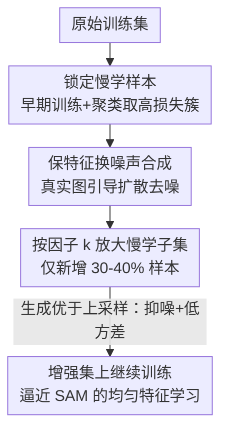

# Do We Need All the Synthetic Data? Targeted Image Augmentation via Diffusion Models

**会议**: ICLR2026  
**OpenReview**: [https://openreview.net/forum?id=VaGvbAgBmd](https://openreview.net/forum?id=VaGvbAgBmd)  
**代码**: https://github.com/BigML-CS-UCLA/TADA  
**领域**: 扩散模型 / 数据增强 / 图像分类  
**关键词**: 定向数据增强, 扩散模型, 慢学特征, SAM, 泛化

## 一句话总结
TADA 不再用扩散模型把整个训练集翻 10–30 倍，而是只挑出"早期训练学不会"的那 30–40% 慢学样本，用真实图像引导扩散生成"保留语义特征、只替换噪声"的合成图去定向放大它们；理论与实验都证明，只增强这一小撮样本反而比全量增强更强，并能让 SGD 在 CIFAR-100/TinyImageNet 上超过 SAM。

## 研究背景与动机
**领域现状**：用扩散模型（Stable Diffusion、GLIDE 等）生成合成图来扩充训练集，已经成为提升图像分类泛化的有效手段，效果普遍优于随机裁剪/翻转这类弱增强和 PixMix/DeepAugment 这类强增强。

**现有痛点**：主流做法是按类别标签（或对整份训练数据加噪）条件式地生成大量合成图，但它们既难保证多样性，又往往要把训练集扩到原来的 10×（Azizi 2023）甚至 30×（DreamDA），带来巨大的生成与训练开销。即便像 Boomerang/DiffCoRe-Mix 这种"1× 增强"的省钱方案，系统复杂度和生成成本依然不低。

**核心矛盾**：大家都在卷"怎么生成更复杂更逼真的合成图"，却没人问"**到底要不要给所有样本都配合成图**"。直觉上，只增强一部分样本会引入训练/测试分布偏移、反而伤害分布内性能——所以"少即是多"看起来不成立。

**切入角度**：作者抓住优化理论里的一个发现（Nguyen 2024）——**让各特征以更均匀的速度被学习，泛化会更好**。这正是 SAM（Sharpness-Aware Minimization）优于普通梯度下降的内因：SAM 会加速学习那些"慢学特征"（slow-learnable features），同时抑制对噪声的过拟合。既然如此，如果能**专门加速慢学样本的学习**，就有望复刻 SAM 的好处。

**核心 idea**：先找出早期训练就学不会的"慢学样本"，再用真实图像引导扩散模型生成"特征不变、噪声变了"的合成图去定向放大它们——用合成而非简单复制，是为了在放大慢学特征的同时**不放大噪声**。这就是 TADA（TArgeted Diffusion Augmentation）。

## 方法详解

### 整体框架
TADA 的目标是：在不动整套生成管线、不扩张全量数据集的前提下，只对"难学"的那部分样本做高质量定向增强，从而把训练动力学推向 SAM 那种"更均匀的特征学习"。整条流水线是：拿原始训练集先正常训几个 epoch → 用模型早期输出做聚类，把高平均损失那一簇判为慢学样本 → 对每张慢学样本用真实图作引导、跑扩散的"加噪—去噪"生成出保特征换噪声的合成图 → 按放大因子 $k$（最高 5×）只扩充这部分慢学子集（最终新增样本仅占原集 30–40%）→ 在增强后的数据上继续训练。背后有一套两层 CNN 的理论分析，解释了"为什么生成优于直接复制（upsampling）"。

### 关键设计

**1. 锁定"慢学样本"：用早期训练的聚类找到学不会的那一簇**

要定向增强，第一步得知道"谁难学"。作者借用一个数据分布假设来刻画：每个样本由两类特征构成——以概率 $\alpha$ 出现的快学特征 $\beta_e \cdot y \cdot v_e$ 和慢学特征 $\beta_d \cdot y \cdot v_d$（$\beta_e > \beta_d$，所以快学特征在群体中更强、学得更快），外加若干高斯噪声 patch。一个样本只要含快学特征，模型早期就能靠它把损失压下去；反过来，**只含慢学特征的样本会在早期一直损失偏高**。于是 TADA 在训练几个 epoch 后，把模型输出聚成两簇，取平均损失更高的那簇作为慢学样本。作者特意说明：怎么找慢学样本不是本文重点（用高损失/误分类也能找），消融显示聚类效果最好；本文真正的贡献是下一步——**怎么放大慢学特征却不放大噪声**。

**2. 真实图像引导的"保特征换噪声"合成：放大慢学特征而不放大噪声**

最朴素的放大方式是把慢学样本直接复制 $k$ 份（upsampling），但复制会把样本里的噪声也原样复制 $k$ 份，等于让噪声被反复强化，反而过拟合。TADA 改用扩散模型做"温和重画"：不从纯高斯噪声 $x_T \sim \mathcal{N}(0,I)$ 起步，而是把一张真实参考图 $x_0^{\text{ref}}$ 加噪到某个中间步 $t^*$，再用类别文本（如"a photo of a dog"）作 prompt、用 GLIDE 从 $t^*$ 开始去噪。这样生成的图**保留了慢学样本的语义特征、但换上了一份独立的新噪声**——正好是 Figure 1 想说的"特征还在、噪声变了"。因为新噪声 $\gamma_i$ 与原噪声相互独立、不会被反复对齐，所以放大慢学特征时噪声学习被"摊薄"，行为更接近 SAM 而不是 upsampling。

**3. 只增强慢学子集 + 放大因子 $k$：为什么 $k$ 能开到更大**

TADA 只对慢学子集做增强，最终训练集大小约为 $\alpha N + k(1-\alpha)N$，对应只新增 30–40% 样本，而 Syn-all 是整集翻倍（+100%）。更关键的是放大因子 $k$ 的可用范围：upsampling 在 $k=2$ 就到顶、再大就因噪声过拟合掉点；而 TADA 用合成图可以一路开到 $k=5$（CIFAR-10/100）或 $k=4$（TinyImageNet）才到最优（Figure 6a）。理论上 Theorem 4.2 给出了容忍度——只要合成噪声 $\|\gamma_i\|_2$ 不至于太大（容忍因子可达 $k+1$），生成相比复制就能让噪声被过拟合得更少，即 $\mathbb{E}[\text{NoiseAlign}(I^{G}_{j,+})] < \mathbb{E}[\text{NoiseAlign}(I^{U}_{j,+})]$，其中 $\text{NoiseAlign}$ 度量模型梯度与噪声方向的对齐程度（学了多少噪声）。

**4. 理论支撑：生成为何优于上采样——抑噪 + 更低的梯度方差**

这一条把前面的直觉落成定理。其一（Theorem 4.1），在两层 CNN 上证明 **SAM 比 GD 更能抑制噪声学习**：SAM 通过对抗扰动"向前看"到尖锐方向，使噪声梯度乘上一个 $<1$ 的因子，从而对噪声的对齐更小；而 TADA 的合成增强正是要把训练动力学推向这种 SAM 式行为。其二（Theorem 4.3），比较 mini-batch SGD 的梯度方差：upsampling 因为数据集内部存在重复噪声、样本间产生依赖，会多出一项额外方差 $\propto \frac{k(k-1)(1-\alpha)}{(\alpha+k(1-\alpha))^2}\cdot\frac{B}{N}$，而生成因噪声独立没有这一项。方差更小意味着收敛更快（Corollary 4.4：只要生成噪声足够小，TADA 的收敛快于 upsampling）。这解释了实验里 TADA 全面压过 USEFUL（即 upsampling 版）的现象。

### 一个完整示例
以 CIFAR-10 训练 ResNet18 为例：先正常训几个 epoch，把模型输出聚成两簇，发现某一簇（约占 30–40%）平均损失明显偏高、判为慢学样本（如某些"bird/cat"的难例）。对这些样本逐张：取真实图加噪到中间步、再用类别 prompt 从该步去噪，跑 100 步、每 10 步存一张，得到一组"长得像但噪声不同"的合成图。把慢学子集按 $k=5$ 扩充（高 $k$ 时用不同去噪步的图凑数而非从头生成），最终只新增约 40% 样本。在这个增强集上接着训练，SGD 的测试误差比原集、比 USEFUL 都更低——甚至超过了用 SAM 训练原集的结果。

### 损失函数 / 训练策略
训练目标仍是标准的逻辑斯蒂经验风险 $L(W)=\frac{1}{N}\sum_i \log(1+\exp(-y_i f(x_i;W)))$，TADA 只改"喂什么数据"、不改 loss。优化器既可用 SGD 也可用 SAM。生成端用 GLIDE，guidance scale=3、去噪 100 步、每 10 步存图；消融显示**约 50 步**去噪最优（太少则太像原图、噪声没换掉；太多则注入过量噪声）。USEFUL 用 $k=2$，TADA 用 $k=4\!-\!5$。

## 实验关键数据

### 主实验
ResNet18 测试分类误差（%，越低越好；TADA 的 $k$：CIFAR-10/100 用 5、TinyImageNet 用 4）：

| 数据集 | 优化器 | Original | USEFUL | TADA |
|--------|--------|----------|--------|------|
| TinyImageNet | SAM | ~33 | ~31 | 提升达 **2.8%** |
| CIFAR-100 | SGD | 基线 | 较好 | **SGD+TADA > SAM** |
| TinyImageNet | SGD | 基线 | 较好 | **SGD+TADA > SAM** |

> 多张图（Figure 2/3/4）以柱状图给出，正文未列精确数值，此处按原文叙述概括。⚠️ 具体数值以原文图为准。

不同架构（CIFAR-10，SGD，$k$ 见说明）测试误差（%）：

| 方法 | ConvNeXt-T | Swin-T |
|------|-----------|--------|
| Original | 37.33 ± 3.12 | 16.10 ± 0.19 |
| USEFUL | 34.16 ± 2.47 | 14.93 ± 0.07 |
| **TADA** | **27.40 ± 1.99** | **14.57 ± 0.10** |

迁移学习（ImageNet 预训练 ResNet18 微调，测试误差 %）：

| 方法 | Flowers-102 | Aircraft | Stanford Cars |
|------|-------------|----------|---------------|
| Original | 8.55 | 26.02 | 15.45 |
| DiffuseMix | 8.92 | 25.65 | 15.19 |
| **TADA+DiffuseMix** | **8.08** | **25.12** | **14.96** |

### 消融实验

| 配置 | 关键发现 | 说明 |
|------|---------|------|
| Syn-all vs TADA(k=2) | TADA 误差更低 | Syn-all 全集翻倍(+100%)，TADA 仅 +30~40%，生成时间降到 0.3~0.4× |
| Syn-rand vs TADA | TADA 远低于 Syn-rand | 同样成本下，定向增强 ≫ 随机增强 |
| 上采样因子 $k$ | upsampling 在 $k=2$ 到顶、再大掉点；TADA 在 $k=5/4$ 才最优 | 复制会放大噪声，生成不会 |
| 去噪初始化 | 真实图引导 ≫ 随机噪声起步 | 随机噪声生成的图甚至比原集更差 |
| 去噪步数 | 50 步最优 | 太少像原图、太多噪声过量 |
| 慢学样本识别 | 聚类 > 高损失/误分类 | 聚类挑子集泛化最好 |

### 关键发现
- **"少即是多"成立**：只增强 30–40% 的慢学样本，效果稳定优于全量增强（Syn-all），且生成成本只有 0.3–0.4×。
- **生成 vs 复制是胜负手**：同样是放大慢学样本，扩散生成（换噪声）能把 $k$ 开到 5、复制（同噪声）$k=2$ 就过拟合——印证了梯度方差更低的理论。
- **真实图引导不可省**：从随机噪声生成的合成图不能有效放大慢学特征，性能反而低于原集。
- **超越优化器**：SGD+TADA 在 CIFAR-100/TinyImageNet 上直接超过 SOTA 优化器 SAM；TADA 还能叠加 TrivialAugment/DiffuseMix 进一步提升。
- **跨任务**：在 MS-COCO 上从零训 YOLOv5m，TADA 用少 25% 的增强图就在 AP50 与 mAP50-95 上超过 InstanceAugmentation 等基线，说明不止适用分类。

## 亮点与洞察
- **把"增强谁"而非"怎么生成"当作主战场**：在大家卷生成管线复杂度时，TADA 反向指出"选对样本"比"生成更花哨"更关键，且方法简单、生成器无关，可即插即用地接到 DiffuseMix/Boomerang 上。
- **理论与实践罕见地对得上**：用两层 CNN + SAM 特征学习理论解释"为什么定向 + 生成有效"，并直接预言了"upsampling 在 $k=2$ 到顶、generation 能更大"这个具体实验现象。
- **"保特征换噪声"的视角**：把扩散增强重新理解成"放大慢学特征、替换噪声"，比"生成更逼真/更多样"的老叙事更贴近泛化的本质。
- 可迁移的 trick：用早期训练 loss 聚类挑难样本 + 用真实图引导扩散温和重画，这套"定向 + 保语义换噪声"的组合可迁移到长尾、少样本、检测等任何想做样本级定向增强的场景。

## 局限与展望
- **依赖慢学样本的可识别性**：聚类找慢学样本在标准分类基准上有效，但在噪声标签、强类别不均衡或细粒度任务上，"早期高损失簇"是否仍准确对应慢学特征，文中未深入。
- **理论建立在两层 CNN + 强假设上**：$P=2$、噪声正交、忽略噪声交叉项等简化，与真实深网/高维数据有差距，作者也只称"应当在训练全程成立"。
- **生成成本仍在**：虽比全量增强省，但每张慢学样本都要跑扩散去噪（100 步），大规模数据下生成开销与超参（$k$、去噪步数 $t^*$）调优仍需成本。
- **改进方向**：把"识别慢学样本"和"放大因子 $k$"做成随训练自适应（Eq. 2 暗示最优 $k$ 应依赖特征强度差异），有望免去逐数据集调 $k$。

## 相关工作与启发
- **vs USEFUL（Nguyen 2024）**：USEFUL 直接上采样（复制）早期学不会的样本，TADA 把复制换成扩散生成的"保特征换噪声"图——区别在于复制会放大噪声、$k=2$ 即过拟合，生成不会，故 TADA 能开更大 $k$ 且全面更优。
- **vs Syn-all / DreamDA / Azizi 2023**：它们按类别标签条件式地给全集生成合成图，扩到 10–30×；TADA 只增强 30–40% 子集、成本 0.3–0.4×却更强，把"全量合成"证伪。
- **vs DiffuseMix / Diff-Mix / Boomerang**：这些卷的是"生成更逼真/更多样"的复杂管线；TADA 与它们正交，可叠在其上（TADA+DiffuseMix 在细粒度数据集再涨点），强调"选样本"这条被忽略的轴。
- **vs SAM**：SAM 通过优化器层面找平坦极小、抑制噪声学习；TADA 从数据层面复刻同一效果（均匀特征学习 + 抑噪），结果 SGD+TADA 反超 SAM，且不付出 SAM 双倍训练时间的代价。

## 评分
- 新颖性: ⭐⭐⭐⭐⭐ 把扩散增强的问题从"怎么生成"重定义为"增强谁"，并配上能预言实验现象的理论。
- 实验充分度: ⭐⭐⭐⭐ 覆盖 4 数据集 × 6 架构 × 2 优化器 + 迁移/检测，消融扎实；主结果多以柱状图给出、缺精确数值表略可惜。
- 写作质量: ⭐⭐⭐⭐ 理论与方法衔接清晰，标题即论点；定理符号偏密集，需对照附录。
- 价值: ⭐⭐⭐⭐⭐ 简单、生成器无关、可即插即用，且把"少即是多"用理论坐实，对省算力的合成增强很有指导意义。

<!-- RELATED:START -->

## 相关论文

- [\[CVPR 2026\] Do Less, Achieve More: Do We Need Every-Step Optimization for RL Fine-tuning of Diffusion Models?](../../CVPR2026/image_generation/do_less_achieve_more_do_we_need_every-step_optimization_for_rl_fine-tuning_of_di.md)
- [\[ICLR 2026\] Constantly Improving Image Models Need Constantly Improving Benchmarks](constantly_improving_image_models_need_constantly_improving_benchmarks.md)
- [\[CVPR 2026\] Low-Resolution Editing is All You Need for High-Resolution Editing](../../CVPR2026/image_generation/low-resolution_editing_is_all_you_need_for_high-resolution_editing.md)
- [\[ICML 2026\] You Don't Need All That Attention: Surgical Memorization Mitigation in Text-to-Image Diffusion Models](../../ICML2026/image_generation/you_dont_need_all_that_attention_surgical_memorization_mitigation_in_text-to-ima.md)
- [\[CVPR 2026\] OntoAug: Rethinking Generative Data Augmentation via Ontology Guidance](../../CVPR2026/image_generation/ontoaug_rethinking_generative_data_augmentation_via_ontology_guidance.md)

<!-- RELATED:END -->
