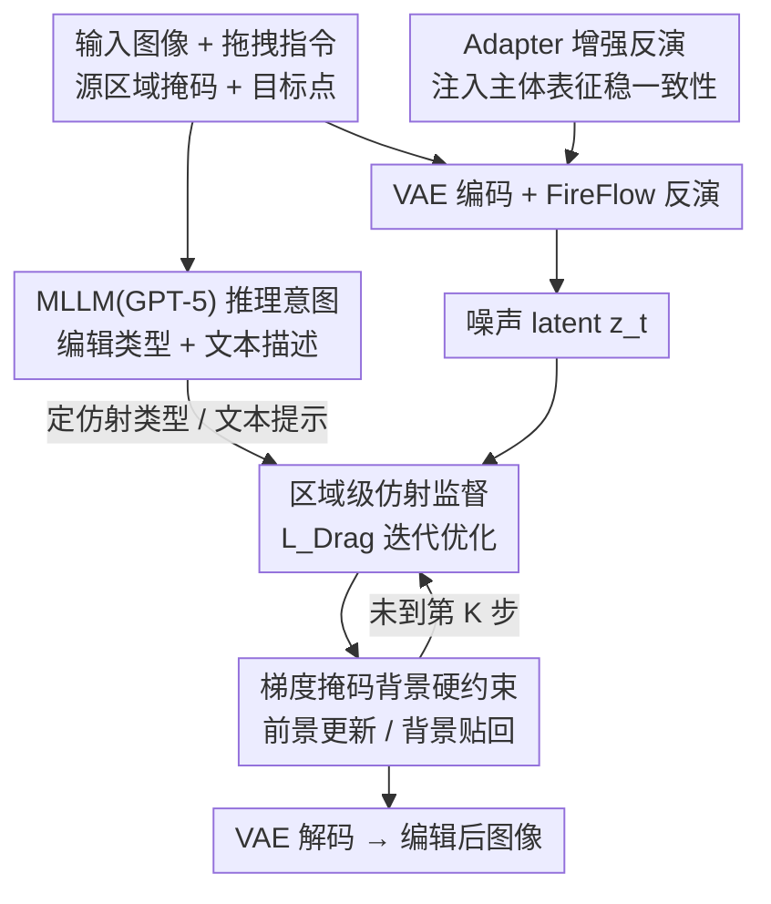

# DragFlow: Unleashing DiT Priors with Region Based Supervision for Drag Editing

**会议**: ICLR 2026  
**arXiv**: [2510.02253](https://arxiv.org/abs/2510.02253)  
**代码**: [GitHub](https://github.com/Edennnnnnnnnn/DragFlow)  
**领域**: 扩散模型 / 图像编辑  
**关键词**: Drag Editing, DiT, Region-Based Supervision, FLUX, Affine Transformation  

## 一句话总结
首个将 FLUX (DiT) 的强生成先验引入拖拽编辑的框架，通过区域级仿射监督替代传统点级监督，配合梯度掩码硬约束和 adapter 增强反演，大幅提升拖拽编辑质量。

## 研究背景与动机
**领域现状**：拖拽编辑（Drag Editing）允许用户通过交互式拖拽指令指定空间局部运动，实现更细粒度的可控编辑。但现有方法多基于 Stable Diffusion（UNet-based DDPM），编辑结果常出现不自然的变形和失真。

**现有痛点**：SD 的生成先验不够强，难以将优化后的 latent 拉回自然图像流形。虽然 DiT + Flow Matching 模型（如 SD3.5、FLUX）拥有显著更强的先验，但拖拽编辑尚未从中受益。

**核心矛盾**：直接将点级拖拽框架迁移到 DiT 效果很差——UNet 瓶颈层产生空间紧凑、高度压缩的特征（宽感受野），而 DiT 特征更细粒度、空间精确（窄感受野），单点监督提供的语义证据不足。此外 FLUX 是 CFG-蒸馏模型，反演漂移更严重，传统 KV 注入不足以保持主体一致性。

**本文目标** 如何有效利用 DiT 的强先验进行高质量拖拽编辑？

**切入角度**：从点级监督转向区域级监督，利用仿射变换提供更丰富一致的特征监督；同时重新设计背景保持和反演增强策略。

**核心 idea**：用区域级仿射变换监督替代点级运动监督来释放 DiT 在拖拽编辑中的潜力。

## 方法详解

### 整体框架
输入图像先经 VAE 编码、再用 FireFlow 反演到噪声 latent $\bm{z}_t$，随后在去噪过程中插入若干次迭代优化，由区域级仿射监督把源区域的特征逐步搬到目标位置。三条辅助机制各管一摊：背景由梯度掩码硬约束钉住、主体一致性由 KV 注入加 Adapter 增强反演守住、用户意图（重定位 / 变形 / 旋转及文字描述）则交给 MLLM（GPT-5）推理，省去手动标注编辑类型。

图中三个贡献节点 D / F / G 分别对应下面三个关键设计，MLLM 与 VAE+FireFlow 是通用脚手架。

### 关键设计

**1. 区域级仿射监督：用更丰富的语义证据替代短视的单点梯度**

直接把点级拖拽搬到 DiT 之所以失效，在于 DiT 特征感受野窄、空间精确，单点提供的语义证据太薄，优化容易短视。DragFlow 让用户给出源区域掩码 $\{\bm{M}_i\}$ 与目标点 $\bm{t}_i$，再用仿射变换把源掩码沿线性调度 $k/K$ 平滑地推向目标——重定位与变形由目标点到质心的向量决定参数，旋转则由角度和锚点决定。优化的目标是让当前区域的 DiT 特征对齐初始区域特征：
$$\mathcal{L}_{\text{Drag}} = \sum_{i=1}^{N} \gamma_i \cdot \| \bm{M}_i^{(k)} \odot F(\bm{z}_t^{(k)}) - \text{sg}[\bm{M}_i^{(0)} \odot F(\bm{z}_t^{(0)})] \|_1$$
其中 $F(\cdot)$ 提取 DiT 特征、$\bm{M}_i^{(k)}$ 是第 $k$ 步仿射后的掩码、$\text{sg}[\cdot]$ 表示梯度截断。由于比对的是整块区域而非单点，监督信号天然带上下文，也彻底绕开了点追踪（point tracking）这一步——既不需要逐步定位被拖动的点，也就不会累积追踪误差。

**2. 梯度掩码背景硬约束：把背景从"软损失博弈"换成"直接锁定"**

传统做法靠一个辅助一致性损失 $\mathcal{L}_{\text{BG}}$ 拉住背景，但它与编辑目标互相竞争，而且 FLUX 这类 CFG-蒸馏模型反演漂移大、参考本身就不可靠。DragFlow 改成硬约束：每步只在前景区域 $\bm{B}$ 内施加梯度更新，区域外直接贴回原始 latent
$$\bm{z}_t^{(k+1)} = \bm{B} \odot \Big(\bm{z}_t^{(k)} - \alpha \cdot \frac{\partial \mathcal{L}_{\text{Drag}}}{\partial \bm{z}_t^{(k)}}\Big) + (1 - \bm{B}) \odot \bm{z}_t^{\text{orig}}$$
这需要额外跑一条纯重建分支提供 $\bm{z}_t^{\text{orig}}$，开销适中但收益明显——消融中它把背景保真度 IF_bg 从 0.757 抬到 0.925。

**3. Adapter 增强反演：借现成个性化 adapter 把主体表征注回先验，免微调稳住一致性**

CFG-蒸馏带来的反演漂移会让主体在编辑后跑偏。DragFlow 不另做训练，而是直接复用预训练的开放域个性化 adapter（如 IP-Adapter、InstantCharacter）当主体表示提取器，把主体表征注入模型先验。这样既不增加微调成本，又显著改善反演质量与主体一致性——FLUX 的反演 LPIPS 从 0.283 降到 0.173，接近 SD 上 DPM-Solver 反演的 0.167。

### 损失函数 / 训练策略
全程只用 $\mathcal{L}_{\text{Drag}}$，背景一致性损失被硬约束替代而省去。反演采用 FireFlow 算法、25 步扩散，跳过前 6 步、从第 19 步起进入编辑，并在第 7 步去噪时做 70 次优化迭代（前 50 次学习率 1000、后 20 次 1200）。每个区域的自适应权重 $\gamma_i$ 按其操作区域的相对大小确定，让大小区域的监督强度更均衡。

## 实验关键数据

### 主实验

| 方法 | 类别 | IF_bg↑ | IF_s2t↑ | IF_s2s↓ | MD1↓ | MD2↓ |
|------|------|--------|---------|---------|------|------|
| RegionDrag | NFT | 1.000 | 0.957 | 0.957 | 33.69 | 6.38 |
| GoodDrag | OPT | 0.935 | 0.956 | 0.942 | 20.38 | 4.50 |
| InstantDrag | FT | 0.930 | 0.949 | 0.946 | 24.38 | 4.54 |
| **DragFlow (Ours)** | OPT | **0.992** | **0.958** | **0.934** | **19.46** | **4.48** |

*ReD Bench 上结果。DragFlow 在所有 Mean Distance 指标上最优，IF_bg 仅次于 RegionDrag（因其直接复制粘贴不改变背景）。*

在 DragBench-DR 上也观察到类似趋势：DragFlow MD1=31.59（次优 35.96），IF_bg=0.969（次优 0.962）。两个基准上的一致领先说明方法鲁棒性强。

### Adapter 反演质量对比（3000 张图像）

| 方法 | LPIPS↓ | SSIM↑ | PSNR↑ |
|------|--------|-------|-------|
| DPM-Solver Inv. (SD) | 0.167 | 0.799 | 26.31 |
| FireFlow Inv. w/o adapter (FLUX) | 0.283 | 0.703 | 20.43 |
| FireFlow Inv. w/ adapter (FLUX) | 0.173 | 0.784 | 25.87 |

### 消融实验

| 配置 | IF_bg↑ | IF_s2t↑ | IF_s2s↓ | MD1↓ | MD2↓ |
|------|--------|---------|---------|------|------|
| Baseline (Point-based FLUX) | 0.765 | 0.932 | 0.962 | 51.21 | 9.38 |
| + Region-Level Affine | 0.757 | 0.946 | 0.936 | 31.26 | 5.88 |
| + Background Preservation | 0.925 | 0.948 | 0.943 | 29.67 | 5.39 |
| + Adapter-Enhanced Inversion | 0.991 | 0.959 | 0.938 | 20.15 | 4.48 |

### 关键发现
- 从点级到区域级监督：MD1 降低 19.95，IF_s2t 提升 0.027，验证了区域策略是 DiT 更合适的编辑范式
- 梯度掩码设计使 IF_bg 从 0.757 飙升至 0.925
- Adapter 增强反演将 IF_s2t 从 0.948 提升至 0.959，确认前景一致性增强
- 三个模块各自有效且协同互补

## 亮点与洞察
- **首个系统分析为何点级拖拽在 DiT 上失效**：通过特征图可视化清晰展示 UNet vs DiT 特征粒度差异
- **区域级范式优雅地解决了点追踪问题**：无需追踪、不累积误差
- **硬约束替代软损失**：避免了背景保持与编辑目标的权衡问题
- **引入 MLLM 推理编辑意图**：自动判断拖拽类型（重定位/变形/旋转），减少用户负担
- **提出 ReD Bench**：首个带有区域级标注和任务标签的拖拽基准

## 局限与展望
- FLUX 为 CFG-蒸馏模型，反演漂移仍较大，对高度复杂结构的图像仍存在细节丢失
- 依赖外部 MLLM（GPT-5）推理用户意图，增加了部署成本
- 需要额外的重建分支计算 $\bm{z}_t^{\text{orig}}$，推理开销增加
- 未探索非仿射变形（如非刚体自由形变）的拖拽场景

## 相关工作与启发
- **RegionDrag**：同为区域级输入，但需用户手动预定义目标区域掩码且使用手工映射函数，DragFlow 只需目标点。RegionDrag 通过 point-wise copy-paste 操作搬运 noisy latent patch，容易破坏区域内部结构；DragFlow 将区域作为整体提取特征用于监督
- **GoodDrag**：点级优化方法中最优 baseline（ReD Bench MD1=20.38），但仍受限于 SD 先验
- **DragDiffusion**：开创性点级拖拽工作，使用 LoRA 微调 SD，在 DiT 上直接迁移效果差
- **InstantDrag**：微调式方法，受限于视频数据与拖拽指令的 mismatch，且参数量高达 914M
- **CLIPDrag**：在点级方法中引入 CLIP 语义引导，但常将重定位误解读为变形产生伪影
- **FastDrag**：无优化无微调方法，直接映射 latent patch，速度快但依赖手工先验导致编辑不自然
- 启发：当基础模型特征几何发生根本变化时（UNet→DiT），编辑范式也需相应重新设计。未来 DiT 生态越完善，DragFlow 框架的价值越大

## 评分
- 新颖性: ⭐⭐⭐⭐ — 从特征粒度角度分析点级监督失效非常到位，区域级范式设计优雅
- 实验充分度: ⭐⭐⭐⭐⭐ — 双基准测试 + 完整消融 + 新 benchmark
- 写作质量: ⭐⭐⭐⭐ — 动机阐述清晰，图示丰富
- 价值: ⭐⭐⭐⭐ — 为 DiT 时代的拖拽编辑指明方向

<!-- RELATED:START -->

## 相关论文

- [\[ICLR 2026\] UniEdit-Flow: Unleashing Inversion and Editing in the Era of Flow Models](uniedit-flow_unleashing_inversion_and_editing_in_the_era_of_flow_models.md)
- [\[ICLR 2026\] LazyDrag: Enabling Stable Drag-Based Editing on Multi-Modal Diffusion Transformers via Explicit Correspondence](lazydrag_enabling_stable_drag-based_editing_on_multi-modal_diffusion_transformer.md)
- [\[ICLR 2026\] Follow-Your-Shape: Shape-Aware Image Editing via Trajectory-Guided Region Control](follow-your-shape_shape-aware_image_editing_via_trajectory-guided_region_control.md)
- [\[CVPR 2026\] SpotEdit: Selective Region Editing in Diffusion Transformers](../../CVPR2026/image_generation/spotedit_selective_region_editing_in_diffusion_transformers.md)
- [\[CVPR 2025\] FaithDiff: Unleashing Diffusion Priors for Faithful Image Super-Resolution](../../CVPR2025/image_generation/faithdiff_unleashing_diffusion_priors_for_faithful_image_super-resolution.md)

<!-- RELATED:END -->
