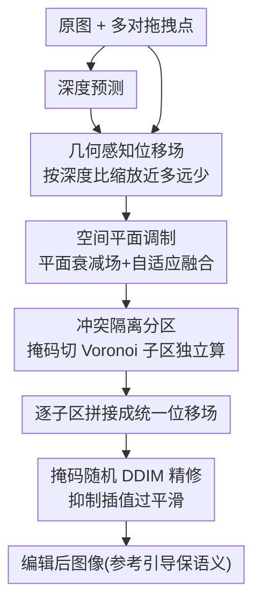

# Dragging with Geometry: From Pixels to Geometry-Guided Image Editing

**会议**: ICLR2026  
**OpenReview**: [https://openreview.net/forum?id=MBiMt3wp8M](https://openreview.net/forum?id=MBiMt3wp8M)  
**代码**: https://github.com/xinyu-pu/GeoDrag  
**领域**: 扩散模型 / 图像编辑  
**关键词**: 拖拽编辑, 几何感知, 位移场, 多点编辑, 一步编辑

## 一句话总结
GeoDrag 把"近的像素动得多、远的像素动得少"这条 3D 透视规律塞进拖拽式图像编辑：用一个同时编码 3D 几何（深度）和 2D 平面先验的统一位移场，在潜空间一步前向就完成结构一致的拖拽，并用 Voronoi 分区解决多点拖拽互相抵消的问题，在 DragBench 上把拖拽精度（DAI）相对次优方法提升 1.4 倍、平均距离（MD）提升 1.1 倍，且无需 LoRA 预热。

## 研究背景与动机
**领域现状**：点拖拽编辑（point-based editing）让用户在图上拉一对"手柄点 → 目标点"，把图像内容精准搬到指定位置，比文本编辑更细粒度、更可控。从 DragGAN 开始，DragDiffusion、FreeDrag 等沿用"运动监督 + 点跟踪"的迭代优化范式；为了提速，FastDrag、RegionDrag 改成"一步编辑"——直接在用户指定区域上构造一个稠密位移场 $f$，把潜变量 $z_T$ 按位移 warp 过去，再过一遍扩散模型出图，省掉逐步梯度优化。

**现有痛点**：这些高效方法清一色只在 **2D 像素平面**上推理，完全无视场景背后的 3D 几何。一旦碰到旋转、透视变换这类"几何密集型"编辑，纯 2D 的位移场就会撕裂结构——比如转头时人脸会被拉变形，因为平面方法只按"像素距离"衰减位移强度，不知道一张脸不同部位的深度其实不同。

**核心矛盾**：要想编辑真实、语义一致，就得引入 3D 几何线索；但 3D 信息（如深度图）和逐像素操作并不天然对齐，硬塞进来又会带来三个新麻烦——(1) 几何怎么落到像素级编辑上；(2) 只靠几何会在物体边界处产生不连续位移、破坏扩散过程；(3) 多个拖拽点的位移场叠加时，方向相反会互相抵消，编辑直接失败。

**本文目标**：构造一个既"几何感知"又"平面感知"的统一位移场，在一步前向内同时做到结构保持、局部精细、多点无冲突。

**切入角度**：作者抓住一条透视投影的基本事实——同一个 3D 位移投到 2D 平面上，深度越小（离相机越近）的点像素位移越大，深度越大的点位移越小（位移与深度成反比）。把这条规律变成位移场的调制因子，就能在"拖拽"时维持 3D 结构。

**核心 idea**：用一个同时编码深度比例和平面距离衰减的统一位移场替代纯 2D 位移场，并用 Voronoi 式硬分区隔离多点拖拽，实现一步、高保真、结构一致的几何感知拖拽编辑。

## 方法详解

### 整体框架
GeoDrag 建立在潜空间一致性模型（LCM）之上，在某个扩散时间步 $T$ 的带噪潜空间里**直接预测一个稠密位移场**，绕开迭代优化。给定图像和 $k$ 对拖拽点 $\{(h_i, t_i)\}_{i=1}^k$（$h_i$ 为手柄、$t_i$ 为目标），整条流水线是：先按手柄点把编辑掩码切成互不重叠的子区，每个子区独立算出"几何感知 + 平面感知"融合后的位移场，再把各子区的场无冲突地拼成最终的 $f$，用它对潜变量做一步重定位（latent relocation）和插值，最后用一次掩码随机 DDIM 更新抑制插值带来的过平滑，并通过参考引导（reference guidance）保住原图语义。整个编辑一次前向完成，无需任何 LoRA 微调预热。

### 关键设计

**1. 几何感知位移场：用深度比把 3D 透视搬进 2D 拖拽**

这一项针对"几何怎么落到像素级编辑"这个痛点。作者从透视投影推起：一个 3D 点 $(x,y,z)$ 经相机内参 $K$ 投影到像素 $(u,v)$，对它施加一个小的 3D 位移 $(\delta x,\delta y,\delta z)$，因为拖拽定义在图像平面、可忽略沿光轴的 $z$ 方向运动，投影后的 2D 位移可简化为 $\delta u = f_x(\delta x/z)$、$\delta v = f_y(\delta y/z)$。再考虑另一个深度为 $z'$ 的点受同样 3D 位移，它的 2D 位移满足 $\delta u' = (z/z')\,\delta u$——即位移与深度成反比，深度越小（越近）的像素动得越多。基于这条关系，几何感知位移场被构造成

$$f_d = (\zeta_h/\zeta)^{\alpha} \cdot d = (\zeta_h/\zeta)^{\alpha} \cdot (t - h),$$

其中 $\zeta$ 是掩码内的深度图、$\zeta_h$ 是手柄点 $h$ 的深度，$d=t-h$ 是拖拽方向，$\alpha$ 是控制位移对深度变化敏感度的调制因子。这样近处像素受更强的投影运动、远处更微弱，从而在 2D"拖拽"过程中维持 3D 结构一致，避免空间撕裂和不自然形变——这正是纯平面方法做不到的（注意相机内参 $K$ 在本任务中是未知的，方法只用到深度比而不依赖标定，⚠️ 公式 3-7 细节以原文为准）。

**2. 空间平面调制：补上几何场在边界/细节处的失灵**

只靠几何场会在物体边界附近产生不连续位移、破坏扩散、出现语义伪影，且它在 3D 空间里"均匀"分配影响，对 2D 平面上的细微局部形变不够敏感。作者借鉴弹性力传播——形变在受力点最强、随距离衰减——定义一个从手柄点向外衰减的平面感知场

$$f_p = \big(\mathbf{1} - (P/L)^{\beta}\big) \cdot d,$$

$P$ 是每个像素到手柄点的欧氏距离，$L$ 是沿"手柄→该像素"射线方向上的最大传播距离（由射线与包住掩码的外接圆求交得到，从而让影响在掩码边界处平滑消失），$\beta$ 控制衰减陡峭程度。比起 FastDrag 用相似三角形那套平面几何构造，这里是更简单、向量化、更易集成的写法。然后把几何场 $f_d$ 和平面场 $f_p$ 按**空间自适应权重**融合：

$$f = (1-\lambda)\cdot f_p + \lambda\cdot f_d, \qquad \lambda = P/(P+\gamma).$$

$\gamma$ 越小越偏向全局几何一致、越大越偏向局部响应；而且 $\gamma$ 取为外接圆直径的标量倍，使融合尺度随物体大小、编辑区域自适应。这样既保住几何结构、又能做出锐利的局部编辑。

**3. 冲突隔离分区：让多点拖拽不再互相抵消**

多对拖拽点的位移场直接相加时，相邻手柄若方向相反会发生破坏性干涉——运动被削弱、位移图案含糊、编辑失败；连基于距离的加权也无法真正解耦相邻竞争的手柄。作者的做法是把编辑掩码 $M$ 按"最近手柄"划成互不重叠的子区，类似 Voronoi 图：

$$S_i = \big\{\, q \in M \;\big|\; i = \arg\min\nolimits_{j} \lVert q - h_j \rVert_2 \,\big\}.$$

每个像素 $q$ 只归属一个手柄 $h_i$，在该子区内独立用上面的"几何 + 平面"融合公式算出 $f_i$，最终位移场按归属拼接：$f(q)=f_i(q),\ \forall q\in S_i$。这是一种**硬分区**，但消融显示它比各种软分区（直接相加 / 像素距离加权 / 拖拽幅度加权）都好——因为每个像素只受一个手柄影响，从根上杜绝了方向冲突，多点编辑也能精准、局部地完成。

**4. 掩码随机 DDIM 精修：去掉一步插值带来的过平滑**

一步位移 + 插值容易把插值区域糊掉、背景发虚。作者在采样步里只往插值区域注入随机性、其余保持确定性：给定标记插值区域的二值掩码 $M$，

$$z^{*}_{t-1} = \sqrt{\bar\alpha_{t-1}}\,\hat z^{*}_{0} + \sqrt{1-\bar\alpha_{t-1}-\sigma_t^2}\;\odot M\,\epsilon_\theta(z^{*}_t, t) + \sigma_t\,(\epsilon \odot M).$$

这个"插值后精修"在不增加额外采样开销的前提下保住全局连贯、有效缓解模糊（噪声尺度 $\sigma_t$ 即超参 $\eta$：$\eta=0$ 是全确定性更新、易过平滑，增大 $\eta$ 给插值区加随机性、改善细节）。

### 损失函数 / 训练策略
GeoDrag 不训练新网络，复用预训练的 LCM/扩散模型做一步推理；位移场是按上述公式**解析构造**的，没有可学习的拖拽参数，编辑过程零预热（不需要 DragDiffusion 那类逐图 LoRA 微调）。量化评测时调制因子 $\alpha,\beta,\gamma$ 默认都设为 1.0。

## 实验关键数据

### 主实验
DragBench 基准，MD（平均距离）和 DAI（拖拽精度指数，$\text{DAI}_r$ 评估半径 $r$ 的局部块）越低越好，IF（图像保真度）越高越好；Time 为每点平均编辑时间，Mem 为峰值显存（GB）。

| 方法 | MD ↓ | DAI₁ ↓ | DAI₂₀ ↓ | IF ↑ | 预热 | Time(s) | Mem |
|------|------|--------|---------|------|------|---------|-----|
| DragDiffusion | 34.57 | 0.181 | 0.160 | 0.871 | ~1min LoRA | 22.46 | 18.63 |
| FreeDrag | 30.80 | 0.183 | 0.151 | 0.845 | ~1min LoRA | 42.90 | 18.90 |
| DragNoise | 33.84 | 0.179 | 0.158 | 0.861 | ~1min LoRA | 21.12 | 18.36 |
| FastDrag | 32.10 | 0.131 | 0.115 | 0.850 | ✗ | 3.23 | 5.85 |
| **GeoDrag (本文)** | **29.24** | **0.128** | **0.111** | 0.847 | ✗ | 3.95 | **5.44** |

GeoDrag 拿到最低的 MD 和 DAI，且无需任何 LoRA 预热，显存仅 5.44 GB、每点 3.95 秒，整体在"精度-速度-显存"上达到了有利权衡。论文宣称相对次优方法把 DAI 提升 1.4 倍、MD 提升 1.1 倍。60 人用户研究中 GeoDrag 的平均排名也优于 FreeDrag、FastDrag。

### 消融实验

| 配置 | 现象 | 说明 |
|------|------|------|
| 完整模型 | 全指标最优 | 几何场 + 平面场 + 冲突分区 |
| w/o Depth | 编辑不准（如汽车转不过来） | 去掉几何感知场 → 失去 3D 结构一致性 |
| w/o Plane | 编辑不充分 | 去掉平面感知场 → 局部细节/边界失灵 |
| 冲突分区 → 直接相加 | 反向拖拽相互抵消 | 多点编辑失败 |
| 冲突分区 → 像素距离/拖拽幅度加权 | 影响区分不开、结果重影 | 软分区不如硬分区 |

### 关键发现
- 几何场和平面场是**互补**的：去掉任一个，DAI/MD/IF 全线下降——几何场管全局 3D 结构、平面场管局部锐利。
- 多点冲突的根因是位移场叠加抵消，**硬分区**（每像素只归一个手柄）比所有软加权策略都好。
- 超参 $\gamma$ 取 0.5~1.5 在几何一致与局部可编辑之间最平衡；$\alpha$ 越大深度敏感度越高、位移变化越锐，$\beta$ 越大局部形变越锐、MD 越低。

## 亮点与洞察
- **把透视投影的"位移∝1/深度"直接写进位移场**：不做相机标定、不需已知内参，只用深度比 $(\zeta_h/\zeta)^\alpha$ 就把 3D 结构感注入 2D 拖拽，这是全篇最"啊哈"的地方——一条初中物理级的几何事实换来旋转/透视场景的结构一致性。
- **Voronoi 硬分区解多点冲突**：用"最近手柄归属"把全局耦合问题切成一堆互不干扰的局部问题，简单且可证明无冲突，比各种软加权都干净，可迁移到任何"多控制源叠加会打架"的场景（如多笔刷、多 anchor 编辑）。
- **几何 + 平面的自适应融合权重** $\lambda=P/(P+\gamma)$ 随像素到手柄距离变化、$\gamma$ 又随物体尺寸自适应，是一个很省心的"近处听平面、远处听几何"的连续调度，思路可借给其他需要全局/局部双先验融合的任务。

## 局限与展望
- **依赖单目深度估计的质量**：整个几何场建立在预测深度图上，深度估计在透明/反光/无纹理区域出错时，几何调制会跟着错，论文未充分讨论深度噪声的鲁棒性。
- **速度提升有限**：作者自己承认 runtime gain is modest——3.95s 比 FastDrag 的 3.23s 还略慢，主要赢在精度和免预热，对"实时"仍有距离。
- **硬分区的边界假象**：Voronoi 硬切在子区交界处是非连续的，复杂遮挡或手柄极密时可能在分区边界留下接缝（论文用插值/精修缓解，但未做边界专项分析）。
- 忽略光轴方向运动（$\delta z$）的简化对纯平面拖拽合理，但若想支持"推远拉近"这类含深度方向的编辑，需要扩展投影模型。

## 相关工作与启发
- **vs FastDrag / RegionDrag**：同为一步位移场编辑，但它们纯 2D、按像素距离衰减，几何密集编辑会撕裂结构；GeoDrag 加了深度比调制 + 硬分区，精度更高且天然支持多点。
- **vs DragDiffusion / FreeDrag / DragNoise**：这些走迭代运动监督 + 逐图 LoRA 微调，慢且需预热；GeoDrag 解析构造位移场、零训练零预热，速度和显存都更友好。
- **vs FlowDrag**：FlowDrag 用网格重建 + 迭代形变引入 3D，但计算重、响应慢；GeoDrag 只借深度比这一轻量几何线索，在保持几何一致的同时仍适合交互式实时编辑。

## 评分
- 新颖性: ⭐⭐⭐⭐ 把透视"位移∝1/深度"解析地注入拖拽位移场 + Voronoi 硬分区解多点冲突，角度清晰且少见。
- 实验充分度: ⭐⭐⭐⭐ DragBench 全指标 SOTA + 用户研究 + 完整消融（场/分区/超参），但深度噪声鲁棒性缺专项分析。
- 写作质量: ⭐⭐⭐⭐ 三大挑战 → 三大设计一一对应，公式推导完整、动机交代清楚。
- 价值: ⭐⭐⭐⭐ 免训练免预热、显存友好、精度领先，对几何密集型交互编辑有实用价值。

<!-- RELATED:START -->

## 相关论文

- [\[ICLR 2026\] The Spacetime of Diffusion Models: An Information Geometry Perspective](the_spacetime_of_diffusion_models_an_information_geometry_perspective.md)
- [\[ICML 2026\] Geometry-Aware Tabular Diffusion](../../ICML2026/image_generation/geometry-aware_tabular_diffusion.md)
- [\[CVPR 2026\] GeoRK2: Geometry-Guided Runge-Kutta Integration for Diffusion Transformer Acceleration](../../CVPR2026/image_generation/geork2_geometry-guided_runge-kutta_integration_for_diffusion_transformer_acceler.md)
- [\[ICLR 2026\] Learning a Distance Measure from the Information-Estimation Geometry of Data](learning_a_distance_measure_from_the_information-estimation_geometry_of_data.md)
- [\[CVPR 2026\] SPREAD: Spatial-Physical REasoning via geometry Aware Diffusion](../../CVPR2026/image_generation/spread_spatial-physical_reasoning_via_geometry_aware_diffusion.md)

<!-- RELATED:END -->
