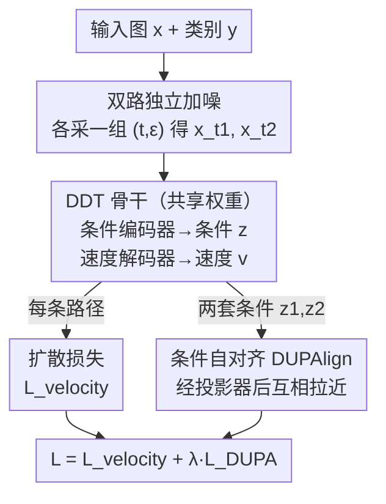

# Dual-Path Condition Alignment for Diffusion Transformers

**会议**: ICLR 2026  
**OpenReview**: [https://openreview.net/forum?id=ALpn1nQj5R](https://openreview.net/forum?id=ALpn1nQj5R)  
**代码**: https://github.com/PCH-gg/DUPA  
**领域**: 扩散模型 / 图像生成  
**关键词**: 扩散 Transformer, 表征对齐, 无监督, 自对齐, 解耦架构

## 一句话总结
DUPA 把 REPA 里"用外部视觉编码器给噪声图打标签"的表征对齐，改成"把同一张图独立加噪两次、让模型自己提取的两套条件特征互相对齐"的无监督自对齐，无需任何外部图像/参数/算力，在 ImageNet 256×256 上仅训练 400 epoch 就拿到 FID=1.46，超过所有不依赖外部监督的方法。

## 研究背景与动机
**领域现状**：基于去噪的生成模型（DiT、SiT 这类堆叠 Transformer block 的扩散模型）近年进展迅猛，而 REPA 几乎成了标配——它把 Transformer 中间层的特征对齐到 CLIP/DINOv2 等高性能预训练视觉编码器抽出的表征上，显著提升了 class-to-image 生成质量，此后大多数同类工作都建立在 REPA 之上。

**现有痛点**：REPA 对外部视觉编码器的依赖带来两个具体麻烦。其一是**分布失配（out of distribution）**：当生成模型要建模的数据分布和大编码器的预训练分布差别很大时，编码器抽出的特征不但帮不上忙，甚至会"误导"训练，导致性能下降。其二是**额外算力**：训练/微调一个大编码器代价高昂——光预训练 DINOv2 就需要 11 亿参数、1500 epoch、1.42 亿张图，远超训练 DiT/SiT 本身的开销；若目标域分布不同还得再微调编码器，成本进一步上升。

**核心矛盾**：作者顺着 REPA 自己的观察（"只在前几层做正则约束效果更好，因为这样剩余层能专注高频细节"）和 DDT 的观察（"当前扩散 Transformer 受限于低频语义编码能力"）提出一个判断：REPA 的真正贡献，是给前几层 Transformer 在从噪声图里抽语义时，提供了一份**准确且不变**的来自纯净图像的"参考表征"。这本质上是一种监督学习——视觉编码器像个"数据标注员"，用 ground truth（纯图）给 noisy 图发"标签"。既然是监督学习，它就同时背上了"标注昂贵"和"标注不准"两个原罪。

**本文目标**：在不假设数据分布一致、不引入昂贵外部算力的前提下，提供和 REPA 同等有效的表征引导。

**切入角度**：作者注意到一个关键事实——对同一张纯图加不同噪声得到的多个 noisy latent，视觉编码器给它们的"参考表征"是**一致的**；训练中这些条件特征都向编码器表征收敛，很像无监督学习里的**聚类**。那么完全可以绕开编码器：在一个训练步里采样多份条件特征，让它们互相向"簇心"靠拢，这个簇心隐式地就扮演了 REPA 中外部编码器表征的角色。

**核心 idea**：把一张图独立加噪 K 次、用解耦扩散 Transformer 抽出 K 套低频语义条件，让这些条件互相对齐（自对齐），以无监督方式替代 REPA 的外部监督对齐。

## 方法详解

### 整体框架
DUPA 建立在 **DDT（Decoupled Diffusion Transformer）** 的"条件编码器 + 速度解码器"解耦骨干上。一句话概括整条流程：把同一张输入图 $x$（及类别 $y$）**独立加噪两次**得到两个 noisy latent，分别送入**共享权重**的 DDT 各跑一条去噪路径，每条路径的条件编码器都吐出一套低频语义条件 $z_{t_k}$、速度解码器吐出速度 $v_{t_k}$；训练目标一边照常对两条路径做扩散损失，一边用 **DUPAlign** 把两套条件互相对齐——后者就是替换掉 REPA 外部对齐的核心。

下面这张图把"双路独立加噪 → 共享 DDT 双路前向 → 条件自对齐"三步串起来：

### 关键设计

**1. 解耦骨干与"条件"作为对齐对象：把对齐落到低频语义上**

DUPA 没有去对齐 Transformer 的任意中间特征，而是借用 DDT 的解耦结构，专门对齐**条件编码器输出的条件特征**。DDT 把一个传统扩散 Transformer 拆成两半：条件编码器 $z_t=\text{Encoder}(x_t,t,y)$ 负责抽低频语义条件，速度解码器 $v_t=\text{Decoder}(x_t,t,z_t)$ 负责在该条件下解码高频速度场。这一拆解恰好对上了 REPA 的洞察——表征对齐应该作用在"负责语义的前几层"，而非整个网络。作者实验证实条件对齐放在第 8 层效果最好（和 REPA"只约束前几层"的结论一致），让后续层去专注高频细节。把"条件"选作对齐对象，等于把无监督对齐精准地锚在了低频语义这个真正吃 REPA 红利的地方，而不是漫无目的地对齐一切。

**2. 双路独立加噪：在一个训练步里造出可对齐的两套视角**

对一张纯图 $x$，DUPA 独立采样 $K$ 组噪声 $\epsilon_k$ 和时间戳 $t_k$，生成不同的 noisy latent $x_{t_k}=\alpha_{t_k}x+\sigma_{t_k}\epsilon_k$。综合性能与算力开销，作者取 $K=2$。这么做有两层用意：一是**训练效率**——一个训练步内就同时训练了同一张图的多个加噪状态，梯度引导更精细，比只加一次噪更高效；二是**制造可对齐的条件**——同一张纯图的不同加噪版本，经 DDT 会得到不同的速度条件，但它们的"终点"（纯图语义）是同一个，因此这两套条件天然应当相似，正好充当互相对齐的两个视角。消融显示，同时重采样 $t$ 和 $\epsilon$（而非只重采一个）能提供更多样的 noisy 图，让隐式簇心更可靠，效果最好。

**3. 条件自对齐 DUPAlign：用"互相靠拢"替代"向外部编码器靠拢"**

这是 DUPA 的灵魂。REPA 的对齐损失是把 DDT 条件 $z_t$ 向外部编码器输出 $y_*$ 拉近：

$$L_{\text{REPA}}(\theta,\phi)=-\mathbb{E}\Big[\frac{1}{N}\sum_{n=1}^{N}\text{sim}\big(y_*^{[n]},z_\phi(z_t^{[n]})\big)\Big]$$

DUPA 直接把 $y_*$ 拿掉，改为让两条路径自己的条件互相对齐：

$$L_{\text{DUPA}}(\theta,\phi):=-\mathbb{E}\Big[\frac{2}{K(K-1)}\sum_{1\le i<j\le K}\frac{1}{N}\sum_{n=1}^{N}\text{sim}\big(z_\phi(z_{t_i}^{[n]}),z_\phi(z_{t_j}^{[n]})\big)\Big]$$

其中 $z_\phi$ 是可训练投影 MLP，$\text{sim}$ 取余弦相似度。直觉上，两套条件互相拉近等价于一起向二者的"簇心"收敛，而这个簇心在 REPA 里正是外部编码器给出的那份参考表征——只不过现在它由数据自身隐式定义，无需任何外部图像、参数或算力。最终损失把扩散损失（在 $K$ 次采样上取平均）与对齐损失加权求和：$L:=L_{\text{velocity}}+\lambda L_{\text{DUPA}}$，$\lambda=0.5$ 控制去噪与对齐的权衡，且实验显示对 $\lambda$ 相当鲁棒。

### 损失函数 / 训练策略
- **总损失**：$L=L_{\text{velocity}}+\lambda L_{\text{DUPA}}$，$\lambda=0.5$；扩散损失为 $K$ 路速度回归损失之和 $\sum_{k}\|v_\theta(x_{t_k},t_k)-\dot\alpha_{t_k}x_*-\dot\sigma_{t_k}\epsilon_k\|^2$。
- **投影器初始化（关键坑）**：投影器 $z_\phi$ 的权重和偏置**不能都置零**，否则用于对齐的条件恒为 0、模型走捷径学到平凡解。作者对第一层用 Kaiming 初始化保持前向方差，后续层用减益 Xavier 初始化防梯度爆炸/过拟合。
- 数据 ImageNet 256×256，batch size 256；图像经现成 Stable Diffusion VAE 编码为 $z\in\mathbb{R}^{32\times32\times4}$；Adam，学习率 1e-4；条件对齐放在第 8 层；$K=2$、余弦相似度；默认不开 CFG；8×A100 训练。

## 实验关键数据

### 主实验
ImageNet 256×256 系统级对比（DUPA-XL/2，与是否依赖外部监督分类）：

| 方法 | 类别 | Epochs | 外部图/参数 | FID↓ (w/ CFG) | FID↓ (w/o CFG) | sFID↓ |
|------|------|--------|------------|---------------|----------------|-------|
| SiT | 无辅助任务 | 1400 | 0 / 0 | 2.06 | 8.61 | 4.50 |
| DDT | 无辅助任务 | 400 | 0 / 0 | 2.01 | 8.06 | 4.66 |
| ∆FM | 对比学习 | 800 | 0 / 0 | 1.97 | – | 4.53 |
| REPA | 监督表征对齐 | 800 | 142M / 1.1B | **1.42** | 5.90 | 4.70 |
| **DUPA** | 无监督表征对齐 | **400** | **0 / 0** | **1.46** | 5.92 | **4.45** |

DUPA 在 sFID 上超过表中所有方法（开/不开 CFG 皆然），不开 CFG 时 recall 最高、开 CFG 时 precision 最高；FID 上仅训练 400 epoch 就超过所有无外部监督的方法，与训练 800 epoch、带外部编码器的 REPA（1.42）也只差约 3%。

### 消融实验
逐组件消融（DUPA-L/2，400K 迭代）：

| 配置 | FID↓ | sFID↓ | IS↑ | 说明 |
|------|------|-------|-----|------|
| DDT-L/2（基线） | 14.9 | 5.17 | 87.8 | 退化为纯解耦骨干 |
| + 双路采样 | 12.5 | 5.02 | 96.6 | 仅加双路独立加噪 |
| + 条件对齐（完整 DUPA） | **11.1** | **4.91** | **104.8** | 再加 DUPAlign |

不同骨干尺寸上 DUPA 全面优于 SiT / DDT：DUPA-XL/2 把 SiT-XL/2 的 FID 17.2 / DDT-XL/2 的 12.8 压到 **8.71**。

### 关键发现
- **两个组件各司其职**：双路采样负责"更精细的梯度引导→提训练效率"（14.9→12.5），条件对齐负责"让条件编码器从噪声图里抽出更准的语义"（12.5→11.1），后者贡献了主要的语义增益（IS 涨得最多）。
- **重采样策略**：同时重采 $t$ 和 $\epsilon$ 优于只重采其一（FID 12.4/13.2 → 11.1），更多样的 noisy 视角让隐式簇心更稳。
- **对齐层与目标**：第 8 层对齐最优，呼应 REPA"只约束前几层"；相似度函数上余弦相似度优于对比学习常用的 NT-Xent。
- **鲁棒性**：对权衡系数 $\lambda$（0.25→1）不敏感，FID 始终在 11.1 附近。
- **效率**：相比基座，DUPA 训练加速约 **5×**、推理加速约 **10×**；$K$ 从 2 增到 3/4 仍有微小收益（FID 11.1→10.8→10.7）但显存/时间上升，故默认 $K=2$。

## 亮点与洞察
- **把"监督对齐"重新理解成"聚类"**：作者最漂亮的一步是看穿 REPA 的外部编码器其实只是给同图不同噪声版本提供一个一致的"簇心"，于是用同图多视角的自对齐去隐式逼近这个簇心——一旦想通这层，外部编码器就成了可省掉的中介。
- **对齐对象选得准**：不对齐任意中间特征，而是对齐 DDT 解耦出的"条件"，且放在第 8 层，精准命中真正吃 REPA 红利的低频语义层。
- **几乎零成本的即插即用**：无外部图、无外部参数、无外部算力，只多了一次加噪前向和一个投影 MLP，可挂到任意去噪生成模型上，迁移性强。
- **一个易踩的工程坑被点名**：投影器若全零初始化会让对齐目标恒为 0、模型学捷径——这种"自对齐"范式的通病值得记住。

## 局限与展望
- **受算力限制只训到 400 epoch**：作者明说因资源/时间只训了 400 epoch，FID 与 REPA 仍有约 3% 差距，长训能否反超未验证。
- **仍依赖 DDT 解耦架构**：方法以"有显式条件编码器"为前提，对没有解耦结构的标准 DiT 如何定义"条件"并不直接，文中也是把 DDT 的核心解耦单独抽出来复现的。
- **K=2 是折中**：更大的 $K$ 有持续但递减的收益，受显存约束未深入更大视角数的潜力。
- **任务范围**：实验集中在 ImageNet class-to-image，"无分布假设"的卖点在真正分布迥异的目标域（如医学、遥感）上是否兑现 REPA 失配场景下的优势，尚缺直接验证。

## 相关工作与启发
- **vs REPA**：REPA 用外部视觉编码器给 noisy 图提供参考表征（监督式），DUPA 用同图多视角条件互相对齐（无监督式），区别在于把"外部簇心"换成"数据隐式簇心"，省掉外部图/参数/算力并规避分布失配，代价是同等 epoch 下略逊一筹。
- **vs 掩码图建模（MaskDiT / SD-DiT）**：它们靠遮挡 token 逼模型学上下文推理，DUPA 则直接对齐语义条件，能像 REPA 那样为每张图提供准确的表征引导，而掩码类方法难以做到这点。
- **vs 对比学习（∆FM / Dispersive Loss）**：对比类方法主要靠构造负样本拉开不同表征（如不同类别速度的相异性），DUPA 反其道而行，靠拉近同图正样本的条件来逼近簇心，更贴近 REPA 的"准确正向引导"。

## 评分
- 新颖性: ⭐⭐⭐⭐⭐ 把 REPA 的外部对齐重诠释为聚类并改成同图自对齐，视角干净有力。
- 实验充分度: ⭐⭐⭐⭐ 多尺寸、逐组件、效率与超参鲁棒性都覆盖，但局限于 ImageNet、未给跨域失配的直接证据。
- 写作质量: ⭐⭐⭐⭐ 动机推导（监督↔聚类↔自对齐）讲得清晰，公式与算法完整。
- 价值: ⭐⭐⭐⭐⭐ 无外部依赖、即插即用、显著加速，对落地特定域生成很实用。

<!-- RELATED:START -->

## 相关论文

- [\[ICLR 2026\] Scaling Laws for Diffusion Transformers](scaling_laws_for_diffusion_transformers.md)
- [\[ICLR 2026\] Dual-Solver: A Generalized ODE Solver for Diffusion Models with Dual Prediction](dual-solver_a_generalized_ode_solver_for_diffusion_models_with_dual_prediction.md)
- [\[ICLR 2026\] BideDPO: Conditional Image Generation with Simultaneous Text and Condition Alignment](bidedpo_conditional_image_generation_with_simultaneous_text_and_condition_alignm.md)
- [\[ICLR 2026\] Rethinking Global Text Conditioning in Diffusion Transformers](rethinking_global_text_conditioning_in_diffusion_transformers.md)
- [\[CVPR 2025\] Dual Prompting Image Restoration with Diffusion Transformers (DPIR)](../../CVPR2025/image_generation/dual_prompting_image_restoration_with_diffusion_transformers.md)

<!-- RELATED:END -->
