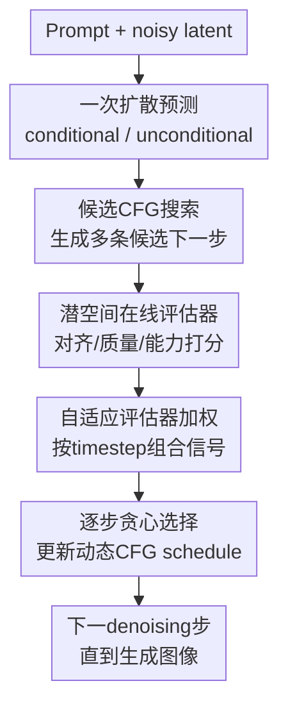

# Dynamic Classifier-Free Diffusion Guidance via Online Feedback

**会议**: ICLR2026  
**OpenReview**: [https://openreview.net/forum?id=z9YC9bvfUL](https://openreview.net/forum?id=z9YC9bvfUL)  
**代码**: 暂未公开  
**领域**: 图像生成 / 扩散模型  
**关键词**: 动态CFG, 在线反馈, 潜空间评估器, 文生图采样, Imagen 3  

## 一句话总结

这篇论文把扩散模型里固定不变的 classifier-free guidance scale 改成逐步在线选择的动态日程：在每个反向扩散步用轻量潜空间评估器给候选 CFG scale 打分，再贪心选择当前最优值，从而在几乎不增加采样成本的情况下同时改善文本对齐、视觉质量、文字渲染和计数能力。

## 研究背景与动机

**领域现状**：文生图扩散模型通常靠 classifier-free guidance（CFG）在推理时控制条件信号强度。做法很简单：模型同时预测有条件噪声和无条件噪声，再用一个 guidance scale $s$ 放大二者差值。这个参数已经成为 Stable Diffusion、Imagen 等模型的默认采样旋钮，因为它不需要重训主模型，也能在文本对齐、视觉保真和多样性之间移动。

**现有痛点**：真实使用中，CFG scale 往往是一个全程固定的数，或者是只依赖 timestep 的手写 schedule。问题在于 prompt 之间的需求并不一样：有些 prompt 需要强对齐，比如画面里要准确出现多个物体、写出指定文字；有些 prompt 更看重审美和自然纹理，过强 guidance 反而会带来伪影、刻板构图和多样性下降。固定值把所有 prompt、所有采样阶段都压进同一个折中点，等于默认“所有图都需要同样强的文本拉力”。

**核心矛盾**：CFG 的最佳强度同时取决于三件事：当前 prompt 想要什么、当前 sample 已经生成到什么阶段、底层扩散模型在这个阶段暴露出什么错误。早期高噪声阶段更适合决定大结构和语义布局，晚期低噪声阶段才更能判断文字是否可读、局部伪影是否严重。只按 timestep 写死 schedule，会忽略 prompt 和 sample 的在线状态；只用后处理或多 seed 筛选，又会明显增加计算量或无法修正单个轨迹。

**本文目标**：作者希望在不训练新的扩散主模型、不增加 denoising NFE、不依赖昂贵像素空间 autorater 的前提下，让每个 prompt、每个 sample 都拥有自己的 CFG schedule。具体来说，方法要能在线评估中间 noisy latent 的质量，要能把文本对齐、视觉质量和特定能力信号组合起来，还要能迁移到从 LDM 到 Imagen 3 这样的不同模型族。

**切入角度**：论文的关键观察是：虽然最终图像还没完全解码，但扩散 latent 在采样中途已经包含足够多关于对齐和质量的信号。只要训练一些直接读 noisy latent 的小评估器，就可以在每一步便宜地预测“如果这个 CFG scale 继续走，当前轨迹更像好图还是坏图”。这比每一步解码到像素再跑大模型便宜得多，也比固定 schedule 更贴近当前样本状态。

**核心 idea**：用潜空间在线评估器替代人工写死的 guidance schedule，在每个反向扩散步对一组候选 CFG scale 做贪心搜索，选择能最大化当前评估分数的 scale。

## 方法详解

### 整体框架

方法发生在扩散模型推理阶段，不改主扩散模型训练。给定 prompt 和当前 noisy latent $x_t$，系统先正常计算一次 conditional / unconditional 噪声预测，然后把多个候选 CFG scale 代入同一组预测，得到多个候选下一状态；轻量潜空间评估器直接在 latent 上为这些候选状态打分，最后选出得分最高的 scale 进入下一步。

这个流程的重点是“在线反馈”：每一步的选择不是提前规定好的，而是由当前 sample 的 latent 状态决定。不同 prompt 会走出不同的 CFG 曲线，同一个 prompt 的早期和晚期也可能选择完全不同的 guidance 强度。

### 关键设计

**1. 潜空间在线评估器：把“生成好不好”前移到 noisy latent 上判断**

传统的图像质量或文本对齐评估通常发生在最终图片上，或者需要把中间 latent 解码成像素再跑 CLIP / VQA / OCR 之类模型。这样做太贵，无法每个采样步都调用。本文改成训练一组直接读 diffusion latent 的小评估器：输入是当前 noisy latent $x_t$、timestep $t$，以及必要时的 prompt $c$，输出某个维度的质量分数 $e_t$。

最基础的对齐评估器来自 CLIP。作者把 CLIP 视觉端的像素 patch embedding 换成适配 diffusion latent 的 embedding，并让视觉编码器感知 timestep，然后用加噪后的 latent-text pair 继续训练，使其能计算 noisy latent 与 prompt 的相似度：$e_{CLIP}=CLIP_{vision}(x_t) \cdot CLIP_{text}(c)^T$。视觉质量评估器则类似判别器，判断 latent 更像真实图还是生成图，分数写作 $e_{Disc}=-\log \frac{p(x_t|t)}{1-p(x_t|t)}$。在 Imagen 3 上，作者还使用人类偏好 reward、文字渲染评估器和数值推理评估器，把整体偏好、OCR 可读性和计数能力也纳入反馈。

这个设计的好处是信号足够细，又足够便宜。论文报告 latent evaluator 只让 LDMlarge 采样 FLOPs 从 115,489 增加到 116,739（约 1%），而如果每一步解码到像素再评估，会涨到 493,239（约 4 倍以上）。也就是说，在线反馈不再是只适合离线筛选的奢侈操作，而能真正嵌进采样循环。

**2. 候选CFG搜索：复用同一次噪声预测来比较多个 guidance scale**

CFG 本身的计算公式是 $\epsilon_\theta(x_t|c)=\epsilon_\theta(x_t|\emptyset)+s(\epsilon_\theta(x_t|c)-\epsilon_\theta(x_t|\emptyset))$。常规采样会给 $s$ 一个固定值，本文则在每个 timestep 准备一个候选集合 $S=\{s_1,s_2,...,s_n\}$，分别构造候选下一状态，再用评估器选出当前最好的 scale：$\hat{s}_t=\arg\max_{s\in S} e_t(x_t^s,c)$。

关键在于，这个搜索不需要增加扩散模型的 NFE。因为 conditional 和 unconditional 的噪声预测只需各算一次，换不同 $s$ 只是对同一组预测做线性组合，真正新增的是若干次轻量 evaluator 前向。LDM 实验里候选 scale 是 $[1,3,7.5,11,15]$，Imagen 3 上扩展为 24 个离散值。它不是训练一个新的策略网络，也不是对最终图像做后验筛选，而是在每一步把“这一步该拉多强”变成一个可观察、可比较的小决策。

这种贪心选择不保证全局最优，但论文用 beam search 做了 sanity check：在 Imagen 3 的 Gecko prompt 上，beam width $k=2$ 把 NFE 翻倍，只把 Gecko 指标从 73.1% 提到 73.7%。因此，逐步贪心在收益和成本之间更划算，也更符合本文想解决的“低开销推理增强”目标。

**3. 自适应评估器加权：让不同质量信号在合适的采样阶段发声**

多个 evaluator 不能简单平均，因为它们在不同 denoising 阶段的可靠性不同。粗粒度语义布局和文本对齐在早期就能显现，文字渲染、细微伪影和审美偏好往往要到后期噪声较低时才有意义。若固定线性权重，早期可能被不可靠的细节信号误导，晚期又可能继续过度追求大语义而破坏局部质量。

本文使用 timestep 相关的自适应权重，把每个 evaluator 的影响和其分数变化绑定起来：$\hat{e}_t=\sum_{e\in E}\alpha_{e,t}e_t$，其中 $\alpha_{e,t}=\frac{e_t-e_{t+1}}{e_{t+1}}$。直觉上，如果某个 evaluator 的分数在相邻 timestep 发生明显变化，说明当前阶段对它关心的属性变得信息丰富，于是应该提高它的话语权。这样，general-purpose evaluator 和 capability-specific evaluator 可以在同一个搜索框架里合作，而不是靠人工调一个固定混合系数。

实验也显示这个加权很关键。LDMlarge 上，对齐和视觉质量 evaluator 用静态线性组合时 Gecko score / FID 是 45.0 / 25.4；换成 adaptive weighting 后变成 47.2 / 24.8，同时超过默认 CFG 的 43.8 / 25.6。也就是说，它不是简单把多个指标塞进一个分数，而是在采样时间轴上动态决定“现在该听谁的”。

**4. 能力特定评估器：把同一套动态CFG扩展到文字渲染和数值推理**

在强模型如 Imagen 3 上，普通判别器很难捕捉细微质量差异，因为图像整体已经很真实。本文因此把框架扩展到更具体的能力：文字渲染 evaluator 由 OCR 分数监督，训练目标是让 latent evaluator 预测文本可读性分数；数值推理 evaluator 则在含有可计数实体的图文数据上继续训练，使它更关注数量是否对齐。

这让动态 CFG 不只是“提高平均图像质量”的采样 trick，而变成一种可插拔控制框架。面对 MARIO-eval 这种要求图中写出指定文字的 prompt，系统可以把文字渲染信号加入搜索；面对 GeckoNum 这种计数 prompt，可以加入数值推理信号。论文观察到，文字渲染通常需要在采样后期保持较高 guidance，而数值推理在早期反而受益于较低 guidance，因为过早强约束会让模型走向模板化物体布局，降低生成正确数量变化的灵活性。

### 一个完整示例

假设 prompt 是“工厂里有一个写着 Safety First 的标牌”。默认 CFG 可能全程使用同一个 scale，比如 7.5：早期它可能足够确定“工厂 + 标牌”的大结构，但后期在生成字母形状时，固定 scale 既不会意识到文字已经变形，也不会专门提高文字可读性信号的权重。

动态 CFG 的轨迹会更像一次逐步反馈控制。早期，alignment evaluator 判断候选 scale 中较高的 $s$ 更能保住“工厂、标牌、文字”这些语义，于是选择较强 guidance；中期，reward 或视觉质量 evaluator 如果发现画面出现伪影，会把选择拉回更温和的 scale；到晚期，文字渲染 evaluator 的分数变化变大，adaptive weighting 提高它的权重，系统更倾向于选择能让 “Safety First” 字形清晰的候选 scale。最终得到的不是一个手写曲线，而是这个 prompt、这个 seed、这条采样轨迹自己的 guidance schedule。

### 损失函数 / 训练策略

主扩散模型不需要重新训练，训练集中在潜空间评估器。alignment evaluator 从预训练 CLIP-ViT-B/16 初始化，视觉端 embedding 改成 diffusion latent 输入，随后在 WebLI 图文对上把图像编码成 latent 并注入与扩散训练类似的噪声，继续用 CLIP 对比学习目标训练。LDM 场景下作者把 ViT-B/16 转成适合 latent 的 ViT-B/4，使 $512\times512$ 图像编码后对应 256 个 latent token；训练约 90k steps，batch size 512，64 张 TPUv5e 约 1.5 天。

其他 evaluator 以 latent alignment evaluator 为初始化继续微调。视觉质量 evaluator 用 MS-COCO 上真实图和生成图训练二分类；reward evaluator 用同 prompt 的生成图 pair 和人类偏好标签，采用 Bradley-Terry 形式：$p(i>j|c)=\frac{p(i|c)}{p(i|c)+p(j|c)}$；文字渲染 evaluator 用 OCR 分数监督，优化 $MSE_{TR}=\frac{1}{n}\sum_i(e^i_{TR}-e^i_{OCR})^2$；数值推理 evaluator 用 Gemini 2.5 Pro 重标注过物体数量描述的 100K 图文对继续做对比学习。

对 reward 和文字渲染这类细粒度 evaluator，作者还使用 timestep 加权损失：在高噪声早期给近零权重，噪声降低后逐步增大到 1。这个训练细节和方法假设一致：细节质量只有在 latent 真的包含细节时才应该强监督。

## 实验关键数据

### 主实验

论文先在 LDMlarge 上用自动指标比较动态 CFG、梯度引导和固定 schedule。Gecko score 衡量文本对齐，FID 衡量视觉保真；越高的 Gecko 越好，越低的 FID 越好。

| 方法 | 评估器 / schedule | Gecko score ↑ | FID ↓ | 主要结论 |
|------|------------------|---------------|-------|----------|
| Default CFG | 固定 CFG | 43.8 | 25.6 | 默认折中点，两个指标都不是最优 |
| Gradient guidance | Alignment | 46.1 | 25.6 | 提升对齐，但不改善保真 |
| Gradient guidance | Visual Quality | 44.6 | 25.5 | 保真改善很有限 |
| Static schedule | Annealing | 47.0 | 28.9 | 对齐好，但明显牺牲 FID |
| Static schedule | Mean of Dynamic CFG | 46.5 | 26.8 | 平均曲线不如逐 prompt 适配 |
| Dynamic CFG | Alignment only | 45.5 | 26.4 | 偏向对齐，保真变差 |
| Dynamic CFG | VQ only | 44.0 | 24.8 | 偏向保真，对齐有限 |
| Dynamic CFG | Alignment + VQ adaptive | 47.2 | 24.8 | 同时取得最高对齐和最佳 FID |

在 Imagen 3 上，作者用人类 side-by-side 偏好评估动态 CFG 是否还能改善强基线。表中 win rate 是动态 CFG 相对默认 Imagen 3 的胜率，超过 50% 表示人类更常偏好动态 CFG。

| Prompt set / 能力 | 最佳动态配置 | Win Rate ↑ | 对比说明 |
|------------------|--------------|------------|----------|
| Gecko / 总体偏好 | Alignment + Reward | 53.6% | 对通用 prompt 的整体审美与对齐有显著收益 |
| GenAI-Bench / 总体偏好 | Alignment + Reward | 53.8% | 组合性 prompt 上也优于默认采样 |
| MARIO-eval / 文字渲染 | Text rendering + Reward | 55.5% | 专用文字 evaluator 带来最大收益 |
| GeckoNum / 数值推理 | Numerical + Reward | 54.1% | 计数 prompt 上专用 evaluator 最有效 |
| Gecko / FK steering 对比 | Alignment + Reward | FK steering 为 50.7% | 与多粒子 steering 人类偏好近似持平，但本文只增约 1% 计算 |

### 消融实验

| 配置 | 关键指标 | 说明 |
|------|----------|------|
| Latent CLIP filtering @25% | LDMlarge Gecko 45.9 vs baseline 42.9 | 仅完成四分之一 denoising 时，latent 对齐评估器已经能筛掉较差轨迹 |
| Pixel CLIP filtering @25% | LDMlarge Gecko 47.1 | 像素空间评估更强，但需要解码，成本不适合在线逐步使用 |
| Latent visual-quality filtering @25% | FID 27.6 vs baseline 29.2 | 视觉质量 evaluator 早期也有有效信号 |
| Alignment + VQ linear | Gecko 45.0 / FID 25.4 | 固定加权无法稳定平衡对齐与保真 |
| Alignment + VQ adaptive | Gecko 47.2 / FID 24.8 | 自适应加权是同时改善两个目标的关键 |
| Greedy CFG search | Imagen 3 Gecko 73.1% | 标准方法，低额外成本 |
| Beam search $k=2$ | Imagen 3 Gecko 73.7% | 指标只涨 0.6%，但 NFE 翻倍 |

### 关键发现

- 动态 CFG 的收益不只来自“平均 schedule 形状”。把动态 schedule 对所有 prompt 求均值后固定使用，LDMlarge 的 Gecko / FID 只有 46.5 / 26.8，低于逐样本在线选择的 47.2 / 24.8，说明 prompt-specific 和 sample-specific 适配是真正贡献。
- 不同 evaluator 会自然拉向不同 guidance 区间：alignment evaluator 倾向高 CFG，visual-quality evaluator 倾向低 CFG，adaptive weighting 产生中间的弧形 schedule。这个现象解释了为什么单一固定值很难同时做好对齐和质量。
- 经验型 schedule 的跨模型泛化很弱。Limited interval 和 annealing 在 Imagen 3 上多数 prompt set 低于默认基线，尤其 limited interval 在 MARIO-eval 只有 19.6% win rate，说明从一个模型族总结出的 CFG 经验并不能直接迁移到另一个强模型。
- 能力特定 prompt 的最优 guidance 规律不同。文字渲染需要后期较高 guidance 来稳定字形，计数任务早期需要较低 guidance 保持布局多样性；这正是在线反馈比手写 schedule 更有优势的地方。
- 计算开销是本文很实用的一点：latent evaluator 在线采样约增加 1% FLOPs，而像素空间 evaluator 会让 LDMlarge 采样成本从 115,489 增至 493,239 FLOPs × $10^9$，几乎不可作为每步反馈。

## 亮点与洞察

- 把 CFG scale 从“全局超参数”改成“在线控制变量”是一个很干净的视角。它没有把扩散采样复杂化成另一个大模型系统，而是抓住 CFG 公式里本来就可替换的 $s$，用当前 latent 的反馈来决定这个旋钮该怎么转。
- 潜空间评估器的定位很巧妙：它承认像素空间 evaluator 更准，但把问题重新表述为“够不够准到能指导下一步”。只要 noisy latent 的相对排序可靠，在线控制就不需要完美还原最终图像。
- 自适应加权给多目标采样一个自然解释。文本对齐、审美、文字渲染、计数并不是静态并列目标，而是在不同噪声阶段逐渐变得可观察；按分数变化来调整权重，比人工设定“CLIP 0.5 + reward 0.5”更符合扩散过程本身。
- 这套方法可以迁移到其他 inference-time 控制问题。只要能训练某种便宜的 latent evaluator，就可以把安全性、风格一致性、身份保持、医学结构正确性等目标纳入同样的候选搜索框架。
- 实验最有说服力的地方不是单个指标涨幅很大，而是在 LDM 和 Imagen 3 两类模型上都看到固定 schedule 失效、在线 schedule 有效。这支持了论文的中心判断：最佳 guidance 并不存在一个可跨 prompt、跨模型复用的静态答案。

## 局限与展望

- 方法强依赖 evaluator 质量。如果 latent evaluator 对某类属性排序不准，动态搜索会稳定地选择“评估器喜欢但人不一定喜欢”的 scale。论文在通用和几个专用能力上验证了有效性，但对更细的安全、版权、身份一致性等目标还需要重新训练和校准 evaluator。
- 贪心搜索只优化当前步的 evaluator 分数，不保证最终全局最优。Beam search 实验显示翻倍 NFE 的收益很小，但这只证明在当前设置下贪心足够划算，并不排除某些复杂任务需要更长视野的规划。
- 候选 scale 是离散集合，Imagen 3 甚至用了 24 个候选值。离散搜索简单稳定，但仍需要决定候选范围；如果模型、scheduler 或任务变化很大，搜索空间可能还要重新设计。
- 论文主要展示文生图。视频生成、3D 生成或编辑任务有更强的时序/结构约束，latent evaluator 是否能在中间状态稳定预测最终质量，还需要额外验证。
- 专用 evaluator 的训练数据并非免费。比如文字渲染需要 OCR 标注，数值推理需要计数描述数据，人类偏好 reward 需要偏好比较。未来可以探索更通用的 VLM latent evaluator，或者用少量标注快速适配新能力。

## 相关工作与启发

- **vs 固定 CFG / 经验 schedule**: Limited Guidance Interval、annealing schedule 等方法把 guidance 写成只依赖 timestep 的曲线。本文同样会产生类似弧形趋势，但真正差别是每个 prompt 和 sample 都能偏离平均曲线，因此在跨模型和特殊能力 prompt 上更稳。
- **vs 梯度式辅助引导**: GLIDE 式 CLIP guidance 或 discriminator guidance 通过梯度直接修正采样方向，通常会引入额外超参和复杂的梯度组合。本文不改噪声方向，只在已有 CFG 公式里选择 scale，控制变量更少，额外计算也更低。
- **vs rejection / restart / seed selection**: Diffusion rejection sampling、FK steering 等方法常常从多个 seed 或多条轨迹里挑好的，质量可以提升但 NFE 和延迟会增加。本文关注固定 seed 的单条轨迹，把计算集中在每一步的 scale 选择上，因此更适合低延迟采样。
- **vs 后验 autorater**: Gecko、TIFA、VQA-based evaluator 等适合评估最终图片，但太重，通常只能做离线分析。本文的潜空间 evaluator 牺牲一部分绝对精度，换取在线可用性，思路更像把评估器变成采样控制器。
- **启发**: 对很多生成模型来说，推理阶段的“旋钮”比训练阶段想象得更有价值。与其只训练更大的模型，不如为已有模型训练便宜、可在线调用的状态评估器，让推理过程根据反馈自我调节。

## 评分

- 新颖性: ⭐⭐⭐⭐⭐ 把 CFG schedule 做成逐步在线反馈控制，想法直接但抓住了固定 guidance 的核心弱点。
- 实验充分度: ⭐⭐⭐⭐⭐ 覆盖 LDM、Imagen 3、自动指标、人评、通用 prompt、文字渲染、数值推理和计算消融，证据链比较完整。
- 写作质量: ⭐⭐⭐⭐☆ 论文主线清楚，方法和实验对应紧密；但部分 evaluator 训练细节和专用数据来源仍需要读附录才能拼完整。
- 价值: ⭐⭐⭐⭐⭐ 对文生图推理很实用，尤其适合强模型上做低成本质量提升和能力定向增强。

<!-- RELATED:START -->

## 相关论文

- [\[ICLR 2026\] Stage-wise Dynamics of Classifier-Free Guidance in Diffusion Models](stage-wise_dynamics_of_classifier-free_guidance_in_diffusion_models.md)
- [\[AAAI 2026\] Studying Classifier(-Free) Guidance From A Classifier-Centric Perspective](../../AAAI2026/image_generation/studying_classifier-free_guidance_from_a_classifier-centric_perspective.md)
- [\[ICLR 2026\] Overshoot and Shrinkage in Classifier-Free Guidance: From Theory to Practice](overshoot_and_shrinkage_in_classifier-free_guidance_from_theory_to_practice.md)
- [\[CVPR 2026\] CFG-Ctrl: Control-Based Classifier-Free Diffusion Guidance](../../CVPR2026/image_generation/cfg-ctrl_control-based_classifier-free_diffusion_guidance.md)
- [\[AAAI 2026\] DICE: Distilling Classifier-Free Guidance into Text Embeddings](../../AAAI2026/image_generation/dice_distilling_classifier-free_guidance_into_text_embedding.md)

<!-- RELATED:END -->
