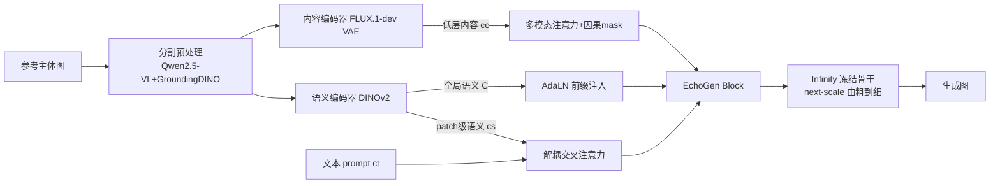

# EchoGen: Generating Visual Echoes in Any Scene via Feed-Forward Subject-Driven Auto-Regressive Model

**会议**: ICLR 2026  
**OpenReview**: [https://openreview.net/forum?id=ctmyCjo18u](https://openreview.net/forum?id=ctmyCjo18u)  
**代码**: 待确认  
**领域**: 图像生成 / 主体驱动生成  
**关键词**: 视觉自回归(VAR), 主体驱动生成, 前馈式, 双路注入, 零样本定制  

## 一句话总结
EchoGen 把"主体驱动生成"第一次搬到视觉自回归(VAR/Infinity)框架上，用一条语义路 + 一条内容路的双路注入解耦主体的"身份"与"细节"，在 DreamBench 上做到与扩散方法相当甚至更优的保真度，而采样延迟从 10s+ 压到 0.5–5.2s。

## 研究背景与动机
- **领域现状**：主体驱动生成（给一张参考主体图，把它放进任意文本描述的新场景）目前两条主流路线——一类是 DreamBooth/Textual-Inversion 这种"逐主体测试时微调"，效果好但每个新主体都要几百步训练、单独存 checkpoint；另一类是 IP-Adapter/OminiControl 这种"前馈式"，一次大规模训练后零样本上线，但全都建在扩散模型上。
- **现有痛点**：前馈式虽然省掉了逐主体微调，却继承了扩散模型迭代去噪的高推理延迟——生成一张 1024×1024 图普遍要 10s 以上，限制了实际部署。
- **核心矛盾**：既要"前馈零样本 + 高保真"，又要"低延迟"。VAR 模型（next-scale 由粗到细预测）天生采样快、质量高，本该是化解这个矛盾的理想底座，但它在前馈主体驱动这个场景下几乎无人探索。
- **本文目标**：在 VAR（具体是文生图版 Infinity）之上，建一套高效、可扩展、强可控的前馈主体驱动系统。
- **核心 idea**：**双路解耦注入**——一条"语义路"用 DINOv2 抽主体的抽象身份、防止 identity drift；一条"内容路"用 FLUX VAE 抽低层纹理细节、补回保真度。两路各走各的注入机制，主干冻结只微调注入模块。

## 方法详解

### 整体框架
EchoGen 以 Infinity（VAR 文生图模型）为冻结骨干，在每个 Transformer block 里插入"EchoGen block"，由内容编码器与语义编码器从"一枚硬币的两面"协同提供主体特征。输入参考图先经过一条分割预处理管线（Qwen2.5-VL 描述主体 + GroundingDINO 定位裁剪、背景刷白）以抑制背景噪声；随后语义路与内容路分别注入；训练只更新新加的注意力模块，推理用主体-文本双重 CFG 灵活调节"像主体"与"听文本"的权衡。

### 关键设计

**1. 语义路双层注入：守住身份不漂移** —— 语义特征捕获的是主体的抽象身份，是避免生成中"画着画着就不像了"的关键。EchoGen 用预训练 DINOv2 抽两种粒度：patch 级细粒度语义 $c_s$ 通过**解耦交叉注意力**与文本条件并行注入，文本和语义各用一套独立的 $(W^k,W^v)$ 投影后拼接成上下文，$Q=ZW^q,\ K=\mathrm{concat}(c_sW^k_s,c_tW^k_t),\ V=\mathrm{concat}(c_sW^v_s,c_tW^v_t)$，且只训语义那套 $(W^k_s,W^v_s)$、冻结文本投影和 query，从而把视觉语义空间对齐到生成器隐空间又不扰动预训练知识；与此同时把 DINOv2 的**全局语义 token $C$ 前缀**到序列开头，并作为 AdaLN 的条件，提供整体结构的全局引导。消融显示 DINOv2 的细粒度语义明显优于过粗的 SigLIP-2 或缺语义的 VAE 特征（DINO 0.632 vs 0.438/0.433），加全局前缀进一步把 DINO 从 0.632 拉到 0.670。

**2. 内容路按需取细节：补回纹理与结构保真** —— 语义特征太抽象，单靠它会丢主体的低层细节。第二条路用 FLUX.1-dev VAE 抽低层内容 $c_c$，经**多模态注意力**注入：生成 token 与参考内容 token 拼在一起做注意力 $Q,K,V=\mathrm{concat}(\cdot W,\ c_cW_c)$，但加了一个精心设计的 **attention mask**——生成 token 可以无障碍访问参考 token 按需蒸馏细节，而因果 mask 让参考 token 看不到生成序列，保证自回归采样轨迹不被未来信息污染。同样只训内容侧的 $(W^q_c,W^k_c,W^v_c)$ 与配套 FFN。消融里加这条路让 CLIP-I 明显上升，证明它专门补的就是 semantic 路丢掉的局部细节。

**3. 主体分割预处理：让注入只盯着主体** —— 真实参考图常带复杂背景，会干扰注入。EchoGen 先用 Qwen2.5-VL 识别主体语义、产出描述性 prompt，再用该 prompt 驱动 GroundingDINO 精确定位并裁出 bounding box，把无关区域刷成统一白底。值得一提的是 Qwen2.5-VL 只在训练阶段自动化标注主体、**推理时可选**——用户直接给一句 DreamBench 式的主体描述即可，所以它不构成推理瓶颈。

**4. 主体-文本双重 CFG：灵活权衡像主体 vs 听文本** —— 训练时以各 10% 概率独立把文本条件 $c_t$ 和图像条件 $c_s,c_c$ 替换成无条件 token；推理时假设文本与图像条件独立，用 $\hat{l}=l(\varnothing_t,\varnothing_s,\varnothing_c)+\gamma_t\big(l(c_t,\varnothing_s,\varnothing_c)-l(\varnothing_t,\varnothing_s,\varnothing_c)\big)+\gamma_I\big(l(c_t,c_s,c_c)-l(c_t,\varnothing_s,\varnothing_c)\big)$ 两个独立的引导系数 $\gamma_t,\gamma_I$ 分别控制文本对齐与主体保真，给用户一个显式旋钮去平衡两者。

## 实验关键数据

### 主实验表格（DreamBench，30 主体 × 25 prompt，H20 测延迟）

| 方法 | 基座 | DINO↑ | CLIP-I↑ | CLIP-T↑ | 延迟↓ |
|------|------|-------|---------|---------|-------|
| DreamBooth（测试时微调） | SD-v1.5 | 0.668 | 0.803 | 0.305 | 15min |
| AR-Booth（测试时微调） | Infinity-2B | 0.750 | 0.808 | 0.269 | 2.8h |
| OmniGen（统一生成） | OmniGen | 0.693 | 0.801 | 0.315 | 93.4s |
| IP-Adapter（前馈） | SDXL | 0.613 | 0.810 | 0.292 | 16.9s |
| OminiControl（前馈） | FLUX.1-dev | 0.684 | 0.799 | 0.312 | 27.5s |
| EasyControl（前馈） | FLUX.1-dev | 0.652 | 0.789 | 0.325 | 25.4s |
| **EchoGen-0.1B** | Infinity-0.1B | 0.675 | 0.806 | 0.321 | **0.5s** |
| **EchoGen-2B** | Infinity-2B | **0.755** | **0.835** | 0.325 | **5.2s** |

EchoGen-2B 在 DINO/CLIP-I 上全场最佳、CLIP-T 也居前列，而延迟比扩散前馈方法快 5–50 倍；0.1B 小模型 0.5s 出图、指标仍超过多个扩散基线。人评（Table 2）中 EchoGen-2B 在主体保真(0.37)、真实感(0.34)上偏好率全场第一，文本对齐与 EasyControl 持平。

### 消融实验表格（均在 EchoGen-0.1B 上）

| 消融项 | 设置 | DINO↑ | CLIP-I↑ | CLIP-T↑ |
|--------|------|-------|---------|---------|
| 语义编码器(细粒度) | SigLIP-2 / FLUX VAE / **DINOv2** | 0.438 / 0.433 / **0.632** | 0.720 / 0.706 / **0.788** | 0.320 / 0.320 / **0.328** |
| 全局语义前缀 | w/o → w prefix | 0.632 → **0.670** | 0.788 → **0.798** | 0.328 → 0.322 |
| 语义注入方式 | MM-Attn / **Cross-Attn** | 0.646 / **0.670** | 0.792 / 0.798 | 0.325 / 0.322 |
| 内容细节注入 | baseline / +MM-Attn | 0.670 / **0.672** | 0.798 / **0.806** | 0.322 / 0.321 |

### 关键发现
- **语义粒度决定身份保真**：DINOv2 细粒度语义远胜过粗的 SigLIP-2 和无语义的 VAE 特征，是身份不漂移的根。
- **两路各司其职**：语义路撑结构与身份、内容路补局部纹理（CLIP-I 提升），分工解耦验证有效。
- **延迟瓶颈在生成器本身**（Infinity 4.95s），GroundingDINO(0.24s)、两个编码器(0.01/0.02s)几乎不占成本，可选的 Qwen2.5-VL(1.13s)也只在训练用。
- 语义注入选交叉注意力而非多模态注意力：后者文本对齐略好，但前者主体保真(DINO)显著更高。

## 亮点与洞察
- **范式首创**：第一个把前馈主体驱动生成建在 VAR 自回归模型上的工作，给"扩散一统天下"的主体定制开了条低延迟新路。
- **"一枚硬币两面"的解耦直觉很干净**：身份(语义/DINOv2) 与 细节(内容/VAE) 用不同编码器、不同注入机制分开喂，避免了单一特征"既要抽象身份又要具体纹理"的内在冲突。
- **因果 mask 的工程细节**：让参考 token 对生成序列"失明"，既能让生成端按需取细节，又不破坏自回归采样的因果性，是把扩散式条件注入移植到 AR 范式的关键适配。
- **推理友好**：重组件(Qwen2.5-VL)只在训练阶段需要，推理用文字描述即可绕开，实用性强。

## 局限与展望
- **绝对延迟仍受生成器规模约束**：2B 模型 5.2s 主要花在 Infinity 生成器上，进一步提速需要更轻的 VAR 骨干。
- **依赖合成训练数据**：640K 三元组由 GPT-4o + FLUX.1-dev 合成，主体分布与真实长尾主体的差距未充分评估。
- **分割管线引入级联误差**：GroundingDINO 裁框失败时会直接影响注入质量，论文未深入讨论失败回退。
- **多主体/属性绑定未涉及**：当前聚焦单主体放入新场景，多主体组合、精细属性编辑等更难的可控生成尚待扩展。

## 相关工作与启发
- **VAR 谱系**：建立在 VAR(next-scale 预测) → Infinity(bitwise 量化、文生图 SOTA) 之上，把 VAR 的"由粗到细"天然层次结构用于"先定全局构图、再补主体细节"。
- **前馈主体驱动谱系**：相对 IP-Adapter/OminiControl/EasyControl 等扩散前馈方法，核心差异是把底座换成 AR 以换取数量级的延迟优势。
- **解耦注入借鉴**：解耦交叉注意力来自 Custom-Diffusion(Kumari et al.) 的思路，全局 token + AdaLN 沿用 Infinity；启发在于"把可控信号拆成多粒度、用最匹配的注入位点分别喂入"这一通用配方可迁移到其他 AR 可控生成任务。

## 评分
- **新颖性**: ⭐⭐⭐⭐ —— 首个 VAR 前馈主体驱动框架，范式层面有开创性；双路解耦本身是组合已知模块，但用到 AR 范式并配因果 mask 是实打实的新适配。
- **实验充分度**: ⭐⭐⭐⭐ —— DreamBench 定量 + 人评 + 逐组件延迟 + 4 组消融较完整；但只在 DreamBench 单基准、缺多主体与更难可控场景的评估。
- **写作质量**: ⭐⭐⭐⭐ —— 动机—矛盾—方法递进清晰，图 2 架构与 mask 设计讲得明白，公式规范。
- **价值**: ⭐⭐⭐⭐ —— 把主体驱动生成的延迟压进个位数秒级，对实时创意应用部署有直接实用价值，并为"AR 做可控生成"提供了可复用模板。

<!-- RELATED:START -->

## 相关论文

- [\[ICLR 2026\] Generate Any Scene: Scene Graph Driven Data Synthesis for Visual Generation Training](generate_any_scene_scene_graph_driven_data_synthesis_for_visual_generation_train.md)
- [\[ICLR 2026\] Generating Metamers of Human Scene Understanding](generating_metamers_of_human_scene_understanding.md)
- [\[CVPR 2025\] Collaborative Decoding Makes Visual Auto-Regressive Modeling Efficient](../../CVPR2025/image_generation/collaborative_decoding_makes_visual_auto-regressive_modeling_efficient.md)
- [\[CVPR 2026\] FlowFixer: Towards Detail-Preserving Subject-Driven Generation](../../CVPR2026/image_generation/flowfixer_towards_detail-preserving_subject-driven_generation.md)
- [\[CVPR 2026\] ChArtist: Generating Pictorial Charts with Unified Spatial and Subject Control](../../CVPR2026/image_generation/chartist_generating_pictorial_charts_with_unified_spatial_and_subject_control.md)

<!-- RELATED:END -->
