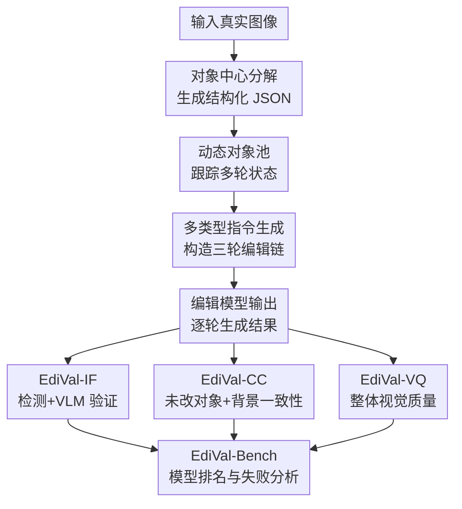

# EdiVal-Agent: An Object-Centric Framework for Automated, Fine-Grained Evaluation of Multi-Turn Editing

**会议**: ICLR 2026  
**OpenReview**: [https://openreview.net/forum?id=YkV0fnXgJA](https://openreview.net/forum?id=YkV0fnXgJA)  
**代码**: https://github.com/TianyuCodings/EdiVal  
**领域**: 图像生成 / 图像编辑评测  
**关键词**: 多轮图像编辑, 自动化评测, 对象中心评估, 指令跟随, 内容一致性

## 一句话总结
EdiVal-Agent 把多轮图像编辑评测拆成对象分解、对象状态跟踪、指令生成和工具辅助打分，用 EdiVal-IF、EdiVal-CC、EdiVal-VQ 三类指标更细粒度地评估编辑模型是否改对目标、保住未编辑内容，并维持视觉质量。

## 研究背景与动机
**领域现状**：指令式图像编辑已经从单轮编辑走向多轮交互：用户先让模型添加文字，再替换主体，接着修改颜色或背景。新一代模型包括 GPT-Image-1/1.5、Nano Banana、Seedream、FLUX Kontext、Qwen-Image-Edit 等，能力越来越强，但评测方式仍大多停留在两类做法：拿模型输出和一张 reference edited image 做相似度比较，或直接让 VLM 对整张图回答“是否符合指令”。

**现有痛点**：reference-based 评测的问题在于“正确编辑”通常不是唯一答案。比如“把马换成鹿”可以有很多合理构图，一张参考图只覆盖其中一种；如果参考图本身由旧生成模型合成，还会把旧模型的偏差带进评测。VLM-only 评测看似灵活，但在对象存在性、空间关系、计数、局部属性变化和生成伪影上并不稳定：它可能看漏小区域变化，也可能幻觉出不存在的对象。

**核心矛盾**：图像编辑成功与否本质上有两个相互牵制的目标：该改的地方要精确改变，不该改的地方要保持一致。单一全局相似度会惩罚合理变化，单一 VLM 判断又缺少可验证的局部证据；尤其到多轮编辑时，哪些对象已经被改过、哪些对象应该继续保持不变，会随轮次动态变化。

**本文目标**：作者希望建立一个自动化、可解释、细粒度的评测框架，既能生成多轮编辑任务，又能从 instruction following、content consistency、visual quality 三个维度评价现代编辑模型。更具体地说，它要回答三件事：当前轮的目标对象是否被正确编辑，历史上没有被动过的对象和背景是否保持稳定，最终图像是否仍然自然好看。

**切入角度**：论文选择“对象中心”作为评测支点。原因很直接：绝大多数编辑指令都围绕对象、属性、文本、数量、空间关系或背景展开；如果能把图像解析成结构化对象池，并在每轮编辑后更新对象状态，就能把模糊的整图判断转化为更可审计的局部检测、语义验证和相似度计算。

**核心 idea**：用动态对象池把多轮图像编辑的“该改什么 / 该保留什么”显式记录下来，再结合开放词表检测器、VLM、DINO 特征和人类偏好模型，构造比 reference 或 VLM-only 更可靠的自动评测流程。

## 方法详解

### 整体框架
EdiVal-Agent 的输入是一张真实图像，输出不是编辑图像本身，而是一套多轮编辑指令和对应的自动评测结果。它先用 VLM 将图像分解成对象级 JSON，再从对象池中采样可编辑对象和编辑类型生成三轮指令，最后对各编辑模型的输出分别计算指令跟随、内容一致性和视觉质量。

整套流程的关键是动态对象池：所有出现过的对象、当前可编辑对象、未被编辑对象会随着每一轮指令更新。这样第三轮评测时，系统不需要凭空猜“哪些地方应该不变”，而是能回到对象池里查到哪些对象从原图到当前轮都应该保持一致。

### 关键设计
**1. 对象中心分解：把编辑评测从整图主观判断落到可追踪对象上**

传统 VLM 直接看“原图、编辑图、指令”容易把局部证据揉成一个不可解释的判断。EdiVal-Agent 先让 VLM 对输入图像做结构化分解，抽取清晰可见的前景对象及其属性，包括 object、color、material、text、count、foreground 等字段，并用类似 `{material} {color} {object}` 的名字组织对象，例如 `metal yellow sign` 或 `metal brown pole`。这个 JSON 不是简单 caption，而是后续指令生成和指标计算的状态表。

为了避免 VLM 分解阶段把不存在或检测不到的对象带进 benchmark，作者再用 Grounding-DINO 做验证，只保留检测可靠的对象及其 bounding boxes。这个步骤看起来像目标检测，但它在论文里不是最终任务，而是给图像编辑评测提供“锚点”：之后无论是判断对象是否被移除、颜色是否改变，还是计算未编辑对象相似度，都围绕这些对象锚点展开。

**2. 动态对象池：让多轮编辑里的“可改对象”和“应保留对象”随状态变化**

多轮编辑最难评的是状态会变。第一轮把棕色杆子改成灰色杆子后，第二轮如果还把“棕色杆子”当作当前对象就会出错；如果第二轮要求换背景，前景对象又应该被显式保留下来。EdiVal-Agent 用三个池子维护这种状态：$P^{all}_t$ 表示到第 $t$ 轮为止所有出现过的对象，$P^{avail}_t$ 表示当前可编辑对象，$P^{unch}_t$ 表示从原图到当前轮尚未被编辑、因此应该保持一致的对象。

在每一轮，系统先从九类指令里选择一种尚未用过的编辑类型，再从 $P^{avail}_t$ 里选对象并生成自然语言指令，随后根据编辑语义更新三个池子。比如 subject replace 会让源对象从可编辑池中消失、把目标对象加入 all/available；color alter 会更新对象属性；background change 会从该轮开始关闭背景一致性评分，并在指令里追加让前景对象保持不变的约束。这个设计使 benchmark 不是固定 prompt 列表，而是一个能根据场景和历史变化生成合理多轮任务的 agentic pipeline。

**3. EdiVal-IF：用符号检测处理可验证编辑，用局部 VLM 处理语义编辑**

EdiVal-IF 负责 instruction following，它不把所有指令都丢给 VLM，而是按可验证方式分流。对于 subject add、subject remove、subject replace、position change、count change 这类符号上可检验的任务，系统用开放词表检测器产生目标对象框，再用规则判断是否成功。例如 position change 可检查目标对象框中心是否移动到参照对象左侧，即 $center_x(B_A^t) < center_x(B_B^t)$；count change 可检查检测框数量是否符合目标计数。

对于 color alter、material alter、text change、background change 这类需要语义判断的任务，系统仍使用 VLM，但不是让 VLM 看整张图泛泛回答，而是先由检测器定位相关对象或区域，再把裁剪后的局部证据交给 VLM 按指令模板验证。论文把这种分流写成两类公式：符号任务由 $F_{sym}(M_{detect}(I_{t-1}, I_t | P^t))$ 得分，语义任务由 $M_{VLM}(I^{t-1}_o, I^t_o | P^t)$ 得分。好处是空间、计数、存在性等 VLM 薄弱项交给检测和规则，颜色、材质、文本等更语义化的项才交给 VLM。

**4. EdiVal-CC 与 EdiVal-VQ：把“不该变的内容”和“看起来好不好”分开评**

内容一致性不是简单比较原图和当前图，因为目标对象本来就应该变化。EdiVal-CC 先根据 $P^{all}_t$ 找出所有历史出现过对象在原图和当前图中的区域，把这些区域从整图区域 $\Omega$ 中排除，得到背景区域 $\Omega^t_{bg}$；再对 $P^{unch}_t$ 中未被编辑对象分别计算原图 crop 与当前图 crop 的语义相似度。最终得分近似为背景相似度和未改对象平均相似度的均值：

$$
EdiVal\text{-}CC(I_t, I_0, P^{1:t}) = \frac{1}{2}\left(s^t_{bg} + \frac{1}{|P^{unch}_t|}\sum_{o\in P^{unch}_t}s^t_o\right)
$$

这里作者默认用 DINOv3 特征相似度，而不是只用 L1。原因是多轮编辑中对象位置可能有轻微偏移，像素级 L1 会把语义上保持一致的对象误判得很差。视觉质量 EdiVal-VQ 则单独用 HPSv3 报告，不并入总分；作者观察到 GPT-Image-1 这类模型会主动“美化”图像并拉高 HPS，但这种美化可能损害输入保真度，因此视觉质量应作为独立维度，而不是和一致性混成一个指标。

### 一个完整示例
假设原图里有一个 `metal yellow sign` 和一个 `metal brown pole`。分解阶段会生成包含材质、颜色、文本、数量、前景标记的 JSON，并经 Grounding-DINO 留下可信框。此时 $P^{all}_0$、$P^{avail}_0$ 都包含这两个对象，$P^{unch}_0$ 也包含它们。

第一轮系统采样到 `color alter`，选择 `metal brown pole`，生成“Change the color of metal brown pole to gray”。编辑模型输出当前图后，EdiVal-IF 会检测 pole 区域并让 VLM 判断它是否从 brown 变成 gray；对象池则把 `metal brown pole` 更新为 `metal gray pole`，同时把未被编辑的 `metal yellow sign` 留在 $P^{unch}_1$。

第二轮如果生成“Replace metal gray pole with wooden fence”，EdiVal-IF 对 subject replace 会检查编辑图中 `metal gray pole` 是否不再被检测到、`wooden fence` 是否被检测到；EdiVal-CC 则不会惩罚 pole/fence 的改变，但会继续检查 `metal yellow sign` 是否和原图保持一致。第三轮如果换背景，系统会关闭背景一致性评分，只保留前景对象的一致性约束。这样每轮指标都和“这一轮到底应该改变什么”同步，而不是用同一个静态 mask 或全图相似度硬套所有情况。

### 损失函数 / 训练策略
这篇论文不是训练一个新的编辑模型，而是构建评测 agent 和 benchmark，因此没有传统意义上的 loss function。它的“优化目标”体现在指标组合上：EdiVal-IF 衡量当前编辑是否完成，EdiVal-CC 衡量未编辑内容是否保留，EdiVal-VQ 衡量整体视觉质量，整体分数 EdiVal-O 只聚合前两者：

$$
EdiVal\text{-}O = \sqrt{EdiVal\text{-}IF \cdot EdiVal\text{-}CC}
$$

使用几何平均的含义是惩罚偏科模型：一个模型如果非常会执行指令但把原图内容改坏，或内容保持很好但编辑目标经常失败，整体分都会被拉低。视觉质量不进入 EdiVal-O，是因为美化和保真存在任务依赖的 trade-off，用户可能更偏好高审美，也可能更偏好输入风格不漂移。

## 实验关键数据

### 主实验
EdiVal-Bench 基于 572 张真实图像生成 1,716 条三轮编辑指令，覆盖 9 类指令，评测 16 个编辑模型。论文主表显示，闭源模型整体领先，开源模型里 Qwen-Image-Edit 第一轮表现不错，但多轮退化明显。

| 模型 | 类型 | 延迟(s/img) | EdiVal-IF T1/T2/T3 | EdiVal-CC T1/T2/T3 | EdiVal-O T1/T2/T3 | 排名 |
|------|------|-------------|--------------------|--------------------|-------------------|------|
| Seedream 4.0 | 闭源 | 14.55 | 75.93 / 55.58 / 41.59 | 92.51 / 88.03 / 85.86 | 83.81 / 69.95 / 59.76 | 1 |
| GPT-Image-1.5 | 闭源 in-context | 35.55 | 75.19 / 55.92 / 40.08 | 94.49 / 91.20 / 88.49 | 84.29 / 71.41 / 59.55 | 2 |
| Nano Banana 2 | 闭源 in-context | 23.79 | 73.89 / 54.17 / 38.61 | 93.54 / 90.52 / 88.61 | 83.14 / 70.02 / 58.49 | 3 |
| FLUX.2-max | 闭源 flow matching | 36.87 | 75.55 / 55.27 / 39.36 | 92.91 / 88.30 / 85.78 | 83.78 / 69.86 / 58.10 | 4 |
| Qwen-Image-Edit | 开源 flow matching | 115.08 | 72.90 / 44.06 / 22.55 | 84.22 / 80.52 / 77.98 | 78.36 / 59.56 / 41.93 | 9 |
| FLUX.1-Kontext-dev | 开源 flow matching | 29.21 | 59.97 / 32.69 / 16.61 | 95.32 / 92.24 / 90.22 | 75.61 / 54.91 / 38.71 | 11 |

人类一致性实验收集了 4,576 个人类标注，让评审者判断编辑图是否成功遵循指令。结果表明，EdiVal-IF 明显优于 VLM-only 和 CLIP directional baseline，尤其在空间、移除、计数等 VLM 容易出错的任务上更有优势。

| 评测方法 | 人类一致性准确率 | 说明 |
|----------|------------------|------|
| EdiVal-IF | 81.3% | 检测器 + 规则 + 局部 VLM 的混合评测 |
| Qwen2-VL / VLM-only | 75.2% | 直接用 VLM 判断，空间和对象存在性更弱 |
| thresholded CLIP dir | 65.4% | 需要按任务调阈值，局部编辑敏感性不足 |
| 人类标注者之间 | 85.5% | 可视作自动工具可接近的上界之一 |

### 消融实验
论文的消融重点不是训练模块，而是评测工具栈和复杂 prompt 压缩方式。总体结论是：换 VLM、检测阈值和 DINO 特征会改变绝对分数，但主要模型排序比较稳定；如果把 Grounding-DINO 换成明显更弱的 OWL-ViT，人类一致性会大幅下降。

| 配置 | 关键指标 | 说明 |
|------|----------|------|
| Qwen2.5-7B-VL 替换默认 VLM | Pearson 0.9544, Spearman 0.9298 | IF 排名基本保持，只是绝对分轻微移动 |
| Qwen2.5-32B-VL 替换默认 VLM | Pearson 0.9790, Spearman 0.9544 | 更大 VLM 同样保持高相关 |
| 检测阈值改为 0.4 | Pearson 0.9817, Spearman 0.9860 | 合理阈值变化不会改变主要结论 |
| 关闭 large-box filter | Pearson 0.9982, Spearman 0.9930 | 大框过滤对主排名影响很小 |
| Grounding-DINO → OWL-ViT | Pearson 0.8157, Spearman 0.7929 | 排序尚有相关，但绝对成功率和人类一致性下降 |
| DINOv3 → DINOv2 | Pearson 0.9987, Spearman 1.0000 | CC 绝对值偏移，但模型排序几乎一致 |

复杂编辑压缩实验把三轮指令压成一个 single-shot complex prompt，用 Qwen-Image-Edit 测试不同连接方式。结果说明 prompt 格式本身不是主要瓶颈，真正影响多轮表现的更可能是模型在连续编辑自己输出时的 exposure bias。

| 压缩方式 | C3 成功率 | 说明 |
|----------|-----------|------|
| Default 直接拼接 | 27.62% | 基准复杂 prompt |
| Random shuffle | 27.10% | 打乱顺序后变化很小 |
| Sequential connector | 26.92% | 加 first/then/last 没明显收益 |
| Keep-unchanged | 25.87% | 显式保留约束反而略低 |

### 关键发现
- Seedream 4.0 在总体排名上第一，兼顾了指令跟随、内容一致性和较低延迟；GPT-Image-1.5 在 T1/T2 的 EdiVal-O 最高，并显著提升了 GPT-Image-1 的内容一致性。
- Qwen-Image-Edit 第一轮很强，但 EdiVal-O 从 78.36 降到 59.56 再到 41.93，说明许多单轮编辑器在处理自己上一轮输出时会发生误差累积。
- Nano Banana 在颜色、材质这类属性编辑上相对稳定，但在 position change 和 count change 上较弱，暴露出现代编辑模型仍不擅长空间和数值约束。
- GPT-Image-1 的视觉质量分数很高，但作者指出这很可能来自主动美化；美化并不等于忠实编辑，因此论文把 EdiVal-VQ 单独报告。
- 多轮编辑和 single-shot complex editing 各有优势：没有明显 exposure bias 的模型通常受益于逐步编辑，误差累积严重的模型有时反而适合把多条指令压成一次完成。

## 亮点与洞察
- 对象池是这篇论文最关键的抽象。它把“多轮编辑历史”转成可更新的数据结构，使内容一致性不再依赖静态 mask 或全图相似度，而能明确知道哪些对象应该从头到尾保持不变。
- EdiVal-IF 的分流很实用：检测器负责对象存在、位置、计数，VLM 负责颜色、材质、文本和背景语义。这不是简单堆工具，而是把不同工具放到各自更可靠的子问题上。
- 论文没有把视觉质量强行并入整体分数，这个决定很合理。图像编辑的“好看”和“忠实”经常冲突，尤其用户想保留原图风格时，高 HPS 可能反而代表过度美化。
- EdiVal-Bench 的价值不只在排名，还在诊断模型失败模式。比如 Qwen-Image-Edit 的多轮退化、FLUX.1-Kontext-dev 的高一致性但低指令跟随、GPT-Image-1 的美化漂移，都是单一总分很难看出的。
- 这个框架可以迁移到视频编辑、3D 场景编辑或 GUI 操作评测：只要能把环境状态分解成可追踪对象，并为动作成功与状态保持定义局部指标，就能复用“对象池 + 工具分流评测”的思路。

## 局限与展望
- 指令类型主要围绕对象中心编辑，暂时没有覆盖风格迁移、叙事性编辑、抽象审美要求等真实用户常见请求。作者也明确说明 style change 因类别边界不清晰而没有纳入。
- 评测依赖 Grounding-DINO 等开放词表检测器，因此检测器 false positive/false negative 会直接影响 EdiVal-IF。论文给出的失败例子是栏杆已经被替换成木栅栏，但检测器仍在同一区域同时检测到源对象和目标对象，导致成功编辑被误判为失败。
- VLM 分解和局部语义判断仍可能出错，尤其是文本、材质、细粒度属性和复杂空间关系。虽然工具替换消融显示排序稳定，但这不代表每个样本级判断都可靠。
- benchmark 默认三轮编辑，覆盖了常见多轮场景，但真实交互可能更长、更开放。随着轮次增加，对象池更新错误和模型输出漂移都会更严重。
- 论文主要用于评测，并没有把评分反馈用于改进编辑模型。一个自然后续方向是 Best-of-N 选择、reward model 或 RL/post-training，把 EdiVal-IF 和 EdiVal-CC 作为训练或推理时的反馈信号。

## 相关工作与启发
- **vs MagicBrush / UltraEdit / AnyEdit**: 这些 benchmark 常依赖 reference edited image 或成对编辑数据，适合训练和基础比较，但 reference 单一且可能继承旧生成模型偏差。EdiVal-Bench 不依赖参考图，而是直接检查指令目标和未编辑内容。
- **vs GEdit-Bench / HQ-Edit / ImgEdit-Bench**: 这些方法更多使用 VLM 作为评测器，解释性较强但容易在空间、计数、对象存在性上失误。EdiVal-Agent 将 VLM 限制在更适合的局部语义验证上，同时用检测器和规则承担符号任务。
- **vs CLIP directional score**: CLIP dir 可以给出语义方向变化，但对细粒度局部编辑和多对象约束不敏感，还需要任务特定阈值。EdiVal-IF 在人类一致性上达到 81.3%，明显高于 CLIP dir 的 65.4%。
- **vs Artificial Analysis human leaderboard**: 在重叠模型集合上，EdiVal 的相对排序与 Artificial Analysis 的人类投票排序一致，这为自动评测的有效性提供了外部佐证。
- **对未来评测的启发**: 高质量生成模型评测越来越需要“结构化状态 + 专家工具 + VLM 语义判断”的组合，而不是期待一个通用 VLM 直接给出所有答案。EdiVal-Agent 是这种趋势在图像编辑领域的一个清晰案例。

## 评分
- 新颖性: ⭐⭐⭐⭐☆ 对象中心、多轮状态池和混合工具评测组合得很完整，单个工具不新，但整体框架抓住了编辑评测的关键痛点。
- 实验充分度: ⭐⭐⭐⭐⭐ 覆盖 16 个模型、9 类指令、三轮编辑、人类一致性、工具替换、复杂 prompt 和失败案例，实验维度相当扎实。
- 写作质量: ⭐⭐⭐⭐☆ 主线清楚、图表丰富，但附录中默认 VLM 表述和新增模型分析略有前后不完全同步的问题。
- 价值: ⭐⭐⭐⭐⭐ 对图像编辑模型开发很有参考价值，尤其适合作为自动 leaderboard、失败诊断和未来 reward signal 的基础设施。

<!-- RELATED:START -->

## 相关论文

- [\[ICLR 2026\] LaTo: Landmark-tokenized Diffusion Transformer for Fine-grained Human Face Editing](lato_landmark-tokenized_diffusion_transformer_for_fine-grained_human_face_editin.md)
- [\[CVPR 2026\] FreqEdit: Preserving High-Frequency Features for Robust Multi-Turn Image Editing](../../CVPR2026/image_generation/freqedit_preserving_high-frequency_features_for_robust_multi-turn_image_editing.md)
- [\[CVPR 2026\] DiffGraph: An Automated Agent-driven Model Merging Framework for In-the-Wild Text-to-Image Generation](../../CVPR2026/image_generation/diffgraph_an_automated_agent-driven_model_merging_framework_for_in-the-wild_text.md)
- [\[ICLR 2026\] Improved Object-Centric Diffusion Learning with Registers and Contrastive Alignment (CODA)](improved_object-centric_diffusion_learning_with_registers_and_contrastive_alignm.md)
- [\[ICLR 2026\] JointDiff: Bridging Continuous and Discrete in Multi-Agent Trajectory Generation](jointdiff_bridging_continuous_and_discrete_in_multi-agent_trajectory_generation.md)

<!-- RELATED:END -->
