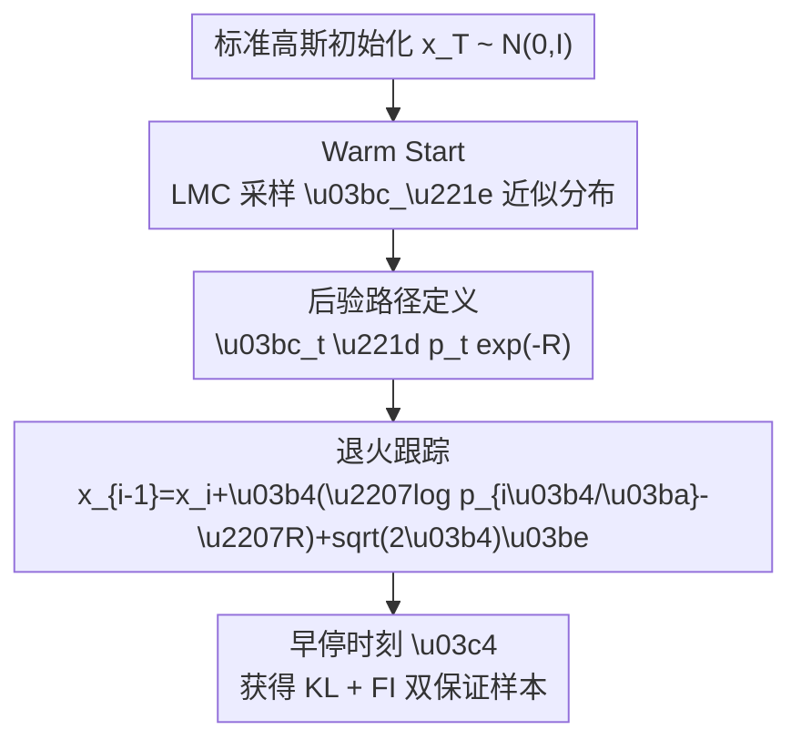

# Efficient Approximate Posterior Sampling with Annealed Langevin Monte Carlo

**会议**: ICLR2026  
**OpenReview**: [https://openreview.net/forum?id=7GrUROKDyW](https://openreview.net/forum?id=7GrUROKDyW)  
**代码**: 暂未开源（以 OpenReview 页面更新为准）  
**领域**: image_generation  
**关键词**: 后验采样, 扩散模型, Annealed Langevin, KL-FI 双保证, 逆问题  

## 一句话总结
这篇工作提出了 Annealed Langevin Monte Carlo (ALMC) 的可证明版本：先在“只看测量一致性”的强凸目标上 warm start，再沿着“噪声先验的后验路径”逐步退火，在多项式时间内同时获得“对噪声后验的 KL 接近”与“对真实后验的 Fisher 接近”。

## 研究背景与动机
**领域现状**：扩散模型和 score-based 生成模型已经能稳定学习复杂先验 $p(x)$，并在超分、修复、MRI 重建、风格化等任务里承担“先验约束器”的角色。实际推理时常见问题是：给定测量 $y$（例如 $y=A(x)+\eta$）后，如何在不重训模型的前提下，从后验 $p(x\mid y)$ 采样。

**现有痛点**：经验算法（如各种 posterior guidance、split-gibbs 变体）在视觉任务中很有效，但理论上通常只给到渐近结论，或仅在非常受限设置下成立。更关键的是，近期复杂度下界结果显示“精确后验采样（以 KL 意义）”在最坏情况下可归约到困难问题，意味着我们不能再把“全局 KL 精确逼近真实后验”当作普遍可达目标。

**核心矛盾**：后验采样本质上要同时满足两种约束：一是“像先验数据分布”（由 $p$ 约束），二是“符合观测测量”（由 $R_y$ 或 likelihood 约束）。在多模态情形下，这两个约束会在模式权重和模式可达性上产生冲突，导致局部采样容易、全局拼接困难。

**本文目标**：作者不再追求“对真实后验 $\mu_0$ 的全局 KL 精确采样”，转而求一个更可计算、但仍保留统计意义的目标：构造一个分布，既能在 KL 上贴近“噪声先验对应的后验”，又能在 Fisher divergence 上贴近“真实后验”。

**切入角度**：核心观察是“后验路径也可以退火”。定义 $\mu_t \propto p_t e^{-R}$，其中 $p_t$ 是先验加噪后的分布。高噪阶段后验更平滑、易混合；低噪阶段更接近真实后验但更难。若先在高噪后验附近启动，再慢速退火，就有机会避开直接攻克最难后验的计算障碍。

**核心 idea**：用 two-phase ALMC 在“可控路径”上做近似追踪，并把理论保证拆成“KL 负责全局模式权重稳定 + FI 负责局部几何正确性”，从而给出可在多项式时间成立的近似后验采样框架。

## 方法详解
论文将目标后验写成
$$
\mu_0(x) \propto p_0(x)\,e^{-R(x)},
$$
并引入噪声先验 $p_t$ 对应的后验族
$$
\mu_t(x) \propto p_t(x)\,e^{-R(x)}.
$$
算法不直接“跳到” $\mu_0$，而是先靠 warm start 到达接近 $\mu_{\infty}$（可理解为高噪先验对应后验），再沿 $\{\mu_t\}$ 向低噪方向退火。

### 整体框架
ALMC 可以概括成“先测量一致，再先验细化”的两阶段采样：第一阶段在强凸目标上快速混合，得到可靠初始化；第二阶段把该初始化作为起点，用 annealed LMC 逐步跟踪后验路径，直到一个早停时刻 $\tau$。这个“早停”不是工程技巧，而是理论结论的一部分：继续追求 KL 跟踪到 $t=0$ 在一般情形下不可保。

### 关键设计
**1. Warm Start on $\gamma e^{-R}$：先在强凸目标上拿到“全局可行”初始分布**

直接从复杂后验采样难点在于模式结构和测量冲突耦合太强。作者先忽略先验细节，只保留测量势能 $R$，在 $\gamma e^{-R}$ 上运行 LMC。由于高斯先验和凸 $R$ 组合后具备良好几何性质，LMC 可在多项式时间内把初始化分布拉到接近 $\mu_{\infty}$。

这一步的价值是“先解决可解部分”：先把样本推入与测量一致的区域，再在下一阶段逐步引入数据先验结构。相比一开始就对真实后验做剧烈漂移，warm start 大幅降低了后续退火初期的失稳风险。

**2. 路径跟踪而非终点硬逼近：以速率参数 $\kappa$ 控制后验演化可跟踪性**

第二阶段采用离散更新
$$
x_{i-1}=x_i+\delta\big(\nabla \log p_{i\delta/\kappa}(x_i)-\nabla R(x_i)\big)+\sqrt{2\delta}\,\xi_i,
$$
其中 $\kappa$ 控制“沿路径前进速度”。直观上，$\kappa$ 越大，路径走得越慢，采样器越容易跟上每个中间目标 $\mu_t$，但计算成本也更高。

这相当于把“难采样问题”分解成一串“相邻、稍易采样”的子问题。作者通过对路径 action、导数变化与正则性条件的控制，给出了在早停区间内可行的 KL 追踪界。

**3. KL + FI 双指标分工：KL 管全局模式权重，FI 管局部几何正确性**

仅用 FI 收敛会遇到 mode collapse 风险：在多模态分布中，局部每个模态内部都能拟合得很好，但模态权重可能错误。作者用一个双高斯示例说明 FI 对混合权重不敏感，因而不足以单独保证“全局正确后验”。

本文的策略是：在早停时刻对 $\mu_\tau$ 给 KL 保证，确保全局质量（含模态权重）；同时对真实后验 $\mu_0$ 给 FI 保证，确保局部一阶几何一致。这种“全局 + 局部”的组合，是本文相较传统单指标分析的关键理论创新。

### 一个完整示例
考虑二维多模态先验（若干竖条）和“仅观测纵坐标”的测量模型。真实后验会压低与观测不一致模式的权重，但在低噪阶段前，很多模式在局部看起来都“可行”。

若直接对 $\mu_0$ 做采样，链可能过早陷入某个模式；若只优化 FI，即使每个模式内部拟合好，也可能保持错误混合权重。ALMC 的行为是：

1. warm start 先把样本推到“观测一致带”附近；
2. 退火阶段逐步恢复先验细节，筛掉不一致模式；
3. 在早停点得到一个分布：对 $\mu_\tau$ 的 KL 小（全局权重合理），对 $\mu_0$ 的 FI 小（局部形状对齐）。

这解释了为什么作者强调“不是精确后验采样”，而是“可计算且统计上有意义的近似后验采样”。

### 损失函数 / 训练策略
这篇论文的重点不在训练新扩散模型，而在“给定已有先验 score 的推理期采样理论”。因此训练侧可概括为：假设可访问高质量先验 score $\nabla\log p_t$（文中主要分析理想 score 情形），采样阶段额外使用测量势能梯度 $\nabla R$。

理论分析的关键假设包括：

- 先验 $p_0$ 次高斯、且 score Lipschitz；
- $R(x)$ 平滑、凸、下界可控；
- 离散步长 $\delta$ 与速率 $\kappa$ 按指定关系选择（如分析中使用 $\delta=\kappa^{-1/4}$ 量级）。

在这些条件下，算法复杂度可写成关于维度和精度参数的多项式量级，给出“可证明可运行”的路径。

## 实验关键数据

### 主实验
论文包含了理论主结果与二维可视化实验两条线：前者验证“早停可得 KL+FI 双保证”，后者展示在多模态后验中 ALMC 能兼顾模式覆盖与测量一致性。下面表格汇总文中最核心的结果类型（非 benchmark leaderboard 型论文）。

| 实验设置 | 对比对象 | 观察指标 | 本文现象 | 结论 |
|---|---|---|---|---|
| 后验路径跟踪（一般设定） | 直接追 $\mu_0$ 的 KL | 是否可在多项式时间保证 | 不可普遍保证 | 需要早停近似目标 |
| ALMC 早停分布 vs $\mu_\tau$ | KL / TV | 全局分布接近性 | 可给出多项式界 | 全局模式权重可控 |
| ALMC 早停分布 vs $\mu_0$ | Fisher divergence | 局部几何一致性 | 可给出多项式界 | 局部后验结构可控 |
| 多模态示例（竖条+测量） | 仅 FI 导向采样 | 模式权重正确性 | 容易权重失真 | 仅 FI 不足以全局正确 |

### 消融实验
作者不是传统深度网络“去模块掉点”式消融，而是“理论部件消融”：若去掉某个分析或算法环节，会失去哪类保证。

| 配置 | 关键性质 | 结果趋势 | 说明 |
|---|---|---|---|
| 完整 ALMC（Warm Start + 退火 + 早停） | KL($\mu_\tau$) + FI($\mu_0$) | 同时成立 | 论文主结论 |
| 去掉 Warm Start | 初始分布可控性 | 明显变差 | 早期可能偏离测量一致区域 |
| 不做慢速退火（小 $\kappa$） | 路径跟踪误差 | 增大 | 相邻目标变化过快，难跟踪 |
| 强行追到 $t=0$ 的 KL | 全局 KL 可证性 | 不成立 | 触发理论不可 tractable 区域 |
| 仅看 FI 收敛 | 全局模式权重 | 无法保证 | 局部对齐但可能 mode collapse |

### 关键发现
- 本文最关键发现不是“又一个更强采样器”，而是“把后验采样可证目标重新定义到可计算区间”。
- 在多模态场景中，KL 与 FI 的职责可分离：KL 更像全局质量控制器，FI 更像局部几何控制器。
- 早停不是妥协，而是理论上必要的边界选择：它明确了“能保证到哪里”。
- 对逆问题实践者而言，这比单纯经验有效更有价值，因为它给出了失败边界与参数调节方向（尤其是 $\kappa$ 和退火日程）。

## 亮点与洞察
- 亮点 1：问题重述非常到位。作者没有执着于“精确后验采样”，而是提出“可证明且可用”的近似标准，这让理论与实践真正接上。
- 亮点 2：KL+FI 双保证的分工解释了很多经验现象。过去一些方法看起来“图像质量不错但统计不稳”，本质上可能就是只拿到了局部几何好处，缺少全局权重约束。
- 亮点 3：算法结构极简。两阶段 LMC（warm start + anneal）本身并不复杂，但配合路径正则性分析后，形成了具有解释力的完整框架。
- 洞察 1：在后验采样里，“路径设计”与“终点目标”同样重要，很多困难来自路径过陡而非终点本身。
- 洞察 2：对视觉逆问题，先验与观测冲突是常态而非例外，能在冲突区间给出可证近似，往往比追求无条件精确更实际。
- 可迁移思路：该分析范式可迁移到 split-gibbs、SMC 或 rectified flow 的条件采样中，尤其适合做“可证早停策略”设计。

## 局限与展望
- 局限 1：当前结论建立在凸且平滑的测量势能 $R$ 上。真实视觉任务中常见感知损失、离散约束、文本对齐损失并不总满足这些条件。
- 局限 2：理论多基于理想 score 或误差可控设定，实际大模型 score 误差如何传播到 KL/FI 双保证，仍需更细致界。
- 局限 3：结果强调“存在早停点附近的良好分布”，但如何在无 oracle 情况下自适应找到最佳早停时刻，工程上仍是开放问题。
- 局限 4：论文更偏理论与机制验证，缺少大规模标准数据集上与主流 posterior sampling 方法的系统量化比较。
- 展望 1：把“可证早停”与可学习的调度器结合，形成数据依赖的退火速度控制。
- 展望 2：扩展到非凸或分段凸测量模型，提升在真实重建与编辑任务中的适用性。
- 展望 3：将双指标保证推广到更贴近感知质量的统计距离（如 task-aware divergence）。

## 相关工作与启发
- **vs DPS / posterior score 估计路线**：DPS 类方法核心在于构造或近似后验 score，实践中很强，但严谨有限时保证难。本文绕开“精确后验 score 可得性”，改做后验路径近似追踪，理论闭环更完整。
- **vs Split-Gibbs / 交替一致性路线**：split-gibbs 强调交替满足先验与测量约束，常有偏置平稳分布问题。本文提供了另一种“连续路径退火”的视角，并指出该视角有望迁移到 split-gibbs 分析中。
- **vs 经典 LMC 非对数凹采样理论**：经典结果能给 FI 一阶驻点意义上的快速收敛，但在多模态全局权重上不敏感。本文把这个缺口明确补到 KL($\mu_\tau$) 上，形成互补。
- **对我自己的启发**：做条件生成/逆问题时，应该把目标拆成“全局正确性”和“局部几何正确性”两层，而不是单看某个指标或某张可视化结果。

## 评分
- 新颖性: ⭐⭐⭐⭐☆ 通过 KL+FI 双重可证目标重构后验采样问题，思路清晰且有辨识度。  
- 实验充分度: ⭐⭐⭐☆☆ 理论与可视化例子扎实，但大规模任务对比和工程统计仍偏少。  
- 写作质量: ⭐⭐⭐⭐☆ 数学叙事完整，核心难点与边界讲得较透。  
- 价值: ⭐⭐⭐⭐☆ 对扩散逆问题的“可证近似后验”研究非常关键，能指导后续算法设计。

<!-- RELATED:START -->

## 相关论文

- [\[ICLR 2026\] One Step Further with Monte-Carlo Sampler to Guide Diffusion Better](one_step_further_with_monte-carlo_sampler_to_guide_diffusion_better.md)
- [\[ICCV 2025\] FlowDPS: Flow-Driven Posterior Sampling for Inverse Problems](../../ICCV2025/image_generation/flowdps_flow-driven_posterior_sampling_for_inverse_problems.md)
- [\[ICLR 2026\] Quasi-Monte Carlo Methods Enable Extremely Low-Dimensional Deep Generative Models](quasi-monte_carlo_methods_enable_extremely_low-dimensional_deep_generative_model.md)
- [\[ICML 2026\] Simple Approximation and Derivative Free Inference-Time Scaling for Diffusion Models via Sequential Monte Carlo on Path Measures](../../ICML2026/image_generation/simple_approximation_and_derivative_free_inference-time_scaling_for_diffusion_mo.md)
- [\[ICLR 2026\] Error as Signal: Stiffness-Aware Diffusion Sampling via Embedded Runge-Kutta Guidance](error_as_signal_stiffness-aware_diffusion_sampling_via_embedded_runge-kutta_guid.md)

<!-- RELATED:END -->
