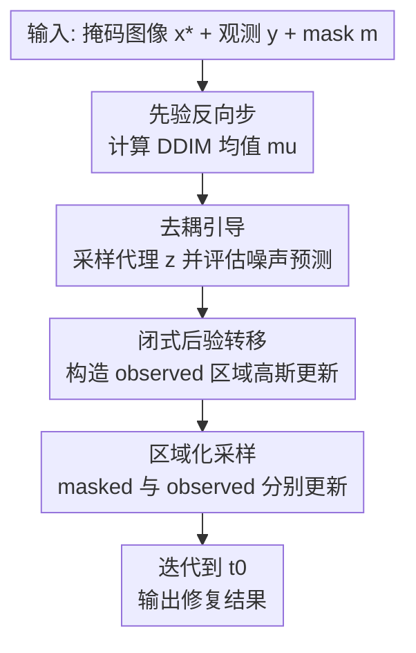

# Efficient Zero-shot Inpainting with Decoupled Diffusion Guidance

**会议**: ICLR 2026  
**OpenReview**: [https://openreview.net/forum?id=5F93RfQ12T](https://openreview.net/forum?id=5F93RfQ12T)  
**代码**: https://github.com/YazidJanati/ding （有）  
**领域**: image generation / diffusion inpainting  
**关键词**: 零样本修复, 扩散模型, 后验采样, 去耦引导, 低NFE推理  

## 一句话总结
这篇论文提出 DING（Decoupled INpainting Guidance），通过把似然引导中的去噪器输入与状态变量解耦，构造可精确采样的高斯后验转移，在不做任何任务微调的前提下实现了更快、更省显存且更高质量的零样本图像修复。

## 研究背景与动机
**领域现状**：扩散模型已经成为图像修复（inpainting）的主流方案，路线大体分两类。第一类是训练专门的条件扩散模型，把掩码、文本提示、参考像素作为条件输入；第二类是 zero-shot 后验采样，把预训练扩散模型当作先验，再用观测似然在推理时做引导。

**现有痛点**：zero-shot 路线的优势是不需要针对每个任务重训，但目前强方法普遍依赖 surrogate likelihood 的梯度引导。问题在于每个反向步都要对去噪器做反向传播或 VJP（vector-Jacobian product），导致显存和时间开销高，尤其在高分辨率 latent 修复里更明显。

**核心矛盾**：zero-shot 的训练成本低，却在推理阶段付出高昂梯度开销；而微调模型推理更便宜，但前置训练代价极高，且任务迁移不灵活。换句话说，社区缺一个“保留 zero-shot 灵活性，同时把推理复杂度压下去”的中间点。

**本文目标**：作者希望在 Bayesian posterior sampling 框架内，保持“观测一致性 + 感知质量”的双目标，同时彻底去掉每步 VJP，做到 low-NFE 场景下可落地部署。

**切入角度**：他们没有继续在 score 近似上做更复杂修补，而是回到 posterior reverse transition 本身，直接改造似然近似形式，让转移分布恢复到可解析、可直接采样的结构。

**核心 idea**：把标准引导里“用当前状态 $x_s$ 喂去噪器”的耦合关系，改成“用独立代理变量 $z_s$ 喂去噪器”，从而把难算的耦合后验转移改写成混合高斯并可两阶段精确采样，这就是 Decoupled Guidance 的本质。

## 方法详解

### 整体框架
DING 仍然在 DDIM 反向采样框架里工作，输入是带掩码的参考图像与文本条件，输出是满足观测区域一致性的修复图。与传统 zero-shot guidance 不同，它不再对去噪器输出做输入梯度回传，而是把去噪器的评估点替换为从先验反向转移中抽到的代理样本，进而得到可闭式采样的后验近似转移。

更具体地说，每个时间步先用预训练模型给出 DDIM 转移均值，再分别更新 masked / observed 区域：缺失区域按标准随机采样推进，观测区域用“DDIM 均值 + 观测约束 + 噪声项”的高斯闭式更新，从而保证既不跑偏语义，也不破坏上下文一致性。

### 关键设计
**1. 去耦似然近似：把高开销 VJP 问题改写成可采样混合分布**

传统方法通常使用 $\hat{\ell}_s^\theta(y|x_s)=\ell_0(y|\hat{x}_0^\theta(x_s,s))$，因为去噪器输入和当前状态绑定，后续更新要依赖对去噪网络输入求导。DING 把它改成 $\hat{\ell}_s^\theta(y|x_s,z_s)$，即固定当前状态 $x_s$，但让去噪器在独立代理点 $z_s$ 上评估噪声预测。这个“去耦”动作看似小，但直接切断了最贵的梯度链路。

这样做后，后验近似转移可以写成对 $z_s \sim p_{s|t}^\theta(\cdot|x_t)$ 的混合期望，采样流程是“先采 $z_s$，再按条件高斯采 $x_s$”。作者的核心贡献在于证明 inpainting 观测模型下第二步是闭式高斯，因此不需要任何近似反传技巧，也避免了数值不稳定的额外估计器。

**2. 观测区域闭式更新：显式控制保真与自由度的权衡**

在高斯观测假设下，DING 的 observed 区域更新可写成
$$
x_s[m] \leftarrow (1-\gamma)\mu[m] + \gamma(\alpha_s y + \sigma_s\hat{x}_1^\theta(z_s,s)[m]) + \alpha_s\sigma_y\sqrt{\gamma}\,\epsilon,
$$
其中 $\gamma=\frac{\eta_s^2}{\eta_s^2+\alpha_s^2\sigma_y^2}$。这个形式的意义很直接：$\mu$ 保留先验生成轨迹，$y$ 负责贴合观测，$\hat{x}_1^\theta$ 提供语义补全方向，噪声项保证采样多样性。

和 replacement 类方法相比，这不是简单把观测像素硬替换成 noisy observation，而是通过权重融合做“软一致性”约束。它在视觉上更容易兼顾边界连续性与全局纹理自然度，避免出现“观测区很准但修补区发僵”或“修补区自然但上下文漂移”的两极结果。

**3. 低NFE导向的噪声日程：用更快衰减的随机性服务实用推理**

作者默认采用 $\eta_t=\sigma_t(1-\alpha_t)$。这一选择背后有很强工程动机：在有限 NFE 下，前段保持足够随机性便于探索合理修复，后段更快收敛到观测一致解。消融显示接近确定性的小噪声策略会明显劣化，而默认策略在多掩码配置下给出更稳的 FID/pFID-一致性折中。

从部署角度看，这个设计把“理论上的后验采样”压成了“可调一个主超参的实用算法”：开发者只需处理步数、CFG、$\sigma_y$ 和该日程，不必再针对 VJP 相关的稳定性与显存峰值做大量特化。

### 一个完整示例
假设输入是一张人脸图（FFHQ），右半边被遮挡（Half mask），文本提示为“a high-quality photo of a face”。DING 的一次采样可直观看成以下过程：

1. 在高噪声时刻，模型先根据先验生成整体人脸布局候选，代理变量 $z_s$ 提供当前步语义线索。
2. 对未遮挡左半边，更新会强约束贴近观测像素；对遮挡右半边，沿 DDIM 轨迹补全五官与发丝纹理。
3. 随时间步下降，$\eta_t$ 衰减使采样从“探索多个可行补全”逐步转向“锁定与左半边身份一致的单一解”。
4. 最终输出在 cPSNR 上保持高观测一致性，同时 FID/pFID 维持较好自然度，避免硬拼接痕迹。

### 损失函数 / 训练策略
DING 本身是纯推理时引导，不新增训练损失，也不要求微调。其训练相关依赖完全来自底座扩散模型（论文主实验是 Stable Diffusion 3.5 medium）。

实现层面有三点值得记：

1. 算法在 latent space 运行，需要把像素掩码下采样到潜空间网格后再广播到通道维。
2. 每个 diffusion step 需要两次去噪网络前向（一次主状态、一次代理点），因此 50 NFE 对应 25 个反向步。
3. 文中多数实验取 $\sigma_y=0.01$，强调严格观测一致性场景。

## 实验关键数据

### 主实验
论文在 FFHQ、DIV2K、PIE-Bench 上与 10 个 zero-shot 基线比较（统一 50 NFE），并报告 FID、pFID、cPSNR、LPIPS 以及 PIE-Bench 的 CLIP 指标。下面摘录最有代表性的结果（数值来自原文表格）。

| 数据集/设置 | 方法 | FID | pFID | cPSNR | LPIPS | 结论 |
|---|---:|---:|---:|---:|---:|---|
| FFHQ 768 Half | DING | 9.6 | 6.6 | 31.03 | 0.33 | FID/pFID 最优，保真与自然度兼顾 |
| FFHQ 768 Half | FLOWCHEF | 20.2 | 16.5 | 30.41 | 0.36 | 明显落后于 DING |
| DIV2K 768 Half | DING | 39.2 | 13.0 | 25.90 | 0.35 | FID/LPIPS 更优，cPSNR 具竞争力 |
| DIV2K 768 Half | DIFFPIR | 41.1 | 12.9 | 26.09 | 0.37 | pFID 接近，但整体质量略弱 |
| PIE-Bench | DING | 61.4 | 24.7 | 27.03 | 0.30 | 多指标最优，编辑一致性强 |
| PIE-Bench | DDNM | 61.4 | 26.9 | 27.29 | 0.31 | cPSNR 略高，但感知质量逊于 DING |

论文还给出与 SD3 inpainting 微调模型的同预算比较：在 2.2s 预算下，DING（56 NFE）在 PIE-Bench 上达到 FID 63.6 / pFID 24.6 / cPSNR 26.98 / LPIPS 0.30，优于 SD3 Inpaint（28 NFE）的 68.7 / 30.5 / 18.85 / 0.34。

### 消融实验
作者重点做了两类消融：是否必须“双前向（每步 2 NFE）”与不同 $\eta_t$ 日程。代表结果如下。

| 消融项 | 设置 | FFHQ Half (FID/pFID/cPSNR/LPIPS) | 观察 |
|---|---|---|---|
| 双前向必要性 | Delayed DING | 7.4 / 9.1 / 29.21 / 0.33 | FID 有时不差，但 cPSNR 持续下降 |
| 双前向必要性 | DING | 6.6 / 9.6 / 31.03 / 0.33 | 综合更稳，尤其观测一致性更好 |
| DDIM 日程 | (B) 近确定性缩放 | 21.5 / 18.7 / 26.06 / 0.41 | 全面退化，随机性不足 |
| DDIM 日程 | (D) $\sigma_t\sqrt{1-\alpha_t}$ | 10.2 / 10.7 / 31.33 / 0.33 | 强基线，但仍弱于默认 |
| DDIM 日程 | Default $\sigma_t(1-\alpha_t)$ | 9.6 / 6.6 / 31.03 / 0.33 | 综合最优折中 |

### 关键发现
- 去耦引导不是只换了一个公式，而是把 zero-shot inpainting 的主要瓶颈从“梯度反传”变成“前向采样”，因此吞吐和显存都更友好。
- 在 H100 报告中，DING 平均约 2.9s、22.09GB，与需 VJP 的方法相比在速度和显存上都占优，且效果没有牺牲。
- 低 NFE 场景下，足够的早期随机性非常关键；过早趋于确定性会显著破坏感知质量与一致性。

## 亮点与洞察
- 这篇工作的真正亮点是“结构性降复杂度”而非“堆更多技巧”。它把一个原本需要高阶自动微分支持的问题，转换为可解析的采样问题，工程可实现性大幅提升。
- DING 在“无需微调”条件下超过了专用 inpainting 微调模型，说明很多编辑任务里，推理时正确建模后验约束可能比额外监督数据更关键。
- 论文把 latent-space mask 构造写得非常实用：先按编码器下采样比率做平均池化，再阈值化成二值 latent mask。这一点对复现实验很关键，避免了“像素掩码和潜变量掩码不对齐”带来的性能波动。
- 从方法论看，DING 提供了一个可迁移思路：当引导项导致梯度依赖爆炸时，优先考虑是否能通过引入代理变量把耦合项拆开，再用混合分布采样替代梯度计算。

## 局限与展望
- 作者明确指出，随着计算预算继续增加，性能并不会单调提升，存在收益递减。这说明当前日程与引导机制在长链采样下仍有改进空间。
- 目前方法主要针对 inpainting，因为这类观测算子在 latent 空间相对容易构造。若要扩展到更一般逆问题（例如复杂退化核、非线性成像），还需要重新设计可解析后验转移。
- 每步双前向虽然已远优于 VJP，但仍比单前向方法重，移动端或超低延迟交互应用可能还需进一步蒸馏或步数自适应。
- 文中对“何时选择更强随机性 vs 更强一致性”的自动调度还较经验化，后续可以探索基于观测残差或不确定性估计的自适应 $\eta_t$。

## 相关工作与启发
- **vs RePaint / replacement 系列**：这类方法在观测区常做替换式更新，简单有效，但容易在自然度与保真之间出现拉扯。DING 通过闭式融合更新获得更平滑的折中，尤其在边界连续性上更稳。
- **vs DPS / REDDIFF / PSLD 等梯度引导**：这些方法依赖显式梯度或相关近似，理论上灵活，但推理成本高。DING 的优势在于去掉反向传播路径，把复杂度集中到可并行前向上。
- **vs PNP-FLOW**：二者都强调训练自由（training-free）和推理阶段控制，但 DING 在本文设置下给出了更好的多指标均衡，特别是在 low-NFE 预算与观测一致性上。
- **对后续工作的启发**：去耦思想可尝试迁移到文本引导编辑、视频局部编辑，甚至跨模态条件生成。关键在于识别“必须梯度耦合”的部分是否可被代理变量替代并保持后验近似质量。

## 评分
- 新颖性: ⭐⭐⭐⭐☆ 去耦似然近似与闭式后验采样结合得很漂亮，兼具理论和工程价值。  
- 实验充分度: ⭐⭐⭐⭐⭐ 三个数据集、多个掩码、十个以上基线、速度显存与消融都较完整。  
- 写作质量: ⭐⭐⭐⭐☆ 方法推导清晰，实验组织扎实；部分符号对非扩散读者门槛较高。  
- 价值: ⭐⭐⭐⭐⭐ 对 zero-shot inpainting 的实用落地意义很强，尤其适合低预算高质量编辑场景。

<!-- RELATED:START -->

## 相关论文

- [\[ICML 2025\] Zero-Shot Adaptation of Parameter-Efficient Fine-Tuning in Diffusion Models](../../ICML2025/image_generation/zero-shot_adaptation_of_parameter-efficient_fine-tuning_in_diffusion_models.md)
- [\[ICML 2026\] Stage-wise Distortion-Perception Traversal in Zero-shot Inverse Problems with Diffusion Models](../../ICML2026/image_generation/stage-wise_distortion-perception_traversal_in_zero-shot_inverse_problems_with_di.md)
- [\[CVPR 2026\] LaRP: Efficient Multi-View Inpainting with Latent Reprojection Priors](../../CVPR2026/image_generation/larp_efficient_multi-view_inpainting_with_latent_reprojection_priors.md)
- [\[ICLR 2026\] Improving Classifier-Free Guidance in Masked Diffusion: Low-Dim Theoretical Insights with High-Dim Impact](improving_classifier-free_guidance_in_masked_diffusion_low-dim_theoretical_insig.md)
- [\[ICLR 2026\] Guidance Watermarking for Diffusion Models](guidance_watermarking_for_diffusion_models.md)

<!-- RELATED:END -->
