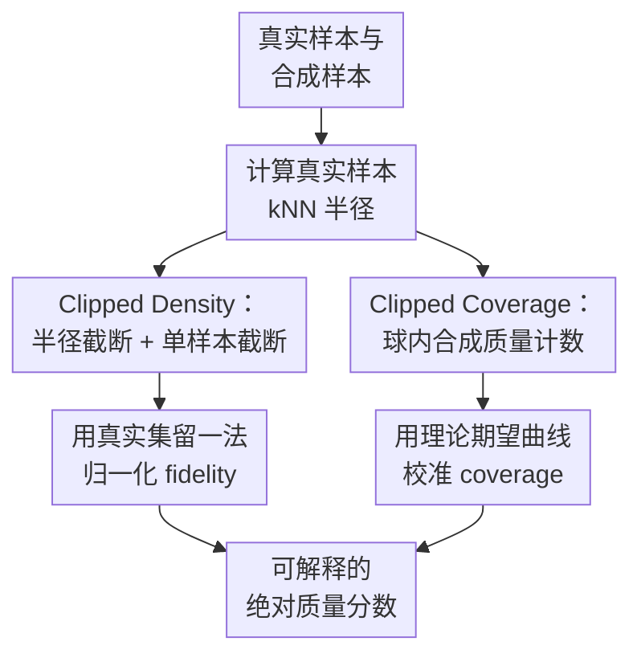

# Enhanced Generative Model Evaluation with Clipped Density and Coverage

**会议**: ICLR2026  
**OpenReview**: [https://openreview.net/forum?id=cwOSdyuNh6](https://openreview.net/forum?id=cwOSdyuNh6)  
**代码**: https://github.com/nicolassalvy/ClippedDensityCoverage  
**领域**: 生成模型评估 / 图像生成  
**关键词**: 生成模型评估、保真度、覆盖度、离群点鲁棒性、绝对可解释指标

## 一句话总结
本文提出 Clipped Density 和 Clipped Coverage 两个生成模型评估指标，通过截断单样本贡献、限制异常近邻球半径并做线性校准，让 fidelity 与 coverage 分数既抗离群点干扰，又能解释为“等价好样本比例”。

## 研究背景与动机
**领域现状**：生成模型已经在图像、医学影像、音乐等场景中快速进步，但模型质量评估仍经常依赖 FID、FD-DINOv2 这类单一综合分数。综合分数适合排序，却很难告诉研究者问题究竟来自样本不真实，还是来自模式覆盖不足。因此近几年更常见的思路是把质量拆成两个维度：fidelity 衡量合成样本像不像真实数据，coverage 衡量合成样本是否覆盖真实数据分布。

**现有痛点**：已有 Precision/Recall、Density/Coverage 以及它们的一系列变体，通常都要在特征空间里用 $k$ 近邻球近似未知分布的支撑集或局部密度。这个近似很脆弱：真实数据中的异常样本会因为距离邻居很远而形成巨大半径球，进而把很多合成样本错误地判为高保真；合成数据中的坏样本也可能撑大合成支撑集，让 coverage 类指标误以为真实数据被覆盖了。另一方面，Density 可能大于 1，Coverage 又只看有没有一个合成样本落进球里，二者的绝对值都不容易解释。

**核心矛盾**：生成模型评估需要同时满足“对坏样本敏感”和“对离群点鲁棒”。普通近邻球指标正好卡在这里：如果球太大，少数离群点会支配全局分数；如果只做二值覆盖判断，又会忽略密度不匹配。更麻烦的是，一个模型即便在排行榜上最好，也可能绝对质量很差；没有校准过的指标很难回答“这个分数到底够不够好”。

**本文目标**：作者希望构造一对新的 fidelity/coverage 指标，使它们满足三个具体要求。第一，离群真实样本或坏合成样本不能显著扭曲平均分。第二，如果合成集中有比例 $x$ 的坏样本，分数应该按 $1-x$ 线性下降。第三，最终分数应该被归一化到 $[0,1]$，使分数 $0.4$ 可以自然读作“等价于 40% 好样本、60% 坏样本”的质量水平。

**切入角度**：作者没有完全抛弃 Density/Coverage 的近邻球框架，而是分析它们出错的具体位置：错误不是来自“用近邻球”这一思想本身，而是来自单个样本或单个球能贡献过大的分数。于是本文从截断贡献、截断半径、再校准绝对分数三个局部改造入手，把原本偏相对比较的指标改成更可解释的绝对评估工具。

**核心 idea**：用“每个样本最多贡献 1 分 + 对异常近邻球做半径截断 + 对最终曲线做线性校准”来替代原始 Density/Coverage 的无界或未校准聚合。

## 方法详解

### 整体框架
本文仍然从两组样本出发：真实样本集 $\{x_i^r\}_{i=1}^N$ 和合成样本集 $\{x_j^s\}_{j=1}^M$，在特征空间中用真实样本的 $k$ 近邻球刻画局部邻域。区别在于，Clipped Density 负责评估每个合成样本落在真实分布附近的程度，Clipped Coverage 负责评估每个真实样本周围是否被足够多合成样本覆盖；两者都会把单点贡献截断到 1，并把分数校准成可解释的比例。

从计算流程看，两项指标都先围绕真实样本建立 $k$ 近邻球。Clipped Density 会进一步把真实球半径压到一个稳健上限，然后看每个合成样本落入多少个“被截断后的真实球”；Clipped Coverage 则保留真实球的固定质量含义，统计每个真实球中有多少合成样本，并对覆盖贡献截断。最后，Clipped Density 用真实数据自评得分做经验归一化，Clipped Coverage 用解析期望曲线反变换成线性分数。

### 关键设计
**1. Clipped Density：让高密度合成点不能掩盖坏样本**

原始 Density 会对每个合成样本统计它落入多少个真实 $k$ 近邻球，并除以 $k$ 后再平均。这样做比二值 Precision 细致，但有一个明显漏洞：如果某些合成样本集中落在真实高密度区域，它们的单样本分数可能超过 1；这些“过度出现”的高分样本会在平均时抵消远离真实分布的坏样本。论文用一个二维例子说明，三个合成点里一个是坏样本，另外两个各自得 $3/2$，原始 Density 的平均分仍可达到 1，看起来像完美模型。

Clipped Density 的第一刀就是把每个合成样本的 fidelity 贡献截断到 1。若合成样本 $x_j^s$ 落入若干真实球，原始局部分数可写成 $\frac{1}{k}\sum_i \mathbf{1}_{x_j^s \in B(x_i^r, \mathrm{NND}_k^r(x_i^r))}$；本文改成先对这个局部分数取 $\min(\cdot,1)$，再对合成样本求平均。这样一个特别“像真”的样本最多说明自己是好样本，不能替其他坏样本赎分。

第二刀针对真实离群点造成的巨大球。作者把每个真实样本的 $k$ 近邻半径 $\mathrm{NND}_k^r(x_i^r)$ 截断到全体真实 $k$ 近邻半径的中位数：$R_k(x_i^r)=\min(\mathrm{NND}_k^r(x_i^r),\mathrm{median}(\{\mathrm{NND}_k^r(x_l^r)\}_{l=1}^N))$。这一步特别关键，因为高维球体体积随半径按 $r^d$ 放大，一个异常真实点的球可能覆盖大量无关合成点。用中位数半径作为稳健上限后，离群真实点不再能以超大体积支配全局 fidelity。

**2. Clipped Density 归一化：把无界密度分数变成可读比例**

即使做了单样本截断，Clipped Density 的未归一化平均值仍取决于数据集、特征空间和 $k$ 的选择。作者没有直接假设理想值必然等于 1，而是用真实数据本身做一个 leave-one-out 标定：把每个真实样本当成待评估样本，统计它被其他真实样本的截断真实球覆盖的程度，由此得到 $\mathrm{ClippedDensity}_{real}$。

最终 fidelity 分数定义为 $\mathrm{ClippedDensity}=\min(\mathrm{ClippedDensity}_{unnorm}/\mathrm{ClippedDensity}_{real},1)$。这个归一化有两个好处：一是把“真实数据评估真实数据”的水平设为参照上界，减少数据集尺度和 $k$ 对绝对值的影响；二是继续保留线性坏样本解释，因为未归一化分数本身是对合成样本逐点平均，比例 $x$ 的坏样本会近似直接拉低 $x$ 的得分。

**3. Clipped Coverage：从二值覆盖改成固定质量的覆盖程度**

原始 Coverage 只问“真实样本的球里是否至少有一个合成样本”，这会把覆盖问题退化成二值支撑集判断。一个真实球里有 1 个合成样本和有 $k$ 个合成样本，在 Coverage 看来都一样；高密度区域是否被按真实密度充分填充，反而不容易反映出来。本文改成对每个真实球统计其中合成样本数量，并与真实球中自然包含的 $k$ 个真实邻居质量比较。

具体地，未校准 Clipped Coverage 写作 $\mathrm{ClippedCoverage}_{unnorm}=\frac{1}{N}\sum_i \min(\frac{1}{k}\sum_j \mathbf{1}_{x_j^s\in B(x_i^r,\mathrm{NND}_k^r(x_i^r))},1)$。这里保留原始真实 $k$ 近邻半径而不做半径截断，是因为 coverage 视角下每个真实球本来就代表固定真实质量 $k$，作者希望比较的是合成数据在这个固定质量邻域里的填充程度。对每个真实球的贡献截断到 1，则防止少数被大量合成样本填满的区域掩盖未覆盖区域。

**4. Clipped Coverage 校准：用理论期望反推线性坏样本比例**

Clipped Coverage 的难点在于，未归一化分数不是天然线性的。即使真实分布和合成分布完全一致，因为有限样本随机性，某些真实球里可能少于 $k$ 个合成样本，某些可能多于 $k$ 个；经过 $\min(\cdot,1)$ 后，期望曲线会弯曲。作者为此推导了一个有限样本下的期望值：当真实样本和合成样本来自同一分布时，$\mathrm{ClippedCoverage}_{unnorm}$ 的期望可以写成关于 beta 函数的组合式。

校准思路可以理解为先问一个反事实问题：如果合成集中只有 $m=\lfloor M(1-x)\rfloor$ 个好样本，其余都是完全落在真实球外的坏样本，未归一化 coverage 期望应该是多少？作者记这个曲线为 $f_{expected}(x)$。最终再数值构造一个反函数式校准 $g$，使 $g(f_{expected}(x))=1-x$。这样得到的 $\mathrm{ClippedCoverage}=g(\mathrm{ClippedCoverage}_{unnorm})$ 不只是一个相对覆盖分数，而是能按坏样本比例线性解释的 coverage 分数。

### 损失函数 / 训练策略
这篇论文不是训练一个新的生成模型，因此没有常规意义上的损失函数或训练策略。它的“优化目标”是指标设计目标：鲁棒性、线性退化和 $[0,1]$ 归一化。实验实现上，作者默认使用 $k=5$，图像评估时采用 DINOv2 ViT-L/14 的 embedding 作为特征空间，并用最近邻搜索和球半径查询实现各类指标。附录还说明了实现复杂度：相比需要存储成对距离矩阵的实现，基于 scikit-learn NearestNeighbors 的实现把内存压力从 $O(N^2)$ 降到更接近 $O(Nd)$，这对 50,000 张图像、1024 维 DINOv2 特征的评估很重要。

## 实验关键数据

### 主实验
论文的主实验分两层。第一层是“指标 sanity test”：通过可控地引入坏样本、模式丢失、离群点和分布平移，检查分数是否按预期变化。第二层是在 CIFAR-10、ImageNet、LSUN Bedroom、FFHQ 上评估真实生成模型，观察新指标是否给出稳定且可解释的 fidelity/coverage 图景。

| 测试场景 | 目标行为 | 表现稳定的 fidelity 指标 | 表现稳定的 coverage 指标 | 结论 |
|----------|----------|--------------------------|----------------------------|------|
| CIFAR-10 逐步加入坏合成样本 | 分数随坏样本比例线性下降 | Clipped Density 等多数平均型 fidelity 指标 | 只有 Clipped Coverage 明显线性 | coverage 校准是必要的 |
| CIFAR-10 同步模式丢失 | fidelity 不应误测 coverage | Clipped Density 通过 | 不适用 | symPrecision、Precision Cover 会混入 coverage 信号 |
| 真实与合成同时加入等比例离群样本 | 分数应接近最大值 | Clipped Density 通过 | Clipped Coverage 通过 | 新指标对匹配的离群成分更鲁棒 |
| 高斯平移并含真实/合成离群点 | 分数应对称且对偏移敏感 | Clipped Density 通过 | Clipped Coverage 通过 | 原始 Precision/Recall 受大球或坏样本影响变得不对称 |

在真实生成模型评估中，作者展示了 fidelity-coverage 平面。一个最直观的发现是：原始 Density 在 CIFAR-10 和 ImageNet 上常常超过 1，而 Clipped Density 保持在可解释范围内。作者还指出，CIFAR-10 和 FFHQ 上最佳模型的 Clipped Density / Clipped Coverage 大约只有 $0.4$ 左右，这意味着即便这些模型在相对比较中已经很强，按本文校准后的绝对解释仍只相当于约 40% 好样本的质量水平。

| 数据集 / 场景 | 代表结果 | Clipped Density / Coverage 给出的解释 | 备注 |
|---------------|----------|-----------------------------------------|------|
| CIFAR-10 / FFHQ | 最好模型最高约 $0.4$ | 约等价于 40% 好样本、60% 坏样本 | 暴露相对排行榜之外的绝对质量缺口 |
| ImageNet | 最高可到 $1.0$ 附近 | 强模型在大规模数据上覆盖与保真更接近真实集 | 指导采样的 DiT-XL-2 fidelity 可超过未截断上界 |
| LSUN Bedroom | 最高约 $0.7$ | 比 CIFAR-10/FFHQ 更接近真实分布 | 可能与训练数据规模更大有关 |
| Chest X-Ray 生成 | Clipped Density $0.06$，Clipped Coverage $0.03$ | 等价于只有 6% / 3% 好样本 | 高风险医学场景中绝对可解释性尤其重要 |

### 消融实验
论文的关键消融集中在“从 Density 到 Clipped Density”的逐步改造。作者用真实生成数据展示：原始 Density 的高分有时主要来自真实离群点造成的大半径球；一旦做半径截断和单样本截断，许多看似高 fidelity 的模型会显著降分。

| 配置 | 关键指标 | 说明 |
|------|----------|------|
| 原始 Density | CIFAR-10 RESFLOW 为 $2.47$，ACGAN-Mod 为 $2.28$ | 分数大于 1，且可被少数真实离群点严重抬高 |
| 仅截断真实球半径 | RESFLOW 在 CIFAR-10 上降到 $0.00$ | 说明原始高分主要来自异常大球，而非真实高保真 |
| 再截断单样本贡献 | 得到 $\mathrm{ClippedDensity}_{unnorm}$ | 高密度重复样本不能继续掩盖坏样本 |
| 完整归一化 Clipped Density | CIFAR-10 PFGMPP $0.39$，LSGM-ODE $0.38$ | 分数进入可解释区间，便于跨模型比较 |

作者还分析了一个具体案例：RESFLOW 生成的 CIFAR-10 数据原始 Density 为 $2.47$。在真实数据中，有 4 个真实样本的 5-neighbor 球各自包含超过 10,000 个合成点，这些真实样本看起来像灰色船、伪装猫、两条腿的马、玩具船等异常图像。半径截断后，这种异常球不再主导分数，Clipped Density 降为接近 0。

### 关键发现
- Clipped Density 和 Clipped Coverage 是论文测试集合里唯一在所有主要行为检查中都符合预期的一对指标。它们既不会把 mode dropping 错当成 fidelity 下降，也能在加入坏样本时保持线性退化。
- 原始 Density 大于 1 不是小问题，而是会改变模型判断的严重信号。CIFAR-10 上 RESFLOW、ACGAN-Mod、WGAN-GP、NVAE 等模型的原始 Density 被离群点或过度出现样本显著抬高，截断后评价完全不同。
- Clipped Coverage 的理论校准是本文区别于简单 heuristic 的关键。未校准分数随坏样本比例下降不是直线，经过 beta-binomial 期望曲线校正后才获得“分数 = 等价好样本比例”的解释。
- 与人类评估的相关性较好。附录中，除 FFHQ 外，Clipped Density 和 Clipped Coverage 与 Stein et al. 共享的人类错误率相关系数多数超过 $0.8$，说明新指标并非只在合成 sanity test 上好看。
- 指标还在音乐、时间序列、稀有模式缺失、错误相关结构等场景上做了扩展测试，显示它不是单纯为 CIFAR-10 调参出来的图像专用指标。

## 亮点与洞察
- 这篇论文最强的地方不是提出一个复杂新模型，而是把“指标为什么不可信”拆到了单样本贡献和近邻球半径这两个具体故障点。很多指标论文容易停在经验比较，本文则能解释为什么一个坏样本会被两个高分样本掩盖、为什么一个离群真实点会撑爆 Density。
- Clipped Coverage 的校准设计很漂亮。coverage 类指标经过截断后天然会产生有限样本偏差，作者没有靠经验拟合，而是推导同分布采样下球内合成样本数的 beta-binomial 期望，再做数值反变换。这让“绝对可解释”不只是口号。
- “分数 $x$ 等价于比例 $x$ 的好样本”是非常实用的解释方式。它不声称模型真的生成了二元好/坏混合，而是给用户一个可比较的参照系，尤其适合医学影像这类不能只看相对排名的场景。
- 这套思路可以迁移到其他评估问题。凡是指标由局部样本贡献聚合而成，都可以检查是否存在“单点贡献过大”“异常邻域半径过大”“绝对值未校准”三类问题，比如表征学习的覆盖评估、合成表格数据审计、检索系统的长尾覆盖分析。

## 局限与展望
- 指标仍然依赖特征空间。图像实验使用 DINOv2 embedding，但不同 embedding 模型会改变近邻结构；医学、音乐、时间序列场景也需要可靠的领域特征提取器。若 embedding 本身忽略某类伪影，Clipped Density/Coverage 也可能看不见。
- 论文没有给出无限样本极限下的完整理论分析。当前校准主要面向有限样本行为，且 Clipped Coverage 的推导基于坏样本完全落在真实球外这一理想化设定。
- fidelity 和 coverage 不是生成模型质量的全部。作者也承认它们没有覆盖记忆化、训练样本泄露、真实性认证等问题；一个模型可能有不错的 Clipped Density/Coverage，但仍可能复制训练数据。
- 计算成本仍不可忽视。论文完整复现实验估计需要约 120 小时，整个项目探索约 200-300 小时；虽然实现降低了内存需求，但对 50,000 样本级别的高维特征评估仍然不是轻量操作。
- 绝对分数的阈值还需要应用场景定义。分数 $0.4$ 可以解释为等价 40% 好样本，但“0.4 是否可接受”取决于下游风险、数据类型和用户需求，论文没有给出通用安全阈值。

## 相关工作与启发
- **vs FID / FD-DINOv2**: FID 类指标给出整体分布距离，适合粗略排名，但混合了 realism 和 diversity。本文把质量拆成 fidelity 与 coverage 两个维度，并让每个维度的绝对值可解释。
- **vs improved Precision / Recall**: Precision/Recall 用近邻球近似支撑集，直观但容易被离群点撑大的球干扰。本文继承近邻球框架，却通过半径截断和单点贡献截断解决最明显的鲁棒性问题。
- **vs Density / Coverage**: Density/Coverage 已经比二值支撑集更细，但 Density 无界、Coverage 对密度不足不敏感。Clipped Density/Coverage 可以看作对它们的“稳健化 + 归一化 + 线性校准”版本。
- **vs symPrecision / symRecall、P-precision / P-recall、Precision Recall Cover**: 这些方法分别尝试双向视角、概率子支撑或多样本覆盖门槛，但实验中仍会出现混淆 fidelity/coverage、对离群点不稳或线性解释不足。本文的优势是把目标行为写成明确 desiderata，并逐项验证。
- **启发**: 评价指标设计应先定义“理想受控情形下分数应该怎么变”，再反推公式，而不是只看模型排行榜排序是否合理。这个原则对生成模型之外的 benchmark 设计也很有价值。

## 评分
- 新颖性: ⭐⭐⭐⭐☆ 从 Density/Coverage 出发的改造并不复杂，但“截断贡献 + 半径截断 + 理论校准”的组合很精准，解决了指标绝对解释的核心痛点。
- 实验充分度: ⭐⭐⭐⭐⭐ 覆盖合成 sanity test、真实图像生成模型、人类评估相关性、医学影像、音乐、时间序列和多种失败模式，实验面很扎实。
- 写作质量: ⭐⭐⭐⭐☆ 主线清楚，公式和失败案例对应得好；附录很丰富，但指标推导和大量图表对非评估方向读者稍有门槛。
- 价值: ⭐⭐⭐⭐⭐ 对生成模型评估尤其是高风险应用很有价值，因为它把“哪个模型更好”推进到“这个绝对质量到底够不够好”。

<!-- RELATED:START -->

## 相关论文

- [\[ICML 2026\] DiScoFormer: Plug-In Density and Score Estimation with Transformers](../../ICML2026/image_generation/discoformer_plug-in_density_and_score_estimation_with_transformers.md)
- [\[ICLR 2026\] Verification of the Implicit World Model in a Generative Model via Adversarial Sequences](verification_of_the_implicit_world_model_in_a_generative_model_via_adversarial_s.md)
- [\[ICLR 2026\] Continuously Augmented Discrete Diffusion model for Categorical Generative Modeling](continuously_augmented_discrete_diffusion_model_for_categorical_generative_model.md)
- [\[AAAI 2026\] GEWDiff: Geometric Enhanced Wavelet-based Diffusion Model for Hyperspectral Image Super-resolution](../../AAAI2026/image_generation/gewdiff_geometric_enhanced_wavelet-based_diffusion_model_for_hyperspectral_image.md)
- [\[ICLR 2026\] GGBall: Graph Generative Model on Poincaré Ball](ggball_graph_generative_model_on_poincaré_ball.md)

<!-- RELATED:END -->
