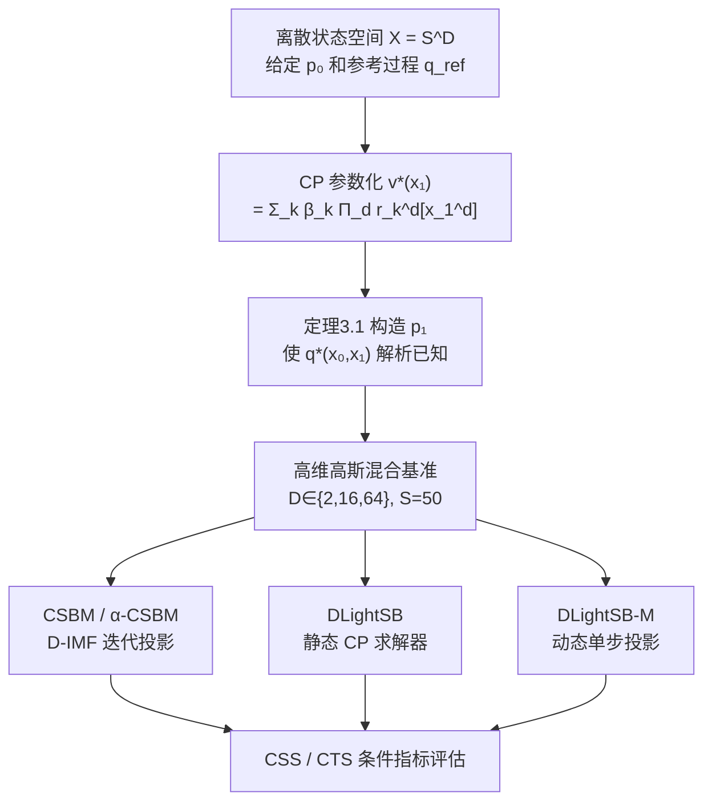

# Entering the Era of Discrete Diffusion Models: A Benchmark for Schrödinger Bridges and Entropic Optimal Transport

**会议**: ICLR 2026  
**代码**: [gregkseno/catsbench](https://github.com/gregkseno/catsbench)  
**领域**: 离散扩散 / 最优传输  
**关键词**: 离散薛定谔桥, 熵正则最优传输, 离散扩散模型, 基准测试, CP 张量分解

## 一句话总结

首个离散空间薛定谔桥（SB）/熵正则最优传输（EOT）评估基准：利用 CP 分解构造解析已知最优解的分布对，并同步提出 DLightSB、DLightSB-M 和 α-CSBM 三个新算法。

## 研究背景与动机

**领域现状**：离散扩散/流模型（D3PM、DiGress、Discrete Flow Matching 等）近年迅速发展，驱动文本生成、分子图、蛋白质序列及 VQ 图像表示等下游任务取得重要进展。连接生成建模与最优传输理论的薛定谔桥（SB）/EOT 框架已在连续空间建立了成熟的评估体系，但离散空间版本完全空白。

**现有痛点**：现有离散 SB 方法（DDSBM、CSBM 等）只能依赖 FID、MSE 等代理指标评估——这些指标受模型参数化、正则化等实现细节强烈干扰，无法直接反映方法是否真正求解了底层的 EOT/SB 问题，导致不同方法之间的性能差距难以归因。

**核心矛盾**：离散空间状态数为 $S^D$，高维下构造具有已知最优解的分布对极难处理（tractability），以往做法无法绕过穷举全状态空间的瓶颈。

**本文目标**：建立首个离散空间 SB/EOT 基准，提供具有解析已知最优条件分布 $q^*(x_1|x_0)$ 的分布对，实现对求解器的直接定量评估。

**核心 idea**：利用 CANDECOMP/PARAFAC（CP）张量分解将最优评分函数 $v^*(x_1)$ 参数化为低秩结构 $v^*(x_1) = \sum_k \beta_k \prod_d r_k^d[x_1^d]$，绕开对全状态空间的枚举，使基准构造和求解器训练都变为可行的随机优化问题。

## 方法详解

### 整体框架

论文贡献分为两层：**基准构造**（给定 $p_0$，通过 CP 参数化构造 $p_1$ 及已知最优解 $q^*$）和**求解器**（CSBM、α-CSBM、DLightSB、DLightSB-M 四类方法在基准上的评测）。两层通过同一套 CP 参数化紧密绑定——DLightSB 直接从基准构造中"顺手"得到，是对 oracle 方法的良好近似。

### 关键设计

**1. 基准构造定理（主定理）：从 CP 分解到已知最优解**

离散动态 SB 问题在给定参考过程 $q_\text{ref}$ 下的最优过程满足：

$$q^*(x_0, x_1) \propto p_0(x_0) \cdot q_\text{ref}^{N+1}(x_1|x_0) \cdot v^*(x_1)$$

其中 $v^*$ 是一个在 $p_1$ 上的"评分函数"。关键洞见是：**如果先选定 $v^*$，再从中反推 $p_1$，则 $q^*$ 是解析已知的**。问题归结为如何使 $p_1(x_1) = \sum_{x_0} p_0(x_0) q_\text{ref}^{N+1}(x_1|x_0) v^*(x_1)$ 的归一化常数可计算。CP 分解将 $v^*$ 表示为 $K$ 个秩-1 项之和，每个维度独立，令归一化常数从 $O(S^D)$ 降至 $O(K \cdot D \cdot S)$——高维下（$D=64, S=50$）从 $50^{64} \approx 10^{108}$ 降至数百次运算，使基准构造首次实际可行。

**2. DLightSB：从基准参数化直接导出的静态求解器**

DLightSB 将学习的条件分布 $q_\theta(x_1|x_0)$ 用与基准相同的 CP 结构参数化，然后最小化 $\text{KL}(q^* \| q_\theta)$。命题 4.1 给出一个无需知道 $q^*$ 本身的可行目标：

$$\mathcal{L}(\theta) = \mathbb{E}_{p_0}[\log c_\theta(x_0)] - \mathbb{E}_{p_1}[\log v_\theta(x_1)]$$

其中 $c_\theta(x_0)$ 是利用参考过程转移矩阵与 CP 核向量的矩阵乘积得到的归一化常数（$O(K \cdot D \cdot S)$ 计算）。训练仅需从 $p_0, p_1$ 采样，无需配对数据，整个目标可用 SGD 优化。由于 DLightSB 与基准共享归纳偏置，它在自己构造的基准上表现接近 oracle，这是一个需要用"反向基准"（Appendix D.1）来校正的潜在偏差。

**3. DLightSB-M：动态扩展与单步最优投影**

DLightSB-M 将静态求解器扩展到动态路径空间。命题 4.2 表明：将任意互反过程（reciprocal process）$r \in \mathcal{R}_\text{ref}$ 直接投影到所有 SB 的集合 $\mathcal{S}$ 上，得到的就是 $p_0, p_1$ 之间的 SB $q^*$（将 Gushchin et al.2024a 的结论从高斯参考过程推广到任意马尔可夫参考过程）。利用 CP 参数化的闭式转移分布：

$$q^*(x_{t_n}|x_{t_{n-1}}) \propto q_\text{ref}(x_{t_n}|x_{t_{n-1}}) \sum_k \beta_k \prod_d u_{k,t_n}^d[x_{t_n}^d]$$

其中 $u_{k,t_n}^d[x] = \sum_{x_1} q_\text{ref}^{N+1-n}(x_1|x) r_k^d[x_1]$，通过反向矩阵幂迭代预计算（$O(N \cdot K \cdot D \cdot S^2)$），从而将整条最优路径用有限矩阵运算表达，支持祖先采样。

**4. α-CSBM：在线更新策略降低 CSBM 计算开销**

CSBM（Ksenofontov & Korotin, 2025）通过离散时间迭代马尔可夫拟合（D-IMF）求解 SB：交替在互反集合 $\mathcal{R}_\text{ref}$ 和马尔可夫集合 $\mathcal{M}$ 之间投影，但每轮需要完整训练两个方向的神经网络直至收敛，计算代价翻倍。α-CSBM 借鉴连续空间的 α-IMF（De Bortoli et al., 2024），将精确投影替换为单步在线更新——双向模型使用联合目标同步优化：

$$\mathcal{L}(\theta) = \frac{1}{2}\left[\text{KL}(\overrightarrow{r}_\text{sg} \| \overleftarrow{q}_\theta) + \text{KL}(\overleftarrow{r}_\text{sg} \| \overrightarrow{q}_\theta)\right]$$

其中 $r_\text{sg} = \text{proj}_{\mathcal{R}_\text{ref}}(q_\theta)$ 施加 stop-gradient，避免双向梯度干扰。实验证实 α-CSBM 在约半倍计算量下达到与 CSBM 相当的质量，是更高效的实用替代方案。

## 实验关键数据

### 主实验

高维高斯混合基准（$D \in \{2, 16, 64\}$，$S=50$，$K=4$ 个混合分量，高斯参考过程 $\gamma=0.02$）。评估指标：Conditional Shape Score（CSS，↑）和 Conditional Trend Score（CTS，↑），值域 $[0,1]$。

| 方法 | D=2 CSS | D=16 CSS | D=64 CSS | D=2 CTS | D=16 CTS | D=64 CTS |
|------|---------|----------|----------|---------|----------|----------|
| DLightSB | **0.95** | **0.93** | **0.93** | **0.91** | **0.85** | **0.85** |
| DLightSB-M (KL) | 0.86 | 0.92 | 0.85 | 0.84 | 0.59 | 0.73 |
| CSBM (KL) | 0.72 | 0.87 | 0.88 | 0.59 | 0.69 | 0.84 |
| α-CSBM (KL) | 0.66 | 0.89 | 0.90 | 0.64 | 0.72 | 0.79 |
| Reference (baseline) | 低 | 低 | 低 | 低 | 低 | 低 |

### 消融实验

| 配置 | 指标趋势 | 说明 |
|------|----------|------|
| KL 损失 vs MSE 损失 | KL 优于 MSE | MSE 最小化逐点误差导致模式被过度平滑，丢失尖峰结构 |
| N=16 vs N=32 vs N=64 | 增大 N 通常提升指标 | 更多中间时间步使马尔可夫近似更精确 |
| γ=0.02 vs γ=0.05 (高斯参考) | 不同方法对 γ 敏感性各异 | 小 γ（低随机性）使 q* 更集中，更难近似 |
| 均匀参考过程 vs 高斯参考过程 | 均匀参考整体更难 | 均匀参考下类别间无序关系，信息更少 |

### 关键发现

- DLightSB 在几乎所有设置下取得最佳 CSS/CTS，但其惊人表现部分来源于与基准共享 CP 归纳偏置（"oracle 偏差"）
- α-CSBM 以约半倍计算量达到与 CSBM 相当的性能，是 CSBM 的高效替代
- KL 损失在所有方法和维度上一致优于 MSE；MSE 造成明显的模式模糊，尤其在低随机性设定下可见
- 随维度 $D$ 升高，所有方法性能均有所下降，说明高维离散空间仍是未被攻克的核心挑战
- 基准验证了三类代理基线（Reference、Independent、Feature-wise SB）各自的系统性失效，证明基准设计具有良好的区分力

## 亮点与洞察

- CP 分解在离散 SB 基准构造中扮演"双重角色"：既使基准构造可行（构造侧），又天然催生出高效静态求解器 DLightSB（求解侧），是一个罕见的理论与算法互相促进的范例
- 论文明确区分"基准"与"代理指标"的核心差异：FID/MSE 只测终点分布质量，而 CSS/CTS 测条件分布 $q(x_1|x_0)$ 与已知最优解 $q^*$ 的偏差，能直接反映 SB 问题是否被正确求解
- 将连续空间 LightSB（Korotin et al., 2024）和 LightSB-M（Gushchin et al., 2024a）系统性地迁移到离散空间，并将关键定理（命题 4.2 的最优投影定理）从高斯参考推广到任意马尔可夫参考，展现了理论延伸的严密性

## 局限与展望

- DLightSB(-M) 在高维下面临严重内存瓶颈：CP 参数化中 $u_{k,t_n}^d$ 需要预计算 $N \times K \times D \times S^2$ 次矩阵乘法，$D=64, S=50$ 时已接近可行边界
- 基准目前限于抽象高维高斯混合，尚未在真实数据（文本、分子、VQ 图像）上进行端到端验证，实际应用迁移性待检验
- CSBM/α-CSBM 的维度独立因子化近似（$q_\theta(x_{t_n}|x_{t_{n-1}}) = \prod_d$）引入系统性近似误差，在高相关维度数据上将成为瓶颈
- 基准目前只覆盖满足 CP 结构的分布对，对更一般的离散分布（如真实文本语料）的评估还需开发新的构造方法

## 相关工作与启发

- **vs DDSBM（Kim et al., 2024）**: 连续时间版 IMF 应用于离散 SB，与 CSBM 在离散时间下等价，本文不单独报告 DDSBM 而直接比较 CSBM
- **vs CSBM（Ksenofontov & Korotin, 2025）**: 本文 α-CSBM 直接建立在 CSBM 基础上，将在线更新引入其双向训练框架，以半倍代价取得相当质量
- **vs 连续空间 SB 基准（Gushchin et al., 2023b）**: 本文是离散对应版本，构造思路相同，但需要 CP 分解解决离散空间的可计算性问题
- **vs LightSB（Korotin et al., 2024）/LightSB-M（Gushchin et al., 2024a）**: DLightSB/DLightSB-M 是其离散化对应物，命题证明均为离散推广

## 评分

- 新颖性: ⭐⭐⭐⭐ 首个离散空间 SB/EOT 基准，填补该领域空白，CP 分解作为双重工具的应用有创意
- 实验充分度: ⭐⭐⭐ 多维度多参考过程多方法对比完整，但限于合成数据，缺乏真实下游任务验证
- 写作质量: ⭐⭐⭐⭐ 理论推导严密，符号体系清晰，主文与附录分工合理
- 价值: ⭐⭐⭐⭐ 为快速发展的离散扩散生成领域提供了可靠评估工具，DLightSB(-M) 和 α-CSBM 具有直接实用价值

<!-- RELATED:START -->

## 相关论文

- [\[ICLR 2026\] Diffusion & Adversarial Schrödinger Bridges via Iterative Proportional Markovian Fitting](diffusion_adversarial_schrödinger_bridges_via_iterative_proportional_markovian_f.md)
- [\[ICLR 2026\] Branched Schrödinger Bridge Matching](branched_schrödinger_bridge_matching.md)
- [\[ICML 2026\] Geometry-based Schrödinger Bridges for Trustworthy Multimodal Fusion](../../ICML2026/image_generation/geometry-based_schrödinger_bridges_for_trustworthy_multimodal_fusion.md)
- [\[ICLR 2026\] AlignFlow: Improving Flow-based Generative Models with Semi-Discrete Optimal Transport](alignflow_improving_flow-based_generative_models_with_semi-discrete_optimal_tran.md)
- [\[NeurIPS 2025\] Grasp2Grasp: Vision-Based Dexterous Grasp Translation via Schrödinger Bridges](../../NeurIPS2025/image_generation/grasp2grasp_vision-based_dexterous_grasp_translation_via_schrödinger_bridges.md)

<!-- RELATED:END -->
