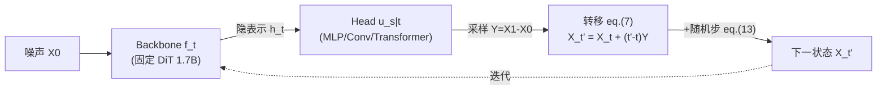

# Exploring the Design Space of Transition Matching

**会议**: ICLR 2026  
**OpenReview**: [https://openreview.net/forum?id=jR8HV4uTcf](https://openreview.net/forum?id=jR8HV4uTcf)  
**代码**: 待确认  
**领域**: 图像生成 / 生成模型  
**关键词**: Transition Matching, 文本到图像生成, 流匹配, backbone-head 架构, 随机采样器  

## 一句话总结
本文对 Transition Matching（TM）中长期被当作固定附件的"head"模块做了一次大规模系统性消融（56 个 1.7B 文生图模型、549 次评测），并提出一个零额外开销的随机采样器，最终给出最优配方 DTM++（MLP head + 对数正态时间加权 + 高频随机采样），在所有指标聚合排名上达到 SOTA。

## 研究背景与动机
**领域现状**：扩散模型、流匹配（FM）和连续态自回归模型本质上都是"逐步把噪声变成数据"，而 Transition Matching（Shaul et al., 2025）把它们统一起来——区别在于 TM 用一个"内部"生成模型来实现每一步转移核 $p^\theta_{t'|t}(\cdot|X_t)$，因此转移比扩散那种逐坐标独立的高斯核 $\mathcal{N}(\cdot|\mu_t(x),\sigma_t^2 I)$ 表达力强得多。为了让这种昂贵的设定可计算，TM 采用 backbone-head 范式：大 backbone（通常是大 transformer）编码当前状态得到隐表示 $h_t$，小 head 负责把隐表示翻译成下一步状态。

**现有痛点**：backbone 架构（如 DiT）已经被研究透了，但 head 几乎被所有工作当成"一个 MLP 或轻量映射"草草带过，没人系统研究过它的架构、规模、参数化、时间加权该怎么选。

**核心矛盾**：head 体积小、计算便宜，恰恰意味着它有独立于 backbone 的缩放空间——在几乎不增加总成本的前提下，调 head 可能撬动生成质量、训练效率、推理效率三方面的提升。但这块设计空间几乎是空白，业界凭直觉用 MLP，既不知道哪些选择真有用，也不知道哪些是徒劳。

**本文目标**：以连续时间双向 TM 的文生图为试验场，把 head 的训练与推理设计空间彻底量化，给出可落地的最优配方与"哪些方向别再试了"的负面清单。

**核心 idea**：**把 head 当一等公民系统消融** —— 固定 backbone、数据、大部分超参，只动 head 相关变量（架构类型、规模、序列缩放、参数化 $Y$、head batch size、时间加权）和推理（效率-质量权衡、随机采样器），用统一的"4 数据集 × 25 指标聚合成单一排名"来公平横评。

## 方法详解

### 整体框架
TM 通过回归一个用户定义的监督过程 $q$ 来学习转移核。监督过程取标准线性路径 $X_t=(1-t)X_0+tX_1$（$X_0\sim\mathcal{N}(0,I)$ 噪声，$X_1\sim p_1$ 数据）。head 不直接预测下一状态 $X_{t'}$（那样会引入额外时间变量 $t'$），而是预测一个后验量 $Y$，再由 $Y$ 和 $X_t$ 解析地算出 $X_{t'}$。Shaul et al. 选的是噪声-数据之差 $Y=X_1-X_0$（称为 D-TM），因为线性路径下有 $X_{t'}=X_t+(t'-t)(X_1-X_0)$。head 本身用流匹配来采样 $Y$：训练时最小化 $L_{TM}=\mathbb{E}\|u^\phi_s(Y_s|h_t)-(Y_1-Y_0)\|^2$，推理时从 $Y_0\sim\mathcal{N}(0,I)$ 解 ODE $\frac{d}{ds}Y_s=u^\phi_{s|t}(Y_s|h_t)$ 到 $s=1$。本文的工作是在这个固定骨架上，把 head 的每一个设计旋钮逐一拧到底。

### 关键设计

**1. head 架构与规模：大 head 是浪费，MLP 就够。** 作者对比了三种 head——MLP（逐 token 独立处理 $u_{s|t}(y_i|h_t^i)\in\mathbb{R}^d$）、3×3 卷积（跨图像 token）、Transformer（token 间注意力，外加 $16{\times}16{\times}16\to 8{\times}8{\times}64$ reshape 提效），并各自从 x-small 到 x-large 扫了隐维 $d_h\in\{768,...,2048\}$。结论反直觉：有 head 相比无 head（纯 FM）大幅提升排名，但 head 越大几乎不再涨点——哪怕 head 大到接近 backbone 体积（>1 相对规模）也没用，而推理/训练时间却随之线性变贵，dense（backbone 兼当 head）尤其昂贵。所以小 head 已经吃满收益，是质量/成本的甜点。

**2. 参数化 $Y$ 的选择：预测差比预测端点更好。** 线性路径下 $X_t,X_{t'}$ 两式含 $X_0,X_1,X_{t'}$ 三个未知量，预测任意一个独立量都能反解出 $X_{t'}$，于是作者横扫 $Y\in\{X_1-X_0,\,X_1,\,X_0\}$。差参数化 $Y=X_1-X_0$ 明显优于去噪式 $Y=X_1$，而后者又远好于噪声预测 $Y=X_0$（MLP head 排名 0.36 vs 0.19 vs 0.10）。这条与 FM 里的 target 选择一致，说明"预测速度方向"的归纳偏置最优。

**3. 序列缩放：只对 Transformer head 管用。** 通过三个可学线性层 $L_{in,y},L_{in,h},L_{out,y}$ 把每个输入 token 扩成 $l$ 个 token 再喂给 head（$L_{out,y}\,u_{s|t}(L_{in,y}y\,|\,L_{in,h}h_t)$），扫 $l\in\{1,2^2,...,6^2\}$。Transformer head 随序列放大排名显著上升（因为注意力能在放大的 token 间共享信息），而 MLP head 因逐 token 独立处理、放大无效。代价是序列缩放对推理速度影响有限，却显著拖慢训练——这正是作者把最优 Transformer 配方限制在 $l=4$ 的原因（$l=36$ 才能追平最佳 MLP 模型，但训练太贵）。

**4. head batch size 与时间加权：便宜的增益旋钮。** 对同一个 $(t,X_t)$，让 head 用多个 i.i.d. 的 $s$/噪声样本（MLP 上称 time-per-token, TPT），batch size $k_h\in\{1,4,16,64\}$。增大 batch 能涨点，但 Transformer head 在 $k_h\approx16$ 后饱和、且 $k_h>16$ 训练显著变慢，故取 16 为甜点。时间加权上，借鉴 FM 的非均匀采样：backbone 时间 $t$ 用对数正态 $\pi_{ln}(0,1)$（偏中段）最好，head 时间 $s$ 用 Beta 或对数正态都行；这是个零成本却实在的质量来源。

**5. 随机采样器：零额外算力换质量。** 核心观察是——只要新监督过程 $\tilde q$ 与训练用的 $q$ 边缘分布相同、且 $\tilde q_{t'|t,Y}$ 可高效采样，就能拿训练好的模型在 $\tilde q$ 下采样。对高斯噪声源，给定三个连续时刻 $t<t'<t''$ 和 $X_{t''}$，可由 $X_{t'}=\frac{1}{t''}(t'X_{t''}+Z),\ Z\sim\mathcal{N}(0,(t''-t')(t'+t''-2t't'')I)$ 反推更早时刻的 $X_{t'}$。直觉是：用 D-TM 预测的 $Y$ 先跳到未来 $X_{t''}$，再注入恰当独立噪声退回 $X_{t'}$，从而在不增加 NFE 的前提下引入额外随机性。两个超参——尺度 $c\in[0,1]$（$t''=t'+c(1-t')$）和频率 $\tau$（多久加一次随机步）。MLP head 在高频采样下从 0.51 跃到 0.66 排名（+0.15），是全文最高分；Transformer head 在低频下到 0.58（+0.06）。

## 实验关键数据

设置：backbone 固定为 24 层、隐维 2048 的 DiT（1.7B），数据 350M 文图对，图像经 SDXL-VAE 编码并 2×2 patch 成 $16{\times}16{\times}16$ 隐表示；500k 步训练。评测在 MS-COCO / PartiPrompts / GenEval / T2ICompBench 四数据集、25 个指标上，对全部 549 个模型逐指标排名后平均归一到 $[0,1]$ 的单一 Rank。

### 主实验表格

| 模型 | head 类型 | seq scale | batch | 时间加权 | 采样 | Aesthetic↑ (COCO) | ImageReward↑ (Parti) | Rank↑ |
|---|---|---|---|---|---|---|---|---|
| DTM (baseline) | MLP | 1 | 4 | $U\times U$ | linear | 5.64 | 0.51 | 0.36 |
| DTM | MLP | 1 | 16 | $\pi_{ln}\times\pi_{ln}$ | linear | 5.69 | 0.63 | 0.51 |
| **DTM++（最优）** | MLP | 1 | 16 | $\pi_{ln}\times\pi_{ln}$ | $c{=}0.2,\tau{=}1$ | 5.78 | 0.70 | **0.66** |
| DTM | Convolution | 1 | 4 | $U\times U$ | linear | 5.76 | 0.51 | 0.40 |
| DTM | Transformer | 1 | 4 | $U\times U$ | linear | 5.76 | 0.51 | 0.43 |
| **DTM+（亚军）** | Transformer | 4 | 16 | $\pi_{ln}\times\pi_{ln}$ | $c{=}0.8,\tau{=}1$ | 高 | — | 次优，图像美学最佳 |

DTM++ 以 0.66 Rank 登顶；DTM+（Transformer + 序列缩放 + 低频随机采样）在 Aesthetic / PickScore 等图像观感指标上最强，但因受益于随机采样较少而屈居第二。baseline 还包括 FM、AR/MAR（连续 token）、离散 AR/MAR，均在同一设置下训练评测。

### 消融实验表格

| 设计旋钮 | 关键对比 | 结论 |
|---|---|---|
| head 规模 | x-small → x-large（含 dense） | 规模与性能无强相关，大 head 只增成本 |
| 参数化 $Y$ | $X_1{-}X_0$ vs $X_1$ vs $X_0$ | 0.36 / 0.19 / 0.10（MLP），差参数化最优 |
| 序列缩放 $l$ | Transformer vs MLP | 仅 Transformer 受益，MLP 无感；$l{=}4$ 是训练成本甜点 |
| head batch $k_h$ | 1/4/16/64 | 越大越好但 Transformer 在 16 饱和，>16 训练变慢 |
| 随机采样 $(c,\tau)$ | MLP vs Transformer | MLP 高频 +0.15、Transformer 低频 +0.06 |

### 关键发现
- D-TM（MLP/Transformer/Conv）在效率-质量 Pareto 前沿上同时更快更好：FM 峰值需 32 中点采样（64 NFE，约 4 秒），而 D-TM-MLP 用 0.8 秒就能更高排名，约 **5× wall-clock 加速**。
- head 的价值在于"存在"而非"庞大"——加 head 本身大幅提分，扩大 head 几乎无用。
- 随机采样是免费午餐：同算力下 MLP head 涨 0.15 排名，且在高频区间稳定可复现。

## 亮点与洞察
- **把"无人问津的小模块"做成大规模实证科学**：56 次独立 1.7B 训练 + 549 次评测的体量，把 head 设计从玄学变成有数据支撑的工程指南，含正面甜点（小 MLP head + 差参数化 + 对数正态加权 + 高频随机采样）和负面清单（别堆 head 规模、MLP 别做序列缩放）。
- **随机采样器在数学上优雅且实用**：利用"同边缘分布即可换采样过程"这一自由度，零额外 NFE 把质量顶到全文最高，且与 MLP head 协同最佳。
- **统一聚合排名的评测设计**：4 数据集 25 指标压成单一 Rank，让 549 个模型的横评具备可比性，是这类大规模消融能成立的关键。

## 局限与展望
- **范围限定**：只覆盖连续时间双向 TM 的文生图、256×256、固定 1.7B backbone，是否迁移到视频、更高分辨率、更大/更小 backbone 尚待验证。
- **序列缩放的训练成本**：Transformer head 要 $l=36$ 才能追平最佳 MLP，但训练代价高到不实用，作者只能折中到 $l=4$——更高效的序列缩放实现是开放问题。
- **随机采样器假设高斯噪声源**：推导依赖 $p_0=\mathcal{N}(0,I)$，非高斯源的随机采样需另行设计。
- **结论的因果解释偏弱**：很多"为什么 MLP 不吃序列缩放/为什么大 head 无用"以观察+直觉解释为主，缺乏更深的理论刻画。

## 相关工作与启发
TM 由 Shaul et al. (2025) 提出，统一了扩散（Sohl-Dickstein/Ho/Song）、流匹配（Lipman/Liu/Albergo）与连续态自回归图像生成（Li et al. 2024 等）。本文与 Zhang et al. (2025) 的 dense 变体、Esser et al. (2024) 的 FM 时间加权直接对话，随机采样器灵感来自 Xu et al. (2023b)。对从业者的直接启发：在 backbone-head 生成范式里，**先把小 head 配好（架构选 MLP、参数化用差、加对数正态时间加权、配高频随机采样），再去想要不要堆参数**——这往往是性价比最高的提升路径。

## 评分
- **新颖性**: ⭐⭐⭐⭐ —— 不在于提出新范式，而在于第一个把 TM head 设计空间系统量化，并贡献了零成本随机采样器这一实用新工具。
- **实验充分度**: ⭐⭐⭐⭐⭐ —— 56 次 1.7B 训练、549 次评测、4 数据集 25 指标聚合排名，规模与严谨度在该主题上几乎是天花板。
- **写作质量**: ⭐⭐⭐⭐ —— 结构清晰、消融逐项交代、正负面结论都给，图表信息密度高；公式与采样伪代码完整。
- **价值**: ⭐⭐⭐⭐ —— 给出可直接照搬的最优配方与"别再试"清单，对做生成模型工程的人有很强落地参考价值，SOTA 结果也有说服力。

<!-- RELATED:START -->

## 相关论文

- [\[CVPR 2026\] Elucidating the Design Space of Arbitrary-Noise-Based Diffusion Models](../../CVPR2026/image_generation/eda_arbitrary_noise_diffusion_design_space.md)
- [\[ICML 2026\] Exploring and Exploiting Stability in Latent Flow Matching](../../ICML2026/image_generation/exploring_and_exploiting_stability_in_latent_flow_matching.md)
- [\[ICLR 2026\] Generalization of Diffusion Models Arises with a Balanced Representation Space](generalization_of_diffusion_models_arises_with_a_balanced_representation_space.md)
- [\[ICLR 2026\] Terminal Velocity Matching](terminal_velocity_matching.md)
- [\[ICLR 2026\] Branched Schrödinger Bridge Matching](branched_schrödinger_bridge_matching.md)

<!-- RELATED:END -->
