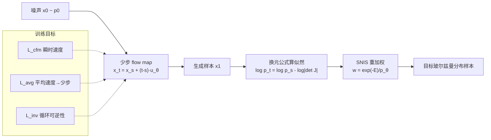

# FALCON: Few-step Accurate Likelihoods for Continuous Flows

**会议**: ICLR 2026  
**OpenReview**: [https://openreview.net/forum?id=FbssShlI4N](https://openreview.net/forum?id=FbssShlI4N)  
**代码**: [https://github.com/danyalrehman/FALCON](https://github.com/danyalrehman/FALCON)  
**领域**: 生成模型 / 流模型 / 玻尔兹曼生成器 / 分子采样  
**关键词**: Flow Map, Boltzmann Generator, 少步生成, 可逆性, 重要性采样, 似然估计  

## 一句话总结
FALCON 给少步 flow map 加了一项"循环可逆性"正则，使其在 4–16 步内既能快速采样、又能廉价精确地算似然，从而把连续流玻尔兹曼生成器的推理成本压低两个数量级，并全面超过当前最强的离散归一化流。

## 研究背景与动机
**领域现状**：从玻尔兹曼分布 $p(x) \propto \exp(-E(x))$ 中采样分子构象是统计物理的核心难题——能量地形高维、非光滑、多局部极小，传统的分子动力学（MD）和马尔可夫链蒙特卡洛（MCMC）极易陷在局部极小、混合极慢，产出大量相关样本。玻尔兹曼生成器（Boltzmann Generator, BG）的思路是训练一个生成模型 $p_\theta(x)$ 逼近目标分布，再用自归一化重要性采样（SNIS）把样本重加权到精确的 $p(x)$，从而摊销采样成本并保证统计一致性。

**现有痛点**：SNIS 的关键前提是对每个样本都能高效拿到 $p_\theta(x)$。当前主流 BG 用连续归一化流（CNF）+ flow matching 训练，表达力强、训练稳定，但**算似然奇贵**——需要解一个 $d{+}1$ 维 ODE，每个样本动辄上千次函数评估（NFE）：一是近似的迹估计（如 Hutchinson）精度不够、被迫做精确雅可比；二是要靠很多步来压住离散化误差。另一边，近年的少步 flow map 模型（一致性模型、MeanFlow、shortcut 等）采样飞快、架构自由，但**天生不提供高效似然**——只学了平均速度场 $u_\theta$，在收敛之前并不保证可逆，换元公式根本用不了。

**核心矛盾**：两类模型各占一半——CNF 有似然没速度，flow map 有速度没似然。BG 偏偏两样都要：既要快采样、又要精确似然给 SNIS 用。

**本文目标**：设计一个生成模型同时拥有"flow matching 的训练效率与架构自由"和"离散可逆模型的快采样、快似然"。

**核心 idea**：作者指出，要让 flow map 当合格的 BG，**并不需要**它逼近 CNF 那条特定的可逆映射，只需要它**自身可逆**即可——这是个弱得多的条件。于是只要往训练目标里加一项轻量的循环可逆性损失，就能在少步 regime 下解锁精确似然。**【弱化的可逆性要求 + 混合训练目标】** 是全文的关键洞察。

## 方法详解

### 整体框架
FALCON 学一个离散 flow map $X_u(x_s,s,t)=x_s+(t-s)u_\theta(x_s,s,t)$，把噪声 $p_0$ 在少数几步内推到目标分布 $p_1$。训练用三项损失的混合：flow matching 项 $\mathcal{L}_{cfm}$ 保证瞬时速度正确、平均速度项 $\mathcal{L}_{avg}$ 实现少步生成、可逆性项 $\mathcal{L}_{inv}$ 逼模型在收敛前就具备可逆性。采样时按任意时间离散 $x_{t_i}=x_{t_{i-1}}+(t_i-t_{i-1})u_\theta$ 走几步即可；算似然时因为映射可逆，直接用换元公式 $\log p_t = \log p_s - \log|\det J_{X_u}|$，雅可比只需 $d$ 次评估、行列式 $O(d^3)$ 相对 NFE 可忽略。

### 关键设计

**1. 循环可逆性损失：用最弱的约束换来合法的似然。** flow map 的换元公式只在最优解、且离散映射恰好等于连续映射 $X_u=X_v$ 时才严格成立，这个条件在实践中几乎不可能满足。作者的命题 2 给出了一个关键松弛：只要 $X_u$ 自身可逆，似然换元就处处成立，无需它复现 CNF 那条特定的流。据此引入正则项

$$\mathcal{L}_{inv}(\theta)=\mathbb{E}_{s,t,x_s}\big\|\,x_s - X_u\big(X_u(x_s,s,t),\,t,\,s\big)\big\|^2,$$

即"正向走一步再反向走回来要回到原点"。它把可逆性从"收敛时才有的副产品"变成"训练中被直接优化的目标"，使模型在远未完全收敛、仍处少步 regime 时就能安全地算似然。最终损失为 $\mathcal{L}=\mathcal{L}_{cfm}+\lambda_{avg}\mathcal{L}_{avg}+\lambda_r\mathcal{L}_{inv}$。

**2. 平均速度目标与单次 JVP 实现：少步采样的引擎。** 少步能力来自学习平均速度 $u(x_s,s,t)=\frac{1}{t-s}\int_s^t v(x_\tau,\tau)d\tau$，FALCON 采用与 MeanFlow 等价的损失

$$\mathcal{L}_{avg}\triangleq\mathbb{E}_{s,t,x_s}\big\|u_\theta - \mathrm{sg}\big(v(x_s,s)-(t-s)(v\,\partial_{x_s}u_\theta+\partial_s u_\theta)\big)\big\|^2,$$

其中 $\mathrm{sg}$ 是 stop-gradient。由于 $x_s=sx_1+(1-s)x_0$，可直接令 $v(x_s,s)=x_1-x_0$，无需另解 ODE。关键工程点是整项可用**一次前向自动微分的雅可比向量积（JVP）**算出：`u_θ, du_θ/ds = jvp(u_θ, (x_s,s,t), (v_s,1,0))`。更巧的是，只要把瞬时速度实现成 $v(x_s,s)=u_\theta(x_s,s,s)$（同一时间喂给 $u$），就能在采样 $s,t$ 时按一定比例取 $s=t$，从而把 $\mathcal{L}_{cfm}$ 和 $\mathcal{L}_{avg}$ 合并到同一目标里训练。

**3. 方向不连续的符号参数化：让反向 flow map 也成立。** FALCON 是首个同时需要正向与反向 flow map 的方法，而平均速度在 $s=t$ 处有方向性不连续：$t\to s^+$ 时 $u_\theta=v$，$t\to s^-$ 时 $u_\theta=-v$。若不处理，反向调用会取错号导致似然崩。解法是把网络参数化成 $u_\theta(x_s,s,t)=\mathrm{sign}(t-s)\,h_\theta(x_s,s,t)$，用一个显式符号项吸收方向跳变，让正反向共享同一个连续网络 $h_\theta$，从而干净地支持 $X_u(X_u(\cdot),t,s)$ 这种来回映射。

**4. 软等变 DiT 架构：把省下的算力换成表达力。** 以往分子 BG 受限于昂贵推理，只能用小型严格等变网络。FALCON 既然把推理压到几步，就能负担更强的骨干——直接用扩散 Transformer（DiT）外加一个额外的时间嵌入头，并用数据增强施加软 SO(3) 旋转等变、减去质心施加平移不变。这种"软等变"在扩展性上显著优于现有严格等变 flow 架构。

## 实验关键数据

### 主实验：丙氨酸二肽（ALDP）

| 算法 | ESS ↑ | E-W2 ↓ | T-W2 ↓ |
|---|---|---|---|
| ECNF++ (SOTA CNF) | 0.275 | 0.914 | 0.189 |
| SBG IS (SOTA 离散NF) | 0.030 | 0.873 | 0.439 |
| FALCON-A (Ours) | 0.097 | 0.512 | 0.180 |
| FALCON (Ours) | 0.067 | 0.225 | 0.402 |

### 更大体系：三/四/六肽（评测 $2\times10^5$ 样本）

| 算法 | AL3 ESS↑ | AL3 E-W2↓ | AL4 ESS↑ | AL4 E-W2↓ | AL6 ESS↑ | AL6 E-W2↓ |
|---|---|---|---|---|---|---|
| ECNF++ | 0.003 | 2.206 | 0.006 | 5.638 | — | 10.668 |
| SBG IS | 0.052 | 0.758 | 0.046 | 1.068 | 0.034 | 1.021 |
| FALCON | 0.077 | 0.544 | 0.055 | 0.686 | 0.060 | 0.892 |

### 训练+推理总耗时（GPU 小时，L40S）

| 体系 | ECNF++ | SBG | DiT-CNF | FALCON |
|---|---|---|---|---|
| 丙氨酸二肽 | 12.52 | 16.83 | 9.56 | **7.65** |
| 六肽 | 137.4 | 57.50 | 82.10 | **25.76** |

### 关键发现
- **比同等性能 CNF 快两个数量级**：在 T-W2 达到可比水平时，传统 CNF 的推理时间是 FALCON 的约 100 倍（Fig. 2）。
- **少样本仍碾压离散 NF**：4 步 FALCON 的 E-W2 比给了 $5\times10^6$ 样本（多 250×）的 SBG 还好（Fig. 4）。
- **可后验调步权衡**：高 NFE 自适应解法器（FALCON-Dopri5，~200–265 NFE）精度更高，而 4–16 步 FALCON 用两个数量级更少的评估仍超过所有基线（Table 5）。
- **正则不可或缺**：去掉 $\mathcal{L}_{inv}$ 后模型在少步 regime 失去数值可逆性，似然估计失效（Fig. 6）。

## 亮点与洞察
- **概念松弛是真正的杠杆**：论文最漂亮的一点不是工程，而是认识到"BG 不需要 flow map 复现 CNF，只需自身可逆"。命题 2 把一个看似必须的强条件（$X_u=X_v$）削成弱条件（$X_u$ 可逆），一个 cycle-consistency 项就够了。
- **似然成本被重新定价**：一旦映射可逆，算似然从"上千步 ODE + 迹估计"变成"几步 + 一次 $d$ 维雅可比"，把 CNF 最致命的瓶颈直接绕过。
- **省算力反哺架构**：少步推理解放了骨干网络，使 DiT 这种过去在 BG 里跑不起的强架构变得可行，性能与效率形成正循环。

## 局限与展望
- **似然仍是估计而非精确**：FALCON 的可逆性是数值/近似意义上的，命题只保证存在逆而非显式形式；极端精度需求下仍依赖正则收敛质量。
- **方向不连续处理偏 trick**：$\mathrm{sign}(t-s)$ 参数化解决了 $s=t$ 的跳变，但在该点附近的数值稳定性与更复杂动力学下是否够用尚待检验。
- **体系规模仍有限**：实验止于六肽量级的小分子，向蛋白质、大体系或显式溶剂的扩展性尚未验证。
- **软等变 vs 严格等变的取舍**：靠数据增强施加软等变换来了可扩展性，但在对称性要求严苛的任务上可能不如严格等变保真。

## 相关工作与启发
- **玻尔兹曼生成器谱系**：从 Noé 等的原始 BG，到 ECNF/ECNF++（Klein, Tan 等）的连续流、SBG（基于 TARFlow）的离散流，FALCON 处在"既要离散流的快、又要连续流的训练友好"的交叉点上。
- **少步 flow map 家族**：一致性模型、MeanFlow、shortcut、split-MeanFlow 等都在解决"少步快采样"，但都没碰似然；FALCON 把这条线第一次接到了需要精确似然的科学采样场景。
- **启发**：当一个强约束（精确复现某映射）阻碍落地时，回头问"任务真正需要的最弱性质是什么"往往能解锁全新设计空间——这里"只要可逆"就把不可能的似然计算变廉价。可逆性作为可训练正则，对其他需要密度的生成任务（如似然评估、异常检测）也有迁移价值。

## 评分
- **新颖性**: ⭐⭐⭐⭐⭐ 把"弱化可逆性要求 + cycle-consistency 正则"引入少步 flow map，首次让其支持精确似然，是概念层面的真创新而非堆 trick。
- **实验充分度**: ⭐⭐⭐⭐ 覆盖二/三/四/六肽，对比离散与连续两类强基线，含效率、可逆性、调步等多组消融；不足是仅限小分子、未验证大体系。
- **写作质量**: ⭐⭐⭐⭐ 动机—命题—损失—实现链条清晰，命题 1/2 把方法的合法性讲得严谨；少步方向不连续等细节也交代到位。
- **价值**: ⭐⭐⭐⭐⭐ 把连续流 BG 推理成本压两个数量级，直接打通了分子玻尔兹曼采样的可扩展性瓶颈，对计算物理/药物发现有实际意义。

<!-- RELATED:START -->

## 相关论文

- [\[ICLR 2026\] Generalised Flow Maps for Few-Step Generative Modelling on Riemannian Manifolds](generalised_flow_maps_for_few-step_generative_modelling_on_riemannian_manifolds.md)
- [\[ICLR 2026\] Large Scale Diffusion Distillation via Score-Regularized Continuous-Time Consistency](large_scale_diffusion_distillation_via_score-regularized_continuous-time_consist.md)
- [\[ICLR 2026\] On the Design of One-Step Diffusion via Shortcutting Flow Paths](on_the_design_of_one-step_diffusion_via_shortcutting_flow_paths.md)
- [\[ICLR 2026\] DistillKac: Few-Step Image Generation via Damped Wave Equations](distillkac_few-step_image_generation_via_damped_wave_equations.md)
- [\[ICLR 2026\] TwinFlow: Realizing One-step Generation on Large Models with Self-adversarial Flows](twinflow_realizing_one-step_generation_on_large_models_with_self-adversarial_flo.md)

<!-- RELATED:END -->
