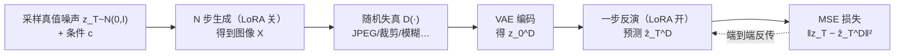

# FARI: Robust One-Step Inversion for Watermarking in Diffusion Models

**会议**: ICLR 2026  
**OpenReview**: [https://openreview.net/forum?id=YiGdNowqj6](https://openreview.net/forum?id=YiGdNowqj6)  
**代码**: 见补充材料（论文 Reproducibility Statement 承诺开源）  
**领域**: 图像生成 / 扩散模型水印  
**关键词**: 扩散模型水印, DDIM 反演, 一步反演, 轨迹蒸馏, 对抗训练, LoRA, 鲁棒性  

## 一句话总结
FARI 发现「反演轨迹的曲率远低于生成轨迹」这一几何不对称性，据此把多步 DDIM 反演蒸馏成一步，再用轻量对抗 LoRA 微调专门强化水印提取的鲁棒性——单卡 A6000 微调 20 分钟，一步反演就在水印验证鲁棒性上超过 50 步 DDIM。

## 研究背景与动机
**领域现状**：反演式水印（inversion-based watermarking）是认证扩散模型生成图像的主流路线——把水印嵌入初始噪声 $z_T$，生成时水印与图像语义深度耦合从而几乎不可见；提取时需要用 DDIM 反演把图像 $z_0$ 还原回噪声再解码。代表方法有把水印嵌到傅里叶域的 Tree-Ring、嵌到空间域的 Gaussian Shading 等。

**现有痛点**：反演这一步是整个流程的瓶颈——既慢又不准。已有的反演方法（EDICT、BELM、ExactDPM、ReNoise、Null-Text Inversion 等）几乎都在围着**内部截断误差**（discretization truncation + CFG 不可逆）做文章，靠迭代、优化或解析控制误差界来逼近。但这些方法都是为**图像编辑**设计的，目标是在干净图像上精确重建。

**核心矛盾**：水印场景的误差瓶颈完全不同。提取前图像往往已经历 JPEG 压缩、模糊、裁剪等外部失真，这些扰动在反演轨迹上**快速放大并主导误差**，而内部截断误差被它们彻底淹没。问题在于：内部截断误差正比于步长，所以传统方法被迫困在高 NFE（function evaluations 多）区间，无法同时满足「快」和「鲁棒」。更糟的是，想用**对抗训练**直接灌输鲁棒性的自然方案，会因为要在冗长多步反演链上反向传播而显存爆炸、计算不可行。

**本文目标**：为水印提取量身定制一个**又快又鲁棒**的反演器。

**核心 idea**：作者有两个关键观察——**(1) 几何不对称性**：反演轨迹的曲率显著低于生成轨迹，因而高度可压缩、适合低 NFE 逼近甚至一步逼近；**(2) 权衡转移**：水印验证里速度与截断误差的权衡不再关键，因为外部失真才是误差主导项。两者合起来意味着——**先把反演压成一步，不仅提速，更解锁了原本不可行的端到端对抗训练**，从而直接对准鲁棒性这一真正目标。

## 方法详解

### 整体框架
FARI（Fast Asymmetric Robust Inversion）把「一步蒸馏」和「对抗训练」融进**单一、端到端、基于 LoRA 的微调**里，且二者共享同一优化目标、收敛极快，因此不分两阶段。训练时给去噪器注入 LoRA 适配器：**生成阶段关闭 LoRA**（保持原模型生成质量不变），**反演阶段开启 LoRA** 做一步反演；推理时同理，去噪关 LoRA、提水印开 LoRA，无需部署第二个完整去噪器，显存友好。

### 关键设计

**1. 几何不对称发现：反演轨迹是「低曲率」的，所以一步就够。** 这是全文的物理起点。DDIM 反演要从 $z_{t-1}$ 解 $z_t$，但 $\epsilon_\theta(z_t,t)$ 在等式右边无法显式算出，常规做法是用分段线性假设 $\epsilon_\theta(z_t,t)\approx\epsilon_\theta(z_{t-1},t)$，而这要求步长足够小、实际很难满足，成为干净图像上误差的主要来源。作者进一步指出：在方向偏移与位置偏移的叠加下，轨迹的**曲率**（更高阶性质）也呈现深刻不对称——反演轨迹曲率显著低于去噪轨迹。直觉是：生成轨迹在接近噪声端（$t\to T$）曲率很高，因为不同图像会扩散到同一噪声点导致轨迹交叉、模型需不断纠偏；而反演时累积误差里**保留了源图像的低频信息**（噪声重建误差里能看到图像轮廓），这份残余语义帮助反演在接近噪声端时更准确地确定前进方向，于是曲率被压低。曲率与数值解的截断误差强相关——曲率趋零时单步即足够。作者实测把 NFE 从 15 降到 3，反演相对 50 步基线的偏差远小于生成，证实反演可容忍极低 NFE。

**2. 反向的一步蒸馏：不从真图模仿 50 步 DDIM，而是学「生成图→真值噪声」的直接映射。** 这是 FARI 与常规生成蒸馏的关键分歧。它**不**拿真实图像去模仿 50 步 DDIM 反演的输出（那会被 DDIM 反演自身的固有误差封顶），而是**先采样真值高斯噪声 $z_T$、完整生成得到图像、再学一个从该生成图直接回到真值 $z_T$ 的一步映射**。一步反演公式（无条件设置、guidance scale=1、null prompt）为：

$$\hat z_T^D = \sqrt{\bar\alpha_T}\, z_0^D + \sqrt{1-\bar\alpha_T}\,\epsilon_\theta(z_0^D, 0, \varnothing; \psi)$$

其中 $\psi$ 是 LoRA 参数。一个反直觉细节：公式里时间步取 $t=0$ 而非 $t=T$，因为单步场景下分段线性假设明显失效，取 $t\approx0$ 的小值能更好匹配潜变量 $z_0^D$、降低初始误差、改善收敛。这种「以生成的真值噪声为监督」的设计天然契合水印场景（水印本就嵌在真值噪声里），绕开了 DDIM 反演精度天花板。

**3. 一步带来的红利：端到端对抗训练直接灌输鲁棒性。** 一步反演把计算图从冗长多步压成单步，原本因显存爆炸而不可行的端到端对抗训练变得可做。每个训练循环：采噪声 $z_T$ 与条件 $c$ 生成图像 $X$（LoRA 关）→ 从 9 种增广集合里随机抽失真 $D(\cdot)$ 得 $X_D$ → VAE 编码为 $z_0^D$ → LoRA 开做一步反演重建噪声 → 优化目标为

$$\min_\psi\ \mathbb{E}_{z_T,c\in C,D\in T}\big[\,\|z_T-\hat z_T^D\|_2^2\,\big]$$

作者强调一个对照：计算上更省的「分解式目标」（类似扩散预训练那种逐步监督）学不到对抗复杂失真所需的**全局**鲁棒性，必须靠端到端。

**4. LoRA 作为可插拔鲁棒性外挂，零损生成质量。** 鲁棒性知识被外置存进 LoRA 参数（$W_0+BA$，秩 $r=8$，仅注入注意力相关模块）。生成时停用 LoRA 分支即可保证原模型生成质量丝毫不变，无需额外部署一份完整去噪器，显存高效；提水印时启用即可。LoRA 是即插即用增强模块，即便移除，DDIM 原则上仍能任意步数反演，只是误差会很大。

## 实验关键数据

设置：SD v1.5 / v2.1；下游水印为 Tree-Ring（TR，测 FPR=$10^{-3}$ 下的 TPR）与 Gaussian Shading（GS，测比特准确率）；训练用 MS-COCO 1000 条 prompt 跑 1000 步，batch=4，lr=1e-4，单卡 A6000 约 20 分钟；评测用 SDP 数据集 1000 条 prompt 在多种失真下进行。

### 主实验（节选 SD v1.5，数值越高越好）

**Gaussian Shading 比特准确率**

| 方法 | NFE | Clean | Adv. | JPEG | R.Crop | R.Drop | G.Noise | S&P |
|------|-----|-------|------|------|--------|--------|---------|-----|
| DDIM | 50 | 1.000 | 0.978 | 0.989 | 0.978 | 0.974 | 0.961 | 0.935 |
| DDIM | 1 | 1.000 | 0.938 | 0.970 | 0.886 | 0.881 | 0.940 | 0.911 |
| EDICT | 50 | 1.000 | 0.964 | 0.979 | 0.966 | 0.957 | 0.939 | 0.912 |
| DMD2 | 1 | 0.999 | 0.929 | 0.976 | 0.845 | 0.824 | 0.925 | 0.901 |
| **FARI** | **1** | **1.000** | **0.983** | **0.994** | **0.978** | **0.976** | **0.984** | **0.965** |

**Tree-Ring TPR@1e-3**

| 方法 | NFE | Adv. | JPEG | R.Crop | G.Noise | S&P |
|------|-----|------|------|--------|---------|-----|
| DDIM | 50 | 0.949 | 0.989 | 1.000 | 0.636 | 0.946 |
| DDIM | 1 | 0.863 | 0.905 | 0.602 | 0.891 | 0.990 |
| BELM | 50 | 0.592 | 0.768 | 0.032 | 0.384 | 0.852 |
| **FARI** | **1** | **0.997** | **1.000** | **1.000** | **0.980** | **1.000** |

要点：FARI 用**最低 NFE（1）拿到最鲁棒结果**，在 TR 上 Adv. 从 50 步 DDIM 的 0.949 提到 0.997、最难的高斯噪声从 0.636 提到 0.980；为编辑设计的 EDICT/BELM 在噪声重建上远不如其图像重建口碑（BELM 多步误差累积、对 guidance scale 失配极敏感，R.Crop 仅 0.032）；ExactDPM 用梯度下降优化轨迹但极慢（NFE>150），且对裁剪/丢弃这类「缺内容」失真会试图补全导致轨迹跑偏。

### 消融实验

| 消融项 | 设置 | 结论 |
|--------|------|------|
| LoRA 秩 | 1 / 2 / 4 / 8 / 16 / 32 / 64 | 秩=1 已相当好，增大仅边际提升，低秩足够 |
| 训练 NFE | 1 vs >1 | 多步训练**不升反降**：一步已足够逼近低曲率轨迹，多步前传反而累积误差 |
| 未见失真 | No Noise / Blind to Noise / All Noise | 对训练时**没见过**的失真也显著更鲁棒，泛化好 |
| 加速器对照 | AMED† / LCM-LoRA / DMD2 | 均不如 FARI：AMED 只预测单个中值步、解空间太窄；蒸馏类「从结构化图像预测反向 ODE 方向」与「从纯噪声预测」本质不同，迁移失败 |

### 关键发现
- **反演 ≠ 生成**：把生成加速/蒸馏方法直接搬来做一步反演会失败，因为从高度结构化的图像预测反向 ODE 方向，和从纯噪声预测是根本不同的问题。
- **泛化与强度**：失真强度越大，FARI 相对 DDIM 的优势越明显；guidance scale 在 2.5–12.5 大范围内性能仅轻微下降。
- **一步是最优而非妥协**：增加训练/反演步数既牺牲速度又略损性能，验证一步反演为最优选择。

## 亮点与洞察
- **问题重定义比方法更值钱**：全文最锋利之处是指出「水印场景的误差瓶颈是外部失真而非内部截断误差」，由此推翻「反演必须高 NFE」的默认前提——这种把社区共同优化目标证伪的洞察，价值高于具体网络设计。
- **几何不对称是真物理发现**：反演轨迹低曲率有可验证的曲率曲线与 NFE 容忍度实验支撑，并给出「累积误差保留源图低频信息→帮助定向」的机制解释，不是事后凑数。
- **「慢」是「不鲁棒」的根因而非并列缺点**：作者把提速与增鲁棒打通成因果链——只有先一步化，端到端对抗训练才可行——这个逻辑闭环很漂亮。
- **工程极简**：20 分钟单卡微调、LoRA 即插即用且零损生成质量，落地门槛极低。

## 局限与展望
- **干净图像精度被牺牲**：一步反演在无失真图像上精度下降，因此**不适合图像编辑**这类需要高保真反演的任务。
- **只绑 ODE 采样**：与所有反演式水印一样依赖 ODE 采样器，一旦换成 SDE 采样器会失效。
- **双刃剑隐忧**：作者自己指出一步反演大幅缩小计算图，可能让原本资源密集的**对抗去水印攻击**（需穿透多步反演反传梯度）变得更容易——既是未来工作，也是水印安全的潜在风险。
- 实验集中在 SD v1.5/v2.1，对 SDXL / 流匹配等新架构的迁移性未充分验证。

## 相关工作与启发
- **反演式水印三流派**：傅里叶域（Tree-Ring → RingID/ROBIN/ZoDiac）、空间域（Gaussian Shading → PRC/GS++/TAG-WM/VideoShield）、双域融合（GaussMarker）；FARI 是正交的「反演器」层改进，可叠加在任意一流派上。
- **反演方法**：EDICT/BELM/BDIA 改采样使其可逆，AIDI/ExactDPM/ReNoise 靠迭代/梯度对齐轨迹，NTI/NPI 优化 null-text——均为 training-free 编辑设计，在对抗水印提取下退化。
- **扩散加速**：低截断误差求解器（DPM-Solver、AMED）与蒸馏（progressive/consistency/DMD2）；FARI 借蒸馏思想但反过来蒸馏**反演**轨迹，且因低曲率而成本极低。
- **启发**：「为下游任务重新审视上游误差结构、把表面缺点（慢）证成深层障碍（无法对抗训练）的瓶颈」是一个可复用的研究范式，可迁移到其他需要反演/重建的安全任务（如深伪检测、模型溯源）。

## 评分
- **新颖性**: ⭐⭐⭐⭐⭐ 「反演轨迹低曲率」的几何不对称发现 + 「水印误差瓶颈在外部失真」的问题重定义，两者叠出一条干净的因果链，是真正的视角创新而非堆模块。
- **实验充分度**: ⭐⭐⭐⭐ 两模型、两水印、十余种失真、强度扫描、未见失真泛化、秩/步数消融都覆盖，对照基线选取讲究；扣分在仅限 SD v1.5/v2.1、缺 SDXL/流匹配验证。
- **写作质量**: ⭐⭐⭐⭐⭐ 动机递进极清晰（瓶颈→证伪前提→几何发现→方法），图 1/图 3 直接可视化曲率与误差，论证闭环。
- **价值**: ⭐⭐⭐⭐⭐ 把反演式水印从高 NFE 的实验室设置推向「20 分钟微调、一步提取、超 50 步鲁棒」的可大规模部署状态，对 AIGC 溯源/版权认证有直接落地意义。

<!-- RELATED:START -->

## 相关论文

- [\[ICLR 2026\] Guidance Watermarking for Diffusion Models](guidance_watermarking_for_diffusion_models.md)
- [\[CVPR 2026\] InverFill: One-Step Inversion for Enhanced Few-Step Diffusion Inpainting](../../CVPR2026/image_generation/inverfill_one-step_inversion_for_enhanced_few-step_diffusion_inpainting.md)
- [\[CVPR 2026\] SPDMark: Selective Parameter Displacement for Robust Video Watermarking](../../CVPR2026/image_generation/spdmark_selective_parameter_displacement_for_robust_video_watermarking.md)
- [\[ICLR 2026\] On the Design of One-Step Diffusion via Shortcutting Flow Paths](on_the_design_of_one-step_diffusion_via_shortcutting_flow_paths.md)
- [\[ICLR 2026\] SERUM: Simple, Efficient, Robust, and Unifying Marking for Diffusion-based Image Generation](serum_simple_efficient_robust_and_unifying_marking_for_diffusion-based_image_gen.md)

<!-- RELATED:END -->
