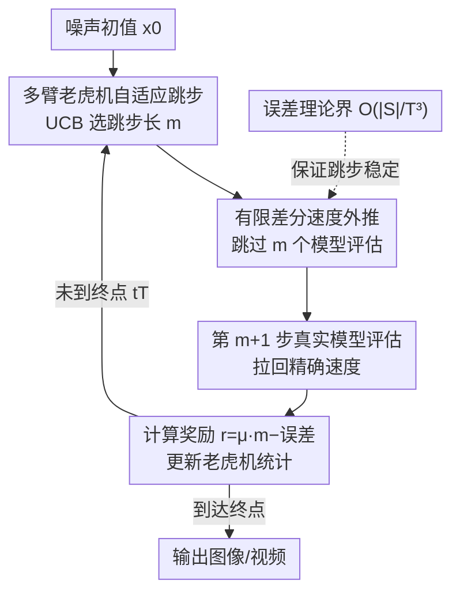

# FastFlow: Accelerating The Generative Flow Matching Models with Bandit Inference

**会议**: ICLR2026  
**OpenReview**: [https://openreview.net/forum?id=wWkyL8D9xd](https://openreview.net/forum?id=wWkyL8D9xd)  
**代码**: https://github.com/Div290/FastFlow  
**领域**: 扩散/流匹配生成 · 推理加速  
**关键词**: 流匹配, 推理加速, 多臂老虎机, 有限差分外推, 免训练

## 一句话总结
FastFlow 是一个免训练、即插即用的流匹配（flow matching）推理加速框架：它用有限差分外推零成本地近似掉那些"几乎走直线"的冗余去噪步，并用一个多臂老虎机在线决定每次能安全跳几步，在图像/视频生成与编辑任务上拿到 2.6× 以上加速且基本不掉质量。

## 研究背景与动机
**领域现状**：流匹配模型（FM）通过学习一个把简单分布搬运到数据分布的连续速度场，沿光滑轨迹迭代采样，已经在图像、视频生成上达到 SOTA 保真度，且比扩散模型收敛更快、采样步数更少。但推理时仍要把 ODE 离散成几十步、用前向 Euler 法**顺序**地一步步求解，每一步都要跑一次完整的大网络做速度预测，随着模型变大、分辨率/视频时长增加，延迟变得难以接受。

**现有痛点**：现有加速方案——蒸馏（distillation）、轨迹截断（trajectory truncation）、一致性训练（consistency），以及缓存类的 TeaCache——都有共同毛病：(1) 需要额外训练阶段、依赖大规模数据、引入非平凡的开销；(2) 用**统一**的推理调度处理所有输入，无视"有些样本几步就收敛、有些需要更长轨迹"的事实；(3) 像 TeaCache 这类缓存方法靠**手工设计**的相对 L1 距离阈值决定能不能复用缓存，一旦目标加速比定死（如 2×），它就退化成一套固定的跳步时刻表，对所有 prompt 都跳同一批 timestep，还要靠针对具体模型/任务调的多项式拟合才好用。

**核心矛盾**：跳步能省算力，但每跳一步就引入近似误差，误差会沿轨迹累积导致最终结果失真；而"该跳几步"这个决策的最优值**随样本复杂度变化**，不是一个能写死的常数。一刀切的静态调度无法同时兼顾"激进省算"和"逐样本保真"。

**本文目标**：在不重训、不加辅助网络的前提下，找出每条采样轨迹上真正冗余的去噪步并零成本近似它们；同时把"何时近似、何时必须算真模型"做成一个能**逐样本、逐时刻自适应**的在线决策。

**切入角度**：作者观察到 FM 因为训练目标就是拟合直线路径，去噪轨迹**近似线性**——但放大看，那些看似平直的中间段其实还有细微但系统性的速度修正，忽略它们会累积成大偏差（这正是 TeaCache 只用"上一步速度"外推的盲点）。

**核心 idea**：用过去若干步的速度做**有限差分外推**来近似未来速度（零额外前向传播），再把"跳几步后才需要算一次真模型"建模成**多臂老虎机**问题，让它在线学到何时跳、跳多少最划算。

## 方法详解

### 整体框架
FastFlow 套在标准 Euler 流匹配采样器之上，不改模型权重、不加网络。采样从噪声初值 $x_0$ 出发，本来要走 $T$ 步、每步都调一次速度模型 $M$；FastFlow 在每个"决策时刻"插入一个多臂老虎机 $B_{t_k}$，由它用 UCB 策略选一个跳步长 $m$，接下来这 $m$ 步全部用**有限差分外推**推进、完全不碰大网络，只在第 $m+1$ 步做一次真实的模型评估 $M$。这次真实评估既把轨迹拉回精确值，又提供反馈：把外推速度和真实速度的误差与"跳了多少步"组合成奖励，回灌给老虎机更新统计。如此循环直到终点 $t_T$，输出图像/视频。整个机制是逐样本自适应的——在轨迹平直处大胆多跳，在高曲率/不稳定处退回精确计算。

### 关键设计

**1. 有限差分速度外推：零成本近似掉冗余去噪步**

痛点在于：直接跳步必须先知道被跳过那些步的速度，否则 Euler 更新无从下手。最朴素的做法是假设 $\frac{dv(x_t,t)}{dt}\to 0$、直接复用最近一次的速度估计（TeaCache 类的思路），但作者发现即使在看起来平直光滑的区段，速度也在做细微调整，把它当常数会累积出可见误差。FastFlow 的做法是对 $x_{t+\Delta t}$ 做一阶 Taylor 展开并对时间求导，得到 $v(x_{t+\Delta t}, t+\Delta t)=v(x_t,t)+\Delta t\cdot\frac{dv(x_t,t)}{dt}$，再用**过去两次真实速度估计的有限差分**去近似那个导数项（$p<k$）：

$$v(x_{k+1}, t_{k+1}) \approx v(x_k, t_k) + \Delta t_k \cdot \frac{v(x_{t_k}, t_k) - v(x_{t_p}, t_p)}{t_k - t_p}.$$

这相当于把"上一步速度"升级成"上一步速度 + 速度变化的线性趋势"，捕捉到了那些被一阶常数近似漏掉的细微修正。关键是它**只用已经算过的历史速度做减法和缩放**，不触发任何额外前向传播，因此跳过的中间步是真正的零计算成本。作者还在附录里把这种带 $m$ 跳的更新重写成线性多步求解器的形式，说明它本质上是更高阶的数值积分而非粗暴丢步。

**2. 多臂老虎机自适应跳步：在线学习"安全跳几步"**

有了外推手段，剩下的核心难题是**该跳多少步**——跳少了省不下算力，跳多了误差爆炸，而且最优跳步数随样本复杂度变化、无法写死。FastFlow 把它建模成多臂老虎机（MAB）：在每个时间步 $t_k$ 单独实例化一个老虎机 $B_{t_k}$，它的每个臂 $\alpha_{t_k}$ 对应"跳过 $\alpha$ 步再做下一次真实评估"。选臂用 UCB（上置信界）策略 $\alpha_{t_k}\leftarrow\arg\max_{\alpha}\big[Q(\alpha)+\gamma\sqrt{\ln n/N(\alpha)}\big]$（探索常数 $\gamma=2.0$），在"试新跳法"和"用已知高收益跳法"之间平衡。每跳一轮后，用第 $m+1$ 步的真实评估算奖励：

$$r(\alpha_{t_k}) = \mu \cdot \alpha_{t_k} - \ell\big(\hat{v}(x_{t_k}, t_k),\, v(x_{t_k}, t_k)\big),$$

其中 $\ell$ 是外推速度与真实速度的差异度量（如 MSE），$\mu>0$ 是把"跳步数量级"和"误差量级"对齐的折中系数。前一项 $\mu\cdot\alpha$ 奖励多跳、提速，后一项惩罚外推漂移、锚住保真度——这道奖励直接量化了近似带来的速度漂移，因为小误差会沿轨迹累积，惩罚它才能保证稳定。老虎机持续按这个折中更新臂的均值奖励 $Q$ 和计数 $N$，于是在平直区学会激进跳、在高曲率区退回逐步精确计算。这个机制极轻量：老虎机只维护一张奖励列表，几乎不增加开销。$\mu$ 自身也自适应设为 $\mu=\frac{\max_t \mathrm{MSE}(\hat v_t, v_t)}{\text{total steps}}$，最大 MSE 从第一次完整生成估计得到，使奖励两项始终同量级、老虎机更新稳定。

**3. 误差理论界：给"跳步不会崩"一个形式化保证**

自适应跳步最让人担心的是误差失控，作者用 Thm 3.1 给出了形式化保证：设 $\{x^{\text{true}}_{t_k}\}$ 是精确速度场 + Euler 的轨迹，$\{x^{\text{approx}}_{t_k}\}$ 是在子集 $S$ 上跳步外推的轨迹，在速度场光滑假设、均匀步长 $\Delta t=1/T$ 下，$T$ 步后的累积末端误差

$$e_T := \|x^{\text{approx}}_{t_T} - x^{\text{true}}_{t_T}\| = O\!\left(\frac{|S|}{T^3}\right).$$

这条界说明最终误差**随跳步数 $|S|$ 线性增长、随总步数 $T$ 以三次方衰减**——意味着步数越密、跳同样比例的步代价越小，给"跳步是安全的"提供了理论底气，也解释了为什么老虎机能在不显著损质量的前提下大胆跳。⚠️ 证明细节在附录 B，常数因子以原文为准。

### 损失函数 / 训练策略
FastFlow **不涉及任何训练或微调**：速度模型 $M$ 是冻结的现成 FM 模型，老虎机靠在线交互学习。唯一的"学习"发生在推理时——老虎机用第一个 prompt 做一次完整生成来初始化，保证每个臂至少被玩过一次（冷启动），之后边采样边更新 $Q$、$N$。臂集合随剩余步数自适应（步数越少可跳越短），但对所有模型/任务固定，只在生成总步数变化时更新，体现"模型无关、即插即用"。

## 实验关键数据

### 主实验
覆盖文生图（GenEval，553 prompt）、图像编辑（GEdit，606 指令，GPT-4.1 当裁判打分）、文生视频（VBench 子集 80 prompt）三类任务；模型涵盖 BAGEL、Flux-Kontext、PeRFlow、Step-1X-Edit、HunyuanVideo。加速比相对 full-50 步生成、单卡 A100。

GenEval 文生图（节选 Table 1，↑越高越好，Spd. 加速比，Lat. 单图延迟秒）：

| 方法 | Overall ↑ | CLIPIQA ↑ | 加速 ↑ | 延迟 ↓ |
|------|-----------|-----------|--------|--------|
| Full 50（保真上界） | 0.78 | 0.85 | 1.00× | 36.2 |
| Full 25 | 0.77 | 0.82 | 2.00× | 19.5 |
| InstaFlow（蒸馏） | 0.33 | 0.74 | 50.0× | 01.5 |
| PeRFlow | 0.58 | 0.80 | 5.00× | 08.2 |
| TeaCache | 0.76 | 0.80 | 1.85× | 20.6 |
| **FastFlow-50** | **0.78** | **0.83** | **2.65×** | 13.7 |
| **FastFlow-25** | 0.77 | 0.80 | 4.54× | 08.6 |

同等加速档位下，FastFlow 的 Overall 与 CLIPIQA 都优于 TeaCache，且 FastFlow-50 几乎追平 Full-50 的质量却快 2.65×。蒸馏类 InstaFlow 虽然 50× 极快但质量崩到 0.33。第二组模型（Table 2）上 FastFlow 同样以 2.57× 拿到与 Full-50 持平的 0.64 Overall，优于 TeaCache 的速度-质量折中。图像编辑（Fig.2）和视频生成（Fig.3，VBench + BRISQUE）上 FastFlow 在相同加速下质量均高于基线，许多情形下编辑质量还略有提升。

### 消融实验

| 配置 | 关键现象 | 说明 |
|------|---------|------|
| 完整 FastFlow | 2.6×+ 加速、质量基本不掉 | 有限差分外推 + MAB 自适应 |
| 一阶常数近似（复用上一步速度） | 累积误差明显（Fig.4） | 去掉有限差分项，退化成 TeaCache 式假设 |
| 固定跳步调度（如 TeaCache 定死 2×） | 对所有 prompt 跳同一批 timestep | 去掉 MAB 自适应，无视样本复杂度 |
| 调 $\mu$（Fig.7） | $\mu$ 越大越偏激进跳、越小越保真 | 控制速度-精度折中 |

### 关键发现
- **速度并非平直常数（Fig.4）**：BAGEL 上相邻步速度的相对 L1 误差呈清晰三阶段——先建立粗略流向、中段做细微修正、末段再调整定型；这些中段修正虽小但非可忽略，正是 TeaCache 只看"放大后的近似常数趋势"会漏掉的部分，也是 FastFlow 用有限差分而非常数近似的直接动机。
- **MAB 比手工阈值更会"看样本下菜"**：固定加速比时 TeaCache 退化成对所有输入的固定跳步时刻表，而 FastFlow 的老虎机逐样本调整跳步，省下更多冗余计算的同时把误差锁在低位。
- **跨任务/模型泛化**：同一套机制无需改动即在图像生成、编辑、视频三类任务和多个 backbone 上稳定加速，印证"模型无关、免训练"的卖点。

## 亮点与洞察
- **把"何时近似"做成在线学习问题**：用多臂老虎机替代手工阈值，是这篇最巧的一笔——决策对象（跳几步）天然离散有限、反馈（真实评估的误差）天然可得，MAB 几乎是量身定做且开销可忽略。这个"用轻量在线决策器调度重型生成模型"的思路可迁移到任何"逐步、可跳过、有可量化误差反馈"的推理过程（如扩散模型、级联检索、早退网络）。
- **有限差分外推升级了缓存类方法的近似阶**：从"复用上一步速度"（零阶常数）升到"速度 + 线性变化趋势"（一阶有限差分），代价仍是零前向传播，却显著压低累积误差——这是个低成本高回报、可直接套进任何 Euler 求解器的 trick。
- **理论界给工程方法兜底**：$O(|S|/T^3)$ 这条界把"为什么敢跳"讲清楚了——步数越密跳同样比例越安全，让自适应跳步从"经验上能用"变成"有界可控"。

## 局限与展望
- **依赖近似线性轨迹假设**：方法建立在 FM 训练出近直线轨迹之上；对轨迹强非线性、高曲率主导的模型，可跳步空间会被老虎机自动压缩，加速收益可能远不及 2.6×（理论界也随高曲率退化）。
- **每个时间步一个老虎机 + 冷启动开销**：要为每个 timestep 维护独立老虎机，并用第一个 prompt 跑一次完整生成来初始化，单 prompt/短批场景下这次冷启动的相对开销不可忽略；论文也未深入讨论老虎机统计跨 prompt 复用是否会因分布漂移而失准。
- **误差度量与 $\mu$ 的选择**：奖励里的 $\ell$ 用 MSE、$\mu$ 用最大 MSE 估计，都是相对朴素的代理，未必和最终感知质量严格对齐；不同任务下是否需要更贴近人眼的误差度量值得探究。
- **改进方向**：把单步老虎机换成带上下文的 contextual bandit（用当前 $x_{t_k}$ 的特征做条件），或让臂集合也在线学习，可能进一步提升逐样本自适应能力。

## 相关工作与启发
- **vs 蒸馏类（InstaFlow / PeRFlow / Diff2Flow）**：它们重训出一个少步甚至一步生成器，速度极致但要大规模数据训练且质量明显下滑（InstaFlow 50× 但 Overall 仅 0.33）；FastFlow 免训练、即插即用，以适中加速换近乎无损的质量。
- **vs 缓存类 TeaCache**：两者都跳冗余步，但 TeaCache 用手工相对 L1 阈值 + 多项式拟合、定加速比下退化成固定时刻表；FastFlow 用一阶有限差分（更高近似阶）+ MAB（逐样本自适应），同加速下质量更高。
- **vs 高阶数值求解器（PNDM 等）**：高阶 solver 改善速度-质量折中但仍对所有步统一处理；FastFlow 的多步外推可视为"自适应触发的高阶更新"，由老虎机决定何处升阶跳步。

## 评分
- 新颖性: ⭐⭐⭐⭐☆ 用多臂老虎机做流匹配跳步决策、配一阶有限差分外推，组合新颖且角度刁钻。
- 实验充分度: ⭐⭐⭐⭐☆ 覆盖图像/视频生成与编辑三任务、多 backbone，有理论界和误差分析，但缺与更多自适应缓存方法的细粒度对比。
- 写作质量: ⭐⭐⭐⭐☆ 动机（Fig.4 三阶段观察）到方法到理论界推导链条清晰，伪代码完整。
- 价值: ⭐⭐⭐⭐☆ 免训练即插即用、2.6×+ 加速且基本不掉质量，对生成模型实时部署有直接工程价值。

<!-- RELATED:START -->

## 相关论文

- [\[ICLR 2026\] MeanCache: From Instantaneous to Average Velocity for Accelerating Flow Matching Inference](meancache_from_instantaneous_to_average_velocity_for_accelerating_flow_matching_.md)
- [\[ICLR 2026\] Gauge Flow Matching: Efficient Constrained Generative Modeling over General Convex Set and Beyond](gauge_flow_matching_efficient_constrained_generative_modeling_over_general_conve.md)
- [\[ICLR 2026\] AlignFlow: Improving Flow-based Generative Models with Semi-Discrete Optimal Transport](alignflow_improving_flow-based_generative_models_with_semi-discrete_optimal_tran.md)
- [\[ICLR 2026\] LapFlow: Laplacian Multi-scale Flow Matching for Generative Modeling](lapflow_laplacian_multi-scale_flow_matching_for_generative_modeling.md)
- [\[ICLR 2026\] Delay Flow Matching](delay_flow_matching.md)

<!-- RELATED:END -->
